<!-- SRC: HDCP 2024 Contents - 23 June 2025.pdf | PAGE: 1 -->

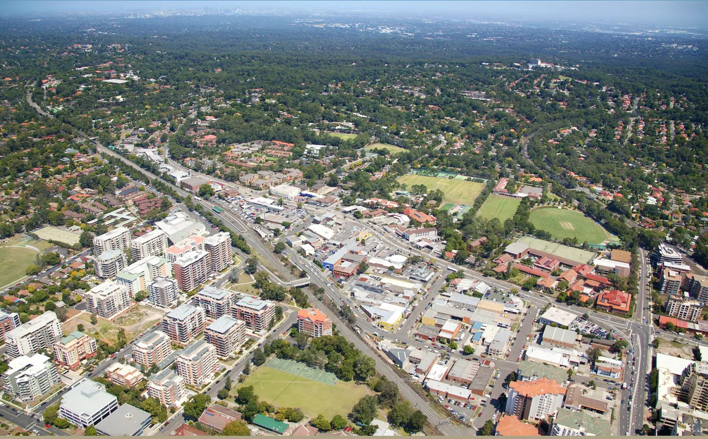

Hornsby Development Control Plan 2024

<!-- SRC: HDCP 2024 Contents - 23 June 2025.pdf | PAGE: 2 -->

# Hornsby Development Control Plan 2024

Prepared by Planning and Compliance Division, Hornsby Shire Council

In force: 18 July 2024

## Amendments

| Date           | Summary of Amendment                                                                                                                                                                                                                                                                                                                                                                                                                                                                                                                                                                                                                                                                                                                                                                     |
|----------------|------------------------------------------------------------------------------------------------------------------------------------------------------------------------------------------------------------------------------------------------------------------------------------------------------------------------------------------------------------------------------------------------------------------------------------------------------------------------------------------------------------------------------------------------------------------------------------------------------------------------------------------------------------------------------------------------------------------------------------------------------------------------------------------|
| 26 August 2024 | Amendments to Part 1 'Air Quality' to prohibit indoor gas and require indoor cooktops, ovens, and heaters to be electric in new residential development                                                                                                                                                                                                                                                                                                                                                                                                                                                                                                                                                                                                                                  |
| 19 May 2025    | Amendments to Part 1 'Watercourses' to include references to Riparian Land Map, incorporate car parking requirements relating to the Hornsby Town Centre Masterplan and Hornsby Transport Oriented Development rezoning, and notes relating to bush fire assessments. Amendments to Part 4 'Hornsby Town Centre' relating to controls to achieve the outcomes of the Hornsby Town Centre Masterplan and Hornsby Transport Oriented Development rezoning.                                                                                                                                                                                                                                                                                                                                 |
| 23 June 2025   | Amendments to Part 1 Stormwater Management to acknowledge dual occupancy development as requiring an on-site stormwater detention system and Transport and Parking to set minimum car parking requirements for dual occupancies. Amendments to Part 3 to expand Dwellings section to now incorporate dual occupancy provisions and move provisions from Part 9.6 Beecroft Heritage Precinct to Residential Flat Buildings (5 Storeys). Amendments to Part 4 to move provisions from Part 9.6 Beecroft Heritage Precinct to Business Lands. Amendments to Part 6 Urban Subdivision to include dual occupancy subdivision provisions. Amendments to Part 9 to provide a better structure in line with best practice, make submission requirements clear and improve graphics and examples. |

## Hornsby Shire Council Administration Centre at Hornsby Library

28-44 George Street, Hornsby

PO Box 37

Hornsby NSW 1630

Phone

(02) 9847 6666

Fax

(02) 9847 6999

Email hsc@hornsby.nsw.gov.au

Internet hornsby.nsw.gov.au

Opening Hours Monday - Friday 8:30am - 5pm

<!-- SRC: HDCP 2024 Contents - 23 June 2025.pdf | PAGE: 3 -->

# Contents

CONTENTS ............................................................... I

1

GENERAL

1-2

1.1

Introduction

1-3

1.2

1.1.1

Preamble

1-3

1.1.2

Commencement date

1-3

1.1.3

Objectives

1-3

1.1.4

Strategic context

1-3

1.1.5

Relationship to other plans and policies

1-5

1.1.6

Development contributions and planning

1.2.1

agreements

1-5

Administration

1-6

1.3

How to use this DCP

1-6

1.2.2

Desired outcomes, prescriptive measures,

1.2.3

figure and notes

1-8

Interpretation

1-8

1.2.4

Submitting an application

1-8

1.2.5

Notification and exhibition

1-8

1.2.6

Tree and Vegetation Preservation

1-9

1.3.1

General Controls

1-16

2

Natural Environment

1-16

1.3.2

Built Environment

1-24

1.3.3

Hazards

1-47

RURAL ................................................... 2-1

2.1

Rural Buildings

2-5

2.2

2.1.1

Scale

2-5

2.1.2

Setbacks

2-7

2.1.3

Landscaping

2-8

2.1.4

Open Space

2-9

2.1.5

Vehicle Access and Parking

2-9

2.1.6

Design Details

2-10

2.2.1

Rural Land Uses

2-11

c

Intensive Plant Agriculture

2-11

2.2.2

Water Storage Facilities (Dams)

2-12

2.2.3

Garden Centres, Plant Nurseries and

2.2.4

Landscaping Material Supplies

2-13

Animal Boarding or Training Establishments

2.2.5

Rural Industry

2-14

2-15

2.2.6

Rural Workers' Dwelling

2-15

2.2.7

Secondary Dwelling

2-16

2.2.8

Bed and Breakfast and Short Term Rental

Accommodation

2-17

<!-- SRC: HDCP 2024 Contents - 23 June 2025.pdf | PAGE: 4 -->

c

<!-- SRC: HDCP 2024 Contents - 23 June 2025.pdf | PAGE: 5 -->

c

7.2

7.1.1

Site Requirements

7-4

7.1.2

Scale

7-5

7.1.3

Setbacks

7-7

7.1.4

Landscaping

7-8

7.1.5

Open Space

7-9

7.1.6

Privacy, Security and Sunlight

7-10

7.1.7

Vehicle Access and Parking

7-11

7.1.8

Design Details

7-12

7.2.1

Community Housing

7-14

7.3

Seniors Housing

7-14

7.2.2

Boarding Houses

7-14

7.2.3

Group Homes

7-14

7.3.1

Telecommunications

7-15

7.4

Location

7-15

7.3.2

Design

7-15

Temporary Events

7-16

7.5

Health Services Facility

7-17

8

7.5.1

Scale

7-18

7.5.2

Setbacks

7-19

7.5.3

Landscaping

7-19

7.5.4

Privacy, Security and Sunlight

7-20

7.5.5

Vehicle Access and Parking

7-21

7.5.6

Design Details

7-21

RIVER SETTLEMENTS ............................ 8-1

8.1

River Settlement Land

8-5

8.2

8.1.1

Desired Future Character

8-5

8.1.2

Scale

8-6

8.1.3

Setbacks

8-8

8.1.4

Landscaping

8-16

8.1.5

Open Space

8-17

8.1.6

Sunlight Access

8-17

8.1.7

Privacy and Views

8-18

8.1.8

Design Details

8-19

8.2.1

River Settlement Uses

8-22

8.3

Boat Sheds

8-22

8.2.2

Water Recreation Structures

8-23

8.2.3

Seawalls

8-27

8.2.4

Tourist and Visitor Accommodation

8-29

River Settlement Masterplans

8-30

8.3.1

River Settlement Masterplans - General 8-30

<!-- SRC: HDCP 2024 Contents - 23 June 2025.pdf | PAGE: 6 -->

c

<!-- SRC: HDCP 2024 Contents - 23 June 2025.pdf | PAGE: 7 -->

c

<!-- SRC: HDCP 2024 Contents - 23 June 2025.pdf | PAGE: 8 -->

HORNSBY DEVELOPMENT CONTROL PLAN 2024 | CONTENTS

<!-- SRC: HDCP 2024 Part 1 General - 23 June 2025.pdf | PAGE: 9 -->

## Hornsby Development Control Plan 2024

Part 1 General

c

<!-- SRC: HDCP 2024 Part 1 General - 23 June 2025.pdf | PAGE: 10 -->

# 1 General

c

<!-- SRC: HDCP 2024 Part 1 General - 23 June 2025.pdf | PAGE: 11 -->

## 1.1 Introduction

### 1.1.1 Preamble

This Development Control Plan (DCP) applies to all land within the Hornsby Local Government Area. This plan is called the Hornsby Development Control Plan 2024.

### 1.1.2 Commencement date

This DCP was adopted by Council on 10 July 2024 and came into effect on 18 July 2024. It is subject to amendments, which are listed in the Schedule of Amendments at the end of this part.

### 1.1.3 Objectives

The objectives of this DCP are to:

-  Provide a comprehensive document that provides a framework for development of land in the Hornsby Local Government Area,
-  Clearly set out the processes, procedures and responsibilities for the involvement of the community and key stakeholders in the development of land,
-  Promote development that is consistent with Council's adopted Local Strategic Planning Statement and Sustainable Hornsby 2040 Strategy,
-  Protect and enhance the natural and built environment, and ensure that satisfactory measures are incorporated to ameliorate any impact arising from development,
-  Encourage high quality development that contributes to the existing or desired future character of the area, with particular emphasis on the integration of buildings with a landscaped setting,
-  Protect and enhance the public domain,
-  Minimise risk to the community, and
-  Ensure that development incorporates the principles of Ecologically Sustainable Development (ESD).
c

### 1.1.4 Strategic context

The planning controls within this DCP are informed by Council's studies and adopted strategies including:

#### Hornsby Local Strategic Planning Statement (LSPS) (2020)

- The Hornsby LSPS sets out a 20-year vision for land use; the special character and values that are to be preserved; shared community values; and how Hornsby Council will manage growth and change. The planning priorities identified within the LSPS will help guide land use decisions and earmark changes to our local land use plans, strategies and policies over the next 20 years.

#### Sustainable Hornsby 2040 Strategy (2021)

- The Sustainable Hornsby 2040 Strategy provides an overarching framework to achieve an innovative and environmentally sustainable Shire with resilient, diverse and thriving communities and ecosystems.

#### Hornsby Biodiversity Conservation Strategy (2020)

- The purpose of the Biodiversity Conservation Strategy is to guide Council and the community to protect, conserve, manage and sustain the biodiversity that exists within Hornsby Shire. The Strategy considers why biodiversity conservation is important and provides priorities for action. Goals of the Strategy include:
-  Conserve, manage and enhance biodiversity upon both public and private lands within the LGA;
-  Identify 'best practice' methods for managing and conserving biodiversity; and
-  Ensure environmental planning instruments and processes provide a strategic approach to achieving biodiversity conservation outcomes.

#### Hornsby Shire Sustainable Total Water Cycle Management Strategy (2005)

- The Hornsby Shire Sustainable Total Water Cycle Management Strategy promotes the implementation of sustainable total water cycle management. Sustainable water practices include:
-  Maintenance of natural water courses,
-  Adoption of current best management practices to reduce the quantity and improve the quality of runoff, and

<!-- SRC: HDCP 2024 Part 1 General - 23 June 2025.pdf | PAGE: 12 -->

-  Minimised use of reticulated water through conservation practices and reuse of stormwater.

#### Hornsby Integrated Land Use and Transport Strategy (ILUTS) (2005)

- An objective of ILUTS is to reduce car travel by promoting other modes of transport. This includes promoting land use patterns and development controls that support the development of public transport services and the use of sustainable alternatives.

#### Hornsby Employment Land Study (2021)

- The Employment Land Study supports the Hornsby LSPS by identifying the key economic and employment issues affecting Hornsby Shire and providing directions to support sustainable growth of employment lands in the Shire.

#### Hornsby Shire Housing Strategy (2010) and Hornsby Local Housing Strategy (LHS) (2020)

- The Hornsby Shire Housing Strategy (2010) identifies areas suitable for the provision of additional housing to assist meeting Council's housing obligations into the future.
- A concentrated housing model has been adopted, with housing located in planned precincts rather than dispersed throughout urban areas. The housing form identified includes some mixed use commercial precincts and consists predominantly of 5 storey apartment buildings, along with a mix of townhouses, 3 storey walk-up flats, and 8-10 storey apartments. The Housing Strategy precincts are identified in Figure 3-a of this DCP.
- The Hornsby LHS (2020) outlines a 20-year vision and priorities for housing in Hornsby Shire in response to the Greater Sydney Region Plan and North District Plan. Objectives include:
-  Promoting design excellence to ensure delivery of high quality housing,
-  Minimising environmental impact and promoting ESD, and
-  Promoting sustainable locations for housing growth close to transport.

#### Hornsby Shire River Settlements and Foreshore Review (2007)

- The Hornsby Shire River Settlements and Foreshores Review investigate the suitability of the existing planning controls for the River Settlement areas having regard to emerging issues and current best practices.
c

#### Hornsby Shire Rural Lands Study (1995), Hornsby Shire Rural Lands Planning Provisions Review (2009) and Hornsby Shire Rural Lands Strategy (2022)

- The Hornsby Shire Rural Lands Study (1995) investigates the role of rural lands within the Local Government Area and provides controls for development to improve the environment. Development should aim to protect rural activities, resource lands, rural landscapes and biodiversity. To conserve the desirable values of the rural lands, the Study (1995) identified the qualities which give the areas its scenic and rural character.
- The Hornsby Shire Rural Lands Strategy (2022) provides key principles and place-based recommendations for managing Hornsby Shire's rural lands into the future and addresses obligations for rural lands prescribed by the State Government. It sets a strategic direction for rural areas and informs amendments to planning controls.

#### Public Domain Guidelines (2021)

- The Public Domain Guidelines include both generic controls to guide the development of the public domain across all urban areas of Hornsby Shire as well as specific projects within the nominated five housing strategy areas where major development is expected to occur: Asquith, Waitara, Beecroft, Thornleigh and West Pennant Hills.

#### Hornsby Town Centre Masterplan (2023)

- The Hornsby Town Centre Masterplan seeks to guide the future growth of the Hornsby Town Centre with opportunities for 4,900 new dwellings and 4,500 new jobs. It is envisioned that the future dwellings would be provided in slim-line residential towers up to 36 storeys in height and clustered around the train station and mall.

<!-- SRC: HDCP 2024 Part 1 General - 23 June 2025.pdf | PAGE: 13 -->

### 1.1.5 Relationship to other plans and policies

- This DCP is made under Section 3.43 of the Environmental Planning and Assessment Act 1979 (EP&A Act).
- This DCP must be read in conjunction with an environmental planning instrument (EPI) that applies to the land. EPIs include local environmental plans (LEP) and state environmental planning policies (SEPP).
- The Hornsby Local Environmental Plan 2013 (HLEP) is the only local environmental planning instrument that applies to land to which this DCP applies. A number of SEPPs may also apply to a development application. The provisions of any EPI prevail in the event of any inconsistency with this DCP.
- Section 1.2.6 prescribes controls for trees or other vegetation for the purpose of preservation.
c

### 1.1.6 Development contributions and planning agreements

- Some developments generate the need for development contributions where they result in an increase in the demand for community services an infrastructure. These developments will also need to address:
-  The Hornsby Shire Council Section 7.11 Development Contributions Plan 2020 - 2030.
-  The Hornsby Shire Council Section 7.12 Development Contributions Plan 2019 - 2029.
- Planning agreements may also be made in accordance with the requirements of the EP&A Act and are voluntary agreements between Council and an applicant for development.
Note: The above Development Contribution Plans are available for viewing on Council's website www.hornsby.nsw.gov.au.

<!-- SRC: HDCP 2024 Part 1 General - 23 June 2025.pdf | PAGE: 14 -->

## 1.2 Administration

### 1.2.1 How to use this DCP

- This DCP consists of a written document and figures, and is divided into a number of Parts. Within each Part are a number of Sections.
- The Parts to the DCP relate either to all land, the zoning of land, a development type or a specific area. An application may be required to meet development controls contained in a number of parts of the DCP. Table 1.2.1-a provides a summary of the DCP parts and where they should be applied.
Table 1.2.1-a: Description of DCP Parts

| DCP Part                   | Summary of applicability                                                                                                                                                                                                                                                                                                                                                                                                                                                                                                                                                                                     |
|----------------------------|--------------------------------------------------------------------------------------------------------------------------------------------------------------------------------------------------------------------------------------------------------------------------------------------------------------------------------------------------------------------------------------------------------------------------------------------------------------------------------------------------------------------------------------------------------------------------------------------------------------|
| Part 1 - General           | Part 1 provides general controls that apply to all development applications. Section 1.1 explains the purpose of the DCP. Section 1.2 provides administrative provisions including how to use the DCP, Notification and Exhibition requirements and Tree and Vegetation preservation controls. Section 1.3 establishes the general development controls for all development, including controls for the natural environment, built environment and hazards.                                                                                                                                                  |
| Part 2 - Rural             | Part 2 provides controls for development of land in the Rural area, as defined by Figure 2-a. Section 2.1 provides controls for Rural Buildings within defined zones. Section 2.2 provides controls for certain rural land uses. Section 2.3 provides Village Masterplans within the rural area. Section 2.4 provides controls for land zoned RU5 in Dural Village. Section 2.5 provides controls for extractive industries.                                                                                                                                                                                 |
| Part 3 - Residential       | Part 3 provides controls for development of prescribed residential land uses within prescribed residential localities (identified by the HLEP zone and HLEP height map).                                                                                                                                                                                                                                                                                                                                                                                                                                     |
| Part 4 - Business          | Part 4 provides controls for development of land in an Employment Zones E1, E2, E3 or MU1.                                                                                                                                                                                                                                                                                                                                                                                                                                                                                                                   |
| Part 5 - Industrial        | Part 5 provides controls for development of land in Employment Zone E4..                                                                                                                                                                                                                                                                                                                                                                                                                                                                                                                                     |
| Part 6 - Subdivision       | Part 6 provides specific additional controls for the subdivision of land.                                                                                                                                                                                                                                                                                                                                                                                                                                                                                                                                    |
| Part 7 - Community         | Part 7 provides specific controls for certain types of developments such as: child care centres, schools, places of public worship, community housing, telecommunications, temporary events and health service facilities.                                                                                                                                                                                                                                                                                                                                                                                   |
| Part 8 - River Settlements | Part 8 provides controls for development of land in the River Settlements, as defined by Figure 8-a. Section 8.1 provides controls for buildings within defined zones. Section 8.2 provides controls for certain types of River Settlement land uses, such as boat sheds, jetties and seawalls. Section 8.3 provides Masterplans for Berowra Waters and Kangaroo Point.                                                                                                                                                                                                                                      |
| Part 9 - Heritage          | Part 9 provides controls for development that may impact on heritage items or heritage conservation areas (HCA). Section 9.1 provides administrative controls for development involving heritage. Section 9.2 provides controls for development involving listed heritage items. Section 9.3 applies to HCAs. Section 9.4 applies to land in the vicinity of heritage items and HCAs. Section 9.5 applies to development of land (including undisturbed land) that may contain an Aboriginal relic or place. Section 9.6 provides specific controls for the Beecroft Heritage Precinct (redevelopment area). |
| Annexures                  | Contains detailed information referenced throughout the DCP.                                                                                                                                                                                                                                                                                                                                                                                                                                                                                                                                                 |

*Table 1.2.1-a: Description of DCP Parts*

c

- DCP Parts 2 to 9 inclusive incorporate an introductory statement that provides a more detailed strategic context for the planning controls within the Part.
- The applicability of each Part and/or Section of the DCP is described under the heading to each Part and/or Section. An example of the applicability of the DCP to various development types is provide in Table 1.2.1-b.

<!-- SRC: HDCP 2024 Part 1 General - 23 June 2025.pdf | PAGE: 15 -->

Table 1.2.1-b: Example of Application of DCP Controls

| DCP Part and Section                       | Dwelling house (residential zones)   | Dwelling house (Rural zones)    | Dwelling house in Heritage Conservation Area   | Dwelling and Jetty in Brooklyn (R2 zone)    | Townhouses (R3 zone)    | Residential flats (5 storey precinct)   | Mixed use building (Beecroft)    | Place of worship (E4 General Industrial)    | Residential subdivision (R2 zone)    | Rural subdivision (Rural zone)    | Child care centre (R2 Low density residential)    |
|--------------------------------------------|--------------------------------------|----------------------------------|------------------------------------------------|----------------------------------------------|--------------------------|-----------------------------------------|-----------------------------------|----------------------------------------------|---------------------------------------|------------------------------------|----------------------------------------------------|
| 1 General 2.1 Rural buildings              |                                     |                                 |                                               |                                              |                          |                                        |                                   |                                              |                                       |                                   |                                                    |
| 2.3 Village Masterplans                    | *                                    | *                                |                                                |                                              |                          |                                         |                                   |                                              | *                                     | *                                  | *                                                  |
| 3.1 Dwelling houses and dual occupancies   |                                     |                                  |                                               |                                             |                          |                                         |                                   |                                              | *                                     |                                    |                                                    |
| 3.2 Medium density housing                 |                                      |                                  |                                                |                                              |                         |                                         |                                   |                                              |                                       |                                    |                                                    |
| 3.4 Residential flat buildings (5 storeys) |                                      |                                  |                                                |                                              |                          |                                        |                                   |                                              |                                       |                                    |                                                    |
| 4.1 Commercial centres hierarchy           |                                      |                                  |                                                |                                              |                          |                                         |                                  |                                              |                                       |                                    |                                                    |
| 5 Industrial                               |                                      |                                  |                                                |                                              |                          |                                         |                                   |                                             |                                       |                                    |                                                    |
| 6.1 Subdivision (General provisions)       |                                      |                                  |                                                |                                              |                          |                                         |                                   |                                              |                                      |                                   |                                                    |
| 6.1 Residential subdivision                |                                      |                                  |                                                |                                              |                          |                                         |                                   |                                              |                                      |                                    |                                                    |
| 6.3. Rural subdivision                     |                                      |                                  |                                                |                                              |                          |                                         |                                   |                                              |                                       |                                   |                                                    |
| 6.4 Accessway design                       |                                      |                                  |                                                |                                              |                          |                                         |                                   |                                              |                                      |                                   |                                                    |
| 7.1 Community uses                         |                                      |                                  |                                                |                                              |                          |                                         |                                   |                                             |                                       |                                    |                                                   |
| 8.2 River settlement uses                  |                                      |                                  |                                                |                                             |                          |                                         |                                   |                                              |                                       |                                    |                                                    |
| 9 Heritage                                 | *                                    | *                                |                                               | *                                            | *                        | *                                       |                                  | *                                            | *                                     | *                                  | *                                                  |

*Table 1.2.1-b: Example of Application of DCP Controls*

#### Legend

 Applicable

- Section may be applicable
c

<!-- SRC: HDCP 2024 Part 1 General - 23 June 2025.pdf | PAGE: 16 -->

### 1.2.2 Desired outcomes, prescriptive measures, figure and notes

- Each DCP section includes desired outcomes, prescriptive measures, figures and notes.

#### Desired Outcomes

- Desired outcomes are statements that describe the outcomes sought.

#### Prescriptive Measures

- Prescriptive measures are requirements that are likely to achieve the desired outcomes.
- Where an application proposes a variation to the prescriptive measures of the DCP, justification should be provided with the application.
- Compliance with the prescriptive measures does not guarantee approval of an application. Each Development Application will also be assessed having regard to the HLEP, the provisions of this DCP, and other matters listed in Section 4.15 of EP&A Act.
- The provisions of this DCP will be consistently applied by the consent authority.

#### Figures

- Figures fulfil different functions within the DCP, as follows:
-  Figures are Prescriptive Measures when specifically referenced in the text above and are indicated by the annotation (C),
-  Figures interpret the prescriptive measures in the text. These Figures are not referenced in the text above and are indicated by the annotation (I). For example, Figure 3.1-a explains how the building height controls should be interpreted, and
-  Figures provide an example of how the prescriptive measures could be applied. The Figure title identifies that this is an example and are indicated by the annotation (E). For example, Figure 3.1-e is an example of how sun shading devices could be incorporated into the design of a dwelling house.

#### Notes

- Notes fulfil different functions within the DCP, as follows:
-  Notes include definitions and are essential for the interpretation of the DCP,
-  Notes provide references for further information, guidelines and cross-references to other legislative requirements,
-  Notes include educational material to assist in interpreting the DCP controls and identify preferred and/or discouraged outcomes, and
-  Notes identify some Development Application submission requirements.

### 1.2.3 Interpretation

- Where this DCP uses terms that are defined in the HLEP, the definitions in the HLEP are adopted. Other terms used throughout this DCP are defined in Annexure A Glossary of Terms.
- In addition, certain provisions of this DCP include definitions that are specific to those provisions.
- A reference in this DCP to any Australian Standard or legislation includes a reference to any amendment or replacement as made.

### 1.2.4 Submitting an application

- Development applications should be accompanied by information as described within:
-  the Hornsby Shire Council Development Application Submission Guideline,
-  this DCP,
-  environmental planning instruments (eg HLEP and applicable SEPPs), and
-  Environmental Planning and Assessment Regulation 2021.
- Development Applications for buildings 10 storeys or more, should be accompanied by a digitally produced, 3D massing model and information as described within:
-  State Environmental Planning Policy (Housing) 2021, Apartment Design Guide; and
-  Clause 6.8 Design Excellence of the HLEP.
Note:

For further information refer to the Hornsby Shire Council Development Application Submission Guideline available at Council's website www.hornsby.nsw.gov.au.

### 1.2.5 Notification and exhibition

The public exhibition strategy for a notifiable Development Application (DA) is outlined in Council's Community Engagement Plan. The Community Engagement Plan has been prepared in accordance with the EP&A Act and applies to all DAs lodged within Hornsby Shire.

For more information, refer to www.hornsby.nsw.gov.au.

<!-- SRC: HDCP 2024 Part 1 General - 23 June 2025.pdf | PAGE: 17 -->

### 1.2.6 Tree and Vegetation Preservation

This section is made in accordance with State Environmental Planning Policy (Biodiversity and Conservation) 2021 (the Biodiversity and Conservation SEPP) and prescribes the trees and vegetation to which the Biodiversity and Conservation SEPP and/or Clause 5.10 of the HLEP applies and the applicable approval process.

#### 1.2.6.1 Tree Preservation

##### Prescribed Trees

- The prescribed trees that are protected by the Biodiversity and Conservation SEPP and/or Clause 5.10 of the HLEP and this Section of the DCP includes:
-  trees except exempt tree species in Hornsby Shire, as listed in Table 1.2.6-a or subject to the Biodiversity Offset Scheme,
 all trees on land within a heritage conservation area described within the HLEP, and

-  all trees on land comprising heritage items listed within the HLEP.
- To damage or remove any tree protected under this DCP is prohibited without the written consent of Council, except in accordance with the exemptions prescribed in this part (under the heading 'Exempt Tree Work').
- For the purposes of this section:
-  Arborist (Project and Consulting) must have obtained through training and completed Australian Qualification Framework (AQF) Level 5, Diploma of Aboriculture.
-  A tree is defined as a long lived woody perennial plant with one or relatively few main stems with the potential to grow to a height greater than 3 metres.
-  Biodiversity Offset Scheme (BOS) means a scheme enacted by the Biodiversity Conservation Act 2016 and Biodiversity Conservation Regulation 2017. The BOS includes a Sensitive Biodiversity Values (SBV) Map and Area Threshold, either which trigger an alternative approval framework for the clearing of native vegetation. The SBV Map can be viewed on the DPE website and the SBV Area Thresholds are included as notes at the end of this section.
-  Native vegetation has the same meaning as in Part 5A of the Local Land Services Act 2013, with the exclusion of 60B(4) for the purposes of including marine vegetation in the definition of native vegetation.
-  Damage means to impair the value or usefulness, or weaken the health or the normal function of a tree or vegetation.
-  Remove means to cut down, knock down, kill, lop or destroy.
-  Prune means to selectively remove branches.
-  Tree Protection Zone means the area above or below ground at a given distance from the trunk set aside for the protection of a tree's roots and crown to provide for the viability and stability of a tree.
Table 1.2.6-a:  Exempt Tree Species in Hornsby Shire

| Botanical Name                                                                                                                                                                      | Common Name             |
|-------------------------------------------------------------------------------------------------------------------------------------------------------------------------------------|-------------------------|
| Acacia baileyana                                                                                                                                                                    | Cootamundra Wattle      |
| Acacia saligna                                                                                                                                                                      | Golden Wreath Wattle    |
| Acer negundo                                                                                                                                                                        | Box Elder               |
| Ailanthus altissima                                                                                                                                                                 | Tree of Heaven          |
| Alnus jorullensis                                                                                                                                                                   | Evergreen Alder         |
| Arecastrum romanzoffianum                                                                                                                                                           | Cocos Palm              |
| Celtis sinensis                                                                                                                                                                     | Hackberry               |
| Cinnamomum camphora                                                                                                                                                                 | Camphor Laurel          |
| All edible fruit and nut trees except native species such as Acmena spp (Lilli Pilli), Syzygium spp (Lilli Pilli) Elaeocarpus spp (Blueberry Ash) or Macadamia spp (Macadamia Tree) | Fruit and Nut trees     |
| Cotoneaster spp.                                                                                                                                                                    | Cotoneaster             |
| Eriobotrya japonica                                                                                                                                                                 | Loquat                  |
| Erythrina spp                                                                                                                                                                       | Coral tree              |
| Ficus elastica                                                                                                                                                                      | Rubber tree             |
| Gleditisa triacanthos                                                                                                                                                               | Honey Locust            |
| Lagunaria patersonii                                                                                                                                                                | Norfolk Island Hibiscus |
| Ligustrum spp                                                                                                                                                                       | Privet                  |
| Populus spp                                                                                                                                                                         | Poplar                  |
| Pyracantha augustifolia                                                                                                                                                             | Firethorn               |
| Robinia pseudoscacia                                                                                                                                                                | Golden Robinia          |
| Salix spp                                                                                                                                                                           | Willow                  |
| Schefflera actinophylla                                                                                                                                                             | Umbrella Tree           |
| Schinus spp                                                                                                                                                                         | Peppercorn Tree         |
| Toxicodendron spp                                                                                                                                                                   | Rhus                    |

*Table 1.2.6-a: Exempt Tree Species in Hornsby Shire*

##### Note:

Further information on exempt tree species in Hornsby Shire is available on Council's website www.hornsby.nsw.gov.au.

<!-- SRC: HDCP 2024 Part 1 General - 23 June 2025.pdf | PAGE: 18 -->

##### Exempt Tree Work

- The following exemptions to this part apply as set out below:
-  The removal of a tree deemed by Council in writing and shown by recorded photographic evidence to be dead and is not required as the habitat of native fauna.
-  The removal of species listed under the NSW Biosecurity Act 2015.
-  Pruning of a tree by less than 10% of the foliage area in accordance with AS 4373 Pruning of Amenity Trees not more than once annually.
-  The removal of or pruning of a tree where the base of the trunk of the tree at ground level is located within 3 metres of the foundation of an approved building (excluding detached garages, carports and other buildings ancillary to a dwelling house).
-  The removal of a tree less than 3 metres in height not located within native vegetation.
-  Trees deemed by Council in writing and shown by recorded photographic evidence or written evidence provided by a qualified Arborist (AQF.5) as an imminent risk to human life or is likely to cause substantial damage to property in the near future.
-  The removal of or pruning to a tree located on Council owned or managed land provided the works are undertaken by Council or Council authorized agents.
e. The exemptions at (d) above do not apply to:

-  All lands mapped as Biodiversity on the HLEP Terrestrial Biodiversity Map, or
-  Threatened species or land that contains native vegetation which is habitat for threatened species, populations or ecological communities listed in Schedule 1and 2 of the Biodiversity Conservation Act 2016 and protected matters listed under the Commonwealth EPBC Act 1999, or
-  Work that is contrary to a development consent that requires trees to be retained, or
-  Any work to a tree that is or forms part of a heritage item or heritage conservation area, requires approval from the Council pursuant to the provisions of Section 2.10(3) of the Biodiversity and Conservation SEPP and/or Clause 5.10 of the HLEP.
-  Land located within 50 metres of and including land that contains native vegetation which is habitat or potential habitat for species, populations or ecological communities listed in Schedule 1 and 2 of the Biodiversity Conservation Act 2016 and protected matters listed under the Commonwealth EPBC Act 1999.

<!-- SRC: HDCP 2024 Part 1 General - 23 June 2025.pdf | PAGE: 19 -->

##### Lodging an Application for Tree Work

- An application is required to be completed and forwarded to Council for all work to protected trees where an exemption does not apply. Table 1.2.6-b below identifies what type of application is required to be completed for work to trees.
- Where works to trees is required as part of other works for which development consent is required, the works will be assessed as part of the Development Application.
Table 1.2.6-b:  Type of Tree Application Required

| Location                                                                                                                                                                                                                                        | Extent of Works                                                                                                                                                    | Form of Application      |
|-------------------------------------------------------------------------------------------------------------------------------------------------------------------------------------------------------------------------------------------------|--------------------------------------------------------------------------------------------------------------------------------------------------------------------|--------------------------|
| Heritage Item                                                                                                                                                                                                                                   | Council is satisfied that the works to a tree are minor as described by Section 2.10 (3) of the Biodiversity and Conservation SEPP and Clause 5.10(3) of the HLEP  | Tree Permit              |
| Heritage Item                                                                                                                                                                                                                                   | Major work to any tree                                                                                                                                             | Development Application  |
| Land within a Heritage Conservation Area                                                                                                                                                                                                        | Council is satisfied that the works to a tree are minor as described by Section 2.10 (3) of the Biodiversity and Conservation SEPP and Clause 5.10(3) of the HLEP. | Tree Permit              |
| Land within a Heritage Conservation Area                                                                                                                                                                                                        | Major work to any tree                                                                                                                                             | Development Application  |
| Other land - tree removal or pruning                                                                                                                                                                                                            | Removal or pruning of trees not subject to BOS                                                                                                                     | Tree Permit              |
| Other land - work within a Tree Protection Zone of a protected tree and/or a tree located on other land Work includes Construction (driveways, concrete slabs, retaining walls) and earthworks (changes in soil levels, embankments, trenching) | Work within the Tree Protection Zone not subject to BOS                                                                                                            | Tree Permit              |
| Work that is contrary to a development consent that requires trees to be retained                                                                                                                                                               | Work to any prescribed tree                                                                                                                                        | Section 4.55 Application |

*Table 1.2.6-b: Type of Tree Application Required*

Notes:

Pursuant to 5.10(3) of the HLEP, Council has the ability to determine the type of application required in relation to trees on heritage properties.

AQF is the Australian Qualification Framework, a national framework for all educational and training purposes in Australia.

<!-- SRC: HDCP 2024 Part 1 General - 23 June 2025.pdf | PAGE: 20 -->

- For the purpose of Table 1.2.6-b, a Tree Protection Zone is defined as the area within:
-  9 metres of a tree with a diameter at breast height of 800mm or greater,
-  7 metres of a tree with a diameter at breast height of between 400mm and 800mm, and
-  4 metres of a tree with a diameter at breast height of 400mm or less.

##### Consideration of an Application for Tree Work

- The removal of, or work to, trees should be consistent with the applicable provisions of the Biodiversity and Conservation SEPP, HLEP and HDCP.
- Trees will be assessed using arboricultural, ecological and industry accepted safety evaluation methods to determine the safe useful life expectancy of the trees. Accordingly, any application for removal must demonstrate that the removal of the tree is appropriate based on an assessment of the safe useful life and risk to human life or property using industry relevant risk assessment such as Tree Risk Assessment Qualification (TRAQ) or Quantified Tree Risk Assessment (QTRA).
- Where trees are to be retained, the provisions of AS 4970 Protection of Trees on Development Sites must be applied.
- All tree pruning work must be carried out in accordance with AS 4373 Pruning of Amenity Trees.
- Any tree approved to be removed from a site should be replaced with a tree of like habit and indigenous to Hornsby Shire, planted as near as practicable to the location of the removed tree, grown to maturity and replaced if the planting fails to survive and thrive in accordance with Council's Green Offsets Code.
Notes:

Works on land identified as 'Biodiversity' on the HLEP Terrestrial Biodiversity Map should have regard to Section 1.3.1.1 Biodiversity of this DCP.

Works involving heritage items and heritage conservation areas should also have regard to Part 1 Heritage of this DCP.

Section 2.12 of the Biodiversity and Conservation SEPP provides that the applicant for a permit may appeal to the Land and Environment Court against refusal by a Council to grant a permit. Any such appeal is to be made within 3 months of the date on which the applicant is notified of the decision or within 3 months after the Council is taken to have refused the application (whichever is later).

The Biodiversity Offset Scheme (BOS) includes a Sensitive Biodiversity Values (SBV) Map and Area Threshold. If either criteria is met then the offsets scheme must be applied unless it is subject to a listed exemption.

The SBV Map has been prepared as part of the BOS and may be viewed on the DPE website www.lmbc.nsw.gov.au/Maps/index.html?viewer=BOSETMap

The Biodiversity Conservation Regulation 2017 sets out the following SBV Area Thresholds:

Table 1.2.6-c:  SBV Area Thresholds

| Minimum lot size      | Proposed area of clearing   |
|-----------------------|-----------------------------|
| Less than 1 hectare   | 0.25 hectares               |
| Less than 2 hectares  | 0.5 hectares                |
| 2 to 39 hectares      | 0.5 hectare                 |
| 40 to 999 hectares    | 1 hectare                   |
| 1000 hectares or more | 2 hectares                  |

*Table 1.2.6-c: SBV Area Thresholds*

<!-- SRC: HDCP 2024 Part 1 General - 23 June 2025.pdf | PAGE: 21 -->

#### 1.2.6.2 Vegetation Preservation

##### Prescribed Vegetation

- The prescribed vegetation that is protected by the Biodiversity and Conservation SEPP and/or Clause 5.10 of the HLEP and this Section of the DCP includes:
-  Native vegetation except subject to the Biodiversity Offset Scheme (BOS), and
-  vegetation on heritage listed properties under the HLEP.
- To damage or remove any vegetation protected under this DCP is prohibited without the written consent of Council, except in accordance with the exemptions prescribed in this part (under the heading 'Exempt Vegetation Work').
- For the purposes of this part:
-  A tree is defined as a long lived woody perennial plant with one or relatively few main stems with the potential to grow to a height greater than 3 metres.
-  Biodiversity Offset Scheme (BOS) means a scheme enacted by the Biodiversity Conservation Act 2016 and Biodiversity Conservation Regulation 2017. The BOS includes a Sensitive Biodiversity Values (SBV) Map and Area Threshold, either which trigger an alternative approval framework for the clearing of native vegetation. The SBV Map can be viewed on the DPE website and the SBV Area Thresholds are included as notes at the end of this section.
-  Native vegetation has the same meaning as in Part 5A of the Local Land Services Act 2013, with the exclusion of 60B(4) for the purposes of including marine vegetation in the definition of native vegetation.
-  Damage means to impair the value or usefulness, or weaken the health or the normal function of a tree or vegetation.
-  Remove means to cut down, knock down, kill, lop or destroy.

##### Exempt Vegetation Work

- An application is not required for the following work to vegetation protected under this DCP:
-  The clearing of vegetation (excluding trees) on a property once every 5 years in accordance with the maximum cumulative area in Table 1.2.6-d.
-  The clearing of vegetation where deemed by Council in writing and shown by recorded photographic evidence to be dead and is not required for habitat for native fauna.
-  The clearing of vegetation where deemed by Council in writing and shown by recorded photographic evidence to be an imminent risk to human life or is likely to cause substantial damage to property in the near future.
- The exemptions in Table 1.2.6-d do not apply to:
-  land with a gradient in excess of 20 percent,
-  land containing marine vegetation,
-  land located within 20 metres of and including a watercourse,
-  land located within 50 metres of and including land identified as 'Biodiversity' on the Terrestrial Biodiversity Map in HLEP,
-  land located within 50 metres of and including land that contains native vegetation which is habitat or potential habitat for species, populations or ecological communities listed in Schedule 1 and 2 of the Biodiversity Conservation Act 2016 and protected matters listed under the Commonwealth EPBC Act 1999.
-  work that is contrary to a development consent that requires vegetation to be retained,
-  all vegetation on heritage listed properties,
-  native vegetation within heritage conservation areas,
-  land if it results in the fragmentation or isolation of native vegetation, or
-  land if it reduces effective vegetation buffers to adjoining Community Open Space or Private Open Space lands.
- Notwithstanding the exemptions at (d) above, minor work to vegetation that is or forms part of a heritage item or heritage conservation area, requires approval from the Council pursuant to the provisions of Section 2.10(3) of the Biodiversity and Conservation SEPP and/or Clause 5.10 of the HLEP.
Table 1.2.6-d:  Exempt Vegetation Work

| Land zone under HLEP                                                             | Maximum exempt vegetation removal   |
|----------------------------------------------------------------------------------|-------------------------------------|
| Prescribed rural areas (Zones RU1, RU2, RU4)                                     | 30m 2                               |
| Prescribed urban areas (Zones R2, R3, R4, RU5, SP2, SP3, E1, E2, E3, E4 and MU1) | 10m 2                               |

*Table 1.2.6-d: Exempt Vegetation Work*

<!-- SRC: HDCP 2024 Part 1 General - 23 June 2025.pdf | PAGE: 22 -->

- Any vegetation removed pursuant to the exempt provisions within this section should:
-  occur in areas deemed to be ancillary to an approved existing dwelling or structure,
-  be undertaken by hand (not heavy machinery), and
-  require replacement planting to stabilise the soil (where necessary) that is indigenous to the adjoining vegetation community present and not include species recognised as invasive to native vegetation.
Table 1.2.6-e:  Type of Tree Application Required

| Location                                                                               | Extent of Works                                                                                                                                                                                              | Form of Application      |
|----------------------------------------------------------------------------------------|--------------------------------------------------------------------------------------------------------------------------------------------------------------------------------------------------------------|--------------------------|
| Heritage Item                                                                          | Minor work to any vegetation that is or forms part of a Heritage Item as described by Section 2.10(3) of the Biodiversity and Conservation SEPP and Clause 5.10(3) of the HLEP                               | Vegetation Permit        |
| Heritage Item                                                                          | Major work to any vegetation that is or forms part of a Heritage Item (i.e. work that is not minor as described by Section 2.10(3) of the Biodiversity and Conservation SEPP and Clause 5.10(3) of the HLEP) | Development Application  |
| Land within a Heritage Conservation Area                                               | Minor work to any protected vegetation as described by Section 2.10(3) of the Biodiversity and Conservation SEPP and Clause 5.10(3) of the HLEP                                                              | Vegetation Permit        |
| Land within a Heritage Conservation Area                                               | Major work to any protected vegetation (i.e. work that is not minor as described by Section 2.10(3) of the Biodiversity and Conservation SEPP and Clause 5.10(3) of the HLEP)                                | Development Application  |
| Other land                                                                             | Removal or modification of native vegetation not associated with development requiring consent                                                                                                               | Vegetation Permit        |
| Work that is contrary to a development consent that requires vegetation to be retained | Work to vegetation that is required to be retained or rehabilitated by the consent conditions                                                                                                                | Section 4.55 Application |

*Table 1.2.6-e: Type of Tree Application Required*

##### Lodging an Application for Vegetation Work

- An application is required to be completed and forwarded to Council for all work to protected vegetation where an exemption does not apply. Table 1.2.6-e below identifies what type of application is required to be completed for work to vegetation.
- Where vegetation work is required as part of other works for which development consent is required, the works will be assessed as part of the Development Application.

<!-- SRC: HDCP 2024 Part 1 General - 23 June 2025.pdf | PAGE: 23 -->

##### Consideration of an Application for Vegetation Work

- The removal of, or work to, vegetation should be consistent with the applicable provisions of the Biodiversity and Conservation SEPP, HLEP and HDCP.
- Vegetation will be assessed using an arboricultural, ecological and industry accepted safety evaluation method. Accordingly, any application for removal must demonstrate that the removal of vegetation is appropriate based on an assessment of the:
-  conservation significance/health/longevity of the vegetation; and
-  risk to human life or property.

##### Notes:

The clearing of native vegetation that is exempt in Table 1.2.6-d is to facilitate minor development such as sheds ancillary to dwellings that may be otherwise permissible under SEPP (Exempt and Complying Development Codes) 2008. The intent is not to allow extensive bushland removal.

Works on land identified as 'Biodiversity' on the HLEP Terrestrial Biodiversity Map should have regard to Section 1.3.1.1 Biodiversity of this DCP.

Works involving heritage items and heritage conservation areas should also have regard to Part 9 Heritage of this DCP.

Environmental Protection Works including bush regeneration work is permitted without development consent in the land use table for most zones under the HLEP.

Section 2.12 of the Biodiversity and Conservation SEPP provides that the applicant for a permit may appeal to the Land and Environment Court against refusal by a Council to grant a permit. Any such appeal is to be made within 3 months of the date on which the applicant is notified of the decision or within 3 months after the Council is taken to have refused the application (whichever is later).

The Biodiversity Offset Scheme (BOS) includes a Sensitive Biodiversity Values (SBV) Map and Area Threshold. If either criteria is met then the offsets scheme must be applied unless it is subject to a listed exemption.

The SBV Map has been prepared as part of the BOS and may be viewed on the DPE website www.lmbc.nsw.gov.au/Maps/index.html?viewer=

BOSETMap. The Biodiversity Conservation Regulation 2017 sets out the following SBV Area Thresholds:

Table 1.2.6-f: SBV Area Thresholds

| Minimum lot size      | Proposed area of clearing   |
|-----------------------|-----------------------------|
| Less than 1 hectare   | 0.25 hectares               |
| Less than 2 hectares  | 0.5 hectares                |
| 2 to 39 hectares      | 0.5 hectare                 |
| 40 to 999 hectares    | 1 hectare                   |
| 1000 hectares or more | 2 hectares                  |

*Table 1.2.6-f: SBV Area Thresholds*

<!-- SRC: HDCP 2024 Part 1 General - 23 June 2025.pdf | PAGE: 24 -->

## 1.3 General Controls

The following section provides general controls for the protection of the environment and applies to all forms of development.

### 1.3.1 Natural Environment

#### 1.3.1.1 Biodiversity

HLEP Clause 6.4 contains provisions for development of land identified as Biodiversity on the Terrestrial Biodiversity Map.

The following controls apply to land with biodiversity value, including land affected by the HLEP provisions.

##### Desired Outcomes

- Development that provides for the conservation of biodiversity including threatened species and populations, endangered ecological communities, remnant indigenous trees, regionally and locally significant terrestrial and aquatic vegetation.
- Development that maintains habitat for native wildlife and wildlife corridors to provide for the movement of fauna species.

##### Prescriptive Measures

##### General

- Development should seek to:
-  avoid potential adverse impact on biodiversity,
-  if that impact cannot be avoided, minimise that impact, or
-  if the impact cannot be minimised, to mitigate the impact.
- A flora and fauna assessment is required for development that may impact on:
-  land mapped as Biodiversity on the HLEP Terrestrial Biodiversity Map, or
-  native vegetation which is habitat for species listed in Schedule 1 and 2 of the Biodiversity Conservation Act 2016.
- Development should avoid the fragmentation of existing native vegetation.
- Development should seek to retain unique environmental features of the site including:
-  rock outcrops,
-  wetlands and the like,
-  watercourses, drainage lines and riparian land,
-  groups of significant trees and vegetation, and
-  mature hollow trees and other fauna habitat features on the site.
- Development should incorporate and maintain a buffer zone to significant flora and fauna. Development should not include buildings, structures and earthworks within the required buffer zone prescribed in Table 1.3.1-a.
- Notwithstanding the buffers presented in Table 1.3.1-a above, certain native vegetation that is habitat for species listed in the Biodiversity Conservation Act may require larger buffer zones in order to avoid potential adverse impacts on biodiversity.
Table 1.3.1-a:  Buffer Zones to Vegetation Types

| Significant Vegetation Type                                                                                                               | Minimum Buffer Zone (metres)   |
|-------------------------------------------------------------------------------------------------------------------------------------------|--------------------------------|
| Endangered ecological communities and regionally significant bushland (as mapped in the HLEP Terrestrial Biodiversity Map                 | 20m                            |
| Wetland or saltmarsh plant communities                                                                                                    | 20m                            |
| Populations of threatened flora species, habitat for threatened species, locally significant bushland, groups of remnant indigenous trees | 10m                            |

*Table 1.3.1-a: Buffer Zones to Vegetation Types*

##### Notes:

A flora and fauna assessment may be required for development that involves the clearing, removal or alteration of other native vegetation. A flora and fauna assessment should be prepared by a suitably qualified consultant and address Council's Flora and Fauna Assessment Guidelines. This may require an Assessment of Significance (7-part test) or Species Impact Statement. In addition, a Vegetation Management Plan (VMP) may be required where it is likely that a proposal will impact either directly or indirectly on areas of remnant native bushland and/or riparian areas. For further information refer to:

-  NSW DPI Fisheries key estuarine habitats show the spatial distribution of mangroves, saltmarshes and seagrass beds in the estuarine. These ecosystems are fragile and provide key ecological roles to the Hawkesbury Nepean River System. Website at www.dpi.nsw.gov.au/fishing/habitat/protecting-habitats.
-  Flora and Fauna Assessment Guidelines for Development Applications available at Council's website www.hornsby.nsw.gov.au.
-  Guidelines for the preparation of Vegetation Management and Restoration Plans available at Council's website www.hornsby.nsw.gov.au.
Under the NSW Threatened Species Scientific Committee Determination for Blue Gum High Forest and Sydney Turpentine Ironbark Forest Endangered Ecological Communities, it is noted that these communities may only be represented by the presence of remnant trees with no remnant or a highly modified understorey.

<!-- SRC: HDCP 2024 Part 1 General - 23 June 2025.pdf | PAGE: 25 -->

##### Landscaping Adjacent to bushland

- Fencing adjoining bushland should be designed to allow for the movement of native fauna, and limit predation on native wildlife by domestic animals. The use of barb wire fencing is not supported.
- Where landscaping is proposed within the buffer zones, it should comprise trees, shrubs, understorey and groundcover species indigenous to the adjoining vegetation community.

##### Note:

Species declared as a noxious weed in Hornsby Shire should not be used in landscaping works. For further information see the Noxious Weeds List for Hornsby Shire at website www.hornsby.nsw.gov.au.

##### Roadside Vegetation

- Native vegetation along roadsides should be retained where possible as it provides fauna habitat, links bushland areas, and maintains the scenic qualities of the area.
- Accessway crossings and utilities should be located and designed to minimise impacts on roadside vegetation.

##### Land Adjoining Public Open Space

- Development within or adjoining land zoned or reserved for public open space should address means to protect and minimise bushland disturbance.
- Development should provide buffers for bushfire protection on private land, not on public land.

##### Wetlands, Salt March, Seagrass Beds, Mangroves and Fish Habitats

- Development proposals which may impact on fish habitats should have regard to gazetted Fish* Habitat Protection Plans.
- Development proposals should avoid impact on key aquatic habitats such as saltmarsh, seagrass beds and mangroves as a result of their key role in the ecology of estuarine ecosystems.

##### Note:

*The term 'fish' includes all aquatic invertebrates such as yabbies, shrimps, oysters, mussels, insect larvae, beach worms, sea stars and jelly fish. For key fish habitats, refer to: www.dpi.nsw.gov.au/fishing/habitat/protecting-habitats.

NSW Fisheries has gazetted the following Fish Habitat Protection Plans:

-  Plan 1: dealing broadly with dredging and reclamation activities, fish passage requirements and the protection of mangroves, other marine vegetation and snags.
-  Plan 2: for sea grasses,- with the aim to preserve fish stocks and habitats.
-  Plan 3: for the Hawkesbury Nepean River System,- the Plan aims to preserve fish stocks and habitats.

##### Riparian Areas

- Development should be designed and located to maintain an effective watercourse riparian zone comprising native vegetation. See planning controls for watercourses at Section 1.3.1.3 of this DCP.

##### Notes:

The Biodiversity controls aim to implement the objectives of Council's Biodiversity Conservation Strategy that includes to protect and improve the quality and extent of existing indigenous vegetation and to conserve and recreate connectivity across fragmented landscapes.

For further information on and mapping of vegetation types refer to the following studies: Native Vegetation Communities of Hornsby Shire (P & J Smith 2008) and Remnant Trees in the Southern Rural District of Hornsby Shire (P & J Smith 2008).

Endangered Ecological Communities and regionally significant vegetation areas are mapped as Biodiversity on the HLEP Biodiversity Map. Lands excluded from the Biodiversity Map may still contain endangered ecological communities, threatened species or their habitats.

The clearing or removal of any threatened flora species, endangered population, endangered ecological community or critical habitat under the Biodiversity Conservation Act 2016 may require a separate approval from the Department of Planning and Environment.

The clearing or removal of remnant trees or other native vegetation which is listed as a 'matter of national significance' under the Environment Protection and Biodiversity Conservation Act 1999 may require a separate approval from the Commonwealth Department of Climate Change, Energy, the Environment and Water.

<!-- SRC: HDCP 2024 Part 1 General - 23 June 2025.pdf | PAGE: 26 -->

#### 1.3.1.2 Stormwater Management

##### Desired Outcomes

- Development that protects waterways from erosion, pollution and sedimentation, and maintains or improves water quality and aquatic habitats.
- Water management systems that minimise the effects of flooding and maintains natural environmental flows.

##### Prescriptive Measures

##### Sediment and Erosion Control

- Development should have appropriate controls to stabilise and retain soil and sediments during the construction phase, designed in accordance with Landcom's Managing Urban Stormwater (2006) also known as The Blue Book and/or Council's water management guidelines.
- Applicants should submit a plan with the development application according to the level of sensitivity and amount of disturbed area on the site as outlined in Table 1.3.1-b.
Table 1.3.1-b: Erosion and Sediment Control

| Development Scale                     | Submission Requirement (Refer to Council's Water Sensitive Urban Design Guidelines)                                                                                                                                                           |
|---------------------------------------|-----------------------------------------------------------------------------------------------------------------------------------------------------------------------------------------------------------------------------------------------|
| Less than 1,500 m 2 of disturbed area | An Erosion and Sediment Control Plan (ESCP) prepared in accordance with Council's water management guidelines for all environmentally sensitive sites such as steep land (>20%), or works in the vicinity of waterways or bushland. See Note* |
| 1,500 m 2 to 2,500 m 2                | An Erosion and Sediment Control Plan (ESCP) prepared in accordance with the Blue Book                                                                                                                                                         |
| More than 2,500 m 2 of disturbed area | A Soil and Water Management Plan (SWMP) prepared in accordance with the Blue Book                                                                                                                                                             |

*Table 1.3.1-b: Erosion and Sediment Control*

##### Note:

For non-sensitive sites an Erosion and Sediment Control Plan may be required to be prepared as a condition of development consent, to be certified by the relevant accredited certifier.

For further information on The Blue Book refer to Managing Urban Stormwater (2006) by Landcom available through www.environment.nsw.gov.au.

For further information on Council's water management guidelines for Erosion and Sediment Control refer to Council's Water Sensitive Urban Design (WSUD) Guidelines (2015) available at www.hornsby.nsw.gov.au.

##### Water Hydrology

- An on-site stormwater management system that deals with detention, retention and discharge rates is required for all development involving external works to maintain environmental flow* rates in the receiving watercourses.
- An on-site detention (OSD) system, designed in accordance with the HSC Civil Works Specification, should be provided for the following types of development:
 Subdivision,

-  Single dwellings where required by covenant,
-  Two or more dwellings (including dual occupancies), or
-  Non-residential developments with external alterations.
- Natural flow paths within a site and the discharge point from the site should be retained and directed to its natural catchment.
- Stormwater should be gravity drained to Council's drainage system, which may require interallotment drainage, except for single dwellings on existing lots where inter-allotment drainage is not available.
- Where an inter allotment drainage easement is required, proponents should negotiate the creation of easement/s over downstream properties for drainage purposes. A letter of consent from the owner/s of the downstream properties is to be submitted with the development application.
- On non-urban properties, development should not prevent or significantly alter water flows to adjoining properties or natural ecosystems. Flows from impervious areas should be dispersed on-site to minimise erosion and impacts on adjoining properties.

##### Note:

*Environmental flows are the flows of water in streams and rivers that are necessary to maintain aquatic ecosystems.

##### Water Quality

- In urban areas, the following development types should be designed to achieve the water quality targets in Table 1.3.1-c;
-  major redevelopment on sites greater than 2000m 2 , and
-  other development that increases the impermeable area on a site by more than 2000m 2 .

<!-- SRC: HDCP 2024 Part 1 General - 23 June 2025.pdf | PAGE: 27 -->

Table 1.3.1-c: Urban Stormwater Quality Targets

| Pollutant Type         | Performance Target Reduction Loads                                               |
|------------------------|----------------------------------------------------------------------------------|
| Gross Pollutants       | 90% reduction in the post development mean annual load of total gross pollutants |
| Total Suspended Solids | 80% reduction in the post development mean annual load of total suspended solids |
| Total Phosphorous      | 60% reduction in the post development mean annual load of total phosphorous      |
| Total Nitrogen         | 45% reduction in the post development mean annual load of total nitrogen.        |

*Table 1.3.1-c: Urban Stormwater Quality Targets*

- Medium and high density residential developments with a site area of between 1000m 2 and 2000m 2 should demonstrate that they achieve the water quality targets in Table 1.3.1-c above, or utilise one of the following deemed to comply solutions:
-  80% of the roof area of the development is to drain to a tank(s) that has a capacity of 3,000 litres per 100m 2 of roof area of the development. The tank(s) is to be connected to the communal water system, and to all dwellings for toilet flushing and laundry, or
-  provide a bioretention system(s) which is at least 1.5% of the total impervious area and drains all of the impervious areas.
- In non-urban areas, intensive rural activities should include water management systems designed to achieve water quality that complies with targets specific to aquatic ecosystem protection in south east Australian, lowland east flowing rivers that comply in accordance with Australian and New Zealand Guidelines for Fresh and Marine Water Quality.
- Chemical storage should be bunded and located away from watercourses, drainage lines or drainage pits which lead to the storm water system.

##### Note:

Urban areas include business, industrial, special use and residential zones.

##### Submission Requirements

- Where development is required to address the water quality targets in Table 1.3.1-c, a Water Sensitive Urban Design (WSUD) Strategy should be submitted that addresses water hydrology, water quality and water conservation.
- For an application requiring a WSUD Strategy, the application is to be accompanied by a Model for Urban Stormwater Improvement Conceptualisation (MUSIC) or equivalent demonstrating compliance with the relevant prescriptive controls.
- The WSUD Strategy should include measures for access to and the maintenance of WSUD elements.
- Where WSUD facilities serve more than one property, these facilities should be held in strata or community title.
- A Water Cycle Management Plan (WCMP) should be submitted with an application for any intensive rural activity detailing how water will be sourced, stored, used, treated and recycled for use.

##### Note:

For further details on Council's water management guidelines refer to:

-  HSC Civil Works Specification, and
-  Council's Water Sensitive Urban Design (WSUD) Guidelines (2015).
For further technical information on Water Sensitive Urban Design refer to Evaluating Options for Water Sensitive Urban Design - A National Guide (2009) available at www.environment.nsw.gov.au.

The storm water quality targets in Table 1.3.1-c apply to the operational phase, requiring developments to achieve the prescribed minimum reductions in pollutant load, when compared to untreated stormwater run-off.

Water Quality Modelling should be undertaken using the Model for Urban Stormwater Improvement Conceptualisation (MUSIC) and in accordance with the NSW MUSIC modelling guidelines.

Water Conservation Targets are provided in Section 1.3.2.8 of this DCP.

Some WSUD elements may require a Positive Covenant and a Restriction on Use to be placed on the property title in order to bind all current and future owners to specific maintenance requirements.

A WCMP is also required for an application for a number of rainwater tanks that results in the total capacity of all dams and rainwater tanks on the property exceeding 1 megalitre.

An intensive rural activity includes intensive agriculture, garden centres, plant nurseries, landscaping material supplies, animal boarding or training establishments, rural industries, extractive industries and the like.

<!-- SRC: HDCP 2024 Part 1 General - 23 June 2025.pdf | PAGE: 28 -->

#### 1.3.1.3 Watercourses

HLEP Clause 6.14 contains provisions for development located wholly or partially within land identified as Riparian Land on the Riparian Land Map. The following controls apply to land that is or adjoins a watercourse, including land affected by the HLEP provisions.

##### Desired Outcomes

- Watercourses such as creeks and rivers are retained and enhanced to promote the improvement, and protection of the environment.
- Native riparian vegetation areas are retained and enhanced, and degraded riparian areas are rehabilitated.

##### Prescriptive Measures

##### General

- Existing natural drainage lines and water bodies on a site should be utilised as part of the major drainage network rather than piping stormwater flows.
- All work should not cause bed and bank instability and any bank stabilisation measures should preferably use soft engineering techniques.
- Watercourses should be linked with other areas of indigenous vegetation, wildlife corridors and/or natural or visually important site features.
- Stormwater outlets proposed in the vicinity of a watercourse should:
-  point downstream for the final entry point of the structure,
-  be graded to the bed level of the stream, or just below any permanent water, and
-  be located to avoid existing native vegetation.
- The environmental flow characteristics of down stream watercourses should be maintained.
- Watercourses should not be piped, filled, excavated, or relocated. In some instances, Council will permit these works to occur. In determining whether to retain or restore a watercourse, consideration should be given to the following:
-  the sustainability of actual or potential biodiversity and habitat,
-  the actual or potential ability of the watercourse to enhance water quality,
-  the actual or potential visual/aesthetic character of the watercourse,
-  the actual or potential recreational value of the watercourse,
-  the effect on the watercourse of the existing and likely future development in the catchment,
-  the effect on the catchment and existing development of any treatment to the watercourse,
-  the influence of previously altered sections on the watercourse,
-  the actual or potential influence of the watercourse on public health and safety, and
-  the mitigation of flooding and the hazard to property.

##### Riparian Areas

- The design and location of any development on land identified in the HLEP Riparian Land Map should seek to maintain an effective riparian area and comply with best practice guidelines in accordance with the buffers illustrated on the Riparian Land Map.
- The design and location of any development, not identified in the HLEP Riparian Land Map, should seek to maintain an effective riparian area and comply with best practice guidelines, that may require:
-  A core riparian zone (CRZ) that is the land within and adjacent to the channel. The width of the CRZ from the banks of the stream is determined by assessing the importance and riparian function of the watercourse, and
-  A vegetated buffer (VB) that protects the environmental integrity of the CRZ, with a minimum width of 10 metres.
- In addition, development should comply with any applicable Foreshore Building Line as prescribed by Clause 6.5 of the HLEP.
- The riparian area should be fully vegetated with local native vegetation (trees, shrubs and groundcover species) at a density that would occur naturally. Species should be consistent with the existing native species present and Council's Riparian Species List.
- A permanent physical barrier should be placed at the landward extent of the riparian area to prevent inadvertent damage to riparian vegetation where vehicle access to the riparian land, or mowing or slashing of vegetation may otherwise occur.
- Any Bushfire Asset Protection Zone (APZ) should be measured from the asset to the outer edge of the vegetated buffer (VB). The APZ should contain managed land which should not be part of the CRZ or VB.

<!-- SRC: HDCP 2024 Part 1 General - 23 June 2025.pdf | PAGE: 29 -->

Note:

A watercourse includes a 'river' as defined in accordance with the Water Management Act 2000.

A riparian area is a zone of vegetation in and around the banks of a watercourse, lake or estuary. This vegetation stabilises the banks and riverbed and acts as a buffer restricting exotic species from entering the river. This is an essential element in retaining good water quality within a catchment area.

For further information refer to the NSW Guidelines for controlled activities on waterfront land.

Development within 40 metres of a watercourse may require a licence under the Water Management Act 2000.

For further information on planting in a riparian zone refer to Council's Riparian Species List available at website www.hornsby.nsw.gov.au.

#### 1.3.1.4 Earthworks and Slope

HLEP Clause 6.2 contains provisions for earthworks. The following DCP controls supplement the HLEP provisions.

Separate DCP controls for Extractive Industries are provided in Section 2.5 of the DCP.

##### Desired Outcomes

- Development that is designed to respect the natural landform characteristics and protects the stability of land.
- Development that limits landform modification to maintain the amenity of adjoining properties and streetscape character.
- Earthworks below Mean High Water Mark (MHWM) that avoids, minimises and mitigates the potential for significant environmental harm.

###### Prescriptive Measures

##### Development Above MHWM

- Development should be sited on the area of land presenting the least topographic constraints and away from ridge lines.
- Earthworks involving filling should not exceed 1 metre in height from the existing ground level.
- Excavation that extends outside of the building platform should be limited to a depth of 1 metre from the existing ground level, unless the excavation is required to:
-  achieve a high quality built form, or
-  provide for safe vehicular access to the site, and
-  it maintains the amenity of adjoining properties and the desired streetscape character.
- Filling or excavation should not occur on or adjacent to, or have adverse impacts on sensitive environments, such as watercourses*, riparian land, wetlands, bushland, or significant vegetation.
- Sloping sites with a gradient in excess of 20% require certification from a geotechnical engineer as to the stability of the slope in regard to the proposed design.

<!-- SRC: HDCP 2024 Part 1 General - 23 June 2025.pdf | PAGE: 30 -->

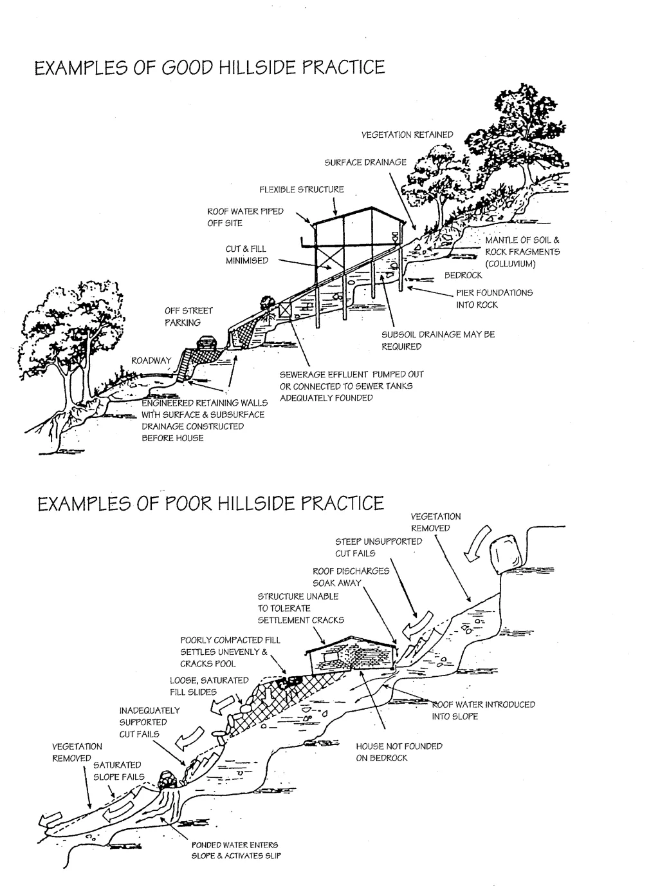

*Figure 1.3-a: Development should be sited and designed to minimise disturbance of land with topographic and geotechnical constraints. (I)*

<!-- SRC: HDCP 2024 Part 1 General - 23 June 2025.pdf | PAGE: 31 -->

##### Earthworks Below MHWM

- Applications for earthworks below MHWM (i.e. dredging or reclamation) should submit adequate environmental documentation that demonstrates there is no significant environmental harm.
- A Statement of Environmental Effects for the dredging or reclamation of land should (at a minimum) address impact on total catchment management, environmentally sensitive areas, water quality, water quantity, cultural heritage, flora and fauna, riverine scenic quality, agriculture/aquaculture and fishing, rural/ residential development, urban development, recreation and tourism, the Metropolitan Strategy and more specifically the following matters for consideration:
-  the effect of extraction or reclamation on river dynamics, instream structures and, in particular, the effect on water clarity and turbidity, water velocity, river enlargement and light penetration,
-  the desirability of maintaining river shallows to protect and support the aquatic habitat,
-  the likely effect of extraction or reclamation on recreational opportunities available in the region,
-  the advantages of using cutter-suction methods as against drag-line methods in carrying out the extraction,
-  the likely effect of the proposed development on riparian and aquatic plant colonisation and, in particular, the desirability of:
- confining extractive or reclamation operations to small sections of the waterways which do not contain those colonies, and
- not permitting extractive or reclamation operations in large sections of those rivers, and
- re-establishing riparian and aquatic plants if destroyed by the development,
-  the need to protect fish breeding grounds, commercial and recreational fishing areas and oyster farming,
-  whether the proposed development is appropriate to mitigate the problem necessitating the development without creating a similar problem elsewhere in the river,
-  any alternative means of undertaking the works which would reduce the need for extraction or reclamation,
-  the necessity to permanently remove materials from those rivers rather than relocating them within those rivers, especially for the purpose of rehabilitating areas of former extractive operations,
-  the potential for dredging to bring to the surface pollutants or anoxic sediment that may result in the formation of acid sulphate soils,
-  whether, in the circumstances, sufficient understanding exists of the likely impact of the works on the river,
-  any representations made by a public authority.
- The Statement of Environmental Effects for reclamation or dredging of land should contain a level of detail commensurate with an Environmental Impact Statement and demonstrate community benefit where the:
-  total material volume proposed to be extracted is 10,000 cubic metres or greater, or
-  proposed earthworks operation is located within 40 metres of the C1 National Parks and Nature Reserves zone, C2 Environmental Conservation zone or priority oyster aquaculture areas identified by the NSW Oyster Industry Sustainable Aquaculture Strategy.
Note:

*Refer to Council's Water Sensitive Urban Design (WSUD) Guidelines (2015) for information on how to prepare an Erosion and Sediment Control Plan for developments <1500m 2 .

MHWM means mean high water mark

Clause 6.2(2) of the HLEP prescribes that development consent is required for earthworks, unless the earthworks are exempt development or ancillary to development that is permitted without consent or development for which development consent has been given.

Clause 6.6(3) of the HLEP provides additional matters for consideration when assessing proposals for earthworks.

Compaction of filled areas should be undertaken in accordance with relevant Australian Standards, including AS 1289 and AS 3798.

<!-- SRC: HDCP 2024 Part 1 General - 23 June 2025.pdf | PAGE: 32 -->

### 1.3.2 Built Environment

The following section provides general controls for the protection of the built environment and applies to all forms of development.

#### 1.3.2.1 Transport and Parking

##### Desired Outcomes

- Development that manages transport demand around transit nodes to encourage public transport usage.
- Car parking and bicycle facilities that meet the requirements of future occupants and their visitors.
- Development with simple, safe and direct vehicular access.
- To encourage and support the use of electric vehicles.

##### Prescriptive Measures

##### General

- Direct vehicular access to main roads should be avoided and/or access points consolidated.
- For development (other than single dwelling houses on existing lots), vehicle access and parking should be designed to allow vehicles to enter and exit the site in a forward direction.
- Design and dimensions of car parks, loading areas and driveways should comply with AS2890.1 and AS2890.2.
- Planning and design layout of parking areas for people with disabilities should be in accordance with AS2890.6 and AS1428.1.
- Planning and design layout of loading and manoeuvring areas should be provided in accordance with AS2890.2 and:
-  preferably be located to the side or rear of buildings,
-  screened from view from local and main roads, and
-  located so that vehicles do not stand on any public road, footway, laneway or service road.
- Planning and design layout of bicycle parking (rails, racks or lockers) should be designed in accordance with AS2890.3.

##### Dwelling Houses (additional general controls)

- The driveway to a single dwelling house should be located at least 6 metres from an intersection in accordance with AS2890.1.
- Driveways for single dwelling houses on existing lots should incorporate a dedicated turning area, designed to allow the 85% Design Car Turning Path, where:
-  there is poor sight distance from the driveway to pedestrian or vehicular traffic,
-  the accessway fronts a main road or highly pedestrianised area, or
-  where vehicles would otherwise have to reverse more than 50 metres.
- The minimum dimensions of car parking spaces for single dwelling houses should be in accordance with AS2890.1, as summarised in Table 1.3.2-a:
- The maximum grade for a driveway to a single dwelling house should be no greater than 25% with a maximum transition for changes of grade of 8% per plan metre. Table 1.3.2-b may be used as a guide in designing driveways.
Table 1.3.2-a: Dwelling House - Parking Design Guide

| Parking Type (residential)   | Minimum Dimensions   |
|------------------------------|----------------------|
| Unobstructed parking space   | 2.4m(w) x 5.4m(l)    |
| Single lock-up garage        | 3m(w) x 5.4m(l)      |
| Double lock-up garage        | 5.7m(w) x 5.4m(l)    |

*Table 1.3.2-a: Dwelling House - Parking Design Guide*

Note:

##### Main roads

Development adjoining roads that are subject to Section 2.119 of the State Environmental Planning Policy (Transport and Infrastructure) 2021 (Transport and Infrastructure SEPP) require separate approval from Transport for NSW (TfNSW) for access to State and Regional Roads as classified by TfNSW. A list of classified and unclassified main roads for Hornsby Shire is provided in Annexure C.

##### Designated roads

Designated roads are Council identified roads that require development to have an increased setback from the road edge, consistent with the established streetscape. A list of designated roads is provided in Annexure C.

A highly pedestrianised area includes sites located in close proximity to schools, shopping centres, bus stops, places of worship and other busy community facilities.

Australian Standard AS2890 is available at www.saiglobal.com.

Design levels at the top of the adjacent kerb and gutter/crown or road must be obtained from Council's Works Division and the driveway design amended to comply with AS2890.1.

<!-- SRC: HDCP 2024 Part 1 General - 23 June 2025.pdf | PAGE: 33 -->

Table 1.3.2-b: Dwelling House - Driveway Design Guide

| Distance of parking area from the Front Boundary   | Level of the parking area above the top of adjacent road* (Property higher than road)   | Level of the parking area below the top of adjacent road * (Property lower than road)   |
|----------------------------------------------------|-----------------------------------------------------------------------------------------|-----------------------------------------------------------------------------------------|
| 5.5m                                               | 1.067m                                                                                  | 0.567m                                                                                  |
| 6.0m                                               | 1.192m                                                                                  | 0.692m                                                                                  |
| 7.0m                                               | 1.442m                                                                                  | 0.942m                                                                                  |
| 8.0m                                               | 1.692m                                                                                  | 1.192m                                                                                  |
| 9.0m                                               | 1.942m                                                                                  | 1.442m                                                                                  |
| 10.0m                                              | 2.192                                                                                   | 1.692m                                                                                  |
| 11.0m                                              | 2.442                                                                                   | 1.942m                                                                                  |
| 12.0m                                              | 2.692                                                                                   | 2.192m                                                                                  |

*Table 1.3.2-b: Dwelling House - Driveway Design Guide*

##### Service Vehicles

- On site loading and unloading areas for nonresidential developments should be provided in accordance with the RTA Guide to Traffic Generating Development (2002).
- The on site loading and unloading area in a non residential development should incorporate provision for 1 car space and 1 motor cycle space for use by couriers, sited in a convenient location. Larger developments may require more.
- On site pick up and manoeuvring areas for waste collection vehicles should be provided in accordance with the waste collection provisions at Section 1.3.2.3 of the DCP.
- On site parking for a removalist vehicle should be provided for a residential development with more than 20 dwellings that adjoins a public road where kerb side parking for removalist vehicles is difficult or restricted. Parking for a removalist vehicle should be designed to accommodate at least a small rigid vehicle (SRV), and preferably a medium rigid vehicle (MRV) as defined by AS2890.2.

##### Notes:

The RTA Guide to Traffic Generating Development (2002) is available at www.transport.nsw.gov.au. For servicing rates refer to Table 5.1 (page 5-3) of the Guide.

##### Car Parking

- Car parking should be provided on site in accordance with the minimum parking rates Table 1.3.2-c. Car parking within the Hornsby Town Centre application area, as shown in Figure 1.3-b should be provided on site in accordance with the maximum parking rates in Table 1.3.2-d.
- The car parking rate for sites less than (<) 800 metres from a railway station in Table 1.3.2-c is a radial distance from the main pedestrian entry. Where a development site falls partly within the 800 metre radius, the parking rate for 'sites <800m' is to apply to the whole development. Tiers for car parking rates in the Hornsby Town Centre application area are shown in Figure 1.3-b.
- A Car Parking Demand Assessment should be provided for any significant variation proposed to the parking rates or intensive traffic generating developments.
- Before granting approval to depart from on-site parking rates specified in Table 1.3.2-c and Table 1.3.2-d, Council will consider the Car Parking Demand Assessment and any other relevant planning consideration.
- A Car Parking Demand Assessment should address at minimum the following matters:
-  any relevant parking policy,
-  the availability of alternative car parking in the locality of the land, including:
- efficiencies gained from the consolidation of shared car parking spaces on the same site,
- public car parks intended to serve the land,
- extent of existing on-street parking in non-residential zones,
- extent of existing on-street parking in residential zones,
- the practicality of providing car parking on the site, particularly for constrained development sites,
- any car parking deficiency associated with the existing use of the site,
- local traffic management in the locality of the site,
- the impact of fewer car parking spaces on local amenity, including pedestrian amenity and the amenity of nearby residential areas,

<!-- SRC: HDCP 2024 Part 1 General - 23 June 2025.pdf | PAGE: 34 -->

- the need to create safe, functional and attractive parking areas,
- access to or provision of alternative transport modes to and from the land, and
- the character of the surrounding area and whether reducing the car parking provision would result in a quality/positive urban design outcome.
- The minimum number of car parking spaces is to be rounded up to the nearest whole number if it is not a whole number.
- Stacked parking spaces may be provided if reserved for use by a particular dwelling, commercial unit or the like.
- Shade trees should be provided in open parking areas at the ratio of 1 shade tree for every 6 spaces.

##### Note:

Where a Car Parking Demand Assessment or a Parking Study is required, a report should be prepared by a suitably qualified traffic and transport consultant.

##### Motorcycle Parking

w. In all buildings that provide on site parking:

-  1 space suitable for motorcycles should be provided per 50 car parking spaces, or part thereof.
-  motorcycle parking should be available as part of the common property for use by residents and visitors.

##### Notes:

The Motorcycle Parking is in addition to the car parking required in Table 1.3.2-c for tenants and/or visitors (not service vehicles which are separately addressed).

Motorcycle Parking is not required for dwelling houses.

<!-- SRC: HDCP 2024 Part 1 General - 23 June 2025.pdf | PAGE: 35 -->

Table 1.3.2-c: On Site Car Parking Rates

| Type of Development                                                                                                                            | Car Parking Requirement Sites < 800m from Railway Station                                                                                          | Sites > 800m from Railway Station                                                                                                                  |
|------------------------------------------------------------------------------------------------------------------------------------------------|----------------------------------------------------------------------------------------------------------------------------------------------------|----------------------------------------------------------------------------------------------------------------------------------------------------|
| Residential Accommodation                                                                                                                      |                                                                                                                                                    |                                                                                                                                                    |
| Dwelling Houses                                                                                                                                |                                                                                                                                                    |                                                                                                                                                    |
| 0-2 Bedrooms                                                                                                                                   | 1 space/dwelling                                                                                                                                   |                                                                                                                                                    |
| 3 or more Bedrooms                                                                                                                             | 2 spaces/dwelling                                                                                                                                  |                                                                                                                                                    |
| Secondary Dwellings (see Note*)                                                                                                                |                                                                                                                                                    |                                                                                                                                                    |
| 0-2 Bedrooms                                                                                                                                   | 1 space/dwelling                                                                                                                                   | 1 space/dwelling                                                                                                                                   |
| 3 or more Bedrooms                                                                                                                             | 2 spaces/dwelling                                                                                                                                  | 2 spaces/dwelling                                                                                                                                  |
| Dual Occupancy                                                                                                                                 | 1 space/dwelling                                                                                                                                   | 1 space/dwelling                                                                                                                                   |
| Medium and High Density Dwellings in Hornsby LGA (including Universal Design Housing**)                                                        |                                                                                                                                                    |                                                                                                                                                    |
| 0-1 Bedroom                                                                                                                                    | 0.75 space/ dwelling                                                                                                                               | 1 space/ dwelling                                                                                                                                  |
| 2 Bedrooms                                                                                                                                     | 1 space/ dwelling                                                                                                                                  | 1.25 spaces/ dwelling                                                                                                                              |
| 3 or more Bedrooms                                                                                                                             | 1.5 spaces/ dwelling                                                                                                                               | 2 spaces/ dwelling                                                                                                                                 |
| Visitors (see Note***)                                                                                                                         | 1 space per 7 dwellings                                                                                                                            | 1 space per 5 dwellings                                                                                                                            |
| Seniors Housing at all locations others than the combined land described below                                                                 | per State Environmental Planning Policy (Housing) 2021                                                                                             | per State Environmental Planning Policy (Housing) 2021                                                                                             |
| Seniors Independent Housing at combined site comprising Nos. 9, 11, 15, 17 and 19 Ashley Street, Hornsby and Nos. 2 and 4 Webb Avenue, Hornsby | A maximum of 108 resident spaces Visitors and staff - 1 space per 7 dwellings to a maximum of 15 spaces 1 dedicated space for an emergency vehicle | A maximum of 108 resident spaces Visitors and staff - 1 space per 7 dwellings to a maximum of 15 spaces 1 dedicated space for an emergency vehicle |
| Tourist and Visitor Accommodation (see Note**)                                                                                                 |                                                                                                                                                    |                                                                                                                                                    |
| Bed & Breakfast Accommodation                                                                                                                  | 1 space/guest bedroom + 2 spaces for the permanent residents                                                                                       | 1 space/guest bedroom + 2 spaces for the permanent residents                                                                                       |
| Short Term Rental Accommodation (Holiday lets)                                                                                                 | Apply residential accommodation rates above                                                                                                        | Apply residential accommodation rates above                                                                                                        |
| Hotel or Motel accommodation                                                                                                                   | 1 space/room + 1 space per 2 employees                                                                                                             | 1 space/room + 1 space per 2 employees                                                                                                             |
| Caravan Parks                                                                                                                                  | 1 space/van, cabin or tent site                                                                                                                    |                                                                                                                                                    |
| Commercial Premises                                                                                                                            |                                                                                                                                                    |                                                                                                                                                    |
| Business or Office Premises                                                                                                                    | 1/48m 2 GFA                                                                                                                                        | 1/40m 2 GFA                                                                                                                                        |
| Shops                                                                                                                                          | 1/29m 2 GLFA                                                                                                                                       | 1/20m 2 GLFA                                                                                                                                       |
| Bulky Goods Premises                                                                                                                           | 1/75m 2 GLFA, including space for cars with trailers                                                                                               | 1/50m 2 GLFA, including space for cars with trailers                                                                                               |
| Restaurants or Cafes (ex drive-through take-away restaurants)                                                                                  | 1/29m 2 GLFA                                                                                                                                       | 15/100m 2 GFA + 15/100 m 2 of outdoor seating area                                                                                                 |
| Vehicle Sales or Hire Premises                                                                                                                 | 1/150m 2 site area + 6 spaces/work bay                                                                                                             | 1/150m 2 site area + 6 spaces/work bay                                                                                                             |
| Markets                                                                                                                                        | 2 spaces per stall (customers only)                                                                                                                | 2 spaces per stall (customers only)                                                                                                                |
| Marina                                                                                                                                         | 0.6 spaces/berth                                                                                                                                   | 0.6 spaces/berth                                                                                                                                   |

*Table 1.3.2-c: On Site Car Parking Rates*

<!-- SRC: HDCP 2024 Part 1 General - 23 June 2025.pdf | PAGE: 36 -->

Table 1.3.2-c: On Site Car Parking Rates

| Type of Development                                                                            | Car Parking Requirement                                                                                                                                                                                                                                                                                        |                                                                                                                                                                                                                                                                                                                |
|------------------------------------------------------------------------------------------------|----------------------------------------------------------------------------------------------------------------------------------------------------------------------------------------------------------------------------------------------------------------------------------------------------------------|----------------------------------------------------------------------------------------------------------------------------------------------------------------------------------------------------------------------------------------------------------------------------------------------------------------|
| Type of Development                                                                            | Sites < 800m from Railway Station                                                                                                                                                                                                                                                                              | Sites > 800m from Railway Station                                                                                                                                                                                                                                                                              |
| Industrial Uses and Areas                                                                      |                                                                                                                                                                                                                                                                                                                |                                                                                                                                                                                                                                                                                                                |
| Industry and Warehouse or Distribution Centres (max 20% ancillary office floor area, Note****) | 1/150m 2 GLFA                                                                                                                                                                                                                                                                                                  | 1/100m 2 GLFA                                                                                                                                                                                                                                                                                                  |
| Vehicle Repair Station and Vehicle Body Repair Workshops                                       | 1/150m 2 GFA + 6 spaces/work bay                                                                                                                                                                                                                                                                               | 1/150m 2 GFA + 6 spaces/work bay                                                                                                                                                                                                                                                                               |
| Sex Services Premises                                                                          | 1 space/workroom + 1 space per 2 employees                                                                                                                                                                                                                                                                     | 1 space/workroom + 1 space per 2 employees                                                                                                                                                                                                                                                                     |
| Agriculture                                                                                    |                                                                                                                                                                                                                                                                                                                |                                                                                                                                                                                                                                                                                                                |
| Intensive Plant Agriculture                                                                    | 1 space/employee                                                                                                                                                                                                                                                                                               | 1 space/employee                                                                                                                                                                                                                                                                                               |
| Plant Nursery                                                                                  | 0.5 spaces per 100m 2 of that part of the site used in conjunction with the nursery + parking for any ancillary uses per rates in this table                                                                                                                                                                   | 0.5 spaces per 100m 2 of that part of the site used in conjunction with the nursery + parking for any ancillary uses per rates in this table                                                                                                                                                                   |
| Farm Stay Accommodation                                                                        | 1 space per farm stay accommodation room or cabin, and 1 space per moveable dwelling or tent site, and 1 space per 2 employees, and 1 space for persons with disability or limited mobility                                                                                                                    | 1 space per farm stay accommodation room or cabin, and 1 space per moveable dwelling or tent site, and 1 space per 2 employees, and 1 space for persons with disability or limited mobility                                                                                                                    |
| Farm Gate Premises and Farm Experiences Premises                                               | 1 space per 25m 2 gross floor area of a building or structure for farm gate premises or farm experience premises, and 1 space per 3 visitors for any outdoor farm gate premises or farm experience premises activity, and 1 space per 2 employees, and 1 space for persons with disability or limited mobility | 1 space per 25m 2 gross floor area of a building or structure for farm gate premises or farm experience premises, and 1 space per 3 visitors for any outdoor farm gate premises or farm experience premises activity, and 1 space per 2 employees, and 1 space for persons with disability or limited mobility |
| Education                                                                                      |                                                                                                                                                                                                                                                                                                                |                                                                                                                                                                                                                                                                                                                |
| Child Care Centre                                                                              | 1 space per 4 children                                                                                                                                                                                                                                                                                         | 1 space per 4 children                                                                                                                                                                                                                                                                                         |
| Educational Establishments                                                                     | 1 space per full time teacher + 1 space per 2 students of driving age                                                                                                                                                                                                                                          | 1 space per full time teacher + 1 space per 2 students of driving age                                                                                                                                                                                                                                          |
| Health Care                                                                                    |                                                                                                                                                                                                                                                                                                                |                                                                                                                                                                                                                                                                                                                |
| Health Consulting Rooms                                                                        | 3 per surgery                                                                                                                                                                                                                                                                                                  | 3 per surgery                                                                                                                                                                                                                                                                                                  |
| Medical Centres                                                                                | 4 per surgery                                                                                                                                                                                                                                                                                                  | 4 per surgery                                                                                                                                                                                                                                                                                                  |
| Halls, meeting places                                                                          |                                                                                                                                                                                                                                                                                                                |                                                                                                                                                                                                                                                                                                                |
| Community Halls                                                                                | 1 space per 5 seats min (subject to parking study)                                                                                                                                                                                                                                                             | 1 space per 5 seats min (subject to parking study)                                                                                                                                                                                                                                                             |
| Places of Public Worship                                                                       | 1 space per 5 seats min (subject to parking study)                                                                                                                                                                                                                                                             | 1 space per 5 seats min (subject to parking study)                                                                                                                                                                                                                                                             |
| Entertainment Facility                                                                         | 1 space per 5 seats min (subject to parking study)                                                                                                                                                                                                                                                             | 1 space per 5 seats min (subject to parking study)                                                                                                                                                                                                                                                             |
| Temporary Community Events                                                                     | Markets to provide 2 spaces per stall (customers only) available on site or in the immediate locality. Other events                                                                                                                                                                                            | subject to a parking study                                                                                                                                                                                                                                                                                     |
| Other Uses                                                                                     | as per RTA Guide to Traffic Generating Development or a Parking Study                                                                                                                                                                                                                                          | as per RTA Guide to Traffic Generating Development or a Parking Study                                                                                                                                                                                                                                          |

*Table 1.3.2-c: On Site Car Parking Rates*

<!-- SRC: HDCP 2024 Part 1 General - 23 June 2025.pdf | PAGE: 37 -->

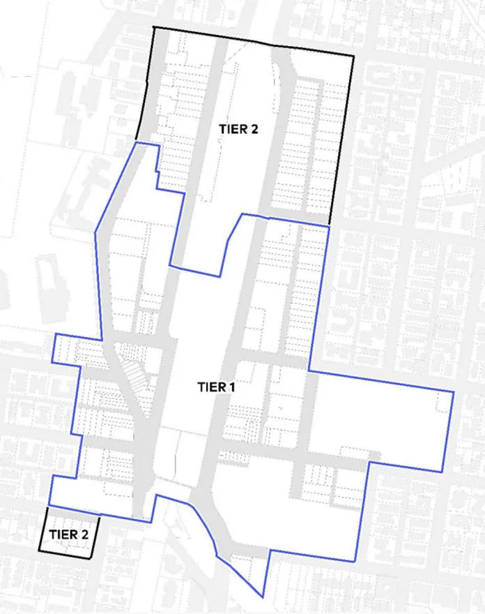

*Figure 1.3-b: Hornsby Town Centre Parking Rate Application Area (C)*

Table 1.3.2-d: On Site Car Parking Rates (Hornsby Town Centre)

| Land Use                                   | Car Parking Rates (maximum rates unless range specified)                                                         | Car Parking Rates (maximum rates unless range specified)                                               |
|--------------------------------------------|------------------------------------------------------------------------------------------------------------------|--------------------------------------------------------------------------------------------------------|
|                                            | Tier 1                                                                                                           | Tier 2                                                                                                 |
| Multi-unit residential                     |                                                                                                                  |                                                                                                        |
|                                            | Allocated resident parking, to be provided on-site, within the range of:                                         | Allocated resident parking, to be provided on-site, within the range of:                               |
| 0-1 Bedroom                                | 0.4 space per dwelling                                                                                           | 0.75 space per dwelling                                                                                |
| 2 Bedrooms                                 | 0.8 space per dwelling                                                                                           | 1 space per dwelling                                                                                   |
| 3 or more Bedrooms                         | 1.1 spaces per dwelling                                                                                          | 1.5 spaces per dwelling                                                                                |
| Visitors                                   | Plus 1 parking space for every 10 dwellings for visitors to be provided within a public parking facility through | cash-in-lieu contributions.                                                                            |
| Commercial Premises (excluding Retail)     |                                                                                                                  |                                                                                                        |
|                                            | Tenant parking, to be provided on-site, within the range of:                                                     | Tenant parking, to be provided on-site, within the range of:                                           |
|                                            | 1 per 100 m 2 GFA                                                                                                | 1 per 70 m 2 GFA                                                                                       |
|                                            | 1 per 400 m 2 GFA to be provided within a public parking facility through cash- in-lieu contributions.           | 1 per 400 m 2 GFA to be provided within a public parking facility through cash- in-lieu contributions. |
|                                            | 1 loading bay per 400 m 2 GFA to be provided on-site.                                                            | 1 loading bay per 400 m 2 GFA to be provided on-site.                                                  |
| Retail                                     |                                                                                                                  |                                                                                                        |
|                                            | Tenant parking, to be provided on-site, within the range of:                                                     | Tenant parking, to be provided on-site, within the range of:                                           |
| For all other uses within the Hornsby Town | 1 per 150 m 2 GFA refer to Table 1C.2.1(c)                                                                       | 1 per 67 m 2 GFA                                                                                       |
|                                            | 1 per 100 m 2 GFA to be provided within a public parking facility through cash- in-lieu contributions.           | 1 per 100 m 2 GFA to be provided within a public parking facility through cash- in-lieu contributions. |
|                                            | 1 loading bay per 400 m 2 GFA to be provided on-site.                                                            | 1 loading bay per 400 m 2 GFA to be provided on-site.                                                  |

*Table 1.3.2-d: On Site Car Parking Rates (Hornsby Town Centre)*

<!-- SRC: HDCP 2024 Part 1 General - 23 June 2025.pdf | PAGE: 38 -->

Notes:

*To ensure secondary dwellings do not have an oversized garage area and have the potential to covertly evolve into a larger dwelling that does not comply with the maximum secondary dwelling size in the HLEP, a maximum of 2 car spaces/dwelling is permitted.

**All car parking spaces including Universal Design Housing should be in accordance with AS 2890.1

***Visitor parking for medium/high residential development is required for development proposals comprising more than 5 dwellings. On-site parking for visitor accommodation applies to areas accessible by road only.

****Parking requirements for Industrial Units is increased when ancillary retailing is permitted, or an ancillary office space component is in excess of 20% of the floor area.

Gross Floor Area is as defined by the HLEP.

Gross leasable floor area means the sum of the area of each floor of a building where the area of each floor is taken to be the area within the internal faces of the walls, excluding stairs, amenities, lifts corridors and other public areas but including stock storage areas.

<!-- SRC: HDCP 2024 Part 1 General - 23 June 2025.pdf | PAGE: 39 -->

##### Carshare

- Parking carshare spaces are encouraged for:
-  any residential development containing more than 25 residential units, or
-  any employment generating development with a floor space of 5,000m 2 , and
-  is located within 800 metre radial catchment of a railway station, or within a transit node centre that is serviced by a strategic bus corridor.

##### A car share parking proposal should be:

- supported by a parking study to be submitted with the Development Application.

##### Car Share (Hornsby Town Centre)

- For sites within the Hornsby Town Centre Parking Rate Application Area, the following requirements for car share should be met:
-  A minimum of one car share space per 50 regular spaces for commercial developments
-  A minimum of one car share space per 90 regular spaces for residential developments.
- aa. If agreement with a car share provider is not obtained then the car share space is to be used for additional visitor parking until such time as a car share provider is obtained.

##### Storage Areas within Car Parking Areas

- bb. Where storage space is provided adjacent to car parking areas or within designated car parking spaces, it should not impede or reduce the area allocated for car parking requirements as set out in the AS 2890 Parking Facilities series, including parking for bicycles and motorcycles.

##### Notes:

Car share is a self service car rental scheme for short periods of time, typically on an hourly basis. Car sharing works best in locations where there is a good level of public transport provision and access to local services and facilities by walking and cycling (eg. commercial centres inside transit nodes).

Employment generating development comprises office premises and industries.

A transit node centre serviced by a strategic bus corridor comprises land within a 400m radial catchment of the West Pennant Hills commercial centre.

For further information on Council's carshare parking policy refer to the Policy available for view at Council's website www.hornsby.nsw.gov.au.

##### Parking for people with disabilities

- Car parking for people with disabilities should be provided on-site in accordance with the parking rates in Table 1.3.2-e:
Table 1.3.2-e: Accessible Car Parking Provision

| Land uses                                                                       | Minimum Number of Accessible Spaces                                                                                                                                                                |
|---------------------------------------------------------------------------------|----------------------------------------------------------------------------------------------------------------------------------------------------------------------------------------------------|
| Commercial Premises                                                             | 1-2% of spaces                                                                                                                                                                                     |
| Passenger Transport Facility e.g. railway stations, bus/ rail interchanges      | 1-3% of spaces                                                                                                                                                                                     |
| Community and Recreation Facilities eg. civic centres and gymnasiums            | 2-3% of spaces                                                                                                                                                                                     |
| Educational Establishments                                                      | 2-3% of spaces                                                                                                                                                                                     |
| Entertainment Facilities eg. theatres, libraries, sport centres                 | 3-4% of spaces                                                                                                                                                                                     |
| Health Service Facilities eg. medical centres, clinics, community health centre | 3-4% of spaces (See Note 1 )                                                                                                                                                                       |
| Places of Public Worship                                                        | See Note 1                                                                                                                                                                                         |
| Medium and High Density Residential Development                                 | One accessible car parking space is to be provided for every adaptable residential unit One space for every 20 car parking spaces or part thereof is to be allocated as accessible visitor parking |

*Table 1.3.2-e: Accessible Car Parking Provision*

##### Notes:

The percentages in Table 1.3.2-e refers to the total number of car parking spaces required in Table 1.3.2-c.

Note 1 : To be provided as needed in consultation with management of the premises.

<!-- SRC: HDCP 2024 Part 1 General - 23 June 2025.pdf | PAGE: 40 -->

##### Bicycle Parking and Associated Facilities

- Bicycle parking and facilities should be provided on site in accordance with the minimum rates in Table 1.3.2-f.
- ee. Secure and safe bicycle parking should be separated from motor vehicles.
Table 1.3.2-f: On Site Bicycle Parking and Facilities

| Type of Development                             | Minimum Bicycle Parking Requirement                                                                                                                                                                                                                                                                                                   |
|-------------------------------------------------|---------------------------------------------------------------------------------------------------------------------------------------------------------------------------------------------------------------------------------------------------------------------------------------------------------------------------------------|
| Medium and High Density Residential Development | 1 space per 5 units for residents to be located in a safe, secure and undercover area. 1 space per 10 units for visitors                                                                                                                                                                                                              |
| Commercial Premises (over 1200m 2 GFA)          | 1 space per 600m 2 (GFA) for staff + Developments with a gross floor area over 2500m 2 should provide end of destination facilities for staff in the form of at least 1 shower cubicle with ancillary change rooms                                                                                                                    |
| Industrial Developments (over 2000m 2 GFA)      | 1 space per 1000m 2 (GFA) for staff + Developments with a gross floor area over 4000m 2 should provide end of destination facilities for staff in the form of at least 1 shower cubicle with ancillary change rooms                                                                                                                   |
| Educational Establishments                      | 1 rack per 20 full-time staff or part thereof, and 5 racks per class (between grades 5 and 12), and lockers for staff at a rate of 1 per 3 staff bicycle racks or part thereof, and end of destination facilities for staff in the form of at least 1 shower cubicle with ancillary change rooms for every 10 bicycle racks required. |

*Table 1.3.2-f: On Site Bicycle Parking and Facilities*

##### Note:

The above rates are based on a rate of 1 bicycle rack/locker per 20 employees, using an average commercial employee ratio of 1 employee per 30m 2 and an industrial rate of 1 employee per 50m 2 .

##### Access Network

- ff. For large scale development that is 10 storeys or more:
-  A Framework Travel Plan should accompany any development application; and
-  A Final Travel Plan should be provided to Council prior to the issue of an Occupation Certificate.

##### Notes:

A Framework Travel Plan is a design tool to promote efficient and sustainable modes of transport in building and site planning. The Framework Travel Plan is required where the future tenants are unknown.

A Final Travel Plan is a management tool that promotes the implementation and monitoring of a coordinated transport strategy to influence the travel behaviour of employers, employees, residents and visitors towards public transport, walking, cycling, car pooling and car sharing.

##### Electric Vehicle Charging

Car parking for medium and high density residential, seniors independent living and boarding house (3+ dwellings) development should:

- gg. Provide at least one EV ready connection for each dwelling/apartment that is allocated a car parking space.
- hh. Provide EV distribution board(s) of sufficient size to allow connection of all EV ready connections.
- All car share spaces and spaces allocated to visitors must have access to an on-premises shared EV connection.
Car parking for new commercial, business, office, retail, hotel, motel, hostel and co-living development should:

- jj. Provide one shared EV connection for every 10 car spaces distributed throughout the carpark to provide equitable access across floors and floor plates, and across open parking areas.
Garages in low density residential development should:

- kk. Be provided with a private EV connection.

<!-- SRC: HDCP 2024 Part 1 General - 23 June 2025.pdf | PAGE: 41 -->

##### Electric Bicycles and Mobility Scooters

- All mixed use, commercial and residential flat building developments with on-site car parking should provide at least one dedicated space and charging point to be used for electric bicycles and mobility scooters.

##### Safety and Energy Collection Data

- All EV charging infrastructure is to comply with the applicable Electric Vehicle safety and energy consumption data collection requirements of the National Construction Code.

##### Notes:

-  EV ready connection is the provision of a dedicated spare 32A circuit provided in an EV distribution board to enable easy future installation of cabling from an EV charger to the EV distribution board and a circuit breaker to feed the circuit.
-  Private EV connection is the provision of a minimum 15A circuit and power point to enable easy future EV connection in the garage connected to the main switch board.
-  Shared EV connection is the provision of a minimum Level 2, 40A fast charger and power supply to a car parking space connected to an EV distribution board.
-  EV distribution board is a distribution board dedicated to EV charging that is capable of supplying not less than 50% of EV connections at full power at any one time during off-peak periods and includes an EV Load Management System.
-  The EV distribution board should provide adequate space for the future installation (post construction) of compact meters in or adjacent to the distribution board, to enable individual EV usage to be measured.

<!-- SRC: HDCP 2024 Part 1 General - 23 June 2025.pdf | PAGE: 42 -->

#### 1.3.2.2 Accessible Design

##### Desired Outcomes

- Publicly accessible buildings that provide a safe and continuous path of travel for people with impaired mobility.
- Residential development that includes adaptable units and accessible residential accommodation to address potential demand.

##### Prescriptive Measures

##### General

- All new building work should comply with the accessibility provisions of the Building Code of Australia (BCA) and the Disability (Access to Premises - Buildings) Standards 2010 where required.
- Continuous unobstructed paths of travel should be provided from public footpaths, accessible car parking, and setdown areas to public building entrances. Paths of travel should be designed in accordance with the Disability (Access to Premises - Buildings) Standards 2010.
- Accessways for pedestrians and for vehicles are to be separated.

##### Seniors Housing

- Access is to be provided in accordance with the requirements of the State Environmental Planning Policy (Housing) 2021 (Housing SEPP).

##### Heritage Buildings

- Access to heritage buildings should be provided that is sympathetic to the heritage significance of the building and its curtilage.

##### Medium and High Density Residential Developments

- For developments with 10 or more dwellings:
-  At least 10% of proposed dwellings should be Adaptable Housing, designed to meet the needs of residents as they age.
-  At least 20% of proposed dwellings should be Universal Design housing in accordance with the Livable Housing Design Guidelines silver level design features.
-  Adaptable Housing and Universal Design Housing should be equitably distributed through all types and sizes of dwellings.
Notes:

For further information refer to the Disability (Access to Premises - Buildings) Standards 2010 available at www.industry.gov.au/building-and-construction/premisesstandards.

An access report, prepared by a relevantly qualified access consultant may be required for development that involves the following:

-  Medium to high density residential developments with 10 or more dwellings, or
-  Housing for Aged or People with Disabilities, or
-  Other developments that are required to comply with the Disability (Access to Premises - Buildings) Standards 2010.
Adaptable Housing is defined by Australian Standard AS 4299, which is specifically designed to allow for the future adaptation of a dwelling to accommodate the occupant's needs.

For car parking requirements for Adaptable Housing refer to Table 1.3.2-e Accessible Car Parking Provision.

Universal Design is an international design philosophy that enables people to continue living in the same home by ensuring that apartments are able to change with the needs of occupants.

Universally designed apartments provide design features such as wider circulation spaces, larger car parking spaces, reinforced bathroom walls and easy to reach and operate fixtures in accordance with the Livable Housing Design Guidelines available online at livablehousingaustralia.org.au.

<!-- SRC: HDCP 2024 Part 1 General - 23 June 2025.pdf | PAGE: 43 -->

#### 1.3.2.3 Waste Management

##### Desired Outcomes

- Development that maximises re-use and recycling of building materials.
- Waste storage and collection facilities that are designed to encourage recycling, located and designed to be compatible with the streetscape, accessible, clean and safe for users and collectors.

##### Prescriptive Measures

##### Demolition and Construction Waste

- A Waste Management Plan should be prepared in accordance with Council guidelines and submitted with the development application, to address demolition and construction waste, and include:
-  An estimate of the types and volumes of waste and recyclables to be generated,
-  A site plan showing sorting and storage areas for demolition and construction waste and the vehicle access to these areas,
-  How excavation, demolition and building waste materials will be re-used or recycled and where residual wastes will be disposed, and
-  The total percentage (by weight) of demolition and construction waste that will be reused or recycled to achieve the minimum waste minimisation target established by the State Government.

##### Notes:

The State Government waste minimisation targets are set out in the Waste Avoidance and Resource Recovery Act 2001 and NSW Waste and Sustainable Materials Strategy 2041. The minimum reuse/ recycling rate for construction and demolition waste is currently 80%.

This section should be read in conjunction with Council's Waste Minimisation and Management Guide available at www.hornsby.nsw.gov.au.

Asbestos and other hazardous demolition materials should be handled and disposed of to authorised waste disposal depots.

##### Waste Facility Design

- The location and design of waste storage and collection areas and facilities should:
-  accommodate a sufficient number of mobile waste containers to contain the volume of waste and recycling expected to be generated between collection services, and sufficient aisle space to access and manoeuvre the containers within the Material Separation Area (see Note 1).
-  have regard to streetscape aesthetics, odour, and noise generation and be sited away from
adjacent sensitive landuses and comply with the location guidelines in Table 1.3.2-g,

-  comply with Council's design guidelines (see Note 2),
-  include bunding in impervious materials where Dangerous Goods may be stored,
-  incorporate an additional bulky waste storage area of at least 8m 2 and every 50 dwellings or part thereof for residential flat buildings, multi dwelling housing and town houses.
-  allow ease of access for tenants, the path of travel should comply with AS 1428.1.
- Residential developments proposing on-site collection of waste should:
-  design for a Heavy Rigid Vehicle (HRV) Council waste collection vehicle, or
-  for land within the 5 storey residential flat building precincts (R4 Zone, Area P on the HLEP Height of Building Map), design for a Small Rigid Vehicle (SRV) Council waste collection vehicle, and
-  provide an easement in favour of Council to enable collection vehicles to service the development (see Note 3).
- New Commercial and Industrial developments proposing on site collection of waste should design for a HRV commercial garbage truck. (see Note 4).

##### Note:

The guideline reference notes above are included within the Council's guideline the Waste Minimisation and Management Guide available at website www.hornsby.nsw.gov.au, as noted below:

-  Note 1: See reference FD1.01
-  Note 2: See references FD1.02, FD1.03, FD1.04
-  Note 3: See reference A5.04
-  Note 4: See reference A5.02
Heavy Rigid Vehicles for waste collection details are provided at A5.02 of the Waste Minimisation and Management Guide.

Small Rigid Vehicles (SRV) for waste collection is defined by AS 2890.2.

<!-- SRC: HDCP 2024 Part 1 General - 23 June 2025.pdf | PAGE: 44 -->

##### Garbage Chute Systems

- Buildings containing more than 3 storeys should incorporate a garbage chute system for waste and an interim recycling bin storage in either a room or a cupboard on each floor.
- Where a required garbage chute system is unable to be provided, an interim waste storage room is to be provided on each floor that is serviced by a goods lift to transfer the waste to the communal waste storage facility in the basement.
- The location, design and construction of garbage chute systems and storage rooms should be in accordance with Council's guidelines.
Note:

For further information refer to part FD2.01 in Council's guideline the Waste Minimisation and Management Guide available at website www.hornsby.nsw.gov.au.

##### Volume Handling Equipment

- Where a building requires a chute system:
-  The bin capacity under the chute must be sufficient for at least 3 days garbage generation.
-  Where in excess of 14 residential units are serviced by the chute, appropriate volume handling equipment is to be provided.
Note:

Volume handling equipment automatically changes the bin under the chute when it becomes full. The volume handling equipment is not to include compaction. Designing for 3 days bin capacity under the chute will mean the site caretaker will not have to attend the site on weekends to manage the waste.

- The location, design and construction of volume handling equipment to automatically change the bin under the chute when it becomes full should be in accordance with Council's guidelines.

##### Ongoing Waste Management Submission Requirements

- A Waste Management Plan should be prepared in accordance with Council's guidelines and submitted with the development application, to address the generation of waste from the occupation of the development, and include:
-  an estimate of the amount of waste and recyclables to be generated,
-  identify the number of, and capacity of, waste storage bins and volume handling equipment required,
-  a site plan showing:
- areas allocated for waste storage and recycling,
- details of any volume handling equipment,
- nomination of the waste collection point for the site, and
- identification of the path of access for users and collection vehicles.
-  details of the on-going management of the storage and collection of waste, including responsibility for cleaning, transfer of bins between storage areas and collection point, maintenance of signage, and security of storage areas.
Note:

For further information refer to:

Council's guideline Waste Minimisation and Management Guide available on the website www.hornsby.nsw.gov.au - see parts A6.01 and O3.02 to estimate waste generation and bins required.

Waste Classification Guidelines available on the EPA's website www.epa.nsw.gov.au/your-environment/waste/classifyingwaste/waste-classification-guidelines.

NSW Waste and Sustainable Materials Strategy 2041 available on DPE's website www.dpie.nsw.gov.au/ourwork/environment-energy-and-science/waste-and-sustainablematerials-strategy.

<!-- SRC: HDCP 2024 Part 1 General - 23 June 2025.pdf | PAGE: 45 -->

Table 1.3.2-g: Location of Waste Storage and Collection Areas (including recyclables)

| Landuse                                                                  | Waste Storage                                                                                                                                                                                                                                                                                                                                                                                                                                                                                                                                                                                                                     | Waste Collection                                                                                                                                                                                                                                                                                                                                                                                                                                                                                                                                                                                                                                                              |
|--------------------------------------------------------------------------|-----------------------------------------------------------------------------------------------------------------------------------------------------------------------------------------------------------------------------------------------------------------------------------------------------------------------------------------------------------------------------------------------------------------------------------------------------------------------------------------------------------------------------------------------------------------------------------------------------------------------------------|-------------------------------------------------------------------------------------------------------------------------------------------------------------------------------------------------------------------------------------------------------------------------------------------------------------------------------------------------------------------------------------------------------------------------------------------------------------------------------------------------------------------------------------------------------------------------------------------------------------------------------------------------------------------------------|
| Residential Development (Including Subdivision)                          | Residential Development (Including Subdivision)                                                                                                                                                                                                                                                                                                                                                                                                                                                                                                                                                                                   | Residential Development (Including Subdivision)                                                                                                                                                                                                                                                                                                                                                                                                                                                                                                                                                                                                                               |
| 0-6 dwellings                                                            | Provide a hard stand area of 1m x 2m behind the building line for each dwelling                                                                                                                                                                                                                                                                                                                                                                                                                                                                                                                                                   | Road frontage of the property                                                                                                                                                                                                                                                                                                                                                                                                                                                                                                                                                                                                                                                 |
| 7 or more dwellings (up to 5 storeys)                                    | Provide a communal waste storage facility in a level position. The waste storage area may also be the collection point if on site or if driveway access is required for collection.                                                                                                                                                                                                                                                                                                                                                                                                                                               | The waste collection point (where bins are placed for servicing) should be no more than 5 metres from the truck parking location) and designed to accommodate a HRV Council waste collection vehicle. Alternatively, on site access or driveway access should be provided where development characteristics or site constraints dictate, such as:  The status of the roadway (heavy traffic or extensive on-street parking) requires on-site access;  An open air storage and recycling facility would detrimentally impact on streetscape or residential amenity; or  Site characteristics make access to the street difficult for individual unit holders (e.g. Distance |
| 5 storey RFBs Housing Strategy Precincts (R4 Zone, Area P on Height Map) | Provide a waste storage facility within the basement or within the building envelope.                                                                                                                                                                                                                                                                                                                                                                                                                                                                                                                                             | > 75 metres and/or Gradient > 1:8). On-site access required for a Small Rigid Vehicle (SRV). The waste collection point (where bins are placed for servicing) should be no more than 5 metres from the truck parking location). Waste collection vehicles must be able to enter and exit the site in a forward direction.                                                                                                                                                                                                                                                                                                                                                     |
| 6 or more storey RFBs                                                    | Provide a waste room within the basement of the development.                                                                                                                                                                                                                                                                                                                                                                                                                                                                                                                                                                      | On-site access required for a large Council HRV waste collection vehicle. The waste collection point (where bins are placed for servicing) should be no more than 5 metres from the truck parking location).                                                                                                                                                                                                                                                                                                                                                                                                                                                                  |
| Commercial and Industrial Development                                    | Commercial and Industrial Development                                                                                                                                                                                                                                                                                                                                                                                                                                                                                                                                                                                             | Commercial and Industrial Development                                                                                                                                                                                                                                                                                                                                                                                                                                                                                                                                                                                                                                         |
| New buildings                                                            | Provide an internal communal waste storage facility behind the building line or a waste room within the development. Where a development involves multiple occupancy, communal facilities should be provided:  where the design makes it difficult for all units to have ready access to a collection point; and  where site characteristics restrict entry of vehicles to individual units. Premises which generate at least 50 litres per day of meat, seafood or poultry waste must have that waste collected on a daily basis or must store that waste in a dedicated and refrigerated waste storage area until collection. | For large developments, a waste collection area should be located on site. On-site access required for a large commercial garbage truck. The waste collection point should be located to provide efficient access by collectors and collection vehicles.                                                                                                                                                                                                                                                                                                                                                                                                                      |
| Mixed-Use Building                                                       | Mixed-Use Building                                                                                                                                                                                                                                                                                                                                                                                                                                                                                                                                                                                                                | Mixed-Use Building                                                                                                                                                                                                                                                                                                                                                                                                                                                                                                                                                                                                                                                            |
|                                                                          | The residential component and non-residential component of the development must have separate self-contained waste management systems, including separate bin storage room. Commercial tenants must be prevented (via signage, locks and other means) from using the residential waste/ recycling bins and vice versa.                                                                                                                                                                                                                                                                                                            | On-site access required for HRV Council waste collection vehicles. The waste collection point should be no more than 5 metres from the communal waste storage facility/waste room.                                                                                                                                                                                                                                                                                                                                                                                                                                                                                            |

*Table 1.3.2-g: Location of Waste Storage and Collection Areas (including recyclables)*

<!-- SRC: HDCP 2024 Part 1 General - 23 June 2025.pdf | PAGE: 46 -->

#### 1.3.2.4 Effluent Disposal

##### Desired Outcomes

- Sewage is disposed of in a manner that minimises impacts on the natural and built environment and public health.

##### Prescriptive Measures

- Areas that are not serviced by the Sydney Water reticulated sewerage system are required to dispose of wastewater using a NSW Health Department accredited Sewage Management Facility.
- An on-site sewage management plan should be provided for applications involving new work in the unsewered areas of the shire, involving:
-  the subdivision of land,
-  the erection of new or enlarged habitable buildings, or
-  other work that requires modification to an existing on-site sewage management system.
- The sewage management plan should demonstrate the existing and/or proposed system is sited and designed to:
-  prevent the spread of disease by microorganisms, foul odours, the contamination of water, the degradation of soil and vegetation, and discourage insects and vermin,
-  ensure that persons do not come in contact with untreated sewage or effluent,
-  accommodate a suitable pump-out point and tanker standing location, where necessary,
-  minimise any adverse impacts on the amenity of the premises and surrounding lands,
-  protect water quality in watercourses,
-  maintain a buffer zone to significant flora and fauna in accordance with Section 1.3.1.1 and Table 1.3.1-a, and
-  comply with relevant Best Practice Guidelines.
Notes:

The installation of any on-site sewage management facility requires approval from Council under the Local Government Act 1993. An application to install an On-Site Sewage Management Facility should be submitted when the Development Application is lodged.

Best practice guidelines and legislation to be considered in designing an on-site sewage management system includes, but is not limited to, the following:

-  Environment & Health Protection Guidelines - Onsite Sewage Management for Single Households (Department of Local Government, 1998),
-  AS 1547- On-site Sewage domestic- wastewater disposal
-  Sewage Management Facility Vessel Accreditation Guidelines 2016 (NSW Health),
-  Register of Accredited Sewage Management Facilities, (NSW Health),
-  Greywater Reuse in Single Domestic Premises 2000, (NSW Health),
-  Interim NSW Guideline for Management of Private Recycled Water Schemes,
-  Water Industries Competition Act 2006,
-  Local Government (General) Regulation 2021,
-  Biodiversity and Conservation SEPP, and
-  State Environmental Planning Policy (Primary Production) 2021 (Primary Production SEPP).
The above documents are accessible from either Council's website www.hornsby.nsw.gov.au, the Department of Planning and Environment on www.environment.nsw.gov.au, the NSW Department of Health, on www.health.nsw.gov.au, and legislation can be viewed at www.legislation.nsw.gov.au.

For further information on some of the key controls from the above best practice guidelines, refer to Hornsby Shire Council's Application for Approval to Install a Wastewater Treatment System available at website www.hornsby.nsw.gov.au.

<!-- SRC: HDCP 2024 Part 1 General - 23 June 2025.pdf | PAGE: 47 -->

#### 1.3.2.5 Noise and Vibration

##### Desired Outcomes

- Development designed and managed to minimise noise and vibration impacts on the occupants of residential dwellings and other noise sensitive land uses.

##### Prescriptive Measures

##### Construction Noise Management

- Development proposals should be accompanied by documentation that includes a conceptual description of the measures to be applied to minimise construction noise.

##### Note:

Applicants should refer to the Interim Construction Noise Guidelines (2009) by the Department of Environment and Climate Change NSW available at www.environment.nsw.gov.au in preparing a noise management plan.

##### Noise Sensitive Development

- Noise sensitive land uses should include siting and design measures to ameliorate the potential impact of existing noise generating uses on the proposed development.
- Noise sensitive land uses adjoining a major road or a railway corridor should be accompanied by an acoustic report that demonstrates the site and building design is suitable for use in terms of acoustic amenity.
- High, solid acoustic fences should be avoided forward of the building line other than for noise sensitive land uses along major roads that are exposed to significant noise. In these instances, fences should be a maximum height of 1.8 metres and incorporate articulation. Large unbroken sections of fencing should be avoided.

##### Notes:

Noise sensitive land uses include dwellings or approved residential building envelopes on vacant lots, a place of public worship, a hospital, an educational establishment, a child care centre, a public open space area/park and other specialised commercial uses such as temporary accommodation (eg caravan parks or motels).

Major Roads for the purpose of this part of the DCP comprises roads with an annual average daily traffic volume of more than 40,000 vehicles, as defined by Section 2.120 of the Transport and Infrastructure SEPP, that may include Pennant Hills Road, Beecroft Road, Castle Hill Road and Boundary Road.

##### Noise Generating Development

- Development should be sited and designed so that noise is kept to a minimum and does not create offensive noise as defined by the Protection of the Environment Operations Act 1997.
- Noise generating developments should be accompanied by an acoustic report that demonstrates the development is sited and designed to:
-  minimise the effect of noise and vibration on surrounding sensitive land uses, and
-  comply with relevant State Government and Council guidelines.
- The location and design of noise generating activities, such as loading and unloading areas, garbage collection areas, driveways, parking areas, active recreation areas, air conditioning or mechanical plants, should be sited away from adjacent sensitive land uses and/or screened by walls or other acoustic treatments.
- In addition to physical noise mitigation measures, noise impact management measures should be used to further limit potential noise impacts on sensitive land uses such as:
-  scheduled times to undertake noise generating activities and/or use of noise generating machinery, and
-  reasonable hours of operation including delivery hours.

##### Notes:

Noise generating development may include, but is not limited to the following: child care centres, schools, places of public worship, industrial uses, commercial developments, hotels, backpackers' accommodation, and some active recreational facilities.

For further information on relevant guidelines refer to:

-  State Government Guidelines, including the Noise Policy for Industry (EPA 2017) and the NSW Road Noise Policy (EPA 2011), available at www.epa.nsw.gov.au, and
-  Transport and Infrastructure SEPP and the associated guidelines Development Near Rail Corridors and Busy Roads - Interim Guideline (DoP 2008) available at www.planning.nsw.gov.au, and
-  Council's Policy and Guidelines for Noise and Vibration Generating Development available at website www.hornsby.nsw.gov.au.

<!-- SRC: HDCP 2024 Part 1 General - 23 June 2025.pdf | PAGE: 48 -->

#### 1.3.2.6 Air Quality

##### Desired Outcomes

- Development designed and managed to minimise air quality impacts on the occupants of residential dwellings and other sensitive land uses.

##### Prescriptive Measures

##### General

- Buffer zones should be provided between potentially air polluting activities and air quality sensitive land uses.

##### Note:

Some buffers to sensitive land uses are prescribed within the chapters of this DCP - for example buffers between intensive rural uses and sensitive land uses are prescribed in Chapter 2 of this DCP.

##### Air Quality Sensitive Development

- Air quality sensitive land uses adjoining a major road are to include siting and design measures to ameliorate the potential impact of vehicle emissions on the site.
- An Air Quality assessment report that takes into account the provisions of the Transport and Infrastructure SEPP should be provided for air quality sensitive land uses within 100 metres of a major road (excluding a single dwelling house on an existing lot).

##### Notes:

Air quality sensitive land uses include a dwelling, school, child care centre, residential aged care facility, hospital, office or public recreational area per page 33 in Development Near Rail Corridors and Busy Roads - Interim Guideline (DoP 2008).

Major Roads for the purpose of this part of the DCP, comprises freeways and main roads with moderate congestion levels and accommodating more than 2500 vehicles per hour, that may include the Pacific Highway (south of Edgeworth David Ave), Pennant Hills Road, Beecroft Road, Castle Hill Road, Boundary Road and New Line Road.

##### Air Quality Impacting Development

- Any development that is likely to, or capable of, generating levels of air emissions exceeding the requirements of the Protection of the Environment Operations Act 1997 should incorporate appropriate measures to mitigate against air pollution.
- Land uses that have the potential to generate offensive odour should be sited and designed to minimise odour impacts on adjoining land uses.

##### Electricity in New Residential Development

- To maintain indoor air quality and avoid the generation of harmful airborne byproducts, indoor gas should not be used in any new residential development.
- Indoor cooktops, ovens and heaters should be electric and clearly marked on architectural plans.

##### Notes:

For further information, refer to:

-  Transport and Infrastructure SEPP and additional guidelines on air quality are provided in Development Near Rail Corridors and Busy Roads - Interim Guideline (DoP 2008) available at www.planning.nsw.gov.au, and
-  Development assessment guidelines on air quality available at www.planning.nsw.gov.au.
-  Technical framework: Assessment and Management of Odour from Stationary Sources in NSW (November 2006) by the Department of Environment and Conservation.

<!-- SRC: HDCP 2024 Part 1 General - 23 June 2025.pdf | PAGE: 49 -->

#### 1.3.2.7 Crime Prevention

##### Desired Outcomes

- Development designed to reduce crime risk and minimise opportunities for crime.

##### Prescriptive Measures

##### Surveillance

- Development should be designed to provide or enhance opportunities for effective surveillance by providing:
-  clear sight lines between public and private places,
-  effective lighting of public places, and
-  landscaping that makes places attractive but does not provide offenders with a place to hide or entrap victims.

##### Access Control

- Development should be designed to incorporate physical or symbolic barriers to attract, channel or restrict the movement of people to clearly defined public spaces.
- For sites located next to rail corridors, any window or balcony that is adjacent to and is within 20 metres of the corridor must provide screening or barriers to prevent objects being thrown from open space areas of the development. A high glass wall/ balustrade should be installed at ground level, and louvre screening should be installed at higher levels.
- Development should comprise elements that contribute to effective access control by creating:
-  landscapes and physical locations that channel and group people into public areas,
-  public spaces that attract, rather than discourage people from gathering, and
-  restricted access to high crime risk areas such as car parks and other rarely visited areas.

##### Territorial Reinforcement

- Development should incorporate design elements that contribute to the creation of a sense of community ownership of public spaces by:
-  encouraging people to gather in public spaces and feel some responsibility for its use and condition,
-  clearly defining transitions and boundaries between public and private spaces, and
-  clearly defining the use of public spaces.

##### Space Management

- A Crime Prevention Through Environmental Design (CPTED) report is required for large scale or crime sensitive developments and should detail:
-  how the proposal has incorporated CPTED principles,
-  strategies to be implemented to ensure site cleanliness, rapid repair of vandalism and graffiti, removal or refurbishment of decayed physical buildings and elements, and
-  measures to be incorporated into the development to reduce the potential for crime.

##### Note:

For further information refer to the NSW Government's publication Crime Prevention and the Assessment of Development Applications - Guidelines under Section 79C of the Environmental Planning and Assessment Act 1979 available at www.planning.nsw.gov.au.

A CPTED assessment (Safer by Design Evaluation) is required for the following large scale and/or crime sensitive developments:

-  Developments with 20 or more dwellings,
-  Major commercial/ retail developments,
-  Major community facilities, hospitals and schools,
-  New industrial complexes,
-  Clubs/hotels, liquor outlets,
-  Service stations,
-  Sex services premises, and
-  Other high risk land uses.

<!-- SRC: HDCP 2024 Part 1 General - 23 June 2025.pdf | PAGE: 50 -->

#### 1.3.2.8 Building Sustainability

##### Desired Outcomes

- Development that incorporates environmentally sustainable design and construction.

##### Prescriptive Measures

##### Residential Buildings

- A certificate should be submitted, when required, demonstrating that the building complies with State Environmental Planning Policy (Sustainable Buildings) 2022 (Sustainable Buildings SEPP).

##### Non-Residential Buildings

- The energy efficiency provisions of the Building Code of Australia should be incorporated into the design of non-residential buildings. This may require the inclusion of the following:
-  Windows that are appropriately sized and shaded to reduce summer heat load and permit entry of winter sun,
-  Building materials selected to assist thermal performance and ceiling insulation used where appropriate,
-  Natural ventilation,
-  Buildings should have an area, orientation and roof pitch that is suitable for the installation of solar collectors,
-  Low energy, high efficiency plant, fittings and appliances should be specified, and
-  The use of solar collectors for hot water heating and power is encouraged to reduce energy consumption.
- Water conservation principles should be incorporated into non-residential developments, including the following:
-  Water efficient fittings and appliances including: 4 star dual-flush toilets and taps, 3 star showerheads and urinals, water efficient washing machines and dishwashers,
-  Rainwater tanks should be provided to meet 80% of non-potable demand including outdoor use, toilets and laundry,
-  Cooling Towers are designed in accordance with best practice guidelines to reduce potable water consumption, and
-  Water use within open spaces (for irrigation, water features etc.) should be supplied from sources other than potable mains water (eg stormwater, greywater or wastewater) to meet 80% water use demand.
- Ecologically sustainable, second hand and recycled building materials should be considered for use in building construction.
Note:

In achieving the desired outcomes of this element, applicants for non-residential developments are encouraged to demonstrate that the development is designed to achieve a minimum 4 star rating under the Green Building Council of Australia's Green Star Rating Tool. Go to www.gbca.org.au for more details on the green star rating tool.

Sydney Water's best practice guide for cooling towers is available at www.sydneywater.com.au.

For further information on ecologically sustainable building materials refer to Council's guidelines at A3.01 of the Waste Minimisation and Management Guide available at website www.hornsby.nsw.gov.au.

<!-- SRC: HDCP 2024 Part 1 General - 23 June 2025.pdf | PAGE: 51 -->

#### 1.3.2.9 Landscaping

##### Desired Outcomes

- Landscaping that integrates the built form with the locality and enhances the tree canopy.
- Landscaping that improves the environmental performance of the development.

##### Prescriptive Measures

- Landscaping on site should be incorporated into the site planning of a development to (where appropriate):
-  reinforce the desired future character of the locality,
-  maintain significant landscape features,
-  provide planting within setback zones (setbacks identified within the relevant applicable parts of the DCP),
-  soften the visual impact of buildings, carparks and roads,
-  cater for outdoor recreation areas,
-  separate conflicting uses,
-  screen undesirable elements, and
-  improve the aesthetic quality of the development.
- Landscape planting should achieve a mature height in scale with the structures on the site.
- Where canopy trees, shrubs and groundcovers are required, preference should be given to incorporating locally indigenous plants.
- Street tree planting within public land should comply with Council's Tree Management Plan.
- Topsoil and mulch should be included in landscape areas and should contain organic matter to support plant growth.

##### Planting on Structures

- Where landscaping is provided in a structured environment such as a raised planter box or 'on slab' they should include waterproofing, drainage and automatic irrigation.
-  The minimum plant material pot container sizes for trees should be 75 litres, shrubs 200mm and groundcovers 150mm.
- Green roofs and walls should be provided in higher density urban environments where opportunities for deep soil landscaping are limited and/ or where large walls face active areas of the public domain.
- Public landscape works in high density urban areas are to refer to Council's Public Domain Manual and Technical Guides for details and specifications.

##### Notes:

The following should be considered in designing your landscape plan:

-  Detailed landscape requirements for some localities are prescribed within the relevant applicable parts of this DCP.
-  DA Submission Guideline available at www.hornsby.nsw.gov.au.
-  Housing SEPP - Apartment Design Guidelines.
-  The following Australian Standard specifications should be considered in the design of landscaping:
-  AS 4419 Soils for landscaping and garden use
-  AS 4454 Composts soils conditioners and mulches
-  AS 4654.2 Waterproofing membrane systems for exterior use - above ground level
-  AS 3500.3 Plumbing and drainage - stormwater
-  AS 1477 PVC pipes and fitting for pressure applications
-  AS 2032 Installation of PVC pipe
-  AS 4678 Earth retaining structures
-  AS 2303 Tree stock for landscape use
-  The applicant is encouraged to incorporate plant species indigenous to Hornsby Shire as part of the development. Refer to Council's website www.hornsby.nsw.gov.au. The use of non-locally indigenous plants is acceptable where they are recognised as providing a superior performance to the micro-climatic conditions of the development.

<!-- SRC: HDCP 2024 Part 1 General - 23 June 2025.pdf | PAGE: 52 -->

#### 1.3.2.10 Services and Lighting

##### Desired Outcomes

- Development that provides necessary services to cater for future occupants.
- Development that integrates required services in building and site design to minimise impacts on the streetscape.

##### Prescriptive Measures

##### Services

- Applicants should consult service providers for energy, electricity, gas, water, telephone, national broadband network (NBN) fibre cables and fire requirements.
- Any services and structures required by the providers should be located within the basement, or concealed within the facade, with appropriate access. Where this is not possible, an alternative method of minimising street impact should be demonstrated, such as screening with landscape or built elements.
- With the exception of dwelling houses, all buildings should accommodate proposed or future air conditioning units within the basement or on rooftops, with provision of associated vertical/horizontal stacks to all sections of the building.
- Air conditioning units and mechanical plant located on the roof should be well screened and integrated into the building form.
- Air conditioning units and mechanical plant should be sited away from adjacent sensitive land uses and/or screened by walls or other acoustic treatments.

##### Lighting

- External and security lighting should be positioned to avoid light spillage, particularly to adjacent sensitive areas in accordance with AS 4282.
- Tennis courts and sports patios ancillary to a dwelling house should not be artificially illuminated.

##### Satellite dishes

- A maximum of one satellite dish should be provided per residential building.
- Satellite dishes should be preferably ground mounted, and
-  located to the rear of an existing building,
-  setback 15 metres from any property boundary in a rural zone,
-  be of a dark or recessive colour to blend with the surrounds,
-  not impact on the streetscape and views enjoyed by adjacent properties, and
-  in an urban area, have a maximum height of 2.5 metres above the natural ground level, or
-  in a non-urban area, have a maximum height supported by a report prepared by an appropriately qualified consultant demonstrating that the height proposed is required to receive the signal.
- Satellite dishes may be roof mounted where:
-  a report is submitted by an appropriately qualified consultant demonstrating that roof mounting of the satellite dish is required to receive a signal,
-  it is located no higher than the ridgeline of the section of roof on which it is located,
-  it is of a similar colour to the roof on which it is located, and
-  it does not impact on the streetscape and views enjoyed by adjacent properties.

##### Note:

Ausgrid's guidelines on development in the vicinity of easement areas should be considered for work near any high voltage transmission network infrastructure. For further information, refer to www.ausgrid.com.au.

<!-- SRC: HDCP 2024 Part 1 General - 23 June 2025.pdf | PAGE: 53 -->

#### 1.3.2.11 Signage

##### Desired Outcomes

- Signage compatible with the character of the locality.
- Signage that complements the scale, size and architecture of the building or structure on which it is displayed.
- Signage that does not compromise pedestrian, cyclist or motorist safety.

##### Prescriptive Measures

##### General

- Signs should be designed and located to:
-  relate to the use of the premises,
-  be consistent with best practice guidelines,
-  be integrated with the architecture of the supporting building, not obscure significant architectural features and maintain the dominance of the architecture,
-  be limited in number to avoid cluttering, distraction and unnecessary repetition,
-  not cover mechanical ventilation inlets or outlets,
-  not comprise a roof sign,
-  not compromise road or pedestrian safety,
-  be a minimum of 2.6 metres above any footpath where the sign is not flush with the wall, and
-  be at least 600mm from a kerb or roadway edge where the sign is over a public road.
- In addition to the above, illumination of signage should:
-  be integrated with the design of the sign,
-  not cause light spillage into nearby residential properties,
-  not use complex displays, moving signs, flashing lights or the like that hold driver's attention beyond 'glance appreciation', and
-  be fitted with an automatic timing device, controlling the illumination hours.
- In residential zones, signage should not be illuminated.
- All commercial advertising should comply with the State Environmental Planning Policy (Industry and Employment) 2021 (Industry and Employment SEPP).
Notes:

Signage means any sign, notice, device, representation or advertisement that advertises or promotes any goods, services or events and any structure or vessel that is principally designed for, or that is used for, the display of signage, and includes any of the following:

- (a) an advertising structure,
- (b) a building identification sign,
(c) a business identification sign,

but does not include a traffic sign or traffic control facilities.

For best practice guidelines on the planning and design of outdoor advertisements refer to Transport Corridor Outdoor Advertising Signage Guidelines (November 2017) available at www.planning.nsw.gov.au. Note that this includes prescriptive maximum luminance levels for signs to maintain road safety. (at Section 3.2.5 of the guidelines).

All signage applications should consider the provisions of the Industry and Employment SEPP which is available at www.legislation.nsw.gov.au.

The following signage types are discouraged: illuminated signs in residential areas, flag signs, animated signs, mechanical moving signs, scrolling messages, moving LED signs, video/television screens, projected laser advertising and other flashing lights, signs with large areas of red or incorporate a display resembling traffic lights.

<!-- SRC: HDCP 2024 Part 1 General - 23 June 2025.pdf | PAGE: 54 -->

##### Business Identification Signs

- Business identification signs should:
-  identify the significant owners, tenants and uses of buildings,
-  consolidate signs for multiple tenancies,
-  not incorporate advertising of products and services that are not directly related to the approved use of the premises, and
-  comply with the general controls and the relevant prescriptive measures in Tables Table 1.3.2-h to Table 1.3.2-m.
Note:

##### A business identification sign means a sign:

(a) that indicates:

- (i) the name of the person or business, and
- (ii) the nature of the business carried on by the person at the premises or place at which the sign is displayed, and
(b) that may include the address of the premises or place and a logo or other symbol that identifies the business, but that does not contain any advertising relating to a person who does not carry on business at the premises or place.

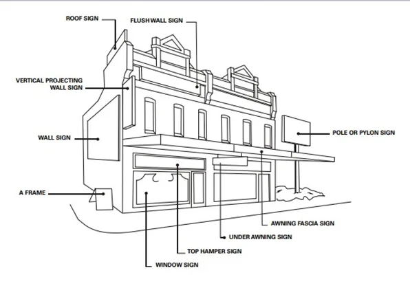

*Figure 1.3-c: Illustration of signage types (I)*

##### Table 1.3.2-h: Awning Fascia Sign

Should not project above or below the fascia

Should not be illuminated

An awning fascia sign is attached to the fascia or return end of an awning.

##### Table 1.3.2-i: Under Awning Sign

Should be erected below the awning fascia, horizontally to the ground and at right angles to the building

Should not exceed 0.4m in width

Should not exceed a vertical height of 0.5m

Should be located 2m from the side property boundary, and not closer than 3m to another under awning sign

A suspended under awning sign, also known as an under awning sign, is a sign attached to the underside of an awning.

<!-- SRC: HDCP 2024 Part 1 General - 23 June 2025.pdf | PAGE: 55 -->

##### Table 1.3.2-j: Flush wall and painted wall signs

Should not extend laterally beyond the wall of the building to which it is attached

Should be flush with the building

The total area of wall signs should not exceed 5m 2 , unless it can be demonstrated that the sign is consistent with the character of the locality in accordance with the Industry and Employment SEPP

A flush wall or painted wall sign are signs that are fixed flat or painted on the wall on which they are displayed. This also includes a top hamper sign. and a window sign. Note that painting a building in corporate colours may be considered a painted wall sign.

##### Table 1.3.2-k: Vertical projecting wall signs

Should not project above the wall to which it is attached Should not exceed 1.5m 2 in area

Should be erected at right angles to the wall of the building to which it is attached

Maximum of one sign per building

A projecting wall sign is a sign that is attached to the wall of a building and projecting horizontally more than 300mm.

| Table 1.3.2-l                                                                                          | Pole or pylon sign                                                                                     |
|--------------------------------------------------------------------------------------------------------|--------------------------------------------------------------------------------------------------------|
| Signage for multiple businesses within the one complex should be advertised on a single sign structure | Signage for multiple businesses within the one complex should be advertised on a single sign structure |
| Should not exceed a maximum height of 8m above ground                                                  | Should not exceed a maximum height of 8m above ground                                                  |
| Should not exceed 2m in width                                                                          | Should not exceed 2m in width                                                                          |
| Should not exceed 0.5m in depth                                                                        | Should not exceed 0.5m in depth                                                                        |
| Should be located:                                                                                     | Should be located:                                                                                     |
|                                                                                                       | Within property boundaries, and                                                                        |
|                                                                                                       | A minimum of 2.6m above any footpath.                                                                  |

A pole or pylon sign, also known as a freestanding signs, are signs erected on a pole or pylon independent of any building or other structure.

| Table 1.3.2-m: Moveable signs (A-Frame, sandwich board signs)                                                       |
|---------------------------------------------------------------------------------------------------------------------|
| Where site constraints make it difficult to provide a fixed sign, a moveable sign may be supported                  |
| Maximum area of 1.2m 2 per face - maximum 2 faces                                                                   |
| Should not exceed 0.6m in width                                                                                     |
| Should be located to maintain an unencumbered pedestrian throughfare of 2 metres where located on a public footpath |
| Minimum frontage of 6m per sign                                                                                     |

Moveable free standing signs are generally discouraged as they contribute to visual and physical clutter and increase trip hazards for pedestrians. It is preferable to have business identification signs fixed to buildings or structures.

##### Temporary Community Banners

- Temporary community banners are exempt from requiring development consent when erected in accordance with the provisions of Schedule 2 of the HLEP.
- Special consideration will be given to signs associated with community events that comply with Table 1.3.2-n below:

##### Table 1.3.2-n: Temporary Community Banner

The banner is a temporary advertisement for a religious, cultural, political, social or recreational event only

Maximum area of 4m 2

Sponsorship information is a maximum of 20% of the total area of the banner displayed at the venue or the sponsor's premises

The banner is erected a maximum of 28 days before the event

The banner is removed within 7 days following the event

Maximum of 6 banners are erected in association with the event at separate locations including the venue

The banner should not be attached to a tree

Details of the locations designated by Council as suitable for the display of community banners without consent are available at website www.hornsby.nsw.gov.au.

<!-- SRC: HDCP 2024 Part 1 General - 23 June 2025.pdf | PAGE: 56 -->

##### Signage for Agritourism Land Uses (Farm Stay Accommodation, Farm Gate Premises and Farm Experience Premises)

- Signage for farm gate premises, farm experience premises, farm stay accommodation or roadside stalls should be in keeping with the rural character and the nature of the operations on the property.
- All signage for farm gate premises, farm experience premises or farm stay accommodation should only be located within the boundary of the property.
- Business identification signs for farm gate premises, farm experience premises, farm stay accommodation or roadside stalls should be limited to a maximum of 2 signs facing a road frontage on the property.
- Any sign should:
-  Have a maximum height of 3 metres above ground level, and
-  Have a maximum area of 3 square metres, and
-  If it is illuminated, be non-flashing and have lighting that complies with AS 4282.
- Evacuation signage should be located near the farm gate premises, farm experience premises and farm stay accommodation, the property entrance and emergency assembly points and include contact details for emergency services.
- Waypoint markers should be provided to assist visitors and guests traverse a property where farm gate premises, farm experience premises or farm stay accommodation operate.

#### 1.3.2.12 Avoiding Isolated Sites

##### Desired Outcomes

- The consolidation of sites in a manner that avoids adjoining sites becoming isolated so that they cannot be developed in accordance with the planning controls.

##### Prescriptive Measures

- The creation of isolated sites is not desirable.
- Where a development may result in the creation of an isolated site, the applicant should demonstrate that:
-  Negotiations for amalgamations of sites commenced early, prior to the lodgement of a development application,
-  If negotiations are not successful, details of the negotiations should be provided with the development application submission, including at least one recent independent valuation (which considers the property as being part of a complying amalgamated site) and include other reasonable expenses likely to be incurred by the owner of the isolated property in the sale of the property, and
-  The orderly and economic development of the isolated site can be achieved that is consistent with the provisions of the HLEP and DCP. This should include the applicant providing an envelope for that site, indicating height, building form, setbacks and separations (building and basement) sufficient to understand the relationship between the proposed development and the isolated site and the streetscape implications.
- The development of an isolated site should not detract from the character of the streetscape and is to achieve a satisfactory level of amenity, including solar access, visual and acoustic privacy.
Notes:

An Isolated Site means a site whose size and location could potentially significantly limit development as a result of not being included in an adjoining development proposal. Sites may not be defined as isolated if they have the future potential to amalgamate with an alternate adjoining property.

For further information on the Planning Principles for considering the isolation of sites refer to Karavellas v Sutherland Shire Council [2004] NSWLEC 251 at www.lec.nsw.gov.au.

<!-- SRC: HDCP 2024 Part 1 General - 23 June 2025.pdf | PAGE: 57 -->

### 1.3.3 Hazards

The following section provides general controls for hazards and applies to all forms of development.

#### 1.3.3.1 Bushfire

##### Desired Outcomes

- Development that is located and designed to minimise the risk to life and property from bushfires.
- Development that balances the conservation of native vegetation and bushfire protection.

##### Prescriptive Measures

- Development on land identified as bushfire prone on Council's Bushfire Prone Land Map should address the bush fire protection measures in the publication Planning for Bushfire Protection (2019).
- Development should be located and designed to minimise the need for bushfire hazard reduction within native vegetation areas.
- Bushfire Asset Protection Zones should be located entirely within the development site.
- Measures such as higher fire resistant construction standards, improved access and water supplies should be considered for infill developments where they would reduce the need for removal of significant native vegetation, provided the development still complies with Planning for Bushfire Protection (2019).
Notes:

The key objectives and controls to address bushfire risk are not set out in this Plan but are incorporated into the NSW Rural Fire Service (RFS) publication entitled Planning for Bushfire Protection 2019 as well as the Rural Fires Act 1997 available at www.rfs.nsw.gov.au.

All development applications on bushfire prone land will require either:

-  A bushfire risk assessment and certification or
-  A detailed bushfire report (for integrated development)
A bushfire risk assessment and certification is prepared for non-integrated developments, such as single dwelling houses. A suitably qualified consultant can provide this assessment in the form of a report and certificate, which will state the applicable Bushfire Attack Levels (BAL) and the relevant Asset Protection Zones (APZ) required, and confirm that the development conforms to AS 3959 and Planning for Bushfire Protection 2019. For smaller proposals, applicants may choose to submit the NSW Rural Fire Service Single Dwelling Application Kit. Where the development is identified as BAL 40 or BAL FZ, Council will refer the bushfire risk assessment and certification to the RFS for its consideration.

A detailed bushfire report is required to be provided for Integrated Development under Section 100B of the Rural Fires Act 1997, including for the subdivision of land or development of a Special Fire Protection Purpose. The report must be prepared by a suitably qualified professional and address the requirements of Planning for Bushfire Protection 2019. Council will refer this report to the RFS for its consideration and General Terms of Approval.

<!-- SRC: HDCP 2024 Part 1 General - 23 June 2025.pdf | PAGE: 58 -->

#### 1.3.3.2 Flooding

HLEP Clause 5.21 contains provisions for development of land at or below the flood planning level.

##### Desired Outcomes

- Development that is located and designed to minimise the risk to life, property and the environment from flooding.

##### Prescriptive Measures

##### General

- Where a development proposal is on land at or below the flood planning level, a comprehensive flood study should be prepared by a qualified hydraulic engineer and is to be submitted with any development application on land that demonstrates that:
-  The development addresses the provisions of Clause 5.21 of the HLEP, and
-  The development complies with best practice.
- The overland flow path should not be built upon and should have minimal planting. Development is required to demonstrate that any overland flow is maintained for 1 in 100 year average recurrence interval (ARI) flood.
- All potential pollutants that are stored or detained on-site (such as on-site effluent treatment facilities, chemicals or hazardous materials) should be stored 0.5 metres above 1 in 100 year ARI flood level. Details should be provided as part of any application.

##### Sea Level Rise

- Development on land adjacent to tidal waters, including the Hawkesbury River and Berowra Creek, should be designed to minimise the risk to property and the environment from sea level rise in the event of a 1 in 100 year ARI flood by:
-  siting the floor level of habitable rooms, wet areas and other sensitive uses (eg. on-site wastewater disposal areas) above the 2100 (year) NSW sea level rise planning benchmark of 0.9 metres, and
-  siting other non-habitable structures (eg. sheds, decks, pergolas) above the 2050 (year) NSW sea level rise planning benchmark of 0.4 metres.
-  All habitable floor levels are to be a minimum of 0.5m above the 1:100 ARI Flood Level and all garages or basement ramps should be 0.3 metres above the 1:100 ARI Flood level.
Notes:

A Section 10.7 Planning Certificate will identify if land is located within a flood planning area, at or below the flood planning level. Land within flood planning areas may be subject to exposure to tidal inundation and/or flood hazard risk.

For best practice guidelines refer to:

-  NSW Government's Flood Risk Management Manual (2023), and
-  NSW Coastal Planning Guideline: Adapting to Sea Level Rise (DoP 2010) and
-  Flood Risk Management Guide - Incorporating sea level rise benchmarks in flood assessments (DECCW 2010).
This DCP refers to the 1 in 100 year Average Recurrence Interval (ARI) flood event for flood planning purposes. ARI is the long-term average number of years between the occurrence of a flood as big as or larger than the selected event. This flood event is a tool for broadly assessing the suitability of land for development. It does not mean that properties and development above the flood planning level are not subject to flood risk.

The NSW Sea Level Rise Policy Statement (2009) adopts a sea level rise planning benchmark of an increase above 1990 mean sea levels of 90cm by 2100 or 0.4m by 2050.

The CSIRO on behalf of the Sydney Coastal Council Group (SCCG) has undertaken modelling of coastal inundation under future sea levels. They have released sea level rise maps for Hornsby Shire that will help residents understand the impact of predicted sea levels. The maps can be accessed online at: www.hornsby.nsw.gov.au/property/build/sea-level-rise-map.

<!-- SRC: HDCP 2024 Part 1 General - 23 June 2025.pdf | PAGE: 59 -->

#### 1.3.3.3 Acid Sulfate Soils

HLEP Clause 6.1 contains provisions for development of land that may contain acid sulfate soils. These lands are identified on the HLEP Acid Sulfate Soils Map.

##### Desired Outcomes

- Development that does not disturb, expose or drain acid sulfate soils and cause environmental damage.

##### Prescriptive Measures

- Developments that involve the carrying out of works prescribed in Clause 6.1 of the HLEP should be accompanied by an Acid Sulfate Soil Management Plan prepared in accordance with the Acid Sulfate Soils Manual.

##### Notes:

For further information refer to the HLEP and the Acid Sulfate Soils Map.

The Acid Sulfate Soils Manual means the manual by that name published by the Acid Sulfate Soils Management Advisory Committee and made publicly available.

A preliminary investigation of the proposed development site or an acid sulfate soils management plan required by the HLEP must be prepared by a suitably qualified environmental consultant.

#### 1.3.3.4 Land Contamination

##### Desired Outcomes

- Development that remediates contaminated land for the purpose of reducing the risk of harm to human health and the environment.

##### Prescriptive Measures

- Developments applications should prepare and submit a preliminary contamination assessment in accordance with the State Environmental Planning Policy (Resilience and Hazards) 2021 (Resilience and Hazards SEPP) where land is suspected to be contaminated, and:
-  The application proposes a change of use to a sensitive land use such as residential, educational, recreational, child care purposes, or for the purposes of a hospital land, or
-  Work is proposed that may disturb contaminated land (for example, earthworks at a petrol station).
- Where a preliminary assessment identifies that a contaminant is present on the site, a detailed investigation of the site should also be prepared and lodged with the development application.
- A remedial action plan, validation report and a site audit statement may also be required to be completed.

##### Notes:

For further information refer to:

-  Resilience and Hazards SEPP is available at www.legislation.nsw.gov.au, and
-  NSW Environment Protection Authority's Consultants reporting on contaminated land - Contaminated Land Guidelines available at www.epa.nsw.gov.au.

<!-- SRC: HDCP 2024 Part 2 Rural - 18 July 2024.pdf | PAGE: 60 -->

##### Hornsby Development Control Plan 2024

Part 2 Rural

<!-- SRC: HDCP 2024 Part 2 Rural - 18 July 2024.pdf | PAGE: 61 -->

##### 2 Rural

| 2.4   | Dural Village              | 2-33   |
|-------|----------------------------|--------|
| 2.4.1 | Scale                      | 2-33   |
| 2.4.2 | Setbacks                   | 2-35   |
| 2.4.3 | Landscaping                | 2-36   |
| 2.4.4 | Open Space                 | 2-37   |
| 2.4.5 | Sunlight Access            | 2-37   |
| 2.4.6 | Privacy and Security       | 2-38   |
| 2.4.7 | Vehicle Access and Parking | 2-39   |
| 2.4.8 | Design Details             | 2-39   |
| 2.5   | Extractive Industries      | 2-40   |
| 2.5.1 | Setbacks                   | 2-40   |
| 2.5.2 | Transport                  | 2-41   |
| 2.5.3 | Water Resources            | 2-41   |
| 2.5.4 | Soil and Water Management  | 2-43   |
| 2.5.5 | Acoustic Environment       | 2-45   |
| 2.5.6 | Air Quality                | 2-46   |
| 2.5.7 | Mitigation and Monitoring  | 2-47   |
| 2.5.8 | Extraction Sequence        | 2-47   |
| 2.5.9 | Rehabilitation             | 2-48   |

<!-- SRC: HDCP 2024 Part 2 Rural - 18 July 2024.pdf | PAGE: 62 -->

##### Introduction

This Part of the DCP applies to land within the Rural area of Hornsby Shire. The Rural areas extend from Glenhaven and Dural in the south to Wisemans Ferry in the North, as indicated in Figure 2-a.

The planning controls for the rural area are informed by the Rural Lands Study (1995), the Rural Resource Lands Study (2006), the Hornsby Shire Rural Lands Planning Provisions Review (2009) and the Hornsby Shire Rural Lands Strategy (2022).

The Rural Lands Strategy (2022) supports the Hornsby LSPS, presenting a vision, principles and recommendations for the future planning of Hornsby Shire's rural area. The implementation of the Strategy's recommendations will inform future changes to the development controls in this DCP.

Development in rural areas will be environmentally sustainable and protect and improve water quality, native flora and fauna, soil, air and other environmental values. Development will also protect and enhance the visual qualities and characteristics of the rural environment by being compatible with the scale, form, design, colour, height, materials, setbacks and landscaping of the surrounding rural area.

Rural uses will be protected and promoted in Hornsby Shire as they are important for the local and regional economy. Existing or potentially productive agricultural land will be protected from fragmentation and sterilisation by competing land uses as agricultural production provides an important source of food supply and natural resources for the Sydney Basin. Natural and manmade tourism and tourist infrastructure important for the economy will also be protected from the encroachment of urban and rural residential development.

<!-- SRC: HDCP 2024 Part 2 Rural - 18 July 2024.pdf | PAGE: 63 -->

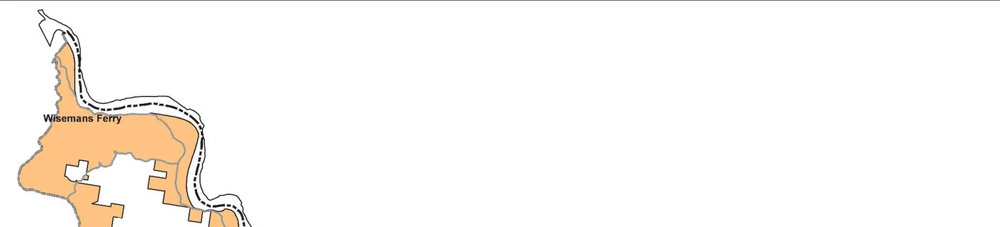

*Figure 2-a: The Rural Area of Hornsby Shire. (C)*

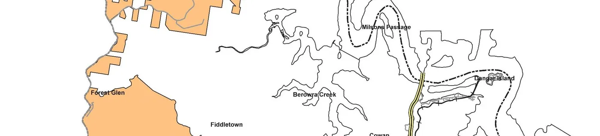
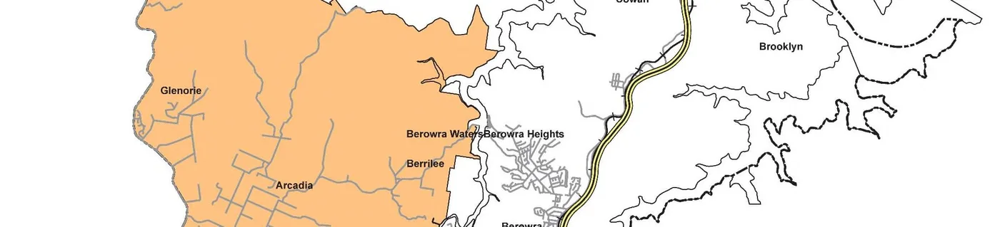
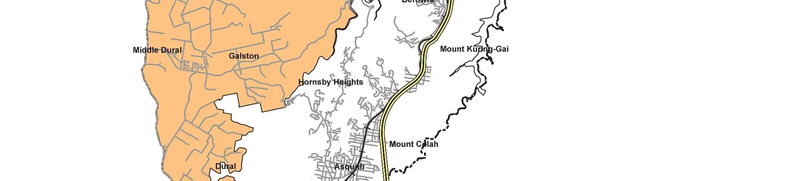
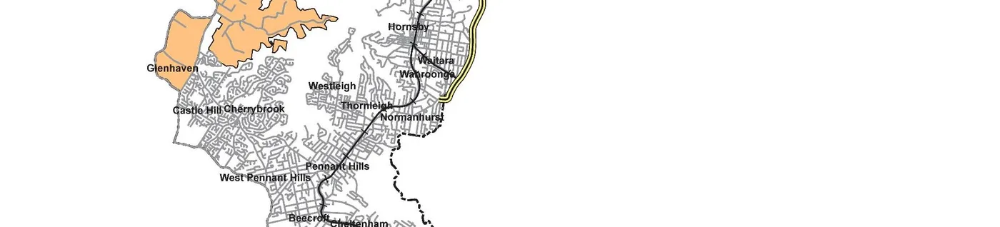

<!-- SRC: HDCP 2024 Part 2 Rural - 18 July 2024.pdf | PAGE: 64 -->

## 2.1 Rural Buildings

The following section provides controls for the erection of a building or structure in the following zones: RU1 Primary Production, RU2 Rural Landscape, RU4 Small Lot Primary Production, SP3 Tourist (Wisemans Ferry), C2 Environmental Conservation and C3 Environmental Management.

### 2.1.1 Scale

#### Desired Outcomes

- Development with a height, bulk and scale that is compatible with the rural area.

#### Prescriptive Measures

#### Height

- Sites with the following maximum building heights under Clause 4.3 of the HLEP should comply with the maximum number of storeys in Table 2.1.1-a.
- Buildings should respond to the topography of the site by minimising earthworks (cut and fill).
- A transition in building height should be provided at sensitive interface areas adjacent to heritage items.
Table 2.1.1-a:  Translations of Height to Storeys

| HLEP Area   | Maximum Building Height (m)   | Maximum Storeys (excluding basement carparking)   |
|-------------|-------------------------------|---------------------------------------------------|
| K           | 10.5m                         | 2 storeys + attic                                 |

*Table 2.1.1-a: Translations of Height to Storeys*

#### Notes

Building height (or height of building) means the vertical distance between ground level (existing) and the highest point of the building, including plant and lift overruns, but excluding communication devices, antennae, satellite dishes, masts, flagpoles, chimneys, flues and the like.

Storey means a space within a building that is situated between one floor level and the floor level next above, or if there is no floor above, the ceiling or roof above, but does not include:

(a) a space that contains only a lift shaft, stairway or meter room,

(b) a mezzanine, or

(c) an attic.

Basement means the space of a building where the floor level of that space is predominantly below ground level (existing) and where the floor level of the storey immediately above is less than 1 metre above ground level (existing).

#### Roof Design

- To ensure conformity with the landscape and protection of the scenic quality of the area, roof pitch and design should:
-  sit below the dominant tree canopy, and
-  not detract from natural ridgelines, and
-  consider the slope of land.
- The roof should have a maximum pitch of 35 degrees, except if a steeper roof pitch is more consistent with the existing character of the locality.
- Any attic level is to be contained wholly within the roofspace.
- The external walls of the building should not extend above the attic floor level.

#### Notes:

Attic means any habitable space, but not a separate dwelling, contained wholly within a roof above the ceiling line of the storey immediately below, except for minor elements such as dormer windows and the like.

#### Figure 2.1-a: Explanation of building height controls (I)

Height controls are based on a typical residential floor to floor height of 3 metres, with allowances for roof articulation and undercroft areas for steeply sloping sites.

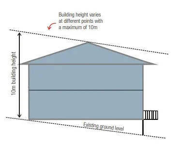

<!-- SRC: HDCP 2024 Part 2 Rural - 18 July 2024.pdf | PAGE: 65 -->

#### Site Coverage

- The maximum site coverage of all buildings on the property should comply with Table 2.1.1-b as follows:
Table 2.1.1-b:  Maximum Site Coverage

| Lot Size           | Maximum Site coverage (% of total lot size)   |
|--------------------|-----------------------------------------------|
| Up to 899m 2       | 50%                                           |
| 900m 2 to 1499m 2  | 40%                                           |
| 1500m 2 to 3999m 2 | 30%                                           |
| 4000m 2 or larger  | On merit, based on- site constraints          |

*Table 2.1.1-b: Maximum Site Coverage*

Notes:

Site coverage means the proportion of a site area covered by buildings. However, the following are not included for the purpose of calculating site coverage:

(a) any basement, and

(b) any part of an awning that is outside the outer walls of a building and that adjoins the street frontage or other site boundary, and

- (c) any eaves, and
- (d) unenclosed balconies, decks, pergolas and the like.
Lot size (or site area) in relation to development, means the area of the lot to which an application for consent to carry out the development relates, excluding:

(a) any land on which the development is not permitted under an environmental planning instrument, and

(b) if a lot is a battle-axe or other lot with an access handle, the minimum lot size excludes the area of the access handle.

#### Rural Outbuildings

- All rural outbuildings on lots 4000m 2 or larger should have a maximum area of 250m 2 for each outbuilding and a total maximum combined area of all outbuildings of 500m 2 unless demonstrated that they are required for an intensive rural activity.

#### Roadside Stalls

- Roadside stalls on land zoned RU1, RU2, and RU4 should be no greater than 40m 2 pursuant to Clause 5.4 of the HLEP.
- Roadside stalls should be constructed in a form and of materials that are of a rural character.
- Roadside stalls should provide a concession to the setbacks contained in Table 2.1.2-a to enable a temporary structure to have a minimum setback of 1 metre from the front property.
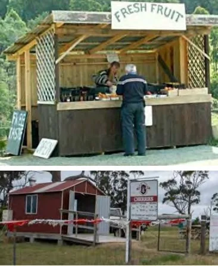

*Figure 2.1-b: Examples of roadside stalls that are of a rural character (Globe Notes Travel 2014, Fruit Growers Tasmania Inc 2008). (E)*

#### Notes:

Outbuilding means any of the following class 10a buildings under the Building Code of Australia:

(a) balcony, deck, patio, pergola, terrace or verandah that is detached from a dwelling house,

- (b) cabana, cubby house, fernery, garden shed, gazebo or greenhouse,
- (c) carport that is detached from a dwelling house,
- (d) farm building,
- (e) garage that is detached from a dwelling house,
- (f) rainwater tank (above ground) that is detached from a dwelling house,
- (g) shade structure that is detached from a dwelling house,
- (h) shed.
An intensive rural activity includes intensive agriculture, garden centres, plant nurseries and landscaping material supplies, animal boarding or training establishments, rural industries and the like.

Roadside stall means a place or temporary structure used for the retail sale of agriculture produce of hand crafted goods (or both) produced from the property on which the stall is situated or from an adjacent property.

<!-- SRC: HDCP 2024 Part 2 Rural - 18 July 2024.pdf | PAGE: 66 -->

### 2.1.2 Setbacks

#### Desired Outcomes

- Setbacks that complement the rural character and allow for separation between neighbouring rural developments.
- Setbacks that retain natural landscape features.

#### Prescriptive Measures

- All buildings and structures should comply with the minimum boundary setbacks in Table 2.1.2-a.
- The above setback controls also apply to structures, including crop netting and green houses.
Table 2.1.2-a: Minimum Boundary Setbacks

| Property Boundary                   | Lots < 4,000m 2                                                                                       | Lots > 4,000m 2                                        |
|-------------------------------------|-------------------------------------------------------------------------------------------------------|--------------------------------------------------------|
| Waterfront Setback                  | see Clause 6.1 of HLEP and Foreshore Building Line Map                                                | see Clause 6.1 of HLEP and Foreshore Building Line Map |
| Front boundary (primary frontage)   | 10m or the average of the front setbacks of the nearest two neighbouring houses, whichever is greater | 15m to local roads and 30m to designated roads         |
| Secondary boundary (on corner lots) | 5m                                                                                                    | 10m                                                    |
| Side boundary                       | 5m                                                                                                    | 10m                                                    |
| Rear boundary                       | 10m                                                                                                   | 15m                                                    |

*Table 2.1.2-a: Minimum Boundary Setbacks*

#### Sites with more than one frontage

- For buildings with a corner frontage:
-  front and rear boundary setbacks apply to the shorter street frontage (the primary frontage), and
-  side boundary setbacks apply to the longer of the two street frontages (the secondary boundary).
- For a lot that adjoins parallel roads, the front boundary setback control applies to both the primary frontage and the parallel road boundary.

#### Setbacks to Landscape Features

- The setback of buildings from the property boundary may need to be increased to maintain landscape features, as detailed in Section 2.1.3 of this DCP.

#### Landuse Separation

- Despite the setbacks in Table 2.1.2-a, a proposed sensitive landuse located adjacent to an existing intensive rural activity, may need an increased boundary setback to minimise potential landuse conflict and comply with the Landuse Separation provisions in Section 2.2 of this DCP.

#### Setback Encroachments

- The following minor structures are able to encroach into the prescribed setbacks:
-  A driveway between the on-site car parking area and a public road,
-  Stairs to the ground floor of the dwelling,
-  Fences,
-  A rural outbuilding on a designated road, with a maximum total floor area of 200m 2 is able to encroach to within 20 metres of the primary frontage on a designated road,
-  An inground swimming pool is able to encroach to within 1 metre of the side or rear boundary, measured to the water line,
-  A dam with a wall height less than 3 metres is able to encroach to within 5 metres of any boundary, and
-  A roadside stall with a maximum area of 20m 2 may be located on-site adjacent to the front property boundary.
Notes:

#### Designated roads

Designated roads are Council identified roads that require development to have an increased setback from the road edge, consistent with the established streetscape. A list of designated roads is provided in Annexure C.

An intensive rural activity includes intensive agriculture, garden centres, plant nurseries and landscaping material supplies, animal boarding or training establishments, rural industries, extractive industries and the like.

Sensitive land uses include dwellings or approved building envelopes on vacant lots, tourist accommodation, community uses, educational uses, public open space, and sheds or premises used for the manufacture, preparation, sale or storage of food.

<!-- SRC: HDCP 2024 Part 2 Rural - 18 July 2024.pdf | PAGE: 67 -->

### 2.1.3 Landscaping

#### Desired Outcomes

- Landscaping that integrates the built form with the locality and enhances the tree canopy.
- Landscaping that retains existing landscape features.
- Landscaping that is consistent with the visual landscapes in the rural area.

#### Prescriptive Measures

#### General

- Landscaping should maintain the natural features, topography and vegetation on the site.
- Setback areas should be landscaped.
- Vehicle crossings should be located to preserve natural vegetation which contributes to the visual amenity of the area.
- Intensive rural activities should provide a landscape buffer to boundaries with a minimum width of 5 metres.
- Development along main roads should be provided with screening vegetation in front and side setback areas that maintains existing rural character.

#### Retention of Landscape Features

- Buildings, driveways and service trenches should have a minimum setback:
-  in accordance with the 'Watercourses' element in Section 1.3.1.3 of this DCP,
-  10 to 20 metres to significant bushland as prescribed in the 'Biodiversity' element in Section 1.3.1.1 of this DCP, and
-  in accordance with the requirements of AS4970 from significant trees to be retained.

#### Notes:

An intensive rural activity includes intensive agriculture, garden centres, plant nurseries and landscaping material supplies, animal boarding or training establishments, rural industries, extractive industries and the like.

A Landscape buffer is to include screen planting, preferably including vegetation that is endemic to the area. Alternatively, fire retardant species should be considered in bushfire prone areas.

The applicant is encouraged to incorporate plant species indigenous to Hornsby Shire as part of the development. Refer to Council's website www.hornsby.nsw.gov.au.

#### Main roads

Development adjoining roads that are subject to Section 2.119 of the Transport and Infrastructure SEPP require separate approval from Transport for NSW (TfNSW) for access to State and Regional Roads as classified by TfNSW. A list of classified and unclassified main roads for Hornsby Shire is provided in Annexure C.

#### Fences and Gates

- Frontages/streetscapes should not contain excessively urban features such as formal gates and high fences.
- Fences should be open style and constructed of materials such as timber or post and wire, with a maximum height of 1.8 metres.
- Any masonry gate entry feature should not extend more than 3 metres either side of the driveway entrance.
- High, solid fences constructed as sound barriers should be avoided. On main roads alternative measures of reducing traffic noise should be explored, such as double glazing, internal layout, earth mounds and vegetation, rather than high solid fences.
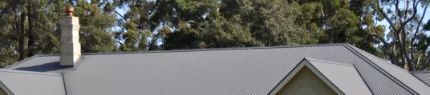

*Figure 2.1-c: Example of a suitable open style rural fence (E)*

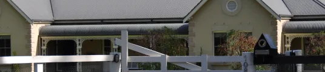

*Figure 2.1-d: Example of a masonry entry feature that does not extend more than 3 metres either side of the driveway (E)*

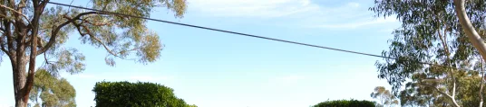
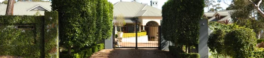
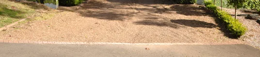

<!-- SRC: HDCP 2024 Part 2 Rural - 18 July 2024.pdf | PAGE: 68 -->

### 2.1.4 Open Space

#### Desired Outcomes

- Private open space that functions as an extension to a dwelling house.

#### Prescriptive Measures

#### Principal Private Open Space

- A dwelling house should be provided with private open space that incorporates a principal private open space area in accordance with Table 2.1.4-a.
Table 2.1.4-a: Minimum Private Open Space

| Minimum Principal Area   | Minimum Dimension of Principal Area   |
|--------------------------|---------------------------------------|
| 24m 2                    | 3m                                    |

- The principal private open space area should be sited behind the front building line and be directly accessible from the living area of the dwelling.
- The principal private open space area should be generally level and may be in the form of a deck, patio, terrace or paved area.

#### Clothes Drying Area

- Each dwelling should have an external air clothes drying area that is separate from the principal private open space area. This facility is to be screened from public areas.

### 2.1.5 Vehicle Access and Parking

#### Desired Outcomes

- Development that provides sufficient and convenient parking with vehicular access that is simple, safe and direct.

#### Prescriptive Measures

- Car parking for dwelling houses should be provided behind the front building line.
- A paved driveway should be provided between the required on-site car parking area and a public road.
- A driveway should be setback a minimum 2 metres from side boundaries to provide for landscaping between the driveway and the side boundary.

#### Note:

Refer to Part 1 General of the DCP for more detailed parking and service vehicle design requirements.

<!-- SRC: HDCP 2024 Part 2 Rural - 18 July 2024.pdf | PAGE: 69 -->

### 2.1.6 Design Details

#### Desired Outcomes

- Development that contributes positively to the character of the rural area.
- Building sizes, styles and forms that relate to the character of the area.

#### Prescriptive Measures

#### Building Form

- Buildings should be sited to maintain the continuity of, and minimise the disturbance to, agriculturally productive land.
- Buildings should consist of simple forms and planes.
- Extensive blank or unarticulated walls to street frontages are discouraged.
- Buildings and structures should respond to the topography of the site by minimising earthworks (cut and fill).
- On steeply sloping sites, split level and/or pole or pier construction of buildings is encouraged.
- Buildings, structures and driveways should be located to retain natural vegetation and follow the natural contours of the land.
- Parking areas and driveways should not dominate the streetscape.
- Development along main roads should be designed and sited to contribute positively to the surrounding rural landscape.

*Figure 2.1-e: Example of a dwelling house designed and sited to contribute positively to the rural landscape. (E)*

#### Colours and Materials

- Building materials of dwelling houses should contribute to the rural character, including: stone masonry, brickwork or timber construction with tile, slate or metal roofing.
- Building materials, colours and finishes of development along main roads should be sympathetic to the surrounding landscape.
- Building colours should be harmonious with the surrounding natural environment.

#### Storage Areas

- Outdoor storage areas should be located behind the front building setback and screened from view from adjoining sensitive areas.
- Above ground liquid storage facilities, including chemicals and waste, should be in a covered bunded area that is constructed of impervious materials.

#### Undercrofts (Steep Sites)

- Undercroft spaces with a vertical height at any point of more than 1.5 metres above existing ground level should not be enclosed.
- Undercrofts, including any plumbing or rainwater tanks located within, should be painted in dark recessive colours.
- Supports to habitable platforms above undercrofts should be setback a minimum of 2 metres from the leading platform edge to reduce the overall bulk and scale of the undercroft area.
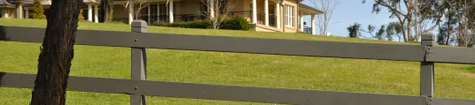

*Figure 2.1-f: Example of a rural outbuilding sited and designed to contribute positively to the rural landscape. (E)*

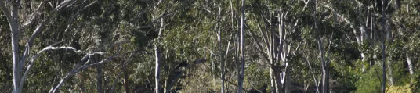
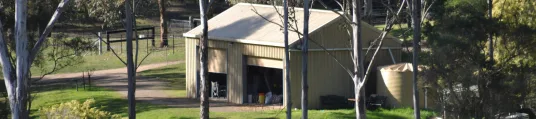

<!-- SRC: HDCP 2024 Part 2 Rural - 18 July 2024.pdf | PAGE: 70 -->

## 2.2 Rural Land Uses

The following section provides controls for rural land uses, in addition to the building controls provided elsewhere in this DCP.

### 2.2.1 Intensive Plant Agriculture

#### Desired Outcome

- Intensive plant agriculture establishments that are appropriately separated from adjoining sensitive land uses to minimise visual impacts and land use conflicts.
- Development for intensive plant agriculture that does not result in significant landform modification.

#### Prescriptive Measures

#### General

- Site planning should provide adequate area for:
-  landscaping buffers,
-  dams and/or water tanks,
-  waste water treatment,
-  water quality treatment,
-  driveways and parking areas, and
-  dwelling houses and ancillary facilities.
- Any portion of a site with a slope greater than 10% should not be used for intensive plant agriculture.

#### Landuse Separation

- Intensive plant agriculture should be sited to limit the potential for land use conflicts with neighbouring sensitive land uses.
- Structures should be screened by the use of crops or landscape buffers.
- The distance between intensive plant agriculture and an adjoining dwelling house should conform to the minimum requirements in Table 2.2.1-a.
Table 2.2.1-a:  Minimum separation to intensive plant agriculture

| Land use in Rural Zone                                                        | Separation to Intensive Plant Agriculture (metres)   |
|-------------------------------------------------------------------------------|------------------------------------------------------|
| Any dwelling (whether on a neighbouring property) (with no vegetation buffer) | 50m                                                  |
| Any dwelling (whether on a neighbouring property) (with a vegetation buffer)  | 20m                                                  |

*Table 2.2.1-a: Minimum separation to intensive plant agriculture*

#### Notes:

Intensive plant agriculture means any of the following:

(a) the cultivation of irrigated crops for commercial purposes (other than irrigated pasture or fodder crops),

- (b) horticulture,
- (c) turf farming,
- (d) viticulture.
Sensitive land uses include dwellings or approved building envelopes on vacant lots, tourist accommodation, community uses, educational uses, public open space, and sheds or premises used for the manufacture, preparation, sale or storage of food.

Vegetation buffers should provide significant foliage and grow to a height to screen structures. In bushfire prone areas, fire retardant species should be utilised.

For further information refer to Prime Fact 1139 Assessing Intensive Plant Agriculture Developments (Dec 2011) by the Department of Primary Industries available on www.dpi.nsw.gov.au.

The minimum separations prescribed in Table 2.2.1-a aim to minimise rather than eliminate impacts from rural activities. Larger separations between intensive plant agriculture and sensitive uses at a zone interface would be appropriate to ensure all impacts are internalised.

<!-- SRC: HDCP 2024 Part 2 Rural - 18 July 2024.pdf | PAGE: 71 -->

### 2.2.2 Water Storage Facilities (Dams)

#### Desired Outcomes

- Water storage facilities that are constructed and sited to be stable and have minimal environmental impact.

#### Prescriptive Measures

- Dams should not prevent or significantly alter water flows to adjoining properties or natural ecosystems.
- Dams should not be located on sites with a gradient in excess of 15%.
- Dam design guidelines are illustrated in Figure 2.2-a. The dam spillway should be designed for the 1 in 20 year storm event.
- Development applications for a dam that has a maximum capacity greater than 0.4 megalitres or for an additional dam that results in the total capacity of all dams on the property exceeding 1 megalitre should be accompanied by a report from a suitably qualified hydraulic services consultant, assessing the impact that the proposed dam will have on downstream flows and environments.
- Water quality management measures should be incorporated with the dam, such as vegetation on the perimeter of the dam and within the dam to reduce the occurrence of problematic algae.

Figure 2.2-a: Dam Design Guidelines (C)

*Figure 2.2-a: Dam Design Guidelines (C)*

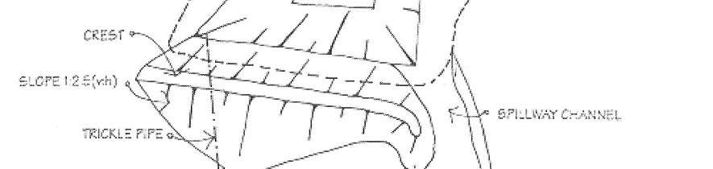

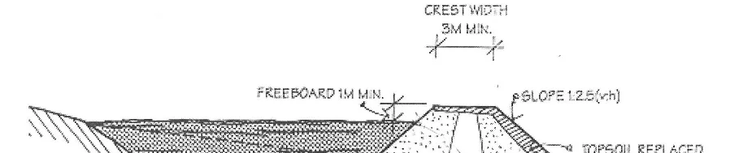
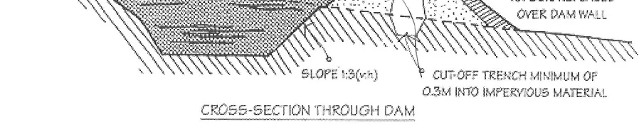
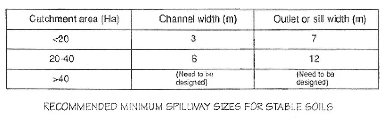

<!-- SRC: HDCP 2024 Part 2 Rural - 18 July 2024.pdf | PAGE: 72 -->

### 2.2.3 Garden Centres, Plant Nurseries and Landscaping Material Supplies

#### Desired Outcome

- Garden centres, plant nurseries and landscaping material supplies that are sympathetic to the rural character of the area and appropriately separated from adjoining sensitive land uses to minimise visual impacts and land use conflicts.

#### Prescriptive Measures

#### General

- Site planning should provide adequate area for:
-  landscaping buffers,
-  dams and/or rainwater tanks,
-  waste water treatment,
-  water quality treatment,
-  driveways and parking areas, and
-  sanitary facilities for staff and customers.
- External storage areas, including bulk bin storage, should be:
-  located behind the front building line, and
-  setback a minimum of 10 metres from side and rear boundaries, and
-  landscaped with significant foliage to screen any storage items and structures.

#### Landuse Separation

- Noise generating components of the development such as loading and unloading areas, cafes, and childrens play areas should be sited to limit the potential for land use conflicts with neighbouring sensitive land uses.
- The distance between any planted areas/green houses and an adjoining dwelling house should conform to the minimum requirements in Table 2.2.1-a.

#### Ancillary Land Uses

- The maximum floor space permitted to be constructed/utilised for a permissible ancillary use such as retailing and restaurants combined is:
-  (a) a maximum of 20% of the site area used for the garden centre; or
-  (b) 400m 2 ,
whichever is the lesser.

- Ancillary uses to garden centres and the like should have the same hours of operation as the landscape and/or material supply business.
Notes:

Garden centre means a building or place the principal purpose of which is the retail sale of plants and landscaping and gardening supplies and equipment. It may, if ancillary to the principal purpose for which the building or place is used, include a restaurant or cafe and the sale of any the following:

(a) outdoor furniture and furnishings, barbeques, shading and awnings, pools, spas and associated supplies, and items associated with the construction and maintenance of outdoor areas,

- (b) pets and pet supplies,
(c) fresh produce.

Plant nursery means a building or place the principal purpose of which is the retail sale of plants that are grown or propagated on-site or on an adjacent site. It may include the on-site sale of any such plants by wholesale and, if ancillary to the principal purpose for which the building or place is used, the sale of landscape and gardening supplies and equipment and the storage of these items.

Landscaping material supplies means a building or place used for the storage and sale of landscaping supplies such as soil, gravel, potting mix, mulch, sand, railway sleepers, screenings, rock and the like.

<!-- SRC: HDCP 2024 Part 2 Rural - 18 July 2024.pdf | PAGE: 73 -->

### 2.2.4 Animal Boarding or Training Establishments

#### Desired Outcomes

- Animal boarding and training establishments (including exercising areas) should be sited and designed to minimise noise and odour impacts on adjoining land.

#### Prescriptive Measures

#### General

- Animal boarding and training establishments (including exercising areas) should be sited and designed to minimise noise and odour impacts on adjoining land.
- Applications should be accompanied with a management plan addressing sustainable stocking rates that take into account pasture quality, hand feeding and land degradation.

#### Landuse Separation

- Animal accommodation (such as stables, kennels, exercise areas, aviaries, pens and the like) should be separated from sensitive land uses at least in accordance with Table 2.2.4-a.
- Notwithstanding the above, an increase in the minimum separation to sensitive land uses may be required, taking into account the following:
-  The likely generation of noise. An Acoustic Consultant should recommend suitable separations to sensitive land uses taking into account the intensity of the facility (number of animals), the building construction proposed, any exercise run design and other noise attenuation measures, and
-  The likely generation of offensive odours. An odour modelling assessment should be provided that may require an increase in land use separation to sensitive land uses.
- Noise from barking dogs should be limited by design techniques such as:
-  siting kennels so that they do not face each other,
-  limiting external stimulation, e.g. by partitioning between kennels or using blinds,
-  provide screening between the dogs and neighbouring properties and the public domain in order to avoid distracting the animals, (eg. by children playing, vehicles entering and leaving a property), and
-  holding dogs singly or in compatible pairs.
Table 2.2.4-a:  Minimum separation between animal boarding and training establishment and sensitive land uses

| Animal Accommodated   | Minimum Separation to Sensitive Land Uses (metres)   |
|-----------------------|------------------------------------------------------|
| Poultry               | 30m                                                  |
| Ducks                 | 30m                                                  |
| Horses                | 30m                                                  |
| Goats                 | 45m                                                  |
| Pigs                  | 60m                                                  |
| Cats and Dogs         | 100m                                                 |

*Table 2.2.4-a: Minimum separation between animal boarding and training establishment and sensitive land uses*

#### Notes:

An animal boarding or training establishment means a building or place used for the breeding, boarding, training, keeping or caring of animals for commercial purposes (other than for the agistment of horses), and includes any associated riding school or ancillary veterinary hospital.

Sensitive land uses include dwellings or approved building envelopes on vacant lots, tourist facilities, community uses, educational uses, public open space, and sheds or premises used for the manufacture, preparation, sale or storage of food.

For further information refer to Prime Fact 932 Planning for Horse Establishments 2009 for details on stocking rates for horses available at www.dpi.nsw.gov.au and/or contact the NSW Department of Primary Industries.

Refer to the Schedule 2 of the Local Government (General) Regulation 2021 for additional controls on the keeping on animals.

<!-- SRC: HDCP 2024 Part 2 Rural - 18 July 2024.pdf | PAGE: 74 -->

### 2.2.5 Rural Industry

#### Desired Outcome

- Rural industries that are sympathetic to the rural character of the area and have minimal impact on environment and the amenity of surrounding land uses.

#### Prescriptive Measures

- The following criteria should be considered in selecting a site for a rural industry:
-  sites greater than 4000m 2 ,
-  reduced exposure to neighbouring dwellings and noise sensitive areas,
-  the intensity, size and scale of the industry,
-  sites with good vehicular access, parking, and loading/unloading facilities,
-  ability to visually screen the development, and
-  an appropriate area for expansion.
- Rural industries should be sited and designed to minimise noise, odour and visual impacts on adjoining land uses and include measures such as:
-  landscaped buffers,
-  odour management,
-  sound attenuation, such as earth mounds, fencing and insulation of machinery.

#### Note:

A rural industry means the handling, treating, production, processing, storage or packing of animal or plant agricultural products for commercial purposes, and includes any of the following:

- (a) agricultural produce industries,
- (b) livestock processing industries,
- (c) composting facilities and works (including the production of mushroom substrate),
- (d) sawmill or log processing works,
- (e) stock and sale yards,
- (f) the regular servicing or repairing of plant or equipment used for the purposes of a rural enterprise.

### 2.2.6 Rural Workers' Dwelling

#### Desired Outcomes

- Rural workers' dwellings that facilitate the use of land for a commercially viable rural operation and maintain the rural character of the area.

#### Prescriptive Measures

- A rural workers' dwelling should:
-  have a maximum gross floor area of 110m 2 , or
-  involve the conversion of an existing dwelling.
- Rural workers' dwellings should only be constructed where rural undertakings on the property have the capacity to support both the primary producer and the rural worker.
- Rural workers' dwellings should be located not to affect the capability of land to be used for agriculture.
- All applications for rural workers dwellings should be accompanied by advice from a qualified agricultural consultant or financial documentation certifying that the agricultural activity on the allotment justifies the demand for a rural workers dwelling.
- Development applications for a rural workers' dwellings should be accompanied by:
(a) a site plan showing the nature and extent of agricultural undertakings on the land;

(b) a detailed description of the agricultural undertakings on the land which should include:

-  the calculated area of the site used for each agricultural activity,
-  the rural workers' hours of employment, and
-  the number of people employed, and on what basis (e.g. full-time, part-time, casual, seasonal).
(c) gross margin budgets or accounts which demonstrate the ability of the established enterprises to support both the farmer and the rural worker.

- A rural workers dwelling cannot be erected on a separate lot created for the purposes of primary production pursuant to Clause 4.2 of the HLEP.

#### Note:

A rural worker's dwelling means a building or place that is additional to a dwelling house on the same lot and that is used predominantly as a place of residence by persons employed, whether on a long-term or short-term basis, for the purpose of agriculture or a rural industry on that land.

<!-- SRC: HDCP 2024 Part 2 Rural - 18 July 2024.pdf | PAGE: 75 -->

### 2.2.7 Secondary Dwelling

HLEP Clause 5.5 contains provisions for development of Secondary Dwellings on rural land. The following controls apply to land zoned RU1 Primary Production, RU2 Rural Landscape, RU4 Small Lot Primary Production, and RU5 Village.

#### Desired Outcomes

- Secondary dwellings that provide opportunity for an extension of family accommodation or affordable rental accommodation in the rural area and maintain the rural character of the area.

#### Prescriptive Measures

- A secondary dwelling should:
-  have a maximum total floor area of 120m 2 , or
-  33% of the total floor area of the principal dwelling, whichever is the greater.
- Secondary dwellings should not be attached to farm buildings or rural buildings.
- Secondary dwellings should be located not to affect the capability of land to be used for agriculture.
- Vehicular access to both dwellings should be from a single common driveway or access from the public road.
- Where the creation of a secondary dwelling involves an extension to an existing dwelling house, the secondary dwelling should be constructed of the same materials of the existing dwelling, or the existing dwelling should be renovated to match the proposed external materials of the new dwelling.
- Where the primary and secondary dwelling are attached on land zoned RU1, RU2 and RU4, the total length of the front elevation should not exceed 50% of the frontage of the lot.
- Subdivision of land to provide a separate lot for an approved secondary dwelling is not supported if the resultant lots are smaller than the applicable minimum lot size shown on the HLEP Lot Size Map, pursuant to Clause 2.6 of the HLEP.
- A secondary dwelling cannot be erected on a separate lot created for the purposes of primary production pursuant to Clause 4.2 of the HLEP.
Notes:

A secondary dwelling means a self-contained dwelling that:

(a) is established in conjunction with another dwelling (the principal dwelling), and

(b) is on the same lot of land as the principal dwelling, and

(c) is located within, or is attached to, or is separate from, the principal dwelling.

Total Floor Area means gross floor area as defined by the HLEP.

Case Study Example:

Mike and Lisa own a 2 hectare block of land zoned RU4 and have developed a 500m 2 principal dwelling on the site (excluding the garage). The property can therefore accommodate a secondary dwelling with a gross floor area of up to 165m 2 (33% of 500m 2 ).

In determining where and how the secondary dwelling should be accommodated, they now need to consider the provisions of Section 2.2.7 of the DCP and other applicable controls, (eg. Part 1 and Section 2.1 of the DCP) that includes controls such as:

-  Scale (height, roof design, design details);
-  Setbacks (including separation to intensive rural activities);
 Private Open Space;

-  Car parking;
-  Biodiversity;
-  Bushfire;
 Landscaping;

-  Effluent Disposal; and
-  Building Sustainability (BASIX).

<!-- SRC: HDCP 2024 Part 2 Rural - 18 July 2024.pdf | PAGE: 76 -->

### 2.2.8 Bed and Breakfast and Short Term Rental Accommodation

These controls apply to Bed and Breakfast Accommodation and Short-Term Rental Accommodation (comprising short-term holiday letting of a dwelling).

#### Desired Outcomes

- Tourist and visitor accommodation that is compatible in scale and character with development in the locality.
- Tourist and visitor accommodation that provides adequate facilities and services for occupants and are located and designed to minimise amenity impacts on the locality.

#### Prescriptive Measures

#### General

- A single sign should be displayed in public view within the property boundaries that:
-  has a maximum area of 0.5m 2 ,
-  includes details of the land use, name(s) of the owner/establishment and 24 hour contact phone number, and
-  should not be illuminated.
- In unsewered areas, it should be demonstrated that the existing sewage management system is adequate for the proposed use or will be upgraded.
- Active recreation facilities, such as barbeque areas, should be located away from the bedroom areas of adjoining dwellings.
- If relevant, a bushfire evacuation plan should be submitted with the development application showing means of evacuation in an emergency. The bushfire evacuation plan should be displayed within the dwelling or sleeping rooms.

#### Bed and Breakfast accommodation

- Bed and breakfast accommodation should:
-  be undertaken by the permanent residents of the dwelling-house, and
-  be on a short-term basis, and
-  comprise a maximum of 3 bedrooms catering for a maximum of 6 guests.

#### Short-Term Rental Accommodation

- Short-term rental accommodation should:
-  be undertaken in a lawful dwelling,
-  be on a short-term basis (less than 90 days), and
-  comprise a maximum of 6 guests.
- A Code of Conduct to be signed and adhered to by guests should be prepared and submitted with the development application. The Code of Conduct should, at a minimum, address the following responsibilities of guests during their stay:
-  maximum guest numbers,
-  contact number of the property manager including an after hours number
-  noise and lighting restrictions for activities between 10pm and 8am,
-  instructions concerning recycling, garbage services and special requirements relating to the disposal of garbage, and
-  procedures in case of an emergency.

#### Notes:

The change of use of a dwelling to tourist and visitor accommodation may require a change of classification under the Building Code of Australia (BCA). This may require significant fire upgrading work and disabled access provision to the building.

Bed and breakfast accommodation means an existing dwelling in which temporary or short-term accommodation is provided on a commercial basis by the permanent residents of the dwelling and where:

- (a) meals are provided for guests only, and
(b) cooking facilities for the preparation of meals are not provided within guests' rooms, and

(c) dormitory-style accommodation is not provided.

Short-term rental accommodation differs from bed and breakfast accommodation in that visitors of the latter are hosted by the permanent residents of the dwelling where the former has no on-site manager. It is otherwise known as shortterm holiday letting. So called 'party houses' conflict with residential amenity, damaging to the Holiday Rental industry and are not permitted.

For further information on the Code of Conduct for the Shortterm Rental Accommodation Industry, refer to www.fairtrading.nsw.gov.au.

<!-- SRC: HDCP 2024 Part 2 Rural - 18 July 2024.pdf | PAGE: 77 -->

### 2.2.9 Attached Dual Occupancy

The following controls apply to the development of Attached Dual Occupancies on land zoned RU1 Primary Production, RU2 Rural Landscape and RU4 Small Lot Primary Production.

#### Desired Outcomes

- Attached dual occupancies that provide opportunity for an extension of family accommodation or affordable rental accommodation in the rural area and maintain the rural character of the area.

#### Prescriptive Measures

- An attached dual occupancy should be on land with a lot size equal to or greater than the applicable minimum lot size shown on the HLEP Lot Size Map, pursuant to Clause 6.9 of the HLEP.
- One of the dwellings that forms an attached dual occupancy should not have a total floor area that is greater than 200m 2 , pursuant to Clause 6.9 of the HLEP.
- An attached dual occupancy should either be attached by a common wall or the main roof and have the general appearance of a single dwelling house when viewed from the primary street frontage. Mirror reversed dual occupancies or replica dwelling designs are not supported.
- Where attached dual occupancies front a public road, the total length of the front elevation should not exceed 50% of the frontage of the lot.
- Where the roof is shared, the closest walls of the dwelling should not be more than 6 metres apart. Structures such as carports, pergolas or covered walkways are not acceptable means of attaching the two dwellings.

*Covered walkways are not acceptable means*

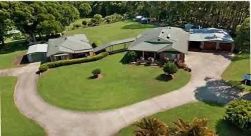

*Figure 2.2-b: of attaching the two dwellings (E)*

- Vehicular access to both dwellings should be from a single common driveway or access from the public road.
- Where the creation of an attached dual occupancy involves an extension to an existing dwelling house, the new dwelling should be constructed of the same materials of the existing dwelling, or the existing dwelling should be renovated to match the proposed external materials of the new dwelling.
- Subdivision of land pursuant to provide a separate lot for an approved attached dual occupancy is not supported if the resultant lots are smaller than the applicable minimum lot size shown on the HLEP Lot Size Map. pursuant to Clauses 4.1, 4.1AA and 4.1A of the HLEP.
- An attached dual occupancy cannot be erected on a separate lot created for the purposes of primary production pursuant to Clause 4.2 of the HLEP.
Notes:

Attached dual occupancy or Dual occupancy (attached) means two dwellings on one lot of land that are attached to each other, but does not include a secondary dwelling.

Total Floor Area means gross floor area as defined by the HLEP.

#### Case Study Example:

John and Mary own a 2.5 hectare block of RU2 zoned land and have a 500m 2 existing dwelling on the site (excluding the garage). They propose to attach a second dwelling to the existing dwelling. The property can therefore accommodate an attached dual occupancy with a gross floor area of up to 200m 2 , pursuant to Clause 6.9 of the HLEP.

In determining where and how the second dwelling should be accommodated, they now need to consider the provisions of Section 2.2.9 of the HDCP and other applicable controls (eg. Part 1 and Section 2.1 of the DCP) that includes controls such as:

-  Scale (height, roof design, design details);
-  Setbacks (including separation to intensive rural activities);
-  Private Open Space;
-  Car Parking;
-  Biodiversity;
-  Bushfire;
-  Landscaping;
-  Effluent Disposal; and
-  Building Sustainability (BASIX).

<!-- SRC: HDCP 2024 Part 2 Rural - 18 July 2024.pdf | PAGE: 78 -->

### 2.2.10 Agritourism and Farm Stay Accommodation

The following section provides controls for Agritourism land uses, including farm gate premises, farm stay premises, and farm stay accommodation in rural areas zoned RU1, RU2, RU4 and C3.

These controls are in addition to the building controls provided elsewhere in this DCP.

#### Desired Outcomes

- To allow for agritourism development on commercial farms that is ancillary to and complements the agricultural use of the land.
- To ensure that agritourism land uses are compatible with the rural character of the property and do not unnecessarily intrude on the landscape.
- To reduce land use conflicts by separating Agritourism development from existing uses on the property or on nearby land.
- To manage the number of visitors to a property to address cumulative effects of traffic on roads.

#### Prescriptive Measures

#### General

- Agritourism land uses should be ancillary to, and compatible with, the commercial operations of the farm and not restrict the day-to-day functions of the farm.
- The design of buildings and structures should enhance the rural character and scenic landscape through the selection of materials and design quality.
- Farm gate premises, Farm experience premises and/or Farm Stay Accommodation should not have a significant adverse impact on:
-  Residential accommodation;
-  Primary production operations;
-  Other land uses;
-  Visual amenity, heritage or scenic values;
-  Native flora and fauna including threatened species and ecological communities;
-  Water quality;
-  Existing water supplies for residential and primary production uses on the land holding;
-  Traffic; and
-  Visitor safety.
- A management plan for the ongoing operation of farm experience premises, farm gate premises and farm stay accommodation should be provided in accordance with Table 2.2.10-a.

#### Note:

The definition for farm stay accommodation does not permit events.

<!-- SRC: HDCP 2024 Part 2 Rural - 18 July 2024.pdf | PAGE: 79 -->

*Table 2.2.10-a: Requirements for Management Plans*

#### Requirements for Ongoing Management Plans

A description of the development to be carried out on the property.

A map of where the development will be on the property, relevant dimensions and key features on the land.

The proposed months, days and hours of operation of the farm gate premises, farm experience premises or farm stay accommodation.

The maximum number of guests at one time for the farm gate premises, farm experience premises or farm stay accommodation, and how this will be monitored.

How visitors and guests will be advised to:

-  limit impacts to the operational farm;
-  preserve and protect existing native flora, fauna and waterways, heritage items and Aboriginal heritage located on the property;
-  minimise any biosecurity risk through dispersal of weeds, seeds, insects and contaminants;
-  manage their waste; and
-  be alerted as to risks that may be present on the property such as natural hazards or changing weather.
Measures to mitigate adverse environmental and amenity impacts, including how the business and water resources will be managed during drought.

The way vehicles will access the properties and the premises, including emergency vehicles.

Any safety hazards on the property and how they will be managed to ensure the safety of visitors and guests, including any measures to ensure visitors do not access restricted or dangerous areas.

Emergency contact details, including for emergency services in the event of bush fire, flooding or other natural disasters.

Bush fire and flood safety measures to protect human life and property, e.g. bush fire and flood safety plans and procedures for closing the premises, such as when bush fire and flood warnings are in place

A plan to demonstrate that an adequate potable water supply, in both quality and quantity, is available for the proposed use. This water supply should be in addition to any water required for fire fighting purposes.

For farm gate premises and farm experience premises, how all events would be recorded and the following be detailed as a minimum:

-  Time and date of event;
-  Number of persons in attendance;
-  Person responsible for event organisation;
-  Whether amplified music or sound is used and what measures will be in place to control the impact of amplified music on adjoining property
If amplified music is provided after 6pm, a statement confirming that no more than 4 events involving amplified music past 6pm will be held in a calendar period.

Procedures for receiving and managing complaints.

<!-- SRC: HDCP 2024 Part 2 Rural - 18 July 2024.pdf | PAGE: 80 -->

#### Location and Setbacks

- Agritourism buildings should be clustered on the property where possible, to minimise the amount of land occupied by the development.
- The development is not to be located in a portion of the site that would restrict the day-to-day functions of adjacent farms or other existing activities or known future uses on adjoining land.
- A building structure, movable dwelling, activity for farm stay accommodation, farm gate premise or farm experience premises should be setback from property boundaries and development constraints in accordance with Table 2.2.10-b.
Table 2.2.10-b:  Separation Requirements

| Separation Requirements                                                                                                                                                 | Separation to Farm stay accommodation, Farm experience premises or Farm gate premises   |
|-------------------------------------------------------------------------------------------------------------------------------------------------------------------------|-----------------------------------------------------------------------------------------|
| Residential accommodation on adjacent land (including land separated by a road)                                                                                         | 250m                                                                                    |
| Any property boundary or road                                                                                                                                           | 50m                                                                                     |
| Any waterway                                                                                                                                                            | 50m                                                                                     |
| Any land used for the purpose of forestry, intensive livestock agriculture, intensive plant agriculture, mining, extractive industries, railway lines or rural industry | 250m                                                                                    |

*Table 2.2.10-b: Separation Requirements*

#### Note:

Separation requirements for agritourism land uses take precedent over the general rural building setbacks outlined in Section 2.1.2 of the DCP.

- A development may be closer than the above distances to property boundaries and roads if it can be demonstrated that measures incorporated into the design, such as boundary planting, will appropriately mitigate impacts.
- Car parking areas should not form a visually prominent element of the rural landscape or be highly visible from the road frontage and should be located behind the front building line.

#### Hazards and Biosecurity

- An emergency evacuation plan should be provided with a development application for farm stay accommodation, farm gate premises or a farm experience premises. The plan should identify:
-  Evacuation routes from the premises in the event of bushfire or flood. Evacuation routes from the location of a development to a main road or alternate point of refuge are to avoid flood and bush fire prone land where practicable;
-  When the facility will be on alert and will close;
-  Evacuation procedures and assembly points;
-  Proposed signage;
-  Measures to protect human life and property in the event of flooding or fire;
-  Contact details for emergency services; and
-  Any maintenance measures required.
- To manage biosecurity risks from pests, disease, weeds, contaminates and respond to biosecurity duties, development applications should demonstrate consideration of the NSW Department of Primary Industries Managing biosecurity risks in land use planning and development guide (2020) and detail biosecurity measures in relation to any:
-  Buffer zones;
-  Wash down facilities;
-  Designated parking areas;
-  Location to major potable water supply storages and watercourses - poultry production; and
-  Dumping and burying rubbish on site.
- A biosecurity plan for ongoing use of farm stay accommodation, farm experience premises or farm gate premises should be prepared in accordance with the NSW Department of Primary Industries' requirements, including the Farm Biosecurity Action Planner.

#### Note:

Controls relating to the development of bushfire and flood prone land, land subject to contamination, steep lands and acid sulfate soils are included in Part 1 General of this DCP.

The Farm Biosecurity Action Planner is available at www.farmbiosecurity.com.au/toolkit/planner/.

<!-- SRC: HDCP 2024 Part 2 Rural - 18 July 2024.pdf | PAGE: 81 -->

#### Vehicle Access

- Only one driveway should be provided on a property unless the property has a frontage of greater 100m and can demonstrate that an additional access would improve:
-  Traffic management on the property or on and off the road;
-  Separation between the farming operations and the development; or
-  Resident employee and visitor safety.

#### Note:

Refer to Table 1.3.2-c for parking rate requirements.

#### Farm Gate Premises and Farm Experience Premises

- The gross floor area of a building (or part of a building) for farm gate premises or farm experience premises should be no more than 200m 2 .
- The total footprint of all buildings used for farm gate premises and farm experience premises on the property should not to exceed 500m 2 .
- The height of a new building for farm gate premises or farm experience premises should be in keeping with the low scale built form of the rural area.
- The hours of operation of farm gate premises should be:
-  8am to 5pm Sunday to Friday and public holidays, and
-  7am to 5pm on Saturdays.
- The hours of operation of farm experience premises should be:
-  8am to 6pm Sunday to Thursday and public holidays, and
-  8am to 12am Friday and Saturday.
- The maximum number of visitors, excluding visitors participating in fruit and produce picking, farm tours, horse riding and school groups for farm gate premises should not exceed 100 on a property at any one time.
- The maximum number of visitors, excluding visitors participating in fruit and produce picking, farm tours, horse riding and school groups for farm experience premises should not exceed 50 on a property at any one time.
- The maximum number of visitors, excluding visitors participating in fruit and produce picking, farm tours, horse riding and school groups for all farm gate premises and farm experience premises should not exceed 100 on a property at any one time.
- Farm experience premises should be limited to 52 events per year, including a maximum of 4 events per year after 6pm that have amplified noise.
- Toilet facilities should be provided including at least one unisex accessible toilet.
- Development applications for farm gate premises and farm experience that:
-  Propose to undertake more than 4 events a year after 6pm on a Friday or Saturday, and
-  Involve amplified noise
should be accompanied by an acoustic report demonstrating that the development can comply with the following noise criteria:

-  The LAeq (15 minute) noise level from the use must not exceed the background noise level (LA90, 15 minute) in any octave band (from 31.5Hz to 8kHz inclusive) by more than 5dB(A) when measured in accordance with the Noise Policy for Industry (EPA 2017).

#### Note:

An acoustic report may also be required for development applications that exceed the maximum number of visitor controls contained within this chapter.

<!-- SRC: HDCP 2024 Part 2 Rural - 18 July 2024.pdf | PAGE: 82 -->

#### Farm Stay Accommodation

- A building, manufactured home or moveable dwelling used for farm stay accommodation (except for the use of an existing dwelling for farm stay accommodation) should only be located on an allotment that:
-  Has an existing lawful dwelling house, or
-  Is not less than the minimum lot size as depicted on the Lot Size Map contained within the HLEP.
- The maximum number of buildings and manufactured homes used for farm stay accommodation on a property should be no more than 1 per 5 hectares (or part thereof) to a maximum of 6.
- aa. The maximum number of moveable dwellings used for the purposes of farm stay accommodation on a property should be no more than 2 per 5 hectares (or part thereof) to a maximum of 6.
- bb. Farm stay accommodation, including moveable dwellings, is limited to:
-  A maximum of 20 guests at any one time on a property, and
-  A maximum stay for guests of 21 consecutive days.
- The gross floor area of a new building or manufactured home for farm stay accommodation should not be more than 60m 2 .
- The gross floor area of part of an existing building or manufactured home used for farm stay accommodation should not be more than 60m 2 .
- ee. The height of a building, manufactured home, or moveable dwelling used for farm stay accommodation should be in keeping with the low scale built form of the rural area.
- ff. Where mains water is not available, an application should demonstrate that adequate water is available to service the development. Water required for farm stay accommodation should be in addition to that required for the dwelling house and any required fire fighting purposes.
- gg. One toilet per 10 guests in farm stay accommodation should be provided, with at least one toilet being be a unisex accessible toilet.

<!-- SRC: HDCP 2024 Part 2 Rural - 18 July 2024.pdf | PAGE: 83 -->

## 2.3 Village Masterplans

### 2.3.1 Village Masterplans - General

The following section provides controls for the Rural area localities identified on the Masterplans. This includes a variety of zones including, but not limited to Rural Zones, Residential Zones, and Employment Zones.

#### Desired Outcomes

- Orderly development that is consistent with the principles in the village masterplans.

#### Prescriptive Measures

- Village masterplans apply to the following localities:
-  Dural Village,
-  Galston, and
-  Wisemans Ferry.
- Development should be designed to embody the urban design guidelines and principles of the relevant village masterplans.
- Vehicular access should be rationalised in accordance with the relevant masterplan.
- Public domain works and pedestrian thoroughfares should be provided in accordance with the relevant masterplan.

<!-- SRC: HDCP 2024 Part 2 Rural - 18 July 2024.pdf | PAGE: 84 -->

#### Dural Village Masterplan

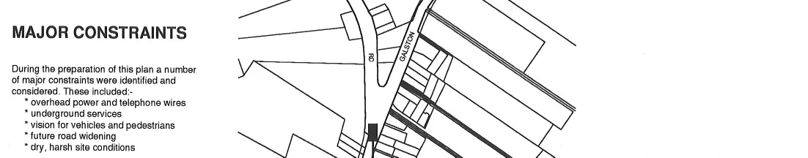
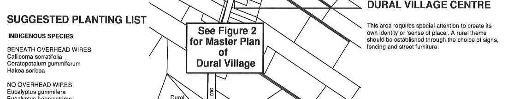
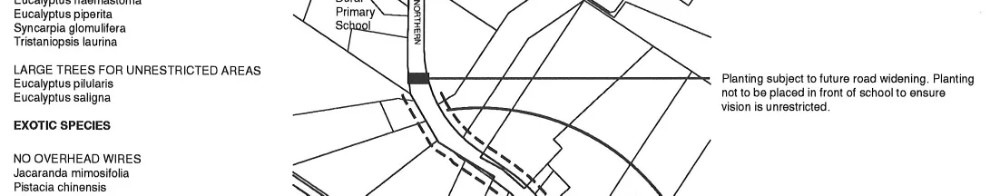
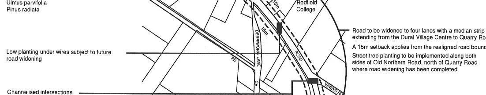

<!-- SRC: HDCP 2024 Part 2 Rural - 18 July 2024.pdf | PAGE: 85 -->

#### Dural Village Masterplan (Figure 2)

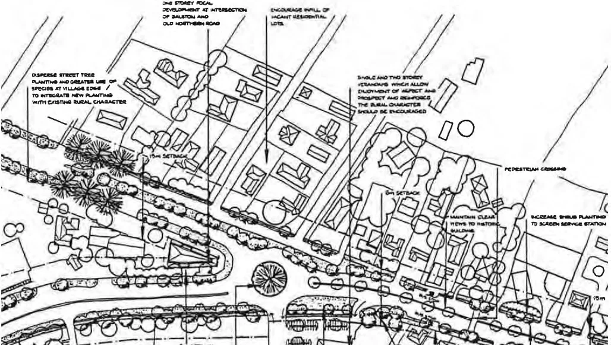

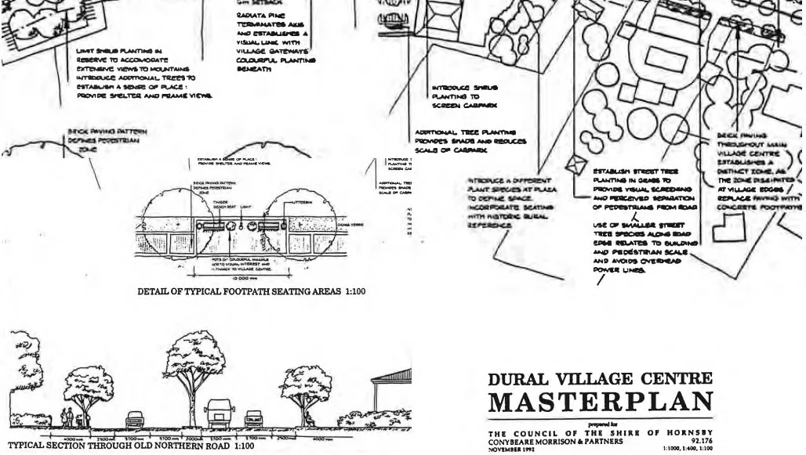

<!-- SRC: HDCP 2024 Part 2 Rural - 18 July 2024.pdf | PAGE: 86 -->

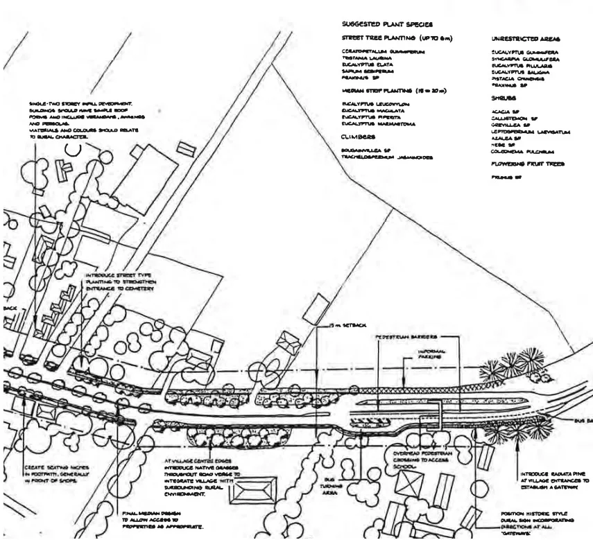

*Dural Village Masterplan (Figure 2 cont)*

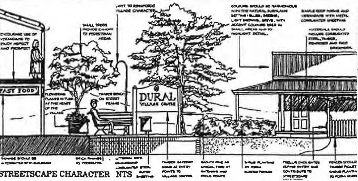

<!-- SRC: HDCP 2024 Part 2 Rural - 18 July 2024.pdf | PAGE: 87 -->

#### Dural Village Masterplan (Elevation)

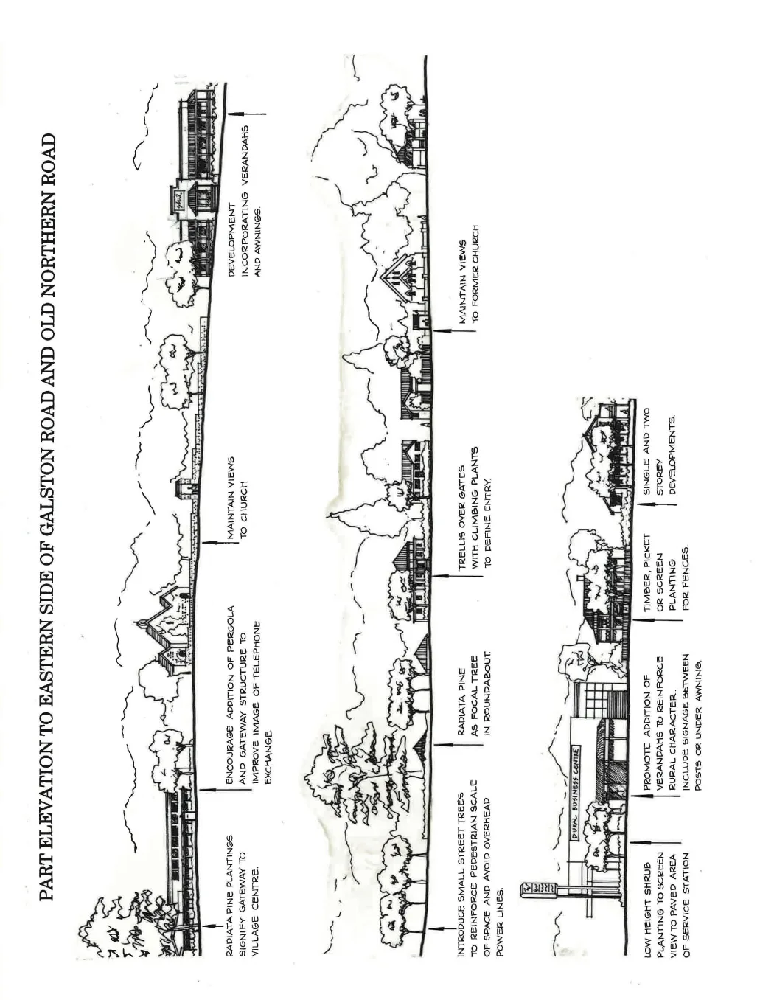

<!-- SRC: HDCP 2024 Part 2 Rural - 18 July 2024.pdf | PAGE: 88 -->

#### Galston Village Masterplan

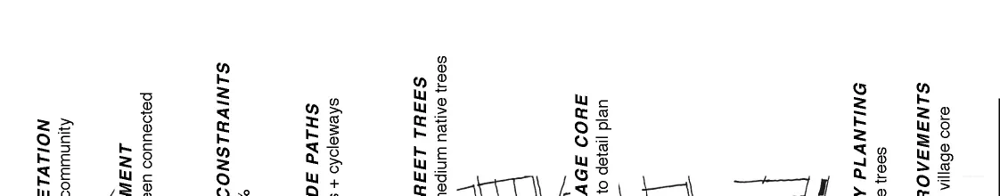

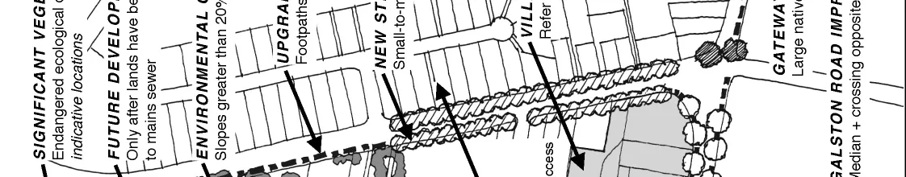
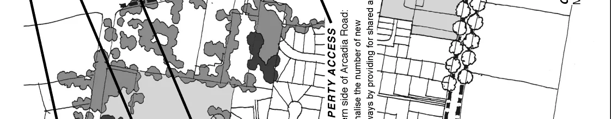
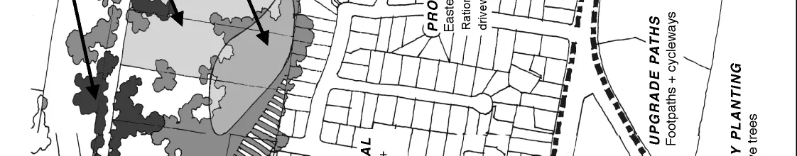
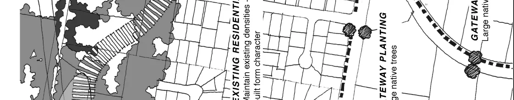
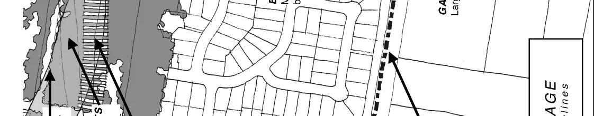
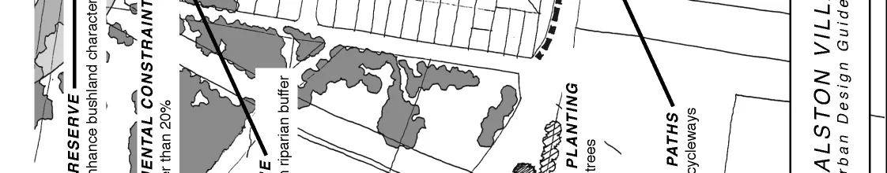
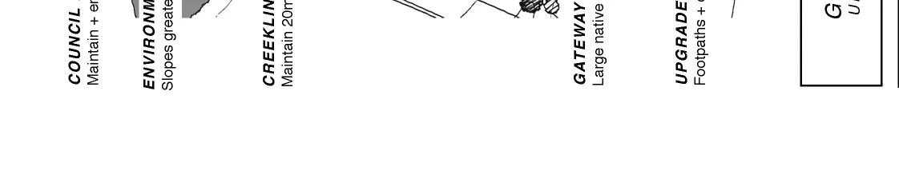

<!-- SRC: HDCP 2024 Part 2 Rural - 18 July 2024.pdf | PAGE: 89 -->

#### Galston Village Masterplan

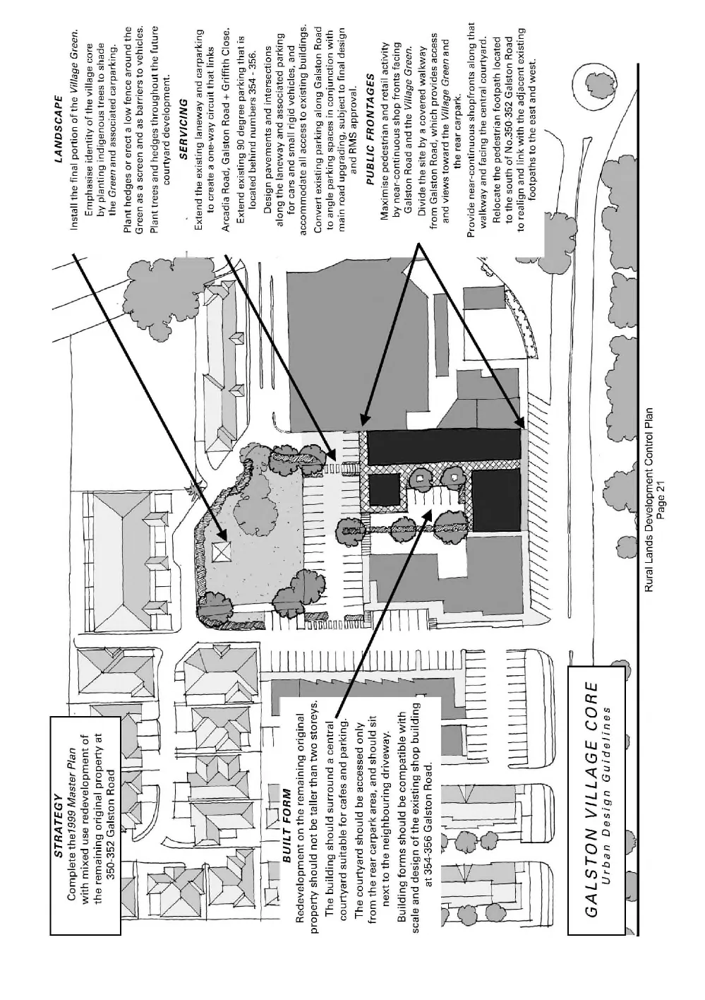

<!-- SRC: HDCP 2024 Part 2 Rural - 18 July 2024.pdf | PAGE: 90 -->

#### Wisemans Ferry Village Masterplan

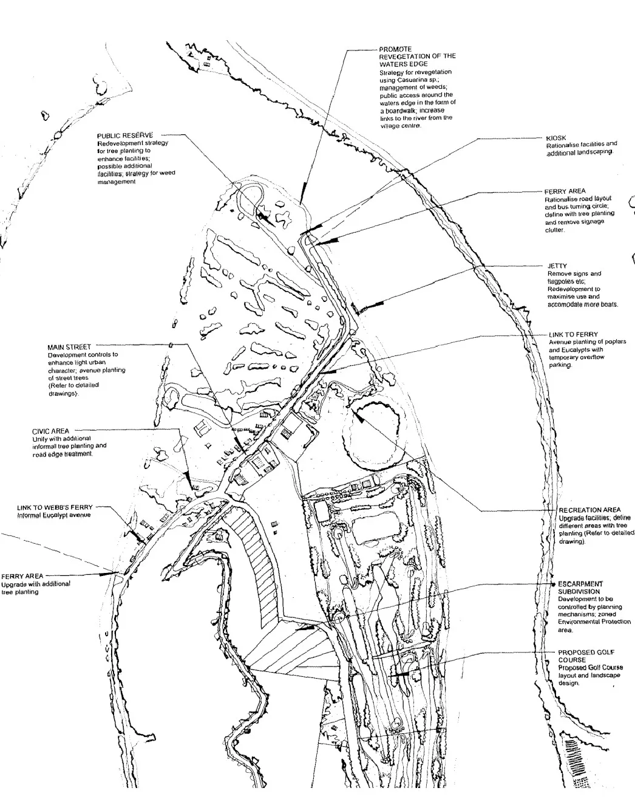

<!-- SRC: HDCP 2024 Part 2 Rural - 18 July 2024.pdf | PAGE: 91 -->

#### Wisemans Ferry Village Masterplan

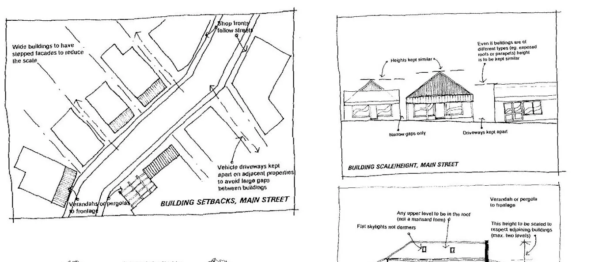

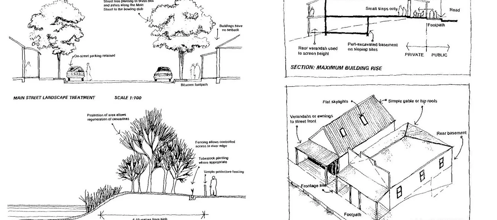
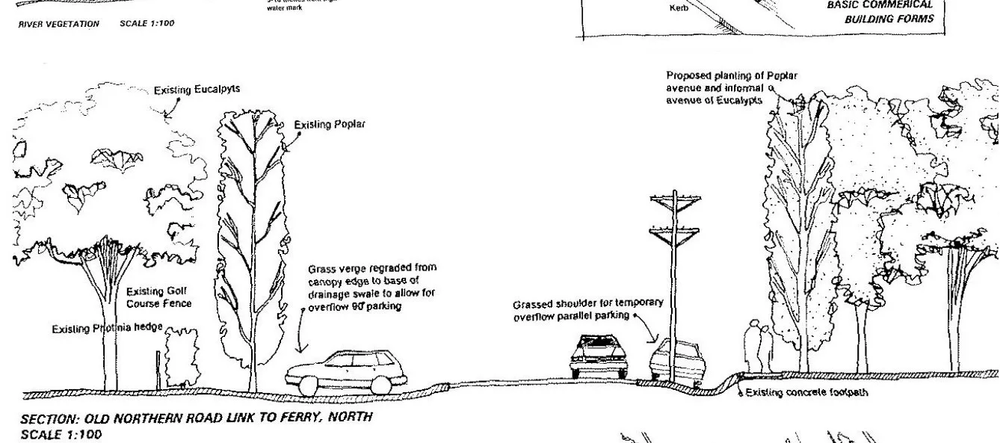

<!-- SRC: HDCP 2024 Part 2 Rural - 18 July 2024.pdf | PAGE: 92 -->

## 2.4 Dural Village

The following provides controls for development in the RU5 Rural Village Zone.

### 2.4.1 Scale

#### Desired Outcomes

- Development with a height, bulk and scale that is compatible with the character and amenity of the Village Centre.

#### Prescriptive Measures

#### Height

- Sites with the following maximum building heights under Clause 4.3 of the HLEP should comply with the maximum number of storeys in Table 2.4.1-a.
- Buildings should respond to the topography of the site by:
-  minimising earthworks (cut and fill), and
-  siting the floor level of the lowest residential storey a maximum of 1.5 metres above natural ground level.
- A transition in building height should be provided at sensitive interface areas adjacent to heritage items.
Table 2.4.1-a: Translations of Height to Storeys

| HLEP Area   | Maximum Building Height (m)   | Maximum Storeys (excluding basement carparking)   |
|-------------|-------------------------------|---------------------------------------------------|
| I           | 8.5m                          | 2 storeys + attic                                 |

*Table 2.4.1-a: Translations of Height to Storeys*

#### Notes:

Building height (or height of building) means the vertical distance between ground level (existing) and the highest point of the building, including plant and lift overruns, but excluding communication devices, antennae, satellite dishes, masts, flagpoles, chimneys, flues and the like.

Storey means a space within a building that is situated between one floor level and the floor level next above, or if there is no floor above, the ceiling or roof above, but does not include:

(a) a space that contains only a lift shaft, stairway or meter room, or

(b) mezzanine, or

(c) an attic.

Basement means the space of a building where the floor level of that space is predominantly below ground level (existing) and where the floor level of the storey immediately above is less than 1 metre above ground level (existing).

#### Roof Design

- Low pitched roofs with wide eaves should be encouraged for compatibility with streetscape character and sun control.
- The roof should have a maximum pitch of 35 degrees, except if a steeper roof pitch is more consistent with the existing character of the locality.
- Any attic level is to be contained wholly within the roofspace.
- The external walls of the building should not extend above the attic floor level.
Figure 2.4-a: residential floor to floor height of 3 metres,

Explanation of building height controls (I) Height controls are based on a typical with allowances for roof articulation and undercroft areas for steeply sloping sites.

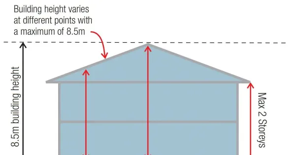

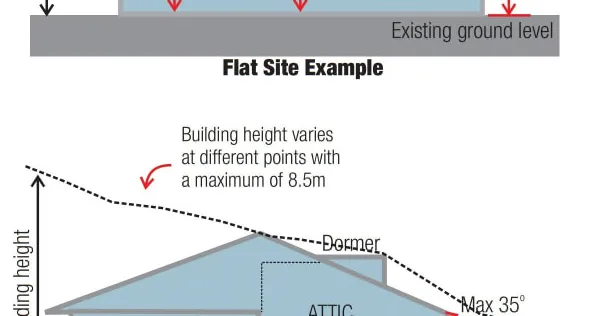

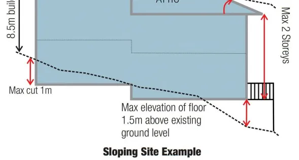

<!-- SRC: HDCP 2024 Part 2 Rural - 18 July 2024.pdf | PAGE: 93 -->

#### Site Coverage

- The maximum site coverage of all buildings on the property should comply with Table 2.4.1-b:
Table 2.4.1-b: Maximum Site Coverage

| Lot size          | Maximum site coverage (% of total lot size)   |
|-------------------|-----------------------------------------------|
| 200m 2 to 249m 2  | 65%                                           |
| 250m 2 to 299m 2  | 60%                                           |
| 300m 2 to 449m 2  | 55%                                           |
| 450m 2 to 899m 2  | 50%                                           |
| 900m 2 to 1499m 2 | 40%                                           |
| 1500m 2 or larger | 30%                                           |

*Table 2.4.1-b: Maximum Site Coverage*

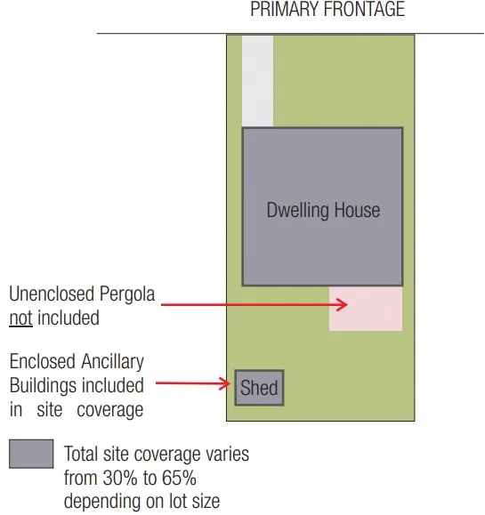

*Figure 2.4-b: Site coverage calculation (I)*

#### Floor Space

- The maximum floor space ratio shall be in accordance with the HLEP Floor Space Ratio Map as summarised in Table 2.4.1-c.
- In accordance with Clause 6.6 of the HLEP, development for the purpose of health consulting rooms, medical centres, office premises, restaurants, or cafes, or take away food and drink premises, is limited to the following per allotment:
-  a maximum gross floor area per premises of 100m 2 and a maximum of 3 premises listed above per allotment, or
-  if the use is wholly within the external walls of a dwelling that existed prior to 21 February 2003, there is no prescribed limit.
Table 2.4.1-c: Maximum Floor Space Ratio

| HLEP Area   | Maximum Floor Space Ratio   |
|-------------|-----------------------------|
| D           | 0.5:1                       |

*Table 2.4.1-c: Maximum Floor Space Ratio*

#### Notes:

Site coverage means the proportion of a site area covered by buildings. However, the following are not included for the purpose of calculating site coverage:

- (a) any basement,
(b) any part of an awning that is outside the outer walls of a building and that adjoins the street frontage or other site boundary,

- (c) any eaves,
- (d) unenclosed balconies, decks, pergolas and the like.
Floor Space Ratio as detailed in Clause 4.5 of the HLEP, means the ratio of the gross floor area of all buildings within the site to the site area. See the HLEP for the definition of Gross Floor Area.

<!-- SRC: HDCP 2024 Part 2 Rural - 18 July 2024.pdf | PAGE: 94 -->

### 2.4.2 Setbacks

#### Desired Outcomes

- Setbacks that are compatible with adjacent development and complement the streetscape.
- Setbacks that allow for canopy trees to be retained and planted along the front and rear property boundaries.

#### Prescriptive Measures

- All buildings and structures should comply with the minimum boundary setbacks in Table 2.4.2-a.
- The setback is to be measured from the TfNSW realigned road boundary. The road reservation is depicted on the HLEP Land Reservation Acquisition Map.
- For the purpose of the setback controls, a 1 storey building, or element is not to exceed a building height of 4.5 metres above existing ground level.
- Notwithstanding the above, carparking for commercial uses should be setback 3 metres from side boundaries.
- The setback of the building and ancillary structures from the property boundary may need to be increased to maintain landscape features, as detailed in Section 2.4.3 of this DCP.
Table 2.4.2-a: Minimum Boundary Setbacks

| Boundary Setback           | Minimum Building Setback                                                                                                       |
|----------------------------|--------------------------------------------------------------------------------------------------------------------------------|
| All public road boundaries | 6m to local roads and 9m to designated roads, except for: 539 Galston Rd and 925-945 Old Northern Road - 6m to designated road |
| Side boundary              | up to 1 storey = 0.9m 2 storey element = 1.5m                                                                                  |
| Rear boundary              | up to 1 storey = 3m 2 storey element = 8m                                                                                      |

*Table 2.4.2-a: Minimum Boundary Setbacks*

#### Setback Encroachments

- The following minor structures are able to encroach into the prescribed setbacks:
-  A driveway between the on-site car parking area and a public road,
-  Stairs to the ground floor of the building,
-  Fences,
-  A single storey outbuilding, with a maximum floor area of 25m 2 , is able to encroach to within 0.9 metres of the rear boundary (e.g. garden shed, garage, pergola), and
-  An inground swimming pool is able to encroach to within 1 metre of the rear boundary, measured to the water line.

#### Notes:

Designated roads are Council identified roads that require development to have an increased setback from the road edge, consistent with the established streetscape. A list of designated roads is provided in Annexure C.

The rear boundary is ordinarily located parallel to and/or opposite the primary frontage which is the shorter street frontage.

<!-- SRC: HDCP 2024 Part 2 Rural - 18 July 2024.pdf | PAGE: 95 -->

### 2.4.3 Landscaping

#### Desired Outcomes

- Landscaping that integrates the built form with soft landscaping and retains and enhances the tree canopy.
- Development that retains existing landscape features.

#### Prescriptive Measures

- The minimum landscaped area on a property should comply with Table 2.4.3-a:
- Areas included as part of the minimum landscaped area should have a minimum width of 1.5 metres.
- At least 50 percent of the minimum landscaped area should be located behind the building line to the primary road frontage.
- A proportion of the front yard should be maintained as landscaped area as follows:
-  25 percent of the front yard for lots less than 18 metres wide, and
-  50 percent of the front yard for lots greater than 18 metres wide.
Table 2.4.3-a: Minimum Landscaped Area

| Lot size          | Minimum Landscaped Area (% of the lot size)   |
|-------------------|-----------------------------------------------|
| 200m 2 to 299m 2  | 10%                                           |
| 300m 2 to 449m 2  | 15%                                           |
| 450m 2 to 599m 2  | 20%                                           |
| 600m 2 to 899m 2  | 30%                                           |
| 900m 2 to 1499m 2 | 40%                                           |
| 1500m 2 or larger | 45%                                           |

*Table 2.4.3-a: Minimum Landscaped Area*

#### Notes:

Landscaped area means a part of a site used for growing plants, grasses and trees but does not include any building, structure, or hard paved area. (Note: Swimming pools are not included in the minimum landscaped area calculation).

The applicant is encouraged to incorporate plant species indigenous to Hornsby Shire as part of the development. Refer to Council's website www.hornsby.nsw.gov.au

#### Retention of Landscape Features

- The proposed building, ancillary structures, driveways, drainage, and service trenches should be setback:
-  in accordance with the 'Watercourses' element in Section 1.3.1.3 of this DCP,
-  10-20 metres to significant bushland as detailed in the 'Biodiversity' element in Section 1.3.1.1 of this DCP, and
-  in accordance with the requirements of AS 4970 for significant trees to be retained.

#### Fencing

- Within front setbacks, fences should not be higher than 1.2 metres. The use of picket fencing on the front property alignment is encouraged.
- Front fencing should be constructed from predominately lightweight materials with the design allowing at least 50 percent openings.
- Side and rear boundary fences should be a maximum of 1.8 metres high, sited behind the front building line.


*Figure 2.4-c: Landscaped area (I)*

<!-- SRC: HDCP 2024 Part 2 Rural - 18 July 2024.pdf | PAGE: 96 -->

### 2.4.4 Open Space

#### Desired Outcomes

- Private open space that functions as an extension to the dwelling house.

#### Prescriptive Measures

#### Private Open Space

- A dwelling house should be provided with private open space that incorporates a principal private open space area in accordance with Table 2.4.4-a.
Table 2.4.4-a: Minimum Private Open Space

| Minimum Principal Area   | Minimum Dimension of Principal Area   |
|--------------------------|---------------------------------------|
| 24m 2                    | 3m                                    |

- The principal private open space area should be sited behind the front building line and is to be directly accessible from the living area of the dwelling.
- The principal private open space area should be generally level and may be in the form of a deck, patio, terrace or paved area.

#### Clothes Drying Area

- Each dwelling house should have access to an external air clothes drying area, in addition to the minimum principal private open space area. This is to be screened from public places.

### 2.4.5 Sunlight Access

#### Desired Outcomes

- Dwelling houses designed to provide solar access to open space areas.
- Development designed to provide reasonable sunlight to adjacent properties.

#### Prescriptive Measures

- On 22 June, 50 percent of the required principal private open space area should receive 3 hours of unobstructed sunlight access between 9am and 3pm.
- On 22 June, 50 percent of the required principal private open space on any adjoining property should receive 3 hours of unobstructed sunlight access between 9am and 3pm.

#### Note:

The Sustainable Buildings SEPP requires a BASIX certificate for new dwellings to facilitate energy efficient housing.

<!-- SRC: HDCP 2024 Part 2 Rural - 18 July 2024.pdf | PAGE: 97 -->

### 2.4.6 Privacy and Security

#### Desired Outcomes

- Development that is designed to provide reasonable privacy to adjacent properties and high levels of residential security.

#### Prescriptive Measures

#### Privacy

- For development at the interface of a commercial and residential area, development should encourage views from the commercial development to the horizon rather than downward onto residential areas.
- Living and entertaining areas of dwelling houses should be orientated towards the private open space of the dwelling house and not side boundaries.
- A proposed window in a dwelling house should have a privacy screen if:
-  it is a window to a habitable room, other than a bedroom, that has a floor level of more than 1 metre above existing ground level,
-  the window is setback less than 3 metres from a side or rear boundary, and
-  the window has a sill height of less than 1.5 metres.
- A deck, balcony, terrace or the like should be located within 600mm of existing ground level where possible to minimise potential visual and acoustic privacy conflicts.
- Decks and the like that need to be located more than 600mm above existing ground should not face a window of a habitable room, balcony or private open space of another dwelling located within 9 metres of the proposed deck unless appropriately screened.


*Figure 2.4-d: Decks adjoining a neighbouring dwelling should be screened (I)*

#### Security

- Private open spaces, living room windows and lobbies should be designed and oriented to overlook the street and communal open spaces on the site.
- Identify safe, clear and direct pedestrian and cyclist entrance to the building/s from the primary street frontage.
- Where a mix of land uses are proposed, separate, secure access should be provided to commercial and residential entrances/ lobbies, and car parking areas.

#### Notes:

All developments should comply with the minimum building setback controls within this DCP which will assist in achieving the desired outcome for privacy.

A privacy screen means a screen that is at least 1.5m high, measured from the floor level, and has no individual opening more than 30mm wide, and has a total of all openings less than 30% of the surface area of the screen. A privacy screen required to protect an adjacent residence is to be fixed.

<!-- SRC: HDCP 2024 Part 2 Rural - 18 July 2024.pdf | PAGE: 98 -->

### 2.4.7 Vehicle Access and Parking

#### Desired Outcomes

- Development that provides sufficient and convenient parking for residents with vehicular access that is simple, safe and direct.

#### Prescriptive Measures

- The number of existing accessways should be rationalised where possible.
- Car parking should be provided behind the front building line for all land uses.
- Parking for commercial uses should also be setback a minimum of 3 metres from the side and rear property boundaries and the area landscaped with screening shrubs.
- A paved driveway should be provided between the required on-site car parking area and a public road.
Note:

Refer to Part 1 General of the DCP for more detailed parking and service vehicle design requirements.

### 2.4.8 Design Details

#### Desired Outcomes

- Development compatible with a low-density residential environment that complements the zone objectives.

#### Prescriptive Measures

#### General

- Development should embody the urban design principles in the Dural Village Masterplan.
- Buildings should be oriented primarily towards the street and the rear boundary.
- Extensive blank or unarticulated walls to street frontages are discouraged.
- Dwelling houses should provide a covered entry to the home at least 1.5 metres deep and clearly visible from the street.
- Buildings on corner allotments should be designed to provide elevations that address both street frontages.
- Garages should not dominate the facade of a building nor the streetscape. Garage doors should be as follows:
-  setback 1 metre from the front facade of the home,
-  no wider than 6 metres, and
-  maximum 2.4 metres high.

#### Dormer Windows

- The design of dormer windows in any attic level should comply with the following:
-  Dormers should face the street and/or the rear property boundary,
-  Dormers should be setdown below the ridge line and setback from the side walls,
-  Dormers should not be wider than 1.3 metres,
-  Be vertically proportioned at a ratio of 1.5:1 measured from head to sill of the window frame, and
-  The number of dormer windows is limited to a maximum of two per facade.

#### Materials and Finishes

- The colours, textures and materials used in external finishes should be consistent with a heritage theme.

<!-- SRC: HDCP 2024 Part 2 Rural - 18 July 2024.pdf | PAGE: 99 -->

## 2.5 Extractive Industries

The following provides controls for extractive industries at Maroota to which the State Environmental Planning Policy (Resources and Energy) 2021 (Resources and Energy SEPP) applies as indicated in Figure 2.5-a. These controls may also be applied elsewhere in the rural areas where similar extractive industries are proposed.

Extractive industry means the winning or removal of extractive materials (otherwise than from a mine) by methods such as excavating, dredging, tunnelling, or quarrying, including the storing, stockpiling, or processing of extractive materials by methods such as recycling, washing, crushing, sawing or separating, but does not include turf farming.


*Figure 2.5-a: Resources and Energy SEPP locality. (C)*

### 2.5.1 Setbacks

#### Desired Outcome

- Setbacks to extractive operations that protect the natural environment and provide reasonable visual and acoustic amenity to the area.

#### Prescriptive Measures

- Extraction operations including internal access roads should be setback to comply with Table 2.5.1-a:
- Where extraction is occurring on adjoining properties, the setbacks required by Table 2.5.1-a may be reduced to provide an integrated final land form.
Table 2.5.1-a: Minimum Setbacks

| Feature                                                                      | Minimum Setback                                  |
|------------------------------------------------------------------------------|--------------------------------------------------|
| Adjoining property boundaries                                                | 10m (to include a landscape buffer)              |
| Public road                                                                  | 30m (to include a landscape buffer)              |
| Land reserved under the National Parks and Wildlife Act 1974                 | 40m (to include a vegetative buffer)             |
| Site or relic of heritage, archaeological, geological, cultural significance | 40m                                              |
| Habitats of threatened species, populations and ecological communities       | 40m (to include a vegetative buffer)             |
| Top bank of a watercourse                                                    | 40m or otherwise to the requirements of WaterNSW |
| Public or Community facility                                                 | 100m                                             |
| Residence not associated with extraction                                     | 100m                                             |

*Table 2.5.1-a: Minimum Setbacks*

<!-- SRC: HDCP 2024 Part 2 Rural - 18 July 2024.pdf | PAGE: 100 -->

### 2.5.2 Transport

#### Desired Outcomes

- Extractive industries that maintain a safe and efficient road network.
- Extractive industries that have minimal impact on the local road network.

#### Prescriptive Measures

- Safe, controlled and limited access points to the road network should be provided.
- Heavy vehicle routes on the local road network should be direct and avoid sensitive land uses. Where sensitive land uses cannot be avoided the frequency and timing of heavy vehicles should be controlled.
- Internal access should be no less than 20 metres wide (easement width).
- The standard of construction of internal accessways should have regard to:
-  cross sectional characteristics, both typical of straight and on curves and bends,
-  horizontal and vertical alignment characteristics,
-  pavement and drainage proposals,
-  other technical parameters, and
-  vehicle grades not exceeding 6%.
- Extractive operations should contribute to the maintenance of the road network as a result of road damage caused by heavy vehicles.

#### DA Submission Requirement

- Documentation outlining anticipated heavy vehicle routes, loading and frequency associated with the extractive industry should be submitted with the application.

#### Post DA Submission Requirement

- Certified weighbridge dockets and a log book to verify the frequency and timing of vehicle movements may be required as a condition of consent.

#### Note:

Designs of all access/intersection points to the external road network should comply with the requirements of the Hornsby Shire Civil Works Design Specification and/or TfNSW.

### 2.5.3 Water Resources

#### Desired Outcomes

- The protection of existing drainage patterns including location, quantity and quality of water.
- The conservation and effective management of the sustainability of surface and groundwater resources.
- The protection of downstream dependent riparian ecosystems and natural habitats.

#### Prescriptive Measures

- Proposals should employ extraction procedures capable of maintaining, monitoring and managing pre-existing surface drainage patterns and groundwater flow and water quality conditions.
- Extraction should not occur within 2 metres of the high groundwater level.

#### DA Submission Requirements

- Proposals should be accompanied by a Groundwater Impact Assessment Report which should:
-  identify and classify aquifer systems on extraction sites,
-  identify all groundwater dependent users and environs at the site and within adjacent catchment areas,
-  assess vulnerability of groundwaters,
-  identify a freeboard level (to AHD) above high groundwater level capable of protecting groundwater flow patterns and water quality,
-  identify potential sources of impacts including seepage from tailing dams, and
-  outline procedures for protecting and monitoring groundwater flow and quality.
- Applications should be accompanied by a Water Management Plan which provides a framework for the identification, classification and management of artificial and natural surface and subsurface water cycles during all phases of clearing, extraction and rehabilitation including:
-  site investigations used to identify and classify catchment origin, drainage patterns, water flow and quality,
-  source, quantity and quality of water required to provide a reliable supply of water to the operations,
-  procedures capable of maintaining natural surface water flow and quality conditions along downstream boundary alignments,

<!-- SRC: HDCP 2024 Part 2 Rural - 18 July 2024.pdf | PAGE: 101 -->

-  the design and likely impact of any temporary diversion of drainage patterns,
-  procedures for maintaining and monitoring water quality at downstream boundaries,
-  procedures for minimising importation of water,
-  procedures for maximising reuse/recycling of collected waters, particularly during extreme climatic conditions,
-  risks, safeguards and contingency plans for extreme climatic conditions and operational hazards including groundwater breach or contamination,
-  method of treating polluted and contaminated waters,
-  destination points for collected waters are retained within each extraction area/stage,
-  procedures for ensuring that contaminated waters are contained on-site during 1 in 100 year ARI storm events (1% AEP),
-  protection of significant site features and natural springs, and
-  procedures for monitoring groundwater flow, quality and recharge areas within catchments having regard to the Groundwater Impact Assessment Report.

#### Post DA Submission Requirement

- An updated Water Management Plan may be required to be resubmitted annually to Council as a condition of consent. The report would be required to be prepared by a suitably qualified Environmental Consultant and demonstrate that:
-  the protection of water dependent features and ecosystems of the site and adjacent catchments,
-  the actual source, quantity and quality of water used by all aspects of the operation,
-  the effectiveness of the Water Management Plan in providing a framework for a complete balance for both artificial and natural surface and subsurface waters,
-  risks, safeguards and contingency plans for extreme climatic conditions and operational hazards including groundwater breach or contamination,
-  the results of monitoring water at downstream boundaries relative to the stage of extraction,
-  the results of monitoring of groundwater flow and quality within the extraction-site and adjacent catchment,
-  the advice and licensing requirements of state agencies including WaterNSW and the EPA,
-  recommendations to alter operational procedures to improve the performance of artificial and natural surface and subsurface water cycles, and
-  applications should include a determination of the likely impact upon groundwater and nominate an effective freeboard above the high groundwater level capable of protecting groundwater flow patterns and water quality on each extraction site.
-  Based on the above factors, the report should identify any adverse environmental impacts in accordance with the Australian and New Zealand (ANZECC) Guidelines for Fresh and Marine Water Quality and outline any mitigation measures.

#### Note:

All bores and extraction operations which intercept the water table and/or require pumps should be licensed with WaterNSW.

For more information regarding the Australian and New Zealand Guidelines for Fresh and Marine Water Quality, refer to www.waterquality.gov.au/anz-guidelines.

<!-- SRC: HDCP 2024 Part 2 Rural - 18 July 2024.pdf | PAGE: 102 -->

### 2.5.4 Soil and Water Management

#### Desired Outcome

- Extractive operations that minimise soil erosion and water pollution by minimising land disturbance, and requiring control measures on-site.

#### Prescriptive Measures

#### Clearing

- Vegetation should only be removed in stages to retain as much protective ground cover vegetation as possible.
- The natural vegetation outside the extraction site should be protected at all times by the installation and maintenance of sediment control devices.
- Progressive clearing should be restricted to within the approved boundaries of the extraction area.
Topsoil and overburden removal.

- Topsoil and overburden stripping should not advance any more than 30 metres in front of the current extraction operation.
- Stockpiles should be located in low erosion hazard areas away from drainage lines and stabilised by vegetation and the use of silt fences.
- Removed topsoil should be used for rehabilitation of previously disturbed areas in order to maintain the freshness of the topsoil. Topsoil removal should occur in two stages, organic matter and then the topsoil.
- Where material is to be stored in stockpiles, the stockpile should be:
-  of one soil type;
-  kept flat and low to ensure survival of organic matter and aerobic organisms;
-  keep free of traffic and drainage lines;
-  not left for more than 14 days without a vegetation cover;
-  surrounded by sediment control devices, and
-  used as soon as possible (no longer than 12 months).
- Stockpiles over 5 metres in height should be benched to ensure stability and incorporate internal drains. The batter slopes should be no steeper than 1:2 (v:h) for stable soils and 1:4(v:h) for highly erodible soils, to limit wind and water erosion.
- Topsoil stripping should not be undertaken when soil is too wet or too dry to avoid compaction, loss of structure and viability of seeds.

#### Runoff Controls

- Surface runoff from undisturbed areas should be diverted around proposed extraction/operation areas and returned to natural watercourses at nonerosive velocities. All channels should be designed to convey water at velocities less than 1.2m/s for vegetated channels and 0.4m/s for bare earth channels.
- All channels, waterways and detention structures should be designed to accommodate peak discharge of a 1 in 20 year average recurrence interval storm with appropriate freeboard margins (generally 750mm for catchments less than 15 hectares).
- The long-term stability of natural channels downstream of the study area should be maintained by ensuring that discharges from sub catchments remain the same.
- Overland flow paths and spillways should be designed to ensure that flood waters and stormwater runoff, which exceeds the design capacity of channels, watercourses, and structures, do not adversely affect adjoining lands.

#### Water Quality

- Water quality at the downstream boundary of each development area will be required to be monitored monthly by the proponent. A report, including the results of the water sampling will be required to be prepared by a suitably qualified environmental consultant and submitted to Council annually. Should the results of the water sampling identify elevated levels compared with the ANZECC Guidelines, the report must outline the mitigation measures undertaken at the development area to maintain water quality.

<!-- SRC: HDCP 2024 Part 2 Rural - 18 July 2024.pdf | PAGE: 103 -->

#### Sediment Control Devices

- Wind breaks including vegetation, bund walls and stockpiles should be of sufficient height, length, orientation, location and permeability to be capable of reducing wind velocity across extraction areas.
- Appropriate sediment control devices should be installed to prevent sediment moving off-site (these can include sediment fences, straw bales, sediment traps and sediment basins).Existing rural dams should be retained to serve as sediment basins and to reduce runoff during development.
- All sediment and control dams should be sized to retain at least the equivalent volume of 10mm depth of runoff over the entire disturbed area they serve. The settling volume is to be provided as active storage with a minimum depth of 0.6 metres. A sediment storage volume of at least half this allowance is to be provided below the settling volume.
- The design of the sediment control dam should include details of the proposed dewatering method for the settling volume, spillway configuration and the design life of the structure.
- All water retaining structures should incorporate an impermeable barrier in the dam wall.
- A sediment control dam should be located downstream of wet screening plants and the tailing dams. The structure is to have a sediment trapping capacity of at least half the volume of the largest tailing dam.
- Batters of dams and detention basins should have a maximum gradient of 1 (vertical) in 4 (horizontal) and be vegetated immediately following construction. Prior to the establishment of this vegetative cover, sediment loss is to be controlled by the installation of catch drains and sediment traps along the downstream toe of the embankment. These should be maintained until such time as 80% vegetation cover is achieved on the batters.
- Sedimentation dams associated with sediment control structures will require periodic removal of sediment. This material should be dried and utilised on landfill in rehabilitated landforms.

#### Tailing (Sludge) Pond Measures

- Tailing (sludge) ponds should be designed having regard to:
-  site investigations including soil profiles, water table level, and in situ materials,
-  site suitability, including topography, geotechnical and meteorological conditions of the locality,
-  physical, mineral and chemical properties of tailings,
-  stability of embankments, including height, slope, nature strength, materials and degree of compaction of foundations,
-  potential seepage into groundwater, including high pressure groundwater levels resulting from high water table levels within the embankment, and
-  potential seepage through embankments to surface water streams or overtopping from heavy storm events.
- Tailing ponds should be rehabilitated having regard to:
-  preventing leaching into ground and surface waters,
-  surface drainage and erosion control to prevent tailing laden waters leaving storage area,
-  stabilised surface cover to prevent wind erosion, and
-  minimise maintenance by designing a cover which provides an effective infiltration rate that prevents surface erosion, saturation of topsoil layer and to function as a capillary barrier.

#### DA Submission Requirements

- A Soil and Water Management Plan (SWMP) should be submitted containing appropriate Best Management Practices that recognise site constraints and support ESD principles. The Plan should include:
-  Soil conservation and pollution/nutrient control measures to be installed prior to clearing and earthworks and maintained until landscaping measures are complete,
-  Protection measures for site access and exits,
-  Catchment drainage characteristics of existing and proposed drainage patterns,
-  Protection of existing overland flowpaths, watercourses, stormwater kerb inlets and drains,
-  Upslope clean surface runoff diversions around the disturbed areas,
-  Staggered site works to minimise disturbance,
-  Rehabilitation and stabilisation of the disturbed areas,

<!-- SRC: HDCP 2024 Part 2 Rural - 18 July 2024.pdf | PAGE: 104 -->

-  Site investigations used to determine areas most and least suited to extraction operations,
-  Clearing, grading and drainage plans for the site layout, including entry and exit points,
-  Procedures and timing for installing and maintaining sediment devices for all phases of extraction,
-  Procedures and timing for removal of the controls,
-  Method of controlling water flow through the site,
-  Procedures and timing for maintaining protective ground covers and long term stability of the site, and
-  All natural features and environmentally sensitive areas (eg existing vegetation and watercourses).

#### Post DA Submission Requirement

- Geotechnical reports may be required to be resubmitted annually to Council as a condition of consent, reporting on the stability and integrity of tailings ponds.

### 2.5.5 Acoustic Environment

#### Desired Outcome

- Reasonable acoustic amenity for residents and other users of the area.

#### Prescriptive Measures

- Effective noise control measures should be incorporated into extraction sites.
- The hours of operation of machinery and the transportation of materials should be in accordance with Table 2.5.5-a.
- Signs and barriers should be maintained at the point of access to ensure compliance with the hours of operation. The barriers should be kept locked except during authorised hours of operation.
- The maximum average noise emission level of extraction should not exceed 5dB(A) above maximum average background noise levels.
Table 2.5.5-a:  Hours of Operation

| Weekday                      | Hours of Operation   |
|------------------------------|----------------------|
| Monday to Saturday inclusive | 7am to 6pm           |
| Sundays and Public Holidays  | No work should occur |

*Table 2.5.5-a: Hours of Operation*

#### DA Submission Requirements

- An Acoustic Impact Assessment Report identifying and assessing the range of noise levels within the locality, the noise levels generated by the extractive operation and detailing proposed measures to ensure noise emission levels are within acceptable limits.

<!-- SRC: HDCP 2024 Part 2 Rural - 18 July 2024.pdf | PAGE: 105 -->

### 2.5.6 Air Quality

#### Desired Outcome

- Extractive industries designed with measures to prevent air pollution.

#### Prescriptive Measures

- Access roads should be sealed at the entrance to extraction sites.
- Internal access roads should be sealed or watered on a regular basis for the purpose of dust suppression.
- Dust suppression equipment should be fitted to processing equipment.
- Stockpiles of material should be stabilised and maintained so as to prevent any dust nuisance.
- Proponents should utilise wind activated water sprinkler systems to ensure extraction sites minimise dust generation particularly during periods of high wind and when sites are unattended.
- Prior to leaving extraction sites, all laden trucks should have their payloads fully covered by suitable material to prevent spillage from the trucks onto roads and adjoining properties.
- Proponents should provide details of effective measures proposed to be implemented to suppress dust generated from:
-  blasting,
-  removal of overburden,
-  site clearing,
-  extraction and haulage,
-  moving material onto and from stockpiles,
-  mobile earthmoving equipment,
-  blowoff from truck loads, and
-  crushing and screening procedures.
- Proponents should ensure that blasting is not undertaken in strong wind and/or prolonged dry weather periods.

#### DA Submission Requirements

- An Air Quality Assessment Report detailing:
-  meteorological conditions of the site and locality including temperature, humidity, wind and rain,
-  number and classification of emission sources and distance to potential receptors,
-  propensity for on-site and imported material to generate dust and odour, including washed sands,
-  gaseous emissions from vehicles and machinery including carbon monoxide, nitrogen oxides, hydrocarbons and particulate matters,
-  maximum acceptable increase for dust deposition over existing levels,
-  expected annual average dust concentration and deposition levels,
-  compliance with EPA criteria for dust deposition and concentration rates, and
-  recommendations, including suggested range of dust control measures.

<!-- SRC: HDCP 2024 Part 2 Rural - 18 July 2024.pdf | PAGE: 106 -->

### 2.5.7 Mitigation and Monitoring

#### Desired Outcomes

- The implementation of good environmental management practices and mitigation measures throughout the life of an extractive operation.
- The establishment of a framework for ongoing monitoring of the environmental management practices and mitigation measures of an extractive operation including a flora and fauna monitoring program.

#### Prescriptive Measures

- A framework should be established for the ongoing monitoring of an extractive operations environmental management practices and mitigation measures.

#### DA Submission Requirements

- An Environmental Management Plan should be submitted to Council outlining appropriate environmental management practices for the proposed extractive operation as well as establishing a framework for ongoing monitoring of the proposed practices.
Note:

The Environmental Management Plan should establish a Flora and Fauna Monitoring Program to verify the effectiveness of mitigation measures implemented.

#### Post DA Submission Requirement

- An annually updated Environmental Management Plan may be required to be resubmitted to Council as a condition of consent, demonstrating that environmental management practices are being followed and specifying a timeframe for the implementation of any necessary remedial actions identified by monitoring.
Note:

Applicants are advised to consult the publication titled Guidelines for the Preparation of Environmental Management Plans (2004) by the Department of Infrastructure, Planning and Natural Resources.

### 2.5.8 Extraction Sequence

#### Desired Outcomes

- Extraction that occurs in an orderly and controlled manner.
- Extraction that is undertaken in an environmentally acceptable manner.
- Protection of land holdings not currently being extracted and to facilitate future extraction.

#### Prescriptive Measures

- Applications should document the means to reduce the depth and area of extraction in locations most likely to have an impact upon groundwater, flora, fauna, archaeology, and other sensitive site features.

#### DA Submission Requirements

- Applications should be accompanied by an Extraction Program Plan, which identifies an orderly sequence of extraction having regard to:
-  topographical and landscape areas of scenic or environmental sensitivity,
-  variations in the type, quantity and quality of the deposit over the entire development site,
-  location, area, depth of extraction unit/area,
-  the estimated volume of deposit of each extraction unit/area within the overall extraction program plan, and
-  expected duration/lifespan of each extraction unit/area.
Note:

The Extraction Program Plan should be supplemented with scaled plans, profiles and cross sections for all phases and stages of the operation.

<!-- SRC: HDCP 2024 Part 2 Rural - 18 July 2024.pdf | PAGE: 107 -->

### 2.5.9 Rehabilitation

#### Desired Outcomes

- Extractive industries that implement progressive rehabilitation strategies that minimise long-term impacts on surrounding land uses and optimise sustainable future land use.
- Extractive industries that adopt measures to ensure ongoing biodiversity conservation and sustainable management of vegetation.
- Extractive industries that rehabilitate sites to a standard that is compatible with the surrounding landscape character and best practice principles of environmental management.

#### Prescriptive Measures

- Extraction areas should be progressively rehabilitated to reflect the topography, drainage characteristics and landscape quality of the surrounding terrain.
- Vegetative cover incorporating native plants and grass covers and endemic species should be established at the earliest possible opportunity.
- Stockpiles of clean topsoil and overburden should be appropriately formed and shaped to ensure the viability of the soil and seed source of the site/area for later re-spreading or backfilling.
- Topsoil and overburden used as bund walls during extraction should be stabilised using appropriate native species and rehabilitation techniques under the direction of a qualified plant Ecologist or Landscape Architect and used as backfill only when not contaminated with exotic grasses or weeds.
- The extraction area should only be backfilled with earth and rock materials sourced as a result of extraction. No solid waste or putrescible materials should be disposed of within the site.

#### DA Submission Requirements

- A Vegetation Management and Restoration Plan (VMRP) should be submitted with the application.
- Applications should be accompanied by a Rehabilitation Plan outlining the rehabilitation program proposed to optimise sustainable future land use including:
-  details of the proposed future land use and final landform,
-  timeframe for rehabilitation works,
-  measures to maintain the viability of topsoil over time and to re-use this resource for site rehabilitation,
-  erosion control measures,
-  revegetation of disturbed areas in line with the Vegetation Management Restoration Plan,
-  weed management proposals,
-  final drainage patterns, and
-  identifying who will be responsible for undertaking any further remediation after operations cease.

#### Note:

Applicants are advised to consult Council's publication Guidelines for the preparation of Vegetation Management and Restoration Plans (2008).

The collection, processing and storage of native seeds should utilise current best practice measures. Visit the FloraBank website www.florabank.org.au for further information on best practice in planning for seed collection.

<!-- SRC: HDCP 2024 Part 3 Residential - 26 June 2026.pdf | PAGE: 108 -->

#### Hornsby Development Control Plan 2024

Part 3 Residential

<!-- SRC: HDCP 2024 Part 3 Residential - 26 June 2026.pdf | PAGE: 109 -->

#### 3 Residential

3.5

3.4.1

Desired Future Character

3-52

3.4.2

Design Quality

3-53

3.4.3

Site Requirements

3-54

3.4.4

Height

3-55

3.4.5

Setbacks

3-57

3.4.6

Building Form and Separation

3-58

3.4.7

Landscaping

3-61

3.4.8

Open Spaces

3-63

3.4.9

Privacy and Security

3-64

3.4.10

Materials, Finishes and Services

3-64

3.4.11

Sunlight and Ventilation

3-65

3.4.12

Housing Choice

3-65

3.4.13

Vehicle Access and Parking

3-66

3.4.14

Public Domain and Traffic Management

3.4.15

Works

3-66

Key Development Principles

3-67

Residential Flat Buildings (6 or more storeys)

3-83

3.5.1

Desired Future Character

3-83

3.5.2

Design Quality

3-85

3.5.3

Site Requirements

3-86

3.5.4

Height

3-87

3.5.5

Setbacks

3-88

3.5.6

Building Form and Separation

3-91

3.5.7

Landscaping

3-93

3.5.8

Open Spaces

3-96

3.5.9

Privacy and Security

3-97

3.5.10

Materials, Finishes and Services

3-97

3.5.11

Sunlight and Ventilation

3-98

3.5.12

Housing Choice

3-98

3.5.13

Vehicle Access and Parking

3-99

3.5.14

Public Domain and Traffic Management

3.5.15

Works

3-100

Key Development Principles

3-101

<!-- SRC: HDCP 2024 Part 3 Residential - 26 June 2026.pdf | PAGE: 110 -->

#### Introduction

This Part of the DCP applies to residential development within the Residential zones of the Hornsby Local Government Area.

The planning controls for the low density residential areas are informed by the NSW Housing Code, while the planning controls for the medium and high density residential areas are informed by the Hornsby Shire Housing Strategy (2010) and Hornsby Local Housing Strategy (2020).

The Hornsby Shire Housing Strategy (2010) identified areas suitable for the provision of additional housing to assist meet Council's housing obligations into the future. A concentrated housing model has been adopted, with housing located in planned precincts rather than dispersed throughout urban areas. The additional housing precincts are identified on Figure 3-a.

Existing planning controls and policies were reviewed to determine their effectiveness in permitting appropriate forms of housing to meet the future needs of the population. It was found that satisfaction with the built form in existing medium and high density residential precincts was dependent on the amount and quality of landscaping, building separation and underground car parking. Therefore, the planning controls developed in consultation with an urban design consultant, recommended that floor space ratio not be used as a control, as it does not include many elements that affect the built form.

The planning controls for the medium and high density residential controls are form based controls that aim to achieve the desired future character of the locality that includes high quality buildings with a limited footprint, sited within a landscaped setting.

The Hornsby Local Housing Strategy (2020) supports the Hornsby LSPS, outlining a vision, objectives and actions for future housing in Hornsby Shire. Objectives include the promotion of sustainable locations for housing growth close to transport, identifying opportunities to encourage housing diversity and to promote ecologically sustainable development. Future changes to the development controls in this DCP will be informed by the objectives and actions of the Local Housing Strategy (2020).

<!-- SRC: HDCP 2024 Part 3 Residential - 26 June 2026.pdf | PAGE: 111 -->


*Figure 3-a: Hornsby Housing Strategy Precincts (I)*

<!-- SRC: HDCP 2024 Part 3 Residential - 26 June 2026.pdf | PAGE: 112 -->

## 3.1 Dwelling Houses and Dual Occupancies

This section provides controls for erecting, and undertaking alterations and additions to, dwelling houses and dual occupancies as well as ancillary structures within the R2 Low Density Residential Zone.

In relation to dual occupancy development, this refers to the construction of two dwellings on the one lot, whether at the same time or constructing a second dwelling where one already exists on the lot. The dwellings can be attached or detached. Subdivision can occur following construction (refer to Part 6 of the DCP).

Note: Dual Occupancy development is permissible due to State Environmental Planning Policy (Housing) 2021 - Chapter 6 Low and mid rise housing. Applicants should consider provisions within this document. Chapter 6 also contains nondiscretionary (also known as non-refusal) standards for dual occupancy development within nominated centres which will override Council's LEP and DCP. Such standards include lot size, lot width, floor space ratio, height of building, car parking and subdivision.

### 3.1.1 Scale

#### Desired Outcome

- Development with a height, bulk and scale that is compatible with a low density residential environment.

#### Prescriptive Measures

#### Height

- Sites with the following maximum building heights under Clause 4.3 of the HLEP should comply with the maximum number of storeys in Table 3.1.1-a.
Table 3.1.1-a:  Translations of Height to Storeys

| HLEP Area   |   Maximum Building Height (m) | Maximum Storeys (excluding basement carparking)   |
|-------------|-------------------------------|---------------------------------------------------|
| I           |                           8.5 | 2 storeys + attic                                 |

*Table 3.1.1-a: Translations of Height to Storeys*

Note: Non-refusal standards for nominated centres apply for dual occupancy development - see Housing SEPP (9.5m max).

- Buildings should respond to the topography of the site by:
- minimising earthworks (cut and fill), and
- siting the floor level of the lowest residential storey a maximum of 1.5 metres above natural ground level.
- A transition in building height should be provided at sensitive interface areas adjacent to heritage items.
Notes:

Building height (or height of building) means the vertical distance between ground level (existing) and the highest point of the building, including plant and lift overruns, but excluding communication devices, antennae, satellite dishes, masts, flagpoles, chimneys, flues and the like.

Storey means a space within a building that is situated between one floor level and the floor level next above, or if there is no floor above, the ceiling or roof above, but does not include:

(a) a space that contains only a lift shaft, stairway, or meter room, or

(b) a mezzanine, or

(c) an attic.

Basement means the space of a building where the floor level of that space is predominantly below ground level (existing) and where the floor level of the storey immediately above is less than 1 metre above ground level (existing)

#### Roof Design

- Low pitched roofs with wide eaves are encouraged for compatibility with streetscape character and sun control.
- The roof should have a maximum pitch of 35 degrees, except if a steeper roof pitch is more consistent with the existing character of the locality.
- Any attic level is to be contained wholly within the roofspace.
- The external walls of the building should not extend above the attic floor level.

<!-- SRC: HDCP 2024 Part 3 Residential - 26 June 2026.pdf | PAGE: 113 -->

#### Figure 3.1-a: Explanation of building height controls (I)

Height controls are based on a typical residential floor to floor height of 3 metres, with allowances for roof articulation and undercroft areas for steeply sloping sites.


#### Lot Width (dual occupancies)

- The minimum lot width to undertake a dual occupancy (attached or detached) is 16m.
- Lot width is measured at the building line/front setback.
Note: Non-refusal standards for nominated centres apply for dual occupancy development - see Housing SEPP (12m).

#### Site Coverage

- The maximum site coverage of all buildings on the property should comply with Table 3.1.1-b:
- Notwithstanding the above, the site coverage of a single storey dwelling house and all ancillary development on a lot should not be more than 55 percent of the area of the lot, if the lot has an area of at least 450m 2 but less than 500m 2 .
Table 3.1.1-b:  Maximum Site Coverage

| Lot Size          | Maximum site coverage (% of total lot size)   |
|-------------------|-----------------------------------------------|
| 200m 2 to 249m 2  | 65%                                           |
| 250m 2 to 299m 2  | 60%                                           |
| 300m 2 to 449m 2  | 55%                                           |
| 450m 2 to 899m 2  | 50%                                           |
| 900m 2 to1499m 2  | 40%                                           |
| 1500m 2 or larger | 30%                                           |

*Table 3.1.1-b: Maximum Site Coverage*


*Figure 3.1-b: Site coverage calculation (Dwelling House example shown) (l)*

<!-- SRC: HDCP 2024 Part 3 Residential - 26 June 2026.pdf | PAGE: 114 -->


*Figure 3.1-c: Lot configuration for dual occupancies and showing potential future subdivision (E)*

*Note:*

Lot width is measured at the building line.

Dual occupancies can also be on battleaxe lots and have additional configurations to that shown.

<!-- SRC: HDCP 2024 Part 3 Residential - 26 June 2026.pdf | PAGE: 115 -->

#### Floor Area

- The maximum floor area for a dwelling house and ancillary outbuildings should comply with Table 3.1.1-c.
- The maximum floor area for a dual occupancy should comply with Table 3.1.1-d.
Table 3.1.1-c:  Maximum Floor Area of a Dwelling House and Ancillary Outbuildings

| Lot Size         | Maximum floor area of dwelling house   | Maximum total floor area of all outbuildings   |
|------------------|----------------------------------------|------------------------------------------------|
| 200m 2 to 249m 2 | 90% of the lot area                    | 36m 2                                          |
| 250m 2 to 299m 2 | 85% of the lot area                    | 36m 2                                          |
| 300m 2 to 449m 2 | 270m 2                                 | 45m 2                                          |
| 450m 2 to 599m 2 | 330m 2                                 | 45m 2                                          |
| 600m 2 to 899m 2 | 380m 2                                 | 60m 2                                          |
| 900m 2 or larger | 430m 2                                 | 100m 2                                         |

*Table 3.1.1-c: Maximum Floor Area of a Dwelling House and Ancillary Outbuildings*

Table 3.1.1-d:  Maximum Floor Area for Dual Occupancy Development (both dwellings combined)

| Lot Size           | Maximum floor area of dual occupancy   |
|--------------------|----------------------------------------|
| 700m 2 to 2,000m 2 | 25% of the lot area + 300m²            |
| >2,000m 2          | 800m²                                  |

*Table 3.1.1-d: Maximum Floor Area for Dual Occupancy Development (both dwellings combined)*

Note: Non-refusal standards for nominated centres apply for dual occupancy development - see Housing SEPP (FSR of 0.65:1)

Notes:

Lot size (or site area) in relation to development, means the area of the lot to which an application for consent to carry out the development relates, excluding:

(a) any land on which the development is not permitted under an environmental planning instrument, and

(b) if a lot is a battle-axe or other lot with an access handle, the minimum lot size excludes the area of the access handle.

Site coverage means the proportion of a site area covered by buildings. However, the following are not included for the purpose of calculating site coverage:

(a) any basement,

(b) any part of an awning that is outside the outer walls of a building and that adjoins the street frontage or other site boundary,

(c) any eaves, and

(d) unenclosed balconies, decks, pergolas and the like.

Floor area of a dwelling house (as defined by the NSW Housing Code) means the sum of the areas of each storey of the dwelling house and any carport, garage, balcony, deck, patio, pergola, terrace, or verandah, measured at a height of 1.4m above each floor level, that is within the outer face of:

- (a) the external walls of the dwelling house, and
(b) the walls of the carport, garage, balcony, deck, patio, pergola, terrace or verandah,

but does not include any of the following:

(c) any part of an awning, blind or canopy that is outside the outer wall of a building,

- (d) the eaves,
- (e) a lift shaft,
- (f) a stairway,
- (g) a void above a lower storey.
Outbuilding (as defined by the NSW Housing Code) means any of the following class 10a buildings under the Building Code of Australia:

(a) balcony, deck, patio, pergola, terrace, or verandah that is detached from a dwelling house,

- (b) cabana, cubby house, fernery, garden shed, gazebo or greenhouse,
- (c) carport that is detached from a dwelling house,
- (d) farm building,
- (e) garage that is detached from a dwelling house,
- (f) rainwater tank (above ground) that is detached from a dwelling house,
- (g) shade structure that is detached from a dwelling house,
- (h) shed.

<!-- SRC: HDCP 2024 Part 3 Residential - 26 June 2026.pdf | PAGE: 116 -->

### 3.1.2 Setbacks

#### Desired Outcome

- Setbacks that are compatible with adjacent development and complement the streetscape.
- Setbacks that allow for canopy trees to be retained and planted along the front and rear property boundaries.

#### Prescriptive Measures

- The minimum setback of all buildings and structures to the boundaries of the site should comply with Table 3.1.2-a.
- For the purpose of the setback controls, a 1 storey building or element is not to exceed a building height of 4.5 metres above existing ground level.
- For buildings with a corner frontage, front and rear boundary setbacks apply to the shorter street frontage as illustrated in Table 3.1.2-a.
- For the purpose of calculating setbacks for a battleaxe lot, the setback on the opposite side of the lot to the rear setback is taken to be a side setback, as illustrated in Figure 3.1-e.
- For a lot that has boundaries with parallel roads, the front boundary setback control applies to both property boundaries.
- Notwithstanding the above, the minimum side boundary setback of a tennis court should be 3 metres to provide for screen planting.
- The setback of the dwelling and ancillary structures from the property boundary may need to be increased to maintain landscape features, as detailed in Section 3.1.3 of this DCP.
- An attached dual occupancy on a corner lot should have both dwellings address the primary road frontage (see Figure 3.1-f) whereas for a detached dual occupancy the secondary road frontage becomes the primary road frontage for the second dwelling (see Figure 3.1-g). For detached:
- The dwelling fronting the main Primary Road should have a minimum setback with the secondary road of 3m (see Figure 3.1-g).
- The dwelling fronting the Secondary Road, which now becomes the Primary Road setback, should be setback a minimum of 4.5m with any garage setback 5.5m (see Figure 3.1-g).
- Detached dual occupancies (either side by side or one behind the other) should be separated by a minimum distance of 3m.
Table 3.1.2-a:  Minimum boundary setbacks for dwellings and dual occupancies

| Boundary setback                                                          | Minimum building setback                                                                                                                                                                                                                                                                          |
|---------------------------------------------------------------------------|---------------------------------------------------------------------------------------------------------------------------------------------------------------------------------------------------------------------------------------------------------------------------------------------------|
| Front boundary (Primary frontage) Dwellings and detached dual occupancies | 6m to local roads and 9m to designated roads, except for the following ▪ On local roads, where an existing setback of 7.6m or greater exists, it may be necessary to conform to this setback to maintain the streetscape character, ▪ 3m Brooklyn Road, Brooklyn and ▪ 9m to roads in Cherrybrook |
| Attached dual occupancy                                                   | 7.6m (9m if designated road or in Cherrybrook)                                                                                                                                                                                                                                                    |
| Waterfront setback                                                        | See Clause 6.1 of HLEP Foreshore Building Line Map                                                                                                                                                                                                                                                |
| Secondary boundary (on corner lots)                                       | 3m                                                                                                                                                                                                                                                                                                |
| Side boundary                                                             | Up to 1 storey = 0.9m 2 storey element = 1.5m                                                                                                                                                                                                                                                     |
| Rear boundary                                                             | Up to 1 storey = 3m 2 storey element = 8m                                                                                                                                                                                                                                                         |

*Table 3.1.2-a: Minimum boundary setbacks for dwellings and dual occupancies*

#### Permissible Encroachments into Building Setbacks

- On local roads, where the streetscape will not be adversely affected, a single storey encroachment of 1.5 metres may be permitted for a distance equal to 1/3 of the width of the dwelling measured at the building line. Any encroachment is not to be in the form of a garage.
- The following minor structures are able to encroach into the prescribed setbacks:
- A driveway between the on-site car parking area and a public road,
- Stairs to the ground floor of the dwelling,
- Fences,
- A single storey outbuilding, with a maximum floor area of 25m 2 , is able to encroach to within 0.9 metres of the rear boundary (eg. garden shed, garage, pergola), and
- An inground swimming pool is able to encroach to within 1 metre of the rear boundary, measured to the water line.

<!-- SRC: HDCP 2024 Part 3 Residential - 26 June 2026.pdf | PAGE: 117 -->


*Figure 3.1-d: Setbacks on corner lots (I)*


*Figure 3.1-e: Setbacks on battle-axe lots (I)*


*Figure 3.1-f: Attached dual occupancy - corner lot setbacks (I)*

*Figure 3.1-g: Detached dual occupancy - corner lot setbacks (I)*

<!-- SRC: HDCP 2024 Part 3 Residential - 26 June 2026.pdf | PAGE: 118 -->


*Figure 3.1-h: Attached dual occupancy - standard lot setbacks (I)*


*Figure 3.1-i: Detached dual occupancy - standard lot setbacks (l)*


*Figure 3.1-j: Dual occupancy (only detached permitted) - battle axe lot setbacks (l)*

#### Notes:

Designated roads are Council identified roads that require development to have an increased setback from the road edge, consistent with the established streetscape. A list of designated roads is provided in Annexure C.

Dwelling shapes in the above figures are only used to portray the setbacks indicated, not the likely dwelling footprint. Dwelling design will need to consider other factors such as private open space, which may require a greater setback to achieve the minimum area, solar access or to minimise impact on adjacent properties (see other relevant sections).

<!-- SRC: HDCP 2024 Part 3 Residential - 26 June 2026.pdf | PAGE: 119 -->

### 3.1.3 Landscaping

#### Desired Outcome

- Landscaping that integrates the built form with soft landscaping and retains and enhances the tree canopy.
- Development that retains existing landscape features.

#### Prescriptive Measures

- The minimum landscaped area on a property should comply with Table 3.1.3-a.
- Areas included as part of the minimum landscaped area should have a minimum width of 1.5 metres.
- At least 50 percent of the minimum landscaped area should be located behind the building line to the primary road frontage.
- A proportion of the front yard should be maintained as landscaped area as follows:
- 25 percent of the front yard for lots less than 18 metres wide, and
- 50 percent of the front yard for lots greater than 18 metres wide.
- 1 street tree should be planted every 7m of street length within the road reserve. Proposed trees should conform to the Essential Energy Guide: Plan Before You Plant - A Guide to Planting and Managing Trees Near Powerlines. Native canopy trees are preferred where appropriate. Retention of Landscape Features
- The proposed building, ancillary structures, driveways, drainage and service trenches should be setback:
- in accordance with the 'Watercourses' element in Section 1.3.1.3 of this DCP,
- 10-20 metres to significant bushland as detailed in the 'Biodiversity' element in Section 1.3.1.1 of this DCP, and
- in accordance with the requirements of AS 4970 for significant trees to be retained.
Table 3.1.3-a:  Minimum Landscaped Area

| Lot Size          | Minimum Landscaped Area (% of the lot size)   |
|-------------------|-----------------------------------------------|
| 200m 2 to 299m 2  | 10%                                           |
| 300m 2 to 449m 2  | 15%                                           |
| 450m 2 to 599m 2  | 20%                                           |
| 600m 2 to 899m 2  | 30%                                           |
| 900m 2 to 1499m 2 | 40%                                           |
| 1500m 2 or larger | 45%                                           |

*Table 3.1.3-a: Minimum Landscaped Area*

Note 1: List of Trees Indigenous to Hornsby Shire | Hornsby Shire Council. Appropriate and inappropriate tree species for planting near powerlines are available on the Ausgrid website: Vegetation management Plans and Procedures - Ausgrid.

Note 2: The Housing SEPP states that prior to granting development consent to a dual occupancy made permissible under the SEPP, that the consent authority must consider the Tree Canopy Guide for Low and Mid Rise Housing, published by the Department in February 2025.

#### Fencing

- Within front setbacks, fences should not be higher than 1.2 metres.
- Front fencing should be constructed from predominately lightweight materials with the design allowing at least 50 percent openings.
- Side and rear boundary fences should be a maximum of 1.8 metres high, sited behind the front building line.


*Figure 3.1-k: Landscaped area (I)*

Notes:

Landscaped area means a part of a site used for growing plants, grasses and trees, but does not include any building, structure or hard paved area. (Note: Swimming pools are not included in the minimum landscaped area calculation).

Home owners are encouraged to incorporate plant species indigenous to Hornsby Shire as part of the construction of any new dwelling house. Refer to Council's website www.hornsby.nsw.gov.au.

<!-- SRC: HDCP 2024 Part 3 Residential - 26 June 2026.pdf | PAGE: 120 -->

### 3.1.4 Open Space

#### Desired Outcome

- Private open space that functions as an extension to the dwelling.

#### Prescriptive Measures

#### Private Open Space

- A dwelling should be provided with private open space that incorporates a principal private open space area in accordance with Table 3.1.4-a.
- The principal private open space area should be sited behind the front building line and is to be directly accessible from the living area of the dwelling.
- The principal private open space area should be generally level and may be in the form of a deck, patio, terrace or paved area.
Table 3.1.4-a:  Minimum Private Open Space

| Lot width at Building Line   | Minimum Principal Private Open Space Area   | Minimum Dimension   |
|------------------------------|---------------------------------------------|---------------------|
| 6-9m                         | 16m 2                                       | 3m                  |
| 10m or larger                | 24m 2                                       | 3m                  |

*Table 3.1.4-a: Minimum Private Open Space*

#### Clothes Drying Area

- Each dwelling should have an external air clothes drying area that is separate from the principal private open space area. This facility is to be screened from public places.

### 3.1.5 Sunlight Access

#### Desired Outcome

- Dwellings designed to provide solar access to open space areas.
- Development designed to provide reasonable sunlight to adjacent properties.

#### Prescriptive Measures

- On 22 June, 50 percent of the required principal private open space area should receive 3 hours of unobstructed sunlight access between 9am and 3pm.
- On 22 June, 50 percent of the required principal private open space on any adjoining property should receive 3 hours of unobstructed sunlight access between 9am and 3pm.
Note:

The Sustainable Buildings SEPP requires a BASIX certificate for new dwellings to facilitate energy efficient housing.


*Figure 3.1-l: Sun shading devices are essential elements of a well designed home (E)*

<!-- SRC: HDCP 2024 Part 3 Residential - 26 June 2026.pdf | PAGE: 121 -->

### 3.1.6 Privacy

#### Desired Outcome

- Development that is designed to provide reasonable privacy to adjacent properties.

#### Prescriptive Measures

- Living and entertaining areas of dwellings should be located on the ground floor and oriented towards the private open space of the dwelling and not side boundaries.
- A proposed window in a dwelling should have a privacy screen if:
- it is a window to a habitable room, other than a bedroom, that has a floor level of more than 1 metre above existing ground level,
- the window is setback less than 3 metres from a side or rear boundary, and
- the window has a sill height of less than 1.5 metres.
- A deck, balcony, terrace or the like should be located within 600mm of existing ground level where possible to minimise potential visual and acoustic privacy conflicts.
- Decks and the like that need to be located more than 600mm above existing ground should not face a window of another habitable room, balcony or private open space of another dwelling located within 9 metres of the proposed deck unless appropriately screened.


*Figure 3.1-m: Decks adjoining a neighbouring dwelling are to be screened (I)*

### 3.1.7 Vehicle Access and Parking

#### Desired Outcome

- Development that provides sufficient and convenient parking for residents with vehicular access that is simple, safe, and direct.

#### Prescriptive Measures

- Car parking for dwellings should be provided behind the front building line.
- A paved driveway should be provided between the required on-site car parking area and a public road.
- A driveway should be setback a minimum 0.5 metres from side boundaries to provide for landscaping between the driveway and the side boundary.

#### Note:

Refer to Part 1 General of the DCP for more detailed parking and service vehicle design requirements.

All developments should comply with the minimum building setback controls within this DCP which will assist in achieving the desired outcome for privacy.

A privacy screen means a screen that is at least 1.5m high, measured from the floor level, and has no individual opening more than 30mm wide, and has a total of all openings less than 30% of the surface area of the screen. A privacy screen required to protect an adjacent residence is to be fixed.

<!-- SRC: HDCP 2024 Part 3 Residential - 26 June 2026.pdf | PAGE: 122 -->

### 3.1.8 Design Details

#### Desired Outcome

- Development compatible with a low density residential environment that complements the zone objectives.
- Development that enhances the visual quality of the public domain.

#### Prescriptive Measures

#### General

- Dwelling houses should be oriented primarily towards the street and the rear boundary.
- Attached dual occupancies should be orientated towards the street.
- Extensive blank or unarticulated walls to street frontages are discouraged.
- Dwelling houses should provide a covered entry to the home at least 1.5 metres deep and clearly visible from the street.
- Dwelling houses on corner allotments should be designed to provide elevations that address both street frontages.
- Garages should not dominate the facade of the dwelling or the streetscape. Garage doors should be as follows:
- setback 1 metre from the front facade of the home,
- no wider than 6 metres, and
- maximum 2.4 metres high.
For dual occupancies:

- setback 1 metre from the front facade of the home.
- maximum 2.4 metres high.
- garage door openings should be a single vehicle width (3m) and separated by a building design element (excluding basement parking).the maximum width of all garage doors of both dwellings when combined (when one or both dwellings face the road) is:
- 16-20m lot width = 6m;
- >20m-25m lot width = 9m; and
- >25m lot width = 12m.


*Figure 3.1-n: The main entry should be clearly visible from the street and sheltered from the weather, and the garages set back from the front facade (E)*

*Source: Landcom, Built Form Design Guidelines.*


*Figure 3.1-o: dual occupancy double garages separated by building design elements to minimise street impact (E)*

*Source: Hornsby Shire Council*


*Figure 3.1-p: sample plan attached dual occupancy (E)*

*Source: NSW Low Rise Housing Diversity Design Guide for development applications, July 2020*

<!-- SRC: HDCP 2024 Part 3 Residential - 26 June 2026.pdf | PAGE: 123 -->

#### Dormer Windows

- The design of dormer windows in any attic level should comply with the following:
- Dormers should face the street and/or the rear property boundary,
- Dormers should be setdown below the ridge line and setback from the side walls,
- Dormers should not be wider than 1.3 metres,
- Be vertically proportioned at a ratio of 1.5:1 measured from head to sill of the window frame, and
- The number of dormer windows is limited to a maximum of two per facade.

#### View Sharing

- Development should allow for the reasonable sharing of significant views, including water views and iconic views, in particular:
- views that have not already been obscured,
- views from front and rear boundaries whilst in a standing position, and
- views from living and entertainment areas (including kitchens).
- Development should allow for the reasonable sharing of significant views by:
- appropriately siting the building,
- appropriately designing the bulk of the building,
- using open materials for balustrades on balconies and decks, and/or
- new landscaping comprising a light open foliage.

#### Note:

View Sharing Principle - Consistent with Planning Principles, where an impact on views arises as a result of non-compliance with one or more planning controls, even a moderate impact may be considered unreasonable. Whereas, with a complying proposal, the question should be asked whether a more skilful design could provide the applicant with the same development potential and amenity and reduce the impact on the views of neighbours. If the answer to that question is no, then the view impact of a complying development would probably be considered acceptable and the view sharing reasonable.

#### Materials and Finishes - Dual Occupancy Development

#### Prescriptive Measures

- Development Applications should be accompanied by a Schedule of External Finishes, Colours and Materials Board which includes samples and large wall sections indicating how the details and colour schedules are to be applied.
- Colour palettes should reference the natural habitat and environmental influences of the area and avoid use of primary colours.
- Facade elements should use a range of materials and finishes, with a minimum of 30% exposed brick or natural material cladding (such as sandstone or timber).
- Facade elements should not be fully rendered.

<!-- SRC: HDCP 2024 Part 3 Residential - 26 June 2026.pdf | PAGE: 124 -->

## 3.2 Medium Density Housing

This section provides controls for erecting and undertaking alterations and additions to medium density housing except for three storey residential flat buildings in the R3 Medium Density Residential Zone within areas designated K (10.5m - 2 storeys) and M (12m - 3 storeys) on the HLEP Height of Building Map. Controls for three storey residential flat3 buildings in the R3 Medium Density Zones and the R4 High Density Residential Zones, are contained in Section 3.3.

The provisions in Section 3.2 apply to residential development which typically includes dwellings that are known as villas, town houses, row houses, terrace houses and residential flat buildings up to 2 storeys.

### 3.2.1 Desired Future Character

#### Desired Outcome

- Development that contributes to the desired future character of the area.

#### Prescriptive Measures

- Development applications should demonstrate compatibility with the following statement of desired character:

#### Desired Future Character Statement

Areas designated as K (10.5m - 2 storeys) and M (12m - 3 storeys) on the HLEP Height of Building Map are characterised by medium density housing comprising 23 storey town houses and 2-3 storey residential flat buildings in a landscaped setting. The buildings have low pitched roofs with wide eaves or flat roofs. Additional floor space is provided within an attic, where the floor area is contained wholly within the roofspace.

Development footprints are limited in scale and located to achieve setbacks to boundaries incorporating soft landscaping. Elements of deep soil landscaping surround every building to maintain and enhance the landscape quality of established streetscapes and to provide 'green separation' between neighbouring buildings. Where more than one building is provided onsite, the buildings are separated by garden areas. The established tree canopy is complemented by new trees and shrubs throughout the landscaped area.

Car parking is provided on-site and integrally designed into the building to maintain a landscaped area at the street frontage. Parking should be predominately in the form of basement parking.

Where parking is provided at grade for town houses, the new dwellings address a communal driveway and the public domain. Active residential facades and soft landscaping along the communal driveway is maximised by limiting the proportion of the building facade dedicated to garages.

A high standard of architectural and urban design quality is achieved. Contemporary buildings utilise facade modulation and incorporate shade elements, such as pergolas, verandahs and the like. Well-articulated building forms combined with carefully designed facades to achieve an appropriate bulk and scale, and contribute to residential amenity.

Developments incorporate a mix of dwelling sizes to provide housing choice. Developments embody active living principles including prioritised pedestrian and cyclist entrances to buildings, connectivity to the public domain and bicycle parking and storage.


Figure 3.2-a: Town houses with basement parking are the most effective form of attached or multi dwelling housing. Positive responses to desired future character include deep soil landscaping along all site boundaries, dwellings that address the street or a central walkway, and that are not oriented towards neighbouring properties, and car parking that is concealed below ground level. (I)

<!-- SRC: HDCP 2024 Part 3 Residential - 26 June 2026.pdf | PAGE: 125 -->

Common areas and private open spaces promote positive social interaction between residents, security, and private amenity for residents.

#### Notes:

A reference in this section to town houses includes all medium density attached dwellings and multi dwelling housing as defined by the HLEP.

To achieve active living principles development should have regard to NSW Health's Healthy Urban Development Checklist and the National Heart Foundation's Blueprint for an Active Australia.

*Figure 3.2-b: Residential flat buildings are an effective alternative to town houses. Positive responses to desired future character include deep soil landscaping along all site boundaries, a limit to the footprint of each building, potential for an attic storey within a gently pitched roof, dwellings that are oriented toward the front and rear boundaries and car parking*

that is concealed below ground level and within the building footprint. (I)


*Figure 3.2-c: Town houses with ground level parking potentially provide for lower site yields and are not the preferred form for attached or multi dwelling housing. However where this built form is proposed, positive responses to desired future character include driveways that are flanked by landscaping, visible entrances to every dwelling and facades not dominated by garages. (I)*

<!-- SRC: HDCP 2024 Part 3 Residential - 26 June 2026.pdf | PAGE: 126 -->

### 3.2.2 Site Requirements

#### Desired Outcome

- Buildings located on consolidated development sites that provide soft landscaping surrounding the building and limit the number of driveway crossings.

#### Prescriptive Measures

- The minimum site width should be 30 metres measured at the street frontage.
- Sites should not be accessed via a battle-axe driveway or right-of-way.
- Basement driveways and access stairs should be planned and coordinated to minimise the loss of landscape open space and deep soil zones.
- Where practicable locate driveway entries beneath building envelope.
- Driveways should run perpendicular to the street for sites with a regular geometry.
- Driveways should be consolidated on large sites and adjacent development lots where topographically possible to avoid large expanses of driveway to street frontages.
- Where a development proposal results in an adjoining site within the precinct with no street frontage or a primary street frontage of less than 30 metres, proponents should demonstrate that orderly and economic development of the site can be achieved under this DCP.
- Where a property is likely to be isolated by a proposed development and it cannot be demonstrated that the site can be developed to its full potential, applicants should provide documentary evidence that a genuine and reasonable attempt has been made to purchase an isolated site based on a fair market value.


*Figure 3.2-d: Lot amalgamation should avoid isolating small sites (I)*

#### Notes:

Refer to Section 1.3.2.12 of the DCP for detailed provisions on Isolated Sites.

<!-- SRC: HDCP 2024 Part 3 Residential - 26 June 2026.pdf | PAGE: 127 -->

### 3.2.3 Height

#### Desired Outcome

- A built form not exceeding 2 storeys + attic in height and comprising town houses and residential flat buildings in areas designated K (10.5m - 2 storeys) on the HLEP Height of Building Map.
- A built form not exceeding 3 storeys in the height and comprising town houses in areas designated M (12m - 3 storeys) on the HLEP Height of Building Map.

#### Prescriptive Measures

#### Storeys

- Sites with the following maximum building heights under Clause 4.3 of the HLEP should comply with the maximum number of storeys in Table 3.2.3-a.
- Basement car parking that protrudes more than 1 metre above existing ground level is counted as a storey.
- A transition in building height should be provided at sensitive interface areas adjacent to heritage items.
- To protect the amenity of future residents the finished floor level of ground floor apartments should be at or above the natural ground level.
- Developments incorporating mezzanine levels in the roof space, should be visually recessive and lightweight in design. A lightweight design character is achieved by roofs that overhang exterior walls which incorporate materials or finishes that provide a distinct contrast with face brick or rendered masonry.
Table 3.2.3-a:  Translations of Height to Storeys

| HLEP Area   |   Maximum Building Height (m) | Maximum Storeys (excluding basement carparking)   |
|-------------|-------------------------------|---------------------------------------------------|
| K           |                          10.5 | 2 storeys + attic                                 |
| M           |                            12 | 3 storeys                                         |

*Table 3.2.3-a: Translations of Height to Storeys*

#### Notes:

Building height (or height of building) means the vertical distance between ground level (existing) and the highest point of the building, including plant and lift overruns, but excluding communication devices, antennae, satellite dishes, masts, flagpoles, chimneys, flues and the like.

Storey means a space within a building that is situated between one floor level and the floor level next above, or if there is no floor above, the ceiling or roof above, but does not include:

(a) a space that contains only a lift shaft, stairway or meter room, or

(b) a mezzanine, or

(c) an attic.

Attic means any habitable space, but not a separate dwelling, contained wholly within a roof above the ceiling line of the storey immediately below, except for minor elements such as dormer windows and the like.


*Figure 3.2-e: Building Height Controls - residential flat building of 2 storeys + attic. (I) Height controls are based on a typical residential floor to floor height of 3 metres, with a 3.5 metre allowance for roof articulation and a 1 metre basement projection.*

<!-- SRC: HDCP 2024 Part 3 Residential - 26 June 2026.pdf | PAGE: 128 -->

Basement means the space of a building where the floor level of that space is predominantly below ground level (existing) and where the floor level of the storey immediately above is less than 1 metre above ground level (existing).

#### Roof Design

- Pitched roofs with wide eaves are encouraged for compatibility with streetscape character and sun control.
- Pitched roofs should not be steeper than 25 degrees, other than gable ends that predominately face a side boundary when used as a minor design feature.
- Gable roof ends should form a minor design feature of a building's facade and pitch from the external wall of the building, with the exception of eaves.
- Flat roofs that are surrounded by parapets should be avoided except when used as a minor design feature.

#### Attic Design

- The design of attics should be as follows:
- Any attic level should be contained wholly within the roof space,
- Roof span should not be more than 15 metres,
- Internal height should not be more than 3.5 metres (measured from attic floor to roof ridge), and
- Roofs should be pitched or setback from exterior walls and should not be pitched from any point above a verandah or balcony.
- The external walls of the building should not extend above the attic floor level.
- The design of dormer windows in any attic level should comply with the following:
- Dormers should be setdown below the ridge line and setback from the side walls,
- Dormers should not be wider than 2 metres and the sides of adjoining dormers should be separated by at least 2 metres, and
- Preferably face the front and rear boundaries of the site.
- Roof fixtures and lift overruns or service plants should be incorporated into the design of the roof to minimise visual intrusiveness and support an integrated building design.


*Figure 3.2-f: Building Height Controls - 2 storey town houses with a maximum roof pitch of 25 degrees and basement car parking (E)*

#### Street Elevations

- Development Applications should be accompanied by plans showing street elevations which include adjacent existing and potential future height envelopes to allow consideration of potential environmental and visual impacts.

<!-- SRC: HDCP 2024 Part 3 Residential - 26 June 2026.pdf | PAGE: 129 -->

### 3.2.4 Setbacks

#### Desired Outcome

- Well articulated building forms that are setback to incorporate landscaping, open space and separation between buildings.
- Setbacks that preserve and protect existing trees around the perimeter of sites and provide effective deep soil areas that are able to create a garden setting, including substantial tree canopy to all sides of the building.

#### Prescriptive Measures

- The minimum setback of all buildings and structures to the boundaries of the site should comply with Table 3.2.4-a:
Table 3.2.4-a:  Minimum Boundary Setbacks

| Setback                             | Minimum Setback - Town Houses                                                                                                       | Minimum Setback - Residential Flat Buildings                                                                      |
|-------------------------------------|-------------------------------------------------------------------------------------------------------------------------------------|-------------------------------------------------------------------------------------------------------------------|
| Front Boundary                      | 7.6m to local roads and 9m to designated roads                                                                                      | 7.6m to local roads and 9m to designated roads                                                                    |
| Side Boundary (Including balconies) | 6m This setback can be reduced to 3m where a dwelling is oriented to the front/ rear property boundaries, and not the side boundary | 6m This setback can be reduced to 3m for a maximum of 1/3 of the building length                                  |
| Rear Boundary                       | 6m                                                                                                                                  | 6m                                                                                                                |
| Basement Parking Setback            | 6m to front property boundary, 3m from side boundary and 4m from rear boundary to allow for deep soil landscaping                   | 6m to front property boundary, 3m from side boundary and 4m from rear boundary to allow for deep soil landscaping |

*Table 3.2.4-a: Minimum Boundary Setbacks*

#### Sites with more than one frontage

- For buildings with a corner frontage:
- front boundary setbacks apply to all street frontages, and
- Side boundary setbacks to apply to all other boundaries.
- For a lot that adjoins parallel roads, the front boundary setback control applies to both the primary frontage and the parallel road boundary.
Note:

Orientation of a dwelling is perpendicular to the principal windows of living rooms, and to the longest dimension of the principal private open space.

- Units should be oriented to front or rear boundaries. Where balconies are oriented to side boundaries, they should have a setback of 6 metres.

#### Setback Encroachments

#### General

- The following minor structures are able to encroach into prescribed setbacks:
- Driveways or basement ramps up to 6 metres wide, with deep soil verges at least 2 metres wide adjacent to the side boundary.

#### Front Setbacks

- Balconies are able to encroach by 1.6 metres toward the front boundary, for no more than 2/3 of any front facade, including privacy screens or party walls that are part of a light weight verandah or pergola.
- Structures such as paths, letter boxes, electricity kiosks, fire hydrants, garbage storage and the like are permitted in the front setback where:
- The structures are thoughtfully sited and designed to minimise the impact on the streetscape and integrate into the landscape setting.
- The structures are screened where possible.
- Sufficient areas for deep soil landscaping remain.

<!-- SRC: HDCP 2024 Part 3 Residential - 26 June 2026.pdf | PAGE: 130 -->


*Figure 3.2-g: Setbacks of town houses that are oriented towards the front and/or rear boundary (E)*

#### Side Setbacks

- Ground level light weight verandahs and pergolas are able to encroach to a minimum setback of 3 metres to the boundary.

#### Rear Setbacks

- Ground level lightweight verandahs and pergolas are able to encroach to a minimum setback of 4 metres to the boundary.
Notes:

#### Designated roads

Designated roads are Council identified roads that require development to have an increased setback from the road edge, consistent with the established streetscape. A list of designated roads is provided in Annexure C.

Lightweight verandahs or pergolas typically comprise timber or metal frames. They are not supported by brick or concrete columns and do not have brick or concrete balustrades and should not include the main roof of the building.


*Figure 3.2-h: Setbacks of town houses that are oriented towards a side boundary (E)*


*Figure 3.2-i : Setbacks of residential flat buildings (E)*

<!-- SRC: HDCP 2024 Part 3 Residential - 26 June 2026.pdf | PAGE: 131 -->

### 3.2.5 Building Form and Separation

#### Desired Outcome

- Articulated buildings that are limited in width and depth and separated by garden areas.

#### Prescriptive Measures

#### Floorplates

- Floorplates of residential flat buildings should have a maximum dimension of 35 metres measured in a perpendicular direction between opposing exterior walls at any point. Balconies and terraces may project beyond this maximum provided that there is no adverse impact in relation to shadowing or privacy.
- Floorplates exceeding 25 metres for residential flat buildings should incorporate a distinct indentation which measures at least 4 metres by 4 metres and should create the appearance of two separate 'building pavilions' rather than a single building mass. The appearance of separate pavilions should be accentuated by individual roofs above each pavilion element.


*Figure 3.2-j: Internal separation and articulation of town house buildings (E)*

#### Articulation

- All facades should include elements that contribute to a variety of building forms and minimise scale, such as sunshades, balconies and verandahs that display a lightweight design character. Wall planes of buildings should not exceed the following lengths in Table 3.2.5-a without an offset of at least 1 metre and a corresponding change in roof form:
- Buildings should include structural elements such as sunshades, balconies and verandahs that provide variety in the built form.
- All town houses should have a covered entry to the dwelling at least 1.5 metres deep, with a direct line of sight towards the street, or to a common walkway on the site.
- To maintain the design integrity of buildings the enclosure of existing balconies should not occur.
- Development form and scale should be guided by the principles and recommended guidelines for managing the development scale, relationship to context and elements that contribute to relevant character influences for a specific area contained with the Apartment Design Guide Part 2.
Table 3.2.5-a:  Facade Articulation

| Facade                         | Town Houses   | Residential Flat Buildings   |
|--------------------------------|---------------|------------------------------|
| For facades that face a street | 6m            | 8m                           |
| All other facades              | 8m            | 12m                          |

*Table 3.2.5-a: Facade Articulation*

#### Materials and Finishes

- Facades should incorporate a mix of compatible materials such as face or rendered brickwork and contrasting areas of light weight cladding.
- Sunscreens and awnings comprised of timber battens or metal frames are encouraged.

#### Notes:

A habitable room is any room or area used for normal domestic activities, including living, dining, family, lounge, bedrooms, study, kitchen, sun room and playroom.

A prescriptive floorplate control does not apply to town houses because the floorplate of a town house will be limited in depth given the need for cross flow ventilation in each dwelling per Section 3.2.9 of this DCP. In addition, the DCP requires more facade articulation of town houses given the potential for longer elevations.

<!-- SRC: HDCP 2024 Part 3 Residential - 26 June 2026.pdf | PAGE: 132 -->

### 3.2.6 Landscaping

#### Desired Outcome

- Landscaping that integrates the built form with the locality and enhances the tree canopy.
- Development that retains existing landscape features such as trees, flora and fauna habitats and urban streams.

#### Prescriptive Measures

#### General

- Street trees should be planted for every 7 metres of road frontage.
- Landscaped areas should adjoin property boundaries in accordance with Table 3.2.6-a and be designed to accommodate:
- Deep soil landscaping for a minimum 50% of the front setback,
- Canopy trees that will reach mature heights of at least 10 to 12 metres in the front and rear setbacks, and
- Shrubs or small trees that will reach mature heights of at least 3 to 5 metres in the side setbacks.
- Driveways should be flanked by continuous landscaped area verges at least 2 metres wide.
- In addition to the boundary setbacks at Table 3.2.6-a, landscaped areas should be provided between 2 or more buildings located on a development site, designed to:
- have a minimum total width of 4 metres, with a minimum dimension of 2 metres,
- accommodate shrubs or small trees that will reach a mature heights of at least 3 to 5 metres,
- provide a minimum soil depth of 1 metre, and
- be located in a deep soil area or above a basement car park.
Table 3.2.6-a:  Deep Soil Landscaped Areas

| Setback                             | Property Boundary Landscaped Area (deep soil)   |
|-------------------------------------|-------------------------------------------------|
| Front Boundary                      | 6m wide                                         |
| Secondary Boundary (on corner lots) | 3m wide                                         |
| Side Boundary                       | 3m wide                                         |
| Rear Boundary                       | 4m wide                                         |

*Table 3.2.6-a: Deep Soil Landscaped Areas*


*Figure 3.2-k: Landscaped areas for town house developments: deep soil adjacent to the property boundary and landscape planters between townhouses above basements. (I)*

<!-- SRC: HDCP 2024 Part 3 Residential - 26 June 2026.pdf | PAGE: 133 -->

- Development Applications should be accompanied by fully detailed landscape plans with provision for vegetation that maximises potential for shading to communal spaces, reducing heat load and improving visual qualities.
- Structures such as paths, letter boxes, electricity kiosks, fire hydrants, garbage storage and the like proposed in the front setback are to be:
- Sited and designed to minimise the impact on the streetscape and integrate into the landscape setting,
- Screened where possible,
- Designed to retain sufficient areas for deep soil landscaping, and
- Indicated on the landscape plan.
- Where new substations are required to service new developments, proponents should demonstrate that attempts have been made to coordinate/share the use of substations.

#### Notes:

Landscaped area means a part of the site used for growing plants, grasses and trees, but does not include any building, structure or hard paved area.

Landscaped area between 2 buildings on a development site is able to be erected above a basement, notwithstanding the definition of landscaped area above.

The applicant is encouraged to incorporate plant species indigenous to Hornsby Shire as part of the development. Refer to Council's website www.hornsby.nsw.gov.au.

#### Retention of Landscape Features

- Existing healthy trees should be retained and protected wherever possible. Any trees removed as part of the development should be replaced elsewhere on site wherever possible.
- Connectivity of large street trees with adjoining or nearby remnant groups should be protected where practicable.
- The proposed building, ancillary structures, driveways, drainage and service trenches should be setback:
- in accordance with the 'Watercourses' element in Section 1.3.1.3 of this DCP,
- 10-20 metres to significant bushland as detailed in the 'Biodiversity' element in Section 1.3.1.1of this DCP, and
- in accordance with the requirements of AS 4970 for significant trees to be retained.

#### Fencing

- Within street setbacks, front fences should be avoided. Planting at grade, or low walls screened by planting, or planter boxes may be permitted at the interface between private land and public domain, subject to privacy, security and environmental impacts.
- Fencing enclosing private courtyards behind the front building line may be up to 1.8 metres high if constructed from lightweight materials with the design allowing at least 50 percent openings/transparency.
- Side and rear boundary fences should be a maximum of 1.8 metres high, sited behind the front building line.

#### Notes:

Landscaped area means a part of the site used for growing plants, grasses and trees, but does not include any building, structure or hard paved area.

Landscaped area between 2 buildings on a development site is able to be erected above a basement, notwithstanding the definition of landscaped area above.

The applicant is encouraged to incorporate plant species indigenous to Hornsby Shire as part of the development. Refer to Council's website www.hornsby.nsw.gov.au.

Deep soil zones are areas of soil not covered by buildings or structures within a development. They exclude basement car parks, services, impervious surfaces including driveways, paths and roof areas.

Deep soil zones have important environmental benefits, such as allowing infiltration of rainwater to the water table and reducing stormwater runoff, promoting healthy growth of large trees with large canopies and protecting existing mature trees which assist with temperature reduction in urban environments.

<!-- SRC: HDCP 2024 Part 3 Residential - 26 June 2026.pdf | PAGE: 134 -->

### 3.2.7 Open Spaces

#### Desired Outcome

- Development that incorporates passive and active recreation areas with privacy and access to sunlight.
- Communal open space comprising landscaped setbacks, landscaping between dwellings, and a principal communal open space area.

#### Prescriptive Measures

#### Private Open Space

- Every dwelling should be provided with a principal private open space area in accordance with Table 3.2.7-a:
- Private open space should be designed as 'outdoor rooms' that adjoin interior living areas, with L-shaped or irregular floorplans that would accommodate a number of outdoor activities plus extensive screening to provide privacy and shade.
- Private open spaces at ground level may be located within the side and rear boundary setback areas where there is communal landscaping along the adjacent boundary with a minimum width of 2.5 metres.
- Roof terraces or balconies are not permitted.
- Enclosure of private open space areas as 'wintergardens' should be avoided. Wintergardens may be considered where the elevation of a building fronts a rail corridor.
Table 3.2.7-a:  Minimum Private Open Space

| Dwelling Type   | Minimum Principal Private Open Space Area   | Minimum Width   |
|-----------------|---------------------------------------------|-----------------|
| 0-1 Bed Unit    | 10m 2                                       | 2.5m            |
| 2 Bed Unit      | 12m 2                                       | 2.5m            |
| 3+ Bed Unit     | 16m 2                                       | 2.5m            |
| Town house      | 24m 2                                       | 3m              |

*Table 3.2.7-a: Minimum Private Open Space*

#### Clothes Drying Area

- Each dwelling should have an external air clothes drying area that is separate from the principal private open space area. This facility is to be screened from public places and communal areas.

#### Communal Open Space

- A principal communal open space area should be provided for each residential flat building of 10 or more dwellings as follows:
- be located at ground level,
- have a minimum area of 50m 2 ,
- have a minimum dimension of 4 metres,
- be landscaped for active and/or passive recreation and encourage social interaction between residents,
- include deep soil planting to support advanced tree canopies and minimise hard paved areas,
- receive at least 2 hours of sunlight during mid winter,
- be located to provide direct sight lines and convenient access from the building lobby, and
- be sited and designed to protect the amenity of adjacent dwellings.


*Figure 3.2-l: Private open space in a residential flat (I)*

<!-- SRC: HDCP 2024 Part 3 Residential - 26 June 2026.pdf | PAGE: 135 -->

### 3.2.8 Privacy and Security

#### Desired Outcome

- Development designed to provide reasonable privacy to proposed and adjacent properties and high levels of residential security.

#### Prescriptive Measures

#### Privacy

- Orient residential units' living room and principal private open space areas primarily towards the front and rear of the site, including balconies, to promote privacy to dwellings.
- Living areas and principal private open space areas of town houses should be located at ground level where possible to limit the potential for privacy conflicts.
- Balconies, terraces or bedroom windows near ground level should be screened or separated from the street and active communal areas by landscaping or private open space to protect the privacy of dwelling occupants.
- Common lobbies that face a side boundary should be screened to prevent overlooking and the transfer of noise across side boundaries.
- Open space areas should not be provided on the roof.
- The minimum separation between living rooms and principal private open spaces should comply with Table 3.2.8-a.
Table 3.2.8-a:  Minimum Separation between Rooms

| Separation between rooms                                                                                     | Minimum Distance (m)   |
|--------------------------------------------------------------------------------------------------------------|------------------------|
| Between unscreened habitable rooms/balconies/principal private open space areas                              | 12m                    |
| Between screened habitable and non- habitable rooms/blank walls/balconies/principal private open space areas | 6m                     |

*Table 3.2.8-a: Minimum Separation between Rooms*


*Figure 3.2-m: Fixed screens and communal planters provide privacy for ground level open spaces and rooms but allow casual surveillance of common areas from each dwelling. Adjustable screens on balconies provide for microclimate control. (E)*

<!-- SRC: HDCP 2024 Part 3 Residential - 26 June 2026.pdf | PAGE: 136 -->

#### Security

- Identify safe, clear and direct pedestrian and cyclist entrance to the building/s from the primary street frontage.
- Private open spaces, living room windows and communal lobbies should be designed and oriented to overlook the street and communal open spaces on the site.
- Communal hallways, including access to entrance foyers, should be limited in length and desirably provide windows, so that hallways may overlook the street or communal areas.

#### Note:

All developments should comply with the minimum building setback and separation controls within this DCP which will assist in achieving the desired outcome for privacy.

A privacy screen means a screen that is at least 1.5m high, measured from the floor level, and has no individual opening more than 30mm wide, and has a total of all openings less than 30% of the surface area of the screen. A privacy screen required to protect an adjacent residence is to be fixed.

### 3.2.9 Sunlight and Ventilation

#### Desired Outcome

- Development designed to provide solar access to living areas and open space areas.
- Development designed to provide natural cross ventilation.

#### Prescriptive Measures

#### Sunlight Access

- On 22 June, at least 70 percent of dwellings should receive 3 hours of unobstructed sunlight access to at least half of the dwelling ' s principal living room windows and principal private open space area between 9am and 3pm.
- On 22 June, the active communal open space area should receive at least 2 hours sunlight between 9am and 3pm.

#### Natural Cross Ventilation

- All town houses should have windows in 2 separate exterior walls to provide effective natural cross ventilation.
- At least 60 percent of residential flats should have dual aspect and natural cross ventilation.
- All attic levels should have windows in two separate exterior walls and/or roof planes to provide effective natural cross ventilation.

#### Note:

The Sustainable Buildings SEPP requires a BASIX certificate for new dwellings to facilitate energy efficient housing.

<!-- SRC: HDCP 2024 Part 3 Residential - 26 June 2026.pdf | PAGE: 137 -->

### 3.2.10 Materials, Finishes and Services

#### Desired Outcome

- Development that enhances the visual quality of the public domain.

#### Prescriptive Measures

- Development Applications should be accompanied by a Schedule of External Finishes, Colours and Materials Board which includes samples and large wall sections indicating how the details and colour schedules are to be applied.
- Colour palettes should reference the natural habitat and environmental influences of the area and avoid use of primary colours.
- Facade elements should use a range of materials and finishes, with a minimum of 30% exposed brick or natural material cladding (such as sandstone or timber).
- Facade elements should not be fully rendered.

#### Services

- Heating, Ventilation and Air Conditioning (HVAC) equipment should be grouped within designated screened areas either on typical floors or on rooftops.
- Wall-mounted equipment and associated pipework should be concealed into wall cabinets and ducts.
- If service equipment is located on private balconies, additional area above those required by the DCP should be provided.
- Rainwater drainage goods and balcony drainage should be thoughtfully designed and integrated into the building fabric.
- All services should be positioned or screened so that they are not visible from common areas or the public domain adjacent to the development.
- Balustrade designs should address visual screening or large items typically stored on balconies (eg. barbeques, clothes drying devices and bicycles).
- Letter boxes should be located perpendicular to the road.
- Developments should facilitate the placement of powerlines underground on the road reserve at the front of the site as well as within the site boundaries.

### 3.2.11 Housing Choice

#### Desired Outcome

- A range of dwelling types that match the demographic diversity of Hornsby Shire and are accessible or may be adapted to meet the needs of people who have limited physical mobility.

#### Prescriptive Measures

- Development should include a mix of 1, 2 and 3 bedroom dwellings. For developments with 10 or more dwellings, at least 10 percent of each dwelling type should be provided.
- For developments with 10 or more dwellings:
- At least 10% of proposed dwellings should be Adaptable Housing, designed to meet the needs of residents as they age.
- At least 20% of proposed dwellings should be Universal Design housing in accordance with the Livable Housing Guidelines silver level design features.
- Adaptable Housing and Universal Design Housing is to be equitably distributed through all types and sizes of dwellings.

#### Notes:

See Section 1.3.2.2 of the DCP for more details on Universal Design and Adaptable Housing.

<!-- SRC: HDCP 2024 Part 3 Residential - 26 June 2026.pdf | PAGE: 138 -->

### 3.2.12 Vehicle Access and Parking

#### Desired Outcome

- Development that provides sufficient and convenient parking for residents and visitors with vehicular access that is simple, safe and direct.

#### Prescriptive Measures

#### General

- Common driveway systems are preferred.
- The alignment of driveways should:
- be located at least 2 metres from any side boundary and flanked by continuous landscaped verges, and
- be varied to avoid a straight gun barrel appearance, particularly for town houses with parking at grade.
- Resident and visitor parking should be preferably provided within basements.
- Where carparking is provided above ground, it should:
- be located outside of the prescribed building setback and separation areas,
- not be located in a dwelling facade that faces a primary or secondary frontage,
- comprise a maximum of 50 percent of any facade elevation, and
- result in a contiguous group of garages no wider than 6 metres.
- Parking for service and delivery vehicles should be integrated with the design of driveways and landscaped verges and not visually dominate any street frontage.

#### Ancillary Fixtures and Facilities

- Separate dedicated and secure storage areas for each dwelling should be provided in basement car parks or private garages, suitable to accommodate larger items such as sporting equipment.
Note:

Refer to Part 1 General of the DCP for more detailed parking and service vehicle design requirements.

### 3.2.13 Public Domain and Traffic Management Works

#### Desired Outcome

- A public domain that encourages vitality around and within development precincts.
- Traffic management works that provide for the safe and efficient movement of vehicles to, from and within precincts.

#### Prescriptive Measures

#### Public Domain

- Development of the public domain should make the locality an attractive place that encourages development and provides amenity for residents.
- Embellishment of the public domain should include street furniture, new street plantings, and footpath improvements.
- Pedestrian linkages shown on the Key Development Principles Diagrams and Town Centre Linkage Diagrams (Annexure B) should be provided and reinforced as safe, accessible and vibrant pedestrian areas.

#### Traffic Management Works

- Traffic management works should be undertaken in accordance with the traffic improvements identified in the Key Development Principles Diagrams.
- Council or the relevant authority will undertake the necessary traffic management improvements located on public land and roads. Development should be designed to accommodate and complement the proposed traffic improvements or offer alternative traffic management solutions.
- Development proposing alternative traffic management solutions should be accompanied by a comprehensive traffic assessment.

#### Note:

This DCP will inform Council's Civic Works Program and Street Tree Planting Program.

<!-- SRC: HDCP 2024 Part 3 Residential - 26 June 2026.pdf | PAGE: 139 -->

### 3.2.14 Key Development Principles

The following provides more detailed controls for some particular precincts zoned for medium density housing as a result of the Hornsby Shire Housing Strategy (2010).

#### Desired Outcome

- Orderly development that is consistent with the principles in the relevant Key Development Principles Diagrams.

#### Prescriptive Measures

- Key Development Principles Diagrams apply to the following localities:
- Pacific Highway, Mount Colah and Asquith Precinct,
- Stokes Avenue, Asquith Precinct,
- Baldwin Avenue, Asquith Precinct,
- Galston Road, Hornsby Precinct,
- Old Berowra Road, Hornsby Precinct,
- Mildred Avenue, Hornsby Precinct,
- Development should be designed to embody the principles of the relevant Key Development Principles Diagram.
- Pedestrian thoroughfares should be provided in accordance with the Key Development Principles Diagram and Town Centre Linkage diagrams (see Annexure B).
- Development in the vicinity of heritage items and Heritage Conservation Areas shown in the Key Development Principles Diagram should have regard to the Heritage provisions in Part 9 of this DCP.
- Development adjoining railway lines and arterial roads should incorporate appropriate measures to reduce the impact of road/rail noise vibration and disturbance.
Note:

The Key Development Principles Diagrams are indicative only and are not to scale. The diagrams indicate unconstrained land that is available for redevelopment. Relevant setback, building form and landscaping controls are provided in Sections 3.2.4, 3.2.5 and 3.2.6 of the DCP.

#### Legend

The following symbols appear in the Key Development Principles Diagrams.


<!-- SRC: HDCP 2024 Part 3 Residential - 26 June 2026.pdf | PAGE: 140 -->

#### Pacific Highway, Mount Colah and Asquith Precinct


<!-- SRC: HDCP 2024 Part 3 Residential - 26 June 2026.pdf | PAGE: 141 -->

#### Stokes Avenue, Asquith Precinct Key Development Principles Diagram


<!-- SRC: HDCP 2024 Part 3 Residential - 26 June 2026.pdf | PAGE: 142 -->

#### Baldwin Avenue, Asquith Precinct

#### Key Development Principles Diagram


<!-- SRC: HDCP 2024 Part 3 Residential - 26 June 2026.pdf | PAGE: 143 -->

#### Traffic Management Improvement Plan, Asquith Precincts

#### Key Development Principles Diagram


<!-- SRC: HDCP 2024 Part 3 Residential - 26 June 2026.pdf | PAGE: 144 -->

#### Galston Road, Hornsby Precinct

#### Key Development Principles Diagram


<!-- SRC: HDCP 2024 Part 3 Residential - 26 June 2026.pdf | PAGE: 145 -->

#### Old Berowra Road, Hornsby Precinct

Key Development Principles Diagram


<!-- SRC: HDCP 2024 Part 3 Residential - 26 June 2026.pdf | PAGE: 146 -->

#### Mildred Avenue, Hornsby Precinct

#### Key Development Principles Diagram


<!-- SRC: HDCP 2024 Part 3 Residential - 26 June 2026.pdf | PAGE: 147 -->

## 3.3 Residential Flat Buildings (3 Storeys)

This section provides controls for erecting, and undertaking alterations and additions to, a residential flat building in the R3 Medium Density Residential Zone and the R4 High Density Residential Zone, within the area designated as M (12m - 3 storeys) on the HLEP Height of Building map.

### 3.3.1 Desired Future Character

#### Desired Outcome

- Development that contributes to the desired future character of the area.

#### Prescriptive Measures

- Development applications should demonstrate compatibility with the following statement of desired character:

#### Desired Future Character Statement

The locality is characterised by 3 storey residential flat buildings in a landscaped setting. The buildings have low pitched or flat roofs with wide eaves.

Development footprints are limited in scale and located to achieve setbacks to boundaries incorporating soft landscaping. Where more than one building is provided on-site, the buildings are separated by garden areas. The established tree canopy is complemented by new trees and shrubs throughout the landscaped area.

Car parking is provided on-site and integrally designed into the building in the form of basement parking.

A high standard of architectural and urban design quality is achieved. Contemporary buildings utilise facade modulation and incorporate shade elements, such as pergolas, verandahs and the like. Developments incorporate a mix of dwelling sizes to provide housing choice. Developments embody active living principles including prioritised pedestrian and cyclist entrances to buildings, connectivity to the public domain and bicycle parking and storage.

#### Notes:

To achieve active living principles development should have regard to NSW Health's Healthy Urban Development Checklist and the National Heart Foundation's Blueprint for an Active Australia.


*Figure 3.3-a: Example of Desired Character - 3 storey residential flat building (I)*

<!-- SRC: HDCP 2024 Part 3 Residential - 26 June 2026.pdf | PAGE: 148 -->

### 3.3.2 Design Quality

#### Desired Outcome

- A built form which responds to the site, locality and landscape and includes appropriate innovation to respond to technical, social, aesthetic, economic and environmental challenges.

#### Prescriptive Measures

- Development applications should be accompanied by a design verification from a qualified designer, including a statement that:
- they designed, or directed the design, of the development,
- that the design principles set out in Schedule 9 of the Housing SEPP are achieved, and
- the design is consistent with the objectives of the Apartment Design Guide.

#### Note:

Development applications should be accompanied by a statement of environmental effects which includes the following:

- an explanation of how the design addresses the design principles set out in the Housing SEPP, namely:
- context and neighbourhood character; built form and scale; density; sustainability; landscape; amenity; safety; housing diversity and social interaction; and aesthetics.
- an explanation of how the design addresses the design criteria in Part 3 and Part 4 of the Apartment Design Guide.
- drawings of the proposed development in the context of surrounding development, including the streetscape;
- demonstration of compliance with building heights, setbacks and building envelope controls marked on plans, sections and elevations;
- drawings of the proposed landscape area, including species selected and materials to be used, presented in the context of the proposed development and the surrounding development and its context;
- if the proposed development is within an area in which the built form is changing, statements of the existing and likely future contexts;
- photomontages of the proposed development in the context of surrounding development;
- a sample board of the proposed materials and colours of the facade; and
- detailed drawings of proposed facades.

<!-- SRC: HDCP 2024 Part 3 Residential - 26 June 2026.pdf | PAGE: 149 -->

### 3.3.3 Site Requirements

#### Desired Outcome

- Buildings located on consolidated development sites that provide soft landscaping surrounding the building and limit the number of driveway crossings.

#### Prescriptive Measures

- The minimum site width should be 30 metres measured at the primary street frontage.
- Where a development proposal results in an adjoining site within the precinct with no street frontage or a primary street frontage of less than 30 metres, proponents should demonstrate that orderly and economic development of the site can be achieved under this DCP.
- Where a property is likely to be isolated by a proposed development and it cannot be demonstrated that the site can be developed to its full potential, applicants should provide documentary evidence that a genuine and reasonable attempt has been made to purchase an isolated site based on a fair market value.
- Basement driveways and access stairs should be planned and coordinated to minimise the loss of landscape open space and deep soil zones.
- Where practicable locate driveway entries beneath building envelope.
- Driveways should run perpendicular to the street for sites with a regular geometry.
- Driveways should be consolidated on large sites and adjacent development lots where topographically possible to avoid large expanses of driveway to street frontages.


*Figure 3.3-b: Lot amalgamation should avoid isolating small sites (I)*

Notes:

Refer to Section 1.3.2.12 of the DCP for detailed provisions on Isolated Sites

<!-- SRC: HDCP 2024 Part 3 Residential - 26 June 2026.pdf | PAGE: 150 -->

### 3.3.4 Height

#### Desired Outcome

- A built form not exceeding 3 storeys in height and comprising residential flat buildings.

#### Prescriptive Measures

#### Storeys

- Sites with the following maximum building heights under Clause 4.3 of the HLEP should comply with the maximum number of storeys in Table 3.3.4-a.
- Basement car parking that protrudes more than 1 metre above existing ground level is counted as a storey.
- For development involving parking in an undercroft, the floor level of the lowest residential storey should be a maximum of 1.5 metres above natural ground level.
- A transition in building height should be provided at sensitive interface areas adjacent to heritage items.
- To protect the amenity of future residents the finished floor level of ground floor apartments should be at or above the natural ground level.
- Top most storeys, including those with mezzanine levels, should be visually recessive with a setback from the storeys below and lightweight in design.
Table 3.3.4-a:  Translations of Height to Storeys

| HLEP Area   |   Maximum Building Height (m) | Maximum Storeys (excluding basement carparking)   |
|-------------|-------------------------------|---------------------------------------------------|
| M           |                            12 | 3 storeys                                         |

*Table 3.3.4-a: Translations of Height to Storeys*

#### Roof Design

- Low pitched or flat roofs with wide eaves are encouraged for compatibility with streetscape character and sun control.
- Flat roofs that are surrounded by parapets should be avoided except when used as a minor design feature.
- Roof fixtures and lift overruns or service plants should be incorporated into the design of the roof to minimise visual intrusiveness and support an integrated building design.
Notes:

Building height (or height of building) means the vertical distance between ground level (existing) and the highest point of the building, including plant and lift overruns, but excluding communication devices, antennae, satellite dishes, masts, flagpoles, chimneys, flues and the like.

Storey means a space within a building that is situated between one floor level and the floor level next above, or if there is no floor above, the ceiling or roof above, but does not include:

(a) a space that contains only a lift shaft, stairway or meter room, or

(b) a mezzanine, or

(c) an attic.

Basement means the space of a building where the floor level of that space is predominantly below ground level (existing) and where the floor level of the storey immediately above is less than 1 metre above ground level (existing).


*Figure 3.3-c: Building Height. (I) Height controls are based on a typical residential floor to floor height of 3 metres, with a 2-metre allowance for roof articulation and a 1 metre basement projection.*

<!-- SRC: HDCP 2024 Part 3 Residential - 26 June 2026.pdf | PAGE: 151 -->

### 3.3.5 Setbacks

#### Desired Outcome

- Well articulated building forms that are setback to incorporate landscaping, open space and separation between buildings.
- Setbacks that preserve and protect existing trees around the perimeter of sites and provide effective deep soil areas that are able to create a garden setting, including substantial tree canopy to all sides of the building.

#### Prescriptive Measures

- The minimum setbacks of all buildings and structures should comply with Table 3.3.5-a.
Table 3.3.5-a:  Minimum Setbacks

| Setback                                                      | Minimum Setback                                                                                                                                                                                          |
|--------------------------------------------------------------|----------------------------------------------------------------------------------------------------------------------------------------------------------------------------------------------------------|
| Front Boundary                                               | 9m, which can be reduced to 6m for a maximum of 1/3 of the building width                                                                                                                                |
| Side Boundary (includes balconies)                           | 6m, which can be reduced to 3m for a maximum of 1/3 of the building width.                                                                                                                               |
| Rear Boundary                                                | 6m                                                                                                                                                                                                       |
| Basement Parking Setback Top storey where mezzanine proposed | 6m from front boundary, and 4m from side and rear boundaries, to allow for deep soil landscaping 6m addition setback for exterior walls of the top storey, measured from the walls of the lowest storey. |

*Table 3.3.5-a: Minimum Setbacks*

#### Sites with more than one frontage

- For buildings with a corner frontage:
- front boundary setbacks apply to all street frontages, and
- Side boundary setbacks to apply to all other boundaries.
- For a lot that adjoins parallel roads, the front boundary setback control applies to both the primary frontage and the parallel road boundary.

#### Setback Encroachments

- Balconies are able to encroach to within 6 metres of the front boundaries provided there is no impact on the achievement of daylight access, visual privacy, and acoustic privacy and growth of mature canopy trees.
- Structures such as paths, letter boxes, electricity kiosks, fire hydrants, garbage storage and the like are permitted in the front setback where:
- The structures are thoughtfully sited and designed to minimise the impact on the streetscape and integrate into the landscape setting,
- The structures are screened where possible, and
- Sufficient areas for deep soil landscaping remain.
- The following structures are able to encroach into the prescribed setbacks:
- Driveways or basement ramps up to 6 metres wide, with deep soil verges at least 2 metres wide adjacent to the side boundary.
- The following structures are able to encroach into the prescribed rear boundary setbacks:
- Ground level lightweight verandahs and pergolas are permitted to encroach to a minimum setback of 4 metres to the boundary.

#### Notes:

Building width is measured between the principal external enclosing walls, excluding any permissible encroachments.

Lightweight verandahs or pergolas typically comprise timber or metal frames. They are not supported by brick or concrete columns and do not have brick or concrete balustrades.

<!-- SRC: HDCP 2024 Part 3 Residential - 26 June 2026.pdf | PAGE: 152 -->

### 3.3.6 Building Form and Separation

#### Desired Outcome

- Buildings that are limited in width and depth, incorporating articulated facades and separated by garden areas.

#### Prescriptive Measures

#### Floorplates

- Floorplates should have a maximum dimension of 35 metres measured in a perpendicular direction between opposing exterior walls at any point. Balconies, terraces and ground floor lobbies may project beyond this maximum.
- Development form and scale should comply with principles and recommended strategies for managing development scale, relationship to context and elements that contribute to the relevant character and influences for a specific area contained within the Apartment Design Guide Part 2.

#### Separation

- Building separation should comply with Part 2F Building Separation of the Apartment Design Guide.
- For properties with a boundary interface with a lower density zone, an additional 3 metre building separation should be provided.
- On large sites where the floorplate control requires more than one building, adjoining buildings should be separated by a minimum of 9 metres.

#### Articulation

- Articulation should be achieved by dividing all facades into vertical panels. Wall planes of buildings should not exceed the following lengths in Table 3.3.6-a without an offset of at least 1 metre and a corresponding change in roof form:
- Buildings should include structural elements such as sunshades, balconies and verandahs that provide variety in the built form.
- To maintain the design integrity of buildings, the enclosure of existing balconies should not occur.
Table 3.3.6-a:  Façade Articulation

| Facade                         | Residential Flat Buildings   |
|--------------------------------|------------------------------|
| For facades that face a street | 8m                           |
| All other facades              | 12m                          |

*Table 3.3.6-a: Façade Articulation*

#### Materials and Finishes

- Facades should incorporate a mix of compatible materials such as face or rendered brickwork and contrasting areas of lightweight structures such as wrap around balconies with operable louvres.
- Balconies should appear as open structures with lightweight balustrades. Solid masonry walls should be minimised.


*Figure 3.3-d: Articulation of facades. (E)*

<!-- SRC: HDCP 2024 Part 3 Residential - 26 June 2026.pdf | PAGE: 153 -->

### 3.3.7 Landscaping

#### Desired Outcome

- Landscaping that integrates the built form with the locality and enhances the tree canopy.
- Development that retains existing landscape features such as trees, flora and fauna habitats and urban streams.

#### Prescriptive Measures

#### General

- Communal landscaping should be provided adjacent to the property boundaries to provide a landscape setting for the development.
- Street trees should be planted for every 7 metres of road frontage.
- Landscaped areas should adjoin property boundaries, in accordance with Table 3.3.7-a, and be designed to accommodate:
- Deep soil landscaping for a minimum 50% of the front setback,
- Canopy trees that will reach mature heights of at least 10 to 12 metres in the front and rear setback, and
- Trees that will reach a mature heights of at least 6 to 7 metres in the side setbacks.
- Paving within deep soil areas should be minimal. Any such paving should be made permeable.
- Driveways should be flanked by continuous landscaped area verges at least 2 metres wide.
- In addition to the boundary setbacks at Table 3.3.7-a, landscaped areas should be provided between 2 or more buildings located on a development site, designed to:
- have a minimum total width of 7 metres,
- accommodate trees that will reach a mature height of at least 6 to 7 metres,
- provide a minimum soil depth of 1 metre,
- be located in a deep soil area or above a basement car park, and
- include a component of deep soil area (ie: no basement intrusions) that measures at least 7 metres by 7 metres (sufficient for at least one canopy tree planted 3.5 metres from a building foundation).
- Structures such as paths, letter boxes, electricity kiosks, fire hydrants and the like proposed in the front setback are to be:
- Sited and designed to minimise the impacts on the streetscape and integrate into the landscape setting,
- Screened where possible,
- Designed to retain sufficient areas for deep soil planting, and
- Indicated on the landscape plan.
- Where new substations are required to service new developments, proponents should demonstrate that attempts have been made to coordinate/share the use of substations.
Table 3.3.7-a:  Deep Soil Landscaped Areas

| Setback                             | Property Boundary Landscaped Area (deep soil)                                  |
|-------------------------------------|--------------------------------------------------------------------------------|
| Front Boundary                      | 6m wide                                                                        |
| Secondary Boundary (on corner lots) | as per side setbacks                                                           |
| Side Boundary                       | 4m wide, which can be reduced to 3m for a maximum of 1/3 of the building width |
| Rear Boundary                       | 4m                                                                             |

*Table 3.3.7-a: Deep Soil Landscaped Areas*

#### Retention of Landscape Features

- Existing healthy trees should be retained and protected wherever possible. Any trees removed as part of the development should be replaced elsewhere on site wherever possible.
- Connectivity of large street trees with adjoining or nearby remnant groups should be protected where practicable.
- The proposed building, ancillary structures, driveways, drainage and service trenches should be setback:
- in accordance with the 'Watercourses' element in Section 1.3.1.3 of this DCP,
- 10-20 metres to significant bushland as detailed in the 'Biodiversity' element in Section 1.3.1.1 of this DCP, and
- in accordance with the requirements of AS 4970 for significant trees to be retained.

<!-- SRC: HDCP 2024 Part 3 Residential - 26 June 2026.pdf | PAGE: 154 -->

#### Fencing

- Within street setbacks, front fences should be avoided. Low walls screened by planting and/or planter boxes may be permitted at the interface between private land and public domain, subject to privacy, security and environmental impacts.
- Fencing enclosing private courtyards behind the front building line may be up to 1.8 metres high if constructed from lightweight materials with the design allowing at least 50 percent openings/transparency.
- Side and rear boundary fences should be a maximum of 1.8 metres high, sited behind the front building line.

#### Notes:

Landscaped area means a part of a site used for growing plants, grasses, and trees, but does not include any building, structure or hard paved area.

Building width is measured between the principal external enclosing walls, excluding any permissible encroachments.

Landscaped area between 2 buildings on a development site is able to be erected above a basement, notwithstanding the definition of landscaped area above, except where deep soil is specifically required.

The applicant is encouraged to incorporate plant species indigenous to Hornsby Shire as part of the development. Refer to Council's website www.hornsby.nsw.gov.au.

Deep soil zones are areas of soil not covered by buildings or structures within a development. They exclude basement car parks, services, impervious surfaces including driveways, paths, and roof areas.

Deep soil zones have important environmental benefits, such as allowing infiltration of rainwater to the water table and reducing stormwater runoff, promoting healthy growth of large trees with large canopies, and protecting existing mature trees which assist with temperature reduction in urban environments.

### 3.3.8 Open Spaces

#### Desired Outcome

- Development that incorporates passive and active recreation areas with privacy and access to sunlight.
- Communal open space comprising landscaped setbacks, landscaping between dwellings, and a principal communal open space area.

#### Prescriptive Measures

#### Private Open Space

- Every dwelling should be provided with a principal private open space area in accordance with Table 3.3.8-a:
- Private open spaces should be designed as 'outdoor rooms' that adjoin interior living areas, with L-shaped or irregular floorplans that would accommodate a number of outdoor activities plus extensive screening to provide privacy and shade.
- Roof terraces or balconies are not permitted.
- Enclosure of private open space areas as 'wintergardens' should be avoided. Wintergardens may be considered where the elevation of a building fronts a rail corridor.
Table 3.3.8-a:  Minimum Private Open Space

| Dwelling Type          | Minimum Principal Private Open Space Area   | Minimum Width   |
|------------------------|---------------------------------------------|-----------------|
| Studio                 | 4m 2                                        | 1m              |
| 1 bed unit             | 8m 2                                        | 2m              |
| 2 bed unit             | 10m 2                                       | 2m              |
| 3+bed unit             | 12m 2                                       | 2.4m            |
| Ground or Podium Level | 15m 2                                       | 3m              |

*Table 3.3.8-a: Minimum Private Open Space*

#### Clothes Drying Area

- Each dwelling should have an external air clothes drying area that is separate from the principal private open space area. This facility is to be screened from public places and communal areas.

<!-- SRC: HDCP 2024 Part 3 Residential - 26 June 2026.pdf | PAGE: 155 -->

#### Communal Open Space

- A principal communal open space area should be provided for each residential flat building of 10 or more dwellings as follows:
- be located at ground level,
- have a minimum area of 50m 2 ,
- have a minimum dimension of 4 metres,
- be landscaped for active and/or passive recreation and encourage social interaction between residents,
- include deep soil planting to support advanced tree canopies and minimise hard paved areas,
- achieve a minimum 50% direct sunlight to the principal usable part of the communal open space for a minimum of 2 hours between 9am and 3pm on 21 June (mid-winter),
- be located to provide direct sight lines and convenient access from the building lobby, and
- be sited and designed to protect the amenity of adjacent dwellings.


*Figure 3.3-e: Articulation of facades (E)*

### 3.3.9 Privacy and Security

#### Desired Outcome

- Development designed to provide reasonable privacy to proposed and adjacent properties and high levels of residential security.

#### Prescriptive Measures

#### Privacy

- Orient a dwelling ' s living rooms and principal private open space areas primarily towards the front and rear of the site to promote privacy to dwellings.
- Balconies, terraces or bedroom windows near ground level should be screened or separated from the street and active communal areas by landscaping to protect the privacy of dwelling occupants.
- Common lobbies that face a side boundary should be screened to prevent overlooking and the transfer of noise across side boundaries.
- Open space areas should not be provided on the roof.

#### Security

- Identify safe, clear and direct pedestrian and cyclist entrance to the building/s from the primary street frontage.
- Private open spaces, living room windows and lobbies should be designed and oriented to overlook the street and communal open spaces on the site.
- Communal hallways, including access to entrance foyers, should be limited in length and desirably provide windows, so that hallways may overlook the street or communal areas.

<!-- SRC: HDCP 2024 Part 3 Residential - 26 June 2026.pdf | PAGE: 156 -->

#### Note:

All developments should comply with the minimum building setback and separation controls within this DCP which will assist in achieving the desired outcome for privacy.

A privacy screen means a screen that is at least 1.5m high, measured from the floor level, and has no individual opening more than 30mm wide, and has a total of all openings less than 30% of the surface area of the screen. A privacy screen required to protect an adjacent residence is to be fixed.


*Figure 3.3-f: Residential flats oriented to the front and rear boundary to promote privacy between development sites and security of communal areas and the public domain.(I)*

### 3.3.10 Materials, Finishes and Services

#### Desired Outcome

- Development that enhances the visual quality of the public domain.

#### Prescriptive Measures

- Development Applications should be accompanied by a Schedule of External Finishes, Colours and Materials Board which includes samples and large wall sections indicating how the details and colour schedules are to be applied.
- Colour palettes should reference the natural habitat and environmental influences of the area and avoid use of primary colours.
- Facade elements should use a range of materials and finishes, with a minimum of 30% exposed brick or natural material cladding (such as sandstone or timber).
- Facade elements should not be fully rendered.

#### Services

- Heating, Ventilation and Air Conditioning (HVAC) equipment should be grouped within designated screened areas either on typical floors or on rooftops.
- Wall-mounted equipment and associated pipework should be concealed into wall cabinets and ducts.
- If service equipment is located on private balconies, additional area above those required by the DCP should be provided.
- Rainwater drainage goods and balcony drainage should be thoughtfully designed and integrated into the building fabric.
- All services should be positioned or screened so that they are not visible from common areas or the public domain adjacent to the development.
- Balustrade designs should address visual screening or large items typically stored on balconies (eg. Barbeques, clothes drying devices and bicycles).
- Letter boxes should be located perpendicular to the road.
- Developments should facilitate the placement of powerlines underground on the road reserve at the front of the site as well as within the site boundaries.

<!-- SRC: HDCP 2024 Part 3 Residential - 26 June 2026.pdf | PAGE: 157 -->

### 3.3.11 Sunlight and Ventilation

#### Desired Outcome

- Development designed to provide reasonable solar access to living areas and open space areas.
- Development designed to provide natural cross ventilation.

#### Prescriptive Measures

#### Sunlight Access

- On 22 June, at least 70 percent of dwellings should receive 2 hours of unobstructed sunlight access to at least half of the dwellings principal living room windows and principal private open space area between 9am and 3pm.
- Principal communal open space should receive a minimum 50% direct sunlight to the principal usable part of the communal open space for a minimum of 2 hours between 9am and 3pm on 21 June (mid-winter).
- Every habitable room should have a window and external wall with a total minimum glass area of not less than 10% of the floor area of the room.
- A window should be visible from any point in a habitable room.

#### Natural Cross Ventilation

- At least 60% of dwellings should have dual aspect and natural cross ventilation.

#### Note:

The Sustainable Buildings SEPP requires a BASIX certificate for new dwellings to facilitate energy efficient housing.

### 3.3.12 Housing Choice

#### Desired Outcome

- A range of dwelling types that match the demographic diversity of Hornsby Shire and are accessible or may be adapted to meet the needs of people who have limited physical mobility.

#### Prescriptive Measures

- Development should include a mix of 1, 2 and 3 bedroom dwellings. For developments with 10 or more dwellings, at least 10 percent of each dwelling type should be provided.
- For developments with 10 or more dwellings:
- At least 10% of proposed dwellings should be Adaptable Housing, designed to meet the needs of residents as they age.
- At least 20% of proposed dwellings should be Universal Design Housing in accordance with the Liveable Housing Guidelines silver level design features.
- Adaptable Housing and Universal Design Housing is to be equitably distributed through all types and sizes of dwellings.

#### Notes:

See Section 1.3.2.2 of the DCP for more details on Universal Design and Adaptable Housing.

<!-- SRC: HDCP 2024 Part 3 Residential - 26 June 2026.pdf | PAGE: 158 -->

### 3.3.13 Vehicle Access and Parking

#### Desired Outcome

- Development that provides sufficient and convenient parking for residents and visitors with vehicular access that is simple, safe and direct.

#### Prescriptive Measures

#### General

- Direct access to main roads should be avoided.
- Driveways should be located at least 2 metres from any side boundary and flanked by continuous landscaped verges.
- Resident and visitor parking should be provided within basements.
- Any undercroft carparking should be screened and not be located in a dwelling facade that faces a primary or secondary street frontage.
- Driveways and garage entrances should not visually dominate any street or facade that facades a communal area upon the site.
- Parking for service and delivery vehicles should be integrated with the design of driveways and landscaped verges and not visually dominate any street frontage.

#### Ancillary Fixtures and Facilities

- Separate dedicated and secure storage areas for each dwelling should be provided in basement car parks suitable to accommodate larger items such as sporting equipment.
Note:

Refer to Part 1 General of the DCP for car parking and bicycle parking rates and ancillary general design requirements.

#### Main roads

Development adjoining roads that are subject to Section 2.119 of the Transport and Infrastructure SEPP require separate approval from Transport for NSW (TfNSW) for access to State and Regional Roads as classified by TfNSW . A list of classified and unclassified main roads for Hornsby Shire is provided in Annexure C.

### 3.3.14 Public Domain and Traffic Management Works

#### Desired Outcome

- A public domain that encourages vitality around and within development precincts.
- Traffic management works that provide for the safe and efficient movement of vehicles to, from and within precincts.

#### Prescriptive Measures

#### Public Domain

- Development of the public domain should make the locality an attractive place that encourages development and provides amenity for residents.
- Pedestrian linkages shown on the Key Development Principles Diagrams and Town Centre Linkage Diagrams (Annexure B) should be provided and reinforced as safe, accessible and vibrant pedestrian areas.

#### Traffic Management Works

- Council or the relevant authority will undertake the necessary traffic management improvements located on public land and roads. Development should be designed to accommodate and complement the proposed traffic improvements or offer alternative traffic management solutions.
- Development proposing alternative traffic management solutions should be accompanied by a comprehensive traffic assessment.

#### Note:

This DCP will inform Council's Civic Works Program and Street Tree Planting Program.

The Hornsby Public Domain Guidelines are available at www.hornsby.nsw.gov.au.

<!-- SRC: HDCP 2024 Part 3 Residential - 26 June 2026.pdf | PAGE: 159 -->

## 3.4 Residential Flat Buildings (5 Storeys)

This section provides controls for erecting, and undertaking alterations and additions to, residential flat buildings in the R4 High Density Residential Zone, within the area designated O2 (16.5m - 5 storeys) on the HLEP Height of Building map.

### 3.4.1 Desired Future Character

#### Desired Outcome

- Development that contributes to the desired future character of the area.

#### Prescriptive Measures

- Development applications should demonstrate compatibility with the following statement of desired character:

#### Desired Future Character Statement

The locality is characterised by 5 storey residential flat buildings in landscaped settings with underground car parking.

Developments complement and enhance the adjacent public domain environment and building footprints maintain landscape corridors around and through development sites.

are limited or divided into well-articulated pavilion forms, avoiding the appearance of a continuous wall of development.

Facades are not fully rendered, and masonry walls are confined to low level facades. Mid level and upper storey building facades incorporate a range of materials and finishes including face brick, walls of windows, steel framed balconies with balustrades of steel or glass and operable louvres for privacy, shade and glare control.

Roofs are flat pitched without parapets to minimise the height of exterior walls, incorporating eaves which cast shadows across the top storey walls.

Balconies provide outdoor living areas which wrap around the corners of the buildings, providing usable open space as well as articulation in built form.

Developments embody active living principles including bicycle parking and storage, prioritised pedestrian and cyclist entrances to buildings, and connectivity to the public domain.

Note:

The established tree canopy is complemented by new trees and shrubs throughout all gardens. Facade widths To achieve active living principles development should have regard to NSW Health's Healthy Urban Development Checklist and the National Heart Foundation's Blueprint for an Active Australia.


*Figure 3.4-a: Example of Desired Character - 5 storey residential flat building (I)*

<!-- SRC: HDCP 2024 Part 3 Residential - 26 June 2026.pdf | PAGE: 160 -->


*Figure 3.4-b: Desirable features - buildings in a landscaped setting with canopy trees (E)*

#### Desired Future Character Statement (Beecroft Heritage Precinct)

The locality is characterised by 5 storey residential flat buildings in landscaped settings with underground car parking.

Development footprints maintain the setting of Beecroft Heritage Town Centre through the retention of landscape corridors, significant vegetation and major trees.

Facades are substantially face brick or render in medium to darker tones. Facade widths are limited, avoiding the appearance of a continuous wall of development. Balconies are supported by a combination of masonry piers and metal posts and will incorporate operable louvres for privacy, shade and glare control.

Roofs are flat or gently pitched with wide eaves around top storeys.

### 3.4.2 Design Quality

#### Desired Outcome

- A built form which responds to the site, locality and landscape and includes appropriate innovation to respond to technical, social, aesthetic, economic and environmental challenges.

#### Prescriptive Measures

- Development applications should be accompanied by a design verification from a qualified designer, including a statement that:
- they designed, or directed the design, of the development,
- that the design principles set out in Schedule 9 of the Housing SEPP are achieved, and
- the design is consistent with the objectives of the Apartment Design Guide

#### Note:

Development applications should be accompanied by a statement of environmental effects which includes the following:

- NSW DPI Fisheries key estuarine habitats show the spatial distribution of mangroves, saltmarshes and seagrass beds in the estuarine. These ecosystems are fragile and provide key ecological roles to the Hawkesbury Nepean River System. Website at www.dpi.nsw.gov.au/fishing/habitat/protecting-habitats.
- an explanation of how the design addresses the design principles set out in Schedule 9 of the Housing SEPP, namely:
- context and neighbourhood character; built form and scale; density; sustainability; landscape; amenity; safety; housing diversity and social interaction and aesthetics;
- an explanation of how the design addresses the design criteria in Part 3 and Part 4 of the Apartment Design Guide;
- drawings of the proposed development in the context of surrounding development, including the streetscape;
- demonstration of compliance with building heights, setbacks and building envelope controls marked on plans, sections, and elevations;
- drawings of the proposed landscape area, including species selected and materials to be used, presented in the context of the proposed development and the surrounding development and its context;
- if the proposed development is within an area in which the built form is changing, statements of the existing and likely future contexts.;
- photomontages of the proposed development in the context of surrounding development;
- a sample board of the proposed materials and colours of the facade; and
- detailed drawings of proposed facades.

<!-- SRC: HDCP 2024 Part 3 Residential - 26 June 2026.pdf | PAGE: 161 -->

### 3.4.3 Site Requirements

#### Desired Outcomes

- Buildings located on consolidated development sites that provide soft landscaping surrounding the building and limit the number of driveway crossings.

#### Prescriptive Measures

- The minimum site width should be 30 metres measured at the primary street frontage.
- Where a development proposal results in an adjoining site within the precinct with no street frontage or a primary street frontage of less than 30 metres, proponents should demonstrate that orderly and economic development of the site can be achieved under this DCP.
- Where a property is likely to be isolated by a proposed development and it cannot be demonstrated that the site can be developed to its full potential, applicants should provide documentary evidence that a genuine and reasonable attempt has been made to purchase an isolated site based on a fair market value.
- Basement driveways and access stairs should be planned and coordinated to minimise the loss of landscape open space and deep soil zones.
- Where practicable locate driveway entries beneath building envelope.
- Driveways should run perpendicular to the street for sites with a regular geometry.
- Driveways should be consolidated on large sites and adjacent development lots where topographically possible to avoid large expanses of driveway to street frontages.


*Figure 3.4-c: Lot amalgamation should avoid isolating small sites (I)*

Notes: Refer to Section 1.3.2.12 of the DCP for detailed provisions on Isolated Sites.

<!-- SRC: HDCP 2024 Part 3 Residential - 26 June 2026.pdf | PAGE: 162 -->

### 3.4.4 Height

#### Desired Outcome

- A built form not exceeding 5 storeys in height and comprising residential flat buildings.

#### Prescriptive Measures

#### Storeys

- Sites with the following maximum building heights under Clause 4.3 of the HLEP should comply with the maximum number of storeys in Table 3.4.4-a.
- A transition in building height should be provided at sensitive interface areas adjacent to heritage items.
- Basement car parking that protrudes more than 1 metre above existing ground level is counted as a storey.
- For development involving parking in an undercroft, the floor level of the lowest residential storey should be a maximum of 1.5 metres above natural ground level.
- To protect the amenity of future residents the finished floor level of ground floor apartments should be at or above the natural ground level.
- Ceiling heights should be consistent with the Apartment Design Guide for habitable and nonhabitable rooms.
Table 3.4.4-a:  Translations of Height to Storeys

| HLEP Area   | Maximum Building Height (m)   | Maximum Storeys (excluding basement carparking)   |
|-------------|-------------------------------|---------------------------------------------------|
| O2          | 16.5m                         | 5 storeys                                         |

*Table 3.4.4-a: Translations of Height to Storeys*

#### Roof Design

- Roofs should be flat or gently pitched no steeper than 15 degrees without parapets to minimise the height of exterior walls, incorporating wide eaves around the top storeys which cast shadows across the top-storey walls.
- Top most storeys, including those with mezzanine levels, should be visually recessive with a setback from the storeys below and lightweight in design.
- Mezzanines on any level are discouraged to minimise the visual bulk and scale of the building.
- Mezzanines will only be considered where the proposal demonstrates design excellence and incorporates sleaving to minimise the visual impacts of the stepping transition and provide potential for shading, perimeter planting and photovoltaic solar panels.
- Roof fixtures and lift overruns or service plants should be incorporated into the design of the roof, to minimise visual intrusiveness and support an integrated building design.
- Roof design is to respond to solar access and prevailing weather with use of eaves, skillion roof, awnings, and the like with a minimum overhang of 0.6m.
Figure 3.4-d: Building Height. (I) Height controls are based on a typical residential floor to floor height of 3 metres, with a 0.5 metre allowance for roof articulation and a 1 metre basement projection.


*Figure 3.4-e: Example of perimeter sleaving with pergola and perimeter planters for greenery at upper levels*

<!-- SRC: HDCP 2024 Part 3 Residential - 26 June 2026.pdf | PAGE: 163 -->

#### Notes:

Development involving or adjoining heritage items should have regard to Part 9 Heritage of this DCP. Sensitive interface areas are indicated on the key principles diagrams.

Building height (or height of building) means the vertical distance between ground level (existing) and the highest point of the building, including plant and lift overruns, but excluding communication devices, antennae, satellite dishes, masts, flagpoles, chimneys, flues and the like.

Storey means a space within a building that is situated between one floor and the floor level next above, or if there is no floor above, the ceiling or roof above, but does not include:

(a) a space that contains only a lift shaft, stairway or meter room, or

(b) a mezzanine, or

(c) an attic.

Basement means the space of a building where the floor level of that space is predominantly below ground level (existing) and where the floor level of the storey immediately above is less than 1 metre above ground level (existing).

Development involving or adjoining heritage items should have regard to Part 9 Heritage of this DCP. Sensitive interface areas are indicated on the Key Development Principles Diagrams.


*Figure 3.4-f: Desirable features - top storey set back with wide eaves (no parapets) (E)*


*Figure 3.4-g: Example of Desired Character - Beecroft Heritage Precinct (E)*

<!-- SRC: HDCP 2024 Part 3 Residential - 26 June 2026.pdf | PAGE: 164 -->

### 3.4.5 Setbacks

#### Desired Outcome

- Well articulated building forms that are set back to incorporate landscaping, open space and separation between buildings.
- Developments which have coordinated basement and services located to minimise loss of landscaped open space and reduction of deep soil zones.
- Setbacks that preserve and protect existing trees around the perimeter of sites and provide effective deep soil areas that are able to create a garden setting, including substantial tree canopy to all sides of the building.

#### Prescriptive Measures

- The minimum setbacks of all buildings and structures should comply with Table 3.4.5-a (excluding Beecroft Heritage Precinct).
- The minimum setbacks of all buildings and structures should comply with Table 3.4.5-a for the Beecroft Heritage Precinct
Table 3.4.5-a:  Minimum Setbacks

| Setback                                       | Minimum Setback                                                                                                                                                                                              |
|-----------------------------------------------|--------------------------------------------------------------------------------------------------------------------------------------------------------------------------------------------------------------|
| Front boundary (includes balconies)           | 10m, which can be reduced to 8m for a maximum of 1/3 of the building width                                                                                                                                   |
| Side boundary (includes balconies)            | 6m, which can be reduced to 4.5m for non-habitable rooms only, to a maximum of 1/3 of the building width.                                                                                                    |
| Rear boundary                                 | 10m, which can be reduced to 8m for a maximum of 1/3 of the building width                                                                                                                                   |
| Fifth Storey Setback                          | 3m additional setback for exterior walls of the fifth storey, measured from the walls of the lowest storey                                                                                                   |
| Fifth storey setback where mezzanine proposed | 6m additional setback for exterior walls of the fifth storey, measured from the walls of the lowest storey unless there is a sleaving proposal incorporating pergolas and planters to the building perimeter |
| Basement Parking Setback                      | 8m from the front boundary, 7m from the rear boundary and 4m from side boundaries to allow for deep soil landscaping                                                                                         |

*Table 3.4.5-a: Minimum Setbacks*

Table 3.4.5-b:  Minimum Setbacks - Beecroft Heritage Precinct

| Setback                                       | Minimum building setback                                                                                                                                                                                |
|-----------------------------------------------|---------------------------------------------------------------------------------------------------------------------------------------------------------------------------------------------------------|
| Front Boundary (Includes balconies)           | 12m, which can be reduced to 10m for a maximum of 1/3 of the building width.                                                                                                                            |
| Rear Boundary                                 | 10m, which can be reduced to 8m for a maximum of 1/3 of the building width.                                                                                                                             |
| Side Boundary (including balconies)           | 6m, which can be reduced to 4m for non-habitable rooms only, to a maximum of 1/3 of the building width.                                                                                                 |
| Fifth Storey Setback                          | 3m should be provided between exterior walls of the lowest storey and exterior walls of the fifth storey.                                                                                               |
| Fifth storey setback where mezzanine proposed | 6m additional setback for exterior walls of the storey, measured from the walls of the lowest storey unless there is a sleaving proposal incorporating pergolas and planters to the building perimeter. |
| Basement Parking Setback                      | 9m from front and rear boundaries and 4m from side boundaries to allow for deep soil landscaping.                                                                                                       |

*Table 3.4.5-b: Minimum Setbacks - Beecroft Heritage Precinct*

#### Corner Sites

- For buildings with a corner frontage:
- front boundary setbacks apply to all street frontages, and
- side boundary setbacks to apply to all other boundaries.

#### Setback Encroachments

- Private courtyards to ground floor units may encroach to 7 metres from the front boundary.
- Balconies are able to encroach to within 7 metres of the rear boundaries provided there is no impact on the achievement of daylight access, visual privacy, and acoustic privacy and growth of mature canopy trees.
- Where a secondary frontage adjoins an existing laneway (with no verge), all buildings and structures should be setback a minimum of 6 metres from the boundary.
- Structures such as paths, letter boxes, electricity kiosks, fire hydrants, garbage storage and the like are permitted in the front setback where:
- The structures are thoughtfully sited and designed to minimise the impact on the streetscape and integrate into the landscape setting,
- The structures are screened wherever possible, and

<!-- SRC: HDCP 2024 Part 3 Residential - 26 June 2026.pdf | PAGE: 165 -->

- Sufficient areas for deep soil landscaping remain.
- The following minor structures are able to encroach into the prescribed setbacks:
- Driveways or basement ramps up to 6 metres wide with deep soil verges at least 2 metres wide adjacent to the side boundary.

#### Setback Encroachments - Beecroft Heritage Precinct (additional controls)

- Regardless of the setbacks specified in the above table, all buildings and structures should be setback a minimum of 10 metres from Chapman Avenue.
- Balconies are able to encroach to within 9 metres of the front and rear boundaries provided there is no impact on the achievement of daylight access, visual privacy, and acoustic privacy.
- Variations to the setback controls may be considered where the variation assists the protection of heritage qualities.

#### Setbacks to Heritage Items

- A transition in setbacks should be provided at sensitive interface areas adjacent to heritage items.
- Variations to the setback controls may be considered where the variation assists the protection of heritage qualities.
Notes:

Building width is measured between the principal external enclosing walls, excluding any permissible encroachments.

Development involving or adjoining heritage items should have regard to Part 9 Heritage of this DCP. Sensitive interface areas are indicated on the key principles diagrams.

### 3.4.6 Building Form and Separation

#### Desired Outcome

- Buildings that are limited in width and depth, incorporating articulated facades, and separated by garden areas.
- Quality architecture that evolves from the guidelines of the Apartment Design Guide

#### Prescriptive Measures

#### Floorplates

- Floorplates should have a maximum dimension of 35 metres measured in a perpendicular direction between opposing exterior walls at any point. Balconies, terraces and ground floor lobbies may project beyond this maximum.
- Floorplates exceeding 25 metres should incorporate a distinct indentation which measures at least 4 metres by 4 metres recess, and creates the appearance of two separate 'building pavilions' rather than a single building mass. The appearance of separate pavilions should be accentuated by individual roofs above each pavilion element.


*Figure 3.4-h: Building floorplates should be limited in width and depth I*

<!-- SRC: HDCP 2024 Part 3 Residential - 26 June 2026.pdf | PAGE: 166 -->

- Development form and scale should comply with the Apartment Design Guide in regard to design principles and recommended guidelines for managing development scale, relationship to context and elements that contribute to relevant character influences for a specific area.

#### Separation

- Building separation should comply with Part 2F Building Separation of the Apartment Design Guide.
- For properties with a boundary interface with a lower density zone, an additional 3 metre building separation should be provided.
- On large sites where the floorplate control requires more than one building, adjoining buildings should be separated by a minimum of 9 metres.


*Figure 3.4-i: Separation of buildings on the same site I*

#### Articulation

- Balconies should appear as open structures with lightweight balustrades. Solid masonry walls should be minimised.
- Facades should incorporate corner treatments such as wrap-around balconies, flat roof forms with eaves and other elements to cast shadows and visually break up the built form.
- Facade elements should not be repetitive and should:
- use a range of materials and finishes, with a minimum of 30% exposed brick or natural material cladding (such as sandstone or timber); and
- not be fully rendered.
- Top storeys should be visually-recessive: exterior walls should employ light weight cladding and extensive glazing.

#### Beecroft Heritage Precinct

- Exterior walls should be substantially face brick in medium to darker tones, although a proportion of walls may include painted brickwork and render.
- Balconies should be supported by a combination of masonry piers and metal posts, some set behind the alignment of a building's exterior walls. Balustrades and parapets should predominantly be painted brickwork, sheet or board cladding, or metal railings. A minor proportion of balustrades may be glazed.

#### Note:

To achieve the above elements in the Beecroft Heritage Precinct the following is encouraged:

- Light weight structures such as balconies, blinds and privacy screens and operable louvres located at visually prominent corners of each building;
- A high proportion of large windows at the top storey;
- Levels one to four should display a varied pattern of 'solid -tovoid';
- If vertical rows of windows are proposed, the height of masonry sills should be minimised to avoid a bulky character.
- Detailing of brickwork by string or header courses or by structural elements such as exposed slab edges and blade walls;
- Panels of curtain wall windows which are applied only to top storeys that are setback from the middle levels;
- Bay windows; and
- Windows that display vertical proportions and, except for top storeys, are arranged as regular patterns of openings that are 'cut' through brick walls.

<!-- SRC: HDCP 2024 Part 3 Residential - 26 June 2026.pdf | PAGE: 167 -->


*Figure 3.4-j: Articulation of facades (l)*


*Figure 3.4-k: Articulation of facades Beecroft heritage Precinct*

<!-- SRC: HDCP 2024 Part 3 Residential - 26 June 2026.pdf | PAGE: 168 -->

### 3.4.7 Landscaping

#### Desired Outcome

- Landscaping that integrates the built form with the locality and enhances the tree canopy.
- Development that retains existing landscape features such as trees, flora and fauna habitats and urban streams.
- Development that incorporates green roofs and walls to improve air quality, amenity, ambient air temperature, building insulation, bird habitat and aesthetic quality of the urban environment

#### Beecroft Heritage Precinct

- Development which incorporates and retains visually prominent trees or endangered bushland remnants located near front and rear boundaries and enhances neighbourhood canopy and habitat with corridors of locally indigenous trees.

#### Prescriptive Measures

#### General

- Vertical gardens, green roofs and walls should be incorporated into the design of the development where practicable.
- Communal landscaping should be provided adjacent to the property boundaries to provide a landscape setting for the development.
- Street trees should be planted for every 7 metres of road frontage.
- Landscaped areas should adjoin property boundaries, in accordance with Table 3.4.7-a, and be designed to accommodate:
- Deep soil areas for a minimum of 50% of the front setback,
- Canopy trees that will reach mature heights of at least 10 to 12 metres in the front and rear setback, and
- Trees that will reach a mature height of at least 6 to 7 metres in the side setbacks.
- Paving within deep soil areas should be minimal. Any paving should be permeable.
- Notwithstanding the above, where a secondary property boundary adjoins an existing laneway without a landscaped verge, the landscaped area (deep soil) setback is to increase to at least 6 metres wide to provide a landscaped setting that accommodates trees and maintains the integrity of the laneway.
- Landscaped areas should be provided between 2 or more buildings located on a development site, designed to:
- have a minimum total width of 8 metres,
- accommodate trees that will reach a mature height of at least 6 to 7 metres,
- provide a minimum soil depth of 1 metre,
- be located in a deep soil area or above a basement car park, and
- include a component of deep soil area (ie: no basement intrusions) that measures at least 7 metres by 7 metres (sufficient for at least one canopy tree).
- Driveways should be flanked by continuous landscaped area verges at least 2 metres wide.
- Structures such as paths, letter boxes, electricity kiosks, fire hydrants, garbage storage and the like proposed in the front setback are to be:
- Sited and designed to minimise the impact on the streetscape and integrate into the landscape setting,
- Screened where possible,
- Designed to retain sufficient areas for deep soil landscaping, and
- indicated on the landscape plan.
- Where new substations are required to service new developments, proponents should demonstrate that attempts have been made to coordinate/share the use of substations.
Table 3.4.7-a: Deep Soil Landscaped Areas

| Setback                             | Property Boundary Landscaped Area (deep soil)   |
|-------------------------------------|-------------------------------------------------|
| Front Boundary                      | 8m wide                                         |
| Secondary Boundary (on corner lots) | 4m wide                                         |
| Rear Boundary                       | 7m wide                                         |
| Side Boundary                       | 4m wide                                         |

*Table 3.4.7-a: Deep Soil Landscaped Areas*

#### Retention of Landscape Features

- Existing healthy trees should be retained and protected wherever possible. Any trees removed as part of the development should be replaced elsewhere on site wherever possible.
- Connectivity of large street trees with adjoining or nearby remnant groups should be protected where practicable.

<!-- SRC: HDCP 2024 Part 3 Residential - 26 June 2026.pdf | PAGE: 169 -->

- The proposed building, ancillary structures, driveways, drainage, and service trenches should be setback:
- in accordance with the 'Watercourses' element in Section 1.3.1.3 of this DCP,
- 10-20 metres to significant bushland as detailed in the 'Biodiversity' element in Section 1.3.1.1of this DCP, and
- in accordance with the requirements of AS 4970 for significant trees to be retained.

#### Fencing

- Within street setbacks, front fences should be avoided. Planting at grade, or low walls screened by planting and/or planter boxes may be permitted at the interface between the private and public domain land, subject to privacy, security, and environmental impacts.
- Enclosure of private courtyards within the front setbacks must achieve at least 50 percent transparency and be a maximum height of 1.5m above the adjacent communal space.
- Side and rear boundary fences should be a maximum of 1.8 metres high, sited behind the front building line.

#### Beecroft Heritage Precinct

- Within front setbacks, fences should not be higher than 1.2 metres.
- Where communal open space is required, these spaces should include lawn areas surrounded by hedges of shrubs. Private terraces or balconies that adjoin communal areas should be screened by hedges and shrubs, or small trees where space permits.
Notes:

Landscaped area means a part of a site used for growing plants, grasses and trees, but does not include any building, structure or hard paved area.

Landscaped area between 2 buildings on a development site is able to be erected above a basement, notwithstanding the definition of landscaped area above, except where deep soil is specifically required.

The applicant is encouraged to incorporate plant species indigenous to Hornsby Shire as part of the development. Refer to Council's website www.hornsby.nsw.gov.au.

Rear boundary deep soil landscape areas are not required where a Key Development Principles Diagram includes a rear laneway or shareway located in the rear set-back. The laneway or shareway should have a continuous landscaped verge of at least 2 metres wide between the rear boundary and the laneway or shareway.

Deep soil zones are areas of soil not covered by buildings or structures within a development. They exclude basement car parks, services, impervious surfaces including driveways, paths and roof areas.

Deep soil zones have important environmental benefits, such as allowing infiltration of rainwater to the water table and reducing stormwater runoff, promoting healthy growth of large trees with large canopies and protecting existing mature trees which assist with temperature reduction in urban environments.


*Figure 3.4-l : Example of the preferred style of screening for fire hydrants.*

Note:

Screening must be designed to comply with AS 2419.

<!-- SRC: HDCP 2024 Part 3 Residential - 26 June 2026.pdf | PAGE: 170 -->

### 3.4.8 Open Spaces

#### Desired Outcomes

- Development that incorporates passive and active recreation areas with privacy and access to sunlight.
- Communal open space comprising landscaped setbacks, landscaping between dwellings, and a principal communal open space area.

#### Prescriptive Measures

#### Private Open Space

- Every dwelling should be provided with a principal private open space area in accordance with Table 3.4.8-a:
- Private open spaces should be designed as 'outdoor rooms' that adjoin interior living areas, with L-shaped or irregular floorplans that would accommodate a number of outdoor activities plus extensive screening to provide privacy and shade.
- Enclosure of private open space areas as 'wintergardens' should be avoided. Wintergardens may be considered where the elevation of a building fronts a rail corridor.
Table 3.4.8-a:  Minimum Private Open Space

| Dwelling Type           | Minimum Principal Private Open Space Area   | Minimum Width   |
|-------------------------|---------------------------------------------|-----------------|
| Studio                  | 4m 2                                        | 1m              |
| 1 bed unit              | 8m 2                                        | 2m              |
| 2 bed unit              | 10m 2                                       | 2m              |
| 3+bed unit              | 12m 2                                       | 2.4             |
| Ground and podium level | 15m 2                                       | 3m              |

*Table 3.4.8-a: Minimum Private Open Space*


*Figure 3.4-m: Separation of buildings on the same site (E)*


#### Clothes Drying Area

- Each dwelling should have an external air clothes drying area that is separate from the principal private open space area. This facility is to be screened from public places and communal areas.

#### Communal Open Space

- Communal open space should be provided at ground level, equivalent to a minimum of 25 percent of the site area.
- A principal communal open space area should be provided for each residential flat building of 10 or more dwellings as follows:
- be located at ground level,
- have a minimum area of 50m 2 ,
- have a minimum dimension of 4 metres,
- be landscaped for active and/or passive recreation and encourage social interaction between residents,
- achieve a minimum 50% direct sunlight to the principal usable part of the communal open space for a minimum of 2 hours between 9am and 3pm on 21 June (mid-winter),
- be located to provide direct sight lines and convenient access from the building lobby, and
- be sited and designed to protect the amenity of adjacent dwellings.
- Communal open space may be located on the roof top and is to be in addition to the minimum principal open space required at ground level.
- Roof terraces should include a minimum 25% planted area, with the majority of the planting around the edge to reduce opportunities for overlooking and improve the visual amenity of the building when viewed from the public domain.

<!-- SRC: HDCP 2024 Part 3 Residential - 26 June 2026.pdf | PAGE: 171 -->

### 3.4.9 Privacy and Security

#### Desired Outcome

- Development designed to provide reasonable privacy to proposed and adjacent residential properties and high levels of security.

#### Prescriptive Measures

#### Privacy

- Orient the dwelling ' s living rooms and principal private open space areas primarily towards the front and rear of the site to promote privacy to dwellings.
- Balconies, terraces or bedroom windows near ground level should be screened or separated from the street and active communal areas by landscaping to protect the privacy of dwelling occupants.
- Common lobbies that face a side boundary should be screened to prevent overlooking and the transfer of noise across side boundaries.

#### Security

- Identify safe, clear and direct pedestrian and cyclist entrance to the building/s from the primary street frontage.
- Private open spaces, living room windows and lobbies should be designed and oriented to overlook the street and communal open spaces on the site.
- Communal hallways, including access to entrance foyers, should be limited in length and desirably provide windows, so that hallways may overlook the street or communal areas.

#### Beecroft Heritage Precinct

- Open space areas should not be provided on the roof.
- Balconies should incorporate operable louvres for privacy, shade and glare control.

#### Note:

All developments should comply with the minimum building setback and separation controls within this DCP which will assist in achieving the desired outcome for privacy.

A privacy screen means a screen that is at least 1.5m high, measured from the floor level, and has no individual opening more than 30mm wide, and has a total of all openings less than 30% of the surface area of the screen. A privacy screen required to protect an adjacent residence is to be fixed.

### 3.4.10 Materials, Finishes and Services

#### Desired Outcome

- Development that enhances the visual quality of the public domain.

#### Prescriptive Measures

- Development Applications should be accompanied by a Schedule of External Finishes, Colours and Materials Board which includes samples and large wall sections indicating how the details and colour schedules are to be applied.
- Colour palettes should reference the natural habitat and environmental influences of the area and avoid use of primary colours.
- Façade elements should use a range of materials and finishes, with a minimum of 30% exposed brick or natural material cladding (such as sandstone or timber).
- Façade elements should not be fully rendered.

#### Services

- Heating, Ventilation and Air Conditioning (HVAC) equipment should be grouped within designated screened areas either on typical floors or on rooftops.
- Wall-mounted equipment and associated pipework should be concealed into wall cabinets and ducts.
- If service equipment is located on private balconies, additional area above those required by the DCP should be provided.
- Rainwater drainage goods and balcony drainage should be thoughtfully designed and integrated into the building fabric.
- All services should be positioned or screened so that they are not visible from common areas or the public domain adjacent to the development.
- Balustrade designs should address visual screening or large items typically stored on balconies (eg. Barbeques, clothes drying devices and bicycles).
- Letter boxes should be located perpendicular to the road.
- Developments should facilitate the placement of powerlines underground on the road reserve at the front of the site as well as within the site boundaries.

<!-- SRC: HDCP 2024 Part 3 Residential - 26 June 2026.pdf | PAGE: 172 -->

### 3.4.11 Sunlight and Ventilation

#### Desired Outcome

- Development designed to provide reasonable solar access to living areas and open space areas.
- Development designed to provide natural cross ventilation.

#### Prescriptive Measures

- On 22 June, at least 70 percent of dwellings should receive 2 or more hours of unobstructed sunlight access to at least half of the dwellings principal living room windows and principal private open space area between 9am and 3pm.
- Principal communal open space should receive a minimum 50% direct sunlight to the principal usable part of the communal open space for a minimum of 2 hours between 9am and 3pm on 21 June (mid-winter).
- Every habitable room should have a window in an external wall with a total minimum glass area of not less than 10% of the floor area of the room.
- A window should be visible from any point in a habitable room.
- At least 60 percent of dwellings should have dual aspect and natural cross ventilation.

#### Note:

The Sustainable Buildings SEPP requires a BASIX certificate for new dwellings to facilitate energy efficient housing.

As the 5 storey buildings are being constructed within a redevelopment precinct, the level of sunlight access required needs to take into account the overshadowing that will occur in this precinct from approved developments on adjacent sites and if no adjacent application is approved, a compliant development envelope on a neighbouring site. So, for example, this may require the proposed residential flat building envelope to comprise larger units on the lower levels that will be subject to overshadowing, with smaller units on upper levels that enjoy improved sunlight access.

### 3.4.12 Housing Choice

#### Desired Outcome

- A range of dwelling types that match the demographic diversity of Hornsby Shire and are accessible or may be adapted to meet the needs of people who have limited physical mobility.

#### Prescriptive Measures

- Development should include a mix of 1, 2 and 3 bedroom dwellings. For developments with 10 or more dwellings, at least 10 percent of each dwelling type should be provided.
- For developments with 10 or more dwellings:
- At least 10% of proposed dwellings should be Adaptable Housing, designed to meet the needs of residents as they age.
- At least 20% of proposed dwellings should be Universal Design Housing in accordance with the Livable Housing Guidelines silver level design features.
- Adaptable Housing and Universal Design Housing is to be equitably distributed through all types and sizes of dwellings.

#### Notes:

See Section 1.3.2.2 of the DCP for more details on Universal Design and Adaptable Housing.

<!-- SRC: HDCP 2024 Part 3 Residential - 26 June 2026.pdf | PAGE: 173 -->

### 3.4.13 Vehicle Access and Parking

#### Desired Outcome

- Development that provides sufficient and convenient parking for residents and visitors with vehicular access that is simple, safe and direct.

#### Prescriptive Measures

#### General

- Direct access to main roads should be avoided.
- Driveways should be located at least 2 metres from any side boundary and flanked by continuous landscaped verges.
- Resident and visitor parking should be provided within basements.
- Any undercroft carparking should be screened and should not be located in a dwelling façade that faces a primary or secondary street frontage.
- All ramps are to be designed as two way ramps in accordance with AS 2890.1 and AS 2890.2.
- All ramps are to be designed in accordance with the exits and entry widths of AS 2890.1 and AS 2890.2.
- Driveways and garage entrances should not visually dominate any street or façade that facades a communal area upon the site.
- Parking for service and delivery vehicles should be integrated with the design of driveways and landscaped verges and should not visually dominate any street frontage.

#### Ancillary Fixtures and Facilities

- Separate dedicated and secure storage areas for each dwelling should be provided in basement car parks suitable to accommodate larger items such as sporting equipment.

#### Beecroft Heritage Precinct

- Direct access to Beecroft Road should be avoided.
- Access should be provided from Wongala Crescent and the driveway through the commercial centre car park.
- If access is not available from Wongala Crescent, existing vehicle entrances from Chapman Avenue should be consolidated to provide access.

#### Note:

Refer to Part 1 General of the DCP for car parking and bicycle parking rates and ancillary general design requirements.

#### Main roads

Development adjoining roads that are subject to Section 2.119 of the Transport and Infrastructure SEPP require separate approval from Transport for NSW (TfNSW) for access to State and Regional Roads as classified by TfNSW. A list of classified and unclassified main roads for Hornsby Shire is provided in Annexure C.

### 3.4.14 Public Domain and Traffic Management Works

#### Desired Outcomes

- A public domain that encourages vitality around and within development precincts.
- Traffic management works that provide for the safe and efficient movement of vehicles to, from and within precincts.

#### Prescriptive Measures

#### Public Domain

- Development of the public domain should make each precinct an attractive place that encourages development and provides amenity for residents.
- Embellishment of the public domain should include street furniture, new street plantings, and footpath improvements.
- Pedestrian linkages shown on the Key Development Principles Diagrams and Town Centre Linkage Diagrams (Annexure B) should be provided and reinforced as safe, accessible and vibrant pedestrian areas.

#### Traffic Management Works

- Traffic management works should be undertaken in accordance with the traffic improvements identified in the Key Development Principles Diagrams, and Traffic Management Improvement Plans Figure 3.4-n and Figure 3.4-o.
- Council or the relevant authority will undertake the necessary traffic management improvements located on public land and roads. Development should be designed to accommodate and complement the proposed traffic improvements or offer alternative traffic management solutions.
- Development proposing alternative traffic management solutions should be accompanied by a comprehensive traffic assessment.

#### Note:

This DCP will inform Council's Civic Works Program and Street Tree Planting Program.

The Hornsby Public Domain Guidelines are available at www.hornsby.nsw.gov.au.

<!-- SRC: HDCP 2024 Part 3 Residential - 26 June 2026.pdf | PAGE: 174 -->

### 3.4.15 Key Development Principles

The following provides more detailed controls for precincts zoned for 5 storey Residential Flat Buildings as a result of the Hornsby Shire Housing Strategy (2010).

#### Desired Outcome

- Orderly development that is consistent with the principles in the relevant Key Development Principles Diagrams.

#### Prescriptive Measures

- Key Development Principles diagrams apply to the following localities:
- Pacific Highway, Mount Colah Precinct,
- Lords Avenue, Asquith Precinct,
- Jersey Street Nth, Asquith Precinct,
Bouvardia Street, Asquith Precinct,

- Hyacinth Street, Asquith Precinct,
- Pacific Highway, Asquith Precinct,
- Belair Close, Hornsby Precinct,
- Balmoral Street, Waitara Precinct,
- Station Street, Thornleigh Precinct,
- Fisher Avenue, Pennant Hills Precinct, and
Beecroft Heritage Precinct.

- Development should be designed to embody the principles of the relevant precinct Key Development Principles Diagram.
- Pedestrian thoroughfares should be provided in accordance with the principles diagrams and/or Town Centre Linkage diagrams (see Annexure B).
- Development in the vicinity of heritage items and Heritage Conservation Areas shown in the Key Development Principles Diagrams should have regard to the Heritage provisions in Part 9 of this DCP.
- Development adjoining railway lines and arterial roads should incorporate appropriate measures to reduce the impact of road/rail noise vibration and disturbance.

#### Beecroft Heritage Precinct

- Development should be stepped to follow contours as demonstrated in the relevant cross-section.
Note:

The Key Development Principles Diagrams are indicative only and are not to scale. The diagrams indicate unconstrained land that is available for redevelopment. Relevant setback, building form and landscaping controls are provided in Sections 3.2.4, 3.2.5 and 3.2.6 of the DCP.

#### Legend

The following symbols appear in the Key Development Principles Diagrams.


<!-- SRC: HDCP 2024 Part 3 Residential - 26 June 2026.pdf | PAGE: 175 -->

#### Pacific Highway, Mount Colah precinct Key Development Principles Diagram


<!-- SRC: HDCP 2024 Part 3 Residential - 26 June 2026.pdf | PAGE: 176 -->

#### Traffic Management Improvement Plan, Asquith Precincts

#### Key Development Principles Diagram

<!-- SRC: HDCP 2024 Part 3 Residential - 26 June 2026.pdf | PAGE: 177 -->

#### Lords Avenue, Asquith precinct

#### Key Development Principles Diagram


<!-- SRC: HDCP 2024 Part 3 Residential - 26 June 2026.pdf | PAGE: 178 -->

#### Jersey Street Nth, Asquith precinct


<!-- SRC: HDCP 2024 Part 3 Residential - 26 June 2026.pdf | PAGE: 179 -->

#### Bouvardia Street, Asquith precinct


<!-- SRC: HDCP 2024 Part 3 Residential - 26 June 2026.pdf | PAGE: 180 -->

#### Hyacinth Street, Asquith precinct Key Development Principles Diagram


<!-- SRC: HDCP 2024 Part 3 Residential - 26 June 2026.pdf | PAGE: 181 -->

#### Pacific Highway, Asquith precinct Key Development Principles Diagram


<!-- SRC: HDCP 2024 Part 3 Residential - 26 June 2026.pdf | PAGE: 182 -->

#### Belair Close, Hornsby precinct

#### Key Development Principles Diagram


<!-- SRC: HDCP 2024 Part 3 Residential - 26 June 2026.pdf | PAGE: 183 -->

#### Balmoral Street, Waitara precinct

#### Key Development Principles Diagram


<!-- SRC: HDCP 2024 Part 3 Residential - 26 June 2026.pdf | PAGE: 184 -->

#### Station Street, Thornleigh precinct

Key Development Principles Diagram


<!-- SRC: HDCP 2024 Part 3 Residential - 26 June 2026.pdf | PAGE: 185 -->

#### Fisher Avenue, Pennant Hills precinct

#### Key Development Principles Diagram


<!-- SRC: HDCP 2024 Part 3 Residential - 26 June 2026.pdf | PAGE: 186 -->

#### Traffic Management Improvement Plan, Pennant Hills precinct

#### Key Development Principles Diagram


<!-- SRC: HDCP 2024 Part 3 Residential - 26 June 2026.pdf | PAGE: 187 -->

#### Beecroft Heritage Precinct

#### Key Development Principles Diagram


<!-- SRC: HDCP 2024 Part 3 Residential - 26 June 2026.pdf | PAGE: 188 -->

#### Beecroft Heritage Precinct (north-south)

Key Development Principles Diagram - Typical cross section


<!-- SRC: HDCP 2024 Part 3 Residential - 26 June 2026.pdf | PAGE: 189 -->

#### Beecroft Heritage Precinct (east - west)

Key Development Principles Diagram - typical cross section


<!-- SRC: HDCP 2024 Part 3 Residential - 26 June 2026.pdf | PAGE: 190 -->

## 3.5 Residential Flat Buildings (6 or more storeys)

This section provides controls for erecting, and undertaking alterations and additions to, a residential flat building in the R4 High Density Residential Zone, within the area designated as S to AA (except W1) (6 storeys to 22 storeys) on the HLEP Height of Building map.

The controls also apply to Seniors Housing only on land identified as Area 3 on the HLEP Height of Building Map.

### 3.5.1 Desired Future Character

#### Desired Outcome

- Development that contributes to the desired future character of the area.

#### Prescriptive Measures

- Development applications should demonstrate compatibility with the following statements of desired character:

#### Desired Future Character Statement (excluding Pound Road, Hornsby Precinct)

The locality is characterised by residential flat buildings of 6 or more storeys in height in landscaped settings with underground car parking.

Development footprints maintain landscape corridors around and through development sites. The established tree canopy is complemented by new trees and shrubs throughout all gardens. Facade widths are limited, avoiding the appearance of a continuous wall of development. Buildings are integrated into a campus like setting with large areas of consolidated public and communal open space.

Balconies provide outdoor living areas which wrap around the corners of the buildings, providing usable open space as well as articulation in built form.

Developments embody active living principles including bicycle parking and storage, prioritised pedestrian and cyclist entrances to buildings, and connectivity to the public domain.


*Figure 3.5-a: Example of Desired Character - 8 storey residential flat building (excluding Pound Road, Hornsby precinct) (I)*

<!-- SRC: HDCP 2024 Part 3 Residential - 26 June 2026.pdf | PAGE: 191 -->

#### Desired Future Character Statement

#### (Pound Road, Hornsby Precinct)

The locality is characterised by residential flat buildings of up to 9 storeys in height, with commercial floorspace on the ground floor that provides an active frontage to the public domain.

Development footprints incorporate a podium of 3 storeys that is consistent with the existing built form in the precinct. Ground floors incorporate a pedestrian colonnade along the Pacific Highway. The levels above the podium are setback providing a human scale to the precinct, preserving key vistas and managing residential amenity. Vehicular access is provided via the accessway at the rear western boundary of the precinct.

Buildings are integrated into a campus like setting with large areas of consolidated public and communal open space. Communal open space is predominantly located between the 2 residential towers. Development is setback from the Pacific Highway and other public areas to ensure continuity of the building alignment and to allow for landscape corridors with trees that will mature to a height above the podium.


*Figure 3.5-b: Example of Desired Character - 9 storey residential flat building (Pound Road, Hornsby precinct) (I)*

Balconies provide outdoor living areas, providing usable open space as well as articulation in built form.

Developments embody active living principles including bicycle parking and storage, prioritised pedestrian and cyclist entrances to buildings, and connectivity to the public domain.

#### Note:

To achieve active living principles development should have regard to NSW Health's Healthy Urban Development Checklist and the National Heart Foundation's Blueprint for an Active Australia.

<!-- SRC: HDCP 2024 Part 3 Residential - 26 June 2026.pdf | PAGE: 192 -->

### 3.5.2 Design Quality

#### Desired Outcome

- A built form which responds to the site, locality and landscape and includes appropriate innovation to respond to technical, social, aesthetic, economic and environmental challenges.

#### Prescriptive Measures

- Development applications should be accompanied by a design verification from a qualified designer, including a statement that:
- they designed, or directed the design, of the development,
- that the design principles set out in Schedule 9 of the Housing SEPP are achieved, and
- the design is consistent with the objectives of the Apartment Design Guide.

#### Note:

Development applications should be accompanied by a statement of environmental effects which includes the following:

- an explanation of how the design addresses the design principles set out in Schedule 9 of the Housing SEPP, namely:
- context and neighbourhood character; built form and scale; density; sustainability; landscape; amenity; safety; housing diversity and social interaction and aesthetics.
- an explanation of how the design addresses the design criteria in Part 3 and Part 4 of the Apartment Design Guide;
- drawings of the proposed development in the context of surrounding development, including the streetscape;
- demonstration of compliance with building heights, setbacks and building envelope controls marked on plans, sections, and elevations;
- drawings of the proposed landscape area, including species selected and materials to be used, presented in the context of the proposed development and the surrounding development and its context;
- if the proposed development is within an area in which the built form is changing, statements of the existing and likely future contexts;
- photomontages of the proposed development in the context of surrounding development;
- a sample board of the proposed materials and colours of the facade; and
- detailed drawings of proposed facades.

<!-- SRC: HDCP 2024 Part 3 Residential - 26 June 2026.pdf | PAGE: 193 -->

### 3.5.3 Site Requirements

#### Desired Outcome

- Buildings located on consolidated development sites that provide soft landscaping surrounding the building and limit the number of driveway crossings.

#### Prescriptive Measures

- The minimum site width measured at the primary street frontage should comply with Table 3.5.3-a.
- Where a development proposal results in an adjoining site within the precinct with no street frontage or a primary street frontage of less than that required in the Table 3.5.3-a, proponents should demonstrate that orderly and economic development of the site can be achieved under this DCP.
- Where a property is likely to be isolated by a proposed development and it cannot be demonstrated that the site can be developed to its full potential, applicants should provide documentary evidence that a genuine and reasonable attempt has been made to purchase an isolated site based on a fair market value.
- Basement and services provision should be planned and coordinated to minimise the loss of landscaped open space deep soil zones. Where necessary services (such as OSD) are required in the side setbacks, an area with minimum dimensions 2m x 2m should be retained as deep soil to allow for planting of large trees.
Table 3.5.3-a:  Minimum Site Width

| Area                                      | Minimum Site Frontage   |
|-------------------------------------------|-------------------------|
| All Areas (Excluding Pound Road, Hornsby) | 40m                     |
| Pound Road, Hornsby                       | 25m                     |

*Table 3.5.3-a: Minimum Site Width*

#### Notes:

Refer to Section 1.3.2.12 of the DCP for detailed provisions on Isolated Sites


*Figure 3.5-c: Lot amalgamation should avoid isolating small sites (excluding Pound Road Hornsby) (I)*

<!-- SRC: HDCP 2024 Part 3 Residential - 26 June 2026.pdf | PAGE: 194 -->

### 3.5.4 Height

#### Desired Outcome

- A built form in accordance with the Height of Building Map in the HLEP and comprising residential flat buildings.

#### Prescriptive Measures

#### Storeys

- Sites with the following maximum building heights under Clause 4.3 of the HLEP should comply with the maximum number of storeys in Table 3.5.4-a.
- Basement car parking that protrudes more than 1 metre above existing ground level is counted as a storey.
- A transition in building height should be provided at sensitive interface areas adjacent to heritage items, conservation areas, adjacent residential areas, areas outside the precinct and sites adjacent to Area 3 on the Height of Building Map.
- To protect the amenity of future residents the finished floor level of ground floor apartments should be at or above the natural ground level.
- Top most storeys, including those with mezzanine levels, should be visually recessive with a setback from the storeys below and lightweight in design.
Table 3.5.4-a:  Translation of Height to Storeys

| HLEP Area   | Maximum Building Height (m)   | Maximum Storeys (excluding basement carparking)   |
|-------------|-------------------------------|---------------------------------------------------|
| Area 3      | 20.5m Seniors Housing only    | 6 storeys Seniors Housing only                    |
| S           | 23.5m                         | 7 storeys                                         |
| T1          | 26.5m                         | 8 storeys                                         |
| T2          | 29.5m                         | 9 storeys                                         |
| U           | 32.5m                         | 10 storeys                                        |
| V1          | 35.5m                         | 11 storeys                                        |
| V2          | 38.5m                         | 12 storeys                                        |
| W2          | 41.5m                         | 13 storeys                                        |
| X           | 48m                           | 15 storeys                                        |
| AA          | 72m                           | 22 storeys                                        |

*Table 3.5.4-a: Translation of Height to Storeys*

#### Podiums

- Within the Pound Road Precinct, a broad podium should be provided adjacent to the public domain with a height of 3 storeys and consistent with the existing built form in the precinct.

#### Roof Design

- Flat or very gentle pitched roofs without parapets to minimise the height of exterior walls, incorporating eaves immediately above and beneath the penthouse storeys to cast shadows across the top-storey walls.
- Roof fixtures and lift overruns or service plants should be incorporated into the design of the roof to minimise visual intrusiveness and support an integrated building design.

#### Notes:

Building height (or height of building) means the vertical distance between ground level (existing) and the highest point of the building, including plant and lift overruns, but excluding communication devices, antennae, satellite dishes, masts, flagpoles, chimneys, flues and the like.

Storey means a space within a building that is situated between one floor level and the floor level next above, or if there is no floor above, the ceiling or roof above, but does not include:

(a) a space that contains only a lift shaft, stairway or meter room, or

(b) a mezzanine, or

(c) an attic.

Basement means the space of a building where the floor level of that space is predominantly below ground level (existing) and where the floor level of the storey immediately above is less than 1 metre above ground level (existing).

A transition in building height should be provided at sensitive interface areas adjacent to heritage items and Heritage Conservation Areas. Refer to Part 9 Heritage of this DCP for additional heritage controls.

Height controls (ex the Pound Road Precinct) are based on a typical residential floor to floor height of 3 metres, with a 1.5 metre allowance for roof articulation and a 1 metre basement projection.

Height controls for the Pound Road Precinct are based on a ground floor height of 4 metres, a typical residential floor to floor height of 3 metres, with a 1.5 metre allowance for roof articulation and no basement projection.

<!-- SRC: HDCP 2024 Part 3 Residential - 26 June 2026.pdf | PAGE: 195 -->

### 3.5.5 Setbacks

#### Desired Outcome

- Well articulated building forms that are setback to incorporate landscaping, open space and separation between buildings.
- Well articulated building forms with a 'pedestrian - friendly' scale and provides for landscaping, open space and separation between buildings.
- Setbacks that preserve and protect existing trees around the perimeter of sites and provide effective deep soil areas that are able to create a garden setting, including substantial tree canopy to all sides of the building.

#### Prescriptive Measures

#### All Sites (excluding Pound Road, Hornsby Precinct)

- The minimum setbacks of all buildings and structures (excluding the Pound Road, Hornsby Precinct Precinct) should comply with Table 3.5.5-a.
Table 3.5.5-a:  Minimum Setbacks

| Setback                             | Minimum Building Setback                                                                                            |
|-------------------------------------|---------------------------------------------------------------------------------------------------------------------|
| Front Boundary                      | 10m, which can be reduced to 8m for a maximum of 1/3 of the building width                                          |
| Side Boundary                       | 9m, which can be reduced to 7m for a maximum of 1/3 of the building width.                                          |
| Rear Boundary                       | 10m, which can be reduced to 8m for a maximum of 1/3 of the building width                                          |
| Top-Storey Setback                  | 3m additional setback for exterior walls of the top-most two storeys, measured from the walls of the lowest storey. |
| Top storey where mezzanine proposed | 6m addition setback for exterior walls of the top storey, measured from the walls of the lowest storey              |
| Basement Parking Setback            | 7m from front and rear boundaries and 6m from side boundaries to allow for deep soil landscaping                    |

*Table 3.5.5-a: Minimum Setbacks*

#### Corner Sites (excluding Pound Road, Hornsby Precinct

- For buildings with a corner frontage:
- Front boundary setbacks apply to all street frontages, and
- Side boundary setbacks to apply to all other boundaries

#### Setback Encroachments (excluding Pound Road, Hornsby Precinct)

- Structures such as paths, letter boxes, electricity kiosks, fire hydrants, garbage storage and the like are permitted in the front setback where:
- The structures are thoughtfully sited and designed to minimise the impact on the streetscape and integrate into the landscape setting,
- The structures are screened where possible, and
- Sufficient areas for deep soil landscaping remain.
- The following minor structures are able to encroach into the prescribed setbacks:
- Driveways or basement ramps up to 6 metres wide with deep soil verges at least 2 metres wide adjacent to the side boundary.

#### Notes:

Building width is measured between the principal external enclosing walls, excluding any permissible encroachments.

Greater setbacks may apply to the upper storeys in accordance with the separation controls in Part 2F Building Separation in the Apartment Design Guide.

A transition in setbacks should be provided at sensitive interface areas adjacent to heritage items. Variations to the setback controls may be considered where the variation assists the protection of heritage qualities. Refer to Part 9 Heritage of this DCP for additional heritage controls.

<!-- SRC: HDCP 2024 Part 3 Residential - 26 June 2026.pdf | PAGE: 196 -->


*Figure 3.5-d: Minimum setbacks (excluding the Pound Road Hornsby Precinct) (E)*

<!-- SRC: HDCP 2024 Part 3 Residential - 26 June 2026.pdf | PAGE: 197 -->

#### Pound Road, Hornsby Precinct

- The minimum setbacks of all buildings and structures to the boundaries of the site in the Pound Road, Hornsby precinct are prescribed in the Table 3.5.5-b:
Table 3.5.5-b:  Minimum Boundary Setbacks (Pound Road) 3 STOREY PODIUM

| Setback                                              | Minimum Building Setbacks                                                                                                                                           |
|------------------------------------------------------|---------------------------------------------------------------------------------------------------------------------------------------------------------------------|
| Primary and Secondary Road boundary                  | 4m, plus any ground floor commercial premises should be setback behind a colonnade that has a minimum depth of 3.5m (i.e. min setback of 7.5m to the road boundary) |
| Side or Rear boundary adjoining an existing building | 0m, up to the height of any adjoining development that is built to the boundary, or half of the required separation prescribed in Section 3.5.6                     |
| Western boundary (railway corridor)                  | 12m to the railway corridor boundary (to accommodate Wanderers Way)                                                                                                 |
| Basement Parking Setback                             | 4m from any primary and secondary road boundary, and 12m from the railway corridor boundary to allow for deep soil landscaping and Wanderers Way                    |

*Table 3.5.5-b: Minimum Boundary Setbacks (Pound Road) 3 STOREY PODIUM*

#### 4 th Storey AND ABOVE (TOWER ELEMENT)

| Setback                                              | Minimum Building Setbacks                                                                                       |
|------------------------------------------------------|-----------------------------------------------------------------------------------------------------------------|
| Primary and Secondary Road boundary                  | 10m, which can be reduced to 8m for a maximum of 1/3 of the building width                                      |
| Side or Rear boundary adjoining an existing building | Half of the required building separation prescribed in Section 3.5.6                                            |
| Western boundary (railway corridor)                  | 15m to the railway corridor boundary, which can be reduced to 13m for a maximum of 1/3 of the building width    |
| Basement Parking Setback                             | 3m additional setback for exterior walls of the top-most two storeys, measured from the walls of the 4th storey |

#### Setback Encroachments (Pound Road, Hornsby Precinct)

- Balconies are able to encroach within the prescribed boundary setbacks areas as follows:
- 4 metre setback to the primary and secondary road boundary for the podium element (3 storeys),
- 8 metre setback to the primary and secondary road boundary for the tower element (4th storey and above), and
- 12 metre setback to the railway corridor boundary provided there is no impact on the achievement of daylight access, visual privacy, and acoustic privacy.
- Despite the above, the balcony encroachments for the top-most 2 storeys should not extend beyond the setback of the external walls below.
- The following minor structures are able to encroach into the prescribed setbacks:
- Driveways or basement ramps up to 6 metres wide with deep soil verges at least 2 metres wide adjacent to the side boundary,
- Ground level terraces above basement ramps,
- Stairs to private terraces on the ground floor,
- Pedestrian ramps to building lobbies at the ground level with deep soil verges at least 2 metres wide adjacent to the side boundary,
- Fences, and
- Letter boxes, meter enclosures, electricity kiosks and fire hydrants, with a minimum landscaped setback of 2 metres from any boundary.

#### Notes:

Building width is measured between the principal external enclosing walls, excluding any permissible encroachments.

Greater setbacks may apply to the upper storeys in accordance with the separation controls in Part 2F Building Separation of the Apartment Design Guide.

<!-- SRC: HDCP 2024 Part 3 Residential - 26 June 2026.pdf | PAGE: 198 -->

### 3.5.6 Building Form and Separation

#### Desired Outcomes

- Buildings that are limited in width and depth, incorporating articulated facades and separated by garden areas.
- Buildings in the Pound Road Hornsby Precinct that incorporate a podium that achieves a pedestrian friendly environment and enhances the streetscape character.
- Quality architecture that evolves from the guidelines of the Apartment Design Guide.

#### Prescriptive Measures

#### Floorplates (excluding Pound Road, Hornsby Precinct)

- Floorplates should have a maximum dimension of 35 metres measured in a perpendicular direction between opposing exterior walls at any point. Balconies, terraces and ground floor lobbies may project beyond this maximum.

#### Separation (excluding Pound Road, Hornsby Precinct)

- Building separation should comply with Part 2F Building Separation of the Apartment Design Guide.
- For properties with a boundary interface with a lower density zone, an additional 3 metre building separation should be provided.
- On large sites where the floorplate control requires more than one building, adjoining buildings should be separated by a minimum of 12 metres.

#### Articulation (excluding Pound Road, Hornsby Precinct)

- Facades should be expressed as 3 distinct levels, a base, middle and top.
- Asymmetric floor plans are preferred as they contribute to effective articulation.
- Avoid exterior walls that are long and straight by stepping wall alignments and attaching balconies that project.
- Balconies should provide effective articulation for tall buildings by:
- being varied in form and design across each facade in a variety of shapes and dimensions repeated in semi-regular patterns,
- disguising the sheer vertical walls by providing some balconies at the building's corners,
- not extending continuously across the full width of any facade, and
- balconies should appear as open structures with lightweight balustrades. Solid masonry walls should be minimised.

#### Materials and Finishes

- Every facade should incorporate a variety of materials and finishes as follows:
- materials and finishes should accentuate the articulation of building forms, in particular the vertical layering of structures,
- varied arrangements and proportions for windows should contribute to the animated patterning of each facade,
- penthouse storeys should incorporate a high proportion of large windows/glazing and light weight balconies to minimise scale and bulk, and
- Exterior sunshades and screens should be used as design elements, as well as contributing to residential amenity.

#### Floorplates (Pound Road, Hornsby Precinct)

- The Podium level adjacent to the public domain should provide for continuity in the building alignment, with minimal lengths of gaps in the street wall.

#### Separation (Pound Road, Hornsby Precinct)

- Building separation should comply with Part 2F Building Separation of the Apartment Design Guide.
- For properties with a boundary interface with a lower density zone, an additional 3 metre building separation should be provided.
- On large sites where the floorplate control requires more than one building, adjoining buildings should be separated by a minimum of 12 metres.

#### Notes:

For the purposes of the Pound Road Hornsby Precinct, the first residential storey above the podium is counted as the first storey for the purposes of the separation controls within the table.

<!-- SRC: HDCP 2024 Part 3 Residential - 26 June 2026.pdf | PAGE: 199 -->

#### Articulation (Pound Road, Hornsby Precinct)

- Facades should be expressed as 3 distinct levels, a base, middle and top.
- A podium should be provided adjacent to the public domain with a height of 3 storeys.
- Asymmetric floor plans are preferred as they contribute to effective articulation.
- The ground floor adjacent to the Pacific Highway should incorporate active commercial ground floor uses at the same general level as the public footpath, with a colonnade or undercroft with a minimum depth of 3.5 metres.
- Facades that face the street or railway may accommodate car parking and building services if the facades are designed architecturally to screen those facilities.
- Building lobbies and entrances to residential courtyards should be visually prominent elements of the streetscape.
- Avoid exterior walls that are long and straight by stepping wall alignments and attaching balconies that project (with the exception of side walls with a zero setback that adjoins a side wall of an existing building).
- Balconies should provide effective articulation for tall buildings by:
- being varied in form and design across each facade in a variety of shapes and dimensions repeated in semi-regular patterns,
- not extending continuously across the full width of any facade, and
- varying the form and design of balcony balustrades and limiting the use of masonry upstands to avoid a bulky character.


*Figure 3.5-e: Articulation of facades (Pound Road Hornsby Precinct) (E)*

<!-- SRC: HDCP 2024 Part 3 Residential - 26 June 2026.pdf | PAGE: 200 -->

### 3.5.7 Landscaping

#### Desired Outcomes

- Landscaping that integrates the built form with the locality and enhances the tree canopy.
- Landscaping that retains existing features such as prominent or significant trees, flora and fauna habitats and urban streams.
- Development that incorporates green roofs and walls to improve air quality, amenity, ambient air temperature, building insulation, bird habitat and aesthetic quality of the urban environment.

#### Prescriptive Measures

#### General (excluding Pound Road, Hornsby Precinct)

- Vertical gardens, green roofs and walls should be incorporated into the design of the development where practicable.
- Communal landscaping should be provided adjacent to the property boundaries to provide a landscape setting for the development.
- Landscaped areas should adjoin property boundaries, in accordance with Table 3.5.7-a, and be designed to accommodate:
- Deep soil landscaping for a minimum 50% of the front setback.
- Canopy trees that will reach mature heights of at least 10 to 12 metres in the front and rear setback, and
- Trees that will reach a mature height of at least 6 to 7 metres in the side setbacks.
- Paving within deep soil areas should be minimal. Any such paving should be permeable.
- Driveways should be flanked by continuous landscaped area verges at least 2 metres wide.
- Landscaped areas should be provided between 2 or more buildings located on a development site, designed to:
- have a minimum total width of 12 metres,
- accommodate trees that will reach a mature height of at least 10 to 12 metres,
- provide a minimum soil depth of 1 metre,
- be located in a deep soil area or above a basement,
- car park, and
- include a component of deep soil area (ie: no basement intrusions) that measures at least 7 metres by 7 metres (sufficient for at least one canopy tree).
Table 3.5.7-a:  Deep Soil Landscape Areas

| Setback                             | Property Boundary Landscaped Area (deep soil)   |
|-------------------------------------|-------------------------------------------------|
| Front Boundary                      | 7m wide                                         |
| Secondary Boundary (on corner lots) | 6m wide                                         |
| Rear Boundary                       | 7m wide*                                        |
| Side Boundary                       | 6m wide                                         |

*Table 3.5.7-a: Deep Soil Landscape Areas*

#### Fencing (excluding Pound Road, Hornsby Precinct)

- Within front setbacks, fences should not be higher than 1.2 metres.
- Fencing enclosing private courtyards behind the front building line may be up to 1.8 metres high if constructed from lightweight materials with the design allowing at least 50 percent openings/transparency.
- Side and rear boundary fences should be a maximum of 1.8 metres high, sited behind the front building line.

#### Retention of Landscaped Features (All areas)

- Existing healthy trees should be retained and protected wherever possible. Any trees removed as part of the development should be replaced elsewhere on site wherever possible.
- Connectivity of large street trees with adjoining or nearby remnant groups should be protected where practicable.
- The proposed building, ancillary structures, driveways, drainage, and service trenches should be setback:
- in accordance with the 'Watercourses' element in Section 1.3.1.3 of this DCP,
- 10-20 metres to significant bushland as detailed in the 'Biodiversity' element in Section 1.3.1.1 of this DCP, and
- in accordance with the requirements of AS 4970 for significant trees to be retained.

<!-- SRC: HDCP 2024 Part 3 Residential - 26 June 2026.pdf | PAGE: 201 -->

#### General (Pound Road, Hornsby Precinct)

- Landscaped areas should adjoin all primary and secondary property boundaries as follows:
- Achieve a minimum width of 4 metres for the length of the boundary, and
- Accommodate canopy trees that will reach mature heights of at least 10 to 12 metres.
- Landscaped areas should be provided between 2 or more buildings located on a development site, designed to:
- have a minimum total width of 12 metres,
- accommodate shrubs or small trees that will reach mature heights of at least 3 to 5 metres,
- provide a minimum soil depth of 1 metre, and
- be located on a podium above a basement car park.

#### Fencing (Pound Road, Hornsby)

- Fencing is discouraged in the primary and secondary boundary setbacks.
- Fencing enclosing private courtyards may be up to 1.8 metres high if constructed from lightweight materials with the design allowing at least 50 percent openings/transparency.
- Side and rear boundary fences should be a maximum of 1.8 metres high.
Notes:

Landscaped area means a part of a site used for growing plants, grasses, and trees, but does not include any building, structure, or hard paved area.

Landscaped area between 2 buildings on a development site can be erected above a basement, notwithstanding the definition of landscaped area above, except where deep soil is specifically required.

The applicant is encouraged to incorporate plant species indigenous to Hornsby Shire as part of the development. Refer to Council's website www.hornsby.nsw.gov.au.

*Rear boundary deep soil landscape areas are not required where a Key Development Principles Diagram includes a rear laneway or shareway located in the rear setback. The laneway/shareway should have a continuous landscaped verge at least 2m wide between the rear boundary and the laneway/shareway.

<!-- SRC: HDCP 2024 Part 3 Residential - 26 June 2026.pdf | PAGE: 202 -->


*Figure 3.5-f: Deep soil planting (E)*


*Figure 3.5-g: Soil depth (E)*

<!-- SRC: HDCP 2024 Part 3 Residential - 26 June 2026.pdf | PAGE: 203 -->

### 3.5.8 Open Spaces

#### Desired Outcomes

- Development that incorporates passive and active recreation areas with privacy and access to sunlight.
- Communal open space comprising landscaped setbacks, landscaping between dwellings, and a principal communal open space area.

#### Prescriptive Measures

#### Private Open Space

- Every dwelling should be provided with a principal private open space in accordance with Table 3.5.8-a.
- Private open spaces should be designed as 'outdoor rooms' that adjoin interior living areas, with L-shaped or irregular floorplans that would accommodate a number of outdoor activities plus extensive screening to provide privacy and shade.
- Enclosure of private open space areas as 'wintergardens' should be avoided. Wintergardens may be considered where the elevation of a building fronts a rail corridor.
Table 3.5.8-a:  Minimum Private Open Space

| Dwelling Type           | Minimum Principal Private Open Space Area   | Minimum Width   |
|-------------------------|---------------------------------------------|-----------------|
| Studio                  | 4m 2                                        | 2m              |
| 1 bed unit              | 8m 2                                        | 2m              |
| 2 bed unit              | 10m 2                                       | 2m              |
| 3+ bed unit             | 12m 2                                       | 2.4m            |
| Ground and podium level | 15m 2                                       | 3m              |

*Table 3.5.8-a: Minimum Private Open Space*

#### Clothes Drying Area

- Each dwelling should have an external air clothes drying area that is separate from the principal private open space area. This facility is to be screened from public places and communal areas.

#### Communal Open Space

- A principal communal open space area should be provided per building as follows:
- be located at ground level (or located on a podium in the Pound Road, Hornsby precinct),
- have a minimum area of 50m 2 ,
- have a minimum dimension of 6 metres,
- be landscaped for active and/or passive recreation and encourage social interaction between residents,
- achieve a minimum 50% direct sunlight to the principal usable part of the communal open space for a minimum of 2 hours between 9am and 3pm on 21 June (mid-winter),
- be located to provide direct sight lines and convenient access from the building lobby, and
- be sited and designed to protect the amenity of adjacent dwellings.
- Roof terraces should include a minimum 25% planted area, with the majority of the planting around the edge to reduce opportunities for overlooking and improve the visual amenity of the building when viewed from the public domain.
Figure 3.5-h : L-shaped balconies and terraces accommodate a number of activities, and adjustable screens provide shade, privacy and enclosure for outdoor rooms.(E)


<!-- SRC: HDCP 2024 Part 3 Residential - 26 June 2026.pdf | PAGE: 204 -->

### 3.5.9 Privacy and Security

#### Desired Outcome

- Development designed to provide reasonable privacy to proposed and adjacent properties and high levels of residential security.

#### Prescriptive Measures

#### Privacy

- Orient dwellings living rooms and principal private open space areas primarily towards the front and rear of the site to promote privacy to dwellings.
- Balconies, terraces, or bedroom windows near ground level should be screened or separated from the street and active communal areas by landscaping to protect the privacy of dwelling occupants.
- Common lobbies that face a side boundary should be screened to prevent overlooking and the transfer of noise across side boundaries.
- The commercial and residential component of development should be distinguished in terms of building entries and private, communal and public open space.

#### Security

- Identify safe, clear and direct pedestrian and cyclist entrance to the building/s from the primary street frontage.
- Private open spaces, living room windows and lobbies should be designed and oriented to overlook the street and communal open spaces on the site.
- Communal hallways, including access to entrance foyers, should be limited in length and desirably provide windows, so that hallways may overlook the street or communal areas.
- Where a mix of land uses are proposed, separate, secure access should be provided to lift lobbies, basements and communal storage areas.

### 3.5.10 Materials, Finishes and Services

#### Desired Outcome

- Development that enhances the visual quality of the public domain.

#### Prescriptive Measures

- Development Applications should be accompanied by a Schedule of External Finishes, Colours and Materials Board which includes samples and large wall sections indicating how the details and colour schedules are to be applied.
- Colour palettes should reference the natural habitat and environmental influences of the area and avoid use of primary colours.
- Facade elements should use a range of materials and finishes, with a minimum of 30% exposed brick or natural material cladding (such as sandstone or timber).
- Facade elements should not be fully rendered.

#### Services

- Heating, Ventilation and Air Conditioning (HVAC) equipment should be grouped within designated screened areas either on typical floors or on rooftops.
- Wall-mounted equipment and associated pipework should be concealed into wall cabinets and ducts.
- If service equipment is located on private balconies, additional area above those required by the DCP should be provided.
- Rainwater drainage goods and balcony drainage should be thoughtfully designed and integrated into the building fabric.
- All services should be positioned or screened so that they are not visible from common areas or the public domain adjacent to the development.
- Balustrade designs should address visual screening of large items typically stored on balconies (eg. barbeques, clothes drying devices and bicycles).
- Letter boxes should be located perpendicular to the road.
- Developments should facilitate the placement of powerlines underground on the road reserve at the front of the site as well as within the site boundaries.

<!-- SRC: HDCP 2024 Part 3 Residential - 26 June 2026.pdf | PAGE: 205 -->

### 3.5.11 Sunlight and Ventilation

#### Desired Outcome

- Development designed to provide reasonable solar access to living areas and open space areas.
- Development designed to provide natural cross ventilation.

#### Prescriptive Measures

- On 22 June, at least 70 percent of dwellings should receive 2 or more hours of unobstructed sunlight access to at least half of the dwellings principal living room windows and principal private open space area between 9am and 3pm.
- Every habitable room should have a window in an external wall with a total minimum glass area of not less than 10% of the floor area of the room.
- A window should be visible from any point in a habitable room.
- At least 60 percent of dwellings should have dual aspect and natural cross ventilation.

#### Note:

The Sustainable Buildings SEPP requires a BASIX certificate for new dwellings to facilitate energy efficient housing.

### 3.5.12 Housing Choice

#### Desired Outcome

- A range of dwelling types that match the demographic diversity of Hornsby Shire and are accessible or may be adapted to meet the needs of people who have limited physical mobility.

#### Prescriptive Measures

- Development should include a mix of 1, 2 and 3 bedroom dwellings. For developments with 10 or more dwellings, at least 10 percent of each dwelling type should be provided.
- For developments with 10 or more dwellings:
- At least 10% of proposed dwellings should be Adaptable Housing, designed to meet the needs of residents as they age.
- At least 20% of proposed dwellings should be Universal Design Housing in accordance with the Liveable Housing Guidelines silver level design features.
- Adaptable Housing and Universal Design Housing is to be equitably distributed through all types and sizes of dwellings.

#### Notes:

See Section 1.3.2.2 of the DCP for more details on Universal Design and Adaptable Housing.

All developments should comply with the minimum building setback and separation controls within this DCP which will assist in achieving the desired outcome for privacy.

A privacy screen means a screen that is at least 1.5 metres high, measured from the floor level, and has no individual opening more than 30 millimetres wide, and has a total of all openings less than 30 percent of the surface area of the screen. A privacy screen required to protect an adjacent residence is to be fixed.

<!-- SRC: HDCP 2024 Part 3 Residential - 26 June 2026.pdf | PAGE: 206 -->

### 3.5.13 Vehicle Access and Parking

#### Desired Outcome

- Development that provides sufficient and convenient parking for residents and visitors with vehicular access that is simple, safe, and direct.

#### Prescriptive Measures

#### General

- Direct access to main roads should be avoided.
- Driveways should be located at least 2 metres from any side boundary and flanked by continuous landscaped verges. (excluding Pound Road, Hornsby Precinct).
- In the Pound Road, Hornsby precinct, vehicular access should be provided via the accessway (Wanderers Way) at the rear of the precinct.
- Resident and visitor parking should be provided within basements.
- All ramps are to be designed as two way ramps in accordance with AS 2890.1 and AS 2890.2.
- All ramps are to be designed in accordance with the exits and entry widths of AS 2890.1 and AS 2890.2.
- Any undercroft car parking should be screened and should not be located in a dwelling facade that faces a primary or secondary street frontage.
- Driveways and garage entrances should not visually dominate any street or facade that faces a communal area upon the site.
- Parking for service and delivery vehicles should be integrated with the design of driveways and surrounding landscaped verges and should not visually dominate any street frontage.

#### Ancillary Fixtures and Facilities

- Separate dedicated and secure storage areas for each dwelling should be provided in basement car parks suitable to accommodate larger items such as sporting equipment.
Note:

Refer to Part 1 General of the DCP for car parking and bicycle parking rates and ancillary general design requirements.

#### Main roads

Development adjoining roads that are subject to Section 2.119 of the Transport and Infrastructure SEPP require separate approval from Transport for NSW (TfNSW) for access to State and Regional Roads as classified by TfNSW. A list of classified and unclassified main roads for Hornsby Shire is provided in Annexure C.

<!-- SRC: HDCP 2024 Part 3 Residential - 26 June 2026.pdf | PAGE: 207 -->

### 3.5.14 Public Domain and Traffic Management Works

#### Desired Outcomes

- A public domain that encourages vitality around and within development precincts.
- Traffic management works that provide for the safe and efficient movement of vehicles to, from and within precincts.

#### Prescriptive Measures

#### Public Domain

- Development of the public domain should make each precinct an attractive place that encourages development and provides amenity for residents.
- Embellishment of the public domain should include street furniture, new street plantings, and footpath improvements.
- Pedestrian linkages shown on the Key Development Principles Diagrams and Town Centre Linkage diagrams (see Annexure B) should be provided and reinforced as safe, accessible and vibrant pedestrian areas.

#### Traffic Management Works

- Traffic management works should be undertaken in accordance with the traffic improvements identified in the Key Development Principles Diagrams.
- Council or the relevant authority will undertake the necessary traffic management improvements located on public land and roads. Development should be designed to accommodate and complement the proposed traffic improvements or offer alternative traffic management solutions.
- Development proposing alternative traffic management solutions should be accompanied by a comprehensive traffic assessment.

#### Notes:

This DCP will inform Council's Civic Works Program and Street Tree Planting Program.

The Hornsby Public Domain Guidelines are available at www.hornsby.nsw.gov.au.

<!-- SRC: HDCP 2024 Part 3 Residential - 26 June 2026.pdf | PAGE: 208 -->

### 3.5.15 Key Development Principles

The following provides more detailed controls for some particular precincts zoned for 6+ storey Residential Flat Buildings as a result of the Hornsby Shire Housing Strategy (2010) and the Pound Road Hornsby Precinct.

#### Desired Outcome

- Orderly development that is consistent with the principles in the relevant Key Development Principles Diagrams.

#### Prescriptive Measures

- Key Development Principles Diagrams apply to the following localities:
- Park Avenue, Waitara Precinct; and
- Pound Road, Hornsby Precinct.
- Development should be designed to embody the principles of the relevant precinct Key Development Principles Diagram.
- Pedestrian thoroughfares should be provided in accordance with the principles diagrams and/or Town Centre Linkage diagrams (see Annexure B).
- Development in the vicinity of heritage items and Heritage Conservation Areas shown in the precinct diagrams should have regard to the provisions in Part 9 of this DCP.
- Development adjoining railway lines and arterial roads should incorporate appropriate measures to reduce the impact of road/rail noise vibration and disturbance.
Note:

The Key Development Principles Diagrams are indicative only and are not to scale. Relevant setback, building form and landscaping controls are provided in Sections 3.5.5, 3.5.6 and 3.5.7 of this DCP.

#### Legend

The following symbols appear in the Key Development Principles diagrams for Park Avenue, Waitara precinct, and Pound Road, Hornsby precinct:

<!-- SRC: HDCP 2024 Part 3 Residential - 26 June 2026.pdf | PAGE: 209 -->

#### Park Avenue, Waitara precinct

#### Key Development Principles Diagram


<!-- SRC: HDCP 2024 Part 3 Residential - 26 June 2026.pdf | PAGE: 210 -->

#### Pound Road, Hornsby precinct

Key Development Principles Diagram


<!-- SRC: HDCP 2024 Part 4 Business - 23 June 2025.pdf | PAGE: 211 -->

#### Hornsby Development Control Plan 2024

Part 4 Business

<!-- SRC: HDCP 2024 Part 4 Business - 23 June 2025.pdf | PAGE: 212 -->

# 4 Business

<!-- SRC: HDCP 2024 Part 4 Business - 23 June 2025.pdf | PAGE: 213 -->

## Introduction

This Part of the DCP applies to land within the business areas of Hornsby Shire. The business areas include land within the following zones: E1 Local Centre, E2 Commercial Centre, E3 Productivity Support and MU1 Mixed Use.

The planning controls for the business areas are informed by the Ku-ring-gai and Hornsby Subregional Employment Study (2008), the Dural Service Centre Retail and Commercial Study (2009) and the Hornsby Employment Land Study (2021).

The Hornsby Employment Land Study (2021) supports the Hornsby LSPS, providing a strategic framework to facilitate and accommodate future employment growth within Hornsby Shire. It outlines guiding principles, directions and actions such as prioritising employment growth in the Hornsby Town Centre and updating the commercial centre hierarchy to support sustainable and continued economic growth. Implementation of the Employment Land Study's actions will inform changes to the development controls in this DCP.

The planning controls for the Mixed Use Precincts in Section 4.4 of this chapter are informed by the Hornsby Shire Housing Strategy (2010). The commercial centres in Section 4.4 were identified by the Housing Strategy as being suitable for additional housing, in a mixed use built form, to assist meet Council's housing obligations into the future.

Hornsby Shire's business lands are competitively placed to attract business activity. Development in business areas will incorporate a range of employment generating land uses such as shops, offices, community facilities and services. Development should reinforce the role and function of the centre under the commercial centres hierarchy.

In particular, Hornsby Town Centre, being a strategic centre, should contribute to the civic, cultural, retail and economic requirements for the North District. Future growth of the Hornsby Town Centre will also be guided by the Hornsby Town Centre Masterplan (2023) which envisions opportunities to support 4,900 new dwellings and 4,500 new jobs.

Development in business areas is to be sited and designed to be environmentally sustainable, minimise land use conflicts and operate under appropriate environmental management measures to manage waste and minimise air, water and noise pollution. Development will be compatible with the existing or desired future character of the commercial area. Development will provide attractive, active and vibrant streetscapes and public domains. In mixed use developments this will involve an active commercial ground floor providing a broad podium for dwellings.

Where sites contain a heritage item, are in the vicinity of a heritage item or within a conservation area, the provisions of Part 9 Heritage of the DCP apply. Changes to facades, setbacks, awnings, and the like may not be feasible where heritage significance would be impacted upon.

<!-- SRC: HDCP 2024 Part 4 Business - 23 June 2025.pdf | PAGE: 214 -->

## 4.1 Commercial Centres Hierarchy

### 4.1.1 Commercial Centres Hierarchy

#### Desired Outcome

- Development that reinforces the role and function of the centre in the commercial centres hierarchy.

#### Prescriptive Measures

- Development should reinforce the commercial centre hierarchy identified at Figure 4.1-a and described in the following:

#### Strategic Centres

- Hornsby Town Centre is a Strategic Centre serving the North District. This centre should contribute to the civic, cultural, retail and economic requirements for the District. The centre should accommodate a diversity of employment opportunities and be the primary location for offices and services.

#### Local Centres

- Local Centres should provide a wide range of goods and services, including a supermarket, for the community. Trips to larger centres such as Hornsby Town Centre should only be required for higher order commodities. They typically contain a supermarket over 1,000m 2 .

#### Neighbourhood Centres

- Neighbourhood Centres provide a range of small scale retail and other services that serve the convenience needs of people that live and work in the surrounding neighbourhood. Higher order retail and commercial uses that serve the wider community are not located in neighbourhood centres.

#### Rural Villages

- Rural villages provide retail, commercial and employment opportunities for their local community. They typically provide under 2,000m 2 of retail space, may contain a small neighbourhood supermarket (under 1,000m 2 ) and are zoned RU5 - Village.

#### Enterprise Corridors and Business Development Nodes

- Enterprise Corridors and Business Development Nodes provide accommodation for local and district services that benefit from high levels of passing traffic such as start-up offices, light industry, motor showrooms, building supplies and bulky good retail. They provide essential population support services that meet the day to day needs of their surrounding community. They support the function of local centres.

<!-- SRC: HDCP 2024 Part 4 Business - 23 June 2025.pdf | PAGE: 215 -->


*Figure 4.1-a: Commercial Centres Hierarchy (C)*

<!-- SRC: HDCP 2024 Part 4 Business - 23 June 2025.pdf | PAGE: 216 -->

## 4.2 Business Lands

The following provides controls for the development of land zoned E1 Local Centre, E3 Productivity Support and MU1 Mixed Use.

Some business zoned properties are not subject to the controls in this section as detailed in Table 4.2-a:

Table 4.2-a: Business zones subject to other DCP provisions

| Business Zone Precincts                       |   DCP Reference |
|-----------------------------------------------|-----------------|
| Mixed Use Housing Strategy Precincts          |                 |
| Asquith Commercial Centre precinct            |             4.4 |
| Bouvardia Street, Asquith precinct            |             4.4 |
| Palmerston Road, Waitara precinct             |             4.4 |
| Normanhurst Road, Normanhurst precinct        |             4.4 |
| Pennant Hills Road, Thornleigh precinct       |             4.4 |
| Thompsons Corner, West Pennant Hills precinct |             4.4 |
| Hornsby Town Centre                           |             4.5 |

*Table 4.2-a: Business zones subject to other DCP provisions*

### 4.2.1 Scale

#### Desired Outcome

- Development with a height, scale and intensity compatible with the role and function of the centre under the commercial centres hierarchy.

#### Prescriptive Measures

#### Height

- Sites with the following maximum building height under Clause 4.3 of the HLEP should comply with the maximum number of storeys in Table 4.2.1-a.
- Basement car parking that protrudes more than 1 metre above existing ground level is counted as a storey.
- A podium should be provided in accordance with the applicable Masterplan in Section 4.3. Where podium controls are not specified on a Masterplan, buildings should incorporate a podium that:
-  presents a human scale at the street frontage,
-  incorporates commercial floor space,
-  has a maximum height of 8.5 metres (2 storeys),
-  incorporates a minimum setback of 3 metres from podium facades for upper
Table 4.2.1-a: Translation of height to storeys

| HLEP Area   | Maximum Building Height (m)   |   Mixed Use Building Maximum Storeys (excluding basement carparking) |   Commercial Building Maximum Storeys (excluding basement carparking) |
|-------------|-------------------------------|----------------------------------------------------------------------|-----------------------------------------------------------------------|
| I           | 8.5m                          |                                                                    2 |                                                                     2 |
| K           | 10.5m                         |                                                                    2 |                                                                     2 |
| M           | 12m                           |                                                                    3 |                                                                     3 |
| N           | 14.5m                         |                                                                    4 |                                                                     3 |
| O1          | 16m                           |                                                                    4 |                                                                     4 |
| O2          | 16.5m                         |                                                                    5 |                                                                     4 |
| Q           | 20.5m                         |                                                                    6 |                                                                     5 |
| S           | 23.5m                         |                                                                    7 |                                                                     6 |
| U           | 32.5m                         |                                                                   10 |                                                                     8 |
| X           | 48m                           |                                                                   15 |                                                                    12 |
| AA          | 72m                           |                                                                   22 |                                                                    18 |

*Table 4.2.1-a: Translation of height to storeys*

<!-- SRC: HDCP 2024 Part 4 Business - 23 June 2025.pdf | PAGE: 217 -->

levels facing a primary or secondary street, and

-  has an active frontage to the public domain.
- A transition in building height should be provided at sensitive interface areas adjacent to heritage items.

#### Floor Space Ratio

- The maximum floor space ratio for business lands shall be in accordance with the HLEP Floor Space Ratio Map as follows:
- On identified sites, Council may consent to development that results in a variation to the floor space ratio shown on the Floor Space Ratio Map. The requirements regarding the floor space ratio variation are provided in Clause 4.4 of the HLEP
Table 4.2.1-b:  Summary of HLEP FSR Provisions

| HLEP Area   | Maximum Floor Space Ratio                 |
|-------------|-------------------------------------------|
| D           | 0.5:1 (+ FSR variations for Area 5)       |
| F           | 0.6:1 (+ FSR variations for Area 7)       |
| H           | 0.7:1                                     |
| I           | 0.75:1                                    |
| L           | 0.9:1                                     |
| N           | 1:1 (+ FSR variations for Areas 4, 5 & 6) |
| S           | 1.5:1                                     |
| T           | 2:1                                       |
| Y           | 4.5                                       |
| AA          | 6                                         |

*Table 4.2.1-b: Summary of HLEP FSR Provisions*

Notes:

Building height (or height of building) means the vertical distance between ground level (existing) and the highest point of the building, including plant and lift overruns, but excluding communication devices, antennae, satellite dishes, masts, flagpoles, chimneys, flues and the like.

Storey means a space within a building that is situated between one floor level and the floor level next above, or if there is no floor above, the ceiling or roof above, but does not include:

(a) a space that contains only a lift shaft, stairway or meter room, or

- (b) a mezzanine, or
- (c) an attic.
A mixed-use building described above comprises a building with a commercial podium and residential floors above.

Shop top housing means one or more dwellings located above the ground floor of a building, where at least the ground floor is used for commercial premises or health services facilities.

Basement means the space of a building where the floor level of that space is predominantly below ground level (existing) and where the floor level of the storey immediately above is less than 1 metre above ground level (existing).

Refer to Part 9 Heritage of this DCP for additional heritage controls.

As detailed in Clause 4.5 of the HLEP, the floor space ratio of buildings on a site is the ratio of the gross floor area of all buildings within the site to the site area. See the HLEP for the definition of gross floor area.

Storey controls are based on a typical industrial floor to floor height of 5 metres, commercial floor to floor height of 4 metres, residential floor to floor height of 3 metres and some roof projections. The storey controls provided in the DCP are a best fit for the height controls (metres) provided in the HLEP.

<!-- SRC: HDCP 2024 Part 4 Business - 23 June 2025.pdf | PAGE: 218 -->

### 4.2.2 Setbacks

#### Desired Outcome

- Setbacks that complement the streetscape and establish a 'pedestrian-friendly' scale for primary and secondary retail frontages.
- Setbacks that maintain the amenity of adjoining land uses.

#### Prescriptive Measures

#### General

- Buildings should comply with the locality setback diagrams in this element, Figure 4.2-b to Figure 4.2-h.
- Where controls are not specified on the setback diagrams, all buildings and structures should comply with the setbacks prescribed in Table 4.2.2-a:
- Where a property adjoins a boundary with a residential land use, greater setbacks may apply to the upper storeys in accordance with the separation controls in Section 4.2.5 Privacy and Security.
- A podium should be provided in accordance with the applicable Masterplan in Section 4.3. Where podium controls are not specified in the DCP, buildings should incorporate an 8.5 metre (2 storey) podium with floorspace above that is setback at least 3 metres from the external enclosing walls of the commercial podium facade below.
- A transition in setbacks should be provided at sensitive interface areas adjacent to heritage items.
Table 4.2.2-a:  Minimum Boundary Setbacks

| Setback                                                                            | Minimum Building Setback                                                             |
|------------------------------------------------------------------------------------|--------------------------------------------------------------------------------------|
| Front Boundary (to all roads)                                                      | 0m                                                                                   |
| Side Boundary (including balconies)                                                | 0m unless adjoining a residential or open space zone                                 |
| Rear Boundary                                                                      | 0m unless adjoining a residential or open space zone                                 |
| Side and Rear Boundaries (where the site adjoins a residential or open space zone) | A minimum of: 1m for buildings up to 8.5m high, and 3m for buildings above 8.5m high |

*Table 4.2.2-a: Minimum Boundary Setbacks*

#### Setbacks to Landscape Features

- The setback of buildings and ancillary facilities from the property boundary may need to be increased to maintain landscape features, as detailed in Section 4.2.4 of this DCP.

#### Setback Encroachments

- The following minor structures are able to encroach into the prescribed setbacks:
-  Driveways or basement ramps up to 6 metres wide with deep soil verges at least 2 metres wide adjacent to the side boundary,
-  Roof eaves and awnings,
-  Pergolas for private or communal open spaces which are situated upon a podium,
-  Sunshades and screens, and
-  Blade columns which support roofs or sunshades.


*Figure 4.2-a: Setback principles, including a podium (I)*

<!-- SRC: HDCP 2024 Part 4 Business - 23 June 2025.pdf | PAGE: 219 -->


*Figure 4.2-b: Berowra Heights Setbacks (C)*


*Figure 4.2-c: Dural Service Centre Setbacks (C)*

<!-- SRC: HDCP 2024 Part 4 Business - 23 June 2025.pdf | PAGE: 220 -->


*Figure 4.2-d: Hornsby (Bridge Road) Setbacks (C)*


*Figure 4.2-e: Hornsby (Romsey Street) Setbacks (C)*

<!-- SRC: HDCP 2024 Part 4 Business - 23 June 2025.pdf | PAGE: 221 -->


*Figure 4.2-f: Pennant Hills Setbacks (C)*

<!-- SRC: HDCP 2024 Part 4 Business - 23 June 2025.pdf | PAGE: 222 -->


*Figure 4.2-g: Thornleigh Setbacks. The setback controls in Section 4.4 of the DCP supersede the above setback diagram in the event of any inconsistency (C)*

<!-- SRC: HDCP 2024 Part 4 Business - 23 June 2025.pdf | PAGE: 223 -->


*Figure 4.2-h: Waitara Setbacks (C)*

<!-- SRC: HDCP 2024 Part 4 Business - 23 June 2025.pdf | PAGE: 224 -->

### 4.2.3 Open Spaces

#### Desired Outcome

- Development that incorporates passive and active recreation areas with privacy and access to sunlight.

#### Prescriptive Measures

#### General

- Public places including parks and squares should be provided in accordance with the adopted Masterplans.

#### Private Open Space

- Every dwelling should be provided with a principal private open space in accordance with Table 4.2.3-a.
- Private open spaces should be designed as 'outdoor rooms' that adjoin interior living areas, with L-shaped or irregular floorplans that would accommodate a number of outdoor activities plus extensive screening to provide privacy and shade.
- Enclosure of private open space areas as 'wintergardens' should be avoided. Wintergardens may be considered where the elevation of a building fronts a rail corridor.
Table 4.2.3-a:  Minimum Private Open Space

| Dwelling Type          | Minimum Principal Private Open Space Area   | Minimum Width   |
|------------------------|---------------------------------------------|-----------------|
| Studio                 | 4m 2                                        | 1m              |
| 1 Bed Unit             | 8m 2                                        | 2m              |
| 2 Bed Unit             | 10m 2                                       | 2m              |
| 3+ Bed Unit            | 12m 2                                       | 2.4m            |
| Ground or podium level | 15m 2                                       | 3m              |

*Table 4.2.3-a: Minimum Private Open Space*


*Figure 4.2-i: Private open space in a residential flat (I)*

#### Clothes Drying Area

- Each dwelling should have an external air clothes drying area that is separate from the principal private open space area. This facility is to be screened from public places and communal areas.

#### Communal Open Space

- A principal communal open space area should be provided for 8-10 storey developments with more than 10 dwellings as follows:
-  be located on a podium,
-  have a minimum area of 50m 2 ,
-  have a minimum dimension of 6 metres,
-  be landscaped for active and/or passive recreation and encourage social interaction between residents,
-  achieve a minimum 50% direct sunlight to the principal usable part of the communal open space for a minimum of 2 hours between 9am and 3pm on 21 June (midwinter),
-  be located to provide direct sight lines and convenient access from the building lobby,
-  be sited and designed to protect the amenity of adjacent dwellings, and
-  provide for some shade protection during summer.

<!-- SRC: HDCP 2024 Part 4 Business - 23 June 2025.pdf | PAGE: 225 -->

### 4.2.4 Landscaping

#### Desired Outcomes

- Development that contributes to attractive streetscapes by providing shade along pedestrian frontages and screen planting along boundaries.
- Development that preserves significant trees that add to the environmental character of the commercial centre.

#### Prescriptive Measures

#### General

- Landscaping should be included in building setback areas to complement the appearance of the building.
- Setbacks from sensitive areas should be fully landscaped.
- Primary and secondary retail frontages should be landscaped with tree plantings combined with paving in accordance with the following:
-  Street tree planting should be provided where appropriate having regard to site lines, footpath widths, underground services and awnings. Consideration should be given to the use of trees to provide shade in summer and allow sunlight in winter when selecting and positioning trees.
-  Pavements within each precinct should be of a consistent design, constructed of durable and non-slip modular units that are resistant to fading, discolouration and chipping, and that may readily be removed and replaced following future installation of in-ground services.
- Landscaping along Old Northern Road and New Line Roads should incorporate grass swales and dense vegetation planting.

#### Shop Top Housing

- Residential levels should be landscaped with native or exotic species in planter boxes watered by recycled grey water or stormwater to provide screening.
- Where communal open space is required, these spaces should include lawn areas surrounded by hedges of shrubs.

#### Retention of Landscape Features

- The proposed building, ancillary structures, driveways, drainage and service trenches should be setback:
-  in accordance with the 'Watercourses' element in Section 1.3.1.3 of this DCP,
-  10-20 metres to significant bushland as detailed in the 'Biodiversity' element in Section 1.3.1.1 of this DCP, and
-  in accordance with the requirements of AS 4970 for significant trees to be retained.

#### Fencing

- Fencing is discouraged in the primary and secondary boundary setbacks.
- Allotments adjoining residential lands should be fenced with appropriate residential style fencing.
- Fencing enclosing private residential courtyards may be up to 1.8 metres high if constructed from lightweight materials with the design allowing at least 50 percent openings/transparency.
- Fencing associated with development in the Dural Service Centre should not be provided within the setback areas of main or local roads.

#### Notes:

Sensitive areas include any adjoining residential lands, community uses, educational uses, public open spaces and recreational areas.

The applicant is encouraged to incorporate plant species indigenous to Hornsby Shire as part of the development. Refer to Council's website www.hornsby.nsw.gov.au.

#### Main roads

Development adjoining roads that are subject to Section 2.119 of the Transport and Infrastructure SEPP require separate approval from Transport for NSW (TfNSW) for access to State and Regional Roads as classified by TfNSW. A list of classified and unclassified main roads for Hornsby Shire is provided in Annexure C.

<!-- SRC: HDCP 2024 Part 4 Business - 23 June 2025.pdf | PAGE: 226 -->

### 4.2.5 Privacy and Security

#### Desired Outcome

- Development designed to provide reasonable privacy to proposed and adjacent residential properties and high levels of security.

#### Prescriptive Measures

#### Privacy

- For development at the interface of a commercial area and a residential zone, development should encourage views from the commercial area to the horizon rather than downward onto residential areas.
- The commercial and residential component of development should be distinguished in terms of building entries and private, communal and public open space.
- Orient dwellings living rooms and principal private open space areas primarily towards the front and rear of the site to promote privacy to dwellings.
- Building separation should comply with Part 2F Building Separation of the Apartment Design Guide.
- For properties with a boundary interface with a lower density zone, an additional 3 metre building separation should be provided.
- Where communal open space is required, balconies, terraces or bedroom windows near communal areas should be screened or separated from the street and active communal areas by landscaping to protect the privacy of dwelling occupants.
- Common residential lobbies that face a side boundary should be screened to prevent overlooking and the transfer of noise across side boundaries.

#### Security

- Identify safe, clear and direct pedestrian and cyclist entrance to the building/s from the primary street frontage.
- Private open spaces, living room windows, commercial unit windows and lobbies should be designed and oriented to overlook the street and communal open spaces on the site.
- Communal hallways, including access to entrance foyers, should be limited in length and desirably provide windows so that hallways may overlook the street or communal areas.
- Where a mix of land uses are proposed, separate, secure access should be provided to lift lobbies, basements, and communal storage areas.

#### Notes:

A privacy screen means a screen that is at least 1.5 metres high, measured from the floor level, and has no individual opening more than 30 millimetres wide, and has a total of all openings less than 30 percent of the surface area of the screen. A privacy screen required to protect an adjacent residence is to be fixed.

<!-- SRC: HDCP 2024 Part 4 Business - 23 June 2025.pdf | PAGE: 227 -->

### 4.2.6 Sunlight and Ventilation

#### Desired Outcome

- Development designed to provide reasonable solar access to living areas and open space areas.
- Development designed to provide natural cross ventilation.

#### Prescriptive Measures

#### General

- On 22 June, public open space areas, plaza areas and footpaths should receive 2 hours of sunlight between 9am and 3pm to at least 50% of the area.
- On 22 June, at least 70 percent of dwellings should receive 2 or more hours of unobstructed sunlight access to at least half of the dwellings principal living room windows and principal private open space area between 9am and 3pm.
- Principal communal open space should receive a minimum 50% direct sunlight to the principal usable part of the communal open space for a minimum of 2 hours between 9am and 3pm on 21 June (mid-winter).
- Every habitable room should have a window in an external wall with a total minimum glass area of not less than 10% of the floor area of the room.
- A window should be visible from any point in a habitable room.
- At least 60 percent of dwellings should have dual aspect and natural cross ventilation.

#### Note:

The Sustainable Buildings SEPP requires a BASIX certificate for new dwellings to facilitate energy efficient housing.

### 4.2.7 Housing Choice

#### Desired Outcome

- A range of dwelling types that match the demographic diversity of Hornsby Shire and are accessible or may be adapted to meet the needs of people who have limited physical mobility.

#### Prescriptive Measures

- Development should include a mix of 1, 2 and 3 bedroom dwellings. For developments with 10 or more dwellings, at least 10 percent of each dwelling type should be provided.
- For developments with 10 or more dwellings:
-  At least 10% of proposed dwellings should be Adaptable Housing, designed to meet the needs of residents as they age.
-  At least 20% of proposed dwellings should be Universal Design housing in accordance with the Liveable Housing Guidelines silver level design features.
-  Adaptable and Universal Design housing is to be equitably distributed through all types and sizes of dwellings.

#### Notes:

See Section 1.3.2.2 of the DCP for more details on Universal Housing and Adaptable Housing.

<!-- SRC: HDCP 2024 Part 4 Business - 23 June 2025.pdf | PAGE: 228 -->

### 4.2.8 Vehicle Access and Parking

#### Desired Outcome

- Development that provides sufficient and convenient parking for residents and visitors with vehicular access that is simple, safe, and direct.

#### Prescriptive Measures

#### Vehicular Access

- Access to garages and storage areas should be confined to side and rear facades, with access from main roads avoided.
- For development in the Dural Service Centre, vehicular access to New Line Road should be via service lanes and vehicular access to Old Northern Road should be via service roads, in accordance with the Traffic Management Strategy as discussed at Section 4.2.9.

#### Note:

Refer to Part 1 General of the DCP for car parking, service vehicle, bicycle parking provisions and ancillary general design requirements.

#### Main roads

Development adjoining roads that are subject to Section 2.119 of the Transport and Infrastructure SEPP require separate approval from Transport for NSW (TfNSW) for access to State and Regional Roads as classified by TfNSW. A list of classified and unclassified main roads for Hornsby Shire is provided in Annexure C.


*Figure 4.2-j: Car park siting principles (I)*

#### Parking

- On-site car parking should:
-  be provided behind buildings or beneath buildings in a basement,
-  not be sited within a front setback area,
-  be accessed via rear laneways or side streets where available,
-  be screened from the street and other public areas by landscaping,
-  design the basement car park entrance to incorporate other facade elements such as overhanging balconies or side planter boxes in the composition of the facade,
-  All ramps are to be designed as two way ramps accordance with AS 2890.1 and AS 2890.2, and
-  All ramps are to be designed in accordance with the exits and entry widths of AS 2890.1 and AS 2890.2.

#### Ancillary Fixtures and Facilities

- Separate dedicated and secure storage areas for each dwelling should be provided in basement car parks suitable to accommodate larger items such as sporting equipment.

<!-- SRC: HDCP 2024 Part 4 Business - 23 June 2025.pdf | PAGE: 229 -->

### 4.2.9 Public Domain and Traffic Management Works

#### Desired Outcome

- A public domain that encourages vitality around and within development precincts.
- Traffic management works that provide for the safe and efficient movement of vehicles to, from and within precincts.

#### Prescriptive Measures

#### Public Domain

- Development of the public domain should make each precinct an attractive place that encourages development and provides amenity for workers, residents, and visitors.
- Embellishment of the public domain should include street furniture, new street plantings, and footpath improvements.
- Dedicated pedestrian paths should be provided in front of businesses and continuous awnings should be provided along principal active street frontages.
- Pedestrian linkages shown on the Town Centre Masterplans (see Section 4.3) and Town Centre Linkage diagrams (see Annexure B) should be provided and reinforced as safe, accessible and vibrant pedestrian areas.
- Mixed use development within centres should enhance the role of the public domain as a meeting and gathering place and should encourage active use of the public domain through active street frontages.
- Balconies should not be located on, or overhang the road reservation.
- For development incorporating shopfront awnings, the awnings should be continuous and setback from the edge of the kerb in accordance with Council or the Transport for NSW requirements.

#### Outdoor Dining

- Outdoor dining areas should be located in areas with good amenity, landscape, outlook, solar access in winter, shading in summer and a compatible local traffic environment.

#### Note:

Outdoor dining proposed on Council land should comply with Council's Outdoor Dining Code.

#### Traffic Management Works

- Traffic management works should be undertaken in accordance with the traffic improvements identified in the Town Centre Masterplans (see Section 4.3) and Figure 4.2-l Traffic Improvement Plan.
- Council or the relevant authority will undertake the necessary traffic management improvements located on public land and roads. Development should be designed to accommodate and complement the proposed traffic improvements or offer alternative traffic management solutions.
- Development proposing alternative traffic management solutions should be accompanied by a comprehensive traffic assessment.
Note:

This DCP will inform Council's Civic Works Program and Street Tree Planting Program.

#### Dural Service Centre - Traffic Management

- Applicants should liaise with Transport for NSW and Council to determine the extent of any road works required along New Line Road, in accordance with the Traffic Management Strategy (see Figure 4.2-l and Figure 4.2-m).
- Service lanes should be provided in accordance with the Traffic Management Strategy (see Figure 4.2-l and Figure 4.2-m).

<!-- SRC: HDCP 2024 Part 4 Business - 23 June 2025.pdf | PAGE: 230 -->


*Figure 4.2-k: Traffic Management Improvement Plan - Asquith (C)*

<!-- SRC: HDCP 2024 Part 4 Business - 23 June 2025.pdf | PAGE: 231 -->


*Figure 4.2-l: Dural Service Centre Traffic Management Strategy - Sheet 1 (C)*

<!-- SRC: HDCP 2024 Part 4 Business - 23 June 2025.pdf | PAGE: 232 -->


*Figure 4.2-m: Dural Service Centre Traffic Management Strategy - Sheet 2 (C)*

<!-- SRC: HDCP 2024 Part 4 Business - 23 June 2025.pdf | PAGE: 233 -->

### 4.2.10 Design Details

#### Desired Outcome

- Development that contributes positively to the streetscape and the creation of a vibrant active precinct.

#### Prescriptive Measures

#### General

- Building design should:
-  have an external appearance that provides for a distinctive base, middle and top,
-  provide active commercial ground floor uses that are at the same general level as the public footpath and are accessible directly from the public domain,
-  provide frontages on upper levels that facilitate passive surveillance of the street,
-  incorporate awnings that relate to the architecture of the facade and provide for continuous shelter for pedestrians, and
-  embody active living principles.
- Corner buildings should be designed to:
-  address both streets,
-  incorporate distinctive features to enhance the streetscape, and
-  incorporate a splayed or square recess treatment to give form to the intersection and provide more circulation space for pedestrians at the corner.
- Roof fixtures and lift overruns or service plants should be incorporated into the design of the roof to minimise visual intrusiveness and support an integrated building design.


*Figure 4.2-n: A two - three storey development with an active commercial ground floor (I)*

Note:

These controls apply to all developments unless contrary to the Masterplans that prevail in the event of any inconsistency.

To achieve active living principles development should have regard to NSW Health's Healthy Urban Development Checklist and the National Heart Foundation's Blueprint for an Active Australia.

<!-- SRC: HDCP 2024 Part 4 Business - 23 June 2025.pdf | PAGE: 234 -->

#### Facades

- Continuous active frontages are to incorporate windows and doors and avoid long expanses of blank walls along street frontages or other public areas.
- Infill buildings should be designed to reinforce continuity, symmetry, and unity in the streetscape (see Figure 4.2-o).
- Materials should relate to the context of buildings within the area to achieve continuity and harmony.
- Large areas of glass may be included, however, mirror glass with a reflectivity in excess of 15 percent should be avoided.
- Where adjacent to bushland areas, buildings should have recessive colours and external finishes consistent with the nearby bushland areas (i.e. grey greens, grey blues, browns etc).
- A balance between horizontal and vertical elements should be provided through careful placement of windows, colour patterns and signage.
- Security screens, grilles and bars should provide minimum 60 percent transparency.


*Figure 4.2-o: Infill development design principles. (C)*

<!-- SRC: HDCP 2024 Part 4 Business - 23 June 2025.pdf | PAGE: 235 -->

## 4.3 Town Centre Masterplans

### 4.3.1 Town Centre Masterplans –General

#### Desired Outcome

- Orderly development that is consistent with the principles in the Town Centre Masterplans.

#### Prescriptive Measures

- Town Centre Masterplans apply to the following localities:
-  Berowra,
-  Galston,
-  Mount Colah, and
-  Pennant Hills.
- Development should be designed to embody the principles of the relevant Town Centre Masterplans.
- Vehicular access should be rationalised in accordance with the relevant Masterplan.
- Pedestrian thoroughfares should be provided in accordance with the relevant Masterplan.
Note:

The Masterplan diagrams are indicative only and are not to scale.

The Masterplan may comprise one or more diagrams for a locality. All of the diagrams comprise prescriptive measures.

<!-- SRC: HDCP 2024 Part 4 Business - 23 June 2025.pdf | PAGE: 236 -->

#### Berowra Town Centre Masterplan


<!-- SRC: HDCP 2024 Part 4 Business - 23 June 2025.pdf | PAGE: 237 -->

#### Galston Town Centre Masterplan


<!-- SRC: HDCP 2024 Part 4 Business - 23 June 2025.pdf | PAGE: 238 -->

#### Mount Colah Town Centre Masterplan


<!-- SRC: HDCP 2024 Part 4 Business - 23 June 2025.pdf | PAGE: 239 -->

#### Pennant Hills Town Centre Masterplan


<!-- SRC: HDCP 2024 Part 4 Business - 23 June 2025.pdf | PAGE: 240 -->

#### Pennant Hills Town Centre Masterplan - Urban Design Guidelines


<!-- SRC: HDCP 2024 Part 4 Business - 23 June 2025.pdf | PAGE: 241 -->

#### Pennant Hills Town Centre Masterplan - Urban Design Guidelines


<!-- SRC: HDCP 2024 Part 4 Business - 23 June 2025.pdf | PAGE: 242 -->

#### Pennant Hills Town Centre Masterplan - Urban Design Guidelines


<!-- SRC: HDCP 2024 Part 4 Business - 23 June 2025.pdf | PAGE: 243 -->

#### Pennant Hills Town Centre Masterplan - Pedestrian Network


<!-- SRC: HDCP 2024 Part 4 Business - 23 June 2025.pdf | PAGE: 244 -->

#### Pennant Hills Town Centre Masterplan - Traffic Management


<!-- SRC: HDCP 2024 Part 4 Business - 23 June 2025.pdf | PAGE: 245 -->

## 4.4 Mixed Use Precincts

The following provides controls for the redevelopment of the following precincts, as depicted in the Key Development Principles Diagrams in Section 4.4.14, and illustrated in Figure 4.4-a

*Figure 4.4-a: Mixed Use Precinct Boundaries. (C)*


*Asquith Commercial Centre Precinct*


*Bouvardia Street, Asquith Precinct (mixed use portion)*


*Palmerston Road, Waitara Precinct*


*Normanhurst Road, Normanhurst Precinct*


*Pennant Hills Road, Thornleigh Precinct*


*Thompsons Corner, West Pennant Hills Precinct*

*Beecroft Heritage Precinct*

<!-- SRC: HDCP 2024 Part 4 Business - 23 June 2025.pdf | PAGE: 246 -->

### 4.4.1 Desired Future Character

#### Desired Outcome

- Development that contributes to the desired future character of the area.

#### Prescriptive Measures

- Development applications should demonstrate compatibility with the following desired future character statement (5 storeys) for the:
-  Bouvardia Street, Asquith Precinct (mixed use portion),
 Palmerston Road, Waitara Precinct,

 Normanhurst Road, Normanhurst Precinct,

-  Thompsons Corner, West Pennant Hills Precinct, and
 Beecroft Heritage Precinct.

#### Desired Future Character Statement (5 Storeys)

The locality is characterised by 5 storey mixed use buildings with at grade car parking for retail customers and underground car parking for employees and residents.

Business uses are located on the lower 2 storeys providing a broad podium for dwellings above to be setback from, creating a pedestrian friendly scale. Visible and active shops and street frontages with continuous awnings enhance streetscape character.

Low level business facades incorporate ribbons of shopfront windows and contrasting panels of light cladding, face brick or painted masonry. Mid-level and upper-storey residential facades incorporate indentations or projections in the alignment of exterior walls, balconies that are indented behind and/or project forward of exterior walls and steel framed balconies and balustrades of steel or glass that contrast the weight of masonry walls, with operable louvres for privacy, shade and glare control.


*Figure 4.4-b: Example of Desired Character - 5 storey mixed use development. (E)*

<!-- SRC: HDCP 2024 Part 4 Business - 23 June 2025.pdf | PAGE: 247 -->

- Development applications should demonstrate compatibility with the following desired future character statement (8-10 storeys) for the:
-  Asquith Commercial Centre Precinct, and
 Pennant Hills Road, Thornleigh Precinct.

#### Desired Future Character Statement (8-10 Storeys)

The locality is characterised by 8-10 storey mixed use buildings with at grade car parking for retail customers and underground car parking for employees and residents.

Business uses are located with zero setbacks on the lower 2 storeys providing a broad podium for dwellings above to be setback from. Visible and active shops and street frontages with continuous awnings enhance streetscape character.

Development incorporating more than 10 dwellings provide communal open space on top of business podiums. Low level business facades incorporate ribbons of shopfront windows and contrasting panels of light cladding, face brick or painted masonry. Mid-level and upper-storey residential facades incorporate indentations or projections in the alignment of exterior walls, balconies that are indented behind and/or project forward of exterior walls and steel framed balconies and balustrades of steel or glass that contrast the weight of masonry walls, with operable louvres for privacy, shade and glare control.

#### Desired Future Character Statement (Beecroft Heritage Precinct)

The locality is characterised by 5 storey mixed use buildings with at grade car parking for retail customers and underground car parking for employees and residents.

Shops are visible and accessed directly from street frontages to retain the historic relationship of the railway and shopping centre.

Business uses are located on the lower two storeys providing a broad podium for dwellings above to be setback from, creating a pedestrian friendly scale. Visible and active shops and street frontages with continuous awnings enhance streetscape character.

Shopfronts are designed with suspended, traditional steel box section awnings over footpaths to assist maintain the village character and fabric of the commercial area.

Roofs are flat or gently pitched with wide eaves around top storeys

### 4.4.2 Design Quality

#### Desired Outcome

- A built form which responds to the site, locality and landscape and includes appropriate innovation to respond to technical, social, aesthetic, economic and environmental challenges.

#### Prescriptive Measures

- Development applications should be accompanied by a design verification from a qualified designer, including a statement that:
-  they designed, or directed the design, of the development,
-  that the design principles set out in Schedule 9 of the Housing SEPP are achieved, and
-  the design is consistent with the objectives of the Apartment Design Guide.

#### Note:

Development applications should be accompanied by a statement of environmental effects which includes the following:

-  an explanation of how the design addresses the design principles set out in Schedule 9 of the Housing SEPP, namely: context and neighbourhood character; built form and scale; density; sustainability; landscape; amenity; safety; housing diversity and social interaction; and aesthetics.
-  an explanation of how the design addresses the design criteria of Part 3 and Part 4 of the Apartment Design Guide;
-  drawings of the proposed development in the context of surrounding development, including the streetscape;
-  demonstration of compliance with building heights, setbacks and building envelope controls marked on plans, sections and elevations;
-  drawings of the proposed landscape area, including species selected and materials to be used, presented in the context of the proposed development and the surrounding development and its context;
-  if the proposed development is within an area in which the built form is changing, statements of the existing and likely future contexts;
-  photomontages of the proposed development in the context of surrounding development;
-  a sample board of the proposed materials and colours of the facade; and
-  detailed drawings of proposed facades.

<!-- SRC: HDCP 2024 Part 4 Business - 23 June 2025.pdf | PAGE: 248 -->

### 4.4.3 Site Requirements

#### Desired Outcome

- Buildings located on consolidated development sites that achieve desired urban design outcomes and efficient use of land to avoid the creation of isolated sites.

#### Beecroft Heritage Precinct

- Buildings located on consolidated development sites that provide for soft landscaping surrounding the building and limit the number of driveway crossings.

#### Prescriptive Measures

- The minimum site width should be 30 metres measured at the street frontage.

*Figure 4.4-c:*

- Where a development proposal results in an adjoining site within the precinct with no street frontage or a primary street frontage of less than 30 metres, proponents should demonstrate that orderly and economic development of the site can be achieved under this DCP.
- Where a property is likely to be isolated by a proposed development and it cannot be demonstrated that the site can be developed to its full potential, applicants should provide documentary evidence that a genuine and reasonable attempt has been made to purchase an isolated site based on a fair market value.

#### Notes:

Refer to Section 1.3.2.12 of the DCP for detailed provisions on Isolated Sites.

Lot amalgamation should avoid isolating small sites (I)


Proposed development site resulting in an adjoining isolated site Isolated site with frontage less than 30m wide


*Figure 4.4-d: Lot amalgamation (Beecroft Heritage Precinct) should avoid isolating small sites (I)*

Proposed development site resulting in an adjoining isolated site Isolated site with frontage less than 30m wide Developed Site Developed Site

<!-- SRC: HDCP 2024 Part 4 Business - 23 June 2025.pdf | PAGE: 249 -->

### 4.4.4 Scale

#### Desired Outcome

- Development with a scale compatible with the role and function of the centre under the commercial centres hierarchy.
- Mixed use commercial and residential multi-unit housing development not exceeding 5 or 10 storeys in height.

#### Prescriptive Measures

#### Height

- Sites with the following maximum building height under Clause 4.3 of the HLEP should comply with the maximum number of storeys in Table 4.4.4-a.
- Basement car parking that protrudes more than 1 metre above existing ground level is counted as a storey.
- Commercial uses, including shops and offices, should be confined to the lower 2 storeys, providing a broad 'podium' for dwellings from level 3.
- Dwellings may be located on level 2 within the podium and may incorporate a component at ground level facing a side street or lane provided that they would not interrupt the desired continuity of commercial activity.
- A transition in building height should be provided at sensitive interface areas adjacent to heritage items.
Table 4.4.4-a:  Translation of Height to Storeys

| HLEP Area   | Maximum Building Height (m)   | Mixed Use Building Maximum Storeys (excluding basement carparking)   |
|-------------|-------------------------------|----------------------------------------------------------------------|
| O2          | 16.5m                         | 5 storeys                                                            |
| U           | 32.5m                         | 10 storeys                                                           |

*Table 4.4.4-a: Translation of Height to Storeys*

#### Beecroft Heritage Precinct Roofs

- Roofs should be flat or gently pitched no steeper than 15 degrees with wide eaves around top storeys.
- Roof fixtures and lift overruns or service plants should be incorporated into the design of the roof, to minimise visual intrusiveness and support an integrated building design.
- To protect the amenity of future residents the finished floor level of ground floor apartments should be at or above the natural ground level.
- Top most storeys, including those with mezzanine levels, should be visually recessive with a setback from the storeys below and lightweight in design.
- Ceiling heights should be consistent with the Apartment Design Guide for habitable and nonhabitable rooms.

#### Floor Space Ratio

- The maximum floor space ratio for business lands shall be in accordance with the HLEP Floor Space Ratio Map as follows:
- On identified sites, Council may consent to development that results in a variation to the floor space ratio shown on the Floor Space Ratio Map. The requirements regarding the floor space ratio variation are provided in Clause 4.4 of the HLEP.
Table 4.4.4-b:  Summary of HLEP FSR Provisions

| HLEP Area   | Maximum Floor Space Ratio           |
|-------------|-------------------------------------|
| D           | 0.5:1 (+ FSR variations for Area 5) |
| N           | 1:1 (+ FSR variations for Area 5)   |

*Table 4.4.4-b: Summary of HLEP FSR Provisions*

Notes:

Building height (or height of building) means the vertical distance between ground level (existing) and the highest point of the building, including plant and lift overruns, but excluding communication devices, antennae, satellite dishes, masts, flagpoles, chimneys, flues and the like.

Storey means a space within a building that is situated between one floor level and the floor level next above, or if there is no floor above, the ceiling or roof above, but does not include:

(a) a space that contains only a lift shaft, stairway or meter room, or

- (b) a mezzanine, or
(c) an attic.

A mixed use building described above comprises a building with a commercial podium and residential floors above.

Basement means the space of a building where the floor level of that space is predominantly below ground level (existing) and where the floor level of the storey immediately above is less than 1 metre above ground level (existing).

As detailed in Clause 4.5 of the HLEP, the floor space ratio of buildings on a site is the ratio of the gross floor area of all buildings within the site to the site area. See the HLEP for the definition of gross floor area.

Development involving or adjoining heritage items should have regard to Part 9 Heritage of this DCP. Sensitive interface areas are indicated on the Key Development Principles diagrams.

Storey controls are based on a typical commercial floor to floor height of 4 metres, a typical residential floor to floor height of 3 metres and some roof projections.

<!-- SRC: HDCP 2024 Part 4 Business - 23 June 2025.pdf | PAGE: 250 -->

### 4.4.5 Setbacks

#### Desired Outcome

- Well articulated building forms with a pedestrianfriendly scale that encourages commercial activity and provides for landscaping, open space and separation between buildings.

#### Prescriptive Measures

- The minimum setbacks of all buildings and structures are prescribed in Table 4.4.5-a for the:
-  Bouvardia Street, Asquith Precinct, and
-  Normanhurst Road, Normanhurst Precinct.

*Table 4.4.5-a: Minimum Boundary Setbacks - Bouvardia Street and Normanhurst Road Precincts*

#### 2 STOREY PODIUM

| Setback                                      | Minimum Building Setbacks                                                                                                                                                                             |
|----------------------------------------------|-------------------------------------------------------------------------------------------------------------------------------------------------------------------------------------------------------|
| Primary and Secondary Front Boundary         | 0m                                                                                                                                                                                                    |
| Rear Boundary (Bouvardia St, Asquith only    | Retain existing ground level car parking                                                                                                                                                              |
| Rear Boundary (except Bouvardia St, Asquith) | 16m - 22m to provide a rear laneway accommodating 90° parking, 1 or 2 way traffic movements, the turning circle for a medium rigid delivery vehicle, a 2m wide footpath and a 2m wide deep soil verge |

#### 3 rd STOREY AND ABOVE (TOWER ELEMENT)

| Setback                             | Minimum Building Setbacks                                                                                                           |
|-------------------------------------|-------------------------------------------------------------------------------------------------------------------------------------|
| Primary and Secondary Road boundary | 3m from commercial podium facade                                                                                                    |
| Rear Boundary                       | 0m from commercial podium facade                                                                                                    |
| Top-Storey Setback                  | 3m additional setback for exterior walls of the top-most two storeys, measured from the walls of the lowest storey above the podium |

- The minimum setbacks of all buildings and structures are prescribed in Table 4.4.5-b for the:
-  Palmerston Road, Waitara Precinct, and
 Thompsons Corner, West Pennant Hills Precinct.

Table 4.4.5-b: Minimum Boundary Setbacks - Palmerston Road and Thompsons Corner Precincts

#### 2 STOREY PODIUM

| Setback                                                         | Minimum Building Setbacks                                                                                                                                                                                   |
|-----------------------------------------------------------------|-------------------------------------------------------------------------------------------------------------------------------------------------------------------------------------------------------------|
| Primary and Secondary Front Boundary                            | 0m                                                                                                                                                                                                          |
| Rear Boundary (Thompsons Corner only)                           | 0m                                                                                                                                                                                                          |
| 'New street' as indicated on Key Development Principles diagram | 18m - 24m to provide for the new street accommodating 90° parking, 1 or 2 way traffic movements, the turning circle for a medium rigid delivery vehicle, a 3.5m wide footpath and a 2m wide deep soil verge |

#### 3 rd STOREY AND ABOVE (TOWER ELEMENT)

| Setback                             | Minimum Building Setbacks                                                                                                           |
|-------------------------------------|-------------------------------------------------------------------------------------------------------------------------------------|
| Primary and Secondary Road boundary | 3m from commercial podium facade                                                                                                    |
| Rear Boundary                       | 0m from commercial podium facade                                                                                                    |
| Top-Storey Setback                  | 3m additional setback for exterior walls of the top-most two storeys, measured from the walls of the lowest storey above the podium |

- The minimum setbacks of all buildings and structures are prescribed in Table 4.4.5-c for the:
-  Asquith Commercial Centre Precinct, and
-  Pennant Hills Road, Thornleigh Precinct
Table 4.4.5-c: Minimum Boundary Setbacks - Asquith

Commercial Centre and Pennant Hills Road Precincts

#### 2 STOREY PODIUM

| Setback                                           | Minimum Building Setbacks   |
|---------------------------------------------------|-----------------------------|
| All streets, laneways and side or rear boundaries | 0m                          |

<!-- SRC: HDCP 2024 Part 4 Business - 23 June 2025.pdf | PAGE: 251 -->

#### 3 rd STOREY AND ABOVE (TOWER ELEMENT)

| Setback                                                                           | Minimum Building Setbacks                                                                                                            |
|-----------------------------------------------------------------------------------|--------------------------------------------------------------------------------------------------------------------------------------|
| All streets or laneways                                                           | 6m from commercial podium facade                                                                                                     |
| Facing side (including balconies) or rear boundaries shared with another property | Should comply with the Apartment Design Guide                                                                                        |
| Top-Storey Setback                                                                | 3m additional setback for exterior walls of the top- most two storeys, measured from the walls of the lowest storey above the podium |

- The minimum setbacks of all buildings and structures in Table 4.4.5-d for the Beecroft Heritage Precinct.

#### Table 4.4.5-d: Minimum Boundary Setbacks - Beecroft Heritage Precinct

#### 2 STOREY PODIUM

| Setback                                           | Minimum Building Setbacks   |
|---------------------------------------------------|-----------------------------|
| All streets, laneways and side or rear boundaries | 0m                          |

#### 3rd STOREY AND ABOVE (TOWER ELEMENT)

| Setback                                                                                    | Minimum Building Setbacks                                                                                                  |
|--------------------------------------------------------------------------------------------|----------------------------------------------------------------------------------------------------------------------------|
| Primary and secondary streets                                                              | 3m from business podium facade                                                                                             |
| Rear streets, laneways or pedestrian alleyways                                             | 0m                                                                                                                         |
| Side (including balconies) or rear boundaries that are shared with neighbouring properties | 6m                                                                                                                         |
| Fifth Storey Setback                                                                       | 3m should be provided between exterior walls of the lowest storey above the podium and exterior walls of the fifth storey. |
| Fifth storey setback where mezzanine proposed                                              | 6m additional setback for exterior walls of the fifth storey, measured from the walls of the lowest storey                 |

- Where a property adjoins a boundary with a residential land use, greater setbacks may apply to the upper storeys in accordance with the separation controls in Section 4.4.6 Building Form and Separation.

#### Setback Encroachments

- The following minor structures are able to encroach into the prescribed setbacks:
-  Driveways or basement ramps up to 6 metres wide with deep soil verges at least 2 metres wide adjacent to the side boundary,
-  Roof eaves and awnings,
-  Pergolas for private or communal open spaces which are situated upon a podium,
-  Sunshades and screens, and
-  Blade columns which support roofs or sunshades.

#### Setbacks to Heritage Items

- A transition in setbacks should be provided at sensitive interface areas adjacent to heritage items.

#### Beecroft Heritage Precinct

- Variations to the setback controls may be considered where the variation assists the protection of heritage qualities.
- New shops/commercial buildings should be designed to be seen and accessed directly from their street frontages by complying with the setback controls within this DCP.
- Shopfronts should be designed with suspended, traditional steel box-section awnings over footpaths to assist maintain the village character and fabric of the commercial area.

#### Notes:

Development involving or adjoining heritage items should have regard to Part 9 Heritage of this DCP. Sensitive interface areas are indicated on the Key Development Principles Diagrams.

<!-- SRC: HDCP 2024 Part 4 Business - 23 June 2025.pdf | PAGE: 252 -->

### 4.4.6 Building Form and Separation

#### Desired Outcome

- Visible and active shops and street frontages with dwellings above that are limited in width and depth, incorporating articulated facades.
- Development of a scale and bulk that achieves a pedestrian friendly environment and enhances the streetscape character.

#### Prescriptive Measures

#### Floorplates

- Commercial floorplates should have a maximum dimension of 35 metres, measured parallel to the primary retail frontage and between opposing exterior walls at any point. Balconies and terraces may project beyond this maximum.
- Residential floorplates should have a maximum dimension of 25 metres, measured perpendicular to the primary retail frontage and between opposing exterior walls at any point. Balconies and terraces may project beyond this maximum.

#### Separation

- Building separation should comply with Part 2F Building Separation of the Apartment Design Guide.
- For properties with a boundary interface with a lower density zone, an additional 3 metre building separation should be provided.
- Where Key Development Principles Diagrams require separate buildings on the same site, buildings should be separated by open air pedestrian walkways that are at least 6 metres wide at street level.

#### Notes:

For the purposes of the separation controls in Table 4.4.5-d (Beecroft Heritage Precinct only) the first residential storey above a commercial podium is counted as the first storey for the purposes of the separation controls within the table.


*Figure 4.4-e: Pedestrian walkways between buildings at street level (E)*

#### Articulation

- At street level, shop and office windows and building entrances should occupy 90 percent of the primary frontage, 30 percent of facades facing side streets or alleyways and 10 percent of rear facades.
- Continuous awnings should be provided along principal active street frontages.
- Articulation of residential facades should be achieved by dividing facades into vertical 'panels' generally no wider than 8 metres and by visually separating the adjoining panels by steps of at least 1 metre such as:
-  Indentations or projections in the alignment of exterior walls, and/or
-  Balconies that are indented behind and/or project forward of exterior walls, and/or
-  Eaves, pergolas and awnings that project forward of exterior walls.
Note: To achieve the above elements, the following are encouraged (excluding Beecroft Heritage Precinct):

-  Panels of curtain wall windows, bay windows or large sliding doors that contrast with solid walls, and/or
-  Steel-framed balconies and balustrades of steel or glass that contrast the 'weight' of masonry walls, and/or
-  Fins, blades or sunscreens that project from, or stand forward of, exterior walls.

<!-- SRC: HDCP 2024 Part 4 Business - 23 June 2025.pdf | PAGE: 253 -->

#### Articulation (excluding Beecroft Heritage Precinct)

- Articulation of podium facades should be achieved by simple contrasts in materials and finishes such as:
-  Ribbons of shop-front windows, and
-  Contrasting panels of light cladding, face brick or painted masonry.
- Facades should incorporate corner treatments such as wrap-around balconies, flat roof forms with eaves and other elements to cast shadows and break up the built form.
- Facade elements should not be repetitive.
- Facades should be expressed as 2 or 3 distinct levels and be divided by vertical steps as follows:
-  Facing primary and secondary streets, at least 2 steps should be provided between the podium facade and upper residential storeys along 50 percent of any facade, and
-  Facing rear streets, laneways or pedestrian alleyways, at least 25 percent of any facade should be stepped to avoid a sheer vertical rise that is taller than 3 storeys (i.e.: up to 75 percent may have a sheer vertical rise of 4 storeys).

#### Note:

To achieve the above elements, the following are encouraged:

-  The street level should comprise extensively glazed shopfronts, and
-  Roofs and eaves should contribute to a distinctive silhouette for each building, and
-  The top-storey should incorporate a high proportion of large windows, and
-  The lower storeys should include awnings and balconies that cast shadows across walls.
To achieve the above elements, the following are not encouraged:

-  Extensive panels of blank masonry, and continuous rows of identical balconies or windows (other than street level shop-fronts), and
-  Parapets that accentuate wall heights, and
-  High masonry sills where vertical rows of windows are proposed on levels 2 to 4.

#### Beecroft Heritage Precinct

- Podium facades should consist of brick, shopfront windows and building entrances.
- Exterior walls on residential levels should be substantially face brick in medium to darker tones, although a proportion of walls may include painted brickwork and render.
- Balconies should be framed behind the face of exterior walls or between masonry blade walls and should have balustrades of brickwork, painted masonry or steel strapping.
- Facing primary and secondary streets, at least two steps should be provided between the podium facade and upper residential storeys along 50% of any facade.
- Facing rear streets, laneways or pedestrian alleyways, at least 25% of any facade should be stepped to avoid a sheer vertical rise that is taller than three storeys (ie: up to 75% may have a sheer vertical rise of four storeys).
- Facades should be expressed as two or three distinct planes.
- Top storeys should be visually-recessive: exterior walls should employ lightweight cladding and extensive glazing

#### Note:

To achieve desired articulation in the Beecroft Heritage Precinct the following is encouraged:

-  Detailing of brickwork by string or header courses or by structural elements such as exposed slab edges and blade walls;
-  Panels of curtain wall windows should be applied only to top storeys or ground floor shopfronts;
-  Bay windows; and/or
-  Windows should display vertical proportions and, except for top storeys, should be arranged as regular patterns of openings that are 'cut' through brick walls.

<!-- SRC: HDCP 2024 Part 4 Business - 23 June 2025.pdf | PAGE: 254 -->


*Figure 4.4-f: Articulation of facades (E)*


*Figure 4.4-g: Articulation of facades for Beecroft Heritage Precinct (I)*

<!-- SRC: HDCP 2024 Part 4 Business - 23 June 2025.pdf | PAGE: 255 -->

### 4.4.7 Open Spaces

#### Desired Outcome

- Development that incorporates passive and active recreation areas with privacy and access to sunlight.

#### Prescriptive Measures

#### Private OpenSpace

- Every dwelling should be provided with a principal private open space in accordance with Table 4.4.7-a.
- Private open spaces should be designed as 'outdoor rooms' that adjoin interior living areas, with L-shaped or irregular floorplans that would accommodate a number of outdoor activities plus extensive screening to provide privacy and shade.
- Enclosure of private open space areas as 'wintergardens' should be avoided. Wintergardens may be considered where the elevation of a building fronts a rail corridor.
Table 4.4.7-a:  Minimum Private Open Space

| Dwelling Type           | Minimum Principal Private Open Space Area   | Minimum Width   |
|-------------------------|---------------------------------------------|-----------------|
| Studio                  | 4m 2                                        | 1m              |
| 1 Bed Unit              | 8m 2                                        | 2m              |
| 2 Bed Unit              | 10m 2                                       | 2m              |
| 3+ Bed Unit             | 12m 2                                       | 2.4m            |
| Ground and podium level | 15m 2                                       | 3m              |

*Table 4.4.7-a: Minimum Private Open Space*

#### Clothes Drying Area

- Each dwelling should have an external air clothes drying area that is separate from the principal private open space area. This facility is to be screened from public places and communal areas.

#### Communal Open Space

- A principal communal open space area should be provided for 8-10 storey developments with more than 10 dwellings as follows:
-  be located on a podium,
-  have a minimum area of 50m 2 ,
-  have a minimum dimension of 6 metres,
-  be landscaped for active and/or passive recreation and encourage social interaction between residents,
-  achieve a minimum 50% direct sunlight to the principal usable part of the communal open space for a minimum of 2 hours between 9am and 3pm on 21 June (midwinter),
-  be located to provide direct sight lines and convenient access from the building lobby, and
-  be sited and designed to protect the amenity of adjacent dwellings.


*Figure 4.4-h: Private open space in a residential flat.(I)*

<!-- SRC: HDCP 2024 Part 4 Business - 23 June 2025.pdf | PAGE: 256 -->

### 4.4.8 Privacy and Security

#### Desired Outcome

- Development designed to provide reasonable privacy to proposed and adjacent residential properties and high levels of security.

#### Prescriptive Measures

#### Privacy

- For development at the interface of a commercial area and a residential zone, development should encourage views from the commercial area to the horizon rather than downward onto residential areas.
- The commercial and residential component of development should be distinguished in terms of building entries and private, communal and public open space.
- Orient dwellings living rooms and principal private open space areas primarily towards the front and rear of the site to promote privacy to dwellings.
- Where communal open space is required, balconies, terraces or bedroom windows near communal areas should be screened or separated from the street and active communal areas by landscaping to protect the privacy of dwelling occupants.
- Common lobbies that face a side boundary should be screened to prevent overlooking and the transfer of noise across side boundaries.

#### Beecroft Heritage Precinct

- Open space areas should not be provided on the roof.

#### Security

- Identify safe, clear and direct pedestrian and cyclist entrance to the building/s from the primary street frontage.
- Private open spaces, living room windows, commercial unit windows and lobbies should be designed and oriented to overlook the street and communal open spaces on the site.
- Communal hallways, including access to entrance foyers, should be limited in length and desirably provide windows, so that hallways may overlook the street or communal areas.
- Where a mix of land uses are proposed, separate, secure access should be provided to lift lobbies, basements, and communal storage areas.
Notes:

All developments should comply with the minimum building setback and separation controls within this DCP which will assist in achieving the desired outcome for privacy.

A privacy screen means a screen that is at least 1.5 metres high, measured from the floor level, and has no individual opening more than 30 millimetres wide, and has a total of all openings less than 30 percent of the surface area of the screen. A privacy screen required to protect an adjacent residence is to be fixed.


*Figure 4.4-i: Private open space in a residential flat (I)*

<!-- SRC: HDCP 2024 Part 4 Business - 23 June 2025.pdf | PAGE: 257 -->

### 4.4.9 Sunlight and Ventilation

#### Desired Outcome

- Development designed to provide reasonable solar access to living areas and open space areas.
- Development designed to provide natural cross ventilation.

#### Prescriptive Measures

- On 22 June, public open space areas, plaza areas and footpaths should receive 2 hours of sunlight between 9am and 3pm to at least 50 percent of the area.
- On 22 June, at least 70 percent of dwellings should receive 2 or more hours of unobstructed sunlight access to at least half of the dwellings principal living room windows and principal private open space area between 9am and 3pm.
- Principal communal open space should receive a minimum 50% direct sunlight to the principal usable part of the communal open space for a minimum of 2 hours between 9am and 3pm on 21 June (mid-winter).
- Every habitable room should have a window in an external wall with a total minimum glass area of not less than 10% of the floor area of the room.
- A window should be visible from any point in a habitable room.

#### Natural Cross Ventilation

- At least 60 percent of dwellings should have dual aspect and natural cross ventilation.
Note:

The Sustainable Buildings SEPP requires a BASIX certificate for new dwellings to facilitate energy efficient housing.

### 4.4.10 Housing Choice

#### Desired Outcome

- A range of dwelling types that match the demographic diversity of Hornsby Shire and are accessible or may be adapted to meet the needs of people who have limited physical mobility.

#### Prescriptive Measures

- Development should include a mix of 1, 2 and 3 bedroom dwellings. For developments with 10 or more dwellings, at least 10 percent of each dwelling type should be provided.
- For developments with 10 or more dwellings:
-  At least 10% of proposed dwellings should be Adaptable Housing, designed to meet the needs of residents as they age.
-  At least 20% of proposed dwellings should be Universal Design Housing in accordance with the Liveable Housing Guidelines silver level design features.
-  Adaptable Housing and Universal Design Housing is to be equitably distributed through all types and sizes of dwellings.
Notes:

See Section 1.3.2.2 of the DCP for more details on Universal Housing and Adaptable Housing.

<!-- SRC: HDCP 2024 Part 4 Business - 23 June 2025.pdf | PAGE: 258 -->

### 4.4.11 Landscaping

#### Desired Outcome

- Development that contributes to attractive streetscapes by providing shade along pedestrian frontages and screen planting along boundaries and street frontages.
- Development that preserves significant trees that add to the environmental character of the commercial centre.

#### Beecroft Heritage Precinct

- Development which incorporates and retains visually prominent trees or endangered bushland remnants located near front and rear boundaries and enhances neighbourhood canopy and habitat with corridors of locally indigenous trees.

##### Prescriptive Measures

#### General

- Landscaping should be included in building setback areas to complement the appearance of the building.
- Setbacks from sensitive areas should be fully landscaped with a minimum 2-metre-wide deep soil verge along the common boundary.
- Primary and secondary retail frontages should be landscaped with tree-plantings combined with paving in accordance with the following:
-  Trees should be planted as widely spaced avenues along kerbsides, using a consistent range of species for each precinct or centre,
-  Species should have elevated canopies and should achieve mature heights of at least 10 metres to 12 metres, and
-  Pavements within each precinct should be of a consistent design, constructed of durable and non-slip modular units that are resistant to fading, discolouration and chipping, and that may readily be removed and replaced following future installation of in-ground services.
- Above ground parking areas should be landscaped in accordance with the following:
-  Trees should be planted as dual-avenues along laneways, new streets and forecourts, and
-  A consistent range of species should be used for each village, with elevated canopies that would achieve mature heights of 10 metres to 12 metres.

#### Shop Top Housing

- Residential levels should be landscaped with native or exotic species in planter boxes watered by recycled grey water or stormwater to provide screening.
- Where communal open space is required, these spaces should include lawn areas surrounded by hedges of shrubs.

#### Retention of Landscape Features

- Buildings, driveways, and service trenches should have a minimum setback that complies with AS 4970 from trees that have been assessed as significant or which are visually prominent streetscape elements.

#### Fencing

- Fencing is discouraged in the primary and secondary front boundary setbacks.
- Allotments adjoining residential lands should be fenced with appropriate residential style fencing.
- Fencing enclosing private residential courtyards may be up to 1.8 metres high if constructed from lightweight materials with the design allowing at least 50 percent openings/transparency.

#### Beecroft Heritage Precinct

- The setting of Beecroft Heritage Precinct should be maintained through the retention of significant landscaping and major trees.

#### Notes:

Sensitive areas include any adjoining residential lands, community uses, educational uses, public open spaces and recreational areas.

The applicant is encouraged to incorporate plant species indigenous to Hornsby Shire as part of the development. Refer to Council's website www.hornsby.nsw.gov.au.

<!-- SRC: HDCP 2024 Part 4 Business - 23 June 2025.pdf | PAGE: 259 -->

### 4.4.12 Vehicle Access and Parking

#### Desired Outcome

- Development that provides sufficient and convenient parking for residents and visitors with vehicular access that is simple, safe and direct.

#### Prescriptive Measures

#### Vehicular Access

- Access to garages and storage areas should be confined to side and rear facades, with access from main roads avoided.
- Vehicle access should be consistent with the servicing strategy depicted in the Key Development Principles diagram.

#### Parking

- Resident and visitor parking should be provided within basements.
- Street level parking for shoppers should be provided in convenient proximity to primary retail frontages.
- Any undercroft car parking should be screened and should not be located in a facade that faces a primary or secondary street frontage.
- Parking for service and delivery vehicles should be integrated with the design of driveways and surrounding landscaped verges and should not visually dominate any street frontage.
- All ramps are to be designed as two-way ramps in accordance with AS 2890.1 and AS 2890.2.
- All ramps are to be designed in accordance with the exits and entry widths of AS 2890.1 and AS 2890.2.

#### Beecroft Heritage Precinct

- Parking for residents should be provided in basements. Where off-street parking for shoppers is proposed, it should not dominate the street frontage.

#### Ancillary Fixtures and Facilities

- Separate dedicated and secure storage areas for each dwelling should be provided in basement car parks suitable to accommodate larger items such as sporting equipment.

#### Note:

Refer to Part 1 General of the DCP for car parking and bicycle parking rates and ancillary general design requirements.

#### Main roads

Development adjoining roads that are subject to Section 2.119 of the Transport and Infrastructure SEPP require separate approval from Transport for NSW (TfNSW) for access to State and Regional Roads as classified by TfNSW. A list of classified and unclassified main roads for Hornsby Shire is provided in Annexure C.

<!-- SRC: HDCP 2024 Part 4 Business - 23 June 2025.pdf | PAGE: 260 -->

### 4.4.13 Public Domain and Traffic Management Works

#### Desired Outcome

- A public domain that encourages vitality around and within development precincts.
- Traffic management works that provide for the safe and efficient movement of vehicles to, from and within precincts.

#### Prescriptive Measures

#### Public Domain

- Development of the public domain should make each precinct an attractive place that encourages development and provides amenity for workers, residents, and visitors.
- Embellishment of the public domain should include street furniture, new street plantings, and footpath improvements.
- Pedestrian linkages shown on the Key Development Principles Diagrams and Town Centre Linkage diagrams (see Annexure B) should be provided and reinforced as safe, accessible and vibrant pedestrian areas.
- Mixed use development within centres should enhance the role of the public domain as a meeting and gathering place and should encourage active use of the public domain through active street frontages.
- Where required, ground level walkways between mixed use buildings should be open air, attractive pedestrian thoroughfares which encourage activity.
- Balconies should not be located on or overhang the road reservation.
- For mixed use development incorporating shopfront awnings, the awnings should be continuous and should be setback from the edge of the kerb in accordance with Council or Transport for NSW requirements.

#### Beecroft Heritage Precinct

- All active street frontages in mixed use developments should have fully paved verges.

#### Outdoor Dining

- Outdoor dining areas should be located in areas with good amenity, landscape, outlook, solar access in winter, shading in summer and a compatible local traffic environment.

#### Note:

Outdoor dining proposed on Council land should comply with Council's Outdoor Dining Code.

#### Traffic Management Works

- Traffic management works should be undertaken in accordance with the traffic improvements identified in the Key Development Principles Diagrams and Figure 4.4-j Traffic Management Improvement Plan.
- Council or the relevant authority will undertake the necessary traffic management improvements located on public land and roads. Development should be designed to accommodate and complement the proposed traffic improvements or offer alternative traffic management solutions.
- Development proposing alternative traffic management solutions should be accompanied by a comprehensive traffic assessment.

#### Note:

This DCP will inform Council's Civic Works Program and Street Tree Planting Program.

The Hornsby Public Domain Guidelines are available at www.hornsby.nsw.gov.au.

<!-- SRC: HDCP 2024 Part 4 Business - 23 June 2025.pdf | PAGE: 261 -->

### 4.4.14 Key Development Principles

#### Desired Outcome

- Orderly development that is consistent with the principles in the relevant Key Development Principles Diagrams.

#### Prescriptive Measures

- Key Development Principles Diagrams apply to the following localities:
 Asquith Commercial Centre Precinct,

-  Bouvardia Street, Asquith Precinct (mixed use portion),
-  Palmerston Road, Waitara Precinct,
-  Normanhurst Road, Normanhurst Precinct,
-  Pennant Hills Road, Thornleigh Precinct,
-  Thompsons Corner, West Pennant Hills Precinct, and
-  Beecroft Heritage Precinct.
- Development should be designed to embody the principles of the relevant precinct Key Development Principles Diagram.
- Pedestrian thoroughfares should be provided in accordance with the principles diagrams and/or Town Centre Linkage diagrams (see Annexure B).
- All active street frontages in mixed use developments should have fully paved verges.
- Development in the vicinity of heritage items shown in the precinct diagrams should have regard to the Heritage provisions in Part 9 of this DCP.
- Development adjoining railway lines and arterial roads should incorporate appropriate measures to reduce the impact of road/rail noise vibration and disturbance.
- Development in the Beecroft Heritage Precinct should be stepped to follow contours as demonstrated in the relevant cross-section.
Note:

The Key Development Principles Diagrams are indicative only and are not to scale. Relevant setback, building form and separation controls are provided in Sections 4.4.5 and 4.4.6 of this DCP.

#### Legend

The following symbols appear in the Key Development Principles Diagrams:


<!-- SRC: HDCP 2024 Part 4 Business - 23 June 2025.pdf | PAGE: 262 -->

##### Asquith Commercial Centre Precinct

##### Key Development Principles Diagram


<!-- SRC: HDCP 2024 Part 4 Business - 23 June 2025.pdf | PAGE: 263 -->

##### Bouvardia Street, Asquith Precinct

##### Key Development Principles Diagram


<!-- SRC: HDCP 2024 Part 4 Business - 23 June 2025.pdf | PAGE: 264 -->

Traffic Management Plan Improvement Plan, Asquith Precincts Key Development Principles Diagram

Figure 4.4-j: Traffic Management Improvement Plan - Asquith (C)


<!-- SRC: HDCP 2024 Part 4 Business - 23 June 2025.pdf | PAGE: 265 -->

##### Palmerston Road, Waitara Precinct

##### Key Development Principles Diagram


<!-- SRC: HDCP 2024 Part 4 Business - 23 June 2025.pdf | PAGE: 266 -->

##### Normanhurst Road, Normanhurst Precinct

##### Key Development Principles Diagram


<!-- SRC: HDCP 2024 Part 4 Business - 23 June 2025.pdf | PAGE: 267 -->

#### Pennant Hills Road, Thornleigh Precinct Key Development Principles Diagram


<!-- SRC: HDCP 2024 Part 4 Business - 23 June 2025.pdf | PAGE: 268 -->

##### Thompsons Corner, West Pennant Hills Precinct

##### Key Development Principles Diagram


<!-- SRC: HDCP 2024 Part 4 Business - 23 June 2025.pdf | PAGE: 269 -->

##### Beecroft Heritage Precinct

##### Key Development Principles Diagram


<!-- SRC: HDCP 2024 Part 4 Business - 23 June 2025.pdf | PAGE: 270 -->

##### Beecroft Heritage Precinct (north-south)

##### Key Development Principles Diagram - Typical cross section


<!-- SRC: HDCP 2024 Part 4 Business - 23 June 2025.pdf | PAGE: 271 -->

*Beecroft Heritage Precinct (east - west)*

##### Key Development Principles Diagram - typical


<!-- SRC: HDCP 2024 Part 4 Business - 23 June 2025.pdf | PAGE: 272 -->

## 4.5 Hornsby Town Centre

The following provides controls for development in the Hornsby Town Centre. The Hornsby Town Centre is divided into six planning precincts. The location of the Hornsby Town Centre and the planning precincts is depicted in Figure 4.5-a below.


*Figure 4.5-a: Hornsby Town Centre and Planning Precinct Boundaries (C)*

<!-- SRC: HDCP 2024 Part 4 Business - 23 June 2025.pdf | PAGE: 273 -->

### 4.5.1 Desired Future Character

#### Desired Outcomes

- Development that contributes to the desired future character of the Hornsby Town Centre.

#### Prescriptive Measures

- Development applications should demonstrate compatibility with the following statements of desired character.

#### Hornsby Town Centre

The Hornsby Town Centre will become a place for people that reflects the uniqueness of the bushland setting, integrated around key public spaces, where the city meets the bush. It will become an active, thriving centre that exhibits economic diversity, design excellence, liveability and sustainability.

Future growth will promote development that takes advantage of the location of the Town Centre on a major transport node, which provides local and regional connections across Hornsby, Sydney and to the Central Coast.


*Figure 4.5-b: Hornsby Town Centre (I)*

Future development opportunities are identified above the railway line to link the east and west sides of the Centre.

The vision is for a connected, productive and vibrant Town Centre cherishing all the features that makes Hornsby a unique and desirable place for all ages to live, work, play and learn. Green public spaces will reinforce the Bushland Shire's identity, provide additional space for shopper and residents to gather and provide links to the future Hornsby Park.

Residential development will provide high-quality housing choice and key worker housing above podiums that deliver employment opportunities and activate the public domain. A new multipurpose facility and library will service our community with access from Florence Street Mall.

The Town Centre has developed into six distinct and identifiable precincts. Development should be consistent with the individual characteristics of the precincts, as described in the following sections.

<!-- SRC: HDCP 2024 Part 4 Business - 23 June 2025.pdf | PAGE: 274 -->

#### Central Heart

The Central Heart Precinct is located to the east of the Hornsby Train Station. The skyline will be defined by 40 storey buildings incorporating slender residential towers above commercial and retail podiums. Ground floor active frontages integrate with new public open spaces and Hornsby Mall.

A new Hornsby Square provides a generous expansion to Hornsby Mall offering important open space for residents, visitors and workers.

The Precinct provides east-west connections via the existing footbridge and a new pedestrian overpass between Burdett and Coronation Street, with access to the northern train station concourse. The future Burdett Street Park will serve as a landing point for the overpass.

New buildings are designed to maximise solar access to a new Hornsby Square and existing residential developments within the Town Centre.

Redevelopment includes a new multi-purpose facility and library fronting Florence Street Mall servicing the Hornsby Shire community and activating the adjoining public space.

Florence Street will be fully pedestrianised and integrated into Hornsby Mall. Vehicular access to existing and new developments is via a northern laneway connecting Hunter Lane to George Street.


*Figure 4.5-c: Central Heart Precinct (I)*

#### Retail Core

The Retail Core Precinct is located to the south-east portion of the Town Centre. Residential towers are situated on top of, or incorporated within, the existing retail precinct. The towers range from 40 to 49 stories along George Street and 37 to 53 stories along Burdett Street.

The further integration of Westfield Hornsby into the greater Town Centre will create pedestrian through links to provide north-south access and connectivity. Additional open, community and library space serve new and existing communities.

Active frontages at ground level contribute to an increased day and night time economy for new workers, residents and visitors.


*Figure 4.5-d: Retail Core Precinct (I)*

#### Central North

The Central North Precinct will provide residential and retail uses within walking distance of the Train Station. A series of 12 storey buildings are proposed, incorporating residential towers above commercial and retail podiums. Future redevelopment between Hunter Lane and Hunter Street will incorporate multilevel public parking.

New buildings along Hunter Street are set back above the podium and maintain solar access to existing residential developments within and around the Precinct.

The George Street, Burdett Street, Linda Street and Hunter Street interfaces will be activated. Hunter Lane will provide for a mixed service and active role with high quality public domain activated by retail frontages where possible.

<!-- SRC: HDCP 2024 Part 4 Business - 23 June 2025.pdf | PAGE: 275 -->


*Figure 4.5-e: Central North (I)*

#### Northern Employment

The Northern Employment land is located to the north of the Train Station and largely consists of existing industrial and urban services which will be retained and expanded. The Precinct plays a critical role in supporting the local economy and a wide range of business operate throughout.

Business redevelopment in four storey buildings provides additional employment opportunities leveraging the proximity to TAFE and existing civic uses to service the needs of existing and new populations.

An east-west street is provided between Peats Ferry Road and Jersey Street north of TAFE, increasing eastwest pedestrian permeability and servicing proposed bus networks.


*Figure 4.5-f: Northern Employment Precinct (I)*

#### Transport Corridor

The Transport Corridor bisects the Hornsby Town Centre, with Hornsby Station at its centre. Development in the corridor will take the form of 16 to 40 storey towers, a bus interchange, northern entrance to the station and pedestrian overpass.

The public and active transport connections that will be provided within the Transport Corridor are essential for the delivery of jobs and housing across the centre. These links will connect the western and eastern portions of the centre, improving access to amenities and the function of the station.


*Figure 4.5-g: Transport Corridor Precinct (I)*

#### Western Heritage Precinct

The Western Heritage Precinct encompasses the western site of the Town Centre and is the traditional heart of Hornsby.

The precinct will be a mixed use, street-based centre that provides a range of housing, retail and commercial offices, food outlets, entertainment, and employment opportunities to support the larger centre and service the working and residential populations in the area.

New buildings should reinforce the traditional shopping centre character of the precinct though well scaled podium forms, a consistent street wall height, active frontages and continuous awnings to primary streets that together contribute to the pedestrian experience. Lower levels of new buildings should respond to the existing fine grain character of the Conservation Area, using modulation to reduce the overall massing of a development.

The integration of new residential towers into the traditional shopping centre with well scaled podium forms and active frontages contributes to the pedestrian experience. Tower elements are elegant with slim proportions, setback from the podium to respect heritage and allow view and light corridors.

<!-- SRC: HDCP 2024 Part 4 Business - 23 June 2025.pdf | PAGE: 276 -->

Historic facades, character and original fabric will be celebrated and retained in redevelopment. Active streetscapes offer food, beverage and entertainment leveraging visitors to Hornsby Park and civic and education anchors.

Development along the Peats Ferry Road and Coronation Street should strengthen the 'main street' shopping and dining character of the precinct and should preserve high value heritage buildings, contributory streetscape elements and facades that enhance the streetscape and contribute to the overall sense of place of the precinct.

A new interchange for north and west bus services is located on Jersey Street. In turn, Station Street provides a high quality pedestrian experience, connection to an expanded Cenotaph Plaza and a gateway to Hornsby Train Station. East-west connections at each end of Station Street enable access to Hornsby Mall and Central Heart Precinct.


*Figure 4.5-h: Western Heritage Precinct (I)*

<!-- SRC: HDCP 2024 Part 4 Business - 23 June 2025.pdf | PAGE: 277 -->

### 4.5.2 Development within the Transport Corridor Precinct

#### Desired Outcome

- Development steps from taller heights around the train station to lower heights north along George Street.
- Development integrates a new bus interchange and associated retail and commercial development fronting the public domain.
- Podium levels provide public access to crossings over the rail corridor.

#### Prescriptive Measures

- Development should integrate a new bus interchange on George Street into Hornsby Station, allowing for direct access to the train station.
- Development should minimise impacts on the solar amenity of adjacent existing and future residential buildings as per the requirements of the Apartment Design Guide, supported by shadow diagrams developed by a suitably qualified consultant.
- Development should include commuter carparking consistent with current and future travel demand for the Hornsby Train Station and Bus Interchange.
- Development should incorporate a podium along George Street and locate the residential towers above the noise and vibration impact of the street and rail operations and activate the street level.
- Development should comply with State Environmental Planning Policy (Transport and Infrastructure) 2021 and the NSW Government's Development near Rail Corridors and Busy Roads - Interim Guidelines.
- Development should facilitate the provision of a second pedestrian and active transport crossing over the rail line to the north of the train station.

### 4.5.3 Urban structure

#### Desired Outcome

- An urban structure that builds on the existing and future character of the Hornsby Town Centre.
- Development that defines Hornsby Town Centre as a Strategic Centre within Sydney.

#### 4.5.3.1 Development on Key Sites

#### Desired Outcome

- Development on Key Sites in the Hornsby Town Centre provides community infrastructure identified in the Hornsby Town Centre Masterplan and Transport Oriented Development precinct plans.
- Amalgamation of Key Sites in the Hornsby Town Centre facilitates the development of efficient and high quality development that delivers public domain interfaces, pedestrian access, servicing and design outcomes.

#### Prescriptive Measures

- HLEP Part 8, Division 2 and Hornsby Precinct Design Guide Section 2.4 identify Key Sites in the Hornsby Town Centre, where delivery of lot amalgamation and designated infrastructure is required to be provided as part of proposed development.

#### 4.5.3.2 Lot Amalgamation

#### Desired Outcome

- Buildings located on consolidated development sites that achieve desired urban design outcomes and efficient use of land to avoid the creation of isolated sites.
- Community and transport infrastructure on identified sites is delivered as part new development, linking the supply and demand for infrastructure.

#### Prescriptive Measures

##### General

- The development site should be consistent with the site amalgamation provisions for the precinct, as described in the HLEP.
- Development sites should be of an area and width that can accommodate a building envelope consistent with the floor plate and setback controls in this DCP and the Apartment Design Guide.
- On lands not subject to Lot Amalgamation requirements in the HLEP, if a development proposal would result in an isolated site, proponents should demonstrate that orderly and

<!-- SRC: HDCP 2024 Part 4 Business - 23 June 2025.pdf | PAGE: 278 -->

economic development of the site can be achieved under this DCP. Documentation should include a massing envelope for the isolate site which indicates the following:

- Maximum building height as identified within the HLEP;
- Floor space ratio as identified within the HLEP;
- Location of setbacks as identified within this DCP;
- Location of pedestrian, car parking and services access, including waste services; and
- Location of open space and landscaping with controls as identified within the DCP.
- Where a property is likely to be isolated by a proposed development and it cannot be demonstrated that the site can be developed to its full potential, applicants should provide documentary evidence that a genuine and reasonable attempt has been made to purchase an isolated site based on a fair market value.
- Documentation should address, at minimum, the matters identified in Section 1.3.2.12 of this DCP.

#### 4.5.3.3 Community facilities

##### Desired Outcome

- A community facility that is multi-functional and able to cater to the evolving needs of the local community.
- A community facility that is located within a prominent location within the Central Heart, and/or Retail Core.

##### Prescriptive Measures

- A community facility should be designed to be consistent with the Hornsby Town Centre Masterplan, Public Domain Plan and Community and Cultural Facilities Strategic Plan.

#### 4.5.3.4 Gateway areas

##### Desired Outcome

- Gateway areas contain development, built form and streetscape elements that communicate the transition between the Hornsby Town Centre precincts and surrounding areas.

##### Prescriptive Measures

- The following areas represent the gateway to the Town Centre and require special treatment (see Figure 4.5-i).
- Intersection of Peats Ferry Road and High Street;
- Intersection of Peats Ferry Road and Edgeworth David Avenue;
- Intersection of Burdett Street and Hunter Street;
- Intersection of Bridge Road and George Street; and
- Intersection of Bridge Road and Peats Ferry Road.
- Buildings on or adjacent to gateway areas should:
- Incorporate landmark features including a tower, or other vertical element or emphasis in the design; and/or
- Form a pair with another building to enhance the perception of entry.
- Where overhead bridges are proposed in accordance with the Public Domain element, the bridges should be designed to promote a gateway or arrival point.

#### 4.5.3.5 Corner buildings

##### Desired Outcome

a. Corner buildings:

- respond to their corner location on two streets;
- step up at the corner;
- incorporate distinctive features to enhance the streetscape, (such as stepped parapet turrets, towers, clocks etc.); and
- incorporate a splayed or square recess treatment to give form to the intersection and provide more circulation space for pedestrians at the corner.

##### Prescriptive Measures

- Facades should incorporate corner treatments such as wrap-around balconies, flat roof forms with eaves and other elements to cast shadows and visually break up the built form.
- Buildings on corner allotments should be designed to provide elevations that address both street frontages.
- On lane corner sites, the ground floor active street frontage should wrap around the corner into the lane frontage.

<!-- SRC: HDCP 2024 Part 4 Business - 23 June 2025.pdf | PAGE: 279 -->

#### 4.5.3.6 Arrival points

##### Desired Outcome

- Arrival points contain features at the ground level that contribute to a sense of arrival to the Hornsby Town Centre, create a strong sense of place.

##### Prescriptive Measures

- The following areas represent arrival points within the Town Centre and require special treatment (see Figure 4.5-i):
- Intersection of Peats Ferry Road with Coronation Street;
- Intersection of Peats Ferry Road with William Street;
- Intersection of Peats Ferry Road and Edgeworth David Avenue;
- George Street, fronting the train station; and
- Intersection of Linda Street and Hunger Street.
- Arrival points should be identified by one or more of the following elements: graphics, sculpture, architecture, urban or landscape design elements.

#### 4.5.3.7 Feature points

##### Desired Outcome

- Feature points throughout Hornsby Town Centre enhance the visual quality of the private and public realms.

##### Prescriptive Measures

- Hornsby Junction at the intersection of Peats Ferry Road, George Street and Edgeworth David Avenue represents a feature point and requires special treatment, including the provision of distinct features (i.e. a landscaped medium strip, planting, paving and/or flag poles).
- The site fronting Cenotaph Plaza and Peats Ferry Road is in a prominent position to provide a focal point to the overall place making of the West Side Precinct, by setting a positive architectural example and depicting the desired future character of the Precinct.
- Hornsby Square represents a prominent point within the future Central Heart and Retail Core of the Hornsby Town Centre. It requires special treatment including the provision of a central civic space for the community.
- The future Burdett Street Park will reinforce the Hornsby Town centre character through planting, paving and connection across the train line.

#### 4.5.3.8 Views and vistas

##### Desired Outcome

- Development improves or maintains views within the Town Centre.

##### Prescriptive Measures

- Open spaces, low rise podiums or spaces between tall buildings should align with the key vistas to and from the Town Centre depicted in Figure 4.5-j.
- Development should maintain and enhance views into the Florence Street and Hunter Street Malls.
- Where vistas are terminated by built form, such as 'T' intersections or where a change of direction occurs in the street, placing emphasis on a section of built form, the building should acknowledge the vista with special emphasis given to the axis.
- The Town Centre from afar should present a cohesive form. Buildings should conform to the overall concept for the built form of the Town Centre profile.
- The design of taller buildings should maximise views of surrounding bushland as well as contribute to the achievement of a distinctive image for the Town Centre.

#### 4.5.3.9 Active frontages and facades

##### Desired Outcome

- Development contributes positively to the streetscape and creation of a vibrant active precinct.
- Developments incorporate active street levels and the public domain.

##### Prescriptive Measures

##### General

- Active frontages should be provided in areas shown in Figure 4.5-k.
- The design and use of buildings should encourage active uses fronting public streets and places to contribute to the creation of a vibrant precinct. Entrances to buildings should be clear, well-lit and well defined.
- Retail or commercial active frontages should be provided on prominent corners and provide amenity to the public domain.
- Residential dwellings should not be located along ground floor frontages.

<!-- SRC: HDCP 2024 Part 4 Business - 23 June 2025.pdf | PAGE: 280 -->

##### Western Heritage Precinct

- Building facades should reinforce the continuity of the streetscape by:
- maintaining a generally consistent street wall height and podium level;
- maintaining consistent horizontal building elements and vertical rhythm to merge existing and heritage facades with new development; and
- incorporating horizontal features that relate to the features on neighbouring buildings. Where these vary, infill buildings should relate to, and create a transition between, the two buildings.
- Articulation of facades should relate to the established rhythm of the streetscape and incorporate vertical features such as party walls, projecting or recessed planes, columns, down pipes, changes in materials, textures, or colours.
- Retain or incorporate heritage buildings and highquality facades where possible according to Figure 4.5-l.

##### Central Heart Precinct

- Building facades should address the public open space and landscaping at street level. This may include through architectural features, large openings, materials, colours and finishes.
- A minimum of 70 percent of the building length of facades adjacent to Burdett Street Park and Hornsby Square should be active.

<!-- SRC: HDCP 2024 Part 4 Business - 23 June 2025.pdf | PAGE: 281 -->


*Figure 4.5-i: Gateways, arrival and feature points (C)*

<!-- SRC: HDCP 2024 Part 4 Business - 23 June 2025.pdf | PAGE: 282 -->


<!-- SRC: HDCP 2024 Part 4 Business - 23 June 2025.pdf | PAGE: 283 -->


*Figure 4.5-k: Active frontages (C)*

<!-- SRC: HDCP 2024 Part 4 Business - 23 June 2025.pdf | PAGE: 284 -->


*Figure 4.5-l: Heritage and Facade Retention Plan (C)*

<!-- SRC: HDCP 2024 Part 4 Business - 23 June 2025.pdf | PAGE: 285 -->

### 4.5.4 Design Quality

#### Desired Outcome

- Development delivers the highest standard of design quality and urban design.
- Built form responds to the site, locality and landscape and includes appropriate innovation to respond to technical, social, aesthetic, economic and environmental challenges.

#### Prescriptive Measures

- Development applications should be accompanied by a design verification from a qualified designer, including a statement that:
- they designed, or directed the design, of the development;
- that the design principles set out in Schedule 9 of the Housing SEPP are achieved; and
- the design is consistent with the objectives of the Apartment Design Guide.

#### Note:

Development applications should be accompanied by a statement of environmental effects which includes the following:

-  an explanation of how the design addresses the design principles set out in Schedule 9 of the Housing SEPP, namely:
-  context and neighbourhood character; built form and scale; density; sustainability; landscape; amenity; safety; housing diversity and social interaction; and aesthetics;
-  an explanation of how the design addresses the design criteria in Part 3 and Part 4 of the Apartment Design Guide;
-  drawings of the proposed development in the context of surrounding development, including the streetscape;
-  demonstration of compliance with building heights, setbacks and building envelope controls marked on plans, sections, and elevations;
-  drawings of the proposed landscape area, including species selected and materials to be used, presented in the context of the proposed development and the surrounding development and its context;
-  if the proposed development is within an area in which the built form is changing, statements of the existing and likely future contexts;
-  photomontages of the proposed development in the context of surrounding development;
-  a sample board of the proposed materials and colours of the facade; and
-  detailed drawings of proposed facades.

<!-- SRC: HDCP 2024 Part 4 Business - 23 June 2025.pdf | PAGE: 286 -->

### 4.5.5 Scale

#### 4.5.5.1 Floor plates

##### Desired Outcome

- Development that provides a floor plate that appropriately designed to meet the needs of proposed and potential land uses.
- Development that results in towers of slender proportions to achieve elegance of built form.

##### Prescriptive Measures

- Residential floorplates above the podium should have a maximum GFA of 1,000m 2 . Balconies and terraces may project from this maximum.
- Residential floorplates should have a maximum dimension of 50 metres, measured in a perpendicular direction between opposing exterior walls at any point. Balconies and terraces may project beyond this maximum.
- Commercial floorplates above the podium should have a maximum GFA of 2,500m 2 .
- Commercial floorplates should have a maximum dimension of 60 metres, measured perpendicular to the primary retail frontage and between opposing exterior walls at any point. The above provision does not apply to car parking areas with a commercial component.

##### Note:

The maximum floorplate requirements for the West Precinct do not apply to No. 2 and No. 4 High Street, Hornsby.

#### 4.5.5.2 Building and floor heights

##### Desired Outcome

- Floor heights accommodate services and deliver high internal amenity, including light and ventilation.
- Ground and podium floor heights accommodate the needs of planned and potential businesses.

##### Provisions

- The maximum building height developments is identified on the HLEP Height of Building Map.
- Minimum floor to floor heights should be:
- Figure 4.5-m identifies the number of stories that should be delivered by a development that achieves the maximum building height, including if Key Site provisions are met.
Table 4.5.5-a:  Minimum floor to floor heights

| Floor uses                       | Minimum floor to floor height   |
|----------------------------------|---------------------------------|
| Ground floor                     | 4.8 metres                      |
| Commercial, retail or industrial | 4 metres                        |
| Residential                      | 3.2 metres                      |

*Table 4.5.5-a: Minimum floor to floor heights*

<!-- SRC: HDCP 2024 Part 4 Business - 23 June 2025.pdf | PAGE: 287 -->


*Figure 4.5-m: Building height strategy (C)*

<!-- SRC: HDCP 2024 Part 4 Business - 23 June 2025.pdf | PAGE: 288 -->

#### 4.5.5.3 Podium heights

##### Desired Outcome

- Development that defines the street and public spaces and articulates its edges, consistent with the surrounding context and heritage.
- Design of the street wall and podium that provides appropriate scale, material, and detail.
- High-quality built form with articulation, modulation and attractive composition of building elements.

##### Provisions

- Podium storeys of all mixed-use developments should be used for non-residential uses.
- Podium heights should be consistent with Figure 4.5-o and Figure 4.5-s.
- Podium heights should be built to the street alignment along its full frontage at all levels.
- Podiums should have minimal gaps in the street wall and maintain a consistent building line. Minor recesses should be limited to design related modulation and articulation.
- Façades are to be articulated so that they address the street and add visual interest. Vertical articulation should be limited to one step.
- Where a podium is near a heritage item, a sensitive transition should be provided.

#### 4.5.5.4 Tower built forms

##### Desired Outcome

- Towers with slender proportions to achieve elegance of built form.
- Adverse effects on the public domain, including overshadowing, views to sky, urban heat, and wind effects are minimised.

##### Prescriptive Measures

- The following controls relate to development above podium identified in Figure 4.5-p and Figure 4.5-q.
- Buildings should be designed with external appearances that provide for a distinctive base, middle and a top.
- Tower forms should appear simple yet elegant, with slim and slender proportions, to contribute to the overall skyline composition of the Hornby Town Centre.
- Facades above the podium should engage with frontages and the public domain through the extensive use of large windows and other openings.
- Expanses of blank walls should be avoided, particularly at interfaces with the public domain.
- Roof fixtures and lift overruns or service plants should be incorporated into the design of the roof to minimise visual intrusiveness and support an integrated building design.

#### 4.5.5.5 Setbacks and separation

##### Desired Outcome

- Well-articulated building forms with a pedestrianfriendly scale that encourages commercial activity and provides for landscaping, open space and separation between buildings.
- Development that contributes to a visual cohesiveness along the streetscape.

##### Prescriptive Measures

- Buildings should have primary ground floor setbacks consistent with existing setbacks on the surrounding properties, except where otherwise indicated in Figure 4.5-p and Figure 4.5-q.
- Buildings should have secondary above podium setbacks as indicated in Figure 4.5-r and Figure 4.5-s.
- The third and fourth level of a building within the Northern Employment Precinct should be set back 5m from the primary ground floor setback identified on the Hunter Street, George Street, Jersey Street or Peats Ferry Road frontages.
- Building setbacks should maximise solar access and to minimise overshadowing to and from adjoining buildings.
- A transition in setbacks should be provided at sensitive interface areas adjacent to heritage items.
- In all cases, the tower above the street wall should be set back a minimum of 3 metres from the street, except where otherwise indicated in Figure 4.5-p.
- Building setbacks greater than 0m should consist of over 40 percent unpaved areas.
- For building setbacks of 0m, a minimum of 90 percent build to line should be provided.
- Residential buildings separation should be consistent with the controls of the Apartment Design Guide. Separation between habitable rooms should be a minimum of:
- 12m up to 4 storeys;
- 18m between 4 and 8 storeys; and
- 24m over 8 storeys.

<!-- SRC: HDCP 2024 Part 4 Business - 23 June 2025.pdf | PAGE: 289 -->

- The separation distance should be apportioned equally between adjacent sites to determine side and rear boundary setbacks if not provided for in Figure 4.5-p.

##### Notes:

Separation is measured to the outside face of the building including balconies, vertical and horizontal circulation, internal voids, and external walls:

Greater setbacks may apply to the upper residential storeys in accordance with the separation controls in the Apartment Design Guide.

Refer to Part 9 Heritage of this DCP for additional heritage controls.

*Figure 4.5-n: Built form scale (I)*

Scale controls provide basic guidance for the massing of podiums, towers and other built form elements. This example shows how floorplate, podium setbacks and floor to floor heights define an initial building envelope, prior to consideration of design and amenity.


### 4.5.6 Affordable housing and unit mix

#### Desired Outcome

- A range of dwelling types that provide for low-cost housing options for renters

#### Prescriptive Measures

- For all new developments, developments should identify affordable housing contributions in line with the Hornsby Affordable Housing Scheme and Hornsby Affordable Housing Strategy.
- Development should include a mix of 1, 2 and 3 bedroom dwellings. At least 10 percent of each dwelling type should be provided.

<!-- SRC: HDCP 2024 Part 4 Business - 23 June 2025.pdf | PAGE: 290 -->


*Figure 4.5-o: Podium heights (C)*

<!-- SRC: HDCP 2024 Part 4 Business - 23 June 2025.pdf | PAGE: 291 -->


*Figure 4.5-p: Primary ground floor setbacks (C)*

<!-- SRC: HDCP 2024 Part 4 Business - 23 June 2025.pdf | PAGE: 292 -->


*Figure 4.5-q: Primary ground floor setbacks (Western Heritage Precinct) (C)*

<!-- SRC: HDCP 2024 Part 4 Business - 23 June 2025.pdf | PAGE: 293 -->


*Figure 4.5-r: Secondary above podium setbacks (C)*

<!-- SRC: HDCP 2024 Part 4 Business - 23 June 2025.pdf | PAGE: 294 -->


*Figure 4.5-s: Secondary above podium setbacks and podium heights (Western Heritage Precinct) (C)*

<!-- SRC: HDCP 2024 Part 4 Business - 23 June 2025.pdf | PAGE: 295 -->

### 4.5.7 Design and amenity

#### 4.5.7.1 Materials and Finishes

##### Desired Outcome

- Development that contributes positively to the streetscape and character of the Hornsby Town Centre.
- Development that enhances the visual quality of architectural buildings and the public domain.

##### Prescriptive Measures

- Development Applications should be accompanied by a Schedule of External Finishes, Colours and Materials Board which includes samples and large wall sections indicating how the details and colour schedules are to be applied.
- Colour palettes should reference the natural habitat and environmental influences of the area and avoid use of primary colours.
- Materials should relate to the context of buildings within the precinct to achieve continuity and harmony, in particular at the podium and street interface levels.
- Large areas of render should be avoided.
- Exterior sunshades and screens should be used as design elements, as well as contributing to residential amenity.
- Heating, Ventilation and Air Conditioning (HVAC) equipment should be grouped within designated screened areas either on typical floors or on rooftops.
- Service equipment should be integrated into the development and not located on private balconies.

#### 4.5.7.2 Privacy and Security

##### Desired Outcome

- Development designed to provide reasonable privacy to proposed and adjacent residential properties and high levels of security.

##### Prescriptive Measures

##### Privacy

- For development at the interface of a commercial area and a residential zone, development should encourage views from the commercial area to the horizon rather than downward onto residential areas.
- The commercial and residential component of development should be distinguished in terms of building entries and private, communal, and public open space.
- Where communal open space is required, balconies, terraces or bedroom windows near communal areas should be screened or separated from the street and active communal areas by landscaping to protect the privacy of dwelling occupants.
- Common residential lobbies that face a side boundary should be screened to prevent overlooking and the transfer of noise across side boundaries.

##### Security

- Pedestrian and cyclist entrances to the building should be safe and directly accessible from the primary street frontage and clearly identified.
- Private open spaces, living room windows, commercial unit windows and lobbies should be designed and oriented to overlook the street and communal open spaces on the site.
- Where a mix of land uses are proposed, separate, secure access should be provided to lift lobbies, basements, and communal storage areas.
Notes:

All developments should comply with the minimum building setback and separation controls within this DCP which will assist in achieving the desired outcome for privacy.

A privacy screen means a screen that is at least 1.5 metres high, measured from the floor level, and has no individual opening more than 30 millimetres wide, and has a total of all openings less than 30 percent of the surface area of the screen. A privacy screen required to protect an adjacent residence is to be fixed.

#### 4.5.7.3 Landscaping in setbacks

##### Desired Outcome

- The public domain is an attractive place that encourages development and provides amenity for workers, residents and visitors.
- Developments incorporate green roofs and walls to improve air quality, amenity, and aesthetic quality of the urban environment.

##### Prescriptive Measures

##### General

- Where building setbacks are required, landscaping should be provided to complement the appearance of the building.
- Setbacks from sensitive areas including community uses, educational uses, public open spaces and recreational areas should be fully landscaped.
- Landscaping should include waterproofing, drainage and automatic irrigation.

<!-- SRC: HDCP 2024 Part 4 Business - 23 June 2025.pdf | PAGE: 296 -->

- For new development that involves changes to the public domain, landscaping or public or private open space, a landscape plan, prepared by an appropriate qualified landscape architect, should be submitted that shows:
- Compatibility with Council's Public Domain Guidelines;
- Planting schedules with numbers and species of plants including botanical and common names;
- Number and name including botanical and common names of mature trees on site; and
- Type, levels and detail of paving, fencing, retaining walls and other details of external areas of the site.

#### 4.5.7.4 Tree canopy cover

##### Desired Outcome

- The health and extent of the tree canopy or vegetation cover of the Hornsby Town Centre is improved and provides environmental and social benefits.
- The Hornsby Town Centre is home to an abundance of locally endemic and native flora and fauna that contributes to the Shire's natural characteristic.

##### Prescriptive Measures

- Development should not result in a reduction in the tree canopy provided in the Hornsby Town Centre.
- Canopy coverage for private land should be provided as per the canopy cover or tree planting rates in the Greener Neighbourhoods Guide.
- Canopy coverage for streets should be provided as per the canopy cover in the Greener Neighbourhoods Guide.
- Street tree planting should be provided along green links where possible in accordance with Council's Public Domain Guidelines.
- Street tree pits and bio pods should be provided along green links as per the Hornsby Public Domain Guidelines.
- Street tree species should be provided as per the Hornsby Public Domain Guidelines.
- Tree planting should be:
- native evergreen species on streets running north-south, and
- deciduous tree species on streets running east-west.
Notes:

The NSW Government's Greener Neighbourhood Guide is available at:

https://www.planning.nsw.gov.au/sites/default/files/202310/greener-neighbourhoods-guide.pd

#### 4.5.7.5 Green roofs and walls

##### Desired Outcome

- Development that incorporates green roofs and walls to improve air quality, amenity, ambient air temperature, building insulation, bird habitat and aesthetic quality of the urban environment.
- Development that incorporates community gardens into the design of the proposed open public spaces.

##### Prescriptive Measures

- Green roofs and walls should be incorporated into the design of development where appropriate, with a preference for incorporation into north facing facades.
- Green roofs should be incorporated into mixed use areas where the amount of deep soil and tree canopy coverage may be limited.
- Green roofs should be located in accessible, serviceable and visible parts of the roof, such as on podium roofs.
- Habitable green roof areas designed for use as recreation facilities should have a high standard of finish and design and supported by a detailed description and plan of roof top design submitted with the development application as part of the landscape plan.
Note: The design of any habitable green roof area should address:

-  visual and acoustic privacy;
-  safety;
-  security;
-  roof maintenance and servicing
-  wind effects
-  waterproofing; and
-  irrigation.

<!-- SRC: HDCP 2024 Part 4 Business - 23 June 2025.pdf | PAGE: 297 -->

#### 4.5.7.6 Communal open space

##### Desired Outcome

- High-quality private open space and recreational facilities within the development, to meet the needs of future residents.

##### Prescriptive Measures

- Communal open space should be provided to meet the design criteria and guidance of Part 3 Section 3D of the Apartment Design Guide.
- Communal open space should be landscaped for active and/or passive recreation and encourage social interaction between residents.
- Each individual tower within the development should provide high quality communal open space.
- Rooftop gardens should use locally native species.

#### 4.5.7.7 Solar access and ventilation

##### Desired Outcome

- Development that maximises solar access to the public domain, pedestrian areas, and public open spaces.
- Development designed to provide reasonable solar access and natural ventilation to residential living areas and open space.

##### Prescriptive Measures

##### General

- On 22 June, at least 70 percent of dwellings should receive 2 or more hours of unobstructed sunlight access to at least half of the dwellings principal living room windows and principal private open space area between 9am and 3pm.
- Communal open space should achieve at least the minimum solar access identified in Part 3 Section 3D of the Apartment Design Guide.
- Development, including new planting, should maintain solar access to existing photovoltaic solar panels having regard to the performance of, efficiency, economic viability and reasonableness of their location.
- Development should be designed and constructed to reduce the need for active heating and cooling by incorporating passive design measures including the design, location and thermal properties of glazing, natural ventilation, appropriate use of thermal mass and external shading (including vegetation).
- Every habitable room should have a window in an external wall with a total minimum glass area of not less than 10 percent of the floor area of the room.
- A window should be visible from any point in a habitable room.
- At least 60 percent of dwellings should have dual aspect and natural cross ventilation.
Note:

The Sustainable Buildings SEPP requires a BASIX certificate for new dwellings to facilitate energy efficient housing.

#### 4.5.7.8 Wind mitigation

##### Desired Outcome

- Usable and pleasant street and podium environments.
- Design features eliminate wind downdrafts onto streets and public spaces.

##### Prescriptive Measures

- A wind effects report should be submitted with a development application for buildings higher than 32m and prepared by a suitably qualified engineer. The report should:
- be based on wind tunnel testing, which compares and analyses the current and proposed wind conditions;
- report the impacts of wind on the pedestrian environment within the site and the public domain; and
- provide design solutions to minimise the impact of wind on the public and private domain.
- Wind effects caused by development should not exceed:
- 10 metres/second in retail streets;
- 13 metres/second along major pedestrian streets, parks and public spaces; or
- 16 metres per second for all other streets.
- New development should incorporate design features to ameliorate existing adverse wind conditions.

#### 4.5.7.9 Noise and Vibration

##### Desired Outcome

- Development designed and managed to minimise noise and vibration impacts on the occupants of residential dwellings and other noise sensitive land uses.

##### Prescriptive Measures

- Non-residential development should not adversely affect the amenity of adjacent residential development as a result of noise, odour, hours of operation and/or service deliveries.

<!-- SRC: HDCP 2024 Part 4 Business - 23 June 2025.pdf | PAGE: 298 -->

- Potential noise generating industries, commercial or retail uses adjacent to residential zoned land should be accompanied by documentation from a qualified Acoustic Engineer specifying noise standards.
- Residential buildings should be designed to locate noise sensitive rooms and private open space away from the noise source or by use of solid barriers where dwellings are close to high noise sources.
- Conflicts between noise, outlook and views should be resolved by using design measures, such as double glazing, operable screened balconies and continuous walls to ground level courtyards, where they do not conflict with streetscape or other amenity requirements.
- Enclosure of private open space areas as 'wintergardens' should be avoided. Wintergardens may be considered where the elevation of a building fronts a rail corridor or otherwise required due to wind or other amenity impacts.
- Residential buildings should minimise transmission of sound through the building structure and, in particular, protect sleeping areas from noise intrusion.
- In all residential buildings, all shared floors and walls between dwellings should be constructed in accordance with relevant noise transmission and insulation requirements.

#### 4.5.7.10 Vehicle Access and Parking

##### Desired Outcomes

- Development that provides for the safe and efficient movement of vehicles within and through the Town Centre.
- Development that provides sufficient and convenient parking for residents and visitors with vehicular access that is simple, safe and direct.
- Development that delivers sustainable transport options which benefit residents and/or employees development that minimises the rates of private vehicle use and encourages the use of transport choices within the region.

##### Prescriptive Measures

##### Vehicular Access

- Traffic access routes to, and from, the Town Centre should be promoted in accordance with the Access Routes Strategy Plan at Figure 4.5-t.
- Primary access routes should be the main access routes for vehicles to, and from, the Town Centre. Direct vehicular site access to and from primary routes should be discouraged where possible to
- maintain capacity for through traffic movements. However, direct site access may be considered where provided through a controlled intersection.
- Secondary access routes should provide a feeder role between the Town Centre and primary access routes. Direct vehicular site access may be acceptable subject to appropriate design requirements. Where available, access should be provided via a lower ranked road.
- Vehicle access points for servicing should be located at the rear of developments and avoid areas of high pedestrian use or active frontages.
- For intensive traffic generating development, a traffic study may be required.

##### Note:

Development proposals exceeding a floorspace ratio of 4:1 should be accompanied by a comprehensive traffic assessment including modelling of relevant intersections.

##### Car parking

- On-site car parking should:
- be provided behind or beneath buildings;
- be accessed via rear laneways or side streets where available;
- share carpark entrances with adjoining properties where possible;
- be screened from the street and other public areas; and
- not exceed car parking maximums identified in the Hornsby Precinct Design Guide.
- On-site car parking ramps should be designed:
- as two way ramps in accordance with AS 2890.1 and AS 2890.2; and
- in accordance with the exits and entry widths of AS 2890.1 and AS 2890.2.
- Carpark entrances should incorporate other facade elements such as overhanging balconies or side planter boxes in the composition of the façade.
- Public car parking should be provided in locations as indicated on the Public Car Parking Strategy at Figure 4.5-u.
- Additional commuter car parking in the Hornsby Town Centre should be avoided. If a development includes commuter car parking, it should be accompanied by a traffic study that considers traffic movements in the Hornsby Town Centre.
- Where vehicular access and/or site constraints restrict the ability to provide appropriate parking onsite within a commercial development, parking

<!-- SRC: HDCP 2024 Part 4 Business - 23 June 2025.pdf | PAGE: 299 -->

should be provided in a public car park to meet the projected demand.

- Above-ground car parks should be appropriately screened so that car parks are not visible from the public domain.
- If car parking is located on a roof top, it should not be visible from the sky or other buildings.
- Proposals should demonstrate how the layout and floor to ceiling height of above ground car parking could be adapted in the future for alternative uses.
- Above ground car parking should be screened to streets on the ground floor with active uses. Depending on the site context, this may not apply to laneways, and partial activation may be required.
Note:

Refer to Part 1 General of the DCP for car parking and bicycle parking rates and ancillary general design requirements.

<!-- SRC: HDCP 2024 Part 4 Business - 23 June 2025.pdf | PAGE: 300 -->


*Figure 4.5-t: Access Routes Strategy Map (C)*

<!-- SRC: HDCP 2024 Part 4 Business - 23 June 2025.pdf | PAGE: 301 -->


*Figure 4.5-u: Public Car Parking Strategy (C)*

<!-- SRC: HDCP 2024 Part 4 Business - 23 June 2025.pdf | PAGE: 302 -->

### 4.5.8 Public interface

#### 4.5.8.1 Awnings

##### Desired Outcome

- Awnings provide protection from rain, sun and wind down draft.

##### Prescriptive Measures

- Continuous awnings should be provided to provide shelter for pedestrians.
- Awnings should be consistent with the general alignment of awnings in the street and the desired future character of the area.
- Awnings should be located as per Figure 4.5-v.
- Double height awnings are not permitted.
- New awnings should be designed to be consistent with and complement adjacent existing awnings to provide continuous shelter.
- Where awnings are near street trees and light poles, the entire length of the awning should be set back from access and growth areas. Allowances for trees and light poles in awnings should not result in gaps in pedestrian cover.

#### 4.5.8.2 Outdoor Dining

##### Desired Outcome

- Outdoor dining activates and improves the experience in the mall and the public domain.

##### Prescriptive Measures

- Outdoor dining areas should be located in areas with good amenity, landscape, outlook, solar access in winter and shading in summer.
- Outdoor dining areas should not interfere with pedestrian amenity.
- Materials and furniture should comply with the proposed material palette of the Hornsby Outdoor Dining Code.
Note:

Outdoor dining proposed on Council land should comply with Council's Outdoor Dining Code

#### 4.5.8.3 Public art and interpretation

##### Desired Outcome

- Development should include and integrate sitespecific public artworks which are accessible to the public.
- Public art and interpretation responds to, and provides opportunities to link to, the settlement and Indigenous history of Hornsby and creates discussion, interest and awareness, and fosters relationships between people and place.

##### Prescriptive Measures

- All new development with a capital value of more than $5,000,000 or greater than 5,000m 2 Gross Floor Area is required to provide an Arts and Culture Statement as part of the overall application. The statement should include the following:
- Summary of the proposed development;
- Location of high quality artworks in accessible locations;
- Methods for procurement of local and/or Indigenous artists; and
- Outline of potential links to the heritage, culture, social groups or Indigenous history of the Shire.
- Development on parks and public spaces should consider the inclusion of public art. Development for the areas identified in Figure 4.5-cc should include at least one public artwork that has regard to links between the development site and the character of Hornsby, including links to the heritage, culture, social groups or Indigenous history of the Shire.
- Where indigenous artworks are to be included, appropriate and meaningful consultation and collaboration should be undertaken with local Aboriginal groups for the planning and production of Public Art and interpretation.
- The development of a Public Artworks should include and select themes and stories that celebrate and present the local character of the area.

<!-- SRC: HDCP 2024 Part 4 Business - 23 June 2025.pdf | PAGE: 303 -->


<!-- SRC: HDCP 2024 Part 4 Business - 23 June 2025.pdf | PAGE: 304 -->

### 4.5.9 Traffic Management

#### 4.5.9.1 Pedestrian Links

##### Desired Outcome

- Pedestrian links encourage active and public transport within the centre.
- Pedestrian links provide comfortable and high amenity environments with suitable tree canopy, street furniture and pedestrian crossings.

##### Prescriptive Measures

- Pedestrian links should be provided in accordance with the Movement and Place Network Plan at Figure 4.5-aa.
- External pedestrian links should provide shelter or shade by trees or covered walkways.
- Pedestrian links should have a minimum unobstructed width of 3 metres and 4.5 metres minimum unobstructed height, with an example shown in Figure 4.5-w.
- Colonnades should have a minimum proportion of height to width of 1.5:1, with a preferred proportion of 2:1.
- Through site pedestrian links should identify the entry to the pedestrian link by:
- the use of architectural features incorporated in the building facade, awning, or verandah and/or modulation of the entrance walls;
- provide insets in the paving used to mark the entry and include the name of the path/arcade where appropriate; and
- provide a splayed or widened entry to facilitate pedestrian circulation.
- Through site pedestrian links should be designed to:
- comply with the minimum dimensions above;
- achieve changes of level by means of ramps suitable for disabled persons (i.e. not greater than a grade of 1:14) or escalators;
- be functional and practical; and
- be well lit, ventilated, cleaned, and maintained to standards approved by Council.


*Figure 4.5-w: Florence Street Pedestrian Streets (E)*

<!-- SRC: HDCP 2024 Part 4 Business - 23 June 2025.pdf | PAGE: 305 -->

#### 4.5.9.2 Cycling links

##### Desired Outcome

- Cycling links encourage active and public transport, with connections to surrounding areas.
- Cycling links are safe, convenient and accessible, and are supported by public and on-site bicycle parking.

##### Prescriptive Measures

- Bicycle links should be provided in accordance with the Movement and Place Network Plan at Figure 4.5-aa.
- Bicycle links should be separated from roads, either through a barrier or median or segregated
- through line marking or visually through the use of different coloured pavements.
- Off-road bicycle links should be a minimum of 2.5m wide.
- On road bicycle lanes should be marked by signs and pavement markings.
- Bicycle parking should be provided in all developments in accordance with 1.C.2.1 Transport and Parking.
- On site bicycle parking should also be provided in public spaces in the Town Centre including in bicycle storage areas at Figure 4.5-aa.


*Figure 4.5-x: Coronation Street Bicycle Shared Path (E)*


*Figure 4.5-y: Florence Street Bicycle On-Road Path (E)*

<!-- SRC: HDCP 2024 Part 4 Business - 23 June 2025.pdf | PAGE: 306 -->

#### 4.5.9.3 Shared zones

##### Desired Outcome

- Shared zones facilitate the safe and orderly movement of vehicles at low speeds through pedestrian friendly areas.
- Share zones provide comfortable and high amenity environments with suitable tree canopy, street furniture and separation of travel modes where needed.

##### Prescriptive Measures

- Shared zones should be provided in accordance with the Movement and Place Network Plan at Figure 4.5-aa.
- All new shared zones should demonstrate consistency with the provisions of RMS Technical Direction TTD 2016/001 - Shared Zones and the TfNSW Policy & Guidelines for shared zones (July 2012 Version 1.0).
- Bicycle pedestrian shared links should be a minimum of 3m wide, with an example shown in Figure 4.5-z.


*Figure 4.5-z: Station Street Kiss and Ride and Bicycle/Pedestrian Shared Link (E)*

<!-- SRC: HDCP 2024 Part 4 Business - 23 June 2025.pdf | PAGE: 307 -->


*Figure 4.5-aa: Movement and place strategy (C)*


<!-- SRC: HDCP 2024 Part 4 Business - 23 June 2025.pdf | PAGE: 308 -->

#### 4.5.9.4 Traffic and transport works

##### Desired Outcome

- A traffic network in the Hornsby Town Centre provides for the safe and efficient movement of vehicles to, from and within the town centre.

##### Prescriptive Measures

Traffic management works should be undertaken in accordance with Figure 4.5-bb:

- Peats Ferry Road and Bridge Road Intersection Upgrade.
- Bridge Road Widening.
- Bridge Road and George Street Intersection Upgrade.
- George Street and Linda Street Intersection Upgrade.
- Hunter Street and Linda Street Signalisation.
- George Street and Burdett Street Intersection Upgrade.
- George Street widening between Linda Street and Peats Ferry Road.
- Peats Ferry Road and George Street Intersection Upgrade.
- George Street and Edgeworth David Avenue Intersection Upgrade.
- No Right Turn Peats Ferry Road to Dural Lane that may result in closure of Dural Lane at Peats Ferry Road.
- New two-way Street from Peats Ferry Road to Jersey Street.
- Consolidate existing roundabouts on King / Bridge / Sherbrook Road into one realigned, two-lane roundabout.
- Convert Sherbrook Road to two lanes each way within the existing carriageway.

<!-- SRC: HDCP 2024 Part 4 Business - 23 June 2025.pdf | PAGE: 309 -->


*Figure 4.5-bb: Traffic Management Projects (C)*

<!-- SRC: HDCP 2024 Part 4 Business - 23 June 2025.pdf | PAGE: 310 -->

##### Public domain and open space

### 4.5.10 Public domain and open space

##### Desired Outcome

- The public domain encourages vitality around and within development precincts.
- Development interfacing with the public domain consists of high quality materials and detailing, particularly at podium and street level.

##### Prescriptive Measures

- Embellishment in or in areas interacting with the public domain should be consistent with Council's Public Domain Guide.
- Seating areas, street furniture and drinking fountains should be provided in the public domain where appropriate to ensure activity and facilities for pedestrians.

#### 4.5.10.2 Public open spaces

##### Desired Outcome

- High quality passive and active recreation areas provide welcoming places for residents, workers and visitors with shade through trees and structures and solar access.

##### Prescriptive Measures

- Public open space should be provided in accordance with Figure 4.5-cc.
- Elements of the public domain within open space areas should be consistent with the Hornsby Public Domain Guidelines.

#### 4.5.10.3 Integration and connectivity

##### Desired Outcome

- Open space is integrated with active and public transport networks to facilitate a more active use of public space.

##### Prescriptive Measures

- Developments should facilitate the placement of powerlines underground on the road reserve at the front of the site as well as within the site boundaries.
- New Cenotaph Plaza to provide a direct pedestrian connection from the rail station to Peats Ferry Road. Paving, trees, water features and street furniture to unify and connect the space to surrounding areas.
- A contrasting paved or raised pedestrian crossing connecting the Cenotaph Plaza to Dural Lane should be provided.
- Footpath widening and planting should occur along the Peats Ferry Road and Coronation Street where possible. Where footpath widening occurs, street tree planting should be provided in front of the existing awning line.
- Footpath widening along Peats Ferry Road and the southern side of Coronation Street should allow for outdoor dining, cafes and restaurants to encourage active use of the public domain.
- Paved footpaths, paving spaces and pedestrian crossings should be installed to reduce the visual impact of the bitumen road and reinforce the pedestrian scale and character.
- The taxi/kiss and ride in Station Street should incorporate additional landscaping and screen planting to soften the visual impact of hard paved areas.

<!-- SRC: HDCP 2024 Part 4 Business - 23 June 2025.pdf | PAGE: 311 -->


*Figure 4.5-cc: Open space (C)*

<!-- SRC: HDCP 2024 Part 4 Business - 23 June 2025.pdf | PAGE: 312 -->

#### 4.5.10.4 Smart places

##### Desired Outcome

- Technology is incorporated into development, providing meaningful data, automation and security to benefit the residents, workers and visitors of Hornsby Town Centre.

##### Prescriptive Measures

- New development should integrate and use smart technologies to monitor and self-regulate building environment and operations (e.g. lighting, heat, ventilation, water usage and air conditioning).
- Smart monitoring equipment should be included in the public domain, including equipment for water quality, ambient temperature, tree canopy cover and soil moisture content, cycle, rubbish bin fullness and car movements.
- Street poles in high pedestrian usage areas should be multi-fuction, and may include signage, street lighting, telecommunications, CCTV, IoT sensors, digital wayfinding and public Wi-Fi.
- All new public space developments in and around the Train Station should incorporate digital display screens, linked to a Local Government accessible network to share key community information and data.

### 4.5.11 Integrated Water Cycle Management

This section provides controls for water sensitive urban design within all developments in the Hornsby Town Centre. Notwithstanding, the general controls outlined within Part 1 of the Hornsby Development Control Plan 2024 also apply to all forms of development within the Hornsby Shire.

##### Desired Outcome

- Development incorporates measures during both construction and operational phases which protects, maintains and restores the ecological condition of receiving aquatic ecosystems.
- Stormwater management systems are designed and constructed to enhance and/or protect site perviousness, biodiversity, landscape, property and people, and to achieve acceptable maintenance, renewal and adaptation costs.
- Development that reduces consumption of reticulated potable water supply, through water efficient devices and fixtures, low-water demand landscapes and substitute water sources.

##### Prescriptive Measures

#### Stormwater Quality

- For sites exceeding 2,500m2 in area, appropriate controls should be provided during the construction phase to ensure at least 80 percent of the average annual runoff volume of the contributing catchment is treated to 50mg/L Total Suspended Solids (TSS) or less.
- As an alternative to percentage load removal requirements identified in HDCP Section 1.3.1.2, completed development may incorporate stormwater quality treatment and other measures to ensure all stormwater discharges achieve the maximum annual export loads per hectare of development discharging from the site of:
- 90 percent reduction in the post developed mean annual load of total gross pollutants (>5mm);
- 179kg/ha of development of total suspended solids;
- 0.89kg/ha of development of total phosphorous; and
- 2.95 kg/ha of development of total nitrogen.
- Operational-phase stormwater treatment measures should be protected from construction activities by allowing completion of stormwater

<!-- SRC: HDCP 2024 Part 4 Business - 23 June 2025.pdf | PAGE: 313 -->

treatment measures to only occur once 90 percent of the contributory catchment is developed. Protective measures may also be provided.

- Vegetated stormwater systems should be adopted to achieve the stormwater quality objectives.
- Non-vegetated proprietary treatment devise should only be used for gross pollutant management and verified through the Stormwater Quality Improvement Device Evaluation Protocol (SQIDEP).

#### Water Conservation

- Any BASIX affected development, including residential components within mixed use buildings, should consider attaining BASIX Water 50. Measures may include, amongst others:
- Appliances and plumbing have at least a 'AAA' Australian Standards Conservation Rating or equivalent;
- New developments incorporate dual reticulation system for permitted non-potable reuse (toilet flushing, laundry and irrigation) to allow future connection to recycled water; and
- Recycled water/stormwater reuse should be used for accepted non-potable use such as toilet flushing, laundry and irrigation.
- Developments not affected by BASIX should include water use fittings that achieve the minimum standards defined by WELS.
- Only stormwater collected from roof areas may be stored for reuse without pre-treatment.
- Design with water conserving landscape practices in mind including:
- Choose low water demanding species;
- Drip irrigation to plants;
- Use of mulch;
- Irrigate with alternative sources of water; and
- Direct hardstand/impervious areas to garden beds to facilitate passive irrigation.

#### Wastewater Management

- New development should incorporate either greywater or blackwater recycled water systems, and waterless urinals and integrate these into the buildings recycled water network.

#### Blue-Green Design

- Green walls, roofs and facades, and vegetated treatment systems should be incorporated into developments where possible.
- Stormwater quality management systems should be vegetated.
- Vegetated stormwater management systems may contribute to the minimum vegetated landscape requirements for the site.
- Runoff from impervious areas should be directed to deep soil/landscape areas whenever possible.

#### Notes

All proprietary products should be used for gross pollutant management only, and must have performance verified through the Stormwater Quality Improvement Device Evaluation Protocol (SQIDEP) and remain in private ownership and managed by the building owners or managers.

Development drainage is to be designed in accordance with the Australian Rainfall and Runoff Handbook and relevant Council specifications and standards.

Alternative sources of water must be delivered via a separate clearly identifiable pipe system (i.e. purple pipe) and must not have any cross connections with potable water supplies.

Main water backup must include appropriate backflow prevention devices and must not result in any risk of cross contamination.

Schemes must comply with Sydney Water Guidelines and the Australian Guidelines for Water Recycling.

<!-- SRC: HDCP 2024 Part 4 Business - 23 June 2025.pdf | PAGE: 314 -->

### 4.5.12 Sustainability

#### Desired Outcome

- Development suits future climate scenarios, in particular increasing temperatures and more frequent extreme weather events.
- Development mitigates climate risks such as heat, bushfire, smoke, flood and storm impacts.
- Development promotes sustainable use of potable water and stormwater across the precinct and encourage water conservation and reuse.

#### Prescriptive Measures

#### High Performing Buildings

- Development should comply with the level of performance and standards required for residential and non-residential development as outlined in State Environmental Planning Policy (Sustainable Buildings) 2022.
- Buildings and public realm design should achieve high levels of energy efficiency through passive design and efficient services.
- All normally operating building and precinct systems should be electrified for all energy requirements associated with normal operations.
- Development should maximise the on-site collection of renewable energy.
- Development should demonstrate prioritisation of water conservation measures to minimise water consumption.
- Development should include space within buildings for future energy storage (electrical and/or thermal batteries).
- Improve the control of mechanical space heating and cooling by designing heating/ cooling systems to target only those spaces which require heating or cooling, not the whole building.
- New developments should connect to recycled water if serviced by a dual reticulation system for permitted non potable uses, such as toilet flushing, irrigation, car washing, firefighting and other suitable purposes.
- Commercial and retail development should incorporate a timing system to automatically control the use of lighting throughout the building.
- Developments should:
- Minimise embodied carbon of materials in construction;
- Maximise the reuse of materials and recycled materials, or otherwise use easily recyclable materials; and
- Maximise the durability and adaptability of materials and structures.

#### Refrigerants

- Natural or Hydrofluoroolefin (HFO) refrigerants with a GWP (Global warming potential) of less than 10 should be used in all air conditioning, refrigeration and heat pump equipment:
- if the equipment can be supplied on similar terms to conventional systems; and
- at a cost of not more than 10 percent higher than the market rate for conventional systems.

<!-- SRC: HDCP 2024 Part 5 Industrial - 18 July 2024.pdf | PAGE: 315 -->

#### Hornsby Development Control Plan 2024

Part 5 Industrial

<!-- SRC: HDCP 2024 Part 5 Industrial - 18 July 2024.pdf | PAGE: 316 -->

#### 5 Industrial

| Introduction   | Introduction               | 5-3   |
|----------------|----------------------------|-------|
| 5.1            | Industrial Land            | 5-4   |
| 5.1.1          | Scale                      | 5-4   |
| 5.1.2          | Setbacks                   | 5-6   |
| 5.1.3          | Landscaping                | 5-7   |
| 5.1.4          | Open Space                 | 5-9   |
| 5.1.5          | Sunlight                   | 5-9   |
| 5.1.6          | Vehicle Access and Parking | 5-10  |
| 5.1.7          | Traffic Management Work    | 5-10  |
| 5.1.8          | Design Details             | 5-13  |
| 5.2            | Sex Service Premises       | 5-14  |
| 5.2.1          | Location                   | 5-14  |
| 5.2.2          | Design Details             | 5-14  |

<!-- SRC: HDCP 2024 Part 5 Industrial - 18 July 2024.pdf | PAGE: 317 -->

#### Introduction

This Part of the DCP applies to land within the industrial areas of Hornsby Shire. The industrial areas are located in Thornleigh, Mount Kuring-gai, Hornsby Heights, Asquith/ Hornsby and Dural Service Centre and includes land within the E4 General Industrial land use zone.

The planning controls for the industrial areas are informed by the Ku-ring-gai and Hornsby Subregional Employment Study (2008), the Dural Service Centre Retail and Commercial Study (2009) and the Hornsby Employment Land Study (2021).

The Hornsby Employment Land Study (2021) supports the Hornsby LSPS, providing a strategic framework to facilitate and accommodate future employment growth within Hornsby Shire. It outlines guiding principles, directions and actions such as increasing the industrial capacity of Mount Kuring-gai and Asquith and establishing a pipeline of industrial land. Implementation of the Employment Land Study's actions will inform changes to the development controls in this DCP.

Hornsby Shire's industrial land is competitively placed to attract industrial activity. Development in industrial areas will incorporate a range of employment generating land uses such as industry, transport related uses, warehousing and distribution. The industrial areas will also incorporate land uses that provide services to meet the day to day needs of workers in the area. Other land uses that are typically located in business centres, such as retail and offices, are to be limited within the industrial areas to reinforce the commercial centres hierarchy and ensure the most efficient use of infrastructure.

Development is to be sited and designed to be environmentally sustainable, minimise land use conflicts and operate under appropriate environmental management measures to manage waste and minimise air, water and noise pollution. Development will also be compatible with the scale, form, design, colour, height, materials, setbacks and landscaping of the surrounding area, in particular sensitive areas.

<!-- SRC: HDCP 2024 Part 5 Industrial - 18 July 2024.pdf | PAGE: 318 -->

## 5.1 Industrial Land

The following section provides controls for the development of land zoned E4 General Industrial.

Note: Part 8 River Settlements of this DCP provides provisions for the W4 Working Waterfront zone.

### 5.1.1 Scale

#### Desired Outcomes

- Development with a height, scale and intensity compatible with the character of the area.
- Development that provides appropriate areas for access, car parking and landscaping.

#### Prescriptive Measures

#### Floor Space Ratio

- The maximum floor space ratio for industrial land shall be in accordance with the HLEP Floor Space Ratio Map as follows:
Table 5.1.1-a: Summary of HLEP FSR Provisions

| HLEP Area   | Maximum Floor Space Ratio   |
|-------------|-----------------------------|
| H           | 0.7:1                       |
| N           | 1:1                         |

*Table 5.1.1-a: Summary of HLEP FSR Provisions*

#### Note:

As detailed in Clause 4.5 of the HLEP, the Floor Space Ratio of buildings on a site is the ratio of the gross floor area of all buildings within the site to the site area. See the HLEP for the definition of gross floor area.

#### Height

- Sites with the following maximum building heights under Clause 4.3 of the HLEP should comply with the maximum number of storeys in Table 5.1.1-b.
- Basement car parking that protrudes more than 1 metre above existing ground level is counted as a storey.
Table 5.1.1-b: Translation of Height to Storeys

| HLEP Area   | Maximum Building Height (m)   | Maximum Storeys (excluding basement car parking)   |
|-------------|-------------------------------|----------------------------------------------------|
| K           | 10.5m                         | 2 storeys                                          |
| N           | 14.5m                         | 3 storeys                                          |

*Table 5.1.1-b: Translation of Height to Storeys*

#### Notes:

Building height (or height of building) means the vertical distance between ground level (existing) and the highest point of the building, including plant and lift overruns, but excluding communication devices, antennae, satellite dishes, masts, flagpoles, chimneys, flues and the like.

Storey means a space within a building that is situated between one floor level and the floor level next above, or if there is no floor above, the ceiling or roof above, but does not include:

- (a) A space that contains only a lift shaft, stairway or meter room, or
- (b) A mezzanine, or
- (c) An attic.
Basement means the space of a building where the floor level of that space is predominantly below ground level (existing) and where the floor level of the storey immediately above is less than 1 metre above ground level (existing).

Storey controls are based on a typical industrial floor to floor height of 4.5 metres and an allowance for some roof projections.

<!-- SRC: HDCP 2024 Part 5 Industrial - 18 July 2024.pdf | PAGE: 319 -->

#### Site Coverage

- The maximum site coverage for buildings within specific industrial areas should comply with Table 5.1.1-c.
Table 5.1.1-c: Maximum Site Coverage

| Industrial Estate Area   | Maximum Site Coverage   |
|--------------------------|-------------------------|
| Dural Service Centre     | 35%                     |
| Mount Kuring-gai         | 50%                     |

*Table 5.1.1-c: Maximum Site Coverage*

Notes:

The Dural Service Centre industrial area is located on the eastern side of New Line Road, extending from property No. 232 to 278 New Line Road, Dural.

Site coverage means the proportion of a site area covered by buildings. However, the following are not included for the purpose of calculating site coverage:

- (a) Any basement,
- (b) Any part of an awning that is outside the outer walls of a building and that adjoins the street frontage or other site boundary.
- (c) Any eaves,
- (d) Unenclosed balconies, decks, pergolas and the like.
Lot size (or site area) in relation to development, means the area of the lot to which an application for consent to carry out the development relates, excluding:

- (a) Any land on which the development is not permitted under an environmental planning instrument, and
- (b) If a lot is a battle-axe or other lot with an access handle, the minimum lot size excludes the area of the access handle.

#### Ancillary Office Space

- The maximum floor space permitted to be constructed/utilised for ancillary office purposes is 30 percent of the gross floor area within an individual premises.

#### Industrial Retail Outlet

- In accordance with Clause 5.4 of the HLEP, the retail floor area of an industrial retail outlet is the lesser of:
- (a) 10% of the gross floor area of the industry or rural industry located on the same land as the retail outlet, or
- (b) 100m 2 .

#### Note:

Industrial retail outlet means a building or place that:

- (a) Is used in conjunction with an industry or rural industry, and
- (b) Is situated on the land on which the industry or rural industry is located, and
- (c) Is used for the display or sale (whether by retail or wholesale) of only those goods that have been manufactured on the land on which the industry or rural industry is located,
but does not include a warehouse or distribution centre.

<!-- SRC: HDCP 2024 Part 5 Industrial - 18 July 2024.pdf | PAGE: 320 -->

### 5.1.2 Setbacks

#### Desired Outcomes

- Setbacks that complement the streetscape and allow for landscaping that reduces the visual mass of buildings.
- Setbacks that allow for the retention of significant landscape features and respect site constraints.

#### Prescriptive Measures

- Except as otherwise provided in this DCP, the minimum setbacks of all buildings and structures to the boundaries of the site are outlined in Table 5.1.2-a.
- Setback areas should not be used for storage, loading areas, or for the advertising of products.
- The setback of buildings and ancillary facilities from the property boundary may need to be increased to maintain landscape features, as detailed in Section 5.1.3 of this DCP.
Table 5.1.2-a: Minimum Boundary Setbacks

| Setback                            | Minimum Building Setback                                                                                                                                                                            |
|------------------------------------|-----------------------------------------------------------------------------------------------------------------------------------------------------------------------------------------------------|
| Front Boundary (to all roads)      | Mount Kuring-gai - 10m Dural Service Centre - 15m to New Line Road and 10m to local roads Other Areas - 5m to roads and 0m to laneways                                                              |
| Side Boundary                      | Mount Kuring-gai - 5m Dural Service Centre - 5m Other Areas - 0m, unless the land is within 5m of a sensitive area                                                                                  |
| Rear Boundary                      | Mount Kuring-gai - 10m Dural Service Centre - 15m Other Areas - 0m, unless the land is within 5m of a sensitive area                                                                                |
| Land within 5m of a sensitive area | A minimum 5m separation between the industrial building/ structures and the property boundary of a sensitive area to provide for screen planting, except for land in Asquith refer to Figure 5.1-a. |

*Table 5.1.2-a: Minimum Boundary Setbacks*

Note:

Sensitive areas include any adjoining residential lands, community uses, educational uses, public open spaces and recreational areas.

#### Setback Encroachments

- The following minor structures are able to encroach into the prescribed setbacks:
-  Driveways or basement ramps up to 8 metres wide with deep soil verges at least 2 metres wide adjacent to the side boundary,
-  Roof eaves and awnings,
-  Sunshades and screens, and
-  Blade columns which support roofs or sunshades.

#### Bushfire Asset Protection Zones (APZs)

- The setback of buildings should accommodate required bushfire APZs on the site as detailed in the 'Bushfire' element in Section 1.3.3.1 of this DCP.
- APZs should be located within buffer areas that protect significant vegetation, threatened species and populations as detailed in the 'Biodiversity' element in Section 1.3.1.1 of this DCP.


*Figure 5.1-a: 15 metre wide setback at the western interface of the Asquith industrial area (C)*


<!-- SRC: HDCP 2024 Part 5 Industrial - 18 July 2024.pdf | PAGE: 321 -->

### 5.1.3 Landscaping

#### Desired Outcomes

- Landscaping that softens the visual impact of buildings.
- Landscaping that retains existing landscape features.

#### Prescriptive Measures

#### General

- Landscaping should be included in building setback areas to complement the appearance of the building.
- A minimum of 50% of the required setback area to all public roads should be landscaped area. This landscaping is to extend along the full length of each street frontage (other than a vehicle entry/exit driveway).
- Setbacks from sensitive areas should be fully landscaped.
- Where landscaping is required for screening, landscaping should include species that will grow to the height of the building.
- Landscaping along Old Northern Road and New Line Roads should incorporate grass swales and dense vegetation planting.

#### Retention of Landscape Features

- The proposed building, ancillary structures, driveways, drainage, and service trenches should be setback:
-  In accordance with the 'Watercourses' element in Section 1.3.1.3 of this DCP,
-  10-20 metres to significant bushland as detailed in the 'Biodiversity' element in Section 1.3.1.1 of this DCP, and
-  In accordance with the requirements of AS 4970 for significant trees to be retained.

#### Fencing

- In the Asquith and Mt Kuring-gai Industrial areas, fencing should not be provided in front of the building line.
- In other areas, any fencing provided in front of the building line to a public street should be palisade style in recessive colours (eg. black or dark green).
- Any masonry fence in front of the building line to a public street should not extend more than 3 metres either side of the driveway entrance.
- Any fencing between development and sensitive areas should be designed to maintain the amenity of the adjoining land uses.

#### Certain Land in Mount Kuring-gai and Asquith/Hornsby

- In addition to the above controls, certain industrial land in Mount Kuring-gai and Asquith/Hornsby has been identified as potentially containing significant flora and fauna habitats, as identified in Figure 5.1-b and Figure 5.1-c of this DCP. The siting of buildings and ancillary facilities should protect any significant flora and fauna habitats.
Notes:

Landscaped area means a part of a site used for growing plants, grasses, and trees, but does not include any building, structure, or hard paved area.

Sensitive areas include any adjoining residential lands, community uses, educational uses, public open spaces, and recreational areas.

The applicant is encouraged to incorporate plant species indigenous to Hornsby Shire as part of the development. Refer to Council's website www.hornsby.nsw.gov.au.

For further information on potentially containing significant flora and fauna habitats in Mount Kuring-gai and Asquith/Hornsby refer to the Review of Industrial Lands in the Hornsby Local Government Area by PSB dated October 2001.

<!-- SRC: HDCP 2024 Part 5 Industrial - 18 July 2024.pdf | PAGE: 322 -->

*Figure 5.1-b: Location of potentially significant flora and fauna habitats on industrial zoned land at Mount Kuring-gai (C)*

*Figure 5.1-c: Location of potentially significant flora and fauna habitats on industrial zoned land at Asquith/Hornsby (C)*


<!-- SRC: HDCP 2024 Part 5 Industrial - 18 July 2024.pdf | PAGE: 323 -->

### 5.1.4 Open Space

#### Desired Outcomes

- Development that provides adequate communal open space on-site for employees.

#### Prescriptive Measures

- An outdoor eating and sitting area should be provided on-site at a rate of 1m 2 per employee, with a minimum total area of 10m 2 and a minimum dimension of 2 metres.
- On-site communal areas should incorporate green space where possible.
- Communal seating and lunch gathering areas should be shaded in summer and have protected sunny areas in winter.
- Where an outdoor space cannot be accommodated on-site, an internal eating/sitting area is to be provided.

#### Note:

For the purposes of calculating the required communal open space area, the potential number of employees on a property is to be calculated using average employee density data. Examples of average employee densities are:

Commercial / Retail development - 1 employee / 30m 2 GFA

Industrial - 1 employee / 50m 2 GFA

Source: Hornsby Shire Section 7.11 Contributions Plan.

Development

### 5.1.5 Sunlight

#### Desired Outcomes

- Development designed to provide reasonable sunlight to sensitive areas.

#### Prescriptive Measures

- On 22 June, public open space areas, plaza areas and footpaths should receive 2 hours of sunlight between 9am and 3pm to at least 50% of the area.
- On 22 June, 50% of the principal private open space in any adjoining residential property should receive 2 hours of unobstructed solar access.

#### Note:

Sensitive areas include any adjoining residential lands, community uses, educational uses, public open spaces and recreational areas.

<!-- SRC: HDCP 2024 Part 5 Industrial - 18 July 2024.pdf | PAGE: 324 -->

### 5.1.6 Vehicle Access and Parking

#### Desired Outcomes

- Development that provides sufficient and convenient parking for residents and visitors with vehicular access that is simple, safe and direct.
- Developments that incorporate on-site service areas that provide for a range of industrial uses.

#### Prescriptive Measures

#### Vehicular Access

- Direct vehicular access to main roads should be avoided where alternative access is available via service lanes or local roads.
- For development in the Dural Service Centre, vehicular access to New Line Road should be via service lanes and vehicular access to Old Northern Road should be via service roads, in accordance with the Traffic Management Strategy (see Figure 5.1-d and Figure 5.1-e).

#### Parking

- Parking should be provided to the rear of buildings or below ground level.
- Parking may be considered in front setback areas where site constraints warrant. A maximum of 50% of the required front setback area should be used for carparking and driveway areas.
- Car parking should be screened from the street by landscaping.

#### Service Vehicles

- Each industrial unit/premises should have access to a loading and unloading area on-site.
- Where a development consists of multiple industrial units, at least 1 communal loading area that is capable of accommodating an articulated vehicle should be provided on-site.
- Loading areas should have minimum dimensions of 3 metres x 7 metres and have turning areas that comply with AS 2890.2, applicable to the size of vehicle that may service the site.

#### Note:

Refer to Part 1 General of the DCP for car parking, service vehicle, bicycle parking provisions and ancillary general design requirements.

### 5.1.7 Traffic Management Work

#### Desired Outcomes

- Traffic management works that provide for the safe and efficient movement of vehicles to, from and within precincts.

#### Prescriptive Measures

- Applicants should liaise with Transport for NSW and Council to determine the extent of any road works required along New Line Road, in accordance with the Traffic Management Strategy.
- Service lanes should be provided in accordance with the Traffic Management Strategy (see Figure 5.1-d and Figure 5.1-e).

#### Main Roads

Development adjoining roads that are subject to Section 2.119 of the Transport and Infrastructure SEPP require separate approval from TfNSW for access to State and Regional Roads as classified by TfNSW. A list of classified and unclassified main roads for Hornsby Shire is provided in Annexure C.

<!-- SRC: HDCP 2024 Part 5 Industrial - 18 July 2024.pdf | PAGE: 325 -->


*Figure 5.1-d: Dural Service Centre Traffic Management Strategy - Sheet 1 (C)*


<!-- SRC: HDCP 2024 Part 5 Industrial - 18 July 2024.pdf | PAGE: 326 -->


*Figure 5.1-e: Dural Service Centre Traffic Management Strategy - Sheet 2 (C)*


<!-- SRC: HDCP 2024 Part 5 Industrial - 18 July 2024.pdf | PAGE: 327 -->

### 5.1.8 Design Details

#### Desired Outcomes

- Development that contributes positively to the streetscape.

#### Prescriptive Measures

#### General

- Facades should adopt a contemporary appearance, relating to the function of the building.
- The main entry to the building should be easily identifiable from the street and directly accessible from the front of the building or the driveway in the case of a multi-unit complex.
- Corner buildings should be designed to address both streets.
- Architectural features should be included in the design of new buildings to provide for a more visually interesting precinct. These may include:
-  Elements which punctuate the skyline,
-  Distinctive parapets or roof forms,
-  Visually interesting facades,
-  Architectural emphasis in the built form, and
-  A variety of window patterns.
- Other features that are encouraged include balustrades, pergolas, expressed structure and downpipes, glazed skylights, sun shading devices and distinctive entries.
- Roof fixtures and lift overruns or service plants should be incorporated into the design of the roof to minimise visual intrusiveness and support an integrated building design.

#### Colours and Materials

- Buildings in the Asquith, Mount Kuring-gai and Dural Service Centre industrial areas should have recessive colours and external finishes consistent with nearby bushland areas (i.e. grey greens, grey blues, browns etc).
- Colours in the Thornleigh industrial area should be consistent with the themes of adjoining development and enhance the visual amenity of the industrial precinct.
- Large areas of glass may be included, however, mirror glass with a reflectivity in excess of 15% should be avoided.

#### Storage Areas

- Outdoor storage areas should be located behind the front building setback and screened from view from adjoining sensitive areas.
- Development should make provision for an enclosed on-site waste and recycling facility that has a storage area to accommodate the waste generated from the development as detailed in the 'Waste Management' element in Section 1.3.2.3 of this DCP.
- Above ground liquid storage facilities, including waste, should be located in a covered bunded area constructed of impervious materials.

<!-- SRC: HDCP 2024 Part 5 Industrial - 18 July 2024.pdf | PAGE: 328 -->

## 5.2 Sex Service Premises

HLEP Clause 6.7 contains provisions for the location of sex services premises. The following provides provisions for the use of a premises for sex services in the E4 General Industrial Zone, in addition to the building controls provided elsewhere in this DCP.

### Note:

Sex services premises means a brothel but does not include home occupation (sex services).

### 5.2.1 Location

#### Desired Outcomes

- Sex services premises that are discreetly located and appropriately separated from sensitive land uses.
- Sex services premises that are not located in proximity to another brothel so as to create a concentration or cluster of brothels.

#### Prescriptive Measures

- Under the HLEP sex services premises are only permissible with Council consent in the E4 General Industrial Zone.
- Sex services premises should not adjoin or be clearly visible from:
-  Schools, educational institutions for young people or places where children and adolescents regularly gather,
-  where worshippers regularly gather,
-  bus stops regularly used by school buses, or
-  any other place likely to be regularly frequented by children.
- When sex services premises front the street, premises should be located on upper levels of buildings rather than the ground floor.

#### Note:

For planning principles on the location of sex services premises refer to case Yao v Liverpool City Council [2017] NSWLEC 1167 available on the NSW Land and Environment Court website at www.lec.nsw.gov.au/lec/practice-andprocedure/principles/planning-principals.html.

### 5.2.2 Design Details

#### Desired Outcomes

- Sex services premises that are modest in scale and discreet in design, to limit the potential for adverse environmental impacts.
- Sex services premises that are designed to maximise the safety and security of staff, clients and the general public by upholding the principles of Crime Prevention Through Environmental Design (CPTED).
- Sex services premises that provide facilities to assist in the implementation of best practice health standards.

#### Prescriptive Measures

#### General

- The scale of the premises should be limited to:
-  a maximum of 5 workrooms that provide sex services, and
-  a maximum gross floor area of 160m 2 .
- The pedestrian entrance should be:
-  via the public domain and not via another business/ premises, and
-  discreet in design, not excessively bright in light or colour.
- The interior of the premises should not be visible from adjoining or surrounding premises or the public domain.
- Appropriate noise shielding or attenuation techniques should be incorporated into the design of the building to prevent noise transmitting outside the premises.
- The building should be designed to accommodate facilities and amenities consistent with SafeWork guidelines.

<!-- SRC: HDCP 2024 Part 5 Industrial - 18 July 2024.pdf | PAGE: 329 -->

#### Common Areas

- A reception/waiting area within the front of the premises should be provided for clients.
- Food and drinks should not be served to clients.
- A safe and accessible staff room that includes facilities for food and beverage preparation should be provided.
- A minimum of two receptacles should be provided either in the laundry or another readily accessible area of the premises for the separate storage of clean linen and used linen.
- Facilities or arrangements should be provided for the cleaning of linen including either the use of commercial laundering or on-site facilities.

#### Equitable Access

- Access for people with a disability should be provided. For example, where a sex services premises is located on an upper level, a chair lift may be required.
- All common areas and facilities, including toilets, should be suitable for use by people with a disability.

#### Safety and Security

- New buildings or alterations and additions should avoid alcoves, entrapment spaces and blind corners internally and externally.
- In existing buildings, where no new works are proposed, lighting should illuminate existing entrapment spots and mirrors provided to improve sightlines around blind corners.
- Casual surveillance should be provided to pedestrian access pathways and car parks.
- Barriers, such as landscaping and fencing, should be low in height or visually permeable to prevent obstructing site lines between the street and the building, in particular the entrance.
- In consultation with police, a Plan of Management (POM) should be submitted with the development application addressing safety and security measures, including:
-  Lighting of access/egress routes and existing entrapment spots but avoiding light spillage, particularly to adjacent sensitive areas,
-  Security cameras located in public areas, such as entries, hallways, stairs and car parking areas,
-  Workroom doors without locks,
-  Security grills on windows able to be opened from inside,
-  A security alarm/intercom connected from each workroom to a central base, such as reception, and
-  External storage areas, including waste storage, secured to avoid creating hiding places or potential entrapment spots and unauthorised access.

#### Signage

- A maximum of 1 external sign per premises with a maximum area of 0.5m 2 .
- The sign should only indicate the address and contact number.
- A clearly visible street number should be displayed on the premises to avoid disturbance to surrounding premises arising out of confusion as to the location of the premises.
- The sign may be illuminated only during operating hours.
- Flashing, moving and/or neon signs are not permitted.
- Sex workers or sex related products should not be displayed from windows, the front door or outside of the premises.
- Spruikers (staff at the door or outside of the premises who encourage patrons to enter) are not permitted.

#### Note:

For guidelines on amenities, refer to the SafeWork Health and safety guidelines for sex services premises in NSW.

For further information on CPTED refer to Section 1.3.2.7 of this DCP.

Sensitive areas include any adjoining residential lands, community uses, educational uses, public open spaces and recreational areas

<!-- SRC: HDCP 2024 Part 6 Subdivision - 23 June 2025.pdf | PAGE: 330 -->

#### Hornsby Development Control Plan 2024

Part 6 Subdivision

<!-- SRC: HDCP 2024 Part 6 Subdivision - 23 June 2025.pdf | PAGE: 331 -->

# 6 Subdivision

<!-- SRC: HDCP 2024 Part 6 Subdivision - 23 June 2025.pdf | PAGE: 332 -->

## Introduction

This Part of the DCP applies to all land within the Hornsby Local Government Area and provides specific controls for the subdivision of land.

The planning controls are informed by the NSW Housing Code, the Hornsby Shire Housing Strategy (2010), the Hornsby Local Housing Strategy (2020), the Hornsby Shire Rural Lands Planning Provisions (2009) and the Hornsby Shire Rural Lands Strategy (2022).

The Hornsby Shire Housing Strategy identified areas suitable for the provision of additional housing to assist meet Council's housing obligations into the future. A concentrated housing model has been adopted, with housing located in planned precincts rather than dispersed.

Subdivision of land is to be designed to ensure development relates to site conditions, is consistent with the existing or desired future character of the area, is located in areas where services and related infrastructure are available and protects the natural and built environment.

Note that environmental controls relating to subdivision applications are also provided in Part 1 General of the DCP.

<!-- SRC: HDCP 2024 Part 6 Subdivision - 23 June 2025.pdf | PAGE: 333 -->

## 6.1 General

### 6.1.1 General Provisions

These general provisions apply to all subdivision applications.

#### Desired Outcomes

- Subdivision design that provides usable allotments that relate to site conditions.
- Subdivision design that provides for the retention of significant landscape features and respects site constraints including:
-  significant trees,
-  remnant bushland,
-  steep topography,
-  watercourses, riparian land and stormwater overland flow paths, and
-  bushfire hazard asset protection zones.
- Subdivision design that provides for all necessary services and facilities, including any required extension or amplification to Council infrastructure.

#### Prescriptive Measures

#### General

- Where subdivision is a permitted landuse within the zone, any proposed subdivision should demonstrate that the newly created allotments would be capable of accommodating the construction of landuses permitted within that zone and in accordance with the controls within this DCP.

#### Retention of Landscape Features

- Developable areas and accessways should be setback:
-  in accordance with the 'Watercourses' element in Section 1.3.1.3 of this DCP,
-  10-20 metres to significant bushland as detailed in the 'Biodiversity' element in Section 1.3.1.1 of this DCP, and
-  in accordance with the requirements of AS 4970 for significant trees to be retained.

#### Water Management

- Stormwater from any new lot should be gravity drained to Council's drainage system and in accordance with the 'Stormwater Management' element in Section 1.3.1.2 of this DCP.
- Proponents may require creation of easements over downstream properties for drainage purposes. In this circumstance, a letter of consent from the owner(s) of the downstream properties is to be submitted with the development application.

#### Flood Prone Land

- Potential developable areas and ancillary driveways to any new lot should be above the 1:100 ARI (average recurrent interval) flood event.

#### Bushfire Asset Protection Zones (APZs)

- Subdivision design and the siting of building envelopes should accommodate required bushfire APZs on the site as described in the 'Bushfire' element in Section 1.3.3.1 of this DCP.
- APZs should be located within buffer areas that protect significant vegetation, threatened species and populations as prescribed in the 'Biodiversity' element in Section 1.3.1.1 of this DCP.
Notes:

A developable area incorporates:

a building envelope, and

an on-site waste water disposal area (where required), and area for disposal of stormwater, and

a principal private open space area (for residential uses), and carparking areas.

Design controls for accessways and public roads are provided in Sections 6.4 and 6.5 of this DCP.

Other general environmental controls relating to subdivision applications are also provided in Part 1 General of the DCP.

<!-- SRC: HDCP 2024 Part 6 Subdivision - 23 June 2025.pdf | PAGE: 334 -->

## 6.2 Urban Subdivision

### 6.2.1 Residential Lands Subdivision

The following provides controls for subdivision in the R2 Low Density Residential Zone.

#### Desired Outcomes

- Subdivision design should maintain appropriately shaped lots to accommodate a dwelling and associated development that is compatible with a low-density residential environment.
- Subdivision design should provide setbacks to developable areas that will:
-  complement the streetscape,
-  provide for landscaping,
-  protect landscape features, and
-  provide separation between existing and future dwellings.

#### Prescriptive Measures

#### Lot Size

- The minimum lot size is depicted on the Minimum Lot Size map (except for dual occupancy subdivision), as summarised in the following:
- In calculating the area of a lot resulting from a subdivision of land, the area of any accessway, right of carriageway or the like is to be excluded.
- The size of the proposed lot may need to be greater than the area prescribed in the table above in order to achieve the minimum setbacks required from significant landscape features or to address site constraints.
Table 6.2.1-a:  Minimum Lot Size - R2 Zone

| HLEP Area   | Minimum Lot Size   |
|-------------|--------------------|
| I           | 500m 2             |
| M           | 600m 2             |

*Table 6.2.1-a: Minimum Lot Size - R2 Zone*


*Battle-axe or other allotment with accessway*

*Figure 6.2-a: Illustration of lot size controls in the R2 zone, within area I on the HLEP Lot Size Map. (I)*

*Complying subdivision*

*Noncomplying subdivision*

<!-- SRC: HDCP 2024 Part 6 Subdivision - 23 June 2025.pdf | PAGE: 335 -->

#### Lot Shape

- Lot design should maintain a minimum lot width that is compatible with the subdivision pattern, as detailed in Table 6.2.1-b. In accordance with Figure 6.2-b, lot width is measured at:
-  The building line adjacent to the primary street frontage, or
-  Across the front of a building envelope within battle-axe allotments.
- Lots should be designed to allow the construction of a building, principal private open space area and carriageway with a maximum cut and fill of 1 metre from natural ground level.
- Lot design should identify a potential developable area. as detailed in Figure 6.2-c. This area is to accommodate the following:
-  a building envelope of 200m 2 with a minimum dimension of 10 metres.
-  a principal private open space area,
-  area for parking 2 cars behind the building line, and
-  comply with the general provisions in Section 6.1.
- If an existing dwelling is to be retained, the proposed lot should be of sufficient size and design so that the dwelling complies with the 'Dwelling House' element in Section 3.1 of this DCP.
Table 6.2.1-b:  Minimum Lot Width - R2 Zone

| HLEP Area   | Minimum Lot Size   | Minimum Lot Width   |
|-------------|--------------------|---------------------|
| I           | 500m 2             | 12m                 |
| M           | 600m 2             | 15m                 |

*Table 6.2.1-b: Minimum Lot Width - R2 Zone*


*Figure 6.2-b: Minimum lot width required for all allotments. (I)*

Note:

- A building envelope is the area of land identified for the purpose of the future erection of a dwelling and its immediate curtilage.


*Figure 6.2-c: Proposed subdivision plans should identify a potential developable area for each new lot. (I)*

<!-- SRC: HDCP 2024 Part 6 Subdivision - 23 June 2025.pdf | PAGE: 336 -->

#### Setbacks

- Setbacks to the proposed building envelope and ancillary structures should comply with Table 6.2.1-c.
- For a site that:
-  Adjoins parallel roads, the front boundary setback control applies to both the primary frontage and the parallel road boundary.
-  Is a battle-axe lot, the setback on the opposite side of the lot to the rear setback, is taken to be a side setback (refer to Figure 6.2-d).
- The setback of the building envelope and ancillary structures from the property boundary may need to be increased to comply with the general provisions in Part 1 and Section 6.1 of this DCP.
Table 6.2.1-c:  Minimum Boundary Setbacks

| Setbacks                          | Minimum Building Envelope Setback                                                                                                                                                                                                                                                                          |
|-----------------------------------|------------------------------------------------------------------------------------------------------------------------------------------------------------------------------------------------------------------------------------------------------------------------------------------------------------|
| Front boundary (primary frontage) | 6m to local roads and 9m to designated roads, except for the following:  on local roads, where an existing setback of 7.6m or greater exists, it may be necessary to conform to this setback to maintain the streetscape character, and  3m to Brooklyn Road, Brooklyn, and  9m to roads in Cherrybrook |
| Waterfront Setback                | See Clause 6.1 of HLEP Foreshore Building Line Map                                                                                                                                                                                                                                                         |
| Secondary boundary (corner lots)  | 3m                                                                                                                                                                                                                                                                                                         |
| Setbacks from internal accessways | 5.5m to a garage/carport                                                                                                                                                                                                                                                                                   |
| Side boundary                     | 0.9m                                                                                                                                                                                                                                                                                                       |
| Rear boundary                     | 3m                                                                                                                                                                                                                                                                                                         |

*Table 6.2.1-c: Minimum Boundary Setbacks*


*Figure 6.2-d: Setbacks on battle-axe lots. (I)*

#### Note:

#### Designated roads

Designated roads are Council identified roads that require development to have an increased setback from the road edge, consistent with the established streetscape. A list of designated roads is provided in Annexure C.

<!-- SRC: HDCP 2024 Part 6 Subdivision - 23 June 2025.pdf | PAGE: 337 -->

#### Open Space and Landscaping

- Subdivision design should provide a principal private open space area of 24m 2 for each lot. This area is to be generally level, with a minimum width of 3 metres, sited adjacent to the building envelope and behind the front setback.
- Subdivision design should demonstrate that the minimum landscaped area on a property complies with Table 6.2.1-d:
- Areas included as part of the minimum landscaped area should have a minimum width of 1.5 metres.
- At least 50 percent of the minimum landscaped area should be located behind the building line to the primary road frontage.
- A proportion of the front yard should be maintained as landscaped area as follows:
-  25 percent of the front yard for lots less than 18 metres wide, and
-  50 percent of the front yard for lots greater than 18 metres wide.
Table 6.2.1-d:  Minimum Landscaped Area

| Lot Size          | Minimum Landscaped Area (% of the lot size)   |
|-------------------|-----------------------------------------------|
| Up to 599m 2      | 20%                                           |
| 600m 2 to 899m 2  | 30%                                           |
| 900m 2 to 1499m 2 | 40%                                           |
| 1500m 2 or larger | 45%                                           |

*Table 6.2.1-d: Minimum Landscaped Area*

Note:

Landscaped area refers to a permeable area capable of growing plants, grasses, and trees. It does not include the 200m 2 building envelope, the principle private open space area, clothes drying areas, driveways, and other structures or hard paved areas.

Lot size (or site area) in relation to development, means the area of the lot to which an application for consent to carry out the development relates, excluding:

(a) any land on which the development is not permitted under an environmental planning instrument, and

(b) if a lot is a battle-axe or other lot with an access handle, the minimum lot size excludes the area of the access handle.

#### Dual occupancy

- The lot size should be as per the Hornsby Local Environmental Plan 2013 for the R2 zone, which is shown below in Table 6.2.1-e below.
Table 6.2.1-e:  Dual occupancy lot sizes

| Location               | Dual occupancy (attached)   | Dual occupancy (attached)   | Dual occupancy (detached)   | Dual occupancy (detached)   |
|------------------------|-----------------------------|-----------------------------|-----------------------------|-----------------------------|
|                        | Original                    | Subdivided                  | Original                    | Subdivided                  |
| Land not within an HCA | 700m 2                      | 350m 2                      | 800m 2                      | 400m 2                      |
| Land within an HCA     | 800m 2                      | 400m 2                      | 900m 2                      | 450m 2                      |

*Table 6.2.1-e: Dual occupancy lot sizes*

Note: lot sizes do not include the area of a battleaxe lot handle or right of carriage way for a driveway.

- Subdivision is to occur following the completion of construction of the dual occupancy.
- The minimum lot width for subdivision of a dual occupancy (attached or detached) is 16m.

#### Note:

Any approved and constructed dual occupancy development in the R2 zone can be considered for Torrens Title subdivision, except the configuration where one is above the other.

The Housing SEPP contains non-refusal standards regarding lot size for dual occupancy development within nominated centres which will override Council's LEP.


*Figure 6.2-e: Dual occupancy lot size configurations (e)*

<!-- SRC: HDCP 2024 Part 6 Subdivision - 23 June 2025.pdf | PAGE: 338 -->

## 6.3 Rural Subdivision

### 6.3.1 Rural Lands Subdivision

The following provides controls for subdivision in the rural areas of Hornsby Shire, including land within the following zones: RU1 Primary Production, RU2 Rural Landscape, RU4 Primary Production Small Lots, C2 Environmental Conservation and C3 Environmental Management.

#### Desired Outcomes

- Subdivision density that maintains the character of the area and is consistent with the zone objectives.
- Subdivision design that provides setbacks to developable areas that will:
-  provide sufficient boundary setbacks to maintain the open rural character of the area,
-  protect landscape features, and
-  minimise potential landuse conflicts with existing rural activities.

#### Prescriptive Measures

#### Lot Size

- The minimum allotment size for land within the rural areas of the Shire shall be in accordance with the HLEP Minimum Lot Size map as summarised in Table 6.3.1-a.
- In calculating the area of a lot resulting from a subdivision of land, the area of any accessway, right of carriageway or the like is to be:
-  Excluded for subdivisions involving C2 Environmental Conservation zoned land.
-  Included for subdivisions involving RU1 Primary Production, RU2 Rural Landscape, RU4 Primary Production Small Lots and C3 Environmental Management zoned land.
- Some lots in the rural area have a split zoning, such as a rural zone (e.g. RU2) and an Environmental Protection Zone (e.g. C3). Subdivision of such land is to ensure that:
-  The total area of each new lot is equal to or greater than the minimum rural zone lot size over land; and
-  Includes a component of rural zoned land equal to or greater than 20% of the minimum lot size.
Table 6.3.1-a:  Minimum Lot Size - Rural Area

| HLEP Area   | Minimum Lot Size   |
|-------------|--------------------|
| U           | 1,000m 2           |
| X           | 5,000m 2           |
| Z           | 2ha                |
| AA          | 5ha                |
| AB          | 10ha               |
| AB1         | 40ha               |

*Table 6.3.1-a: Minimum Lot Size - Rural Area*

Figure 6.3-a: Application of minimum lot size controls to land within different zones and different areas in the HLEP Maps. (e.g. in the below example, the complying subdivision creates 2 lots both of which comply with the minimum lot size as they have both a total area in excess of the minimum rural zone lot size of 2 hectares and both include a component of rural zoned land greater than 1 acre.


<!-- SRC: HDCP 2024 Part 6 Subdivision - 23 June 2025.pdf | PAGE: 339 -->

- In addition, subdivision layout should generally provide for equal sized split zone lots with regular division lines. Such a layout would promote orderly subdivision where the burden of managing the environmentally sensitive land (eg. C3 zoned land) is shared amongst a number of property owners, as illustrated in Figure 6.3-a, and in accordance with Clause 4.1B of the HLEP.
- The size of the proposed lot may need to be greater than the area prescribed in the table above in order to achieve the minimum setbacks required to significant landscape features or to address site constraints.

#### Lot Shape

- Lot design should identify a suitable developable area. This area is to accommodate the following:
-  a minimum building envelope of 200m 2 with a minimum dimension of 10 metres,
-  area for an-on site waste water disposal system area that complies with Section 1.3.2.4 of this DCP,
-  area for disposal of stormwater,
-  a principal private open space area,
-  area for parking 2 cars behind the building line, and
-  comply with the general provisions in Section 6.1.
- Accessways should be located so as not to require more than 1 metre of cut and fill.
- If existing rural buildings are to be retained, the proposed lot should be of sufficient size and design so that the development complies with the rural building controls in Section 2.1 of this DCP.

#### Notes:

A building envelope is the area of land identified for the purpose of the future erection of a rural dwelling and its immediate curtilage.

#### Open Space

- Subdivision design should provide a principal private open space area of 24m 2 for each lot. This area is to be generally level, with a minimum depth of 3 metres, sited adjacent to the building envelope and behind the front setback.

#### Setbacks

- Setbacks to the proposed building envelope should comply with Table 6.3.1-b:
- For a lot that adjoins parallel roads, the front boundary setback control applies to both the primary frontage and the parallel road boundary.
- The proposed building envelope should comply with the minimum separations to intensive rural activities as detailed in Part 2 of the DCP.
- The setback of the building envelope and ancillary structures from the property boundary may need to be increased to comply with the general provisions in Part 1 and Section 6.1 of this DCP.
Table 6.3.1-b:  Minimum Boundary Setbacks

| Minimum Setbacks                    | HLEP Lot Size Map Areas U and X                                                                           | HLEP Lot Size Map Areas Z, AA, AB and AB1   |
|-------------------------------------|-----------------------------------------------------------------------------------------------------------|---------------------------------------------|
| Front Boundary (primary frontage)   | 10m or the average of the front setbacks of the nearest two neighbouring houses, whichever is the greater | 15m to local roads 30m to designated roads  |
| Secondary boundary (on corner lots) | 5m                                                                                                        | 10m                                         |
| Side boundary                       | 5m                                                                                                        | 10m                                         |
| Rear boundary                       | 10m                                                                                                       | 15m                                         |

*Table 6.3.1-b: Minimum Boundary Setbacks*

#### Notes:

#### Designated roads

Designated roads are Council identified roads that require development to have an increased setback from the road edge, consistent with the established streetscape. A list of designated roads is provided in Annexure C.

<!-- SRC: HDCP 2024 Part 6 Subdivision - 23 June 2025.pdf | PAGE: 340 -->

#### Primary Production Lots

- Council may grant consent for a subdivision upon land zoned RU1 Primary Production, RU2 Rural Landscape or RU4 Rural Small Holdings which is less than the minimum allotment size requirement as shown on the Lot Size Map contained in HLEP, where it can be demonstrated that the purpose of the subdivision is for primary production purposes only.
- The following additional provisions relate to applications for primary production lots:
-  Any lot created for the purpose of primary production only is to demonstrate that the land is of sufficient size and shape to accommodate viable primary production use.
-  All applications should be accompanied by a letter from NSW Department of Primary Industries or financial documentation certifying that the agricultural activity on the allotment justifies the demand for a separate lot.
- Any proposed lot for primary production purposes must not be created so as to permit an existing dwelling to be situated on the lot.
- A dwelling-house or dwelling (including a rural workers dwelling) is prohibited to be erected on any primary production lot.

<!-- SRC: HDCP 2024 Part 6 Subdivision - 23 June 2025.pdf | PAGE: 341 -->

## 6.4 Accessway Design

### 6.4.1 Residential and Rural Lands Accessway Design

The following provides controls for the accessway design of subdivisions in the low-density residential areas and rural areas of Hornsby Shire. For other localities refer to the applicable parts of the DCP. For example, for subdivision in an Industrial Area the provisions of Section 5.1 Industrial Land will apply.

#### Desired Outcomes

- To ensure access along private accessways to all new lots is simple, safe and direct.
- Driveways should not be visually intrusive to the existing streetscape.
- To limit the number of driveway crossings and additional dwellings with direct access to main roads to limit the cumulative impacts on traffic flows and safety.

#### Prescriptive Measures

#### Location

- Accessways should connect to local roads. No new direct vehicle access should be provided to the following main roads:
-  Castle Hill Road (between Old Northern Road and Edward Bennett Drive, Cherrybrook)
-  Old Northern Road (between Castle Hill Road and New Line Road, Cherrybrook)
-  New Line Road (between New Farm Road and Sebastian Drive, West Pennant Hills, Cherrybrook and Dural)
-  Boundary Road (between New Line Road and Cherrybrook Road, Cherrybrook)
- Additional vehicle crossings should be limited to all other main roads.
- The distance between adjacent driveways should be less than 3 metres or more than 6 metres, to avoid the creation of an undersized on street parking space.
- On the eastern side of Arcadia Road between Galston Road and Gribbenmount Road:
-  vehicular crossings and driveways should be consolidated where possible, and
-  street tree planting should be provided within the road reserve.

#### Notes:

Refer to AS 2890.1 for sight distance at driveway access exits.

Refer to Section 1.3.2.1 of the DCP for general design requirements related to transport and parking.

#### General Design

- The dimensions of an accessway should comply with Table 6.4.1-a.
- Carriageways should have a maximum grade of 25% at any point with a maximum average grade of 20% over the length of the carriageway for subdivisions of 1 to 3 lots. For subdivisions of 4 or more lots, the maximum gradient is 20%.
Table 6.4.1-a:  Accessways  to  Low  Density  Residential  and Rural Lots

| Lots and/or dwellings   | Accessway width (min)                                                          | Carriageway width (min)                                                        | Landscape verge (min total)                                                    |
|-------------------------|--------------------------------------------------------------------------------|--------------------------------------------------------------------------------|--------------------------------------------------------------------------------|
| 1 - 3                   | 3.5m                                                                           | 3.0m including kerbs                                                           | 0.5m                                                                           |
| 4 - 6                   | 4m                                                                             | 3.0m including kerbs                                                           | 1m                                                                             |
| 7 - 24                  | 6.65m                                                                          | 5.65m including kerbs                                                          | 1m                                                                             |
| >24                     | Comply with Council's H.S.C. Civil Works Design and Construction Specification | Comply with Council's H.S.C. Civil Works Design and Construction Specification | Comply with Council's H.S.C. Civil Works Design and Construction Specification |

*Table 6.4.1-a: Accessways to Low Density Residential and Rural Lots*

#### Note:

The carriageway is an unencumbered pavement with no building encroachments (including eaves) with a minimum height clearance of 4.5 metres.

<!-- SRC: HDCP 2024 Part 6 Subdivision - 23 June 2025.pdf | PAGE: 342 -->

#### Common Turning Areas

- Accessways serving 2 or more lots should incorporate a common turning area, designed to allow the 85% Design Car Turning Path in accordance with AS 2890.1 and AS 2890.2, where:
-  the site has a slope greater than 15%,
-  the accessway fronts a main road or highly pedestrianised area, or
-  where vehicles would otherwise have to reverse more than 50 metres.
Note:

#### Main roads

Development adjoining roads that are subject to Section 2.119 of the Transport and Infrastructure SEPP require separate approval from Transport for NSW (TfNSW) for access to State and Regional Roads as classified by TfNSW. A list of classified and unclassified main roads for Hornsby Shire is provided in Annexure C.

A highly pedestrianised area includes sites located in close proximity to schools, shopping centres, bus stops, places of worship and other busy community facilities.

#### Passing Bays

- A passing bay with a minimum width of 5.5 metres and depth of 6 metres and transition of 4 metres should be provided adjacent to the street boundary where the accessway:
-  serves 7 or more lots, or
-  serves 2 or more lots and fronts a main road.
- A passing bay with a minimum width of 5.5 metres should be provided every 40 metres where a long common driveway is proposed.

#### Waste Collection Vehicles

- Waste collection vehicles should be accommodated on-site if the accessway serves 7 or more lots, or where site constraints require.
- When an on-site waste collection area is required, the development should:
-  identify a bin collection area inside the property,
-  enable waste collection vehicles to enter and exit the site in a forward direction, and
-  be designed to accommodate Council's large waste collection vehicle per Section 1.3.2.3 of the DCP.
Note:

The requirement to accommodate a large waste collection vehicle may result in the maximum carriageway gradient of 2025% as prescribed in the general design controls, being unachievable.

#### Pedestrian and Bicycle Links

- The subdivision design should provide convenient, obvious, and safe pedestrian and bicycle links from the site to public transport facilities and local facilities.

#### Street Lighting

- Accessways serving 7 or more properties should provide street lighting per AS 1158.3.1 and AS 4282.
Note:

Compliance with AS 1158.3.1 and AS 4282 may require bollard style lighting along private accessways to provide for lighting whilst limiting light spill into residential dwellings.

<!-- SRC: HDCP 2024 Part 6 Subdivision - 23 June 2025.pdf | PAGE: 343 -->

## 6.5 Road Design

### 6.5.1 Public Road Design

These provisions apply to all subdivision applications.

#### Desired Outcomes

- To ensure vehicular access along new public roads is simple, safe, direct and creates a pleasant environment.
- Roads should be designed to allow on-street car parking.
- Roads in new urban areas should be designed to provide for safe, convenient, and efficient bus routes and the needs of cyclists/pedestrians.

#### Prescriptive Measures

- The design of public roads should comply with Council's Civil Design and Construction Specification

<!-- SRC: HDCP 2024 Part 7 Community - 18 July 2024.pdf | PAGE: 344 -->

#### Hornsby Development Control Plan 2024

Part 7 Community

<!-- SRC: HDCP 2024 Part 7 Community - 18 July 2024.pdf | PAGE: 345 -->

#### 7 Community

<!-- SRC: HDCP 2024 Part 7 Community - 18 July 2024.pdf | PAGE: 346 -->

#### Introduction

This Part of the DCP applies to all land within the Hornsby local government area and provides specific controls for community related land uses including child care centres, schools, places of worship, community housing, telecommunications, temporary community events, and health services facilities (in the SP2 zone).

The planning controls for child care centres are informed by the State Environmental Planning Policy (Transport and Infrastructure) 2021 (Transport and Infrastructure SEPP) and the Child care planning guideline (Department of Planning and Environment 2021). Although Council's preferred controls remain in this DCP, the provisions of the Child care planning guideline take precedence over this DCP other than for building height, side and rear setbacks and car parking rates. Proponents should consider the Transport and Infrastructure SEPP and the Child care planning guidelines in conjunctions with this section of the DCP when preparing development applications for child care centres.

Development is to be sited and designed to be environmentally sustainable, minimise land use conflicts and operate under appropriate environmental management measures to manage waste and minimise air, water, and noise pollution. Development should be compatible with the existing or desired future character of the area.

<!-- SRC: HDCP 2024 Part 7 Community - 18 July 2024.pdf | PAGE: 347 -->

## 7.1 Community Uses

The following section provides guidelines for the development of land for community uses including child care centres, schools and places of public worship throughout Hornsby Shire.

### 7.1.1 Site Requirements

#### Desired Outcomes

- Community uses with a site area that contributes to the achievement of desired urban design outcomes.
- Community uses located to be readily accessible to users, promote the health and safety of the future occupants of the facility and minimise potential land use conflicts.

#### Prescriptive Measures

#### General

- The development site width of a school should not be less than 60 metres in urban areas, measured at the primary street frontage.
- The development site width of a place of worship in a residential area should be less than 50 metres, measured at the primary street frontage.
- Community uses should not be situated on:
-  battle-axe allotments, or
-  in a street, or portion of a street, ending in a cul-de-sac.

#### Note:

Preferred locations for the establishment of community uses include:

-  corner sites, sites adjacent to non-residential uses, sites with frontage to a park, and
-  walking distance (i.e. 400m) to public transport facilities, local shopping facilities, schools, or other community facilities, and
-  co-located with other community uses.
Environmentally constrained sites should be avoided for the establishment of community uses, such as steeply sloping sites, bushfire prone land, flood prone land, and the like.

#### Major Roads and Rail Corridors

- Community uses adjoining a major road or railway should be accompanied by a report that demonstrates the site is suitable for use in terms of acoustic amenity.
- Community uses adjoining a major road are to include siting and design measures to ameliorate the potential impact of vehicle emissions on the site.

#### Note:

See further details on Noise and Air quality controls refer to Part 1 General of the DCP.

#### Separation from Intensive, Offensive or Hazardous Land uses

- Community uses should not be sited in close proximity to significant noise, dust or odour generating uses.
- Within the rural areas of the Shire, community facilities should comply with the minimum separations between intensive rural land uses and sensitive land uses as detailed in Section 2.2 of the DCP.
- Community uses in industrial areas should not be located within 100 metres of hazardous chemicals of a quantity requiring a notification to SafeWork NSW, as measured from the location of the hazardous chemicals to the nearest point of the site.

#### Notes:

SafeWork notification for the storage of hazardous chemicals is covered by the Work Health and Safety Regulation 2017, Explosives Act 2003 and the Protection from Harmful Radiation Act 1990. To apply for necessary site search/s for details on notifications received on hazardous chemicals, applicants should contact SafeWork on 13 10 50 or visit www.safework.nsw.gov.au/notify-safework/dangerousgoods-notifications.

The Fire and Rescue NSW's operational guidelines require that in the event of a leak, spill or similar emergency, a 100m exclusion zone in all directions around the hazard may be established.

#### Contaminated Land

- A land contamination report should accompany an application for a community use on or adjacent to land that is potentially contaminated.

#### Notes:

The Resilience and Hazards SEPP contains procedures for proponents of development on contaminated sites.

The Transport and Infrastructure SEPP (the SEPP) establishes a planning framework for child care and school development which includes some requirements which differ from Council policy. Accordingly, Part 7.1 of the HDCP should be read in conjunction with the SEPP.

<!-- SRC: HDCP 2024 Part 7 Community - 18 July 2024.pdf | PAGE: 348 -->

### 7.1.2 Scale

#### Desired Outcomes

- Development with a height, scale and intensity that is compatible with the character of the area.
- Child care centres that incorporate best practice design and address the local demand for child care places.

#### Prescriptive Measures

#### General

- The maximum floor space ratio shall be in accordance with the HLEP Floor Space Ratio Map.
- The maximum building height shall be in accordance with the HLEP Height of Buildings Map.
- The scale of buildings should be in accordance with Table 7.1.2-a.
Table 7.1.2-a: Scale of Buildings by Location

| Location                                  | Building Scale Controls                                                                                                                                         |
|-------------------------------------------|-----------------------------------------------------------------------------------------------------------------------------------------------------------------|
| Rural Zones                               | Apply scale and site coverage controls for rural buildings in Section 2.1 of the DCP.                                                                           |
| R2 Low Density Residential Zone           | Apply height and site coverage controls for dwelling houses in Section 3.1 of the DCP.                                                                          |
| R3 Medium Density Zone                    | Apply height and building form controls for Medium Density Housing in Section 3.3 of the DCP.                                                                   |
| R4 High Density Zones                     | Apply height and building form controls for Residential Flat Buildings that would otherwise be permissible in the zone in Sections 3.3, 3.4 and 3.5 of the DCP. |
| Business Zones (Zones E1, E2, E3 and MU1) | Apply the scale controls that would otherwise apply to Commercial development in Part 4 of the DCP.                                                             |
| Industrial Zones (Zone E4)                | Apply height and site coverage controls that would otherwise apply to Industrial development in Part 5 the DCP.                                                 |
| Special Use and Recreation Zones          | Apply height and site coverage controls for dwelling houses in Section 3.1 of the DCP.                                                                          |

*Table 7.1.2-a: Scale of Buildings by Location*


*Figure 7.1-a: illustration of maximum building heights in the R2 Low Density Residential Zone. (I)*

<!-- SRC: HDCP 2024 Part 7 Community - 18 July 2024.pdf | PAGE: 349 -->

#### Child Care Centres - additional controls

- A maximum of one child care centre per allotment.
- The size of a child care centre should be limited to the following prescribed in Table 7.1.2-b.
Table 7.1.2-b: Intensity of child care centres by location

| HLEP Zone                                                         | Maximum Number of Children                                                                                                                                                                                                                                                                                                                                                                                                                                                                                                                                                                                                                                                                                          |
|-------------------------------------------------------------------|---------------------------------------------------------------------------------------------------------------------------------------------------------------------------------------------------------------------------------------------------------------------------------------------------------------------------------------------------------------------------------------------------------------------------------------------------------------------------------------------------------------------------------------------------------------------------------------------------------------------------------------------------------------------------------------------------------------------|
| Residential Zones                                                 | 30 children (for a dwelling house conversion)                                                                                                                                                                                                                                                                                                                                                                                                                                                                                                                                                                                                                                                                       |
| (excluding existing school sites)                                 | 40 children (for a purpose built centre), or 60 children, when at least 33% of all places are provided for 0-2-year-olds, and  the child care centre involves the conservation of a heritage item or a building of contributory value in a heritage conservation area in the case of a dwelling-house conversion, and/or  a minimum of 3.25m 2 of unencumbered indoor play space and a minimum of 15m 2 of unencumbered outdoor play space is provided per each child for above 40 for a purpose built centre, and/or a minimum of 15m 2 of unencumbered outdoor play space is provided per each child above 30 in a dwelling house conversion, and/ or  where other children's services are integrated into the |
| Employment and Mixed Use zones                                    | development. 90 children                                                                                                                                                                                                                                                                                                                                                                                                                                                                                                                                                                                                                                                                                            |
| Rural, Special Use and Recreation Zones and Existing School Sites | 60 children, or 90 children where a minimum of 25% of places are provided for 0-2 year old's or where other children's services are integrated into the development.                                                                                                                                                                                                                                                                                                                                                                                                                                                                                                                                                |

- Any application to increase the number of children within an existing child care centre should comply with the above table.
- Within the R2 Low Density Residential Zone, the maximum floor area of any child care centre should comply with the following:
Table 7.1.2-c: Floorspace of child care centres - R2 zone

| Lot Size         | Maximum Floor Area   |
|------------------|----------------------|
| Up to 899m 2     | 380m 2               |
| 900m 2 or larger | 430m 2               |

Notes:

Children's Services are governed by the National Quality Framework and/ or Children (Education and Care Services) Supplementary Provisions Regulation 2019 which can be viewed online.

Other children's services can include partnerships with community groups, community meeting space, early childhood professional and health services, early intervention and support programs for children with additional needs, brokerage services for back up child care for emergencies and sick children.

Floor area (as defined by the NSW Housing Code) includes carports, garages, balconies, patios, pergolas, terraces or verandahs which are attached to the house and have two enclosing walls of at least 1.4m above floor level. The calculation of floor area is the total of both the ground and upper floors (if there is one) not including awnings, eaves, voids, stairways or lift shafts.

The floor area at Table 7.1.2-c is the equivalent to the maximum sized dwelling house that is permitted in the area pursuant to Section 3.1 of the DCP. The intent of the controls is to ensure that child care centres in predominately residential areas are of a scale comparable to a dwelling house.

<!-- SRC: HDCP 2024 Part 7 Community - 18 July 2024.pdf | PAGE: 350 -->

### 7.1.3 Setbacks

#### Desired Outcomes

- Setbacks that are compatible with adjacent development and complement the streetscape.
- Setbacks that allow for the retention of significant landscape features and respect site constraints.

#### Prescriptive Measures

- The minimum setbacks of all buildings and structures to the boundaries of the site are prescribed in Table 7.1.3-a:
Table 7.1.3-a: Minimum Boundary Setbacks

| HLEP Zone                                 | Minimum Setbacks                                                                                                                                 |
|-------------------------------------------|--------------------------------------------------------------------------------------------------------------------------------------------------|
| Rural Zones                               | Apply setback controls for Rural buildings in Part 2 of the DCP.                                                                                 |
| R2 Low Density Residential Zone           | Apply setback controls for Dwelling Houses in Part 3.1 of the DCP, except for purpose built centres where the minimum side setback should be 2m. |
| R3 Medium Density Zone                    | Apply setback controls for Medium Density Housing in Part 3.2 of the DCP.                                                                        |
| R4 High Density Zones                     | Apply setback controls for Residential Flat Buildings that would otherwise be permissible in the zone in Part 3.3, 3.4, 3.5 of the DCP.          |
| Business Zones (Zones E1, E2, E3 and MU1) | Apply setback controls that would otherwise apply to Commercial development in Part 4 of the DCP.                                                |
| Industrial Zones (Zone E4)                | Apply setback controls that would otherwise apply to Industrial development in Part 5 of the DCP.                                                |
| Special Use and Recreation Zones          | Apply setback controls for Dwelling Houses in Part 3.1 of the DCP, except apply 3m setbacks from side and rear property boundaries.              |

*Table 7.1.3-a: Minimum Boundary Setbacks*

#### Setbacks to Landscape Features

- The setback of buildings and ancillary facilities from the property boundary may need to be increased to maintain landscape features, as detailed in Section 7.1.4 of this DCP.

#### Bushfire Asset Protection Zones (APZs)

- The setback of buildings should accommodate required bushfire APZs on the site as detailed in the 'Bushfire' element in Section 1.3.3.1 of this DCP.
- APZs should be located within buffer areas that protect significant vegetation, threatened species and populations as detailed in the 'Biodiversity' element in Section 1.3.1.1 of this DCP.

<!-- SRC: HDCP 2024 Part 7 Community - 18 July 2024.pdf | PAGE: 351 -->

### 7.1.4 Landscaping

#### Desired Outcomes

- Landscaping that is compatible with the character of the locality.
- Landscaping that retains existing landscape features such as significant trees, flora and fauna habitats and urban streams.

#### Prescriptive Measures

#### General

- Landscaping should be provided around the site to soften the development when viewed from adjoining land.
- Within the R2 Low Density Residential Zone and the RU5 Rural Village Zone, the minimum landscaped area should comply with the following:
- Where a children's outdoor play space adjoins a residential property, screen planting along the common boundary with the residence should be provided.
- In residential areas car parking should be visually recessive and preferably located at basement level to maintain the landscaped setting. Where parking in the front setback is compatible with the streetscape, car parking forward of the building line should provide a 2-metre minimum landscaped setback from all property boundaries.
Table 7.1.4-a: Minimum Landscaped Area

| Lot Size          | Minimum Landscaped Area (%of the lot size)   |
|-------------------|----------------------------------------------|
| Up to 900m 2      | 30%                                          |
| 901m 2 to 1500m 2 | 40%                                          |
| 1501m 2 or larger | 45%                                          |

*Table 7.1.4-a: Minimum Landscaped Area*

#### Retention of Landscape Features

- The proposed building, ancillary structures, driveways, drainage, and service trenches should be setback:
-  in accordance with the 'Watercourses' element in Section 1.3.1.3 of this DCP,
-  10-20 metres to significant bushland as detailed in the 'Biodiversity' element in Section 1.3.1.1 of this DCP, and
-  in accordance with the requirements of AS 4970 for significant trees to be retained.

#### Fencing

- Fencing should comply with the relevant controls for developments that are otherwise applicable to the locality.
- Any fencing between development and sensitive lands, should be designed to maintain the amenity of the adjoining land use.
Table 7.1.4-b: Fencing Controls by Location

| HLEP Zone                                 | Minimum Setbacks                                                                                                                        |
|-------------------------------------------|-----------------------------------------------------------------------------------------------------------------------------------------|
| Rural Zones                               | Apply fencing controls in Section 2.1 of the DCP.                                                                                       |
| R2 Low Density Residential Zones          | Apply fencing controls for Dwelling Houses in Part 3.1 of the DCP.                                                                      |
| R3 Medium Density Zones                   | Apply fencing controls for Medium Density Housing in Part 3.2 of the DCP.                                                               |
| R4 High Density Zones                     | Apply fencing controls for Residential Flat Buildings that would otherwise be permissible in the zone in Part 3.3, 3.4, 3.5 of the DCP. |
| Business Zones (Zones E1, E2, E3 and MU1) | Apply fencing controls that would otherwise apply to Commercial development in Part 4 of the DCP.                                       |
| Industrial Zones (Zone E4)                | Apply fencing controls that would otherwise apply to Industrial development in Part 5 of the DCP.                                       |
| Special Use Zones, and Recreation Zones   | Apply fencing controls for Dwelling Houses in Part 3.1 of the DCP.                                                                      |

*Table 7.1.4-b: Fencing Controls by Location*

#### Notes:

Landscaped area refers to a permeable area capable of growing plants, grasses, and trees. It does not include any building, structure, or hard paved area.

The applicant is encouraged to incorporate plant species indigenous to Hornsby Shire as part of the development. Refer to Council's website www.hornsby.nsw.gov.au.

<!-- SRC: HDCP 2024 Part 7 Community - 18 July 2024.pdf | PAGE: 352 -->

### 7.1.5 Open Space

#### Desired Outcomes

- Outdoor play spaces that provide a safe, functional and educational environment for children.
- Outdoor play space that is designed to limit land use conflicts with neighbouring properties and incorporate best practice design.

#### Prescriptive Measures

#### General

- Active recreation areas and play spaces should be located away from adjoining noise sensitive land uses.

#### Child Care Centres

- An outdoor play space should be designed to:
-  be located in the side or rear setback of the site (not the primary front setback area),
-  have separate outdoor play spaces for children aged under under 2 years, and children aged 2 or more years, and
-  have a maximum grade of 1 in 8.
- Child care centres should provide unencumbered outdoor play space per child in accordance with Table 7.1.5-a.
Table 7.1.5-a: Child care centre outdoor play space by location

| HLEP Zone                                                  | Minimum Place Space                                                                                                          |
|------------------------------------------------------------|------------------------------------------------------------------------------------------------------------------------------|
| Rural Zones                                                | 15m 2 per child.                                                                                                             |
| Residential Zones                                          | 7m 2 per child, or 15m 2 per child for larger centres as required by Section Error! Reference source not found. of this DCP. |
| Business Zones                                             | 7m 2 per child.                                                                                                              |
| Industrial Zones                                           | 7m 2 per child.                                                                                                              |
| Special Use and Recreation Zones and Existing School Sites | 15m 2 per child.                                                                                                             |

- Where it is impracticable to provide the required amount of unencumbered outdoor play space in business and industrial zones, some or all of that space may be provided indoors where it is:
-  designed and equipped to permit children to participate in activities that promote fundamental movement skills,
-  physically separated from the required minimum unencumbered indoor play space, and
-  has access to natural sunlight.
- For new centres, a covered outdoor play area should be provided for use in all weather conditions and:
-  be located between the indoor and outdoor areas such as in the form of a covered verandah, and
-  take into account the design recommendations in the 'Best Practice Guidelines in Early Childhood Physical Environments'.
- Storage facilities for outdoor play equipment should be provided.
- The outdoor play space should incorporate shade structures.
Notes:

The above requires 'Best Practice' standards for larger sites or developments. For the purposes of calculating unencumbered outdoor play space, items such as car parking areas, storage sheds and other fixed items that prevent children from using the space or that obstruct the view of staff supervising children in the space should be excluded.

The covered outdoor (transitional) play area may be included in the overall outdoor play space calculation for the centre.

The application plans should clearly indicate the location of open play, active play and quiet play spaces on the site plan. For further guidelines on Best Practice refer to:

Child care planning guidelines (Department of Planning, Industry and Environment 2021).

Guidelines to shade (NSW Cancer Council 2013).Early Childhood Australia Policy: Physical Environments for Centre Based Early Childhood Services.

Matters included in Best Practice Guidelines in Early Childhood Physical Environments (DoCS 1997);

Play area matters included in Child-friendly environments (DUAP and the NSW Play Alliance 1999);

All outdoor play equipment should comply with any relevant Australian Standard including AS 4685 and AS 4486.1: Playgrounds and Playground Equipment.

Softfall surfaces are to be used to surround play equipment and other areas where children may be at risk of falling, designed to comply with AS 4422: Playground Surfacing.

<!-- SRC: HDCP 2024 Part 7 Community - 18 July 2024.pdf | PAGE: 353 -->

#### Educational Establishments

- Recreation space should be provided on-site at a minimum rate of 20m 2 per student.
- Location of buildings should allow for the maximum utilisation of flatter areas for recreation space where a slope of less than 1:60 is preferred.

#### Note:

Recreation space includes internal sports facilities such as gymnasiums, swimming pools and the like, although does not include car parking areas, driveways, verandahs, services areas and the like.

#### Places of Worship

- Congregational and recreational space should be provided in accordance with the likely needs of patrons.
Note:

Consideration should be given to the need to provide an area for children playing and congregation areas before/after services.

### 7.1.6 Privacy, Security and Sunlight

#### Desired Outcome

- Development designed to provide reasonable privacy and sunlight to adjacent properties.
- Development designed to provide high levels of security.

#### Prescriptive Measures

#### Privacy

- For development at the interface of a residential area, development should encourage views from the community use to the horizon rather than downward onto residential areas.

#### Sunlight

- On 22 June, development should not overshadow more than 50% of adjacent public open space areas including parks and recreational facilities between 9am and 3pm.
- On 22 June, 50% of the principal private open space on any adjoining residential property should receive 3 hours of unobstructed solar access between 9am and 3pm.

#### Security

- Identify safe, clear, and direct pedestrian and cyclist entrance to the building/s from the primary street frontage.
- Windows and lobbies should be designed and oriented to overlook the street and communal open spaces on the site.

<!-- SRC: HDCP 2024 Part 7 Community - 18 July 2024.pdf | PAGE: 354 -->

### 7.1.7 Vehicle Access and Parking

#### Desired Outcomes

- Development with simple, safe and direct vehicular and pedestrian access.
- Carparking that meets the requirements of future occupants and their visitors.

#### Prescriptive Measures

#### General

- Separate pedestrian and vehicular access should be provided from the public domain to the community use.
Note:

Refer to Section 1.3.2.1 of the DCP for general design requirements related to transport and parking.

#### Additional Child Care Centre Requirements

- A traffic report should be submitted where a child care centre is proposed:
-  within 100 metres of an existing child care centre on the same street, or
-  for more than 30 places, or
-  fronting a major road.
- Consideration may be given to shared use of car parking for child care centres that operate in conjunction with a school or church.
- A reduction in the total car parking requirement prescribed in Section 1.3.2.1 of the DCP may be permitted where a traffic and parking report is submitted and demonstrates that:
-  there are low traffic volumes and speeds, and
-  there is sufficient safe on street parking located outside the development or alternative parking otherwise available in the locality, and
-  the development is not likely to result in any adverse impacts to the safe operation of the surrounding road network, and
-  the development involves a dwelling house conversion child care centre in a low density residential zone, or
-  the development involves a child care centre in a business, industrial, special use or open space zone.

#### Additional Educational Establishment Requirements

- Driveways should incorporate a set down/pick up area for students.
- Educational Establishments should be designed to incorporate provision for bus services.
Note:

Applicants should consult with the local bus service providers regarding requirements for bus services. Plans should clearly indicate the location of bus set down areas. Documentation confirming that arrangements have been made to the satisfaction of the Transport for NSW (or similar) for bus set down areas on-site should accompany any development application.

#### Additional Place of Worship Requirements

- Driveways should incorporate a set down/pick up area for service vehicles for events such as weddings and funerals.

<!-- SRC: HDCP 2024 Part 7 Community - 18 July 2024.pdf | PAGE: 355 -->

### 7.1.8 Design Details

#### Desired Outcomes

- Development that complements the streetscape.
- Child care centres that incorporate best practice design for larger sites or centres.

#### Prescriptive Measures

#### General Controls

- Building design should complement the desired future character of the zone, and include consideration of:
-  setbacks,
-  materials, textures and colours,
-  scale of building, height and bulk,
-  roof form, pitch,
-  landscaping,
-  facades, window placement,
-  fences and driveways,
-  street trees, and
-  balance between solid walls and openings.
- Buildings should provide elevations that address the street. Buildings on corner allotments should be designed to address both street frontages.
- Roof fixtures and lift overruns or service plants should be incorporated into the design of the roof to minimise visual intrusiveness and support an integrated building design.

#### Mixed Use Developments

- Where mixed use is proposed, the community use development should be designed to comply with the requirements of Part 7 and all other relevant provisions of this DCP.

#### Child Care Centre Building Facilities

- Child care centres should provide unencumbered indoor play space per child in accordance with Table 7.1.8-a.
Table 7.1.8-a: Child care centre indoor play space by Location

| HLEP Zone                                                  | Minimum Place Space   |
|------------------------------------------------------------|-----------------------|
| Rural Zones                                                | 4.5m 2 per child      |
| Residential Zones                                          | 3.25m 2 per child     |
| Business Zones                                             | 3.25m 2 per child     |
| Industrial Zones                                           | 3.25m 2 per child     |
| Special Use and Recreation Zones and Existing School Sites | 4.5m 2 per child      |

*Table 7.1.8-a: Child care centre indoor play space by Location*

#### Notes:

The above requires Best Practice standards for larger sites or developments. For the purposes of calculating unencumbered indoor play space, items such as any passageway or thoroughfare, door swing areas, kitchen, cot rooms, toilet or shower areas or any other facility such as cupboards, staff rooms and offices are to be excluded.

For further guidelines on Best Practice refer to:

-  Early Childhood Australia Policy: Physical Environments for Centre Based Early Childhood Services, and
-  Matters included in Best Practice Guidelines in Early Childhood Physical Environment (DoCS 1997).

<!-- SRC: HDCP 2024 Part 7 Community - 18 July 2024.pdf | PAGE: 356 -->

#### DA Submission Requirements

- Applications involving new buildings fronting an established streetscape should be accompanied by an elevation showing the relationship of the buildings to the adjoining buildings.
- Applications should be accompanied by an Access and Mobility Audit: The audit should address the BCA and matters included in AS 1428.1 Design for Access and Mobility - General Requirements for Access.
- Applications involving any proposed new or enlarged child care centre should be accompanied by Architect Plans and a Statement of Compliance certifying compliance with the matters in the applicable Children Services Regulation.
- The application plans for a child care centre should indicate all of the following required building facilities on the floor plan to enable an accurate calculation of the unencumbered indoor play space proposed:
-  A storeroom suitable for the storage of large play equipment, highchairs, and bedding material, located directly accessible from the indoor play space,
-  A cot room that accommodates a cot for each child under the age of 2 years,
-  Child-accessible toilets and hand washing facilities,
-  Nappy change areas located away from food and craft preparation areas,
-  An office used only for administration of the service and for private consultation between staff and parents,
-  A staff room provided at the rate of 1m 2 per employee, with a minimum total area of 10m 2 and a minimum dimension of 2 metres. The room is to be located away from the areas used by children, for respite of staff,
-  Toilet facilities for adult staff in accordance with the provisions of the Building Code of Australia,
-  A bottle preparation area,
-  A laundry, and
-  A kitchen and other food preparation facilities provided in accordance with the provisions of the BCA, and the Food Act 2003 and associated Regulations.

<!-- SRC: HDCP 2024 Part 7 Community - 18 July 2024.pdf | PAGE: 357 -->

## 7.2 Community Housing

The following section provides guidelines for the development of land for seniors housing, boarding houses, group homes and hostels throughout Hornsby Shire.

### 7.2.1 Seniors Housing

#### Desired Outcomes

- Development with a bulk, scale and intensity that is compatible with the character of the area.
- Development in heritage conservation areas that contributes positively to the area's heritage significance and character, and avoids intrusive elements.

#### Prescriptive Measures

- Development for Seniors Housing should comply with the planning controls in the Housing SEPP.
- Development for Seniors Housing on land identified as Area 3 in the HLEP Height of Building Map should also comply with the site-specific and other controls for residential flat buildings identified in Part 3.5 Residential Flat Buildings (6 or more storeys) and the site-specific parking rates and other general controls identified in Part 1 General of the HDCP.
- Development for Seniors Housing in heritage conservation areas should be consistent with the applicable desired outcomes and development controls in Part 9 Heritage of the DCP.

### 7.2.2 Boarding Houses

#### Desired Outcomes

- Development with a bulk, scale and intensity that is compatible with the character of the area.

#### Prescriptive Measures

- Development for Boarding Houses should comply with the planning controls detailed in the Housing SEPP.

### 7.2.3 Group Homes

#### Desired Outcomes

- Development with a bulk, scale and intensity that is compatible with the character of the area.

#### Prescriptive Measures'

- Development for Group Homes should comply with the planning controls detailed in the Housing SEPP.
Note:

The complying development provisions within Schedule 2 of the Housing SEPP will be used as a guideline in assessing development applications for group homes.

<!-- SRC: HDCP 2024 Part 7 Community - 18 July 2024.pdf | PAGE: 358 -->

## 7.3 Telecommunications

The following section provides guidelines for the development of telecommunications facilities.

### 7.3.1 Location

#### Desired Outcomes

- Telecommunications facilities that are located to maximise the co-location of facilities to limit visual impact on the locality.
- Telecommunications facilities that are located to minimise the impacts of electromagnetic radiation on sensitive land uses.

#### Prescriptive Measures

- The facility should be consistent with the Communications Alliance Ltd codes, including consideration of alternative locations and infrastructure to minimise electromagnetic radiation.
- Telecommunications facilities should be located:
-  on business and industrial sites, or
-  on existing infrastructure sites, and
-  to avoid locations within or at the termination of a significant vista or focal point of a streetscape, and
-  to avoid heritage conservation areas or items.
- Where practical, antennae and similar structures should be co-located or attached to existing structures, such as buildings, public utility structures, poles, towers or other telecommunication facilities to minimise visual impact.
- If a facility is proposed not to be co-located, the proponent should demonstrate that co-location is not practical or desirable considering the Communications Alliance Ltd code exclusions.

### 7.3.2 Design

#### Desired Outcomes

- Telecommunications facilities that are designed to minimise the visual impact on the locality.

#### Prescriptive Measures

- Telecommunications facilities should be designed in accordance with industry best practice.
- Telecommunications facilities should be integrated with the design, appearance and scale of the building or structure on which it is located with regards to colour, texture, material and built form.
- Ground level ancillary structures (such as equipment huts) should be screened with native landscaping.

#### Notes:

Applications should include documentation demonstrating compliance with the following best practices:

The Communications Alliance Ltd C564:2020 Industry Code Mobile Phone Base Station Deployment (see www.commsalliance.com.au).

The Australian Radiation Protection and Nuclear Safety Agency (ARPANSA) Prediction Methodology for predicted levels of electromagnetic energy (EME) (see www.arpansa.gov.au).

The Australian Communications and Media Authority 'Apply to install a network facility' page (See www.acma.gov.au).

<!-- SRC: HDCP 2024 Part 7 Community - 18 July 2024.pdf | PAGE: 359 -->

## 7.4 Temporary Events

The following section provides guidelines for the development of land for a temporary use as permitted by Clause 2.8 of the HLEP. It is envisaged that these guidelines would apply to infrequent community events such as markets, music festivals, circus, and the like.

### Desired Outcomes

- A temporary use of land that provides a positive economic, social or environmental benefit.

### Prescriptive Measures

### General

- Sites for the temporary use of land should incorporate:
-  setbacks to sensitive land uses that minimise any impacts,
-  areas for the proposed use, ancillary structures and customers,
-  parking on-site or in the immediate vicinity to cater for anticipated demand, and
-  toilets to cater for anticipated demand.
- Existing buildings to be used for a temporary community event should:
-  address the site requirements above, and
-  incorporate fire safety measures in the existing building for the temporary use.
- The temporary use should incorporate design measures that minimise any external impacts.

### Lighting

- External and security lighting should be positioned to avoid light spillage, particularly to adjacent residential development.

### Noise and Air Pollution

- Temporary uses should be sited and designed to minimise offensive noise and odours to residential areas and other sensitive land uses.

### Waste Management

- Development should make provision for on-site waste storage.
Notes:

In addition to the above, matters for consideration for temporary uses are detailed in Clause 2.8 of the HLEP.

Preferred locations for the establishment of temporary community events include large recreation areas, large sites adjacent to non-residential uses, and sites within walking distance to public transport facilities.

Environmentally constrained land should be avoided for the establishment of temporary community events, such as steeply sloping sites, bushfire prone land, flood prone land, and the like.

For intensive traffic generating developments, a traffic management plan may be required.

For offensive noise generating uses (such as music concerts), an acoustic report may be required.

<!-- SRC: HDCP 2024 Part 7 Community - 18 July 2024.pdf | PAGE: 360 -->

## 7.5 Health Services Facility

The following section provides guidelines for the development of land zoned SP2 Health Services Facility, on property bounded by Palmerston Road, Burdett Street, Northcote Road and Balmoral Street in Hornsby as illustrated on Figure 7.5-a.

The planning controls for a health service facility in other localities should apply the relevant development standards from the HLEP 2013 and the DCP controls for the predominant land use in that zone (for example, in the R3 Medium Density Residential area, apply the built form controls for medium density housing at Section 3.2 of the DCP).


*Figure 7.5-a: Location of Health Services Facility Precinct (C)*

### Note:

A health services facility means a building or place used to provide medical or other services relating to the maintenance or improvement of the health, or the restoration to health, of persons or the prevention of disease in or treatment of injury to persons, and includes any of the following:

- (a) A medical centre,
- (b) Community health service facilities,
- (c) Health consulting rooms,
- (d) Patient transport facilities, including helipads and ambulance facilities,
- (e) Hospital.


<!-- SRC: HDCP 2024 Part 7 Community - 18 July 2024.pdf | PAGE: 361 -->

### 7.5.1 Scale

#### Desired Outcome

- Development with a height, scale and intensity compatible with the role and function of the locality.

#### Prescriptive Measures

#### Height

- Sites with the following maximum building height under Clause 4.3 of the HLEP should comply with the maximum number of storeys in Table 7.5.1-a.
- Basement car parking that protrudes more than 1 metre above existing ground level is counted as a storey.
Table 7.5.1-a: Translation of Height to Storeys

| HLEP Area   | Maximum building height (m)   |   Maximum Storeys (excluding basement carparking) |
|-------------|-------------------------------|---------------------------------------------------|
| I           | 8.5m                          |                                                 2 |

*Table 7.5.1-a: Translation of Height to Storeys*

#### Notes:

Building height (or height of building) means the vertical distance between ground level (existing) and the highest point of the building, including plant and lift overruns, but excluding communication devices, antennae, satellite dishes, masts, flagpoles, chimneys, flues and the like.

Storey means a space within a building that is situated between one floor and the floor level next above, or if there is no floor above, the ceiling or roof above, but does not include:

(a) a space that contains only a lift shaft, stairway or meter room, or

(b) a mezzanine, or

(c) an attic.

Basement means the space of a building where the floor level of that space is predominantly below ground level (existing) and where the floor level of the storey immediately above is less than 1 metre above ground level (existing).

Storey controls are based on a typical commercial floor to floor height of 4 metres, and a minor roof projection.

#### Floor Space Ratio

- The maximum floor space ratio for business lands shall be in accordance with the HLEP Floor Space Ratio Map as follows:
Table 7.5.1-b: Summary of HLEP FSR Provisions

| HLEP Area   | Maximum Floor Space Ratio   |
|-------------|-----------------------------|
| D           | 0.5:1                       |

*Table 7.5.1-b: Summary of HLEP FSR Provisions*

Notes:

As detailed in Clause 4.5 of the HLEP, the floor space ratio of buildings on a site is the ratio of the gross floor area of all buildings within the site to the site area. See the HLEP for the definition of gross floor area.

<!-- SRC: HDCP 2024 Part 7 Community - 18 July 2024.pdf | PAGE: 362 -->

### 7.5.2 Setbacks

#### Desired Outcomes

- Setbacks that complement the streetscape.
- Setbacks that maintain the amenity of adjoining land uses.

#### Prescriptive Measures

#### General

- Buildings and structures should comply with the setbacks prescribed in Table 7.5.2-a:
Table 7.5.2-a: Minimum Boundary Setbacks

| Location                                  | Minimum Building Setback   |
|-------------------------------------------|----------------------------|
| All boundaries adjacent to a Public Road. | 4m                         |
| Side boundary                             | 1m                         |
| Rear boundary                             | 3m                         |

*Table 7.5.2-a: Minimum Boundary Setbacks*

#### Setback Encroachments

- The following minor structures are able to encroach into the prescribed setbacks:
-  Driveways or basement ramps up to 6 metres wide with deep soil verges at least 2 metres wide,
-  Stairs to the ground floor,
-  Pedestrian ramps to building lobbies at the ground level with deep soil verges at least 1 metre wide,
-  Fences, and
-  Letter boxes and meter enclosures provided that they are located at least 2 metres from the front boundary and screened by plantings.

### 7.5.3 Landscaping

#### Desired Outcomes

- Landscaping that softens the visual impact of buildings.
- Development that preserves significant trees that add to the environmental character of the area.

#### Prescriptive Measures

#### General

- Landscaping should be included in building setback areas to complement the appearance of the building.
- A proportion of the setback area adjacent to a public road should be maintained as landscaped area as follows:
-  25% of the total setback area for frontages less than 18 metres wide,
-  50% of the total setback area for frontages greater than 18 metres wide, and
-  areas to be included towards the minimum landscaped area should have a minimum width of 1.5 metres.
- Buildings, driveways and service trenches should have a minimum setback that complies with AS4970 from trees that have been assessed as significant or which are visually prominent streetscape elements.
- Driveways should be flanked by continuous landscaped area verges at least 2 metres wide.

#### Fencing

- When there are no existing front fences, fencing is discouraged to maintain an open streetscape appearance.
- When front fencing is consistent with the streetscape, fencing should:
-  have a maximum height of 1.2 metres, and
-  be constructed from predominately lightweight materials with the design allowing at least 50% openings.
- Side and rear fences should have a maximum height of 1.8 metres, sited behind the front building line.

<!-- SRC: HDCP 2024 Part 7 Community - 18 July 2024.pdf | PAGE: 363 -->

#### Street Trees

- Street tree planting should be provided where appropriate having regard to site lines, footpath widths, underground services, and awnings.
Notes:

Landscaped area refers to a permeable area capable of growing plants, grasses, and trees. It does not include any building, structure, or hard paved area.

The applicant is encouraged to incorporate plant species indigenous to Hornsby Shire as part of the development. Refer to Council's website www.hornsby.nsw.gov.au.

### 7.5.4 Privacy, Security and Sunlight

#### Desired Outcome

- Development designed to provide reasonable privacy and sunlight to adjacent residential properties and high levels of security.

#### Prescriptive Measures

#### Privacy

- For development at the interface of a commercial area and a residential area, development should encourage views from the commercial area to the horizon rather than downward onto residential areas.

#### Sunlight

- On 22 June, 50% of the required principal private open space on any adjoining residential property should receive 2 hours of unobstructed solar access between 9am and 3pm.

#### Security

- Identify safe, clear and direct pedestrian and cyclist entrance to the building/s from the primary street frontage.
- Windows and lobbies should be designed and oriented to overlook the street and communal open spaces on the site.

<!-- SRC: HDCP 2024 Part 7 Community - 18 July 2024.pdf | PAGE: 364 -->

### 7.5.5 Vehicle Access and Parking

#### Desired Outcomes

- Development with simple, safe and direct vehicular access.
- Carparking that meets the requirements of future occupants and their visitors.

#### Prescriptive Measures

- On-site car parking should:
-  be provided behind buildings or beneath buildings in a basement,
-  not be sited within a primary or secondary setback area,
-  be accessed via secondary streets where available,
-  be screened from the street and other public areas by landscaping, and
-  design the basement carpark entrance to incorporate other facade elements such as overhanging balconies or side planter boxes in the composition of the facade.

#### Note:

Refer to Section 1.3.2.1 of the DCP for general design requirements related to transport and parking.

### 7.5.6 Design Details

#### Desired Outcomes

- Development that contributes positively to the streetscape and the creation of a vibrant active precinct.

#### Prescriptive Measures

#### General

- Building design should:
-  provide active ground-floor uses that are at the same general level as the public footpath and are accessible directly from the public domain,
-  provide frontages on upper levels that facilitate passive surveillance of the street,
-  embody active living principles.
- Roof fixtures and lift overruns or service plants should be incorporated into the design of the roof to minimise visual intrusiveness and support an integrated building design.

#### Notes:

To achieve active living principles development should have regard to NSW Health's Healthy Urban Development Checklist and the National Heart Foundation's Blueprint for an Active Australia.

#### Facades

- Materials should relate to the context of buildings within the area to achieve continuity and harmony.
- Buildings on corner allotments should be designed to provide elevations that address both street frontages.
- Large areas of glass may be included, however, mirror glass with a reflectivity in excess of 15% should be avoided.
- Security screens, grilles and bars should provide minimum 60% transparency.

<!-- SRC: HDCP 2024 Part 8 River Settlements - 18 July 2024.pdf | PAGE: 365 -->

#### Hornsby Development Control Plan 2024

Part 8 River Settlements

<!-- SRC: HDCP 2024 Part 8 River Settlements - 18 July 2024.pdf | PAGE: 366 -->

#### 8 River Settlements

| 8.1                                      | River Settlement Land                    | 8-5   |
|------------------------------------------|------------------------------------------|-------|
| 8.1.1                                    | Desired Future Character                 | 8-5   |
| 8.1.2                                    | Scale                                    | 8-6   |
| 8.1.3                                    | Setbacks                                 | 8-8   |
| 8.1.4                                    | Landscaping                              | 8-16  |
| 8.1.5                                    | Open Space                               | 8-17  |
| 8.1.6                                    | Sunlight Access                          | 8-17  |
| 8.1.7                                    | Privacy and Views                        | 8-18  |
| 8.1.8                                    | Design Details                           | 8-19  |
| 8.2                                      | River Settlement Uses                    | 8-22  |
| 8.2.1                                    | Boat Sheds                               | 8-22  |
| 8.2.2                                    | Water Recreation Structures              | 8-23  |
| 8.2.3                                    | Seawalls                                 | 8-27  |
| 8.2.4                                    | Tourist and Visitor Accommodation        | 8-29  |
| 8.3                                      | River Settlement Masterplans             | 8-30  |
| 8.3.1                                    | River Settlement Masterplans - General   | 8-30  |
| Berowra Waters Masterplan (eastern side) | Berowra Waters Masterplan (eastern side) | 8-31  |
| Berowra Waters Masterplan (western side) | Berowra Waters Masterplan (western side) | 8-32  |
| Kangaroo Point Masterplan                | Kangaroo Point Masterplan                | 8-33  |

<!-- SRC: HDCP 2024 Part 8 River Settlements - 18 July 2024.pdf | PAGE: 367 -->

#### Introduction

This Part of the DCP applies to land within the River Settlements of Hornsby Shire as indicated on Figure 8-a. The River Settlements are located along the Hawkesbury River (i.e. Milsons Passage, Dangar Island and parts of Brooklyn) and along Berowra Creek between Marra Marra Creek and Berowra Waters.

The planning controls for the River Settlements are informed by the Hornsby Shire River Settlements and Foreshores Review (2007).

Development within the River Settlements will be ecologically sustainable and will protect water quality, significant native flora and fauna, the natural topography and the scenic quality of the area. The disposal of effluent and grey water from buildings will be in a manner acceptable by Council that will not impact on water quality or downstream properties and waterway users (i.e. commercial and recreational fishers, swimmers, boaters).

Housing within the River Settlements will be consistent with the desired character and recognise the access, environmental and infrastructure constraints of the area. The population within the River Settlements will be restricted to levels which will not impact on the natural environment.

Commercial facilities will service the local residential population and the regional population who utilise the area for recreation and will recognise the access, infrastructure, and environmental constraints of the area. Tourism and tourist infrastructure will protect the natural resources that serve to attract tourists and the social environment of the area.

Community services and facilities will be provided in accordance with existing and future population thresholds and community preferences.

<!-- SRC: HDCP 2024 Part 8 River Settlements - 18 July 2024.pdf | PAGE: 368 -->


*Figure 8-a: : River Settlements of Hornsby Shire (C)*

<!-- SRC: HDCP 2024 Part 8 River Settlements - 18 July 2024.pdf | PAGE: 369 -->

## 8.1 River Settlement Land

The following section provides controls for the development of land zoned C3 Environmental Management, C4 Environmental Living, W4 Working Waterfront and SP3 Tourist (Brooklyn).

### 8.1.1 Desired Future Character

#### Desired Outcome

- Development that contributes to the desired future character of the area.

#### Prescriptive Measures

- Development applications should demonstrate compatibility with the following statements of desired character:

#### Berowra Waters

Berowra Waters is dominated by the operations of the ferry crossing, commercial marinas and associated buildings on either side of the river. New development is sympathetic to the existing bushland and landscape setting. Dwellings are a mix of 1 and 2 storeys in height and respond to the natural topography. The scale of new development has a village atmosphere.

#### Brooklyn

Brooklyn continues to play a vital role in the maritime operations of the river, providing a transport interchange, maritime services facilities, commercial fishing, and a gateway for tourists, visitors and residents of the Hawkesbury River. Redevelopment of the foreshore area prioritises the retention of vegetation such as mangroves. Dwellings are a mix of 1 and 2 storey dwellings, with pole design homes stepping up the hillside on the southern side of Brooklyn Road.

#### Calabash Point

Calabash Point consists mainly of shallow building platforms terraced along the water's edge at the base of the escarpment. The topography of the area dictates that new houses are sited according to the natural landform, with pole design for steeper sites. New dwellings are generally 2 storeys in height. The water's edge retains the natural landform and limits the inclusion of urban elements, such as seawalls and swimming pools.

#### Coba Point

Coba Point has a mix of 1 and 2 storey dwellings nestled in the bushland along the foreshore. New dwellings take advantage of the sweeping views available north up the river, while blending in with the surrounding landscape. Roofs are low pitched or flat.

#### Dangar Island

Dangar Island is a unique bushland island settlement, essentially free of vehicular traffic, predominantly residential in use. Topography divides the island into 2 distinct parts - an open flatter more urban part and a steeply sloping bushland area. Dwellings in the flatter more open part of the site are 1 and 2 storeys in height. Development on the steeper bushland are of pole design with decks and undercrofts clinging to the hillside.

#### Fisherman's Point

Fisherman's Point remains an isolated settlement. Dwellings are set on large lots surrounded by bushland. Development is setback from the river and not readily viewed from the water.

#### Marra Marra Creek

Marra Marra Creek is an isolated river settlement set amongst the mangroves. The remoteness of the area reinforces the sparseness of development. New dwellings are single storey of modest design with a fibro or weatherboard appearance and pitched roofs.

#### Milsons Passage

Milsons Passage continues to be a relatively remote weekender style residential settlement. New dwellings are typically single storey elevated above the river level, with boat sheds, jetties and ramps lining the foreshore. Some new development on steeper land takes the form of pole homes with a fibro or weatherboard appearance and pitched roofs.

#### Neverfail Bay

Neverfail Bay retains a range of dwelling types. Traditional 1 and 2 storey development of weatherboard and fibro appearance with modest low pitched roofs are built on lower, more level areas. Elevated slopes incorporate pole homes with bushland settings. Native vegetation is retained to assist screen buildings and reduce overall scale.

#### Sunny Corner

Sunny Corner remains an isolated settlement. Dwellings are single storey either hugging the level river banks or setback in the bushland. Dwellings are screened by indigenous vegetation.

<!-- SRC: HDCP 2024 Part 8 River Settlements - 18 July 2024.pdf | PAGE: 370 -->

### 8.1.2 Scale

#### Desired Outcome

- Development with a height, bulk and scale that protects and maintains the environmental and scenic qualities of the area.

#### Prescriptive Measures

#### Height

- Sites with the following maximum building heights under Clause 4.3 of the HLEP should comply with the maximum number of storeys in Table 8.1.2-a.
- Buildings should not protrude above the predominant tree canopy.
- Two storey dwellings should:
- have a maximum floor to floor height of 3.5 metres, and
- be stepped in design with single storey on the waterfront and the 2 storey component towards the rear.
- Any part of a building within 5 metres of the Mean High Water Mark (MHWM) should be single storey.
Table 8.1.2-a: Translation of Height to Storeys

| HLEP Area   | Maximum building height (m)   | Maximum Storeys   |
|-------------|-------------------------------|-------------------|
| I           | 8.5m                          | 2 storeys         |
| K           | 10.5m                         | 2 storeys         |

*Table 8.1.2-a: Translation of Height to Storeys*

#### Notes:

Building height (or height of building) means the vertical distance between ground level (existing) and the highest point of the building, including plant and lift overruns, but excluding communication devices, antennae, satellite dishes, masts, flagpoles, chimneys, flues and the like.

Storey means a space within a building that is situated between one floor and the floor level next above, or if no floor above, the ceiling or roof above, but does not include:

(a) a space that contains only a lift shaft, stairway or meter room, or

(b) a mezzanine, or

(c) an attic.

Mean high water mark means the position where the plane of the mean high-water level of all ordinary local high tides intersects the foreshore, being 1.44m above the zero of Fort Denison Tide Gauge and 0.515m Australian Height Datum.

#### Floor Area

- The maximum floor space ratio shall be in accordance with the HLEP Floor Space Ratio Map as follows:
- In addition to the above, the maximum floor area of buildings should comply with the following:
Table 8.1.2-b: Summary of HLEP FSR Provisions

| HLEP Area   | Maximum Floor Space Ratio   |
|-------------|-----------------------------|
| A2          | 0.3:1                       |
| D           | 0.5:1                       |

*Table 8.1.2-b: Summary of HLEP FSR Provisions*

Table 8.1.2-c: Maximum Floor Area by Location

| Location                     | Minimum Dwelling                                     | House Floor Area                                     |
|------------------------------|------------------------------------------------------|------------------------------------------------------|
| C3 Environmental Management  | Lot Size                                             | Maximum floor area                                   |
| Zone                         | 450m 2 to 599m 2                                     | 330m 2                                               |
| Zone                         | 600m 2 to 899m 2                                     | 380m 2                                               |
| Zone                         | 900m 2 or larger                                     | 430m 2                                               |
| C4 Environmental Living Zone | 180m 2 for dwelling-houses, and 30m 2 for boat sheds | 180m 2 for dwelling-houses, and 30m 2 for boat sheds |

*Table 8.1.2-c: Maximum Floor Area by Location*

#### Notes:

Floor area of a dwelling house includes carports, garages, balconies, patios, pergolas, terraces or verandahs which are attached to the house and have two enclosing walls of at least 1.4 metres above floor level. The calculation of floor area is the total of both the ground and upper floors (if there is one) not including awnings, eaves, voids, stairways or lift shafts.

As detailed in Clause 4.5 of the HLEP the Floor Space Ratio of buildings on a site is the ratio of the gross floor area of all buildings within the site to the site area. See the HLEP for the definition of Gross Floor Area.

Lot size (or site area) in relation to development, means the area of the lot to which an application for consent to carry out the development relates, excluding:

(a) any land on which the development is not permitted under an environmental planning instrument, and

(b) if a lot is a battle-axe or other lot with an access handle, the minimum lot size excludes the area of the access handle.

<!-- SRC: HDCP 2024 Part 8 River Settlements - 18 July 2024.pdf | PAGE: 371 -->

#### Site Coverage

- The maximum site coverage of all buildings on a property in the SP3 Zone should comply with Table 8.1.2-d:
- Dwellings in the C4 Environmental Living Zone should be broken up into small elements or pavilions with a maximum footprint in any single element of 90m 2 (see Figure 8.1-a).
Table 8.1.2-d: Maximum Site Coverage - SP3 Zone

| Lot Size          | Maximum site coverage (% of total lot size)   |
|-------------------|-----------------------------------------------|
| 450m 2 to 899m 2  | 50%                                           |
| 900m 2 to 1499m 2 | 40%                                           |
| 1500m 2 or larger | 30%                                           |

*Table 8.1.2-d: Maximum Site Coverage - SP3 Zone*


*Figure 8.1-a: Buildings in the C4 zone are to be broken up into smaller 'elements' to ensure a more appropriate scale to the built structures along the waterway (I)*

Note:

Site coverage means the proportion of a site area covered by buildings. However, the following are not included for the purpose of calculating site coverage:

(a) any basement,

(b) any part of an awning that is outside the outer walls of a building and that adjoins the street frontage or other site boundary,

(c) any eaves,

(d) unenclosed balconies, decks, pergolas and the like.

<!-- SRC: HDCP 2024 Part 8 River Settlements - 18 July 2024.pdf | PAGE: 372 -->

### 8.1.3 Setbacks

#### Desired Outcomes

- Setbacks that are compatible with adjacent development and complement the riverine scenic quality.
- Setbacks that allow for canopy trees to be retained and planted along the front and rear property boundaries.

#### Prescriptive Measures

- The minimum setback of all buildings and structures to the boundaries of the site should comply with Table 8.1.3-a:
- For the purpose of the setback controls, a 1 storey building or element is not to exceed a building height of 4.5 metres above existing ground level.
- For the purpose of the setback controls, the rear building limit means the location beyond which all buildings and structures should not extend, as measured from the site's foreshore boundary (i.e. any building should be located between the foreshore building line and the rear building limit).
Table 8.1.3-a: Minimum Boundary Setbacks

| Boundary Setback        | Minimum Building Setback                                                                                                                                             |
|-------------------------|----------------------------------------------------------------------------------------------------------------------------------------------------------------------|
| Waterfront Setback      | See HLEP Foreshore Building Line Map and Clause 6.1                                                                                                                  |
| Primary Road Frontage   | Local roads - 6m Dangar Road, Brooklyn - 0m Brooklyn Road, Brooklyn - 3m 43-75 Grantham Crescent, Dangar Island - 3m to road Riverview Ave, Dangar Island - on merit |
| Secondary Road Boundary | 3m                                                                                                                                                                   |
| Side Boundary           | 2m                                                                                                                                                                   |
| Rear Boundary           | 1 storey element = 3m 2 storey element = 8m except if a rear building limit is prescribed in Figure 8.1-b to Figure 8.1-h.                                           |

*Table 8.1.3-a: Minimum Boundary Setbacks*

#### Setbacks to Landscape Features

- The setback of the building and ancillary structures from the property boundary may need to be increased to maintain landscape features, as detailed in Section 8.1.4 of this DCP.

#### Setback Encroachments

- Development may be permitted between the Foreshore Building Line and the Mean High Water Mark (MHWM), where it complies with Clause 6.1 of the HLEP 2013.
- Fencing that complies with Section 8.1.4 of this DCP.
- Swimming pools and spas that are above ground or require retaining walls and/or seawalls should not be located between the MHWM and the building.

<!-- SRC: HDCP 2024 Part 8 River Settlements - 18 July 2024.pdf | PAGE: 373 -->


*Figure 8.1-b: Rear Building Limit - Berowra Waters (C)*

<!-- SRC: HDCP 2024 Part 8 River Settlements - 18 July 2024.pdf | PAGE: 374 -->


*Figure 8.1-c: Rear Building Limit - Calabash Point (C)*

<!-- SRC: HDCP 2024 Part 8 River Settlements - 18 July 2024.pdf | PAGE: 375 -->


*Figure 8.1-d: Rear Building Limit - Coba Point (C)*

<!-- SRC: HDCP 2024 Part 8 River Settlements - 18 July 2024.pdf | PAGE: 376 -->


*Figure 8.1-e: Rear Building Limit - Marra Marra Creek (C)*

<!-- SRC: HDCP 2024 Part 8 River Settlements - 18 July 2024.pdf | PAGE: 377 -->


*Figure 8.1-f: Rear Building Limit - Milsons Passage (C)*

<!-- SRC: HDCP 2024 Part 8 River Settlements - 18 July 2024.pdf | PAGE: 378 -->


*Figure 8.1-g: : Rear Building Limit - Neverfail Bay (C)*

<!-- SRC: HDCP 2024 Part 8 River Settlements - 18 July 2024.pdf | PAGE: 379 -->


*Figure 8.1-h: Rear Building Limit - Sunny Corner (C)*

<!-- SRC: HDCP 2024 Part 8 River Settlements - 18 July 2024.pdf | PAGE: 380 -->

### 8.1.4 Landscaping

#### Desired Outcomes

- Landscaping which screens building undercroft areas.
- Landscaping that retains the natural landscape features of the riverine scenic areas.

#### Prescriptive Measures

#### General

- Setback areas should be landscaped and designed to:
- retain indigenous bushland and landscape features as prescribed in Part 1 of this DCP,
- retain indigenous trees and comply with AS 4970,
- incorporate the planting of indigenous species rather than lawns, and
- not be terraced or contain retaining walls unless it is demonstrated necessary to achieve a high quality built outcome or to reduce erosion. Where retaining walls or terracing is proposed, rough stone, natural timber or other natural materials which blend with the landscape should be used. Such work should not disturb remnant bushland, particularly on the foreshore.

#### Fencing

- To maintain the riverine scenic quality of the area and facilitate the sharing of views, fences should not be constructed between the building and the water. Visual separation between dwellings should be achieved through landscape planting.
- Fencing is discouraged along Riverview Avenue, to maintain the Island's bushland character.
- Where required, fences should be constructed from lightweight materials and dark neutral tones. Colorbond fencing is discouraged.

#### Note:

The applicant is encouraged to incorporate plant species indigenous to Hornsby Shire as part of the development. Refer to Council's website www.hornsby.nsw.gov.au.

#### Stairs and Inclinators

- Stairs and inclinators should:
- on steep sites be constructed to sit above the natural ground line and not be formed by terracing the natural topography (see Figure 8.1-i),
- be constructed from lightweight elements such as timber or steel with no solid masonry or concrete (Figure 8.1-j), and
- be painted in dark neutral tones.
- Inclinators should also:
- be kept to a minimum length and the inclinator rail should be kept as close as possible to the natural ground level,
- avoid being adjacent to the windows and private outdoor areas of buildings on adjoining properties,
- avoid a motor that is audible from within the nearest habitable room of any adjacent premises (windows open), and
- avoid glare and light spill.


*Figure 8.1-i: New access stairways should not cut into the landform. This approach disrupts indigenous vegetation and watercourses and increases the risk of soil erosion.(I)*


*Figure 8.1-j: New access stairways should have minimal disruption to the landform. They should be lightweight and constructed from steel or timber.(I)*

<!-- SRC: HDCP 2024 Part 8 River Settlements - 18 July 2024.pdf | PAGE: 381 -->

### 8.1.5 Open Space

#### Desired Outcomes

- Private open space that functions as an extension to the dwelling house.

#### Prescriptive Measures

#### Principal Private Open Space

- A dwelling house should be provided with private open space that incorporates a principal private open space area in accordance with Table 8.1.5-a.
- The principal private open space area should be:
- sited behind the front building line,
- directly accessible from the living area of the dwelling, and
- generally, level and comprise verandahs, balconies or elevated decks on steep or sloping sites rather than lawned areas.
- Private open space should be located to respect the natural topography of the land and should not be formed from cut and fill.
Table 8.1.5-a: Minimum Private Open Space

| Lot width at Building Line   | Minimum Principal Private Open Space Area   | Minimum Dimension   |
|------------------------------|---------------------------------------------|---------------------|
| 6-9m                         | 16m 2                                       | 3m                  |
| 10m or larger                | 24m 2                                       | 3m                  |

*Table 8.1.5-a: Minimum Private Open Space*

#### Clothes Drying Area

- Each dwelling house should have access to an external air clothes drying area, in addition to the minimum principal private open space area. This is to be screened from public areas.

### 8.1.6 Sunlight Access

#### Desired Outcomes

- Development designed to provide solar access to open space areas

#### Prescriptive Measures

- On 22 June, public open space areas, plaza areas and footpaths should receive 2 hours of sunlight between 9am and 3pm.
- On 22 June, 50 percent of the principal private open space area should receive 3 hours of unobstructed solar access between 9am and 3pm.
- On 22 June, 50 percent of the principal private open space on any adjoining property should receive 3 hours of unobstructed solar access between 9am and 3pm.

#### Note:

The Sustainable Buildings SEPP requires a BASIX certificate for new dwellings to facilitate energy efficient housing.

<!-- SRC: HDCP 2024 Part 8 River Settlements - 18 July 2024.pdf | PAGE: 382 -->

### 8.1.7 Privacy and Views

#### Desired Outcomes

- Development designed to provide privacy to adjacent residential properties.
- Development designed to ensure that views of the waterways are shared.

#### Prescriptive Measures

#### General

- Development should allow for the reasonable sharing of significant views, including water views and iconic views, in particular:
- views that have not already been obscured,
- views from front and rear boundaries whilst in a standing position, and
- views from living and entertainment areas (including kitchens).
- Development should allow for the reasonable sharing of significant views by:
- appropriately siting the building,
- appropriately designing the bulk of the building,
- using open materials for balustrades on balconies and decks,
- new landscaping comprising a light open foliage, and
- incorporating the design details in Section 8.1.8.

#### Note:

View Sharing - Consistent with Planning Principles endorsed by the Land and Environment Court, where an impact on views arises as a result of non-compliance with one or more planning controls, even a moderate impact may be considered unreasonable. Whereas, with a complying proposal, the question should be asked whether a more skilful design could provide the applicant with the same development potential and amenity and reduce the impact on the views of neighbours. If the answer to that question is no, then the view impact of a complying development would probably be considered acceptable and the view sharing reasonable. For planning principles on view sharing refer to case Tenacity Consulting v Warringah Council [2004] NSWLEC 140 available on the NSW Land and Environment Court website at www.lec.nsw.gov.au/lec/practice-andprocedure/principles/planning-principals.html.

#### Residential

- Living and entertaining areas of dwelling houses should be orientated towards the river and/or private open space of the dwelling-house and not side boundaries.
- A proposed window in a dwelling house should have a privacy screen if:
- it is a window to a habitable room, other than a bedroom, that has a floor level of more than 1 metre above existing ground level,
- the window is setback less than 3 metres from a side or rear boundary, and
- the window has a sill height of less than 1.5 metres.
- Decks and the like that need to be located more than 600 millimetres above existing ground level should not face a window of another habitable room, balcony or private open space of another dwelling located within 9 metres of the proposed deck unless appropriately screened.

#### Commercial

- For development at the interface of a commercial area and a residential area, development should encourage views from the commercial area to the horizon rather than downward onto residential areas.

#### Note:

Views from private dwellings considered in development assessment are those available to an observer standing 1 metre from a window or balcony edge (less if the balcony is 1 metre or less in depth).

<!-- SRC: HDCP 2024 Part 8 River Settlements - 18 July 2024.pdf | PAGE: 383 -->

### 8.1.8 Design Details

#### Desired Outcomes

- Building design that complements the desired character of the River Settlements.
- Building design that is sympathetic to the topography of the site and limits large substructure areas that are visible from the waterway and public areas.
- Development that incorporates environmentally sustainable design and construction.

#### Prescriptive Measures

#### General

- Development should be designed to:
- be consistent with the desired character of the area and dominant design themes within the immediate area, including roof pitch, materials, colours, textures and window placement,
- address all river and street frontages,
- have a maximum cut and fill of 1 metre from existing ground level,
- retain public access to the foreshore,
- maintain existing commuter berthing facilities, and
- ensure minimum impact on the waterways water quality and downstream users.
- Dwelling houses should be designed to:
- incorporate pole or pier construction methods on steeply sloping sites,
- limit the visual impact of large undercrofts that are visible from the waterway and public areas,
- be sited on the lower foot slopes of allotments in the River Settlements rather than on ridge lines, and
- reduce the perceived building bulk by avoiding large unbroken roof planes, and incorporate lightweight features to articulate the facade, such as verandahs, decks, awnings and screens.
- Commercial buildings should be designed to:
- provide active commercial ground-floor uses that are at the same general level as the public footpath and are accessible directly from the public domain,
- provide frontages on upper levels that facilitate passive surveillance of the street,
- distinguish between the commercial and any residential component of the development in terms of building entries and private, communal and public open space,
- identify a safe, clear and direct pedestrian entrance to the building from the primary street frontage,
- incorporate awnings that relate to the architecture of the facade and provide for continuous shelter for pedestrians, and
- embody active living principles.

#### Materials and Colours (C3 and C4 Zones)

- Buildings should be of lightweight timber and steel construction with a weatherboard and fibro cement appearance and corrugated iron roofing.
- Solid masonry, brick or stone buildings and terracotta or slate roofing is discouraged.
- Louvred windows are encouraged.
- Buildings should be painted in dark, neutral tones. Primary colours should not be used.
- Bright or light colours (excluding white) should only be used in small areas of buildings as highlights.

#### Notes:

Building design should have regard to the scenic quality requirements of State Environmental Planning Policy (Biodiversity and Conservation) 2021 which encourages small unobtrusive buildings and landscaping to screen and break up building appearance. It also precludes seawalls and the construction of fences to the waterfront.

To achieve active living principles development should have regard to NSW Health's Healthy Urban Development Checklist and the National Heart Foundation's Blueprint for an Active Australia.

<!-- SRC: HDCP 2024 Part 8 River Settlements - 18 July 2024.pdf | PAGE: 384 -->

#### Roof Forms (C3 and C4 Zones)

- Roofs should have a maximum pitch of 30 degrees and should not be curved as illustrated in Figure 8.1-k.
- Roofs should have a maximum single roof plane of 90m 2 in plan area as illustrated in Figure 8.1-l.

*Figure 8.1-k: : Metal roofs with a pitch equal to or less than 30 degrees are encouraged (I)*

- Roofs should be constructed of lightweight materials such as metal deck roofing rather than roof tiles as illustrated in Figure 8.1-m.
- Habitable roof spaces are discouraged and dormer windows should not be incorporated into roofs as illustrated in Figure 8.1-n.


*Figure 8.1-m: Tiled roof forms are strongly discouraged (I)*


*Figure 8.1-l: Roofs should be 'broken' up into smaller areas (I)*




*Figure 8.1-n: Dormer windows should not be incorporated into roofs (I)*

<!-- SRC: HDCP 2024 Part 8 River Settlements - 18 July 2024.pdf | PAGE: 385 -->

#### Undercrofts

- Undercroft spaces with a vertical height at any point of more than 1.5 metres above existing ground level should not be enclosed.
- Any undercrofts below a height of 1.5 metres which are enclosed should be constructed of timber battens with a minimum 50 percent openings as illustrated in Figure 8.1-o.
- Undercrofts, including any plumbing or rainwater tanks located within, should be painted in dark recessive colours.
- Supports to habitable platforms above undercrofts should be setback a minimum of 2 metres from the leading platform edge to reduce the overall bulk and scale of the undercroft area as illustrated in Figure 8.1-p.


*Figure 8.1-o: Enclosed undercrofts below a height of 1.5 metres (I)*


*Figure 8.1-p: Location of supports to habitable platforms above undercrofts (I)*

<!-- SRC: HDCP 2024 Part 8 River Settlements - 18 July 2024.pdf | PAGE: 386 -->

## 8.2 River Settlement Uses

The following section provides controls for ancillary uses and works in the River Settlements.

### 8.2.1 Boat Sheds

#### Desired Outcomes

- Boat sheds which are modest in scale and only used for the storage and routine maintenance of boats and other maritime goods.

#### Prescriptive Measures

#### General

- Boat sheds should be designed and located to:
- be sited above the MHWM,
- be single storey with a maximum height of 3.6 metres to the ridgeline,
- have a maximum floor area of 30m 2 , and
- the frontage of the boat shed (facing the water) should not be more than half the depth of the shed (see Figure 8.2-a).
- Boat sheds should not contain any services not associated with maritime activities, including kitchens, living areas, bedrooms or any other living facilities.


*Figure 8.2-a: Boat shed design (C)*

#### Building Facades and Roof Forms

- Boat sheds should be constructed of lightweight materials, preferably of timber and weatherboard appearance in nautical colours (whites, creams, greys, and blues). Solid masonry or stone boat sheds are discouraged.
- Boat sheds should have a maximum glazed component of 30 percent in the façade adjacent to the waterway.
- Openings onto the waterway should be large enough to facilitate the movement of boats but not consist of sliding glass doors or bi-folding doors.
- Boat shed roofs should be gabled with a roof pitch of approximately 30 degrees.

#### Notes:

Boat shed means a building or other structure used for the storage and routine maintenance of a boat or boats and that is associated with a private dwelling or non-profit organisation, and includes any skid used in connection with the building or other structure.

Boat shed design should incorporate best management practices and accommodate materials for the containment, collection and off site disposal of products associated with boat maintenance.

For further information on management practices for boat shed operators refer to the Department of Environment and Climate Change (DECC) Environmental action for marinas, boat sheds and slipways (June 2007) guide on the Department of Planning and Environment website at www.environment.nsw.gov.au.

<!-- SRC: HDCP 2024 Part 8 River Settlements - 18 July 2024.pdf | PAGE: 387 -->

### 8.2.2 Water Recreation Structures

#### Desired Outcomes

- Piers, wharves, jetties, and boat launching ramps that are compatible with the built and natural elements of the area.
- Piers, wharves, jetties and boat launching ramps that maintain water flow and navigation channels.
- Piers, wharves, jetties and boat launching ramps that are located to provide safe, convenient and equitable access to the waterway.

#### Prescriptive Measures

#### General

- Waterway structures should be constructed using floating pontoons or pier construction methods to maximise the free flow of water beneath recreation structures. Wharves and jetties should not be constructed of solid fill.
- Elevated platforms or boardwalks are discouraged. Where required, platforms or boardwalks should not extend beyond the MHWM.
- To ensure safe charter, a detailed hydrographic survey should be submitted to demonstrate a minimum water depth of 600 millimetres at Indian Spring Low Water tide between the head of the waterway structure and recognised navigation channels.
- Waterway structures should be located in areas away from aquatic plants including seagrass beds and saltmarshes and retain mangroves.
- Where it is demonstrated that aquatic plants cannot be avoided, mitigation measures should be employed. For example, wharves and jetties should incorporate translucent or mesh walkways and pontoons to allow sunlight penetration.
- The location and length of waterway structures should be restricted to the limits illustrated in Figure 8.2-b to Figure 8.2-d where appropriate to:
- conserve public access to recreational assets, such as beaches,
- maintain safe navigable channels,
- maintain the visual amenity of the waterway, and
- minimise impacts on the foreshore, aquatic and sensitive natural environments.
- Where more than 2 permanent berths for boats of 8 metres length or greater are proposed, boat pumpout facilities should be provided.

#### Berthing Facilities for Dwelling Houses

- The principal landing area of berthing facilities should not exceed 12m 2 .
- The length of a waterway structure should not exceed the distance required to reach minimum navigable water depth (i.e. 600 millimetres at Indian Spring Low Water tide).
- Despite the above, a waterway structure may be constructed to a length that does not exceed the length of any existing waterway structure on the adjoining property.
- The length of a waterway structure should not adversely impact on aquatic and visual environments and/or obstruct navigation and commercial fisheries operational areas.
- Berthing facilities such as pontoons and wharves should be shared where possible by 2, or more, adjoining properties, with legal shared access rights.
- Where a berthing facility cannot be built at a property, 1 off-shore residential mooring will be permitted.

#### Note:

Water recreation structure means a structure used primarily for recreational purposes that has a direct structural connection between the shore and the waterway, and may include a pier, wharf, jetty or boat launching ramp.

For further information on protecting aquatic habitats refer to the Policy and guidelines for fish habitat conservation and management on the NSW Department of Primary Industries website at www.dpi.nsw.gov.au.

<!-- SRC: HDCP 2024 Part 8 River Settlements - 18 July 2024.pdf | PAGE: 388 -->


*Figure 8.2-b: Dangar Island - Private Waterway Structure Limits (C)*

<!-- SRC: HDCP 2024 Part 8 River Settlements - 18 July 2024.pdf | PAGE: 389 -->


*Figure 8.2-c: Brooklyn - Jetty Limits (C)*

<!-- SRC: HDCP 2024 Part 8 River Settlements - 18 July 2024.pdf | PAGE: 390 -->


*Figure 8.2-d: Brooklyn - Jetty Limits (C)*

<!-- SRC: HDCP 2024 Part 8 River Settlements - 18 July 2024.pdf | PAGE: 391 -->

### 8.2.3 Seawalls

#### Desired Outcomes

- Seawalls constructed only in circumstances where it is necessary to protect improvements on properties.
- Seawalls that provide habitats for marine flora and fauna.
- Seawalls that complement the landscape features of the natural riverine scenic area.

#### Prescriptive Measures

#### General

- To maintain the riverine scenic quality of the area, seawalls are discouraged where alternative options such as bank stabilisation with vegetation is available.
- Seawalls should not be used as part of any reclamation of the foreshore area. Material should not be dredged from the estuary for the purpose of providing material to backfill a seawall.

#### Location

- Seawalls should be located entirely within private property boundaries. Seawalls (including the 'toe' ) should not extend below the MHWM without written authority from the relevant Crown authority.
- Seawalls should not impede any public right of access.
- Seawalls should not affect the tidal flushing patterns of the estuary.

#### Note:

Development applications for seawalls should be accompanied by a report by an appropriately qualified person that addresses existing tidal patterns.

Consideration should be given to the Environmentally friendly seawall guidelines by the Department of Planning and Environment.

#### Design

- Seawalls should reflect a slope that is commensurate with the surrounding natural landscape and should minimise wave reflection to prevent the transfer of bed and bank instability onto adjacent properties. Vertical walls have the greatest reflectance and should not be built (see Figure 8.2-e).
- New seawalls should take account of the levels and layout of adjoining sites and achieve integration between adjoining sites (see Figure 8.2-f).
- Seawalls should be no higher than is necessary to protect against:
- Variations in tidal waters, and
- Wave action caused by water craft.
- Seawalls should be designed to maximise habitat for marine flora and fauna through the provision of small horizontal shelves, pools, crevices and the like.
Figure 8.2-e: Vertical seawalls provide an intrusive built edge to the waterway. Seawalls should have a slope commensurate with the surrounding natural landscape. (I)


*Figure 8.2-f: Seawalls should mediate in plan between adjoining conditions. At no point should a seawall create a physical step in plan.(I)*

<!-- SRC: HDCP 2024 Part 8 River Settlements - 18 July 2024.pdf | PAGE: 392 -->

#### Materials and Landscaping

- Seawalls should be constructed of permeable materials such as sandstone and not mortar, solid masonry or poured in-situ concrete. Mortar should only be used for the addition of ecological features (such as ecological pools and horizontal shelves) (see Figure 8.2-g).
- Seawalls should not restrict planting of riparian vegetation or impede the potential for estuarine vegetation to recolonise. Incorporation of estuarine vegetation, such as seagrasses, mangroves and saltmarshes into seawall design is encouraged.


*Figure 8.2-g: Seawalls should be constructed from rough sandstone blocks. The nature of the material reduces the wash, provides a habitat for marine flora and fauna while presenting a more natural shoreline.(I)*

<!-- SRC: HDCP 2024 Part 8 River Settlements - 18 July 2024.pdf | PAGE: 393 -->

### 8.2.4 Tourist and Visitor Accommodation

These controls apply to Bed and Breakfast Accommodation and Short-Term Rental Accommodation (comprising short-term holiday letting of dwelling-houses).

#### Desired Outcome

- Tourist and visitor accommodation that is compatible in scale and character with development in the locality.
- Tourist and visitor accommodation that provides adequate facilities and services for occupants and are located and designed to minimise amenity impacts on the locality.

#### Prescriptive Measures

#### General

- A single sign should be displayed in public view within the property boundaries that:
- has a maximum area of 0.5m 2 ,
- includes details of the land use, name(s) of the owner/establishment and 24-hour contact phone number, and
- should not be illuminated.
- In unsewered areas, it should be demonstrated that the existing sewage management system is adequate for the proposed use or will be upgraded.
- Active recreation facilities, such as barbeque areas, should be located away from the bedroom areas of adjoining dwellings.
- If relevant, a bushfire evacuation plan should be submitted with the development application showing means of evacuation in an emergency. The bushfire evacuation plan should be displayed within the dwelling or sleeping rooms.

#### Bed and Breakfast Accommodation

- Bed and breakfast accommodation should:
- be undertaken by the permanent residents of the dwelling house,
- be on a short-term basis, and
- comprise a maximum of 3 bedrooms catering for a maximum of 6 guests.

#### Short-Term Rental Accommodation

- Short-term rental accommodation should:
- be undertaken in a lawful dwelling,
- be on a short-term basis (less than 90 days), and
- comprise a maximum of 6 guests.
- A Code of Conduct to be signed and adhered to by guests should be prepared and submitted with the development application. The Code of Conduct should, at minimum, address the following responsibilities of guests during their stay:
- maximum guest numbers,
- contact number of the property manager including an afterhours number,
- noise and lighting restrictions for activities after 10pm,
- instructions concerning recycling, garbage services and special requirements relating to the disposal of garbage, and
- procedures in case of an emergency.

#### Notes:

The change of use of a dwelling to tourist and visitor accommodation may require a change of classification under the Building Code of Australia (BCA). This may require significant fire upgrading work and disabled access provision to the building.

Bed and breakfast accommodation means an existing dwelling in which temporary or short-term accommodation is provided on a commercial basis by the permanent residents of the dwelling and where:

- (a) meals are provided for guests only, and
(b) cooking facilities for the preparation of meals are not provided within guests' rooms, and

(c) dormitory-style accommodation is not provided.

Short-term rental accommodation differs from bed and breakfast accommodation in that visitors of the latter are hosted by the permanent residents of the dwelling where the former has no onsite manager. It is otherwise known as shortterm holiday letting.

Proponents of tourist and visitor accommodation should have regard Code of Conduct for the short-term rental accommodation industry available on the NSW Fair Trading website at www.fairtrading.nsw.gov.au.

<!-- SRC: HDCP 2024 Part 8 River Settlements - 18 July 2024.pdf | PAGE: 394 -->

## 8.3 River Settlement Masterplans

### 8.3.1 River Settlement Masterplans - General

#### Desired Outcome

- Orderly development that is consistent with the principles in the River Settlement Masterplans.

#### Prescriptive Measures

- River Settlement Masterplans apply to the following localities:
- Berowra Waters
- Kangaroo Point
- Development should be designed to embody the principles of the relevant River Settlement Masterplans.

#### Note:

The Masterplan diagrams are indicative only and are not to scale.

<!-- SRC: HDCP 2024 Part 8 River Settlements - 18 July 2024.pdf | PAGE: 395 -->

#### Berowra Waters Masterplan (eastern side)


<!-- SRC: HDCP 2024 Part 8 River Settlements - 18 July 2024.pdf | PAGE: 396 -->

#### Berowra Waters Masterplan (western side)


<!-- SRC: HDCP 2024 Part 8 River Settlements - 18 July 2024.pdf | PAGE: 397 -->

#### Kangaroo Point Masterplan

- Development should be consistent with the urban design guidelines provided in the Masterplan diagram and incorporate the following elements:

#### Former Restaurant Building

- Any new building or adaptation of the existing building should be constructed on the footprint of the existing former restaurant building. The building should be a maximum of two storeys in height and vehicular access should be provided to both upper and lower levels.
- The building should include public toilets and other use/s that are compatible with and encourage visitation for recreation, such as:
- Commercially operated café / restaurant;
- Council managed heritage interpretation facility;
- Take-away food facility;
- Community lecture rooms;
- Public barbeque facilities with shade and shelter;
- Caretaker's residence up to a maximum of 100m2 floor space and external curtilage up to a maximum of 50m2 and/or
- Storage for management of the reserve
- The building should be constructed with a structural system that will be appropriate in providing flexibility for future uses, such as a columned frame. Building materials should be natural materials such as timber and lowreflective metal cladding to ensure the building is not visually intrusive. Pitched roofs should be articulated into a number of planes to visually fragment the bulk of the building. Wide eaves are desirable to ensure walls are shaded. This should ensure visual recessiveness and energy efficiency in the building.

#### Disused Sheds

- The disused sheds and carport on the southern side of the road leading to the public wharf should be removed to open up views of the mangrove area.
- The disused sheds on the land spit may be used for the provision of office and storage space for recreation based activities.

#### Interpretation

- Signage boards should be provided for school and educational groups and for visitors wanting an introduction to the site. Interpretation sites should be provided on main walking paths to provide recreational users with an understanding of the site through more abstract signage and sculpture.

#### Existing Stone Walling and Edges

- Existing stone walls and edges should be retained and restored as significant remnants of early European development of the area.

#### Paths

- An accessible walking circuit should be provided that extends to all site features, including the mangrove area, stone walls, main building, public wharf, picnic areas, playground, car parks and foreshore. This should provide easy access to all facilities on-site.

#### Picnic Areas

- Grass picnic areas should be provided on upper and lower terraces in areas of existing shade where views to waterway are prominent. Grass species should be used which minimise weed invasion into natural areas.
- Furniture should be of robust materials such as steel and concrete on bins and barbeques and warm materials such as timber on seats.
- Electric barbeques should be sited near or, if the use of the building for commercial purposes is demonstrated to be unviable, in the former restaurant building.
- Seating and benches should be dispersed to all picnic areas.
- Garbage bins should be centrally located. This should minimise waste and centralise rubbish collection activities.

#### Playground

- Playground equipment should be provided for children.

<!-- SRC: HDCP 2024 Part 8 River Settlements - 18 July 2024.pdf | PAGE: 398 -->

#### Roads

- Existing roads should be reused as vehicular access. In some instances they can be narrowed. One way roads should be sealed 4 metres wide. Two way roads should be 7 metres wide. Road edges should be soft landscape. Bollard and wire rope should be used to prevent errant vehicle parking. Road edges should be cambered into natural swales to filter roadway contaminants and sediment from entering waterway.

#### Coach Parking

- Parallel coach parking should be provided on the upper level.
- A lease should be issued over the coach parking bays to a co-operative of commercial charter boat operators. The use of the coach parking bays between public and private interests should be balanced.

#### Car Parking

- Car parking should be provided at both upper and lower levels and formalised by line marking. Three car parking spaces should be designed for use by disabled persons.

#### Lighting and Signage

- Lighting should be sufficient for night time use of paths that link car park areas to wharfs. Suitably designed pole top lights should be provided on 6 metre poles to minimise spread.
- Signage should be minimised and low-key. No advertising on the site should be permitted.

#### Vegetation

- Mixed species in existing vegetation is significant to the heritage of the place. Existing vegetation should be conserved to maintain shade opportunities.
- New shade planting should be provided to enhance the opportunities for shade on the site. Tree species should include endemic tree species and understorey planting should include native grasses. Native screen planting should be provided to screen unsightly activities such as Telstra building and the Freeway. Mangrove areas should be reinstated.

#### Caretaker's Residence

- The caretaker's residence on the lower level of the former restaurant building should be retained for use by a person undertaking the role of a caretaker of Kangaroo Point.

#### Commercial Houseboat Marina

- The existing houseboat berths and associated offices within the 'Luxury Afloat' marina should be reconfigured to be contained within the boundaries of the commercial licence issued by the Land and Property Management Authority (LPMA).

#### Commuter Berthing Facility

- To protect seagrass, maintain boat channels and retain views to and from the water, any commuter berthing facility should be:
- Limited to a maximum of 25 boats of up to 6 metres in length; and
- Within the area shown on the Masterplan or an approved license area.

#### Public Wharf Upgrade and Use

- aa. Public vehicular and pedestrian access to the wharf should be retained.
- bb. Commercial operators should be provided access where development consent for the use has been granted.
- The existing timber framed ferry wharf should be retained. A light weight framed wharf should be provided to provide improved access for potential users (i.e. charter ferries). Any new wharf should conserve built fabric identified as having heritage significance and the scale, materials and colours of any structure should not be visually intrusive.
- Three short term berthing spaces should be included on the pontoon of any proposed upgrade of the public wharf.

<!-- SRC: HDCP 2024 Part 8 River Settlements - 18 July 2024.pdf | PAGE: 399 -->

#### Kangaroo Point Masterplan


<!-- SRC: HDCP 2024 Part 9 Heritage - 23 June 2025.pdf | PAGE: 400 -->

#### Hornsby Development Control Plan 2024

Part 9 Heritage

<!-- SRC: HDCP 2024 Part 9 Heritage - 23 June 2025.pdf | PAGE: 401 -->

# 9 Heritage

9.5

9.4.26

Commercial Heritage Items

9-27

9.5.1

Landscape Heritage

9-28

9.6

Tolerance for Change

9-28

9.5.2

Protection of Heritage Landscapes

9-29

9.5.3

Subdivision

9-29

9.5.4

Fencing and Gates

9-29

9.5.5

Secondary Dwellings

9-30

Heritage Conservation Areas - General

9-31

9.7

9.6.1

Tolerance for Change

9-32

9.6.2

Demolition

9-32

9.6.3

Subdivision

9-32

9.6.5

Views and Vistas

9-33

9.6.6

Streetscape Character

9-33

9.6.7

Architectural Style

9-33

9.6.9

Siting

9-34

9.6.10

Scale and Form

9-34

9.6.11

Roofs

9-35

9.6.12

Details and Original Features

9-35

9.6.13

External Materials, Finishes and Colours 9-36

9.6.14

Verandahs and Balconies

9-36

9.6.15

Carparks and Driveways

9-37

9.6.16

Fencing and Gates

9-37

9.6.17

Gardens and Landscaping

9-38

9.6.18

Skylights, Solar panels and Services

9-38

9.6.20

Infill Buildings

9-39

9.6.21

Seniors Housing

9-39

Beecroft-Cheltenham Heritage Conservation

9.8

9.7.1

Area

9-40

Beecroft Heritage Town Centre

9-42

9.7.2

Beecroft-Cheltenham Plateau Precinct

9-44

9.7.3

Beecroft North Precinct

9-46

9.7.4

The Gullies Precinct

9-47

9.7.6

The Northern Triangle

9-48

Hornsby West Side Heritage Conservation

9.9

9.8.1

Area

9-49

Peats Ferry Road Precinct

9-51

9.8.2

Mount Errington Precinct

9-54

9.8.4

Pretoria Parade Precinct

9-55

The Crescent, Pennant Hills Heritage

9.10

Conservation Area

9-56

Wahroonga Heritage Conservation Area 9-59

9.11

Wahroonga North Heritage Conservation

9.12

Area

9-62

Barker College Conservation Area

9-65

<!-- SRC: HDCP 2024 Part 9 Heritage - 23 June 2025.pdf | PAGE: 402 -->

| 9.13   | Development in the Vicinity of Heritage Items and Heritage Conservation Areas   | 9-67   |
|--------|---------------------------------------------------------------------------------|--------|
|        | 9.13.1 Development in the Vicinity of Heritage Items                            | 9-67   |
|        | 9.13.2 Development in the Vicinity of Heritage Conservation Areas               | 9-67   |

<!-- SRC: HDCP 2024 Part 9 Heritage - 23 June 2025.pdf | PAGE: 403 -->

## Introduction

This Part of the DCP applies to Aboriginal cultural heritage, historical archaeology, listed heritage items, heritage conservation areas, and places in the vicinity of heritage items and heritage conservation areas.

Heritage includes places and objects that have a sense of living history and that offer physical links that connect the community to earlier generations and their way of life.

The Darug and GuriNgai peoples were the original inhabitants of Hornsby Shire. Significant remnants of Aboriginal culture remain as evidence of their occupation.

Guidelines addressing design, streetscapes, siting, garages, carports, fences, gates, and landscaping assist conserve the heritage significance of the natural and built environment and ensure new development is sympathetic with identified heritage values. These guidelines are not intended to prevent development but rather ensure that change takes place in a way that does not detract from the significance of cultural heritage places.

<!-- SRC: HDCP 2024 Part 9 Heritage - 23 June 2025.pdf | PAGE: 404 -->

## 9.1 General Overview

### 9.1.1 Objectives

This part aims to provide direction and guidance for the development of heritage items and properties located within heritage conservation areas and within the vicinity of heritage items and places in Hornsby Shire.

The heritage controls have the following overarching aims and objectives:

- To retain and conserve the environmental heritage of Hornsby Shire, including places of Aboriginal cultural heritage, heritage items, archaeological sites, and heritage conservation areas.
- To ensure the heritage significance, fabric, and setting of heritage items and heritage conservation areas are conserved.
- To ensure development in the vicinity of heritage items and heritage conservation areas respects the heritage item or place.

### 9.1.2 Land to Which the Part Applies

This part applies to any development that is:

-  a place of known or potential Aboriginal cultural heritage
-  a heritage item or archaeological site listed under Schedule 5 of the Hornsby Local Environmental Plan 2013
-  located within a heritage conservation area
-  in the vicinity of a heritage item or heritage conservation area

### 9.1.3 Legislation and Guiding Documents

#### NSW Legislation

In NSW, items of heritage significance and archaeological remains (referred to as 'relics') are afforded statutory protection under the following legislation:

-  the Heritage Act 1977 (NSW) (the Heritage Act)
-  the National Parks and Wildlife Act 1974 (NSW) (the NPWS Act)
-  the Environmental Planning and Assessment Act 1979 (NSW) (the EPA Act)

#### Guiding Heritage Documents

Key documents to assist with compliance, managing cultural heritage places, and assessing heritage significance in NSW include:

-  Heritage Compliance Policy (2024) (Department of Climate Change, Energy, and the Environment)
-  The Guide to Investigating, Assessing and Reporting on Aboriginal Cultural Heritage in New South Wales (2011) (Office of Environment and Heritage, Department of Premier and Cabinet)
-  Assessing Heritage Significance: Guidelines for Assessing Places and Objects against the Heritage Council of NSW Criteria (2023) (Department of Planning and Environment)
-  The Burra Charter: The Australia ICOMOS Charter for Places of Cultural Significance (2013)
-  Design Guide for Heritage (2023) (Department of Planning and Environment)
-  Connecting with Country Framework (2024) (Department of Planning and Environment)
-  Design in Context (2005) (NSW Heritage Office)
-  Better Placed - Design Guide for Heritage (2019) (Heritage Council of NSW)

### 9.1.4 Relationship to the LEP and Other Parts of the DCP

#### HLEP 2013

Clause 5.10-Heritage Conservation of the HLEP provides the objectives and requirements for the management of heritage items and archaeological sites in the LGA, including the ability for Council to request a heritage management document for proposed developments involving heritage items and places. The HLEP 2013 contains a list of environmental heritage items referred to as Schedule 5.

Note:

To view Schedule 5 of the HLEP 2013 refer to: https://legislation.nsw.gov.au/view/html/inforce/current/epi2013-0569#sch.5

#### HDCP 2024

This part of the HDCP should be read in conjunction with the other relevant parts of the HDCP. Where there is inconsistency between the provisions in Chapter 9 and in other parts of the HDCP, the provisions in Chapter 9 should prevail.

<!-- SRC: HDCP 2024 Part 9 Heritage - 23 June 2025.pdf | PAGE: 405 -->

### 9.1.5 Types of Heritage Items in Hornsby Shire

Hornsby Shire contains the following types of heritage items and places of significance:

-  Aboriginal heritage items and places of Aboriginal cultural heritage
-  Archaeological heritage items
-  Built heritage items, including houses, residential flat buildings, shops, churches, schools, monuments, commercial buildings, civic buildings etc
-  Landscape heritage items, including natural landscapes, cultural landscapes, gardens, parks, trees, cemeteries, and memorials
-  Heritage Conservation Areas
Note:

For further information about the types of heritage and definition of heritage in Hornsby, refer to Council's website: www.hornsby.nsw.gov.au/property/build/heritage

### 9.1.6 Submission Requirements

Detailed information about the submission requirements for heritage management documents can be found on Council's website.

Work to State significant heritage items may be integrated development requiring an approval under Section 60 of the Heritage Act.

#### Heritage Management Documents

A heritage management document is a report that identifies the heritage significance of a place and assesses the impact a proposed development would have on that significance.

A heritage management document is required to be submitted with a Development Application for works to:

-  a heritage item,
-  on land adjacent to a heritage item, or
-  in the vicinity of a heritage item, or
-  within a heritage conservation area
Council may require any of the following heritage management documents:

-  Heritage Impact Statement (HIS)
 Heritage Landscape Plan

-  Schedule of Conservation Works (SoCW)
-  Conservation Management Plan (CMP)
 Schedule of materials, colours, and finishes

 Curtilage Study

Note:

The information required will depend on the heritage significance of the property, the contribution of the property to a heritage conservation area (if relevant), and the nature and scope of the development proposed.

#### Heritage Impact Statements

Development applications for heritage items and properties located within heritage conservation areas require a Heritage Impact Statement (HIS) or Statement of Heritage Impact (SOHI). The HIS should follow the 'Guidelines for preparing a statement of heritage impact' published by the NSW Department of Planning and, at a minimum, address:

-  the identified heritage significance of the place (use heritage manual criteria and state heritage inventory datasheet),
-  an overview of the historical development of the site,
-  the effects of the proposal on the significance of the place and its setting, and
-  the heritage requirements of the HLEP and HDCP.
Notes:

For further information about the DA submission requirements for heritage items and places, refer to: https://www.hornsby.nsw.gov.au/__data/assets/pdf_file/0020/ 271190/DA-Submission-Guideline-2013.pdf

For further information, refer to the Department of Planning and Environment website:

https://www.environment.nsw.gov.au/

Detailed guidelines on preparing Heritage Impact Statements can be found at: Guidelines for preparing a statement of heritage impact | Environment and Heritage

#### Heritage Landscape Plan

A Heritage Landscape Plan may be required if the property has significance for its landscape values, including private gardens. A qualified consultant should be engaged to prepare the Heritage Landscape Plan.

#### Schedule of Conservation Works

Development Applications for a heritage item that is in need of repair, conservation or maintenance works to the significant fabric of the item should be accompanied by a Schedule of Conservation Works (SoCW). The SoCW should be prepared by an experienced heritage consultant.

#### Conservation Management Plans

Conservation Management Plans (CMPs) are required for changes to State significant heritage items or large heritage sites such as schools and churches. A CMP is not usually required for a locally listed heritage item unless substantial redevelopment is proposed. A CMP should be prepared by a qualified heritage consultant in accordance with published guidelines.

<!-- SRC: HDCP 2024 Part 9 Heritage - 23 June 2025.pdf | PAGE: 406 -->

#### Heritage Asset Action Plan

Heritage Asset Action Plans (HAAPs) may be required to provide guidance for the management and maintenance of a heritage item and conservation approach when significant change or development affecting an item is proposed.

Note:

For further information on Heritage Asset Action Plans, refer to the Statement of Best Practice for Heritage Asset Action Plans: https://www.environment.nsw.gov.au/- /media/OEH/Corporate-Site/Documents/Heritage/statementof-best-practice-heritage-asset-action-plans-2021.pdf

#### Schedule of Materials, Colours, and Finishes

Development Applications for works to a heritage item or property within a heritage conservation area require a schedule of materials and details of the colour scheme and finishes.

#### Curtilage Study

For development applications that propose subdivision, a curtilage study should be provided and an assessment of the impacts of the proposal on the curtilage of the heritage item or heritage conservation area.

### 9.1.7 Exemptions for Minor Works, Repair and Maintenance

Some minor works or maintenance may be able to be undertaken to a heritage-listed property or a property located within a heritage conservation area without development consent. However, written advice from Council confirming an exemption must be obtained prior to any works commencing.

#### General

- Pursuant to Clause 5.10(3) of the HLEP, development consent may not be required for work to a heritage item or heritage conservation area if Council is satisfied the proposed development:
-  is of a minor nature, or is for the maintenance of the heritage item, archaeological site, or a building, work, relic, tree or place within a heritage conservation area; and
-  would not adversely affect the significance of the heritage item, archaeological site or heritage conservation area.
- Written advice has been received from Council prior to commencement of works.

#### Maintenance and Minor Works

- For the purposes of Clause 5.10(3) of the HLEP, the following minor maintenance works may not require consent:
-  resealing/treating timber
-  replacing broken windows
-  re-hanging doors or gates
-  replacing or establishing gutters and downpipes
-  re-pointing brickwork
-  restoring posts or fence posts
-  repairing stonework and plasterwork
-  underpinning and damp proofing
-  replacing plumbing and wiring
-  general maintenance of heritage gardens (pruning or replanting original species)
- Replacing external materials such as roofs, verandah balustrades, exterior cladding or front fences with like materials. However, details of such works must be submitted to Council, seeking confirmation in writing that development consent is not required.
- Repainting surfaces other than items on the State Heritage Register may not require development consent. Colours must be in keeping with the heritage significance or style of the property or heritage conservation area.
Notes:

Replacing original materials with modern materials which are not of a similar style, type, colour, and profile is not minor work and will require development consent.

Painting previously unpainted surfaces requires development consent from Council.

#### How to Apply

A request for advice on whether works to a heritage item or within a heritage conservation area can be carried out without development consent can be submitted through Council's Online Services Portal . There is no fee for requesting heritage exemption advice.

#### Documentation

The submission of comprehensive information with the request will assist in Council's assessment of your proposal. At a minimum, a statement describing the proposed works and photographs should be supplied. Other information such as plans, schedule of colours, materials, construction details, and tree location should be supplied if relevant to the proposed works.

<!-- SRC: HDCP 2024 Part 9 Heritage - 23 June 2025.pdf | PAGE: 407 -->

Notes:

To access Council's Online Services Portal, refer to: HSC Online Services Portal (infor.com).

Some minor developments are permissible on heritage items and within heritage conservation areas as exempt development under the provisions of State Environmental Planning Policy (Exempt and Complying Development Codes) 2008, including access ramps, air-conditioning units, pathways and paving, playground equipment, and rainwater tanks. For further information, refer to: www.planning.nsw.gov.au.

### 9.1.8 Heritage Incentives

#### Change of Use

Clause 5.10(10)-Conservation Incentives of the HLEP outlines circumstances where a development may be approved for a change of use to a purpose that would otherwise not be permissible where it facilitates conservation of the heritage item or place.

A CMP should accompany any application under Clause 5.10(10) and should address:

-  how the conservation of the heritage item is facilitated by the proposed new use
-  that the proposed development does not adversely affect the significance of the heritage item or amenity of the surrounding area
-  a staging plan indicating when secondary or nonheritage works are to be undertaken
-  An economic assessment that demonstrates the costs involved in the conservation of the heritage site are such that the proposed use is necessary on heritage grounds
-  A Schedule of Conservation Works

### 9.1.9 Heritage Advice and Further Information

Applicants should obtain heritage advice before preparing a Development Application for properties to which this part applies. Resources are available through Council's website and Heritage NSW.

Applicants are advised to refer to:

#### Council's Website

-  Further information to assist in understanding if a property is heritage listed or located in an HCA, when approvals are required, and where to find additional information.
-  'Heritage in Hornsby Brochures'
-  Heritage Inventory Sheets for Heritage Items and HCAs - available through the State Heritage Inventory Database.

#### Council Staff

Council's Heritage Planners are available to provide advice about the heritage significance and DA requirements for heritage items and conservation areas. Early consultation with Council through a PreLodgement Application may assist to ensure the smooth processing and assessment of an application.

#### Hornsby Local Studies - Researching the History of Your Property

Hornsby Local Studies, within Hornsby Library, has a wealth of resources that can assist research the history of a heritage place, including books, reports, local newspapers, pamphlets, files, aerial photos, maps, and street directories. The Local Studies team can help you learn more about the history of your property.

#### Heritage NSW Publications

Heritage NSW, which sits within the NSW Department of Planning and Environment, has a wide range of heritage publications available to download.

Notes:

For further information, refer to the following links to Council and Heritage NSW websites:

Heritage | Hornsby Shire Council (nsw.gov.au)

Hornsby Local Studies: Research the history of your house | Hornsby Shire Council (nsw.gov.au)

State Heritage Inventory | NSW Environment and Heritage

Publications | NSW Environment and Heritage

<!-- SRC: HDCP 2024 Part 9 Heritage - 23 June 2025.pdf | PAGE: 408 -->

### 9.1.10 Definitions

Character refers to the combination of the individual characteristics or qualities of a neighbourhood, precinct or street.

Compatible use means a use which respects the cultural significance of a place. Such a use involves changes which are substantially reversible, or changes which require no or minimal impact on cultural significance.

Conservation means all the processes of looking after a place to retain its cultural significance. It includes maintenance and may, according to circumstance, include preservation, restoration, reconstruction, and adaptation and will commonly be a combination of more than one of these.

Context means the physical, social, cultural, economic, environmental, and geographic circumstances that form the setting for a place or buildings. This includes views to and from the site.

Cultural significance means aesthetic, historic, scientific, social or spiritual value for past, present or future generations. Cultural significance is embodied in the place itself, its fabric, setting, use, associations, meanings, records, related places, and related objects.

Curtilage means the area of land (including land covered by water) surrounding an item, area, or place of heritage significance, which is essential for retaining and interpreting its heritage significance.

Disturbed land means land that has been the subject of a human activity that has changed the land's surface, being changes that remain clear and observable.

Fabric means all the physical material of the place, including elements, fixtures, contents, and objects.

Infill development means a new building in an established heritage context. It may be adjacent to a heritage building, within a conservation area, or in a heritage site or precinct.

Intactness refers to the degree of original elements, or elements from a significant period of development, which demonstrates the heritage significance of the building or group of buildings.

Interpretation means the ways of presenting the cultural significance of a place to the users and the community. The need to interpret heritage significance may drive the design of new elements and the layout or planning of the place.

Maintenance means the continuous protective care of the fabric, contents, and setting of a place, and is to be distinguished from repair. Repair involves restoration or reconstruction, and it should be treated accordingly.

Place means a geographically defined area. It may include elements, objects, spaces, and views. Place may have tangible and intangible dimensions.

Restoration means returning the existing fabric of a place to a known earlier state by removing accretions or by reassembling existing components without the introduction of new material.

Reconstruction means returning a place as nearly as possible to a known earlier state and is distinguished from restoration by the introduction of materials (new or old) into the fabric.

Setting means the immediate and extended environment of a heritage place that is part of or contributes to its cultural significance and distinctive character. This may include views to and from the heritage place. The listing boundary of curtilage of a heritage place does not always include the whole of its setting.

#### Note:

The above definitions have been adapted from The Burra Charter: The Australia ICOMOS Charter for Places of Cultural Significance (2013).

<!-- SRC: HDCP 2024 Part 9 Heritage - 23 June 2025.pdf | PAGE: 409 -->

## 9.2 Aboriginal Cultural Heritage

Aboriginal heritage includes places and landscapes that relate to Aboriginal culture and history. These can be ancient, but they are not just things of the past. For Aboriginal people, these places and landscapes can continue to hold meaning; meaning that is embedded in the land and held in the hearts and minds of people today. Aboriginal heritage can and should be considered important by the wider community, but Aboriginal people are the only ones who can determine the cultural significance of this heritage, and the significance they give to particular places can change over time. For this reason, it is essential to actively involve Aboriginal people in the protection and management of their heritage places.

Aboriginal cultural heritage in NSW is protected under the National Parks and Wildlife Act 1974 (NPW Act).

All known Aboriginal objects and sites are recorded in the Heritage NSW Aboriginal Heritage Information Management System (AHIMS). The AHIMS is the online register of notified Aboriginal objects and declared Aboriginal places in NSW.

Aboriginal heritage sites and archaeological relics can occur in a range of places, including private property. Examples of Aboriginal sites are provided below, and can be found in a range of environments.

-  Engravings, such as those on sandstone ridges
-  Rock shelters containing cave paintings, drawing sites, and archaeological deposits, potentially on valley slopes
-  Open campsites
-  Grinding grooves, usually near water sources
-  Shell middens along tidal waterways
-  Scarred trees.
Note:

Aboriginal sites may exist on land that has not been recorded on AHIMS. Council may request submission of a due diligence assessment based on the location or nature of the existing landform.

### Cross References to Other Sections

| Control                    |
|----------------------------|
| 9.1 Introduction           |
| 9.3 Historical Archaeology |
| 9.4 Heritage Items         |
| 9.5 Landscape Heritage     |

### Due Diligence Code of Practice

The Due Diligence Code of Practice for the Protection of Aboriginal Objects in NSW sets out a process to determine whether an Aboriginal object will be harmed by a proposed activity, and whether further assessment and applications are needed. The Code sets out the steps which applicants need to take to:

-  identify whether or not Aboriginal objects are, or are likely to be, present in an area
-  determine whether or not their activities are likely to harm Aboriginal objects (if present)
A due diligence process involves the following checks:

-  Check the HLEP Schedule 5 and HLEP heritage mapping.
-  Check for the presence of landforms that would indicate the likely presence of Aboriginal objects, following the Heritage NSW Due Diligence Code of Practice for the protection of Aboriginal objects in New South Wales.
-  Check the AHIMS database for sites within 200m of the development site.
-  Where the AHIMS basic search does not identify any registered sites or declared Aboriginal heritage places, and where prior substantial disturbance has taken place, no further assessment is required.
-  Where the AHIMS basic search identifies a registered site or declared Aboriginal place, further assessment will be required.
-  Where the AHIMS basic search does not identify a registered site or declared Aboriginal place, but the site has not been subject to prior substantial disturbance, further assessment is required.

<!-- SRC: HDCP 2024 Part 9 Heritage - 23 June 2025.pdf | PAGE: 410 -->

### 9.2.1 Development of Aboriginal Cultural Heritage Sites

#### Desired Outcomes

- Aboriginal cultural heritage values, objects, tangible sites or features, and intangible spiritual and cultural values are fully and effectively addressed in the development assessment process and afforded appropriate protection or management consistent with legislative requirements.
- Design and development solutions are appropriate for areas having known or potential Aboriginal cultural heritage values.
- Development protects Aboriginal sites by minimising the likelihood of disturbance.

#### Prescriptive Measures

- An assessment of Aboriginal heritage should accompany any development application on lands that contain culturally modified trees or recorded Aboriginal objects.
- For work to land that has not been disturbed and is:
-  within 200 metres of waterways;
-  located within a sand dune system;
-  located on a ridge top, ridge line or headland;
-  located within 200 metres below or above a cliff face; or
-  within 20 metres of or in a cave, rock shelter or a cave mouth.
- An assessment of Aboriginal heritage should be prepared in accordance with published best practice guidelines. This should include an Aboriginal Heritage and Information Management System certificate for property that contains listed objects/ sites.
- Works, including landscaping and associated elements, should be located away from sites and potential sites containing archaeological relics.
- The depth and extent of excavation should be minimised where land contains, or is likely to contain, archaeological remains or relics.

#### Notes:

Depending on the outcomes of the preliminary due diligence assessment, additional reporting requirements may apply.

An Aboriginal Cultural Heritage Assessment Report (ACHAR) is a detailed investigation and impact assessment in line with the Guide to Investigating, Assessing and Reporting on Aboriginal Cultural Heritage in NSW (Office of Environment and Heritage, 2011).

If the ACHAR determines the proposal will harm a known Aboriginal object or Aboriginal place, an Aboriginal Heritage Impact Permit (AHIP) will be required under the NPW Act. This is separate to development consent. It is the applicant's responsibility to obtain the permit from the relevant NSW Government authority, separate to the development assessment process.

For further information on best practice guidelines, refer to:

Guide to Investigating, Assessing and Reporting on Aboriginal Cultural Heritage in NSW (2011)

Due Diligence Code of Practice for the Protection of Aboriginal Objects in NSW (2010)

by the Department of Planning and Environment, available at www.environment.nsw.gov.au.

For further information and to obtain a certificate from the Aboriginal Heritage and Information Management System (AHIMS) database, refer to the Department of Planning and Environment website: www.environment.nsw.gov.au.

For more information on the AHIMS and Aboriginal cultural heritage in NSW, contact Heritage NSW: https://www.environment.nsw.gov.au/topics/heritage/aboutheritage/aboriginal-cultural-heritage

For an understanding of the definitions of 'Aboriginal object' and 'Aboriginal place' in NSW, refer to the National Parks and Wildlife Act 1974 (the NPW Act): https://legislation.nsw.gov.au/view/html/inforce/current/act1974-080

For an understanding of the definition of Aboriginal Cultural Heritage in NSW, refer to the Heritage NSW website: https://www.heritage.nsw.gov.au/about-ourheritage/aboriginal-cultural-heritage

Examples of disturbed land may include ploughing, construction of rural infrastructure (such as dams and fences), construction of roads, trails, and tracks, clearing vegetation, construction of buildings and the erection of other structures, construction or installation of utilities, and other similar services.


*Figure 9.2-a: Example of a land feature that could indicate the likely presence of Aboriginal objects (E).*

<!-- SRC: HDCP 2024 Part 9 Heritage - 23 June 2025.pdf | PAGE: 411 -->

## 9.3 Historical Archaeology

In NSW, historical archaeology refers to the archaeological (physical) record following British colonisation in 1788. Sites and places defined as historical archaeological items are classed differently from those listed as landscape or built heritage in that they usually comprise archaeological remains (deposits, artefacts, objects, or material evidence) principally present underground (often not visible on the ground surface). It is important to note there can be overlap between categories.

Known and potential archaeological relics in NSW are protected under the Heritage Act 1977 (NSW). Archaeological sites within Hornsby Shire are also protected under Clause 5.10 of the HLEP.

### Cross References to Other Sections

| Control                          |
|----------------------------------|
| 9.1 Introduction                 |
| 9.2 Aboriginal Cultural Heritage |
| 9.4 Heritage Items               |
| 9.5 Landscape Heritage           |

### 9.3.1 Development of Historical Archaeology Sites

#### Desired Outcomes

- Historical archaeological places (or potential archaeological sites) are appropriately identified, managed, conserved, and interpreted.
- Development is based on an understanding of the site's heritage significance, including its archaeological significance and any remaining relics above or below the ground.

#### Prescriptive Measures

- An Archaeological Assessment should be supplied with a development application for any site identified as having archaeological potential.
- The Archaeological Assessment should be prepared in accordance with the guidelines of the Heritage Council of NSW by a suitably qualified heritage consultant.
- In general, the principle of avoiding archaeological impacts should be applied to places of known archaeological significance.
- Mitigation measures should be appropriate to the level of heritage significance of the assessed site.

#### Notes:

To determine if a property is listed as an archaeological site, refer to Schedule 5 of the HLEP.

The Archaeological Assessment should be obtained early in the development planning process to allow for any archaeological constraints or requirements to be factored into the project design.

Where a proposed development may impact a known or potential archaeological site, excavation permits may be required before works can proceed.

For further information on the historical archaeology of Hornsby Shire, refer to Council's website: https://www.hornsby.nsw.gov.au/property/build/heritage/theheritage-of-hornsby-shire/historical-archaeology


*Figure 9.3-a: Example of a known archaeological site that would require an excavation permit prior to undertaking works (E)*

<!-- SRC: HDCP 2024 Part 9 Heritage - 23 June 2025.pdf | PAGE: 412 -->

## 9.4 Heritage Items

This section provides objectives and controls for heritage places listed as individual or group heritage items within Schedule 5 of the HLEP 2013.

In general terms, new work to heritage items (excluding conservation work) should be located in areas that are not original or have been altered. The key objective is to retain elements that contribute to the significance of the item.

Alterations and additions are usually acceptable if they retain the significant form, scale, fabric, original details, and setting of the heritage item. Additions should not alter the scale of the original building when viewed from the public domain.

Note:

The controls for heritage items adopt a 'whole of building' approach because heritage significance applies to the whole property, not just the front façade of a building or a particular element of a site.

### Cross References to Other Sections

| Control                          |
|----------------------------------|
| 9.1 Introduction                 |
| 9.2 Aboriginal Cultural Heritage |
| 9.3 Historical Archaeology       |
| 9.5 Landscape Heritage           |

### Common Building Types

The major historical architectural and building types in Hornsby Shire are:

-  Colonial Georgian (1788 - 1850)
-  Victorian (1850 - 1900)
-  Federation & Arts and Crafts (1901 - 1925)
-  Inter-War (1925 - 1940)
-  Post-War (1940 - 1960)
-  Mid-Century (1950 - 1980)
Note:

For further information about common architectural styles, refer to the National Trust website: https://www.nationaltrust.org.au/wpcontent/uploads/2016/07/Australia-housing-Styles.pdf

### 9.4.1 Tolerance for Change

Tolerance for change is a method used to guide change to avoid adverse impacts on heritage significance. It is based on an understanding of the significant attributes of a place, which may be embodied in its fabric, form, use or location, and how tolerant the attributes are to change without impacting the heritage significance.

#### Desired Outcomes

- Any change to a heritage item is based on an understanding of the significance of the item and ensures retention of the item's heritage significant attributes.
- Development that facilitates reasonable change to heritage items, particularly to meet contemporary amenity or safety standards, without unreasonably impacting heritage significance.
- Alterations and additions that are sympathetic to significant attributes and complement the heritage item in terms of bulk, scale, form, setbacks, and materials.

#### Prescriptive Measures

- Change to heritage items should retain the significance of the item and attributes that contribute to the significance, including form, fabric, use, and setting.
Change to heritage items should ensure that views of the heritage item and its significance are retained.

### 9.4.2 Demolition

#### Desired Outcomes

- Heritage items are retained and conserved.
- Significant fabric and features of heritage items are retained and conserved.

#### Prescriptive Measures

- Heritage items should not be demolished. Costs associated with renovating or poor condition are not sufficient justification for demolition of an item.
- Partial demolition of heritage items may be considered when the part of the building to be demolished is not original fabric or does not contribute to its significance.

<!-- SRC: HDCP 2024 Part 9 Heritage - 23 June 2025.pdf | PAGE: 413 -->

- Elements that contribute to the significance and setting of a heritage item should be retained. This includes original fabric, verandahs, balconies, interior elements, gardens, trees, and early outbuildings and where relevant.
Note:

The significance of a built heritage item is almost always embodied in its original fabric, its built form, walls, floors, roof, windows, doors, interior layout, spaces, garages, outbuildings, and features.

### 9.4.3 Change of Use

The original or historic use of a heritage-listed place is usually embodied in its significance. However, the use of heritage items may be changed when there is no viable option for its continued historic use.

#### Desired Outcomes

- Heritage items are used for their original purpose unless no longer viable.
- New uses are compatible with the heritage significance of the place.
- New uses facilitate the ongoing viability of heritage items without adversely impacting heritage significance.

#### Prescriptive Measures

- Historic uses of heritage items should be retained unless no longer viable.
- New uses should be compatible with the heritage significance of the items.
- New uses should facilitate the retention of the heritage significance of the building, including its original form, fabric, and setting.
- Alterations to the original fabric to facilitate the new use should be minimised.
- The original and historic uses of the heritage item and its history should be interpreted through interpretive devices.
- Original signs should be retained in their original place.
- Impacts from the introduction of new services and Building Code of Australia (BCA) compliance should be minimised.

### 9.4.4 Subdivision

#### Desired Outcomes

- Heritage items are retained on their original allotments where possible.
- Subdivision maintains significant curtilages and setting of heritage items, including views and vistas, and enable the interpretation of original boundaries.
- Subdivision supports the ongoing use and heritage significance of the heritage item.

#### Prescriptive Measures

- Heritage items should be retained on their original allotment (or remaining curtilage) where possible.
- Adequate area around the heritage item should be retained to facilitate its ongoing use or allow for flexible adaptive reuse in a manner compatible with its history and heritage significance.
- Subdivision should minimise impact on the visual setting of the heritage item. The lot containing the heritage item should have sufficient area to provide a visual setting that is proportional to the size and design of the building.
- Changes affecting significant gardens should be avoided.
- Impacts from associated development (such as driveways or hard stand areas) on the heritage significance and setting of the heritage item should be minimised.
- Traditional relationships between the heritage item and street, such as presentation of the heritage item, should be retained.
- Subdivision layout should enable historic boundaries to be interpreted. This may be achieved by the location of internal subdivision lines along historic fence lines or similar.

#### Notes:

The original allotment of a heritage item is usually embodied in its significance. It provides the historic setting that contributes to an understanding and appreciation of the place.

Applications for subdivision of a heritage item will require a curtilage analysis with particular emphasis on the potential impact on garden and landscape settings.

<!-- SRC: HDCP 2024 Part 9 Heritage - 23 June 2025.pdf | PAGE: 414 -->

### 9.4.5 Excavation

#### Desired Outcome

- Excavation on heritage-listed properties does not adversely impact the significance of the heritage item, including fabric and setting.

#### Prescriptive Measures

- Excavation directly beneath heritage items is generally not supported.
- If excavation directly beneath or within 1m of the heritage item is proposed, the application should be supported by a structural engineer's statement confirming the heritage item is able to withstand the works without loss of integrity.
- Excavation should not alter the external scale and form of the heritage item.
- Excavation for additions should be kept away from the original walls and foundations.

### 9.4.6 Siting

#### Desired Outcomes

- Alterations and additions do not involve the removal of original fabric of a heritage item
- Alterations and additions are sited such that they do not alter the presentation of the heritage item from the public domain.
- New works and changes are located away from areas that are intact or highly significant.

#### Prescriptive Measures

- Additions should be located at the rear of a heritage item, away from the principal elevations and significant features of the heritage item.
- Additions should be smaller in scale and located behind and below the original roof ridge so that they do not alter the scale of the original building.
- Where additions to the side of buildings are proposed, the addition should be set back as far as possible from the front building line.
- Development on corner sites should address the corner and retain the original built form as it turns the corner. Additions should be located in the secondary street, at the rear of the original building.
- Generous setbacks should be provided between new and old where appropriate.


*Figure 9.4-a: Sensitive located alterations and additions smaller in scale and located to the rear (E)*

<!-- SRC: HDCP 2024 Part 9 Heritage - 23 June 2025.pdf | PAGE: 415 -->


*Figure 9.4-b: Appropriate additions (I).*


<!-- SRC: HDCP 2024 Part 9 Heritage - 23 June 2025.pdf | PAGE: 416 -->

*Figure 9.4-c: Inappropriate additions (I)*


<!-- SRC: HDCP 2024 Part 9 Heritage - 23 June 2025.pdf | PAGE: 417 -->

### 9.4.7 Scale and Form

#### Desired Outcome

- Works to heritage items retain and complement the significance of the item in terms of scale, form, and setbacks.
- Alterations and additions complement the significance of the item in terms of the number of storeys.

#### Prescriptive Measures

- Alterations and additions should not alter the original scale or form of heritage items and should be smaller in scale and length than the existing building.
- Large second-storey additions should be avoided. Upper-level additions should be included within the existing roof space as part of an attic-style addition.
- Additional storeys directly above heritage items are generally not supported. The original scale and roof form of heritage-listed buildings should be retained.
- Additions to single-storey heritage items should be single-storey and located at the rear of the existing building.
- New roofs and building mass should not project above the height of the original building or change the building's scale.
- Extensions, alterations, and additions should not visually dominate or compete with the original scale of the existing buildings to which they are added.

### 9.4.8 Interior Layout and Fabric

#### Desired Outcomes

- Significant internal fabric and features of heritage items are conserved.
- Change to the original layout of heritage items is minimal.

#### Prescriptive Measures

- Development should retain significant interior elements (for example, wall nibs, decorative ceilings, picture rails, architraves, feature tiling or features such as fireplaces).
- Significant and original internal layouts should be retained, particularly reception rooms and entry halls. New work should be located away from intact original spaces and features.
- Kitchens and bathrooms can generally be updated, but structural changes should be avoided.
- Services may be upgraded but should not impact significant interior fabric.
- Original materials, finishes, and details should be retained, and their repair using traditional techniques is encouraged.
- The reinstatement of missing elements and details, where known, and the removal of past unsympathetic changes, is encouraged.

### 9.4.9 Exterior Details and Features

#### Desired Outcomes

- Exterior details and finishes of heritage-listed buildings are conserved and maintained.
- Missing external features are appropriately reinstated.

#### Prescriptive Measures

- Original architectural detailing and features, such as barge boards, finials, trims, decorative fretwork, window awnings, chimneys, and verandahs, should be retained and conserved.
- New detailing to the original building should complement the character of the heritage item in terms of style, material, and detail.
- New windows inserted into the existing fabric of a heritage building should be of a size, proportion, and type compatible with the building's architectural style/period.
- Existing incompatible/intrusive elements (e.g., nonoriginal aluminium windows and doors, aluminium or vinyl cladding) in street elevations and prominent locations should be replaced with traditional materials when alterations and additions are proposed.
- Significant building facades (such as shop fronts) should be retained and conserved.

### 9.4.10 Architectural Style

#### Desired Outcome

- Alterations and additions to heritage items retain and complement the significance of the item in terms of architectural style.

#### Prescriptive Measures

- Additions should have a design and materiality that complements the architectural style/period of the heritage item.
- Additions may have a contemporary architectural style that distinguishes them from the original building, provided they are located at the rear, not visible from the public domain, and the form,

<!-- SRC: HDCP 2024 Part 9 Heritage - 23 June 2025.pdf | PAGE: 418 -->

- details, and materiality do not detract from the heritage item.
- Decorative features and elements should only be added to buildings if there is historical evidence for features on the building.
- Extensive blank or unarticulated walls are discouraged. Articulation should be achieved through the use of a variety of materials or design elements such as soldier/string courses, windows, timber inserts, colours or the like.

### 9.4.11 External Colours, Materials, and Finishes

#### Desired Outcome

- Works to heritage items retain and complement the significance of the item in terms of external colours, materials, and finishes.

#### Prescriptive Measures

- Original wall cladding should be retained and conserved, including face brickwork.
- Paintwork should not be applied to original face brickwork, stonework, exposed bricks on chimneys, terracotta chimneypots, tessellated or glazed tiling, slate verandah edging and steps, or any other unpainted surfaces.
- Face brickwork that is already painted or rendered should be restored, where possible, to its original un-painted state.
- For brickwork that was originally rendered, cement render should be complementary to, and consistent with, the architectural style of the item.
- Modifications to face brick dwellings should use the original style of bricks, window heads, mortar joints, and other building details.
- For weatherboard buildings, new weatherboards should have a traditional width and profile to match the original weatherboards.
- When proposing to repaint the external fabric of a heritage item, reinstatement of traditional colour schemes is encouraged. Evidence of original schemes may be determined by scraping back
- paint from areas that are not subject to intense weathering.
- The materials, textures, and colours of alterations and additions to a heritage item need not exactly match the heritage item but should be compatible with the original materials, textures, and details of the item.

#### Notes:

Single-colour solutions are generally not appropriate for heritage items. Two or more paint colours should be used to highlight windows and other features in keeping with the architectural style and period of the building.

Dark colours, such as black and grey, should not be used on heritage items unless supported by historical evidence.

### 9.4.12 Roofs

#### Desired Outcome

- Original roofs, including roof forms, detailing, materials, and significant features, are conserved.

#### Prescriptive Measures

- Changes to the form of original roofs of heritage items are generally not supported. Original and traditional roof forms and materials should be retained.
- Roof additions should generally be located at the rear of an existing building and should be lower than the main roof.
- Dormers in the front roof plane of heritage items are generally not supported. Dormers should be located at the side or rear and should be of traditional vertical proportions with either gable or hipped roof forms. Where not visible from the street, a wider dormer form may be considered.
- Dormer windows should be positioned below the main roof ridge.
- The original roofing material of a heritage item should only be replaced where justified due to deterioration, and only if new roofing matches original materials.
- Roof elements such as skylights should not be located in original roofs where visible from the public domain.

<!-- SRC: HDCP 2024 Part 9 Heritage - 23 June 2025.pdf | PAGE: 419 -->

#### Figure 9.4-d: Appropriate dormer location and scale (I)


<!-- SRC: HDCP 2024 Part 9 Heritage - 23 June 2025.pdf | PAGE: 420 -->

### 9.4.13 Verandahs and Balconies

#### Desired Outcome

- The integrity of original verandahs and balconies, including their open form, detailing, materials, and significant features, is maintained.

#### Prescriptive Measures

- Verandahs and balconies on the front and sides of a heritage item should not be infilled.
- Existing verandah or balcony infills should be removed when alterations and additions are proposed.
- Original decorative detailing of front verandahs should be retained and conserved or reinstated if missing.

### 9.4.14 Carparking and Driveways

#### Desired Outcomes

- Significant garages that contribute to the significance of heritage items are conserved.
- Garages and carports are designed as secondary structures and do not dominate or impact the significant form or setting of heritage items.
- Garages and carports complement the significance of heritage items in terms of form, materials, and details.
- New driveways are minimised and do not impact the setting of heritage items.

#### Prescriptive Measures

- Where it is physically possible, new car parking should be consistent with the historic placement of parking structures on the site.
- Where original and early garages, coach houses, and stables survive, they should be retained and conserved.
- New parking areas, garages, and driveways should be designed so they do not dominate the principal elevations or detract from the curtilage or setting of the heritage item.
- Garages and carports should not be constructed forward of the building alignment of a built heritage item. Garages and carports should be located at the rear of the property and separately articulated from the dwelling.
- Where a property has access to a rear lane, vehicle accommodation should be located adjacent to the laneway with vehicle access from the lane.
- Garages and carports located adjacent to the primary building may be considered if they are set back behind the front building alignment as far as possible.
- Suitably landscaped uncovered car parking hardstand areas forward of the building alignment may be considered if they retain and complement the garden setting.
- Free-standing garages and carports should have pitched roofs, or a skillion roof when the garage or carport attached to the side of a dwelling.
- Carports should be designed as open structures.
- Multiple driveways and double width vehicle entries should be avoided and extent of paved area to the street should be minimised unless it is consistent with the historic character of the property.
- Finishes to new or refurbished driveways should match original driveway finishes or be appropriate to the architectural style of the heritage item.
- Where original concrete wheel strips exist, they should be retained with grass in between.
- Changes to driveway entries should be avoided where street trees, significant garden layouts, mature plantings, or rock outcrops would be affected.
- Original garage doors should be retained and conserved, where possible. Where replacement doors are proposed for original or early garage structures, they should be similar in colour, materials, and detail to the original.
- New carport and structures should reflect the existing and original materials and features of dwellings, such as windows, doors, and string coursing.
- Lofts and attics above garages are not supported unless it can be demonstrated that it will not impact the heritage significance of the item, including views and setting.

<!-- SRC: HDCP 2024 Part 9 Heritage - 23 June 2025.pdf | PAGE: 421 -->


*Figure 9.4-e: Appropriate location of garages and driveways (I)*


*Figure 9.4-f: Inappropriate location of garages and driveways (I).*


<!-- SRC: HDCP 2024 Part 9 Heritage - 23 June 2025.pdf | PAGE: 422 -->

### 9.4.15 Fencing and Gates

#### Desired Outcomes

- Original and significant fences and gates are maintained.
- New fencing to heritage items complements the heritage significance and architectural style of the item.

#### Prescriptive Measures

- Original fences should be retained and conserved, where possible.
- Modifications to the front fence of heritage items should be designed and constructed to reflect the materials, historic style, and heritage significance of the item.
- Where fences have been changed, they should be reconstructed based on their original design. If the original design is not able to be identified, the fence should be built to the architectural style of the building.
- New fences should be avoided where fences were not originally constructed.
- Traditional materials for new or existing front fences may include timber, iron, brick, and stone. Non-traditional fencing materials such as Colorbond and plastic should be avoided.
- The location of gates should be retained where they form part of a traditional garden layout.
- High solid fences and gates should be avoided unless on a major road with significant traffic volumes. In these instances:
-  fences should be a maximum height of 1.8m
-  piers should be a maximum height of 2m,
-  fences should incorporate appropriate articulation.
- For corner sites, the style and height of the front fence should continue around both street frontages.

#### Notes:

Council may require the fence to be set back 600mm from the front property boundary to allow hedge planting to soften the appearance in the streetscape.

Roads with significant traffic volumes include Pacific Highway (south of Edgeworth David Avenue); Pennant Hills Road; Beecroft Road; Castle Hill Road; Boundary Road; and New Line Road.

Historical photographs can assist with identifying original fences. The Hornsby Shire Local Studies Library resources are a valuable source of historical records.


*Figure 9.4-g: Hedges are a traditional form of fencing for many heritage items (E)*


*Figure 9.4-h: Typical fences and gates (C)*

<!-- SRC: HDCP 2024 Part 9 Heritage - 23 June 2025.pdf | PAGE: 423 -->

### 9.4.16 Gardens, Trees, and Landscaping

This section applies to the management of gardens, trees and landscapes associated with a heritage listed building. When a property contains a garden, tree or other landscape element that is heritage listed in its own right, the controls in this section and Section 9.5 both apply.

#### Desired Outcomes

- The garden and landscape setting of heritage items and significant historic garden layouts and plantings are conserved.
- New gardens complement the significance of heritage items.

#### Prescriptive Measures

- Garden elements that are original to the building or contribute to its significance and setting, including trees, structures, rock outcrops, plantings, and garden layouts, should be retained.
- New garden elements, including plant species, should be designed based on an understanding of the significance of the heritage item and to complement the period and style of the item.
- Additions and carparking structures should be located to avoid impact on significant trees and gardens.
- Mature trees should not be removed unless diseased or dangerous.
- Mature trees that are approved for removal should be replaced with a tree in the same or similar location that will mature to a similar height and canopy.
Notes:

Examples of historic garden elements and structures can include, but are not limited to, tennis courts, croquet lawns, grottos, ferneries, garden terracing, lawn edgings, etc.

The use of traditional landscaping materials such as sandstone, brick, and gravel are encouraged.

### 9.4.17 Swimming Pools

#### Desired Outcome

- Swimming pools, fencing, and equipment do not impact the heritage significance of the item, including fabric, setting, and views.

#### Prescriptive Measures

- Swimming pools should be located at the rear of the property, where they will not impact the setting of the heritage item when viewed from the public domain.
- Swimming pools should not require the removal of landscape elements that contribute to the significance and setting of a heritage item.
- Pool fences and equipment should be located to ensure they do not impact significant fabric and settings of heritage items.

### 9.4.18 Skylights, Solar panels and Services

Roofscapes of heritage items are highly significant to their character, including their form, fabric, setting, and views. Installation of service elements should be sensitively located and designed to avoid impacts on the item.

#### Desired Outcome

- Skylights, solar panels, and services on sites with heritage items do not impact the heritage significance of the item, including form, fabric, setting, and views.

#### Prescriptive Measures

- Elements such as solar panels, hot water heaters, ventilators, antennae, skylights, solar tubes, air conditioning units and the like should be placed where they do not impact original fabric and located to minimise visibility from the street.
- Solar panels and hot water heaters may be considered where visible from the primary street, if visibility has been minimised and justification has been provided that there is no suitable alternative location.
- If visible from the street, services should match the roof colour and be laid flush with the roof.

<!-- SRC: HDCP 2024 Part 9 Heritage - 23 June 2025.pdf | PAGE: 424 -->

### 9.4.20 Outbuildings

#### Desired Outcomes

- The integrity of outbuildings of heritage items is retained and conserved.
- New outbuildings on sites with heritage items do not impact the significance of the item, including fabric, setting, and views.

#### Prescriptive Measures

- Original and early outbuildings and garden structures of heritage items should be retained and conserved.
- New garden structures or outbuildings, including gazebos, sheds, stores, and cabanas, should be located at the rear of the heritage item where not visible from the street.
- The scale of any outbuilding or structure should be subservient to the main house; colours and materials should match the house.

### 9.4.21 Interpretation

Interpretation should be incorporated into any major redevelopment of a heritage item. This applies particularly to places that are accessible to the public and where a heritage item is to be integrated into a new development.

Note:

The Heritage Interpretation Plan should be prepared by a suitably qualified and experienced heritage interpretation specialist. Implementation of the heritage interpretation devices will be imposed by Council as a condition of consent.

Heritage Interpretation Plans should be prepared in accordance with 'Interpreting Heritage Places and Items' guidelines published by Heritage NSW. Refer to: https://www.environment.nsw.gov.au/research-andpublications/publications-search/interpreting-heritage-placesand-items-guidelines

#### Desired Outcome

- Heritage significance of items is interpreted within new development that involves publicly accessible spaces or where a heritage item is to be integrated into a new development.

#### Prescriptive Measures

- Development Applications for publicly accessible heritage items or where a heritage item is to be integrated into a new development should be accompanied by a Heritage Interpretation Plan.
- Heritage interpretation is to be provided where large-scale works are proposed to a heritage item.

### 9.4.22 Upgrade for BCA, Access and Fire

#### Desired Outcome

- The heritage significance and original fabric of heritage items are retained when works are proposed for compliance with current building, safety, and access standards.

#### Prescriptive Measures

- Proposed fire, access, and BCA upgrades should be accompanied by a heritage impact statement explaining the impact of the works on the original fabric.
- Fire, access, and safety upgrades are to retain the significance of the heritage item.
- Impact to the original fabric should be avoided where possible, and the original fabric should be protected.
- Alternative solutions to achieve compliance should be considered to avoid impact on the original fabric.
Note:

Heritage items may not always comply with current building and access standards and safety codes. When significant upgrade work is needed, development consent is required

### 9.4.23 Secondary Dwellings

#### Desired Outcome

- Secondary dwellings on sites with heritage items do not impact the heritage significance of the item, including fabric, setting, and views.

#### Prescriptive Measures

- Secondary dwellings should not impact the heritage significance of the item, including fabric, setting, and views.
- Secondary dwellings should not be attached to heritage listed buildings. Detached secondary dwellings should maximise the setback between the two dwellings.
- Secondary dwellings should be located at the rear and not visible from the public domain.
- Secondary dwellings should be designed with a bulk and scale that is subservient to the original building, and with a form, materials, and details that complement the original building.
- Additional driveways to secondary dwellings should be avoided.

<!-- SRC: HDCP 2024 Part 9 Heritage - 23 June 2025.pdf | PAGE: 425 -->

### 9.4.25 Rural Heritage Items

#### Desired Outcomes

- Development protects the physical and visual setting of rural heritage items.
- New dwellings, alterations or additions to rural heritage sites support modern living arrangements whilst retaining the significance of heritage-listed buildings.

#### Prescriptive Measures

- New development should be located to minimise adverse impacts on the historic and visual curtilage of the heritage item.
- The setting of the heritage item should be maintained through the design, siting, and landscaping of new elements.
- Alterations and additions to small heritage-listed cottages should be in the form of pavilion-type extensions.
- The design of a development that is on or adjoins, a rural heritage item should respect:
-  the historic subdivision pattern associated with the item.
-  topographic features such as tree lines, fences or creeks that form natural lines of division.
-  stands of vegetation (natural bush or regenerated areas) that could be impacted by development.
-  view corridors to or from the heritage item.
-  building scale adjoining the item.
- Building materials, new fencing, and new landscaping should be consistent with the significance and character of the heritage item.
- Screening measures that may be needed if the new development is much larger in scale than the heritage item.
- Development that involves a new dwelling on a rural heritage site should provide for conservation works to the heritage item and its setting. A Conservation Management Plan or Heritage Asset Action Plan may be required depending on the scale of the site and scope of works.


*Figure 9.4-i: Elements to be taken into consideration (C)*

<!-- SRC: HDCP 2024 Part 9 Heritage - 23 June 2025.pdf | PAGE: 426 -->

### 9.4.26 Commercial Heritage Items

The following additional controls apply to heritage-listed commercial buildings.

#### Desired Outcomes

- Development retains the significance of heritagelisted commercial buildings, including original shopfronts.
- New development complements the heritage significance and architectural character of heritagelisted commercial buildings.
- Signage is consistent with the significance of the heritage item and minimises and complements, rather than dominates, the architectural characteristics of the building.

#### Prescriptive Measures

- Original elements and features, including features above awning level, should be retained.
- Replacement shopfronts, where original shopfronts have been altered, should be based on historic information and/or interpretation of period details.
- New work should respect the form, scale, and detailing of the existing building and streetscape features, including the parapet line.
- Infilling of original verandahs should be avoided.
- Colour schemes for repainting should be based on historical evidence or period colour charts.
- Signs should be located on parts of the building that have traditionally been used for signs or advertising. Above awning signs should be avoided except where part of the original design. Projecting signs above awnings should be avoided. Signs should be located in the following preferred locations:
-  under awning
-  awning fascia
-  a transom sign above the door or shopfront (top hamper)
-  inside the display window
-  below the window sill
-  flush wall signs
- Signs on shop windows should not exceed 25% of the total area of the shop front glazing.
- Colours of signs should be based on historical research and appropriate for the heritage item. Generally, neutral, or muted colours are appropriate, e.g., maroon, dark green, terracotta, brown, charcoal, etc, highlighted with creams, ochres, pinks, and earth tones.
- The lettering of signs on heritage items should complement the architectural style of the building. Suitable lettering styles may involve shaded letters, the mixing of sizes and styles of letters, and ornamental scrolls relevant to the period of the building.
- Where works are proposed to heritage items, Council encourages and may require a detailed fabric survey for significant heritage items to identify original significant fabric and internal elements that should be retained and conserved.

#### Notes:

Hornsby Shire's commercial heritage items are predominantly from the Federation period and include a grouping along Peats Ferry Road in the west precinct of the town centre. Other heritage-listed commercial buildings are at Waitara, Beecroft, and Brooklyn.

While some shopfronts have been altered, most of Hornsby Shire's commercial heritage retains period detailing above awning level. Important considerations for future proposals are sympathetic signs, colour schemes, and façade treatments.


*Figure 9.4-j: Elements of a traditional early twentieth century shop front (I)*

<!-- SRC: HDCP 2024 Part 9 Heritage - 23 June 2025.pdf | PAGE: 427 -->

## 9.5 Landscape Heritage

This section provides desired outcomes and prescriptive measures for cultural and natural landscape heritage items listed under Schedule 5 of the HLEP 2013. It also includes controls for significant gardens and landscapes associated with built heritage items and a clear crossreference to any controls that apply across both sections.

Landscape heritage in Hornsby Shire includes the following types of landscapes:

-  designed landscapes - cultural gardens, bushland gardens, landscape structures, parklands, cultural street trees, and memorials.
-  organically evolved landscapes - bushland, natural street trees, individual or groups of trees
-  associative landscapes - memorials, school, church, and institutional grounds, viewscapes, scenic landscapes, and windbreaks
-  natural landscapes - bushland, geological formations, natural features, and natural sites
The cultural values of landscapes, as with all types of heritage items, can relate to their aesthetic, archaeological, historical, scientific, social, or architectural values, any or all of which may co-exist in the one place.

When a property is listed both for the building on the site and its garden, tree or landscape element, this section, and the controls in Section 9.4.16 apply.

Note:

For definitions of the types of landscapes, refer to: https://www.hornsby.nsw.gov.au/property/build/heritage/theheritage-of-hornsby-shire/landscape-heritage

### Cross References to Other Sections

| Control                               |
|---------------------------------------|
| 9.4.2 Demolition                      |
| 9.4.4 Subdivision                     |
| 9.4.6 Siting                          |
| 9.4.14 Carparking and Driveways       |
| 9.4.15 Fencing and Gates              |
| 9.4.16 Gardens, Trees and Landscaping |
| 9.4.23 Secondary Dwellings            |

### 9.5.1 Tolerance for Change

Tolerance for change is a method used to guide change to avoid adverse impacts on heritage significance. It is based on an understanding of the significant attributes of a place, which may be embodied in its fabric, form, use or location, and how tolerant the attributes are to change without impacting the heritage significance.

#### Desired Outcome

- Any change to a heritage landscape is based on an understanding of the significance of the landscape and ensures the retention of its heritage-significant attributes, such as form, fabric, use, and setting.
- Change to heritage landscapes is limited to areas that have already been changed or do not contribute to the significance of the landscape.

#### Prescriptive Measures

- Change to landscape heritage items should retain the significance of the item and all attributes that contribute to the significance, including form, fabric, use, and setting.
- Change to landscape heritage items should be based on an understanding of the significance of the heritage item and its significant attributes.

<!-- SRC: HDCP 2024 Part 9 Heritage - 23 June 2025.pdf | PAGE: 428 -->

### 9.5.2 Protection of Heritage Landscapes

#### Desired Outcomes

- Retention of original and significant cultural and natural landscapes and landscape features within new development, including views and vistas.
- Retention of landscape features and elements that contribute to the significance and setting of heritage items and heritage conservation areas.
- New development complements and enhances significant landscapes and landscape features, including those that contribute to the setting of heritage items and heritage conservation areas.
- Subdivision retains significant landscapes and landscape elements within their original curtilage and setting.

#### Prescriptive Measures

- Significant landscapes and the elements that contribute to them should be retained and conserved.
- New planting in significant gardens should involve plant species based on original plantings.
- Trees and plant species that have reached the end of their life or need to be removed for safety reasons should be replaced by the same species.
- Changes to heritage landscapes should be based on an understanding of the heritage significance of the landscape and the contribution of the individual elements.
- Driveways to heritage landscapes should utilise existing access points where possible. New driveways should be avoided, and new access points should be minimised and single width only.
- Change should be limited to areas where change has already occurred or where there is little or no significance.

### 9.5.3 Subdivision

#### Desired Outcomes

- Subdivision retains significant landscapes and their setting within one allotment.
- Subdivision avoids impacts on natural landscapes and landscape elements and their setting.
- Subdivision retains views of significant landscapes from the public domain.

#### Prescriptive Measures

- Subdivision of a property that is listed as a landscape heritage item should ensure that the heritage significance of the landscape is retained, including all significant landscape elements and setting.
- Subdivision of a property that is listed as a landscape heritage item should ensure that all landscape elements that contribute to the significance of the item are retained on one lot to protect the significance of the item and prevent loss of significance to rear garden elements, including tree canopies.

### 9.5.4 Fencing and Gates

#### Desired Outcomes

- Original and significant fences and gates are maintained.
- New fencing to heritage items complements the heritage significance and architectural style of the item.

#### Prescriptive Measures

- Original fences should be retained and conserved, where possible.
- Where fences have been changed, they should be reconstructed based on their original design. If the original design is not able to be identified, the fence should be built to the style of the associated landscape.
- New fences should be avoided where fences were not originally constructed.
- Traditional materials for new or existing front fences may include timber, iron, brick, and stone. Non-traditional fencing materials such as Colorbond and plastic should be avoided.
- The location of gates should be retained where they form part of a traditional garden layout.

<!-- SRC: HDCP 2024 Part 9 Heritage - 23 June 2025.pdf | PAGE: 429 -->

### 9.5.5 Secondary Dwellings

#### Desired Outcome

- Secondary dwellings on sites with landscape heritage items do not impact the heritage significance of the item and the landscape elements that contribute to the significance.

#### Prescriptive Measures

- Secondary dwellings should not impact the heritage significance of the landscape, including setting and views.
- Secondary dwellings should be located at the rear and not visible in public domain views.

<!-- SRC: HDCP 2024 Part 9 Heritage - 23 June 2025.pdf | PAGE: 430 -->

## 9.6 Heritage Conservation Areas - General

This section provides desired outcomes and prescriptive measures for places located within heritage conservation areas as listed within Schedule 5 of the HLEP 2013. These controls relate to development within heritage conservation areas. Council encourages new development of a high design standard that respects the significance of the area.

This section provides general controls that apply to all Heritage Conservation Areas in Hornsby Shire, with detailed additional controls where appropriate for specific Heritage Conservation Areas (within the Character Statements) provided in Sections 9.7-9.12.

The particular characteristics that make each Heritage Conservation Area significant are described in the Character Statements in Sections 9.7-9.12. For most areas, this includes the history of subdivision, main building periods and associated architectural styles, and consistency of buildings in terms of form, height, setbacks, materials, landscape, trees, and streetscape elements.

Development in Heritage Conservation Areas is required to respect the significant characteristics of the area. The controls place emphasis on how changes appear from public spaces, and 'fit in' in relation to the predominant built form, style, and landscape character of the area.

### Cross References to Other Sections

| Control                                        |
|------------------------------------------------|
| 9.1 Introduction                               |
| 9.4 Heritage Items                             |
| 9.5 Landscape Heritage                         |
| 9.7 Beecroft-Cheltenham HCA                    |
| 9.8 Hornsby West Side HCA                      |
| 9.9 The Crescent HCA                           |
| 9.10 Wahroonga HCA                             |
| 9.11 Wahroonga North HCA                       |
| 9.12 Barker College Heritage Conservation Area |

### What is a Heritage Conservation Area?

Heritage conservation areas have the ability to demonstrate the course and pattern of historical development in a local area. Heritage conservation areas may be specific areas such as suburbs, particular subdivision patterns, streetscapes, built heritage, or designed areas and precincts that are recognised by a community for their distinctive historic character. They often provide evidence of a particular historical period of development and/or a distinct architectural style and generally have a high proportion of original buildings.

Heritage conservation areas are protected because they exemplify a cohesive sense of place and character that is valued by the community for historic, aesthetic, social and/or scientific values. The characteristics of an area may be rare or representative. Often, an area's significance is associated with the underlying land subdivision layout and street pattern. The subdivision arrangement establishes and expresses specific relationships between topography, landforms, landscape features, vegetation, streets, individual building allotments, and built form. In many instances in heritage conservation areas, there is a consistent and harmonious visual arrangement in the use of materials, built form, and scale, evidenced by the particular period of historic development.

### Classification of Buildings within Heritage Conservation Areas

Buildings within the Hornsby Shire Heritage Conservation Areas contain characteristic elements and non-characteristic elements.

Characteristic elements reflect the key heritage values of the heritage conservation area but do not meet the threshold for individual heritage listing. Characteristic elements within a heritage conservation area can include buildings, landscape features, trees, fences, curbs and gutters, natural landforms, and other built features.

Non-characteristic elements do not display the key heritage values that reflect the significance of a heritage conservation area to varying degrees.

<!-- SRC: HDCP 2024 Part 9 Heritage - 23 June 2025.pdf | PAGE: 431 -->

### 9.6.1 Tolerance for Change

Tolerance for change is a method used to guide change to avoid adverse impacts on the heritage significance of an area. It is based on an understanding of the significant attributes of an area, which may be embodied in its fabric, form, use or setting, and how tolerant the attributes are to change without impacting the heritage significance.

#### Desired Outcome

- Change within a heritage conservation area is based on an understanding of the area's significance and retains its heritage significant attributes, including form, fabric, use, and setting.
- Development that meets contemporary amenity or safety standards without unreasonably impacting heritage significance.
- Development that is sympathetic to the streetscape character of the heritage conservation area in terms of bulk, scale, form, setbacks, style, and materials.

#### Prescriptive Measures

- Change to heritage conservation areas should retain the attributes that contribute to the significance of the item, including form, fabric, use, and setting. This is usually those elements that can be seen from the public domain, such as scale, form, setbacks, architectural character, landscape setting, and original features.
- Development within heritage conservation areas should be based on an understanding of the significance of the area and its significant attributes.

### 9.6.2 Demolition

Buildings that contribute to the significance and character of a heritage conservation area should be retained.

#### Desired Outcomes

- Characteristic buildings are not demolished to maintain the integrity, character, and significance of the heritage conservation area.
- Original houses from Victorian, Federation, InterWar, and Post-War periods within heritage conservation areas are retained and conserved.
- Uncharacteristic buildings are replaced by buildings that make a positive contribution to the heritage conservation area.

#### Prescriptive Measures

- Characteristic buildings should be retained. Poor condition and lack of maintenance are not justification for the demolition of characteristic buildings.
- Demolition of characteristic buildings that are not intact should be avoided, characteristic detailing should be reinstated, and changes reversed.
- Non-characteristic buildings and later additions to characteristic buildings may be demolished and replaced with buildings or elements that complement the character and significance of the heritage conservation area.

### 9.6.3 Subdivision

Subdivision patterns are often significant to heritage conservation areas. The design and layout of land subdivisions evidence specific responses to the underlying landform, topography, trends in planning, and suburban living. Each of these characteristics, to varying degrees, contributes to the overall coherence of the historic urban area, including the arrangements and relationships between the streetscape, building allotments, and built form and scale.

#### Desired Outcome

- Minimise allotment subdivision to retain the pattern and arrangement of the original spatial layout of lots.

#### Prescriptive Measures

- Lot boundary changes are generally not supported where the development pattern or early subdivision is integral to the heritage significance of the heritage conservation area.
- Subdivision should conserve the important characteristics of the subdivision pattern, allotment layout and width, streetscape character, natural landform, bush setting, landscape features, and other notable features of the significant period of development.
- Subdivision should allow for the ongoing interpretation of the original subdivision through the siting of built form and landscape design.
- A single driveway is preferred for joint right-of-way access to battle-axe allotments.

<!-- SRC: HDCP 2024 Part 9 Heritage - 23 June 2025.pdf | PAGE: 432 -->

### 9.6.5 Views and Vistas

Each heritage conservation area has important views and vistas that form part of its significance, historic character, and aesthetic qualities. The public enjoyment of views to, and from, important landmarks, historic buildings, or along important historic streets should be considered when proposing development within a heritage conservation area. Refer to the Character Statement for each Heritage Conservation Area for the list of important views and vistas (Sections 9.7-9.12).

#### Desired Outcome

- Public domain views, including views and vistas along historic streetscapes and to and from characteristic heritage elements, should be retained.

#### Prescriptive Measures

- Development should maintain public views or vistas, including views along historic streetscapes and views to and from characteristic heritage elements.
- New development should include appropriate setbacks, siting, and scale to ensure that important views and vistas are retained.

### 9.6.6 Streetscape Character

#### Desired Outcome

- Development within heritage conservation areas retain and complement the character of the heritage conservation area in terms of scale, form, architectural style, detailing, and materials.
- The characteristic scale, form, and character of streetscapes in heritage conservation areas is retained.

#### Prescriptive Measures

- New development should retain the significance and streetscape character of the heritage conservation area, as defined in the Character Statement for each HCA or precinct (Sections 9.79.12).
- New development should preserve significant aspects of the heritage conservation area, such as scale, roofscape, building form, setbacks, external materials, details, bulk, window placement and openings, verandahs, and landscape elements.
- New development should be designed and located to have minimal visibility from the street, such as behind the front building line.
- Ensure front gardens are part of the streetscape and appropriate to the character of the heritage conservation area. Use traditionally designed gardens that enhance the appearance of historic houses and the streetscape.


*Figure 9.6-a: Take clues from traditional fences in the heritage conservation area (E)*

### 9.6.7 Architectural Style

#### Desired Outcome

- Development within heritage conservation areas retain and complement the character of the heritage conservation area in terms of scale, form, architectural style, detailing, and materials.

#### Prescriptive Measures

- Where proposed new development will be visible from the street, it should respectfully respond to and complement the architectural style of characteristic development within the heritage conservation area, as defined in the relevant Character Statement (Sections 9.7-9.12) and demonstrated on characteristic buildings.
- Contemporary-styled development that is not consistent with the historic character of the area should only be used in areas that are not visible from the street.
- Original decorative features and elements should be replaced where missing.
- Significant changes to front elevations should be avoided where the existing building retains detailing characteristic of the heritage conservation area.

<!-- SRC: HDCP 2024 Part 9 Heritage - 23 June 2025.pdf | PAGE: 433 -->

### 9.6.9 Siting

#### Desired Outcome

- Development is sited such that they are not visible from the street.

#### Prescriptive Measures

- New development should be located so they have minimal visibility from the street.
- New development should be located at the rear of dwellings. Pavilion additions are encouraged. A contemporary or contrasting form may be used where such additions are not visible from the street.
- Where development to the side of buildings (attached or detached) is proposed, it should be set back as far as possible from the existing front building line.
- Development on corner sites should address the corner and retain the original built form as it turns the corner. Additions should be located in the secondary street, at the rear of the original building.
- New development should be submissive in scale to the original building and clearly identifiable as new work whilst using a design and materiality that complements the character of the host building and the heritage conservation area.
- Separation should be provided between new and old work by using a glazed section to link the new addition to the existing building and/or using shadow lines and gaps to articulate the distinction between old and new.

### 9.6.10 Scale and Form

#### Desired Outcome

- Development within heritage conservation areas retains and complements the character of the heritage conservation area in terms of scale and form.

#### Prescriptive Measures

- New development should not alter the original scale or form of characteristic buildings.
- New development to non-characteristic buildings should be consistent with the scale and form of nearby characteristic buildings.
Where possible, additional floor space should be located at the rear to retain the original scale and form of the building.

- Upper-level additions may be included within the existing roof space as part of an attic-style addition. Dormers and skylights should be located on the side or rear roof plane.

#### Note:

Refer to diagrams for appropriate additions (Figure 9.4-b) and inappropriate additions (Figure 9.4-c) in Section 9.4.

<!-- SRC: HDCP 2024 Part 9 Heritage - 23 June 2025.pdf | PAGE: 434 -->

### 9.6.11 Roofs

#### Desired Outcome

- The integrity of buildings that reflect the character of the heritage conservation area are conserved, including original roof forms, detailing, materials, and significant features.

#### Prescriptive Measures

- Original and traditional roof forms and materials should be retained. Alterations to original roofs should complement the style, form, and pitch of the original roof or be consistent with characteristic buildings.
- Roof additions should generally be confined to the rear of an existing building and should be lower than the main existing roof.
- Dormers to the side of existing roofs should be of traditional vertical proportions with either gable or hipped roof forms. Where not visible from the street, a wider dormer form may be considered.
- Where dormers are visible from the street, they should be positioned below the main roof ridge and designed with the proportion, size, and details of the style of the host building.
- Balcony dormers should not be visible from the street.
- Original chimneys should be retained unless they are proven to be structurally unsound, in which case they should be reconstructed in the original detail and design.
- New roofing should be consistent with existing materials.
- The re-roofing of the main body of the house should use materials that match the original materials.
Note:

Refer to diagrams for appropriate dormer windows (Figure 9.4d) in Section 9.4.

### 9.6.12 Details and Original Features

#### Desired Outcome

- The integrity of buildings that reflect the character of the heritage conservation area is maintained, including original roof forms, detailing, materials, and significant features.

#### Prescriptive Measures

- Original architectural detailing and features to street elevations, such as barge boards, finials, trims, decorative fretwork, window awnings, and front verandahs, should be retained and conserved.
- New detailing should be complementary to the character of characteristic buildings within the heritage conservation area in terms of style, material, and detail.
- Where new doors, windows, and verandahs are visible from the street or prominent location, they should be of similar proportion, size, location, and detailing to the original elements. Original door and window openings should be retained and repaired. If original doors or windows have been lost, they should be replaced with one of similar size, type, and material for the age and style of the building.
- New windows to be inserted into the existing fabric of a heritage building should be of a size, proportion, and type that is compatible with the building's architectural style/period.
- Existing incompatible/intrusive elements (e.g., nonoriginal aluminium windows and doors, aluminium or vinyl cladding) in street elevations and prominent locations should be replaced with traditional materials when alterations and additions are proposed.

<!-- SRC: HDCP 2024 Part 9 Heritage - 23 June 2025.pdf | PAGE: 435 -->

### 9.6.13 External Materials, Finishes and Colours

#### Desired Outcomes

- The integrity of buildings that reflect the character of the heritage conservation area is maintained, including original roof forms, detailing, materials, and significant features.

#### Prescriptive Measures

- Original wall cladding should be retained and conserved, including face brickwork. Modifications to face brick dwellings should use the original style of bricks, window heads, mortar joints, and other building details.
- Paintwork should not be applied to any original brickwork, stonework, exposed bricks on chimneys, terracotta chimneypots, tessellated or glazed tiling, slate verandah edging and steps, or any other unpainted surfaces.
- Face brickwork that is already painted or rendered should be restored, where possible, to its original un-painted state.
- For brickwork that was originally rendered, use cement render that is complementary to and consistent with the architectural style and colour schemes. For brickwork or render that was originally painted, repainting should be undertaken in the same manner as the original colour of the building.
- For weatherboard buildings, new weatherboards should have a traditional width and profile to match the original weatherboards.
- New materials should reflect the historic character of the heritage conservation area, where visible from the street.
- For new development, new materials may include steel windows, render, painted finishes, and tiled roofing where they do not impact the streetscape character.
- External colour schemes should be in keeping with the original character of the heritage building, where possible, based on physical or documentary evidence in keeping with the architectural style and period of the building.
- Two or more paint colours should be used to highlight windows and other features in keeping with the architectural style and period of the building.
- Dark colours, such as black and grey, are generally not suitable in heritage conservation areas unless there is historic evidence of their use.

### 9.6.14 Verandahs and Balconies

#### Desired Outcome

- The integrity of buildings that reflect the character of the heritage conservation area is maintained, including original verandah and balcony roof forms, detailing, materials, and significant features.

#### Prescriptive Measures

- Verandahs and balconies on the front and sides of characteristic or non-characteristic buildings should not be infilled.
- Existing verandah or balcony infills should be removed when alterations and additions are proposed.
- Original decorative detailing of front verandahs should be retained or reinstated if missing, based on documentary evidence.

<!-- SRC: HDCP 2024 Part 9 Heritage - 23 June 2025.pdf | PAGE: 436 -->

### 9.6.15 Carparks and Driveways

#### Desired Outcome

- Garages and carports are designed as secondary structures and do not dominate or impact the significant streetscape of heritage conservation areas.
- Driveways are minimised and do not impact the significant character of heritage conservation areas.

#### Prescriptive Measures

- Garages and carports should not be constructed forward of the building alignment of a building within a heritage conservation area. Garages and carports should be located at the rear of the property and separately articulated from the dwelling.
- Where a property has access to a rear lane, vehicle accommodation should be located adjacent to the laneway with vehicle access from the lane.
- Garages and carports located adjacent to the primary building may be considered if they are set back behind the front building alignment as far as possible.
- Suitably landscaped uncovered car parking hardstand areas may be considered forward of the building alignment unless this involves the removal of original fabric of the dwelling or garden setting.
- Free-standing garages and carports should have pitched roofs. A skillion roof may be used when attached to the side of a dwelling.
- Lofts and attics above garages are not supported.
- Carports should be designed as open structures.
- Multiple driveways and double-width vehicle entries should be avoided and extent of paved area to the street should be minimised unless it is consistent with the historic character of the property or heritage conservation area.
- New driveways could be constructed of brick edging and paving, bitumen or asphalt, gravel, grass-crete or as two-wheel strips where characteristic of the heritage conservation area.
- Driveways constructed as two-wheel strips should be retained.
- Changes to driveway entries should be avoided where street trees, significant garden layouts, mature plantings, or rock outcrops would be affected.
Note:

Refer to diagrams of appropriate (Figure 9.4-e) and inappropriate (Figure 9.4-f) locations of garages and driveways in Section 9.4.

### 9.6.16 Fencing and Gates

#### Desired Outcome

- Fencing complements the significance of the heritage conservation area and the streetscape character.

#### Prescriptive Measures

- Original fences should be retained and conserved, where possible.
- Modifications to the front fence of properties within a heritage conservation area should be designed and constructed to reflect the materials, historic style, and heritage significance of the building.
- Where fences have been changed, they should be reconstructed based on their original design. If the original design is not able to be identified, the fence should be built to the architectural style of the building.
- New fences should be avoided where fences were not originally constructed.
- For corner sites, the style and height of the front fence should continue around both street frontages.
- New fences, pedestrian gates, and vehicular gates should be sympathetic in colour, material, height, and design to the streetscape character and characteristic fences and should not detract from the heritage significance of the locality.
- Traditional materials for new or existing front fences may include timber, iron, brick, and stone. Non-traditional fencing materials such as Colorbond or plastic should be avoided.
- Fences in heritage conservation areas should be no higher than 1.2 m in height unless there is evidence that the original heritage fencing was higher.
- The location of gates should be retained where they form part of a traditional garden layout.

<!-- SRC: HDCP 2024 Part 9 Heritage - 23 June 2025.pdf | PAGE: 437 -->

- High solid fences and gates should be avoided unless on a major road with significant traffic volumes. In these instances:
-  fences should be a maximum height of 1.8m.
-  piers should be a maximum height of 2m, and where the fence is to be broken, a maximum of 3m apart.
-  fences should incorporate appropriate articulation.
Note:

Refer to diagrams of appropriate fences and gates (Figure 9.4h) in Section 9.4.

Historical photographs can assist with identifying original fences. The Hornsby Shire Local Studies Library resources are a valuable source of historical records.

### 9.6.17 Gardens and Landscaping

#### Desired Outcome

- The garden and landscape character of the heritage conservation area and significant historic garden layouts and plantings is maintained and conserved.

#### Prescriptive Measures

- Retain original surviving garden elements, such as gates, paths, edging tiles, brick kerbing, etc.
- Original or early garden layouts and plantings that contribute to the significance of the heritage conservation area should not be altered.
- Do not overplant gardens or plant high hedges such that they block views of a characteristic building from the street.
- Development should not impact significant trees and landscaping that contribute to the heritage conservation area or historic properties.
- Original and significant landscape features that contribute to the setting and significance of heritage conservation areas should be retained.
- New planting should involve plant species that are based on original plantings or be characteristic of the heritage conservation area.
- Trees and plant species that have reached the end of their life or need to be removed for safety reasons should be replaced by the same species.

### 9.6.18 Skylights, Solar panels and Services

Roofscapes of conservation areas are highly significant to their cohesive character, including their form, fabric, setting, and views. Installation of service elements should be sensitively located and designed to avoid impacts on the conservation area.

#### Desired Outcome

- Skylights, solar panels, and services on sites with heritage items do not impact the heritage significance of the conservation area, including form, fabric, setting, and views.

#### Prescriptive Measures

- Elements such as solar panels, hot water heaters, ventilators, antennae, skylights, solar tubes, air conditioning units and the like should be placed where they do not impact original fabric and located to minimise visibility from the street.
- Solar panels and hot water heaters may be considered where visible from the primary street, if visibility has been minimised and justification has been provided that there is no suitable alternative location.
- If visible from the street, services should sympathetically complement the building roof and the character of the building.

*Figure 9.6-b:*

Design new work to complement front setbacks, materials and colours, landscaping and garden treatments (I)


<!-- SRC: HDCP 2024 Part 9 Heritage - 23 June 2025.pdf | PAGE: 438 -->

### 9.6.20 Infill Buildings

The following additional controls apply to infill development within a heritage conservation area.

Infill development includes the construction of a new building on a property within a heritage conservation area, which may come about by subdivision or replacement of a non-characteristic building.

#### Desired Outcome

- Contemporary design is sympathetic to the character of the heritage conservation area, particularly in terms of bulk, scale, height, form or materials.

#### Prescriptive Measures

- The design of new infill buildings in heritage conservation areas should be guided by the guideline documents 'Design in Context' by NSW Heritage Office (2005) and 'Better Placed - Design Guide for Heritage' by the Heritage Council of NSW (2019).
- The design of new and replacement buildings should sympathetically respond to the scale, form, siting, roofs, materials, colours, and detailing of surrounding characteristic elements, particularly where there is a general consistency in the building scale within the streetscape and heritage conservation area.
- The setback of new buildings to the street should maintain the established historically significant pattern of setbacks in the streetscape.
- New buildings should be sited to reinforce the rhythm and spacing of buildings in the heritage conservation area.
- The bulk and scale of new development should be consistent with the key historic elements of the heritage conservation area and respond to the scale, form, and typology of surrounding characteristic development. If characteristic development is single-storey, new buildings should also be single-storey.
- Infill development should align with the height of existing adjoining development that is characteristic of the conservation area.
- Within groups of buildings such as rows of shops, infill building and façade design should respond to the scale, materials, and massing of heritage items by aligning eave lines, cornices and parapets, façade articulation, proportion and/or rhythm of existing elements, and use complementary colours, materials, and finishes.
- On corner sites, the new building should be designed to address the street corner and respond to the form, scale, and articulation of historical corner buildings within the heritage conservation area.
- Uncharacteristic or faux period elements and features should be avoided.

### 9.6.21 Seniors Housing

#### Desired Outcome

- Senior housing developments contribute positively to the area's heritage significance and character.

#### Prescriptive Measures

- Any proposed demolition for seniors housing development should be comprehensively justified per Sections 9.4.2 and 9.6.2.
- Garages, carports, and resident carparking spaces should not be visible from the public domain.
- The landscaped front and side setbacks visible from the public domain should not be divided into or form part of private open space.
- Communal open space in the landscaped front setbacks or public domain visible side setbacks should be open and not fenced, walled, or hard screened. Plantings can be used to establish boundaries and achieve privacy.

<!-- SRC: HDCP 2024 Part 9 Heritage - 23 June 2025.pdf | PAGE: 439 -->

## 9.7 Beecroft-Cheltenham Heritage Conservation Area

The following section provides background information and additional development controls specific to the Beecroft-Cheltenham Heritage Conservation Area. The controls in this section are in addition to the general controls for all heritage conservation areas found in Section 9.6. The Beecroft-Cheltenham Heritage Conservation Area Comprises five precincts, each with a distinct collective nature of characteristics that make up the heritage conservation area's value and significance.

Development in each precinct should have regard for both the general controls and the specific controls below. Where there is conflict between sections, the specific controls will prevail.

### Cross References to Other Sections

| Control                                   |
|-------------------------------------------|
| 9.1 Introduction                          |
| 9.4 Heritage Items                        |
| 9.5 Landscape Heritage                    |
| 9.6 Heritage Conservation Areas - General |

### Statement of Significance

-  The Beecroft-Cheltenham Heritage Conservation Area is significant as an example of a government subdivision that was used to fund the development of a railway line. The area developed from 1893 as a township due to its proximity to Beecroft Station.
-  The Heritage Conservation Area demonstrates a multi-layered history of suburban subdivision, resubdivision, and development from the initial boom period of the Victorian crown land subdivision of 1887 to the 1960s and less noticeably to the present day.
-  The area contains a fine collection of buildings from the Victorian, Federation, Arts and Crafts, InterWar, and Post-War eras. There have been comparatively few demolitions to interrupt the 'development diary', resulting in generally intact early residential fabric and streetscapes.
-  The Beecroft Heritage Town Centre has historic value as the main connection between Beecroft Station and the suburbs to the west. It contains an important public reserve and community buildings, including the Beecroft School of Arts and the Beecroft War Memorial, that collectively represent the aspiration of a growing suburb. The continuing focus in the Beecroft village for day-to-day activities and community interaction, together with the community buildings, clubs, and activities, show an enduring sense of community cohesiveness.
-  While the overall historic streetscape character in Beecroft North and the Northern Triangle has been eroded by late twentieth-century and contemporary infill development, the undulating topography, road network, subdivision pattern, building siting and orientation which respond to the landform, building setbacks, garden setting of the dwellings, and the remnant bushland features such as landforms and landscaping all contribute to the aesthetic significance of the place.

<!-- SRC: HDCP 2024 Part 9 Heritage - 23 June 2025.pdf | PAGE: 440 -->


*Figure 9.7-a: Beecroft-Cheltenham HCA*

<!-- SRC: HDCP 2024 Part 9 Heritage - 23 June 2025.pdf | PAGE: 441 -->

### 9.7.1 Beecroft Heritage Town Centre

#### Summary History

The Beecroft Heritage Town Centre lies wholly within Sections 5 and 6 of the 'Beecroft Platform' subdivision sale, which dates from 9 July 1887.

Conveniently located at Beecroft Station, this precinct developed to service the growing residential population in Beecroft and Cheltenham. By the turn of the century, there was a flourishing shopping area, including a butcher, grocer, estate agent, haberdashery, bakehouse, shoe repairer, and chemist. The retail area adjoining Beecroft Station continued to develop in the Pre-War period to include two greengrocers, a dentist, and two motor garages.

In 1904, Section 6 of the Beecroft Platform subdivision was substantially re-subdivided, and 14 allotments were advertised for auction sale in Hannah Street, Railway Crescent, and Beecroft Road, forming retail and residential sites.

The local shopping centre flourished in the Inter-War and Post-War periods. New shops and retail services were built throughout the precinct, including, in 1961, the Beecroft Village Arcade, with its own carpark, along the northern side of Hannah Street. New subdivisions in The Gullies Precinct in the 1960s increased the residential population and impacted retail development at Beecroft Heritage Town Centre. There were clothing stores, an antiques shop, arts and music stores, grocery and food stores, and retailers such as banks, chemists, a drycleaner, hairdressers, and health services.

A new shopping centre, the Module complex, was built in 1972, complete with its own carpark. The Beecroft Village Arcade was expanded at about the same time.

The most recent wave of development was in 2017 and comprised the construction of Beecroft Place, a medium-density mixed-use development on the corner of Hannah Street and Beecroft Road. It included 27 retailers (including Woolworths) with 130 apartments above.

#### Character Statement

-  The Beecroft Heritage Town Centre extends on either side of the railway line and Beecroft Road. The plateau incorporates the early boundaries of the Field of Mars Common subdivision.
-  The earliest development occurred near Beecroft Station from 1898, comprising Victorian villas with modest and large domestic gardens that have become characteristic of the area's streetscape.
-  The main building styles found in the precinct include Victorian, Federation, Inter-War, Post-War, and infill development from later periods.
-  Buildings are predominantly single-storey in scale.
-  Stone foundations, face brick with rendered detailing of small areas, and terracotta or slate tiled roofs are typical.
-  Mature trees, including remnant forest trees, combine to create a landscaped character. The gardens and private domain plantings contribute to this character.
-  The Beecroft Heritage Town Centre is Beecroft's historic commercial centre.
-  The precinct is within the land of the first Crown subdivision and retains the subdivision pattern.
-  The precinct is the commercial heart of Beecroft, developed as a result of its proximity to the railway station in the late 1890s and early 1900s to serve the growing local population.
-  The Beecroft School of Arts, Fire Station, and Village Green create a strong gateway to the precinct.
-  Some remnant historic residences and shops from the Federation to the Inter-War period have been retained, but their integrity has largely been compromised by unsympathetic additions and removal of characteristic features.
-  The precinct consists of late twentieth-century and contemporary commercial and mixed-use multistorey development, which has introduced contemporary forms and materials and compromised the historic architectural quality of the streetscape, including the building orientations, small lot sizes, and low scale.
-  The northern portion of the precinct is the 'residential area', while the southern portion, including sites on both sides of Hannah Street, is the 'commercial area' of the precinct. This is reflected in the LEP zoning, height, and floor space ratio controls for the two areas.

<!-- SRC: HDCP 2024 Part 9 Heritage - 23 June 2025.pdf | PAGE: 442 -->

#### Desired Outcomes

- The historic streetscape character within the Beecroft Heritage Town Centre is conserved.
- The contribution of the heritage items and characteristic buildings to the heritage streetscape is conserved.
- Modifications to buildings are of an appropriate design that does not adversely impact the significance or character of the precinct.
- New development is in keeping with the historic elements of the desired future streetscape character and does not adversely impact on the significance or character of the heritage town centre.

#### Prescriptive Measures

Table 9.7-a: Additional Prescriptive Measures - Beecroft Heritage Town Centre Provisions

| Element                  | Additional Prescriptive Measures                                                                                                                                                                                                                                                                                                                                                                                                                                                                                                       |
|--------------------------|----------------------------------------------------------------------------------------------------------------------------------------------------------------------------------------------------------------------------------------------------------------------------------------------------------------------------------------------------------------------------------------------------------------------------------------------------------------------------------------------------------------------------------------|
| Architectural Style      | Significant changes to front elevations should be avoided where a heritage item or a contributory building retains detailing characteristic of the heritage town centre. New development should be well articulated and reference the proportions, fenestration pattern, and vertical rhythm of heritage items or contributory buildings.                                                                                                                                                                                              |
| Siting                   | New development should be sited to reflect the historic subdivision pattern, historic pattern of setbacks, and street orientation. Corner sites should be designed to address the street corner and respond to the form, scale, and character of historical corner buildings in the precinct.                                                                                                                                                                                                                                          |
| Scale and form           | Retain the predominant pattern, scale and form of one or two storey development at the street frontage, to maintain the pedestrian scale within the historic streetscape. New development should reflect the historic pattern of setbacks and contribute to the character of the streetscape. Infill buildings should be sympathetically designed to respond to the bulk, scale, height, form, proportions, and materials of the heritage town centre.                                                                                 |
| Security and services    | Security to shopfronts should complement the architectural style/period of the town centre, such as the use of collapsible lattice gates. Intrusive elements on shopfronts such as roller shutters and air conditioning units should be removed and re-installed where they are not visible from the streetscape.                                                                                                                                                                                                                      |
| Carparking and driveways | Basement carparks, garages, and loading docks should not be located adjacent to a heritage item or contributory building. Driveways should be avoided along Hannah Street. Vehicular entrances and vehicular infrastructure (i.e., boom gates, ticketing machines, etc) should be set back 6m behind the front street boundary, or the front façade of a heritage item or contributory building. Roller doors to basement carparks should not be visible from the street.                                                              |
| Shopfronts               | Original shopfronts should be retained. Non-original shopfronts should be replaced with new shopfronts that respect the historic character. New shopfronts should be designed with suspended, traditional steel box-section awnings over footpaths. Continuous, original, and early awnings should be retained. Non-original awnings should be removed and replaced with awnings designed to interpret and respect the historic character of the precinct. Shopfronts should not be covered by solid roller doors or security screens. |
| Signs                    | Signs should be located on parts of the building that have traditionally been used for signs or advertising areas. Above awning signs should be avoided, except where part of the original design. Signs on shop windows should not exceed 25% of the total area of the shop front glazing.                                                                                                                                                                                                                                            |

*Table 9.7-a: Additional Prescriptive Measures - Beecroft Heritage Town Centre Provisions*

- A historic streetscape character with a consistent pedestrian scale street wall, awning height, and parapet line is retained.
- The streetscape is activated with a diverse range of commercial and cultural activities compatible with the significance of the heritage town centre.
- The historic building alignment along Wongala Crescent, Hannah Street, and Beecroft Road is interpreted through consistent setbacks within the commercial area.
- Carpark entries and basement carparks are located and designed to not dominate or impact the streetscape character of the heritage town centre.

<!-- SRC: HDCP 2024 Part 9 Heritage - 23 June 2025.pdf | PAGE: 443 -->

### 9.7.2 Beecroft-Cheltenham Plateau Precinct

#### Summary History

This precinct lies within the boundaries of the Field of Mars Common. Subdivision of the area commenced in the 1880s, with the first sale of allotments at 'Beecroft Platform' taking place on 9 July 1887. This subdivision comprised 20 allotments in Sections 1 to 8 bound by the railway line to the east, Kirkham Street in the south, Castle Howard Road and Hull Road to the west, and Malton Street to the north.

Approximately 70% of the land was taken up at the first sale of the Field of Mars Common, and houses first appeared in the area in 1887. By 1891, there were at least 48 occupied houses in the area, including Victorian villas, small cottages, and orchard cottages.

Development of the area initially centred on the railway platform at Beecroft. Housing spread southwards from Beecroft from 1898 when Cheltenham Railway Station was established following community pressure led by local resident William Chorley. Home building and population in the Plateau area increased from the late 1890s and peaked in the Federation period before World War I.

The original large allotments and villa properties were progressively subdivided, and Federation cottages proliferated in the area. Some of the re-subdivisions in this period include Beecroft-Cheltenham in 1906, Ramona Estate (1911), Wandeen Estate (1913), Herring Estate (1914), Springfield Estate (1913), and Eaton Park (1915).

Building covenants informed the quality/value, maintained one house per lot, and stipulated building in brick or stone with Marseilles tile roofs set in manicured garden settings.

There was a burst of Inter-War and Post-War residential development on the plateau area mirroring development trends and architectural typologies across the Sydney region more broadly. The precinct features layers of suburban subdivision, re-subdivision, and development from the original Victorian period of Crown land subdivision of the Field of Mars Common to the 1960s and through to the present day.

#### Character Statement

-  The Beecroft/Cheltenham Plateau Precinct extends on either side of the railway line and Beecroft Road. The plateau incorporates the early boundaries of the Field of Mars Common subdivision.
-  The earliest development occurred near Beecroft Station from 1898, comprising Victorian villas with modest and large domestic gardens that have become characteristic of the area's streetscape.
-  The main building styles found in the precinct include Victorian, Federation, Inter-War, Post-War, and infill development from later periods.
-  Buildings are predominantly single-storey in scale.
-  Stone foundations, face brick with rendered detailing of small areas, and terracotta or slate tiled roofs are typical.
-  Mature trees, including remnant forest trees, combine to create a landscaped character. The gardens and private domain plantings contribute to this character.
-  The Beecroft-Cheltenham Plateau has a high level of integrity that has not been significantly impacted by recent development.

<!-- SRC: HDCP 2024 Part 9 Heritage - 23 June 2025.pdf | PAGE: 444 -->

#### Desired Outcome

- Modifications to buildings within the Beecroft/Cheltenham Plateau Precinct are of an appropriate design that does not adversely impact the significance or character of the precinct.

#### Prescriptive Measures

Table 9.7-b: Additional Prescriptive Measures - BeecroftCheltenham Plateau Precinct Provisions

| Element                | Additional Prescriptive Measures                                                                                                                                                                                                                                           |
|------------------------|----------------------------------------------------------------------------------------------------------------------------------------------------------------------------------------------------------------------------------------------------------------------------|
| Demolition             | Buildings from the Victorian, Federation, Edwardian, Inter-War, and Post-War periods should be retained.                                                                                                                                                                   |
| Subdivision            | Minimise subdivision where possible to retain the pattern from the original Victorian period of Crown land subdivision of the Field of Mars Common.                                                                                                                        |
| Streetscape character  | The predominantly single-storey scale should be retained. Articulation should break up building mass using elements such as bay windows and verandahs. Hipped and gabled roofs should be used.                                                                             |
| Scale                  | The predominantly single-storey scale should be retained.                                                                                                                                                                                                                  |
| Materials and finishes | Clean faced brick should be used for walls. Terracotta tiles or slate should be used for roofs. Render, shingles, and timber joinery should be used for small areas or feature elements. Stone or other treatments should be used to distinguish base or foundation level. |
| Garages and carports   | Garages and carports should have pitched roofs.                                                                                                                                                                                                                            |

*Table 9.7-b: Additional Prescriptive Measures - BeecroftCheltenham Plateau Precinct Provisions*

<!-- SRC: HDCP 2024 Part 9 Heritage - 23 June 2025.pdf | PAGE: 445 -->

### 9.7.3 Beecroft North Precinct

#### Summary History

The Beecroft North Precinct lies within the Field of Mars Common. Subdivision in the precinct took place in the 1880s, with the western portion comprising Crown allotments advertised for sale by auction in August 1887 and the northeastern sector in December 1893.

These two subdivisions of the Field of Mars Common comprised larger allotments than those created in the Beecroft Village subdivision. A total of 115 portions were advertised for sale on 27 August 1887, ranging in size from ½ an acre to over 4 acres. Similar-sized allotments were offered for sale in the December 1893 auctions.

Large parts of this precinct remained undeveloped until the Post-War period. A feature of the precinct until the 1960s was substantial pockets of remnant bushland.

Landholdings in the area were subdivided in the 1960s, conforming to the undulating topography and preserving some of the remnant bushland.

The most recent development continues the general pattern of re-subdivision and architectural development of substantial late twentieth-century brick contemporary houses characteristic of Sydney's northwestern suburbs.

#### Character Statement

-  The topography of the Beecroft North Precinct is precipitous.
-  The predominant subdivision pattern and development responded to the topography and is largely from the mid-twentieth century.
-  The precinct is characterised by detached lowscale housing on large blocks with formal gardens, mature trees, and low front fences.
-  The precinct has a mix of housing from the mid to late twentieth century and early twenty-first century. Some earlier Federation bungalows are scattered throughout the precinct, and some properties have undergone subdivision.

#### Desired Outcome

- New development within the Beecroft North Precinct retains the significance and historic character of the precinct.

#### Prescriptive Measures

Table 9.7-c: Additional Prescriptive Measures - Beecroft North Precinct Provisions

| Element                | Additional Prescriptive Measures                                                                                                                                                                                                                                                                                                                                                                          |
|------------------------|-----------------------------------------------------------------------------------------------------------------------------------------------------------------------------------------------------------------------------------------------------------------------------------------------------------------------------------------------------------------------------------------------------------|
| Demolition             | Buildings from the Victorian, Federation, Edwardian, Inter-War, and Post-War periods should be retained.                                                                                                                                                                                                                                                                                                  |
| Subdivision            | Minimise allotment subdivision to retain the pattern from the original land subdivision.                                                                                                                                                                                                                                                                                                                  |
| Streetscape character  | The predominantly single-storey scale should be retained. Retain detached low-scale housing on large blocks with formal gardens and mature trees and fronted by low fences. New development should step down sloping sites to complement the natural topography of the site and the surrounding environment. Articulation should break up building mass using elements such as bay windows and verandahs. |
| Materials and finishes | Hipped and gabled roofs should be used. Face brick rendered masonry or weatherboard should be used for walls. Terracotta tiles should be used for roofs.                                                                                                                                                                                                                                                  |

*Table 9.7-c: Additional Prescriptive Measures - Beecroft North Precinct Provisions*

<!-- SRC: HDCP 2024 Part 9 Heritage - 23 June 2025.pdf | PAGE: 446 -->

### 9.7.4 The Gullies Precinct

#### Summary History

This precinct lies within the Field of Mars Common. Lying on the steep slopes of Devlins Creek and Byles Creek catchment areas east and west of the main Beecroft-Cheltenham Plateau, these areas were subdivided into larger portions and advertised for auction sale as part of several subdivisions, principally in August 1887, March 1888, and June 1891. The land in this area was not considered suitable for farming or orchards, nor was it attractive for residential development, given the difficult terrain.

Development in Beecroft and Cheltenham tended to conform to the ridge lines until as late as the 1960s, so the land in this area remained largely undeveloped until this time.

New release allotments at Cheltenham in late 1958 boasted a 'beautiful bushland setting…5 minutes station' with '55ft frontages'. Ten years later, ¼ acre lots featuring a 'glorious bushland setting with magnificent views' were promoted for sale at Cheltenham Heights by Hooker-Rex Pty Ltd. The Cheltenham Gardens Estate offered eight large blocks in a 'peaceful bushland setting' off Day Road between Day Road and Cheltenham Road in 1969, with some level blocks and others 'sloping and offering interesting scope to the modern architect'. i

The Gullies Precinct area, previously unattractive to buyers, became a desirable setting in which to build. The 'Late Twentieth Century Sydney Regional' school of architecture favoured building on rugged, natural, steeply sloping sites and retaining natural bushland around houses. Master Builders such as Pettit + Sevitt and Lynton Constructions Pty Ltd built exhibition homes in this area. There was also a Hooker Rex estate with a Master Builders Group 4 homes centre featuring nostalgic and contemporary designs by Haines, Maxwell, Maas, and Hooker.

#### Character Statement

-  This area is defined by steep topography and retained native bushland and is characterised by significant mature trees and dense tree canopy.
-  The road network and subdivision pattern are a result of the steep topography of the place, with roads following prominent ridgelines in the area.
-  Development is largely from the mid-twentieth century onwards. The houses are generally sited back from the road due to the steep topography. Some more recent subdivision has occurred, limiting visibility from the street due to the topography and tree canopy.
-  The housing is a mix of mid to late twentiethcentury and early twenty-first-century, with some prominent architect-designed Sydney School style dwellings present in the area.
-  The orientation and siting of the dwellings within their allotment is not consistent across the precinct and generally responds to the lot's topography. The dwellings are set amidst formal gardens and considerable plantings.

#### Desired Outcome

- New development within The Gullies Precinct retains the significance and historic character of the precinct.

#### Prescriptive Measures

Table 9.7-d: Additional Prescriptive Measures - The Gullies Precinct Provisions

| Element               | Additional Prescriptive Measures                                                     |
|-----------------------|--------------------------------------------------------------------------------------|
| Demolition            | Buildings designed by Sydney School architects should not be demolished.             |
| Subdivision           | Minimise subdivision where possible to retain the original land subdivision pattern. |
| Streetscape character | Retain the remnant bushland and mature trees that contribute to dense tree canopy.   |

*Table 9.7-d: Additional Prescriptive Measures - The Gullies Precinct Provisions*

<!-- SRC: HDCP 2024 Part 9 Heritage - 23 June 2025.pdf | PAGE: 447 -->

### 9.7.6 The Northern Triangle

#### Summary History

The Northern Triangle Precinct lies within the Field of Mars Common. The area was advertised for sale by auction in March 1888 and December 1893.

The area was sparsely developed following the subdivision and was largely occupied by farms, dairies, and orchards. It remained substantially rural until the 1960s.

The initial residential subdivision in the precinct comprised land fronting Killaloe Avenue and Victoria, Loftus, and Pennant Hills Roads in the 1920s. The transition from farming to suburban allotments and the successive waves of development throughout the area continued throughout the 1950s and 1960s.

The precinct has undergone a 'new wave' of housing development from the late twentieth century to the present. This wave has been characterised by the 'knockdown and rebuild' of houses on many blocks throughout the area and occasional townhouse developments and battle-axe blocks.

#### Character Statement

-  The precinct is characterised by mid to late twentieth-century and contemporary infill development comprising detached houses set within formal gardens with well-established trees on private property and public domain.
-  The precinct exhibits some consistency in lowscale residential development, setbacks, building siting, orientation, materiality, large lot sizes, garden setting, and native and cultural plantings.
-  The undulating landscape has an irregular subdivision pattern with varying lot sizes.
-  Large Federation houses are located along Pennant Hills Road and Boundary Road and at the southern end towards Chapman Avenue.
-  The remnant forest canopy is important to the area's character.

#### Desired Outcome

- New development within The Northern Triangle Precinct retains the significance and historic character of the precinct.

#### Prescriptive Measures

Table 9.7-e: Additional Prescriptive Measures - The Northern Triangle Provisions

| Element                | Additional Prescriptive Measures                                                                                                                                                                           |
|------------------------|------------------------------------------------------------------------------------------------------------------------------------------------------------------------------------------------------------|
| Demolition             | Buildings from the Victorian, Federation, and Edwardian periods should be retained.                                                                                                                        |
| Subdivision            | Minimise subdivision where possible to retain the original land subdivision pattern of the Field of Mars Common.                                                                                           |
| Streetscape character  | Retain detached low-scale housing on large blocks with formal gardens and mature trees. Retain the bushland setting, including the remnant bushland and mature trees that contribute to dense tree canopy. |
| Materials and finishes | Materials and finishes should synthesise with the general built character of the precinct.                                                                                                                 |

*Table 9.7-e: Additional Prescriptive Measures - The Northern Triangle Provisions*

<!-- SRC: HDCP 2024 Part 9 Heritage - 23 June 2025.pdf | PAGE: 448 -->

## 9.8 Hornsby West Side Heritage Conservation Area

The following section provides background information and additional development controls specific to the Hornsby West Side Heritage Conservation Area. The controls in this section are in addition to the general controls for all heritage conservation areas found in Section 9.6.

The Hornsby West Side Heritage Conservation Area comprises three precincts, each with a distinct collective nature of characteristics that make up the heritage conservation area's value and significance.

Development in each precinct should have regard for both the general controls and the specific controls below. Where there is conflict between sections, the specific controls will prevail.

### Cross References to Other Sections

| Control                                   |
|-------------------------------------------|
| 9.1 Introduction                          |
| 9.4 Heritage Items                        |
| 9.5 Landscape Heritage                    |
| 9.6 Heritage Conservation Areas - General |

### Statement of Significance

-  Peats Ferry Road Precinct is significant for its association with the development of Hornsby Shire as a railway town and its role within the old town centre. The area is historically and socially significant as an extant example of the earliest commercial precinct in Hornsby Shire. It contains a fine collection of Federation and Inter-War period commercial and civic buildings.
-  Mount Errington Precinct demonstrates the historic development of Hornsby Shire, with surviving evidence of early development. Houses and gardens from the Federation and Inter-War periods and the landscape contribute to quality streetscapes. The dramatic setting contributes to a high level of aesthetic significance, with bush encircling the area on three sides providing a green backdrop that is reinforced by the dominant tree canopy of remnant and regeneration forest.
-  Pretoria Parade Precinct is an example of an early nineteenth-century subdivision form that has a consistent pattern of modest single-storey houses.

<!-- SRC: HDCP 2024 Part 9 Heritage - 23 June 2025.pdf | PAGE: 449 -->


*Figure 9.8-a: Hornsby West Side HCA.*

<!-- SRC: HDCP 2024 Part 9 Heritage - 23 June 2025.pdf | PAGE: 450 -->

### 9.8.1 Peats Ferry Road Precinct

Otherwise known as Hornsby Heritage Town Centre.

#### Summary History

Around 1840, George Peat, a ship chandler, commenced a ferry crossing between either side of the Hawkesbury River, where he was granted land.

Peats Ferry Road was constructed between 1847 and 1852 to facilitate an alternative route to the north. The new road connected the ferry wharf with Pearce's Corner. The government adopted this track as an official route and improved it for traffic in 1848 when it supplanted the Great North Road as the direct road link from Sydney to the north. Between 1925 and 1930, the Main Roads Board constructed Peats Ferry Road as a new sealed road from Hookham's Corner at Hornsby to Peats Ferry.

The western side of the railway station had developed by this time as a business centre at Hornsby Railway Junction. Shops and businesses provided a range of services for the township and the surrounding rural district west of Hornsby Shire across the Galston Gorge.

This was the principal transport hub for farmers and orchardists in that district.

In the 1890s, Hornsby Shire became a busy goods yard and transport centre servicing the orchardists transporting fruit from farms in the Dural district, a trip shortened by the construction of the Galston Gorge Road and bridge.

Subdivisions anticipated this growing need for shops and services, and owners/developers advertised allotments for business sites and premises to serve the community in and around Peats Ferry Road. For instance, in June 1926, nine lots were offered for sale 'right in the heart of the town and close to the railway station'. ii

Land to the west of the railway line along Peats Ferry Road north of Coronation Street assumed a civic administrative character from the Federation period when the Police Station (1909), Post Office (1911), Council Chambers (1915), and Court House (1926) were built, all on Peats Ferry Road.

#### Character Statement

-  The precinct is characterised by Federation and Inter-War shopfronts and civic buildings, such as the Police Station and the Council Chambers.
-  The precinct comprises three main areas: the 'commercial core', the 'commercial area', and the 'civic, education, and community area'. Each area consists of varying uses within the precinct.
-  The area has been subject to some contemporary infill developments that have impacted the historic streetscape character.

#### Desired Outcomes

- The historic streetscape character within the Peats Ferry Road Precinct is conserved.
- The contribution of the heritage items, contributory buildings, and historic laneways to the heritage streetscape are conserved.
- Shopfronts and the character and historic fabric of second-storey facades above shopfronts are retained and conserved.
- New development demonstrates design excellence and retains the significance and character of the Peats Ferry Road Precinct.
- A historic streetscape character with a consistent street wall, awning height, and parapet line within the commercial core is retained.
- To ensure that new development retains and complements the character of the precinct in terms of siting, scale, form, architectural detailing, and materiality.
- To interpret the historic streetscapes in accordance with the Hornsby Shire Interpretation Strategy through materiality, signage, and public art.

<!-- SRC: HDCP 2024 Part 9 Heritage - 23 June 2025.pdf | PAGE: 451 -->

#### Prescriptive Measures

Table 9.8-a: Additional Prescriptive Measures - Peats Ferry Road Precinct Provisions

| Element                       | Additional Prescriptive Measures                                                                                                                                                                                                                                                                                                                                                                                                                                                                                                                                                                                                                                                                                                                                                                                                                                                                                                     |
|-------------------------------|--------------------------------------------------------------------------------------------------------------------------------------------------------------------------------------------------------------------------------------------------------------------------------------------------------------------------------------------------------------------------------------------------------------------------------------------------------------------------------------------------------------------------------------------------------------------------------------------------------------------------------------------------------------------------------------------------------------------------------------------------------------------------------------------------------------------------------------------------------------------------------------------------------------------------------------|
| Demolition                    | Retain all Federation shops and civic buildings.                                                                                                                                                                                                                                                                                                                                                                                                                                                                                                                                                                                                                                                                                                                                                                                                                                                                                     |
| Architectural Style           | Significant changes to front elevations should be avoided where a heritage item or a contributory building retains detailing characteristic of the heritage town centre. New development should be well articulated and reference the proportions, fenestration pattern, vertical rhythm, and datums of heritage items or contributory buildings.                                                                                                                                                                                                                                                                                                                                                                                                                                                                                                                                                                                    |
| Scale and form                | Retain the predominant pattern, scale, and form of two-storey development at the street frontage to maintain the pedestrian scale within the historic streetscape. New development should reflect the historic pattern of setbacks and contribute to the character of the streetscape. Infill buildings should be sympathetically designed to respond to the bulk, scale, height, form, proportions, and materials of the heritage town centre.                                                                                                                                                                                                                                                                                                                                                                                                                                                                                      |
| Details and original features | Original architectural detailing and features to street elevations, such as finials, trims, windows, balconies, and awnings are to be retained and conserved. Modified or infilled balconies on contributory buildings should be reinstated. New developments above heritage items and contributory buildings should not include large openings and areas of glazing for windows and glazed balustrades. Windows and balconies in new development should respond to the pattern and arrangement of openings on heritage items or contributory buildings within the Precinct. Existing incompatible/intrusive elements (e.g., non-original aluminium windows and doors, aluminium or vinyl cladding) in street elevations and prominent locations must be replaced with traditional materials when alterations and additions are proposed.                                                                                            |
| Services                      | Elements such as solar hot water heaters, ventilators, antennae, solar tubes, air conditioning units and the like should, where possible, be placed in locations where visibility from the street is minimised, such as placing services on roof planes that do not face a roadway or street frontage. Upgrade or replacement of existing services (e.g., air conditioning units, roller shutters, and meter boxes) located on front elevations of contributory buildings or heritage items should not be visible from the public domain.                                                                                                                                                                                                                                                                                                                                                                                            |
| Shopfronts                    | Original shopfronts and other significant elements of original façades (e.g., windows, balconies, and detailing) should be retained. Continuous, original, and early awnings should be retained. Non-original awnings should be removed and replaced with awnings designed to interpret and respect the historic character of the Precinct. Non-original shopfronts should be replaced with new shopfronts that respect and interpret the historic character of the Precinct. Where commercial lots have been amalgamated, shopfronts should retain the historic streetscape pattern of individual shopfronts. New shopfronts should be designed with suspended, traditional steel box-section awnings over footpaths. Glazing to new commercial shopfronts should respect and interpret the historic character of the commercial core or commercial area. Shopfronts must not be covered by solid roller doors or security screens. |
| Signs                         | Signs should be located on parts of the building that have traditionally been used for signs or advertising areas. Above awning signs should be avoided, except where part of the original design. Signs on shop windows should not exceed 25% of the total area of the shop front glazing.                                                                                                                                                                                                                                                                                                                                                                                                                                                                                                                                                                                                                                          |
| Fences and gates              | Fencing and gates should be avoided along Peats Ferry Road and Coronation Street within the commercial area and commercial core. Fencing and gates are permitted along Station Street.                                                                                                                                                                                                                                                                                                                                                                                                                                                                                                                                                                                                                                                                                                                                               |
| Carparking and driveways      | Basement carparks, garages, and loading docks should not be located adjacent to a heritage item or contributory building. Vehicular access to the commercial area and commercial core should be from a rear laneway, where possible. Future vehicular access to the commercial core should utilise the existing laneway on Station Street. Vehicular entrances and vehicular infrastructure (i.e., boom gates, ticketing machines, etc) should be set back 3m behind the front street boundary, or the front façade of a heritage item or contributory building. Roller doors to garages and basement carparks should not be visible from the street.                                                                                                                                                                                                                                                                                |

*Table 9.8-a: Additional Prescriptive Measures - Peats Ferry Road Precinct Provisions*

<!-- SRC: HDCP 2024 Part 9 Heritage - 23 June 2025.pdf | PAGE: 452 -->

| Element       | Additional Prescriptive Measures                                                                                                                                                                                  |
|---------------|-------------------------------------------------------------------------------------------------------------------------------------------------------------------------------------------------------------------|
| Laneways      | The existing laneways should be retained. Through-site links should not be introduced between a group or pair of heritage items or contributory buildings.                                                        |
| Public domain | New development should include public domain enhancement, including retaining and activating laneways, soft landscaping, and high-quality palette of materials reflecting the historic character of the Precinct. |

<!-- SRC: HDCP 2024 Part 9 Heritage - 23 June 2025.pdf | PAGE: 453 -->

### 9.8.2 Mount Errington Precinct

#### The location of the Barker Heritage Conservation Area is Summary History

Part of the present Mount Errington Precinct was subdivided in 1886 by Burns, Smith, and Withers at Hornsby Junction. This included land in Dural Street, William Street, Ashley Street, and Frederick Street. A decade later, on 12 December 1896, 0.5 to 0.75-acre allotments were offered for auction sale at Mount Errington, Hornsby Junction, west of the 1886 subdivision. Allotments fronted Lisgar Road, Rosemead Road, William Street, Dural Road, and Ashley Street.

The following year (1897), Anne Roberts, the wife of Oscar Garibaldi Roberts, purchased 1.5 acres of land at the corner of Rosemead Road and Dural Street and erected a large house called 'Mount Errington'. Roberts was the co-owner of Fairfax and Roberts Jewellers of Sydney. Roberts subdivided the property in October 1913. By this date, there were several houses dotted throughout the area and following the 1913 subdivision, Federation and Inter-War homes were erected on these new 23 lots.

#### Character Statement

-  The topography of the area is steep, and properties along Dural Street and Lisgar Road are located on steep slopes.
-  The underlying historic subdivision arrangement and pattern are evidenced.
-  The landform and mature street plantings contribute to the setting.
-  Dwellings generally retain their landscape setting, including gardens and plantings.
-  The dominant building typology that characterises the precinct dates from the Federation and InterWar periods.
-  Contemporary residential developments have compromised the character of the HCA. Nonetheless, generally, these dwellings have retained the prevalent subdivision pattern of the precinct, overall historic character, and garden setting.

#### Desired Outcome

- To ensure new development, including alterations and additions, to buildings within the Mount Errington Precinct retains the significance and historic character of the precinct.

#### Prescriptive Measures

Table 9.8-b: Additional Prescriptive Measures - Mount Errington Precinct Provisions

| Element                 | Additional Prescriptive Measures                                                                                                                                                                                                    |
|-------------------------|-------------------------------------------------------------------------------------------------------------------------------------------------------------------------------------------------------------------------------------|
| Demolition              | Retain original houses from the Victorian, Federation, and Inter-War periods.                                                                                                                                                       |
| Subdivision             | Retain detached low-scale housing on large blocks with formal gardens and mature trees.                                                                                                                                             |
| Scale and form          | Retain the dominant single-storey scale and character of the precinct.                                                                                                                                                              |
| Scale and form          | Front setbacks should be determined from adjoining buildings constructed prior to the 1960s.                                                                                                                                        |
| Gardens and landscaping | Retain the bushland setting including mature plantings and existing significant gardens.                                                                                                                                            |
| Gardens and landscaping | New developments should not adversely affect the visual appreciation of the natural topography.                                                                                                                                     |
| Gardens and landscaping | New development along Dural Street and Lisgar Road should complement the natural topography of the site and the surrounding environment.                                                                                            |
| Materials and finishes  | Face brick (red and brown colours) and weatherboards should be used for walls.                                                                                                                                                      |
| Materials and finishes  | Rock faced stone should be used for basement walls or foundations.                                                                                                                                                                  |
| Materials and finishes  | Rendering or painting of brickwork, or timber joinery can be used for small areas or feature elements. Lighter colours can be used as highlights to emphasise particular parts of the building. Deeper colours may be used as trim. |
| Materials and finishes  | Terracotta tiles or slate with ridge and ornamental end cappings should be used for roofs. If corrugated metal is used for small ancillary areas, lighter colours of silver or green should be selected.                            |
| Fences and gates        | New fences visible from the street should be primarily constructed of timber, unless historic documentation indicates alternative original materials were once used.                                                                |

*Table 9.8-b: Additional Prescriptive Measures - Mount Errington Precinct Provisions*

<!-- SRC: HDCP 2024 Part 9 Heritage - 23 June 2025.pdf | PAGE: 454 -->

### 9.8.4 Pretoria Parade Precinct

#### Summary History

Following the construction of the North Shore and Northern railway lines to Hornsby Junction, developers/speculators Burns, Smith, and Withers subdivided land west of the Northern Line in 1903 into blocks of one acre and upwards. Pretoria Parade was described in the sales advertisement as a 'direct road (formed and metalled) from the station-only a few minutes' walk'. The auction attracted about 500 people, but only about half a dozen blocks were sold, and 'lots on the good level ground did not reach the desired reserve price'. iii

Further sales took place in the Mount Pretoria Estate over the following years. Portions of the estate were advertised for sale as late as August 1924. In the intervening period, owners commenced re-subdivision of their land, such as the Reddy Estate in April 1910, comprising 31 allotments along the north side of Pretoria Parade and the south side of Nursery Street. WJ Black was responsible for at least two separate subdivisions of parts of the Mount Pretoria Estate fronting the south side of Pretoria Road.

Some of the larger blocks have been re-subdivided into battle-axe blocks in the last half-century. There has also been some contemporary infill development.

#### Character Statement

-  Pretoria Parade runs along the ridgeline, with the landform falling away to the north and south. Both sides of Pretoria Parade consist of low-scale singlestorey detached Federation or Inter-War bungalows located on narrow lots with a regular subdivision pattern, with some modern infill development.
-  The Federation and Inter-War bungalows comprise forms and features typical of the period, including tiled pitched roofs with chimneys, projecting gables to the primary façade with timber bargeboards, front verandahs with timber joinery, and timber-framed windows. They are set within small gardens and have a consistent building alignment parallel to the street and front and side setbacks.
-  The streetscape is generally cohesive due to the uniform subdivision pattern and the buildings' setbacks, alignment, low scale, architectural form and features, and garden setting. While some characteristic dwellings have undergone modifications, and the streetscape consists of some unsympathetic late twentieth-century and contemporary dwellings, the overall streetscape shows good levels of consistency, integrity, and intactness. Some battle-axe subdivisions have occurred along Pretoria Parade.

#### Desired Outcome

- To ensure that modifications to buildings within the Pretoria Parade Precinct are of an appropriate design that does not adversely impact the significance or character of the precinct.

#### Prescriptive Measures

Table 9.8-c:

Additional Prescriptive Measures - Pretoria Parade Precinct Provisions

| Element             | Additional Prescriptive Measures                                                                                                                                                                                                                                                                                                                                                       |
|---------------------|----------------------------------------------------------------------------------------------------------------------------------------------------------------------------------------------------------------------------------------------------------------------------------------------------------------------------------------------------------------------------------------|
| Demolition          | Buildings from the Federation and Inter-War periods should not be demolished.                                                                                                                                                                                                                                                                                                          |
| Subdivision         | Altering the existing subdivision pattern through subdivision, amalgamation or boundary adjustments should be avoided, unless the resulting development reflects the established character of single detached dwellings on separate allotments. Retain historic estates that represent the early pattern of development. Battle-axe subdivisions should be avoided along the precinct. |
| Scale and form      | Retain the dominant single-storey scale and character of the Precinct. New development, alterations, and additions should be consistent with the existing uniform front and side setbacks and building alignment.                                                                                                                                                                      |
| Architectural Style | New development, alterations, and additions could include architectural features including pitched roofs and open verandahs.                                                                                                                                                                                                                                                           |

<!-- SRC: HDCP 2024 Part 9 Heritage - 23 June 2025.pdf | PAGE: 455 -->

## 9.9 The Crescent, Pennant Hills Heritage Conservation Area

The following section provides background information and additional development controls specific to The Crescent, Pennant Hills Heritage Conservation Area. The controls in this section are in addition to the general controls for all heritage conservation areas found in Section 9.6. Development in this area should have regard for both the general controls and the specific controls below. Where there is conflict between sections, the specific controls will prevail.

### Cross References to Other Sections

| Control                                   |
|-------------------------------------------|
| 9.1 Introduction                          |
| 9.4 Heritage Items                        |
| 9.5 Landscape Heritage                    |
| 9.6 Heritage Conservation Areas - General |

### Summary History

The Crescent HCA is located on part of 640 acres granted to George Henry Thorn on 15 April 1840. Part of the land grant was later acquired by Hannah and William Aiken and converted into an orchard known as Hillside.

In August 1890, Hannah Aiken, the wife of William Aiken of Pennant Hills, orchardist, conveyed 41 acres 3 roods of land at Pennant Hills to John Taylor Linger of the City of Sydney, Barrister-at-Law for the sum of £2353/7/4 (NSW Land Registry Services, OST Deed Bk 443 No 309).

Linger transferred the land in 1905 to The Intercolonial Investment Land and Building Company Limited (NSW Land Registry Services, CT Vol 992 Fol 181). That company subdivided the land as Deposited Plan 4592.

Linger promptly converted the land to Torrens title, which was subject to the right of Hannah Aiken and family to occupy the dwelling and other buildings on the land for six months from 11 August 1890 and the right to remove the buildings from land in that time and to use the present orchard located on the land and harvest the fruit from the trees on the land for a period of five years.

On 14 October 1905, the Blackacre Estate, comprising large allotments fronting The Crescent, Hampden Road, Britannia Street, and Railway Street opposite the railway station, was advertised for auction sale by the , Pennant HillsIntercolonial Investment Land & Building Company. The Cumberland Argus and Fruitgrowers Advocate reported on 21 October 1905 that 'there was a large and satisfactory attendance at the sale…[and] pretty well all the frontage lots were disposed of, and the prices realised generally were very satisfactory, ranging from £1 to £3 15s per foot' .iv

Pennant Hills was not listed in the Sands Directory until after 1910. However, there was very little development in the estate at this time. By 1915, there were eight houses listed in The Crescent, two in Britannia Street and four in Hampden Road. The level of development on the Blackacre Estate is shown in the 1930 and 1943 aerial photographs. More intensive development across the subdivision took place in the Post-War era, particularly on Hampden Road, outside the curtilage of the present HCA. Some of the large allotments were progressively subdivided, and battle-axe allotments formed along the eastern end of Britannia Street and Hampden Road and Cladden Close formed in the 1970s.

<!-- SRC: HDCP 2024 Part 9 Heritage - 23 June 2025.pdf | PAGE: 456 -->


*Figure 9.9-a: The Crescent, Pennant Hills HCA.*

<!-- SRC: HDCP 2024 Part 9 Heritage - 23 June 2025.pdf | PAGE: 457 -->

### Statement of Significance

The Crescent Heritage Conservation Area is a very good example of a Federation subdivision with substantial, high-quality period homes, including Barncleuth (1909).

### Character Statement

-  The physical context includes the landform, landscaping, and setting of the dwellings within formal gardens.
-  The landform rises gently from Pennant Hills Road before falling away sharply to the southeast and west at Britannia Street. The Crescent follows the slope with a high and low side.
-  The Crescent Heritage Conservation Area remains highly intact. Its substantial Federation houses form an intact and high-quality streetscape.
-  The areas to the east of the heritage conservation area comprise some good examples of Federation and Inter-War dwellings; however, the overall historic streetscape character has been compromised by a large number of Post-War, late twentieth-century, and contemporary dwellings.
-  Fences are typically low and constructed in stone, brick, and timber.
-  Garages on infill sites have been built to the street boundary.

### Desired Outcome

- Modifications to buildings within The Crescent Heritage Conservation Area are of an appropriate design that does not adversely impact the significance or character of the area.

### Prescriptive Measures

Table 9.9-a:

Additional Prescriptive Measures - The Crescent, Pennant Hills HCA Provisions

| Element                | Additional Prescriptive Measures                                                                                                           |
|------------------------|--------------------------------------------------------------------------------------------------------------------------------------------|
| Demolition             | Buildings from the pre-1940 period should be retained.                                                                                     |
| Streetscape character  | Retain detached low-scale housing on large blocks with formal garden settings.                                                             |
| Streetscape character  | Retain and conserve Federation and Inter- War dwellings to preserve the historic streetscape.                                              |
| Streetscape character  | Minimise garages, carports, and structures built to the street boundary.                                                                   |
| Streetscape character  | Development should be single-storey.                                                                                                       |
| Streetscape character  | Articulation should be used to break up building mass through the use of elements such as bay windows, entry gables, and front verandahs.  |
| Materials and finishes | New buildings should use materials that complement the traditional materials in the heritage conservation area.                            |
| Materials and finishes | Face brick, rendered masonry, and weatherboards are preferred.                                                                             |
| Materials and finishes | Terracotta tiles or slate should be used for roofs.                                                                                        |
| Materials and finishes | Original roof materials should be replaced with traditional materials only, preferably the original material associated with the building. |
| Subdivision            | The existing subdivision pattern should be retained.                                                                                       |

<!-- SRC: HDCP 2024 Part 9 Heritage - 23 June 2025.pdf | PAGE: 458 -->

## 9.10 Wahroonga Heritage Conservation Area

The following section provides background information and additional development controls specific to the Wahroonga Heritage Conservation Area. The controls in this section are in addition to the general controls for all heritage conservation areas found in Section 9.6. Development in this area should have regard for both the general controls and the specific controls below. Where there is conflict between sections, the specific controls will prevail.

### Cross References to Other Sections

| Control                                   |
|-------------------------------------------|
| 9.1 Introduction                          |
| 9.4 Heritage Items                        |
| 9.5 Landscape Heritage                    |
| 9.6 Heritage Conservation Areas - General |

### Summary History

The Wahroonga HCA occupies part of the land granted to John Terry Hughes in 1842. Subdivision, known as the Pearce's Corner Township Estate, occurred in the late nineteenth century following the opening of the North Shore railway line. The land within the HCA was developed during the Federation and Post-War periods.

Pearce's Corner Township Estate was advertised for auction sale on 15 October 1887, comprising 97 allotments in three sections fronting Lane Cove Road (present Pacific Highway), Isis Street, and Government Road (now Ingram Road). The sale was promoted by the National Building Land & Investment Co Limited. The Daily Telegraph reported that 'a number of lots in the Pearce's Corner Township [were sold] at prices ranging from 22s to £2 1s per foot'. v

Sales of unsold lots took place periodically over the next two decades, including in May 1893 and October 1900.

The remaining unsold allotments in Pearce's Corner Township Estate were advertised for auction sale on 29 October 1910, with 50 choice residential and villa sites fronting Lane Cove Road, Peats Ferry Road, Ingram Street, and Isis Street between the railway line and Lane Cove Road. On this occasion, various allotments were sold at prices ranging from £1 10s to 12/6 per foot frontage.

By 1915, there were 15 houses on the south side and 17 on the north side of Isis Street. It is likely there was a similar number of houses on Ingram Street, as well as development on Lane Cove Road and Peats Ferry Road, as recorded in the Sands Directory. The 1930 aerial survey shows residential development on the majority of allotments in the Pearce's Corner Township Estate.

The south-eastern portion of the subdivision was resumed in the 1980s for the construction of the Pacific Motorway.

<!-- SRC: HDCP 2024 Part 9 Heritage - 23 June 2025.pdf | PAGE: 459 -->


*Figure 9.10-a: Wahroonga HCA.*

### Statement of Significance

The Wahroonga Heritage Conservation Area is an example of a late nineteenth-century subdivision with a consistent built form of modest single storey houses. The area is closely associated with the construction of the North Shore railway line and Pearce's Corner settlement.

### Character Statement

-  The landform is relatively level, with slight falls to the east. The Pacific Highway and Ingram Street create strong boundaries to the west and south edges. The cutting to the railway line and M1 motorway are physical barriers to the north and southeast.
-  The area has a regular subdivision pattern that features similar-sized lots with consistent front setbacks. Some larger lots occur along the Pacific Highway. Changes and lot amalgamations have occurred to the underlying lot pattern associated with infill development.
-  Grass swales/verges along Isis Street and mature street planting of varying heights are prominent streetscape elements.
-  Buildings are typically single-storey with hipped and gabled roofs and verandahs to the street.
-  There are some two-storey Federation Arts and Crafts and Inter-War apartment buildings.
-  Timber weatherboard houses are contained within the area, especially along Isis Street, and strongly define the built character of the precinct.
-  The front gardens are well-planted and often have no fencing. Where fences occur, they are typically low and constructed of timber (some pickets), brick, timber posts and wire, brick and metal rail, and stone.
-  Common and characteristic building materials are weatherboard, fibro, brick, and roughcast render. Roofs are typically corrugated metal or terracotta tiles.

<!-- SRC: HDCP 2024 Part 9 Heritage - 23 June 2025.pdf | PAGE: 460 -->

### Desired Outcome

- Modifications to buildings within the Wahroonga Heritage Conservation Area are of an appropriate design that does not adversely impact the significance or character of the area.

### Prescriptive Measures

Table 9.10-a:   Additional Prescriptive Measures - Wahroonga HCA Provisions

| Element                | Additional Prescriptive Measures                                                                                                                                     |
|------------------------|----------------------------------------------------------------------------------------------------------------------------------------------------------------------|
| Demolition             | Buildings from the Federation, Edwardian, and Inter-War periods should be retained.                                                                                  |
| Subdivision            | Amalgamation and battle-axe subdivision should be avoided.                                                                                                           |
| Scale and Form         | New work should continue the pattern of detached cottages with low pitched roofs and verandahs to the street.                                                        |
| Scale and Form         | The dominant single-storey scale and character should be retained.                                                                                                   |
| Scale and Form         | New development and alterations and additions should be consistent with the uniform pattern of detached cottages with low-pitched roofs and verandahs to the street. |
| Scale and Form         | New developments should not adversely affect the visual appreciation of the natural topography.                                                                      |
| Scale and Form         | Changes to the natural landform should be avoided.                                                                                                                   |
| Materials and finishes | Weatherboard, brick or roughcast render should be used for walls.                                                                                                    |
| Materials and finishes | Terracotta tiles and corrugated metal should be used for roofs.                                                                                                      |
| Materials and finishes | New buildings should use materials that complement the traditional materials in the heritage conservation area.                                                      |
| Fences and gates       | Front fences should be low and constructed of timber (some pickets), brick, timber posts and wire, brick and metal rail, or stone.                                   |
| Garages and carports   | Garages should be located behind the main building line and be designed with asymmetrical massing.                                                                   |
| Driveways              | Concrete strip driveways should be used rather than full paved surface.                                                                                              |

*Table 9.10-a: Additional Prescriptive Measures - Wahroonga HCA Provisions*

<!-- SRC: HDCP 2024 Part 9 Heritage - 23 June 2025.pdf | PAGE: 461 -->

## 9.11 Wahroonga North Heritage Conservation Area

The following section provides background information and additional development controls specific to the Wahroonga North Heritage Conservation Area. The controls in this section are in addition to the general controls for all heritage conservation areas found in Section 9.6.

The Wahroonga North Heritage Conservation Area comprises two precincts, each with a distinct collective nature of characteristics that make up the heritage conservation area's value and significance.

Development in each precinct should have regard for both the general controls and the specific controls below. Where there is conflict between sections, the specific controls will prevail.

### Cross References to Other Sections

| Control                                   |
|-------------------------------------------|
| 9.1 Introduction                          |
| 9.4 Heritage Items                        |
| 9.5 Landscape Heritage                    |
| 9.6 Heritage Conservation Areas - General |

### Summary History

The Wahroonga North HCA is associated with the subdivisions of the following estates:

-  Bundarra Estate, 1892, 1893, and 1895
-  Bundarra Estate (Ingalara portion), 1913
-  Wahroonga Heights Estate, 1926
-  Highlands Estate, 1933
-  Hordern Estate, 1938
-  Neringla Estate, 1950
While sales had been advertised in the area from the 1890s (Bundarra Estate), the focus of subdivisions and development was to the south and west of the area between the railway line and the Lane Cove Road (now Pacific Highway), around the developing Wahroonga Village.

Highlands at 9 Highlands Avenue is one of the earliest remaining houses in the area. It was built in 1892-93 for Alfred Hordern and his wife. A portion of the Highlands Estate was resumed in 1923 for the Waitara Public School, but the main subdivision of this estate took place in 1933. The 1938 subdivision of the Hordern Estate resulted in land for sale in Myra Street between Oleander Road and Alexandria Parade, plus lots fronting the new Highlands Avenue.

The last major subdivision in this precinct was the Neringla Estate in 1950. In total, 17 allotments fronting Woonona, Fern, and Bundarra Avenues (including the brick residence Neringla on lots 1 and 2) were offered for auction sale on 30 June in this 'exclusive residential area'. ii

There was some overlap in the area as part of the Bundarra Estate did not sell, so the area was subsequently re-subdivided. The area to the east of Woonona Avenue was part of a larger land holding and was not part of the subdivision pattern of the other areas.

### Statement of Significance

-  The Wahroonga North Heritage Conservation Area is closely associated with the opening of the North Shore Railway line in the 1890s. It includes land in the early estates of the locality, Bundarra Estate (1892) and its subsequent Federation development. It also includes the Pre-War and Inter-War subdivisions of the Bundarra (Ingalara) Estate (1913), Wahroonga Heights Estate (1926), and the two divisions of the Highlands Estate (1933 and 1938) that led to the Inter-War and Post-War development of the area.
-  The area is strongly associated with significant local persons, including the Hordern Family and particularly the family matriarch, Caroline Hordern, and the Hordern Family Estate, which centred on their mansion, 'Highlands House.'
-  The area is aesthetically distinctive, with a strong collection of Federation residential buildings. This includes 'Highlands House' (1892), 'Neringla' (1895), and 'Cherrygarth' (1897). The overlay of Inter-War and Post-War houses is unified and made complementary by the landscaped setting.
-  The area is important as a reference site for Hornsby Shire, particularly in relation to the early development of the area. The area has the potential to reveal its pre-Victorian development and use through research.
-  The area demonstrates the post-1892 residential development of the area, exhibiting built and landscape qualities that are becoming rare within Hornsby Shire and which are endangered by continuing unsympathetic development.

<!-- SRC: HDCP 2024 Part 9 Heritage - 23 June 2025.pdf | PAGE: 462 -->


*Figure 9.11-a: Wahroonga North HCA.*

<!-- SRC: HDCP 2024 Part 9 Heritage - 23 June 2025.pdf | PAGE: 463 -->

### Character Statement: Northern Precinct

-  The Northern Precinct is fairly intact. The dwellings are typically small, single-storey buildings in garden settings.
-  The original subdivision pattern of narrow lots has been largely retained. It is characterised by InterWar and Post-War single-storey houses on narrow lots formed in the early suburban subdivisions. This pattern contributes to the streetscape quality.
-  The landform slopes down from the central plateau area around Highlands Avenue and Fern Avenue.
-  The housing stock around the south boundaries of the Precinct has been compromised by unsympathetic additions and alterations. Despite the detracting development along both sides of Fern Avenue, the tree canopies and streetscape contribute to the characteristic streetscape of Wahroonga North Heritage Conservation Area.

### Prescriptive Measures

Table 9.11-a:   Additional Prescriptive Measures - Wahroonga North HCA Provisions

| Element                | Additional Prescriptive Measures                                                                                                                                                                                                                                                                                                                                                                                                                                                                               |
|------------------------|----------------------------------------------------------------------------------------------------------------------------------------------------------------------------------------------------------------------------------------------------------------------------------------------------------------------------------------------------------------------------------------------------------------------------------------------------------------------------------------------------------------|
| Demolition             | Buildings from the Victorian, Federation, Inter-War, and Post-War periods should be retained.                                                                                                                                                                                                                                                                                                                                                                                                                  |
| Subdivision            | Altering the existing subdivision pattern through subdivision or boundary adjustments should be avoided, unless the resulting development reflects the established character of single detached dwellings on separate allotments. Retain historic estates that represent the early pattern of development.                                                                                                                                                                                                     |
| Scale and form         | New development and alterations and additions should maintain the dominant single-storey character wherever it is characteristic in the HCA. New developments should not adversely affect the visual appreciation of the natural topography. Development should retain large enough gardens in front and rear yards to include medium to large trees. Extensive cut and fill or retaining walls that visually disrupt the natural landform or streetscape character should be avoided.                         |
| Windows                | New openings on the facades of contributory buildings should be avoided. Windows should be vertically proportioned or broken up into vertically proportioned components.                                                                                                                                                                                                                                                                                                                                       |
| Materials and finishes | Use of mottled, specked, or light-coloured brickwork should be avoided. Traditional materials, such as terracotta tiles, should be used for roofs. New buildings should use materials that complement the traditional materials in the heritage conservation area. Uncharacteristic or faux period elements and features should not be added to infill development. Original roof materials should be replaced with traditional materials only, preferably the original material associated with the building. |
| Fences and gates       | New front fences should be of a traditional low height of between 900mm and 1200mm, and 750mm where appropriate. Traditional timber fencing should be used for side fences. Side fences should be lower in height within the front garden to match the height of the front fence. Fences that contain metal railings and brick pillars should be avoided.                                                                                                                                                      |
| Garages and driveways  | Garages should be separately articulated from the dwelling. Driveways constructed as paved wheel strips with turf between should be retained. Driveways and driveway crossings should be single car width. Changes to driveways should be avoided where street trees or mature plantings could be affected. Side setbacks should allow for a single landscaped driveway on one side and access and planting on the other.                                                                                      |

*Table 9.11-a: Additional Prescriptive Measures - Wahroonga North HCA Provisions*

### Character Statement: Southern Precinct

-  The dominant building types include Federation and Inter-War houses situated on substantial landscaped lots. The housing stock around the north boundary of the Southern Precinct has been compromised by unsympathetic additions and alterations.
-  The tree canopy, wider lot frontages, generous setbacks, low fencing, and irregular road layout are important elements of the area's character.

### Desired Outcome

- Modifications to buildings within the Wahroonga North Heritage Conservation Area are of an appropriate design that does not adversely impact the significance or character of the area.

<!-- SRC: HDCP 2024 Part 9 Heritage - 23 June 2025.pdf | PAGE: 464 -->

## 9.12 Barker College Conservation Area

The following section provides background information and additional development controls specific to the Barker College Heritage Conservation Area. The controls in this section are in addition to the general controls for all heritage conservation areas found in Section 9.6. Development in this area should have regard for both the general controls and the specific controls below. Where there is conflict between sections, the specific controls will prevail.

### Cross References to Other Sections

| Control                                   |
|-------------------------------------------|
| 9.1 Introduction                          |
| 9.4 Heritage Items                        |
| 9.5 Landscape Heritage                    |
| 9.6 Heritage Conservation Areas - General |

### Summary History

Barker College was established at Kurrajong in 1890 by Anglican clergyman Rev Henry Plume, who named it after Bishop Frederic Barker, the second Anglican Bishop of Sydney.

The school moved from Kurrajong Heights to Hornsby Shire in 1896. In 1895, architect Howard Joseland accepted the tender of Frank Lee to erect a school and residence on the subject land in Hornsby/Waitara for Rev Henry Plume (1851-1930). The land was formally transferred to Plume in February 1897, though the school buildings were ready in time for students in February the previous year.

Ownership of the school was transferred to trustees in 1923 and was formalised in 1940 on land title documents as 'College of Barker College'.

Development in the surrounding area largely took place during the Federation and Inter-War periods. Clarke Road and Unwin Road were formed in 1895. The Avenue was formed in 1909. Marillian Avenue was formed in the Post-War era.

The school curtilage remained largely unchanged until the late 1940s. The Post-War era saw an unheralded expansion of Barker College into the adjoining residential area, especially from the 1960s and 1970s when the school began its transition towards coeducation. Around 2011, the school acquired several allotments on Clarke Road and Unwin Road south of the main campus and erected the Preparatory School, OSH Club, and Plume Store and converted existing dwellings to school uses. The school purchased 'Clarendon', 27-31 Clarke Road, Waitara in 1988. Barker has also progressively acquired a contiguous group of dwellings along the south side of Clarke Road between Unwin Road and Marillian Avenue. Some of the houses were demolished for the construction of the early learning centre and its parking areas.

### Statement of Significance

-  Barker College Heritage Conservation Area is significant as a long-established educational institution in Hornsby Shire. The college grounds have developed over time with a character achieved through consistent scale, use of materials, architectural style, and landscaping.
-  The area demonstrates its own history through its character, range of buildings, and landscape features. It is appreciated by a community of past and present students, teachers, and others associated with the college.
-  The area contributes to the local townscape through its buildings, gardens, and prominent trees.

### Character Statement

-  A group of buildings constructed between 1896 and the 1950s, consistent in low scale, traditional form, and materials, set within formal landscaped gardens and designed by prominent architects.
-  Contemporary buildings have not significantly impacted the significant buildings on site; their form and settings remain readily discernible.
-  Landscape features such as the formal gardens, early gates, and War Memorial Oval within the campus contribute to the setting.
-  Buildings along Clarke and Unwin Roads include dwellings dating from the Federation to the PostWar period, which represent residential growth between the Federation and the early Post-War period in Hornsby and Waitara.

<!-- SRC: HDCP 2024 Part 9 Heritage - 23 June 2025.pdf | PAGE: 465 -->


*Figure 9.12-a: Barker College HCA.*

### Desired Outcome

- Modifications to buildings within the Barker College Heritage Conservation Area are of an appropriate design that does not adversely impact the significance or character of the area

### Prescriptive Measures

Table 9.12-a: Additional Prescriptive Measures - Barker College HCA Provisions

| Element                | Additional Prescriptive Measures                                                                                                                                                                                        |
|------------------------|-------------------------------------------------------------------------------------------------------------------------------------------------------------------------------------------------------------------------|
| Demolition             | Buildings ranked as high significance should be retained. Investigate options to retain buildings ranked as moderate significance.                                                                                      |
| Subdivision            | The predominant building scale of two- storeys should be retained. Major views within the school precinct along the school streets and across the grounds from north to south and from east to west should be retained. |
| Materials and finishes | Colours, materials, and finishes should synthesise with the general built character of the area.                                                                                                                        |

*Table 9.12-a: Additional Prescriptive Measures - Barker College HCA Provisions*

<!-- SRC: HDCP 2024 Part 9 Heritage - 23 June 2025.pdf | PAGE: 466 -->

## 9.13 Development in the Vicinity of Heritage Items and Heritage Conservation Areas

These controls apply to land that is adjoining, in the visual catchment of, or across the road from a heritage item or a heritage conservation area.

### Cross References to Other Sections

| Control                                   |
|-------------------------------------------|
| 9.1 Introduction                          |
| 9.4 Heritage Items                        |
| 9.5 Landscape Heritage                    |
| 9.6 Heritage Conservation Areas - General |

### 9.13.1 Development in the Vicinity of Heritage Items

#### Desired Outcomes

- New work located in the vicinity of heritage items is sympathetic to the heritage significance of the item and its setting.
- Development near heritage items retains and enhances public domain views to the item.

#### Prescriptive Measures

- Development in the vicinity of heritage items should be designed and sited so that the setting and visual curtilage of the heritage item is retained.
- Space should be provided around the heritage item to allow for its interpretation. Original or significant landscape features that are associated with the heritage item and which contribute to its setting should be retained.
- Development in the vicinity of heritage items should complement the orientation, setback, form, and scale of the heritage item, and should not detract from the heritage significance of the item. The scale of new work should not be significantly larger than the scale of the heritage item.
- Development in the vicinity of heritage items should not obstruct but should enhance significant or historic public domain views to and from the heritage item.
- Development in the vicinity of heritage items should include landscape details that complement and do not detract from the setting of the heritage item.
- The materials used for development in the vicinity of heritage items should respond to the character of the item.

### 9.13.2 Development in the Vicinity of Heritage Conservation Areas

#### Desired Outcomes

- To ensure that new work located in the vicinity of heritage conservation areas is sympathetic to the heritage significance of the heritage conservation area and its setting.

#### Prescriptive Measures

- Development in the vicinity of heritage conservation areas should respect the significant setting and visual curtilage of the area.
- Development in the vicinity of heritage conservation areas should not obstruct but should enhance significant or historic public domain views to and from the area.
- Development in the vicinity of heritage conservation areas is to respond to the scale, orientation, and setback of contributory buildings in the area.
- For development in higher zones that adjoin low scale heritage conservation areas, the scale of the built form should transition down towards the heritage conservation area.
- The form of new development in the vicinity of heritage conservation areas should visually respect the area through sympathetic interpretation.
- The materials and details used for development in the vicinity of heritage conservation areas should complement the character of the area, including facade materials, fenestration, and fencing.
- Development Applications for multi-unit housing adjacent to HCAs should include a construction impact report that demonstrates that the construction process will not detrimentally or indirectly adversely impact places in the HCA during construction or over time.

<!-- SRC: HDCP 2024 Part 9 Heritage - 23 June 2025.pdf | PAGE: 467 -->

#### Notes:

The setting of a heritage item or heritage conservation area often extends beyond current property boundaries and can be influenced by historic subdivision patterns, topography, vegetation, and views to and from the heritage item or heritage conservation area.

It is important to understand the relationship of a heritage item, or heritage conservation area, to adjoining land. Relevant factors include:

-  Is the site within the historic property boundaries of the heritage item?
-  Could development on the site affect views to or from the heritage item or heritage conservation area?
-  Could development on the site change the visual backdrop of the heritage item or heritage conservation area?
-  Is the heritage item or heritage conservation area physically separated from the development site by a road, gully or escarpment, creek or similar?
-  Are there any trees or remnant features on the development site that may have had an association with the heritage item?


*Figure 9.13-a: Development in the vicinity of a heritage item*


<!-- SRC: HDCP 2024 Part 10 Annexures - 18 July 2024.pdf | PAGE: 468 -->

#### Hornsby Development Control Plan 2024

Part 10 Annexures

<!-- SRC: HDCP 2024 Part 10 Annexures - 18 July 2024.pdf | PAGE: 469 -->

#### 10 Annexures

| APPENDIX A: ...................... GLOSSARY OF TERMS .............................................................. 10-3   | APPENDIX A: ...................... GLOSSARY OF TERMS .............................................................. 10-3   |
|----------------------------------------------------------------------------------------------------------------------------|----------------------------------------------------------------------------------------------------------------------------|
| APPENDIX B:                                                                                                                | TOWN CENTRE LINKAGE DIAGRAMS .................................................... 10-5                                     |
| APPENDIX C:                                                                                                                | DESIGNATED, STATE AND REGIONAL                                                                                             |
| ROADS IN HORNSBY SHIRE                                                                                                     | ............... 10-13                                                                                                      |
| Designated Roads 10-13                                                                                                     | Designated Roads 10-13                                                                                                     |
| State and Regional Roads 10-15                                                                                             | State and Regional Roads 10-15                                                                                             |
| APPENDIX D: BEECROFT-CHELTENHAM CONSERVATION AREA PRECINCT BOUNDARIES ..................................... 10-17          | HERITAGE                                                                                                                   |

<!-- SRC: HDCP 2024 Part 10 Annexures - 18 July 2024.pdf | PAGE: 470 -->

#### Appendix A: Glossary of terms

| Term                                    | Definition                                                                                                                                                                                                                                                |
|-----------------------------------------|-----------------------------------------------------------------------------------------------------------------------------------------------------------------------------------------------------------------------------------------------------------|
| AHD                                     | Australian Height Datum                                                                                                                                                                                                                                   |
| Asset Protection Zone (APZ)             | An area surrounding a development managed to reduce the bush fire hazard to an acceptable level, top protect human life and property. The width of an APZ will vary with slope, vegetation and level of construction.                                     |
| AS 1158.3.1                             | Australian Standard 1158.3.1 - Lighting for roads and public places - Pedestrian area (Category P) lighting - Performance and design requirements                                                                                                         |
| AS 1289                                 | Australian Standard 1289.0 - Methods of testing soils for engineering purposes - General requirements and list of methods                                                                                                                                 |
| AS 1428.1                               | Australian Standard 1428.1 - Design for access and mobility - General requirements for access - new building work                                                                                                                                         |
| AS 1477                                 | Australian Standard 1477 - PVC pipes and fittings for pressure applications                                                                                                                                                                               |
| AS 1547                                 | Australian Standard 1547 - On-site domestic wastewater management                                                                                                                                                                                         |
| AS 2032                                 | Australian Standard 2032 - Installation of PVC pipe systems                                                                                                                                                                                               |
| AS 2303                                 | Australian Standard 2303 - Tree stock for landscape use                                                                                                                                                                                                   |
| AS 2419                                 | Australian Standard 2419 - Fire hydrant installations                                                                                                                                                                                                     |
| AS 2890.1                               | Australian Standard 2890.1 - Parking facilities - Off-street car parking                                                                                                                                                                                  |
| AS 2890.2                               | Australian Standard 2890.2 - Parking facilities - Off-street commercial vehicle facilities                                                                                                                                                                |
| AS 2890.3                               | Australian Standard 2890.3 - Parking facilities - Bicycle parking facilities                                                                                                                                                                              |
| AS 2890.6                               | Australian Standard 2890.6 - Parking facilities - Off-street parking for people with disabilities                                                                                                                                                         |
| AS 3500.3                               | Australian Standard 3500.3 - Plumbing and drainage - Stormwater drainage                                                                                                                                                                                  |
| AS 3798                                 | Australian Standard 3798 - Guidelines on earthworks for commercial and residential developments                                                                                                                                                           |
| AS 3959                                 | Australian Standard 3595 - Construction of buildings in bushfire-prone areas                                                                                                                                                                              |
| AS 4282                                 | Australian Standard 4282 - Control of the obtrusive effects of outdoor lighting                                                                                                                                                                           |
| AS 4299                                 | Australian Standard 4299 - Adaptable housing                                                                                                                                                                                                              |
| AS 4373                                 | Australian Standard 4373 - Pruning of amenity trees                                                                                                                                                                                                       |
| AS 4419                                 | Australian Standard 4419 - Soils for landscaping and garden use                                                                                                                                                                                           |
| AS 4422                                 | Australian Standard 4422 - Playground surfacing - Specifications, requirements and test method                                                                                                                                                            |
| AS 4454                                 | Australian Standard 4454 - Composts, soil conditioners and mulches                                                                                                                                                                                        |
| AS 4654.2                               | Australian Standard 4654.2 - Waterproofing membranes for external above-ground use - Design and installation                                                                                                                                              |
| AS 4678                                 | Australian Standard 4678 - Earth-retaining structures                                                                                                                                                                                                     |
| AS 4685                                 | Australian Standard 4685 - Playground equipment and surfacing                                                                                                                                                                                             |
| AS 4970                                 | Australian Standard 4970 - Protection of trees on development sites                                                                                                                                                                                       |
| Battle-axe lot                          | A lot that has access to a road by an access laneway. The same meaning as in the State Environmental Planning Policy (Exempt and Complying Development Codes) 2008.                                                                                       |
| Building height (or height of building) | The vertical distance between ground level (existing) and the highest point of the building, including plant and lift overruns, but excluding communication devices, antennae, satellite dishes, masts, flagpoles, chimneys, flues and the like.          |
| Building Setback                        | The minimum distance that a wall, window, or outer-most part of the building is required to be from a property boundary. It is measured as the horizontal distance between the proposed wall, window or outer most part of the building and the boundary. |
| Council                                 | Hornsby Shire Council                                                                                                                                                                                                                                     |
| DCP                                     | Development Control Plan                                                                                                                                                                                                                                  |
| EP&A Act                                | Environmental Planning and Assessment Act 1979                                                                                                                                                                                                            |

<!-- SRC: HDCP 2024 Part 10 Annexures - 18 July 2024.pdf | PAGE: 471 -->

| Term                                | Definition                                                                                                                                                                                                                                                                                                                                                                                           |
|-------------------------------------|------------------------------------------------------------------------------------------------------------------------------------------------------------------------------------------------------------------------------------------------------------------------------------------------------------------------------------------------------------------------------------------------------|
| habitable room                      | is any room used for normal domestic activities, including living, dining, family lounge, bedrooms, study, kitchen, sun room and play room                                                                                                                                                                                                                                                           |
| HLEP                                | Hornsby Local Environmental Plan 2013                                                                                                                                                                                                                                                                                                                                                                |
| LEP                                 | Local Environmental Plan                                                                                                                                                                                                                                                                                                                                                                             |
| lot size (or site area)             | In relation to development, means the area of the lot to which an application for consent to carry out the development relates, excluding: any land on which the development is not permitted under an environmental planning instrument, and if a lot is a battle-axe or other lot with an access handle, the minimum lot size excludes the area of the access handle.                              |
| primary frontage                    | The shorter street frontage on a corner allotment                                                                                                                                                                                                                                                                                                                                                    |
| rear boundary                       | Is ordinarily located parallel to and/or opposite the primary frontage                                                                                                                                                                                                                                                                                                                               |
| SEPP                                | State Environmental Planning Policy                                                                                                                                                                                                                                                                                                                                                                  |
| site coverage                       | The proportion of a site area covered by buildings. However, the following are not included for the purpose of calculating site coverage: (a) any basement, and (b) any part of an awning that is outside the outer walls of a building and that adjoins the street frontage or other site boundary, and (c) any eaves, and (d) unenclosed balconies, decks, pergolas and the like.                  |
| storey                              | A space within a building that is situated between one floor level and the floor level next above, or if there is no floor above, the ceiling or roof above, but does not include: (a) a space that contains only a lift shaft, stairway or meter room, or (b) a mezzanine, or (c) an attic.                                                                                                         |
| stormwater management system        | A management system for the operational phase of a development to satisfactorily manage water hydrology, and in some circumstances water quality and water conservation. This may include a range of measures, for example, an on site detention (OSD) system, water quality devices such as swales, water conservation measures such as rainwater tanks, and/or an inter allotment drainage system. |
| Water Sensitive Urban Design (WSUD) | Means Water Sensitive Urban Design as described in the publication Evaluating Options for Water Sensitive Urban Design - A National Guide (2009) by the Joint Steering Committee for Water Sensitive Cities (JSCWSC).                                                                                                                                                                                |

<!-- SRC: HDCP 2024 Part 10 Annexures - 18 July 2024.pdf | PAGE: 472 -->

#### Appendix B: Town Centre Linkage Diagrams

The following provides Town Centre Linkage diagrams for the Housing Strategy precincts adopted in September 2011.

<!-- SRC: HDCP 2024 Part 10 Annexures - 18 July 2024.pdf | PAGE: 473 -->


<!-- SRC: HDCP 2024 Part 10 Annexures - 18 July 2024.pdf | PAGE: 474 -->


<!-- SRC: HDCP 2024 Part 10 Annexures - 18 July 2024.pdf | PAGE: 475 -->


<!-- SRC: HDCP 2024 Part 10 Annexures - 18 July 2024.pdf | PAGE: 476 -->


<!-- SRC: HDCP 2024 Part 10 Annexures - 18 July 2024.pdf | PAGE: 477 -->


<!-- SRC: HDCP 2024 Part 10 Annexures - 18 July 2024.pdf | PAGE: 478 -->

[


<!-- SRC: HDCP 2024 Part 10 Annexures - 18 July 2024.pdf | PAGE: 479 -->


<!-- SRC: HDCP 2024 Part 10 Annexures - 18 July 2024.pdf | PAGE: 480 -->

#### Appendix C:

#### Designated Roads

Designated roads are Council identified roads that require development to have an increased setback from the road edge, consistent with the established streetscape. The following tables provide a list of designated roads in urban and rural areas in Hornsby Shire:

| TfNSW Road No.   | Road Name                      | From                                 | To                     | Classified or Unclassified   |
|------------------|--------------------------------|--------------------------------------|------------------------|------------------------------|
| URBAN 139        | DESIGNATED ROADS Beecroft Road | Pennant Hills Road                   | Council Boundary       | Classified                   |
| 366              | Belmont Parade                 | Pacific Highway                      | Ku-ring-gai Chase Road | Classified                   |
| 332              | Berowra Waters Road            | Pacific Highway                      | Berowra Creek          | Classified                   |
| 656              | Boundary Road                  | Pennant Hills Road                   | New Line Road          | Classified                   |
| 10               | Bridge Road                    | Jersey Street North/Peats Ferry Road | George Street          | Classified                   |
| 161              | Bridge Road                    | Peats Ferry Road                     | Galston Road           | Classified                   |
| 156              | Castle Hill Road               | Pennant Hills Road                   | Old Northern Road      | Classified                   |
| 2043             | Edgeworth David Avenue         | Pacific Highway                      | Council Boundary       | Classified                   |
| 161              | Galston Road                   | Peats Ferry Road                     | Galston Gorge          | Classified                   |
| 10               | George Street (Hornsby)        | Bridge Road                          | Galston Gorge          | Classified                   |
| 10               | Jersey Street North            | Pacific Highway                      | Bridge Road            | Classified                   |
| 366              | Ku-ring-gai Chase Road         | Belmont Parade                       | Myall Road             | Classified                   |
| 656              | New Line Road                  | Boundary Road                        | Old Northern Road      | Classified                   |
| 10               | Pacific Highway                | Hawkesbury River                     | Jersey Street North    | Classified                   |
| 2103             | Peats Ferry Road               | Galston Road                         | Jersey Street North    | Classified                   |
| 13               | Pennant Hills Road             | Pacific Highway                      | Council Boundary       | Classified                   |

#### Designated, State and Regional Roads in Hornsby Shire

<!-- SRC: HDCP 2024 Part 10 Annexures - 18 July 2024.pdf | PAGE: 481 -->

| RURAL - DESIGNATED ROADS   | RURAL - DESIGNATED ROADS   | From                         | To                           | Classified or Unclassified   |
|----------------------------|----------------------------|------------------------------|------------------------------|------------------------------|
| RMS Road No.               | Road Name                  | From                         | To                           | Classified or Unclassified   |
| 332                        | Arcadia Road               | Gribbenmount Road            | Calabash Road                | Classified                   |
| 332                        | Bay Road                   | Calabash Road                | Berowra Creek                | Classified                   |
| N/A                        | Bayfield Road              | Gribbenmount Road            | Blacks Road                  | Unclassified (Local)         |
| N/A                        | Blacks Road                | Arcadia Road (entire length) | Arcadia Road (entire length) | Unclassified (Local)         |
| 161                        | Galston Road               | Galston Gorge                | Old Northern Road            | Classified                   |
| N/A                        | Hastings Road              | Old Northern Road            | New Line Road                | Unclassified (Local)         |
| 548                        | Mid-Dural Road             | Galston Road                 | Old Northern Road            | Classified                   |
| 160                        | Old Northern Road          | Castle Hill Road             | Wisemans Ferry               | Classified                   |

<!-- SRC: HDCP 2024 Part 10 Annexures - 18 July 2024.pdf | PAGE: 482 -->

#### State and Regional Roads

State and Regional Roads are roads that require concurrence with Transport for NSW (TfNSW). The following tables provide a list of State and Regional main roads in Hornsby Shire:

| STATE ROADS   | STATE ROADS            | From                | To                       | Classified or Unclassified   |
|---------------|------------------------|---------------------|--------------------------|------------------------------|
| RMS Road No.  | Road Name              | From                | To                       | Classified or Unclassified   |
| 139           | Beecroft Road          | Pennant Hills Road  | Council Boundary         | Classified                   |
| 366           | Belmont Parade         | Pacific Highway     | Ku-ring-gai Chase Road   | Classified                   |
| 656           | Boundary Road          | Pennant Hills Road  | New Line Road            | Classified                   |
| 10            | Bridge Road            | Jersey Street North | George Street            | Classified                   |
| 161           | Bridge Road            | Peats Ferry Road    | Jersey Street North      | Classified                   |
| 156           | Castle Hill Road       | Pennant Hills Road  | Old Northern Road        | Classified                   |
| 161           | Galston Road           | Peats Ferry Road    | Old Northern Road        | Classified                   |
| 10            | George Street          | Bridge Road         | Peats Ferry Road         | Classified                   |
| 10            | Jersey Street North    | Pacific Highway     | Bridge Road              | Classified                   |
| 366           | Ku-ring-gai Chase Road | Belmont Parade      | Myall Road               | Classified                   |
| 548           | Mid-Dural Road         | Galston Road        | Old Northern Road        | Classified                   |
| 656           | New Line Road          | Boundary Road       | Old Northern Road        | Classified                   |
| 160           | Old Northern Road      | Castle Hill Road    | Wisemans Ferry           | Classified                   |
| 10            | Pacific Highway        | Hawkesbury River    | Jersey Street North      | Classified                   |
| 10            | Pacific Highway G      | George Street       | Isis Street/ M1 Motorway | Classified                   |
| 161           | Peats Ferry Road       | Galston Road        | Bridge Road              | Classified                   |
| 13            | Pennant Hills Road     | Pacific Highway     | Council Boundary         | Classified                   |

<!-- SRC: HDCP 2024 Part 10 Annexures - 18 July 2024.pdf | PAGE: 483 -->

| REGIONAL ROADS   | REGIONAL ROADS         |                        |                        |                            |
|------------------|------------------------|------------------------|------------------------|----------------------------|
| RMS Road No.     | Road Name              | From                   | To                     | Classified or Unclassified |
| 332              | Berowra Waters Road    | Pacific Highway        | Berowra Creek          | Classified                 |
| 332              | Bay Road               | Berowra Creek          | Calabash Road          | Classified                 |
| 332              | Arcadia Road           | Calabash Road          | Galston Road           | Classified                 |
| 2103             | Peats Ferry Road       | Galston Road           | Jersey Street North    | Classified                 |
| 2043             | Edgeworth David Avenue | Pacific Highway        | Council Boundary       | Classified                 |
| 7240             | Copeland Road          | Pennant Hills Road     | Beecroft Road          | Unclassified               |
| 7241             | Stevens Street         | Yarrara Road           | Bellamy Street         | Unclassified               |
| 7241             | Bellamy Street         | Stevens Street         | Boundary Road          | Unclassified               |
| 7242             | New Line Road          | Castle Hill Road       | Boundary Road          | Unclassified               |
| 7243             | College Crescent       | Pacific Highway        | Clarke Road            | Unclassified               |
| 7243             | Clarke Road            | College Crescent       | Malsbury Road          | Unclassified               |
| 7243             | Malsbury Road          | Clarke Road            | Milson Parade          | Unclassified               |
| 7243             | Milson Parade          | Malsbury Road          | Sefton Road            | Unclassified               |
| 7243             | Sefton Road            | Dartford Road          | Chilvers Road          | Unclassified               |
| 7243             | Chilvers Road          | Sefton Road            | Duffy Avenue           | Unclassified               |
| 7243             | The Esplanade          | Duffy Avenue           | Wells Street           | Unclassified               |
| 7243             | Yarrara Road           | Wells Street           | Pennant Hills Road     | Unclassified               |
| 7244             | The Comenarra Parkway  | Pennant Hills Road     | Council Boundary       | Unclassified               |
| 7245             | Royston Parade         | Ku-ring-gai Chase Road | Baldwin Avenue         | Unclassified               |
| 7245             | Sherbrook Road         | Baldwin Avenue         | Edgeworth David Avenue | Unclassified               |
| 7482             | County Drive           | Castle Hill Road       | New Line Road          | Unclassified               |
| 7483             | Duffy Avenue           | Pennant Hills Road     | The Esplanade          | Unclassified               |

<!-- SRC: HDCP 2024 Part 10 Annexures - 18 July 2024.pdf | PAGE: 484 -->

#### Appendix D:

#### Beecroft-Cheltenham Heritage Conservation Area Precinct Boundaries

*Beecroft - Cheltenham Heritage Conservation Area: Precinct 1 - Beecroft/Cheltenham Plateau*


<!-- SRC: HDCP 2024 Part 10 Annexures - 18 July 2024.pdf | PAGE: 485 -->

*Beecroft - Cheltenham Heritage Conservation Area: Precinct 2 - Beecroft North*


<!-- SRC: HDCP 2024 Part 10 Annexures - 18 July 2024.pdf | PAGE: 486 -->

*Beecroft - Cheltenham Heritage Conservation Area: Precinct 3 - Northern Triangle*


<!-- SRC: HDCP 2024 Part 10 Annexures - 18 July 2024.pdf | PAGE: 487 -->


*Beecroft - Cheltenham Heritage Conservation Area: Precinct 4 -The Gullies*


<!-- SRC: HDCP 2024 Part 10 Annexures - 18 July 2024.pdf | PAGE: 488 -->

*Beecroft - Cheltenham Heritage Conservation Area: Precinct 5 - Beecroft Village*


<!-- SRC: HDCP 2024 Part 10 Annexures - 18 July 2024.pdf | PAGE: 489 -->

HORNSBY DEVELOPMENT CONTROL PLAN 2024 | ANNEXURES

10-22
